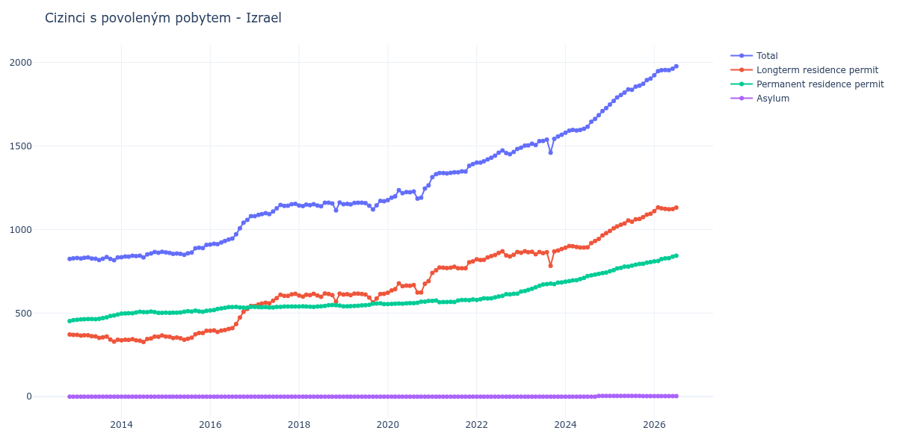

# Izrael

## Souhrnné statistiky (Min/Max pro rok) / Summary Statistics (Min/Max per year)

| Year   | Total         | Longterm Residence Permit   | Permanent Residence Permit   | Asylum   |
|--------|---------------|-----------------------------|------------------------------|----------|
| 2012   | 824 / 828     | 370 / 372                   | 452 / 458                    | 0 / 0    |
| 2013   | 816 / 835     | 330 / 370                   | 460 / 492                    | 0 / 0    |
| 2014   | 833 / 867     | 327 / 366                   | 497 / 509                    | 0 / 0    |
| 2015   | 849 / 908     | 341 / 394                   | 501 / 515                    | 0 / 0    |
| 2016   | 910 / 1 080   | 388 / 543                   | 516 / 537                    | 0 / 0    |
| 2017   | 1 080 / 1 154 | 543 / 615                   | 534 / 540                    | 0 / 0    |
| 2018   | 1 115 / 1 162 | 568 / 618                   | 537 / 548                    | 0 / 0    |
| 2019   | 1 120 / 1 172 | 564 / 617                   | 541 / 558                    | 0 / 0    |
| 2020   | 1 176 / 1 264 | 622 / 691                   | 554 / 573                    | 0 / 0    |
| 2021   | 1 314 / 1 392 | 741 / 810                   | 565 / 582                    | 0 / 0    |
| 2022   | 1 401 / 1 482 | 818 / 870                   | 579 / 616                    | 0 / 0    |
| 2023   | 1 460 / 1 567 | 783 / 883                   | 629 / 684                    | 0 / 0    |
| 2024   | 1 579 / 1 727 | 891 / 979                   | 688 / 743                    | 0 / 5    |
| 2025   | 1 748 / 1 903 | 992 / 1 095                 | 751 / 805                    | 3 / 5    |
| 2026   | 1 923 / 1 977 | 1 110 / 1 133               | 810 / 843                    | 3 / 3    |

## Detailní tabulka / Detailed Data Table

| Date     | Total          | Longterm Residence Permit   | Permanent Residence Permit   | Asylum      |
|----------|----------------|-----------------------------|------------------------------|-------------|
| **2012** |                |                             |                              |             |
| 11.2012  | 824            | 372                         | 452                          | 0           |
| 12.2012  | 828 (+0.49%)   | 370 (-0.54%)                | 458 (+1.33%)                 | 0           |
| **2013** |                |                             |                              |             |
| 01.2013  | 830 (+0.24%)   | 370 (+0.00%)                | 460 (+0.44%)                 | 0           |
| 02.2013  | 827 (-0.36%)   | 365 (-1.35%)                | 462 (+0.43%)                 | 0           |
| 03.2013  | 831 (+0.48%)   | 368 (+0.82%)                | 463 (+0.22%)                 | 0           |
| 04.2013  | 833 (+0.24%)   | 368 (+0.00%)                | 465 (+0.43%)                 | 0           |
| 05.2013  | 827 (-0.72%)   | 362 (-1.63%)                | 465 (+0.00%)                 | 0           |
| 06.2013  | 825 (-0.24%)   | 361 (-0.28%)                | 464 (-0.22%)                 | 0           |
| 07.2013  | 818 (-0.85%)   | 352 (-2.49%)                | 466 (+0.43%)                 | 0           |
| 08.2013  | 825 (+0.86%)   | 355 (+0.85%)                | 470 (+0.86%)                 | 0           |
| 09.2013  | 835 (+1.21%)   | 360 (+1.41%)                | 475 (+1.06%)                 | 0           |
| 10.2013  | 824 (-1.32%)   | 342 (-5.00%)                | 482 (+1.47%)                 | 0           |
| 11.2013  | 816 (-0.97%)   | 330 (-3.51%)                | 486 (+0.83%)                 | 0           |
| 12.2013  | 833 (+2.08%)   | 341 (+3.33%)                | 492 (+1.23%)                 | 0           |
| **2014** |                |                             |                              |             |
| 01.2014  | 834 (+0.12%)   | 337 (-1.17%)                | 497 (+1.02%)                 | 0           |
| 02.2014  | 839 (+0.60%)   | 341 (+1.19%)                | 498 (+0.20%)                 | 0           |
| 03.2014  | 838 (-0.12%)   | 339 (-0.59%)                | 499 (+0.20%)                 | 0           |
| 04.2014  | 843 (+0.60%)   | 344 (+1.47%)                | 499 (+0.00%)                 | 0           |
| 05.2014  | 841 (-0.24%)   | 337 (-2.03%)                | 504 (+1.00%)                 | 0           |
| 06.2014  | 843 (+0.24%)   | 335 (-0.59%)                | 508 (+0.79%)                 | 0           |
| 07.2014  | 833 (-1.19%)   | 327 (-2.39%)                | 506 (-0.39%)                 | 0           |
| 08.2014  | 851 (+2.16%)   | 345 (+5.50%)                | 506 (+0.00%)                 | 0           |
| 09.2014  | 857 (+0.71%)   | 348 (+0.87%)                | 509 (+0.59%)                 | 0           |
| 10.2014  | 866 (+1.05%)   | 360 (+3.45%)                | 506 (-0.59%)                 | 0           |
| 11.2014  | 861 (-0.58%)   | 359 (-0.28%)                | 502 (-0.79%)                 | 0           |
| 12.2014  | 867 (+0.70%)   | 366 (+1.95%)                | 501 (-0.20%)                 | 0           |
| **2015** |                |                             |                              |             |
| 01.2015  | 863 (-0.46%)   | 360 (-1.64%)                | 503 (+0.40%)                 | 0           |
| 02.2015  | 860 (-0.35%)   | 359 (-0.28%)                | 501 (-0.40%)                 | 0           |
| 03.2015  | 854 (-0.70%)   | 351 (-2.23%)                | 503 (+0.40%)                 | 0           |
| 04.2015  | 857 (+0.35%)   | 354 (+0.85%)                | 503 (+0.00%)                 | 0           |
| 05.2015  | 854 (-0.35%)   | 350 (-1.13%)                | 504 (+0.20%)                 | 0           |
| 06.2015  | 849 (-0.59%)   | 341 (-2.57%)                | 508 (+0.79%)                 | 0           |
| 07.2015  | 858 (+1.06%)   | 346 (+1.47%)                | 512 (+0.79%)                 | 0           |
| 08.2015  | 862 (+0.47%)   | 353 (+2.02%)                | 509 (-0.59%)                 | 0           |
| 09.2015  | 888 (+3.02%)   | 373 (+5.67%)                | 515 (+1.18%)                 | 0           |
| 10.2015  | 891 (+0.34%)   | 381 (+2.14%)                | 510 (-0.97%)                 | 0           |
| 11.2015  | 889 (-0.22%)   | 381 (+0.00%)                | 508 (-0.39%)                 | 0           |
| 12.2015  | 908 (+2.14%)   | 394 (+3.41%)                | 514 (+1.18%)                 | 0           |
| **2016** |                |                             |                              |             |
| 01.2016  | 910 (+0.22%)   | 394 (+0.00%)                | 516 (+0.39%)                 | 0           |
| 02.2016  | 915 (+0.55%)   | 397 (+0.76%)                | 518 (+0.39%)                 | 0           |
| 03.2016  | 913 (-0.22%)   | 388 (-2.27%)                | 525 (+1.35%)                 | 0           |
| 04.2016  | 923 (+1.10%)   | 395 (+1.80%)                | 528 (+0.57%)                 | 0           |
| 05.2016  | 931 (+0.87%)   | 399 (+1.01%)                | 532 (+0.76%)                 | 0           |
| 06.2016  | 941 (+1.07%)   | 405 (+1.50%)                | 536 (+0.75%)                 | 0           |
| 07.2016  | 946 (+0.53%)   | 410 (+1.23%)                | 536 (+0.00%)                 | 0           |
| 08.2016  | 972 (+2.75%)   | 435 (+6.10%)                | 537 (+0.19%)                 | 0           |
| 09.2016  | 1 008 (+3.70%) | 474 (+8.97%)                | 534 (-0.56%)                 | 0           |
| 10.2016  | 1 041 (+3.27%) | 508 (+7.17%)                | 533 (-0.19%)                 | 0           |
| 11.2016  | 1 058 (+1.63%) | 525 (+3.35%)                | 533 (+0.00%)                 | 0           |
| 12.2016  | 1 080 (+2.08%) | 543 (+3.43%)                | 537 (+0.75%)                 | 0           |
| **2017** |                |                             |                              |             |
| 01.2017  | 1 080 (+0.00%) | 543 (+0.00%)                | 537 (+0.00%)                 | 0           |
| 02.2017  | 1 088 (+0.74%) | 552 (+1.66%)                | 536 (-0.19%)                 | 0           |
| 03.2017  | 1 092 (+0.37%) | 557 (+0.91%)                | 535 (-0.19%)                 | 0           |
| 04.2017  | 1 098 (+0.55%) | 562 (+0.90%)                | 536 (+0.19%)                 | 0           |
| 05.2017  | 1 092 (-0.55%) | 558 (-0.71%)                | 534 (-0.37%)                 | 0           |
| 06.2017  | 1 108 (+1.47%) | 574 (+2.87%)                | 534 (+0.00%)                 | 0           |
| 07.2017  | 1 127 (+1.71%) | 590 (+2.79%)                | 537 (+0.56%)                 | 0           |
| 08.2017  | 1 147 (+1.77%) | 610 (+3.39%)                | 537 (+0.00%)                 | 0           |
| 09.2017  | 1 142 (-0.44%) | 603 (-1.15%)                | 539 (+0.37%)                 | 0           |
| 10.2017  | 1 143 (+0.09%) | 603 (+0.00%)                | 540 (+0.19%)                 | 0           |
| 11.2017  | 1 152 (+0.79%) | 612 (+1.49%)                | 540 (+0.00%)                 | 0           |
| 12.2017  | 1 154 (+0.17%) | 615 (+0.49%)                | 539 (-0.19%)                 | 0           |
| **2018** |                |                             |                              |             |
| 01.2018  | 1 144 (-0.87%) | 605 (-1.63%)                | 539 (+0.00%)                 | 0           |
| 02.2018  | 1 140 (-0.35%) | 599 (-0.99%)                | 541 (+0.37%)                 | 0           |
| 03.2018  | 1 149 (+0.79%) | 610 (+1.84%)                | 539 (-0.37%)                 | 0           |
| 04.2018  | 1 146 (-0.26%) | 608 (-0.33%)                | 538 (-0.19%)                 | 0           |
| 05.2018  | 1 152 (+0.52%) | 615 (+1.15%)                | 537 (-0.19%)                 | 0           |
| 06.2018  | 1 144 (-0.69%) | 605 (-1.63%)                | 539 (+0.37%)                 | 0           |
| 07.2018  | 1 139 (-0.44%) | 598 (-1.16%)                | 541 (+0.37%)                 | 0           |
| 08.2018  | 1 161 (+1.93%) | 618 (+3.34%)                | 543 (+0.37%)                 | 0           |
| 09.2018  | 1 161 (+0.00%) | 614 (-0.65%)                | 547 (+0.74%)                 | 0           |
| 10.2018  | 1 156 (-0.43%) | 608 (-0.98%)                | 548 (+0.18%)                 | 0           |
| 11.2018  | 1 115 (-3.55%) | 568 (-6.58%)                | 547 (-0.18%)                 | 0           |
| 12.2018  | 1 162 (+4.22%) | 617 (+8.63%)                | 545 (-0.37%)                 | 0           |
| **2019** |                |                             |                              |             |
| 01.2019  | 1 152 (-0.86%) | 611 (-0.97%)                | 541 (-0.73%)                 | 0           |
| 02.2019  | 1 154 (+0.17%) | 613 (+0.33%)                | 541 (+0.00%)                 | 0           |
| 03.2019  | 1 150 (-0.35%) | 608 (-0.82%)                | 542 (+0.18%)                 | 0           |
| 04.2019  | 1 159 (+0.78%) | 616 (+1.32%)                | 543 (+0.18%)                 | 0           |
| 05.2019  | 1 161 (+0.17%) | 617 (+0.16%)                | 544 (+0.18%)                 | 0           |
| 06.2019  | 1 160 (-0.09%) | 614 (-0.49%)                | 546 (+0.37%)                 | 0           |
| 07.2019  | 1 158 (-0.17%) | 611 (-0.49%)                | 547 (+0.18%)                 | 0           |
| 08.2019  | 1 143 (-1.30%) | 593 (-2.95%)                | 550 (+0.55%)                 | 0           |
| 09.2019  | 1 120 (-2.01%) | 564 (-4.89%)                | 556 (+1.09%)                 | 0           |
| 10.2019  | 1 145 (+2.23%) | 588 (+4.26%)                | 557 (+0.18%)                 | 0           |
| 11.2019  | 1 172 (+2.36%) | 614 (+4.42%)                | 558 (+0.18%)                 | 0           |
| 12.2019  | 1 169 (-0.26%) | 615 (+0.16%)                | 554 (-0.72%)                 | 0           |
| **2020** |                |                             |                              |             |
| 01.2020  | 1 176 (+0.60%) | 622 (+1.14%)                | 554 (+0.00%)                 | 0           |
| 02.2020  | 1 191 (+1.28%) | 636 (+2.25%)                | 555 (+0.18%)                 | 0           |
| 03.2020  | 1 199 (+0.67%) | 643 (+1.10%)                | 556 (+0.18%)                 | 0           |
| 04.2020  | 1 235 (+3.00%) | 678 (+5.44%)                | 557 (+0.18%)                 | 0           |
| 05.2020  | 1 217 (-1.46%) | 661 (-2.51%)                | 556 (-0.18%)                 | 0           |
| 06.2020  | 1 224 (+0.58%) | 665 (+0.61%)                | 559 (+0.54%)                 | 0           |
| 07.2020  | 1 223 (-0.08%) | 663 (-0.30%)                | 560 (+0.18%)                 | 0           |
| 08.2020  | 1 228 (+0.41%) | 668 (+0.75%)                | 560 (+0.00%)                 | 0           |
| 09.2020  | 1 185 (-3.50%) | 623 (-6.74%)                | 562 (+0.36%)                 | 0           |
| 10.2020  | 1 191 (+0.51%) | 623 (+0.00%)                | 568 (+1.07%)                 | 0           |
| 11.2020  | 1 245 (+4.53%) | 676 (+8.51%)                | 569 (+0.18%)                 | 0           |
| 12.2020  | 1 264 (+1.53%) | 691 (+2.22%)                | 573 (+0.70%)                 | 0           |
| **2021** |                |                             |                              |             |
| 01.2021  | 1 314 (+3.96%) | 741 (+7.24%)                | 573 (+0.00%)                 | 0           |
| 02.2021  | 1 331 (+1.29%) | 756 (+2.02%)                | 575 (+0.35%)                 | 0           |
| 03.2021  | 1 338 (+0.53%) | 773 (+2.25%)                | 565 (-1.74%)                 | 0           |
| 04.2021  | 1 338 (+0.00%) | 772 (-0.13%)                | 566 (+0.18%)                 | 0           |
| 05.2021  | 1 336 (-0.15%) | 770 (-0.26%)                | 566 (+0.00%)                 | 0           |
| 06.2021  | 1 339 (+0.22%) | 772 (+0.26%)                | 567 (+0.18%)                 | 0           |
| 07.2021  | 1 343 (+0.30%) | 777 (+0.65%)                | 566 (-0.18%)                 | 0           |
| 08.2021  | 1 343 (+0.00%) | 768 (-1.16%)                | 575 (+1.59%)                 | 0           |
| 09.2021  | 1 348 (+0.37%) | 769 (+0.13%)                | 579 (+0.70%)                 | 0           |
| 10.2021  | 1 347 (-0.07%) | 768 (-0.13%)                | 579 (+0.00%)                 | 0           |
| 11.2021  | 1 382 (+2.60%) | 804 (+4.69%)                | 578 (-0.17%)                 | 0           |
| 12.2021  | 1 392 (+0.72%) | 810 (+0.75%)                | 582 (+0.69%)                 | 0           |
| **2022** |                |                             |                              |             |
| 01.2022  | 1 401 (+0.65%) | 822 (+1.48%)                | 579 (-0.52%)                 | 0           |
| 02.2022  | 1 401 (+0.00%) | 818 (-0.49%)                | 583 (+0.69%)                 | 0           |
| 03.2022  | 1 408 (+0.50%) | 819 (+0.12%)                | 589 (+1.03%)                 | 0           |
| 04.2022  | 1 420 (+0.85%) | 833 (+1.71%)                | 587 (-0.34%)                 | 0           |
| 05.2022  | 1 430 (+0.70%) | 841 (+0.96%)                | 589 (+0.34%)                 | 0           |
| 06.2022  | 1 442 (+0.84%) | 848 (+0.83%)                | 594 (+0.85%)                 | 0           |
| 07.2022  | 1 460 (+1.25%) | 860 (+1.42%)                | 600 (+1.01%)                 | 0           |
| 08.2022  | 1 473 (+0.89%) | 870 (+1.16%)                | 603 (+0.50%)                 | 0           |
| 09.2022  | 1 458 (-1.02%) | 845 (-2.87%)                | 613 (+1.66%)                 | 0           |
| 10.2022  | 1 451 (-0.48%) | 839 (-0.71%)                | 612 (-0.16%)                 | 0           |
| 11.2022  | 1 464 (+0.90%) | 849 (+1.19%)                | 615 (+0.49%)                 | 0           |
| 12.2022  | 1 482 (+1.23%) | 866 (+2.00%)                | 616 (+0.16%)                 | 0           |
| **2023** |                |                             |                              |             |
| 01.2023  | 1 490 (+0.54%) | 861 (-0.58%)                | 629 (+2.11%)                 | 0           |
| 02.2023  | 1 502 (+0.81%) | 870 (+1.05%)                | 632 (+0.48%)                 | 0           |
| 03.2023  | 1 503 (+0.07%) | 864 (-0.69%)                | 639 (+1.11%)                 | 0           |
| 04.2023  | 1 513 (+0.67%) | 867 (+0.35%)                | 646 (+1.10%)                 | 0           |
| 05.2023  | 1 506 (-0.46%) | 852 (-1.73%)                | 654 (+1.24%)                 | 0           |
| 06.2023  | 1 529 (+1.53%) | 866 (+1.64%)                | 663 (+1.38%)                 | 0           |
| 07.2023  | 1 530 (+0.07%) | 859 (-0.81%)                | 671 (+1.21%)                 | 0           |
| 08.2023  | 1 538 (+0.52%) | 864 (+0.58%)                | 674 (+0.45%)                 | 0           |
| 09.2023  | 1 460 (-5.07%) | 783 (-9.38%)                | 677 (+0.45%)                 | 0           |
| 10.2023  | 1 542 (+5.62%) | 869 (+10.98%)               | 673 (-0.59%)                 | 0           |
| 11.2023  | 1 557 (+0.97%) | 875 (+0.69%)                | 682 (+1.34%)                 | 0           |
| 12.2023  | 1 567 (+0.64%) | 883 (+0.91%)                | 684 (+0.29%)                 | 0           |
| **2024** |                |                             |                              |             |
| 01.2024  | 1 579 (+0.77%) | 891 (+0.91%)                | 688 (+0.58%)                 | 0           |
| 02.2024  | 1 592 (+0.82%) | 901 (+1.12%)                | 691 (+0.44%)                 | 0           |
| 03.2024  | 1 596 (+0.25%) | 900 (-0.11%)                | 696 (+0.72%)                 | 0           |
| 04.2024  | 1 593 (-0.19%) | 896 (-0.44%)                | 697 (+0.14%)                 | 0           |
| 05.2024  | 1 596 (+0.19%) | 892 (-0.45%)                | 704 (+1.00%)                 | 0           |
| 06.2024  | 1 603 (+0.44%) | 893 (+0.11%)                | 710 (+0.85%)                 | 0           |
| 07.2024  | 1 615 (+0.75%) | 894 (+0.11%)                | 721 (+1.55%)                 | 0           |
| 08.2024  | 1 645 (+1.86%) | 919 (+2.80%)                | 726 (+0.69%)                 | 0           |
| 09.2024  | 1 662 (+1.03%) | 931 (+1.31%)                | 731 (+0.69%)                 | 0           |
| 10.2024  | 1 684 (+1.32%) | 944 (+1.40%)                | 735 (+0.55%)                 | 5           |
| 11.2024  | 1 709 (+1.48%) | 965 (+2.22%)                | 739 (+0.54%)                 | 5 (+0.00%)  |
| 12.2024  | 1 727 (+1.05%) | 979 (+1.45%)                | 743 (+0.54%)                 | 5 (+0.00%)  |
| **2025** |                |                             |                              |             |
| 01.2025  | 1 748 (+1.22%) | 992 (+1.33%)                | 751 (+1.08%)                 | 5 (+0.00%)  |
| 02.2025  | 1 769 (+1.20%) | 1 007 (+1.51%)              | 757 (+0.80%)                 | 5 (+0.00%)  |
| 03.2025  | 1 791 (+1.24%) | 1 019 (+1.19%)              | 767 (+1.32%)                 | 5 (+0.00%)  |
| 04.2025  | 1 805 (+0.78%) | 1 029 (+0.98%)              | 771 (+0.52%)                 | 5 (+0.00%)  |
| 05.2025  | 1 820 (+0.83%) | 1 037 (+0.78%)              | 778 (+0.91%)                 | 5 (+0.00%)  |
| 06.2025  | 1 838 (+0.99%) | 1 054 (+1.64%)              | 779 (+0.13%)                 | 5 (+0.00%)  |
| 07.2025  | 1 836 (-0.11%) | 1 047 (-0.66%)              | 784 (+0.64%)                 | 5 (+0.00%)  |
| 08.2025  | 1 855 (+1.03%) | 1 061 (+1.34%)              | 790 (+0.77%)                 | 4 (-20.00%) |
| 09.2025  | 1 861 (+0.32%) | 1 063 (+0.19%)              | 794 (+0.51%)                 | 4 (+0.00%)  |
| 10.2025  | 1 872 (+0.59%) | 1 074 (+1.03%)              | 795 (+0.13%)                 | 3 (-25.00%) |
| 11.2025  | 1 894 (+1.18%) | 1 089 (+1.40%)              | 802 (+0.88%)                 | 3 (+0.00%)  |
| 12.2025  | 1 903 (+0.48%) | 1 095 (+0.55%)              | 805 (+0.37%)                 | 3 (+0.00%)  |
| **2026** |                |                             |                              |             |
| 01.2026  | 1 923 (+1.05%) | 1 110 (+1.37%)              | 810 (+0.62%)                 | 3 (+0.00%)  |
| 02.2026  | 1 948 (+1.30%) | 1 133 (+2.07%)              | 812 (+0.25%)                 | 3 (+0.00%)  |
| 03.2026  | 1 953 (+0.26%) | 1 127 (-0.53%)              | 823 (+1.35%)                 | 3 (+0.00%)  |
| 04.2026  | 1 955 (+0.10%) | 1 124 (-0.27%)              | 828 (+0.61%)                 | 3 (+0.00%)  |
| 05.2026  | 1 953 (-0.10%) | 1 121 (-0.27%)              | 829 (+0.12%)                 | 3 (+0.00%)  |
| 06.2026  | 1 963 (+0.51%) | 1 122 (+0.09%)              | 838 (+1.09%)                 | 3 (+0.00%)  |
| 07.2026  | 1 977 (+0.71%) | 1 131 (+0.80%)              | 843 (+0.60%)                 | 3 (+0.00%)  |
