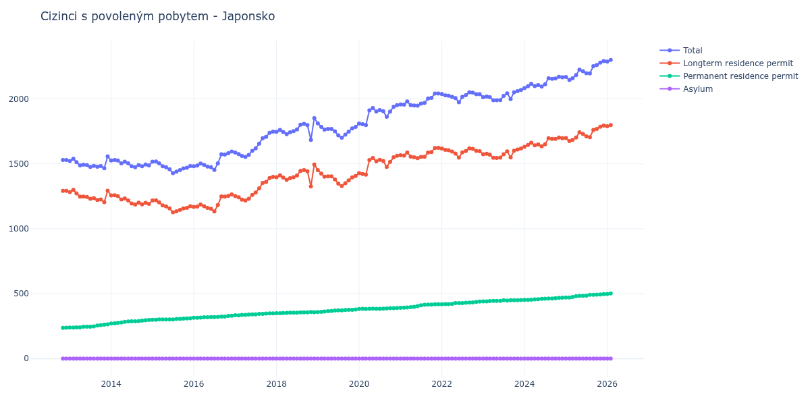

# Japonsko

## Souhrnné statistiky (Min/Max pro rok) / Summary Statistics (Min/Max per year)

| Year   | Total         | Longterm Residence Permit   | Permanent Residence Permit   | Asylum   |
|--------|---------------|-----------------------------|------------------------------|----------|
| 2012   | 1 529 / 1 529 | 1 291 / 1 292               | 237 / 238                    | 0 / 0    |
| 2013   | 1 466 / 1 557 | 1 205 / 1 300               | 239 / 264                    | 0 / 0    |
| 2014   | 1 474 / 1 529 | 1 187 / 1 258               | 270 / 297                    | 0 / 0    |
| 2015   | 1 428 / 1 518 | 1 126 / 1 219               | 299 / 310                    | 0 / 0    |
| 2016   | 1 453 / 1 595 | 1 133 / 1 265               | 314 / 330                    | 0 / 0    |
| 2017   | 1 553 / 1 748 | 1 217 / 1 400               | 333 / 348                    | 0 / 0    |
| 2018   | 1 684 / 1 852 | 1 326 / 1 495               | 349 / 358                    | 0 / 0    |
| 2019   | 1 701 / 1 811 | 1 329 / 1 452               | 359 / 378                    | 0 / 0    |
| 2020   | 1 799 / 1 952 | 1 417 / 1 562               | 382 / 390                    | 0 / 0    |
| 2021   | 1 948 / 2 042 | 1 544 / 1 623               | 391 / 419                    | 0 / 0    |
| 2022   | 1 974 / 2 051 | 1 547 / 1 619               | 419 / 439                    | 0 / 0    |
| 2023   | 1 989 / 2 069 | 1 545 / 1 618               | 440 / 451                    | 0 / 0    |
| 2024   | 2 083 / 2 170 | 1 631 / 1 702               | 452 / 469                    | 0 / 0    |
| 2025   | 2 146 / 2 291 | 1 675 / 1 795               | 470 / 496                    | 0 / 0    |
| 2026   | 2 287 / 2 300 | 1 789 / 1 799               | 498 / 501                    | 0 / 0    |

## Detailní tabulka / Detailed Data Table

| Date     | Total          | Longterm Residence Permit   | Permanent Residence Permit   | Asylum   |
|----------|----------------|-----------------------------|------------------------------|----------|
| **2012** |                |                             |                              |          |
| 11.2012  | 1 529          | 1 292                       | 237                          | 0        |
| 12.2012  | 1 529 (+0.00%) | 1 291 (-0.08%)              | 238 (+0.42%)                 | 0        |
| **2013** |                |                             |                              |          |
| 01.2013  | 1 522 (-0.46%) | 1 283 (-0.62%)              | 239 (+0.42%)                 | 0        |
| 02.2013  | 1 539 (+1.12%) | 1 300 (+1.33%)              | 239 (+0.00%)                 | 0        |
| 03.2013  | 1 512 (-1.75%) | 1 272 (-2.15%)              | 240 (+0.42%)                 | 0        |
| 04.2013  | 1 488 (-1.59%) | 1 247 (-1.97%)              | 241 (+0.42%)                 | 0        |
| 05.2013  | 1 493 (+0.34%) | 1 248 (+0.08%)              | 245 (+1.66%)                 | 0        |
| 06.2013  | 1 491 (-0.13%) | 1 245 (-0.24%)              | 246 (+0.41%)                 | 0        |
| 07.2013  | 1 476 (-1.01%) | 1 230 (-1.20%)              | 246 (+0.00%)                 | 0        |
| 08.2013  | 1 484 (+0.54%) | 1 236 (+0.49%)              | 248 (+0.81%)                 | 0        |
| 09.2013  | 1 477 (-0.47%) | 1 222 (-1.13%)              | 255 (+2.82%)                 | 0        |
| 10.2013  | 1 483 (+0.41%) | 1 226 (+0.33%)              | 257 (+0.78%)                 | 0        |
| 11.2013  | 1 466 (-1.15%) | 1 205 (-1.71%)              | 261 (+1.56%)                 | 0        |
| 12.2013  | 1 557 (+6.21%) | 1 293 (+7.30%)              | 264 (+1.15%)                 | 0        |
| **2014** |                |                             |                              |          |
| 01.2014  | 1 526 (-1.99%) | 1 256 (-2.86%)              | 270 (+2.27%)                 | 0        |
| 02.2014  | 1 529 (+0.20%) | 1 258 (+0.16%)              | 271 (+0.37%)                 | 0        |
| 03.2014  | 1 525 (-0.26%) | 1 251 (-0.56%)              | 274 (+1.11%)                 | 0        |
| 04.2014  | 1 504 (-1.38%) | 1 226 (-2.00%)              | 278 (+1.46%)                 | 0        |
| 05.2014  | 1 516 (+0.80%) | 1 233 (+0.57%)              | 283 (+1.80%)                 | 0        |
| 06.2014  | 1 504 (-0.79%) | 1 218 (-1.22%)              | 286 (+1.06%)                 | 0        |
| 07.2014  | 1 481 (-1.53%) | 1 194 (-1.97%)              | 287 (+0.35%)                 | 0        |
| 08.2014  | 1 474 (-0.47%) | 1 187 (-0.59%)              | 287 (+0.00%)                 | 0        |
| 09.2014  | 1 490 (+1.09%) | 1 201 (+1.18%)              | 289 (+0.70%)                 | 0        |
| 10.2014  | 1 481 (-0.60%) | 1 188 (-1.08%)              | 293 (+1.38%)                 | 0        |
| 11.2014  | 1 495 (+0.95%) | 1 200 (+1.01%)              | 295 (+0.68%)                 | 0        |
| 12.2014  | 1 488 (-0.47%) | 1 191 (-0.75%)              | 297 (+0.68%)                 | 0        |
| **2015** |                |                             |                              |          |
| 01.2015  | 1 516 (+1.88%) | 1 217 (+2.18%)              | 299 (+0.67%)                 | 0        |
| 02.2015  | 1 518 (+0.13%) | 1 219 (+0.16%)              | 299 (+0.00%)                 | 0        |
| 03.2015  | 1 504 (-0.92%) | 1 203 (-1.31%)              | 301 (+0.67%)                 | 0        |
| 04.2015  | 1 481 (-1.53%) | 1 180 (-1.91%)              | 301 (+0.00%)                 | 0        |
| 05.2015  | 1 473 (-0.54%) | 1 172 (-0.68%)              | 301 (+0.00%)                 | 0        |
| 06.2015  | 1 458 (-1.02%) | 1 156 (-1.37%)              | 302 (+0.33%)                 | 0        |
| 07.2015  | 1 428 (-2.06%) | 1 126 (-2.60%)              | 302 (+0.00%)                 | 0        |
| 08.2015  | 1 440 (+0.84%) | 1 134 (+0.71%)              | 306 (+1.32%)                 | 0        |
| 09.2015  | 1 451 (+0.76%) | 1 145 (+0.97%)              | 306 (+0.00%)                 | 0        |
| 10.2015  | 1 464 (+0.90%) | 1 156 (+0.96%)              | 308 (+0.65%)                 | 0        |
| 11.2015  | 1 470 (+0.41%) | 1 161 (+0.43%)              | 309 (+0.32%)                 | 0        |
| 12.2015  | 1 483 (+0.88%) | 1 173 (+1.03%)              | 310 (+0.32%)                 | 0        |
| **2016** |                |                             |                              |          |
| 01.2016  | 1 482 (-0.07%) | 1 168 (-0.43%)              | 314 (+1.29%)                 | 0        |
| 02.2016  | 1 486 (+0.27%) | 1 171 (+0.26%)              | 315 (+0.32%)                 | 0        |
| 03.2016  | 1 502 (+1.08%) | 1 186 (+1.28%)              | 316 (+0.32%)                 | 0        |
| 04.2016  | 1 492 (-0.67%) | 1 174 (-1.01%)              | 318 (+0.63%)                 | 0        |
| 05.2016  | 1 479 (-0.87%) | 1 160 (-1.19%)              | 319 (+0.31%)                 | 0        |
| 06.2016  | 1 474 (-0.34%) | 1 154 (-0.52%)              | 320 (+0.31%)                 | 0        |
| 07.2016  | 1 453 (-1.42%) | 1 133 (-1.82%)              | 320 (+0.00%)                 | 0        |
| 08.2016  | 1 503 (+3.44%) | 1 182 (+4.32%)              | 321 (+0.31%)                 | 0        |
| 09.2016  | 1 573 (+4.66%) | 1 249 (+5.67%)              | 324 (+0.93%)                 | 0        |
| 10.2016  | 1 571 (-0.13%) | 1 247 (-0.16%)              | 324 (+0.00%)                 | 0        |
| 11.2016  | 1 582 (+0.70%) | 1 253 (+0.48%)              | 329 (+1.54%)                 | 0        |
| 12.2016  | 1 595 (+0.82%) | 1 265 (+0.96%)              | 330 (+0.30%)                 | 0        |
| **2017** |                |                             |                              |          |
| 01.2017  | 1 586 (-0.56%) | 1 252 (-1.03%)              | 334 (+1.21%)                 | 0        |
| 02.2017  | 1 575 (-0.69%) | 1 242 (-0.80%)              | 333 (-0.30%)                 | 0        |
| 03.2017  | 1 560 (-0.95%) | 1 224 (-1.45%)              | 336 (+0.90%)                 | 0        |
| 04.2017  | 1 553 (-0.45%) | 1 217 (-0.57%)              | 336 (+0.00%)                 | 0        |
| 05.2017  | 1 569 (+1.03%) | 1 230 (+1.07%)              | 339 (+0.89%)                 | 0        |
| 06.2017  | 1 600 (+1.98%) | 1 260 (+2.44%)              | 340 (+0.29%)                 | 0        |
| 07.2017  | 1 619 (+1.19%) | 1 279 (+1.51%)              | 340 (+0.00%)                 | 0        |
| 08.2017  | 1 655 (+2.22%) | 1 311 (+2.50%)              | 344 (+1.18%)                 | 0        |
| 09.2017  | 1 697 (+2.54%) | 1 353 (+3.20%)              | 344 (+0.00%)                 | 0        |
| 10.2017  | 1 708 (+0.65%) | 1 361 (+0.59%)              | 347 (+0.87%)                 | 0        |
| 11.2017  | 1 738 (+1.76%) | 1 390 (+2.13%)              | 348 (+0.29%)                 | 0        |
| 12.2017  | 1 748 (+0.58%) | 1 400 (+0.72%)              | 348 (+0.00%)                 | 0        |
| **2018** |                |                             |                              |          |
| 01.2018  | 1 746 (-0.11%) | 1 397 (-0.21%)              | 349 (+0.29%)                 | 0        |
| 02.2018  | 1 761 (+0.86%) | 1 411 (+1.00%)              | 350 (+0.29%)                 | 0        |
| 03.2018  | 1 745 (-0.91%) | 1 394 (-1.20%)              | 351 (+0.29%)                 | 0        |
| 04.2018  | 1 728 (-0.97%) | 1 376 (-1.29%)              | 352 (+0.28%)                 | 0        |
| 05.2018  | 1 742 (+0.81%) | 1 389 (+0.94%)              | 353 (+0.28%)                 | 0        |
| 06.2018  | 1 751 (+0.52%) | 1 397 (+0.58%)              | 354 (+0.28%)                 | 0        |
| 07.2018  | 1 764 (+0.74%) | 1 410 (+0.93%)              | 354 (+0.00%)                 | 0        |
| 08.2018  | 1 801 (+2.10%) | 1 445 (+2.48%)              | 356 (+0.56%)                 | 0        |
| 09.2018  | 1 808 (+0.39%) | 1 452 (+0.48%)              | 356 (+0.00%)                 | 0        |
| 10.2018  | 1 798 (-0.55%) | 1 442 (-0.69%)              | 356 (+0.00%)                 | 0        |
| 11.2018  | 1 684 (-6.34%) | 1 326 (-8.04%)              | 358 (+0.56%)                 | 0        |
| 12.2018  | 1 852 (+9.98%) | 1 495 (+12.75%)             | 357 (-0.28%)                 | 0        |
| **2019** |                |                             |                              |          |
| 01.2019  | 1 811 (-2.21%) | 1 452 (-2.88%)              | 359 (+0.56%)                 | 0        |
| 02.2019  | 1 784 (-1.49%) | 1 424 (-1.93%)              | 360 (+0.28%)                 | 0        |
| 03.2019  | 1 763 (-1.18%) | 1 401 (-1.62%)              | 362 (+0.56%)                 | 0        |
| 04.2019  | 1 768 (+0.28%) | 1 403 (+0.14%)              | 365 (+0.83%)                 | 0        |
| 05.2019  | 1 769 (+0.06%) | 1 403 (+0.00%)              | 366 (+0.27%)                 | 0        |
| 06.2019  | 1 750 (-1.07%) | 1 380 (-1.64%)              | 370 (+1.09%)                 | 0        |
| 07.2019  | 1 719 (-1.77%) | 1 348 (-2.32%)              | 371 (+0.27%)                 | 0        |
| 08.2019  | 1 701 (-1.05%) | 1 329 (-1.41%)              | 372 (+0.27%)                 | 0        |
| 09.2019  | 1 724 (+1.35%) | 1 350 (+1.58%)              | 374 (+0.54%)                 | 0        |
| 10.2019  | 1 748 (+1.39%) | 1 372 (+1.63%)              | 376 (+0.53%)                 | 0        |
| 11.2019  | 1 772 (+1.37%) | 1 396 (+1.75%)              | 376 (+0.00%)                 | 0        |
| 12.2019  | 1 784 (+0.68%) | 1 406 (+0.72%)              | 378 (+0.53%)                 | 0        |
| **2020** |                |                             |                              |          |
| 01.2020  | 1 810 (+1.46%) | 1 428 (+1.56%)              | 382 (+1.06%)                 | 0        |
| 02.2020  | 1 805 (-0.28%) | 1 422 (-0.42%)              | 383 (+0.26%)                 | 0        |
| 03.2020  | 1 799 (-0.33%) | 1 417 (-0.35%)              | 382 (-0.26%)                 | 0        |
| 04.2020  | 1 912 (+6.28%) | 1 529 (+7.90%)              | 383 (+0.26%)                 | 0        |
| 05.2020  | 1 930 (+0.94%) | 1 545 (+1.05%)              | 385 (+0.52%)                 | 0        |
| 06.2020  | 1 902 (-1.45%) | 1 519 (-1.68%)              | 383 (-0.52%)                 | 0        |
| 07.2020  | 1 914 (+0.63%) | 1 531 (+0.79%)              | 383 (+0.00%)                 | 0        |
| 08.2020  | 1 905 (-0.47%) | 1 521 (-0.65%)              | 384 (+0.26%)                 | 0        |
| 09.2020  | 1 862 (-2.26%) | 1 476 (-2.96%)              | 386 (+0.52%)                 | 0        |
| 10.2020  | 1 903 (+2.20%) | 1 515 (+2.64%)              | 388 (+0.52%)                 | 0        |
| 11.2020  | 1 939 (+1.89%) | 1 550 (+2.31%)              | 389 (+0.26%)                 | 0        |
| 12.2020  | 1 952 (+0.67%) | 1 562 (+0.77%)              | 390 (+0.26%)                 | 0        |
| **2021** |                |                             |                              |          |
| 01.2021  | 1 957 (+0.26%) | 1 566 (+0.26%)              | 391 (+0.26%)                 | 0        |
| 02.2021  | 1 956 (-0.05%) | 1 563 (-0.19%)              | 393 (+0.51%)                 | 0        |
| 03.2021  | 1 980 (+1.23%) | 1 586 (+1.47%)              | 394 (+0.25%)                 | 0        |
| 04.2021  | 1 952 (-1.41%) | 1 556 (-1.89%)              | 396 (+0.51%)                 | 0        |
| 05.2021  | 1 949 (-0.15%) | 1 550 (-0.39%)              | 399 (+0.76%)                 | 0        |
| 06.2021  | 1 948 (-0.05%) | 1 544 (-0.39%)              | 404 (+1.25%)                 | 0        |
| 07.2021  | 1 963 (+0.77%) | 1 553 (+0.58%)              | 410 (+1.49%)                 | 0        |
| 08.2021  | 1 969 (+0.31%) | 1 554 (+0.06%)              | 415 (+1.22%)                 | 0        |
| 09.2021  | 2 003 (+1.73%) | 1 587 (+2.12%)              | 416 (+0.24%)                 | 0        |
| 10.2021  | 2 007 (+0.20%) | 1 591 (+0.25%)              | 416 (+0.00%)                 | 0        |
| 11.2021  | 2 041 (+1.69%) | 1 622 (+1.95%)              | 419 (+0.72%)                 | 0        |
| 12.2021  | 2 042 (+0.05%) | 1 623 (+0.06%)              | 419 (+0.00%)                 | 0        |
| **2022** |                |                             |                              |          |
| 01.2022  | 2 037 (-0.24%) | 1 618 (-0.31%)              | 419 (+0.00%)                 | 0        |
| 02.2022  | 2 027 (-0.49%) | 1 607 (-0.68%)              | 420 (+0.24%)                 | 0        |
| 03.2022  | 2 025 (-0.10%) | 1 605 (-0.12%)              | 420 (+0.00%)                 | 0        |
| 04.2022  | 2 016 (-0.44%) | 1 595 (-0.62%)              | 421 (+0.24%)                 | 0        |
| 05.2022  | 2 006 (-0.50%) | 1 579 (-1.00%)              | 427 (+1.43%)                 | 0        |
| 06.2022  | 1 974 (-1.60%) | 1 547 (-2.03%)              | 427 (+0.00%)                 | 0        |
| 07.2022  | 2 015 (+2.08%) | 1 588 (+2.65%)              | 427 (+0.00%)                 | 0        |
| 08.2022  | 2 028 (+0.65%) | 1 598 (+0.63%)              | 430 (+0.70%)                 | 0        |
| 09.2022  | 2 051 (+1.13%) | 1 619 (+1.31%)              | 432 (+0.47%)                 | 0        |
| 10.2022  | 2 048 (-0.15%) | 1 615 (-0.25%)              | 433 (+0.23%)                 | 0        |
| 11.2022  | 2 036 (-0.59%) | 1 599 (-0.99%)              | 437 (+0.92%)                 | 0        |
| 12.2022  | 2 036 (+0.00%) | 1 597 (-0.13%)              | 439 (+0.46%)                 | 0        |
| **2023** |                |                             |                              |          |
| 01.2023  | 2 013 (-1.13%) | 1 573 (-1.50%)              | 440 (+0.23%)                 | 0        |
| 02.2023  | 2 018 (+0.25%) | 1 577 (+0.25%)              | 441 (+0.23%)                 | 0        |
| 03.2023  | 2 013 (-0.25%) | 1 570 (-0.44%)              | 443 (+0.45%)                 | 0        |
| 04.2023  | 1 990 (-1.14%) | 1 546 (-1.53%)              | 444 (+0.23%)                 | 0        |
| 05.2023  | 1 989 (-0.05%) | 1 545 (-0.06%)              | 444 (+0.00%)                 | 0        |
| 06.2023  | 1 991 (+0.10%) | 1 547 (+0.13%)              | 444 (+0.00%)                 | 0        |
| 07.2023  | 2 023 (+1.61%) | 1 574 (+1.75%)              | 449 (+1.13%)                 | 0        |
| 08.2023  | 2 043 (+0.99%) | 1 596 (+1.40%)              | 447 (-0.45%)                 | 0        |
| 09.2023  | 1 998 (-2.20%) | 1 549 (-2.94%)              | 449 (+0.45%)                 | 0        |
| 10.2023  | 2 051 (+2.65%) | 1 601 (+3.36%)              | 450 (+0.22%)                 | 0        |
| 11.2023  | 2 060 (+0.44%) | 1 610 (+0.56%)              | 450 (+0.00%)                 | 0        |
| 12.2023  | 2 069 (+0.44%) | 1 618 (+0.50%)              | 451 (+0.22%)                 | 0        |
| **2024** |                |                             |                              |          |
| 01.2024  | 2 083 (+0.68%) | 1 631 (+0.80%)              | 452 (+0.22%)                 | 0        |
| 02.2024  | 2 097 (+0.67%) | 1 645 (+0.86%)              | 452 (+0.00%)                 | 0        |
| 03.2024  | 2 115 (+0.86%) | 1 662 (+1.03%)              | 453 (+0.22%)                 | 0        |
| 04.2024  | 2 098 (-0.80%) | 1 642 (-1.20%)              | 456 (+0.66%)                 | 0        |
| 05.2024  | 2 107 (+0.43%) | 1 649 (+0.43%)              | 458 (+0.44%)                 | 0        |
| 06.2024  | 2 095 (-0.57%) | 1 635 (-0.85%)              | 460 (+0.44%)                 | 0        |
| 07.2024  | 2 111 (+0.76%) | 1 650 (+0.92%)              | 461 (+0.22%)                 | 0        |
| 08.2024  | 2 159 (+2.27%) | 1 697 (+2.85%)              | 462 (+0.22%)                 | 0        |
| 09.2024  | 2 155 (-0.19%) | 1 692 (-0.29%)              | 463 (+0.22%)                 | 0        |
| 10.2024  | 2 157 (+0.09%) | 1 692 (+0.00%)              | 465 (+0.43%)                 | 0        |
| 11.2024  | 2 170 (+0.60%) | 1 702 (+0.59%)              | 468 (+0.65%)                 | 0        |
| 12.2024  | 2 166 (-0.18%) | 1 697 (-0.29%)              | 469 (+0.21%)                 | 0        |
| **2025** |                |                             |                              |          |
| 01.2025  | 2 169 (+0.14%) | 1 699 (+0.12%)              | 470 (+0.21%)                 | 0        |
| 02.2025  | 2 146 (-1.06%) | 1 675 (-1.41%)              | 471 (+0.21%)                 | 0        |
| 03.2025  | 2 158 (+0.56%) | 1 684 (+0.54%)              | 474 (+0.64%)                 | 0        |
| 04.2025  | 2 183 (+1.16%) | 1 702 (+1.07%)              | 481 (+1.48%)                 | 0        |
| 05.2025  | 2 225 (+1.92%) | 1 742 (+2.35%)              | 483 (+0.42%)                 | 0        |
| 06.2025  | 2 213 (-0.54%) | 1 730 (-0.69%)              | 483 (+0.00%)                 | 0        |
| 07.2025  | 2 197 (-0.72%) | 1 712 (-1.04%)              | 485 (+0.41%)                 | 0        |
| 08.2025  | 2 196 (-0.05%) | 1 705 (-0.41%)              | 491 (+1.24%)                 | 0        |
| 09.2025  | 2 252 (+2.55%) | 1 761 (+3.28%)              | 491 (+0.00%)                 | 0        |
| 10.2025  | 2 261 (+0.40%) | 1 769 (+0.45%)              | 492 (+0.20%)                 | 0        |
| 11.2025  | 2 279 (+0.80%) | 1 785 (+0.90%)              | 494 (+0.41%)                 | 0        |
| 12.2025  | 2 291 (+0.53%) | 1 795 (+0.56%)              | 496 (+0.40%)                 | 0        |
| **2026** |                |                             |                              |          |
| 01.2026  | 2 287 (-0.17%) | 1 789 (-0.33%)              | 498 (+0.40%)                 | 0        |
| 02.2026  | 2 300 (+0.57%) | 1 799 (+0.56%)              | 501 (+0.60%)                 | 0        |
