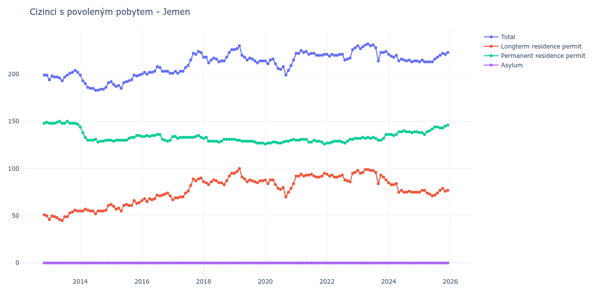

# Jemen

## Souhrnné statistiky (Min/Max pro rok) / Summary Statistics (Min/Max per year)

| Year   | Total Min/Max   | Longterm Residence Permit Min/Max   | Permanent Residence Permit Min/Max   | Asylum Min/Max   |
|--------|-----------------|-------------------------------------|--------------------------------------|------------------|
| 2012   | 199 / 199       | 50 / 51                             | 148 / 149                            | 0 / 0            |
| 2013   | 193 / 204       | 45 / 56                             | 147 / 150                            | 0 / 0            |
| 2014   | 183 / 199       | 52 / 61                             | 128 / 144                            | 0 / 0            |
| 2015   | 185 / 199       | 55 / 66                             | 129 / 135                            | 0 / 0            |
| 2016   | 200 / 208       | 65 / 74                             | 129 / 136                            | 0 / 0            |
| 2017   | 201 / 224       | 67 / 90                             | 132 / 135                            | 0 / 0            |
| 2018   | 212 / 226       | 83 / 95                             | 128 / 133                            | 0 / 0            |
| 2019   | 212 / 230       | 85 / 100                            | 127 / 131                            | 0 / 0            |
| 2020   | 199 / 216       | 70 / 88                             | 126 / 131                            | 0 / 0            |
| 2021   | 220 / 225       | 91 / 95                             | 126 / 131                            | 0 / 0            |
| 2022   | 215 / 228       | 86 / 96                             | 127 / 132                            | 0 / 0            |
| 2023   | 214 / 232       | 84 / 99                             | 130 / 136                            | 0 / 0            |
| 2024   | 213 / 221       | 75 / 85                             | 135 / 140                            | 0 / 0            |
| 2025   | 213 / 223       | 71 / 79                             | 136 / 146                            | 0 / 0            |

## Detailní tabulka / Detailed Data Table

| Date     | Total        | Longterm Residence Permit   | Permanent Residence Permit   | Asylum   |
|----------|--------------|-----------------------------|------------------------------|----------|
| **2012** |              |                             |                              |          |
| 11.2012  | 199          | 51                          | 148                          | 0        |
| 12.2012  | 199 (+0.00%) | 50 (-1.96%)                 | 149 (+0.68%)                 | 0        |
| **2013** |              |                             |                              |          |
| 01.2013  | 194 (-2.51%) | 46 (-8.00%)                 | 148 (-0.67%)                 | 0        |
| 02.2013  | 198 (+2.06%) | 50 (+8.70%)                 | 148 (+0.00%)                 | 0        |
| 03.2013  | 197 (-0.51%) | 49 (-2.00%)                 | 148 (+0.00%)                 | 0        |
| 04.2013  | 197 (+0.00%) | 48 (-2.04%)                 | 149 (+0.68%)                 | 0        |
| 05.2013  | 196 (-0.51%) | 46 (-4.17%)                 | 150 (+0.67%)                 | 0        |
| 06.2013  | 193 (-1.53%) | 45 (-2.17%)                 | 148 (-1.33%)                 | 0        |
| 07.2013  | 197 (+2.07%) | 49 (+8.89%)                 | 148 (+0.00%)                 | 0        |
| 08.2013  | 199 (+1.02%) | 49 (+0.00%)                 | 150 (+1.35%)                 | 0        |
| 09.2013  | 201 (+1.01%) | 53 (+8.16%)                 | 148 (-1.33%)                 | 0        |
| 10.2013  | 202 (+0.50%) | 54 (+1.89%)                 | 148 (+0.00%)                 | 0        |
| 11.2013  | 204 (+0.99%) | 56 (+3.70%)                 | 148 (+0.00%)                 | 0        |
| 12.2013  | 202 (-0.98%) | 55 (-1.79%)                 | 147 (-0.68%)                 | 0        |
| **2014** |              |                             |                              |          |
| 01.2014  | 199 (-1.49%) | 55 (+0.00%)                 | 144 (-2.04%)                 | 0        |
| 02.2014  | 193 (-3.02%) | 55 (+0.00%)                 | 138 (-4.17%)                 | 0        |
| 03.2014  | 190 (-1.55%) | 57 (+3.64%)                 | 133 (-3.62%)                 | 0        |
| 04.2014  | 186 (-2.11%) | 56 (-1.75%)                 | 130 (-2.26%)                 | 0        |
| 05.2014  | 185 (-0.54%) | 55 (-1.79%)                 | 130 (+0.00%)                 | 0        |
| 06.2014  | 185 (+0.00%) | 55 (+0.00%)                 | 130 (+0.00%)                 | 0        |
| 07.2014  | 183 (-1.08%) | 52 (-5.45%)                 | 131 (+0.77%)                 | 0        |
| 08.2014  | 183 (+0.00%) | 55 (+5.77%)                 | 128 (-2.29%)                 | 0        |
| 09.2014  | 184 (+0.55%) | 55 (+0.00%)                 | 129 (+0.78%)                 | 0        |
| 10.2014  | 184 (+0.00%) | 55 (+0.00%)                 | 129 (+0.00%)                 | 0        |
| 11.2014  | 186 (+1.09%) | 56 (+1.82%)                 | 130 (+0.78%)                 | 0        |
| 12.2014  | 191 (+2.69%) | 61 (+8.93%)                 | 130 (+0.00%)                 | 0        |
| **2015** |              |                             |                              |          |
| 01.2015  | 192 (+0.52%) | 62 (+1.64%)                 | 130 (+0.00%)                 | 0        |
| 02.2015  | 189 (-1.56%) | 60 (-3.23%)                 | 129 (-0.77%)                 | 0        |
| 03.2015  | 187 (-1.06%) | 57 (-5.00%)                 | 130 (+0.78%)                 | 0        |
| 04.2015  | 188 (+0.53%) | 58 (+1.75%)                 | 130 (+0.00%)                 | 0        |
| 05.2015  | 185 (-1.60%) | 55 (-5.17%)                 | 130 (+0.00%)                 | 0        |
| 06.2015  | 191 (+3.24%) | 61 (+10.91%)                | 130 (+0.00%)                 | 0        |
| 07.2015  | 192 (+0.52%) | 62 (+1.64%)                 | 130 (+0.00%)                 | 0        |
| 08.2015  | 193 (+0.52%) | 61 (-1.61%)                 | 132 (+1.54%)                 | 0        |
| 09.2015  | 194 (+0.52%) | 61 (+0.00%)                 | 133 (+0.76%)                 | 0        |
| 10.2015  | 199 (+2.58%) | 66 (+8.20%)                 | 133 (+0.00%)                 | 0        |
| 11.2015  | 198 (-0.50%) | 63 (-4.55%)                 | 135 (+1.50%)                 | 0        |
| 12.2015  | 199 (+0.51%) | 64 (+1.59%)                 | 135 (+0.00%)                 | 0        |
| **2016** |              |                             |                              |          |
| 01.2016  | 200 (+0.50%) | 66 (+3.12%)                 | 134 (-0.74%)                 | 0        |
| 02.2016  | 202 (+1.00%) | 68 (+3.03%)                 | 134 (+0.00%)                 | 0        |
| 03.2016  | 200 (-0.99%) | 65 (-4.41%)                 | 135 (+0.75%)                 | 0        |
| 04.2016  | 202 (+1.00%) | 68 (+4.62%)                 | 134 (-0.74%)                 | 0        |
| 05.2016  | 202 (+0.00%) | 67 (-1.47%)                 | 135 (+0.75%)                 | 0        |
| 06.2016  | 203 (+0.50%) | 68 (+1.49%)                 | 135 (+0.00%)                 | 0        |
| 07.2016  | 208 (+2.46%) | 72 (+5.88%)                 | 136 (+0.74%)                 | 0        |
| 08.2016  | 207 (-0.48%) | 71 (-1.39%)                 | 136 (+0.00%)                 | 0        |
| 09.2016  | 203 (-1.93%) | 72 (+1.41%)                 | 131 (-3.68%)                 | 0        |
| 10.2016  | 203 (+0.00%) | 73 (+1.39%)                 | 130 (-0.76%)                 | 0        |
| 11.2016  | 203 (+0.00%) | 74 (+1.37%)                 | 129 (-0.77%)                 | 0        |
| 12.2016  | 201 (-0.99%) | 71 (-4.05%)                 | 130 (+0.78%)                 | 0        |
| **2017** |              |                             |                              |          |
| 01.2017  | 201 (+0.00%) | 67 (-5.63%)                 | 134 (+3.08%)                 | 0        |
| 02.2017  | 203 (+1.00%) | 69 (+2.99%)                 | 134 (+0.00%)                 | 0        |
| 03.2017  | 201 (-0.99%) | 69 (+0.00%)                 | 132 (-1.49%)                 | 0        |
| 04.2017  | 203 (+1.00%) | 70 (+1.45%)                 | 133 (+0.76%)                 | 0        |
| 05.2017  | 203 (+0.00%) | 70 (+0.00%)                 | 133 (+0.00%)                 | 0        |
| 06.2017  | 207 (+1.97%) | 74 (+5.71%)                 | 133 (+0.00%)                 | 0        |
| 07.2017  | 209 (+0.97%) | 76 (+2.70%)                 | 133 (+0.00%)                 | 0        |
| 08.2017  | 215 (+2.87%) | 82 (+7.89%)                 | 133 (+0.00%)                 | 0        |
| 09.2017  | 222 (+3.26%) | 89 (+8.54%)                 | 133 (+0.00%)                 | 0        |
| 10.2017  | 221 (-0.45%) | 87 (-2.25%)                 | 134 (+0.75%)                 | 0        |
| 11.2017  | 224 (+1.36%) | 89 (+2.30%)                 | 135 (+0.75%)                 | 0        |
| 12.2017  | 223 (-0.45%) | 90 (+1.12%)                 | 133 (-1.48%)                 | 0        |
| **2018** |              |                             |                              |          |
| 01.2018  | 218 (-2.24%) | 86 (-4.44%)                 | 132 (-0.75%)                 | 0        |
| 02.2018  | 218 (+0.00%) | 85 (-1.16%)                 | 133 (+0.76%)                 | 0        |
| 03.2018  | 212 (-2.75%) | 83 (-2.35%)                 | 129 (-3.01%)                 | 0        |
| 04.2018  | 215 (+1.42%) | 86 (+3.61%)                 | 129 (+0.00%)                 | 0        |
| 05.2018  | 217 (+0.93%) | 88 (+2.33%)                 | 129 (+0.00%)                 | 0        |
| 06.2018  | 216 (-0.46%) | 87 (-1.14%)                 | 129 (+0.00%)                 | 0        |
| 07.2018  | 213 (-1.39%) | 85 (-2.30%)                 | 128 (-0.78%)                 | 0        |
| 08.2018  | 214 (+0.47%) | 85 (+0.00%)                 | 129 (+0.78%)                 | 0        |
| 09.2018  | 214 (+0.00%) | 83 (-2.35%)                 | 131 (+1.55%)                 | 0        |
| 10.2018  | 218 (+1.87%) | 87 (+4.82%)                 | 131 (+0.00%)                 | 0        |
| 11.2018  | 223 (+2.29%) | 92 (+5.75%)                 | 131 (+0.00%)                 | 0        |
| 12.2018  | 226 (+1.35%) | 95 (+3.26%)                 | 131 (+0.00%)                 | 0        |
| **2019** |              |                             |                              |          |
| 01.2019  | 226 (+0.00%) | 95 (+0.00%)                 | 131 (+0.00%)                 | 0        |
| 02.2019  | 227 (+0.44%) | 97 (+2.11%)                 | 130 (-0.76%)                 | 0        |
| 03.2019  | 230 (+1.32%) | 100 (+3.09%)                | 130 (+0.00%)                 | 0        |
| 04.2019  | 220 (-4.35%) | 91 (-9.00%)                 | 129 (-0.77%)                 | 0        |
| 05.2019  | 218 (-0.91%) | 89 (-2.20%)                 | 129 (+0.00%)                 | 0        |
| 06.2019  | 215 (-1.38%) | 86 (-3.37%)                 | 129 (+0.00%)                 | 0        |
| 07.2019  | 217 (+0.93%) | 88 (+2.33%)                 | 129 (+0.00%)                 | 0        |
| 08.2019  | 216 (-0.46%) | 87 (-1.14%)                 | 129 (+0.00%)                 | 0        |
| 09.2019  | 214 (-0.93%) | 86 (-1.15%)                 | 128 (-0.78%)                 | 0        |
| 10.2019  | 212 (-0.93%) | 85 (-1.16%)                 | 127 (-0.78%)                 | 0        |
| 11.2019  | 214 (+0.94%) | 87 (+2.35%)                 | 127 (+0.00%)                 | 0        |
| 12.2019  | 214 (+0.00%) | 87 (+0.00%)                 | 127 (+0.00%)                 | 0        |
| **2020** |              |                             |                              |          |
| 01.2020  | 214 (+0.00%) | 88 (+1.15%)                 | 126 (-0.79%)                 | 0        |
| 02.2020  | 211 (-1.40%) | 84 (-4.55%)                 | 127 (+0.79%)                 | 0        |
| 03.2020  | 215 (+1.90%) | 88 (+4.76%)                 | 127 (+0.00%)                 | 0        |
| 04.2020  | 216 (+0.47%) | 88 (+0.00%)                 | 128 (+0.79%)                 | 0        |
| 05.2020  | 211 (-2.31%) | 83 (-5.68%)                 | 128 (+0.00%)                 | 0        |
| 06.2020  | 206 (-2.37%) | 79 (-4.82%)                 | 127 (-0.78%)                 | 0        |
| 07.2020  | 205 (-0.49%) | 78 (-1.27%)                 | 127 (+0.00%)                 | 0        |
| 08.2020  | 208 (+1.46%) | 80 (+2.56%)                 | 128 (+0.79%)                 | 0        |
| 09.2020  | 199 (-4.33%) | 70 (-12.50%)                | 129 (+0.78%)                 | 0        |
| 10.2020  | 204 (+2.51%) | 75 (+7.14%)                 | 129 (+0.00%)                 | 0        |
| 11.2020  | 209 (+2.45%) | 79 (+5.33%)                 | 130 (+0.78%)                 | 0        |
| 12.2020  | 215 (+2.87%) | 84 (+6.33%)                 | 131 (+0.77%)                 | 0        |
| **2021** |              |                             |                              |          |
| 01.2021  | 222 (+3.26%) | 92 (+9.52%)                 | 130 (-0.76%)                 | 0        |
| 02.2021  | 222 (+0.00%) | 92 (+0.00%)                 | 130 (+0.00%)                 | 0        |
| 03.2021  | 225 (+1.35%) | 94 (+2.17%)                 | 131 (+0.77%)                 | 0        |
| 04.2021  | 223 (-0.89%) | 92 (-2.13%)                 | 131 (+0.00%)                 | 0        |
| 05.2021  | 224 (+0.45%) | 93 (+1.09%)                 | 131 (+0.00%)                 | 0        |
| 06.2021  | 221 (-1.34%) | 93 (+0.00%)                 | 128 (-2.29%)                 | 0        |
| 07.2021  | 222 (+0.45%) | 94 (+1.08%)                 | 128 (+0.00%)                 | 0        |
| 08.2021  | 222 (+0.00%) | 92 (-2.13%)                 | 130 (+1.56%)                 | 0        |
| 09.2021  | 220 (-0.90%) | 91 (-1.09%)                 | 129 (-0.77%)                 | 0        |
| 10.2021  | 220 (+0.00%) | 91 (+0.00%)                 | 129 (+0.00%)                 | 0        |
| 11.2021  | 220 (+0.00%) | 92 (+1.10%)                 | 128 (-0.78%)                 | 0        |
| 12.2021  | 221 (+0.45%) | 95 (+3.26%)                 | 126 (-1.56%)                 | 0        |
| **2022** |              |                             |                              |          |
| 01.2022  | 221 (+0.00%) | 94 (-1.05%)                 | 127 (+0.79%)                 | 0        |
| 02.2022  | 219 (-0.90%) | 92 (-2.13%)                 | 127 (+0.00%)                 | 0        |
| 03.2022  | 221 (+0.91%) | 93 (+1.09%)                 | 128 (+0.79%)                 | 0        |
| 04.2022  | 220 (-0.45%) | 91 (-2.15%)                 | 129 (+0.78%)                 | 0        |
| 05.2022  | 220 (+0.00%) | 91 (+0.00%)                 | 129 (+0.00%)                 | 0        |
| 06.2022  | 221 (+0.45%) | 92 (+1.10%)                 | 129 (+0.00%)                 | 0        |
| 07.2022  | 221 (+0.00%) | 93 (+1.09%)                 | 128 (-0.78%)                 | 0        |
| 08.2022  | 215 (-2.71%) | 88 (-5.38%)                 | 127 (-0.78%)                 | 0        |
| 09.2022  | 216 (+0.47%) | 87 (-1.14%)                 | 129 (+1.57%)                 | 0        |
| 10.2022  | 217 (+0.46%) | 86 (-1.15%)                 | 131 (+1.55%)                 | 0        |
| 11.2022  | 226 (+4.15%) | 95 (+10.47%)                | 131 (+0.00%)                 | 0        |
| 12.2022  | 228 (+0.88%) | 96 (+1.05%)                 | 132 (+0.76%)                 | 0        |
| **2023** |              |                             |                              |          |
| 01.2023  | 230 (+0.88%) | 98 (+2.08%)                 | 132 (+0.00%)                 | 0        |
| 02.2023  | 227 (-1.30%) | 95 (-3.06%)                 | 132 (+0.00%)                 | 0        |
| 03.2023  | 229 (+0.88%) | 96 (+1.05%)                 | 133 (+0.76%)                 | 0        |
| 04.2023  | 231 (+0.87%) | 99 (+3.12%)                 | 132 (-0.75%)                 | 0        |
| 05.2023  | 232 (+0.43%) | 99 (+0.00%)                 | 133 (+0.76%)                 | 0        |
| 06.2023  | 230 (-0.86%) | 98 (-1.01%)                 | 132 (-0.75%)                 | 0        |
| 07.2023  | 231 (+0.43%) | 98 (+0.00%)                 | 133 (+0.76%)                 | 0        |
| 08.2023  | 228 (-1.30%) | 96 (-2.04%)                 | 132 (-0.75%)                 | 0        |
| 09.2023  | 214 (-6.14%) | 84 (-12.50%)                | 130 (-1.52%)                 | 0        |
| 10.2023  | 223 (+4.21%) | 93 (+10.71%)                | 130 (+0.00%)                 | 0        |
| 11.2023  | 223 (+0.00%) | 91 (-2.15%)                 | 132 (+1.54%)                 | 0        |
| 12.2023  | 224 (+0.45%) | 88 (-3.30%)                 | 136 (+3.03%)                 | 0        |
| **2024** |              |                             |                              |          |
| 01.2024  | 221 (-1.34%) | 85 (-3.41%)                 | 136 (+0.00%)                 | 0        |
| 02.2024  | 219 (-0.90%) | 83 (-2.35%)                 | 136 (+0.00%)                 | 0        |
| 03.2024  | 218 (-0.46%) | 83 (+0.00%)                 | 135 (-0.74%)                 | 0        |
| 04.2024  | 220 (+0.92%) | 84 (+1.20%)                 | 136 (+0.74%)                 | 0        |
| 05.2024  | 214 (-2.73%) | 75 (-10.71%)                | 139 (+2.21%)                 | 0        |
| 06.2024  | 216 (+0.93%) | 77 (+2.67%)                 | 139 (+0.00%)                 | 0        |
| 07.2024  | 215 (-0.46%) | 75 (-2.60%)                 | 140 (+0.72%)                 | 0        |
| 08.2024  | 214 (-0.47%) | 75 (+0.00%)                 | 139 (-0.71%)                 | 0        |
| 09.2024  | 215 (+0.47%) | 76 (+1.33%)                 | 139 (+0.00%)                 | 0        |
| 10.2024  | 213 (-0.93%) | 75 (-1.32%)                 | 138 (-0.72%)                 | 0        |
| 11.2024  | 214 (+0.47%) | 75 (+0.00%)                 | 139 (+0.72%)                 | 0        |
| 12.2024  | 214 (+0.00%) | 75 (+0.00%)                 | 139 (+0.00%)                 | 0        |
| **2025** |              |                             |                              |          |
| 01.2025  | 213 (-0.47%) | 75 (+0.00%)                 | 138 (-0.72%)                 | 0        |
| 02.2025  | 215 (+0.94%) | 77 (+2.67%)                 | 138 (+0.00%)                 | 0        |
| 03.2025  | 213 (-0.93%) | 77 (+0.00%)                 | 136 (-1.45%)                 | 0        |
| 04.2025  | 213 (+0.00%) | 74 (-3.90%)                 | 139 (+2.21%)                 | 0        |
| 05.2025  | 213 (+0.00%) | 73 (-1.35%)                 | 140 (+0.72%)                 | 0        |
| 06.2025  | 213 (+0.00%) | 71 (-2.74%)                 | 142 (+1.43%)                 | 0        |
| 07.2025  | 216 (+1.41%) | 72 (+1.41%)                 | 144 (+1.41%)                 | 0        |
| 08.2025  | 218 (+0.93%) | 74 (+2.78%)                 | 144 (+0.00%)                 | 0        |
| 09.2025  | 220 (+0.92%) | 77 (+4.05%)                 | 143 (-0.69%)                 | 0        |
| 10.2025  | 222 (+0.91%) | 79 (+2.60%)                 | 143 (+0.00%)                 | 0        |
| 11.2025  | 221 (-0.45%) | 76 (-3.80%)                 | 145 (+1.40%)                 | 0        |
| 12.2025  | 223 (+0.90%) | 77 (+1.32%)                 | 146 (+0.69%)                 | 0        |
