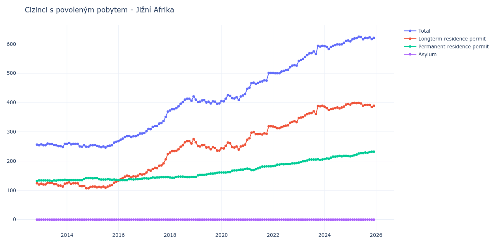

# Jižní Afrika

## Souhrnné statistiky (Min/Max pro rok) / Summary Statistics (Min/Max per year)

| Year   | Total Min/Max   | Longterm Residence Permit Min/Max   | Permanent Residence Permit Min/Max   | Asylum Min/Max   |
|--------|-----------------|-------------------------------------|--------------------------------------|------------------|
| 2012   | 254 / 256       | 120 / 124                           | 132 / 134                            | 0 / 0            |
| 2013   | 248 / 260       | 113 / 126                           | 132 / 136                            | 0 / 0            |
| 2014   | 249 / 262       | 107 / 127                           | 135 / 142                            | 0 / 0            |
| 2015   | 246 / 266       | 109 / 130                           | 136 / 142                            | 0 / 0            |
| 2016   | 268 / 294       | 133 / 155                           | 135 / 140                            | 0 / 0            |
| 2017   | 296 / 369       | 155 / 224                           | 140 / 145                            | 0 / 0            |
| 2018   | 373 / 421       | 229 / 275                           | 143 / 147                            | 0 / 0            |
| 2019   | 396 / 410       | 236 / 264                           | 146 / 161                            | 0 / 0            |
| 2020   | 404 / 429       | 239 / 263                           | 161 / 173                            | 0 / 0            |
| 2021   | 447 / 501       | 273 / 319                           | 169 / 182                            | 0 / 0            |
| 2022   | 500 / 528       | 312 / 336                           | 183 / 193                            | 0 / 0            |
| 2023   | 542 / 594       | 347 / 389                           | 195 / 206                            | 0 / 0            |
| 2024   | 583 / 612       | 375 / 395                           | 207 / 218                            | 0 / 0            |
| 2025   | 609 / 625       | 385 / 399                           | 216 / 232                            | 0 / 0            |

## Detailní tabulka / Detailed Data Table

| Date     | Total        | Longterm Residence Permit   | Permanent Residence Permit   | Asylum   |
|----------|--------------|-----------------------------|------------------------------|----------|
| **2012** |              |                             |                              |          |
| 11.2012  | 256          | 124                         | 132                          | 0        |
| 12.2012  | 254 (-0.78%) | 120 (-3.23%)                | 134 (+1.52%)                 | 0        |
| **2013** |              |                             |                              |          |
| 01.2013  | 257 (+1.18%) | 123 (+2.50%)                | 134 (+0.00%)                 | 0        |
| 02.2013  | 254 (-1.17%) | 120 (-2.44%)                | 134 (+0.00%)                 | 0        |
| 03.2013  | 254 (+0.00%) | 120 (+0.00%)                | 134 (+0.00%)                 | 0        |
| 04.2013  | 260 (+2.36%) | 126 (+5.00%)                | 134 (+0.00%)                 | 0        |
| 05.2013  | 258 (-0.77%) | 125 (-0.79%)                | 133 (-0.75%)                 | 0        |
| 06.2013  | 258 (+0.00%) | 126 (+0.80%)                | 132 (-0.75%)                 | 0        |
| 07.2013  | 255 (-1.16%) | 121 (-3.97%)                | 134 (+1.52%)                 | 0        |
| 08.2013  | 254 (-0.39%) | 121 (+0.00%)                | 133 (-0.75%)                 | 0        |
| 09.2013  | 251 (-1.18%) | 116 (-4.13%)                | 135 (+1.50%)                 | 0        |
| 10.2013  | 251 (+0.00%) | 116 (+0.00%)                | 135 (+0.00%)                 | 0        |
| 11.2013  | 248 (-1.20%) | 113 (-2.59%)                | 135 (+0.00%)                 | 0        |
| 12.2013  | 259 (+4.44%) | 123 (+8.85%)                | 136 (+0.74%)                 | 0        |
| **2014** |              |                             |                              |          |
| 01.2014  | 259 (+0.00%) | 124 (+0.81%)                | 135 (-0.74%)                 | 0        |
| 02.2014  | 262 (+1.16%) | 127 (+2.42%)                | 135 (+0.00%)                 | 0        |
| 03.2014  | 257 (-1.91%) | 122 (-3.94%)                | 135 (+0.00%)                 | 0        |
| 04.2014  | 259 (+0.78%) | 124 (+1.64%)                | 135 (+0.00%)                 | 0        |
| 05.2014  | 259 (+0.00%) | 124 (+0.00%)                | 135 (+0.00%)                 | 0        |
| 06.2014  | 259 (+0.00%) | 124 (+0.00%)                | 135 (+0.00%)                 | 0        |
| 07.2014  | 250 (-3.47%) | 115 (-7.26%)                | 135 (+0.00%)                 | 0        |
| 08.2014  | 249 (-0.40%) | 114 (-0.87%)                | 135 (+0.00%)                 | 0        |
| 09.2014  | 254 (+2.01%) | 115 (+0.88%)                | 139 (+2.96%)                 | 0        |
| 10.2014  | 249 (-1.97%) | 107 (-6.96%)                | 142 (+2.16%)                 | 0        |
| 11.2014  | 249 (+0.00%) | 107 (+0.00%)                | 142 (+0.00%)                 | 0        |
| 12.2014  | 254 (+2.01%) | 112 (+4.67%)                | 142 (+0.00%)                 | 0        |
| **2015** |              |                             |                              |          |
| 01.2015  | 254 (+0.00%) | 113 (+0.89%)                | 141 (-0.70%)                 | 0        |
| 02.2015  | 255 (+0.39%) | 113 (+0.00%)                | 142 (+0.71%)                 | 0        |
| 03.2015  | 252 (-1.18%) | 110 (-2.65%)                | 142 (+0.00%)                 | 0        |
| 04.2015  | 250 (-0.79%) | 112 (+1.82%)                | 138 (-2.82%)                 | 0        |
| 05.2015  | 247 (-1.20%) | 110 (-1.79%)                | 137 (-0.72%)                 | 0        |
| 06.2015  | 250 (+1.21%) | 113 (+2.73%)                | 137 (+0.00%)                 | 0        |
| 07.2015  | 246 (-1.60%) | 109 (-3.54%)                | 137 (+0.00%)                 | 0        |
| 08.2015  | 251 (+2.03%) | 113 (+3.67%)                | 138 (+0.73%)                 | 0        |
| 09.2015  | 253 (+0.80%) | 116 (+2.65%)                | 137 (-0.72%)                 | 0        |
| 10.2015  | 254 (+0.40%) | 118 (+1.72%)                | 136 (-0.73%)                 | 0        |
| 11.2015  | 263 (+3.54%) | 126 (+6.78%)                | 137 (+0.74%)                 | 0        |
| 12.2015  | 266 (+1.14%) | 130 (+3.17%)                | 136 (-0.73%)                 | 0        |
| **2016** |              |                             |                              |          |
| 01.2016  | 268 (+0.75%) | 133 (+2.31%)                | 135 (-0.74%)                 | 0        |
| 02.2016  | 273 (+1.87%) | 138 (+3.76%)                | 135 (+0.00%)                 | 0        |
| 03.2016  | 277 (+1.47%) | 142 (+2.90%)                | 135 (+0.00%)                 | 0        |
| 04.2016  | 282 (+1.81%) | 147 (+3.52%)                | 135 (+0.00%)                 | 0        |
| 05.2016  | 285 (+1.06%) | 150 (+2.04%)                | 135 (+0.00%)                 | 0        |
| 06.2016  | 286 (+0.35%) | 148 (-1.33%)                | 138 (+2.22%)                 | 0        |
| 07.2016  | 282 (-1.40%) | 144 (-2.70%)                | 138 (+0.00%)                 | 0        |
| 08.2016  | 285 (+1.06%) | 148 (+2.78%)                | 137 (-0.72%)                 | 0        |
| 09.2016  | 285 (+0.00%) | 147 (-0.68%)                | 138 (+0.73%)                 | 0        |
| 10.2016  | 288 (+1.05%) | 150 (+2.04%)                | 138 (+0.00%)                 | 0        |
| 11.2016  | 294 (+2.08%) | 155 (+3.33%)                | 139 (+0.72%)                 | 0        |
| 12.2016  | 294 (+0.00%) | 154 (-0.65%)                | 140 (+0.72%)                 | 0        |
| **2017** |              |                             |                              |          |
| 01.2017  | 296 (+0.68%) | 155 (+0.65%)                | 141 (+0.71%)                 | 0        |
| 02.2017  | 302 (+2.03%) | 161 (+3.87%)                | 141 (+0.00%)                 | 0        |
| 03.2017  | 310 (+2.65%) | 170 (+5.59%)                | 140 (-0.71%)                 | 0        |
| 04.2017  | 309 (-0.32%) | 167 (-1.76%)                | 142 (+1.43%)                 | 0        |
| 05.2017  | 317 (+2.59%) | 173 (+3.59%)                | 144 (+1.41%)                 | 0        |
| 06.2017  | 320 (+0.95%) | 177 (+2.31%)                | 143 (-0.69%)                 | 0        |
| 07.2017  | 320 (+0.00%) | 176 (-0.56%)                | 144 (+0.70%)                 | 0        |
| 08.2017  | 328 (+2.50%) | 184 (+4.55%)                | 144 (+0.00%)                 | 0        |
| 09.2017  | 330 (+0.61%) | 185 (+0.54%)                | 145 (+0.69%)                 | 0        |
| 10.2017  | 337 (+2.12%) | 192 (+3.78%)                | 145 (+0.00%)                 | 0        |
| 11.2017  | 351 (+4.15%) | 206 (+7.29%)                | 145 (+0.00%)                 | 0        |
| 12.2017  | 369 (+5.13%) | 224 (+8.74%)                | 145 (+0.00%)                 | 0        |
| **2018** |              |                             |                              |          |
| 01.2018  | 373 (+1.08%) | 229 (+2.23%)                | 144 (-0.69%)                 | 0        |
| 02.2018  | 377 (+1.07%) | 234 (+2.18%)                | 143 (-0.69%)                 | 0        |
| 03.2018  | 377 (+0.00%) | 234 (+0.00%)                | 143 (+0.00%)                 | 0        |
| 04.2018  | 381 (+1.06%) | 235 (+0.43%)                | 146 (+2.10%)                 | 0        |
| 05.2018  | 387 (+1.57%) | 240 (+2.13%)                | 147 (+0.68%)                 | 0        |
| 06.2018  | 396 (+2.33%) | 249 (+3.75%)                | 147 (+0.00%)                 | 0        |
| 07.2018  | 401 (+1.26%) | 254 (+2.01%)                | 147 (+0.00%)                 | 0        |
| 08.2018  | 410 (+2.24%) | 264 (+3.94%)                | 146 (-0.68%)                 | 0        |
| 09.2018  | 413 (+0.73%) | 268 (+1.52%)                | 145 (-0.68%)                 | 0        |
| 10.2018  | 413 (+0.00%) | 268 (+0.00%)                | 145 (+0.00%)                 | 0        |
| 11.2018  | 406 (-1.69%) | 260 (-2.99%)                | 146 (+0.69%)                 | 0        |
| 12.2018  | 421 (+3.69%) | 275 (+5.77%)                | 146 (+0.00%)                 | 0        |
| **2019** |              |                             |                              |          |
| 01.2019  | 410 (-2.61%) | 264 (-4.00%)                | 146 (+0.00%)                 | 0        |
| 02.2019  | 402 (-1.95%) | 251 (-4.92%)                | 151 (+3.42%)                 | 0        |
| 03.2019  | 403 (+0.25%) | 250 (-0.40%)                | 153 (+1.32%)                 | 0        |
| 04.2019  | 407 (+0.99%) | 254 (+1.60%)                | 153 (+0.00%)                 | 0        |
| 05.2019  | 408 (+0.25%) | 255 (+0.39%)                | 153 (+0.00%)                 | 0        |
| 06.2019  | 400 (-1.96%) | 246 (-3.53%)                | 154 (+0.65%)                 | 0        |
| 07.2019  | 403 (+0.75%) | 247 (+0.41%)                | 156 (+1.30%)                 | 0        |
| 08.2019  | 397 (-1.49%) | 240 (-2.83%)                | 157 (+0.64%)                 | 0        |
| 09.2019  | 404 (+1.76%) | 247 (+2.92%)                | 157 (+0.00%)                 | 0        |
| 10.2019  | 403 (-0.25%) | 245 (-0.81%)                | 158 (+0.64%)                 | 0        |
| 11.2019  | 396 (-1.74%) | 236 (-3.67%)                | 160 (+1.27%)                 | 0        |
| 12.2019  | 397 (+0.25%) | 236 (+0.00%)                | 161 (+0.63%)                 | 0        |
| **2020** |              |                             |                              |          |
| 01.2020  | 405 (+2.02%) | 244 (+3.39%)                | 161 (+0.00%)                 | 0        |
| 02.2020  | 404 (-0.25%) | 243 (-0.41%)                | 161 (+0.00%)                 | 0        |
| 03.2020  | 413 (+2.23%) | 252 (+3.70%)                | 161 (+0.00%)                 | 0        |
| 04.2020  | 425 (+2.91%) | 263 (+4.37%)                | 162 (+0.62%)                 | 0        |
| 05.2020  | 423 (-0.47%) | 261 (-0.76%)                | 162 (+0.00%)                 | 0        |
| 06.2020  | 415 (-1.89%) | 248 (-4.98%)                | 167 (+3.09%)                 | 0        |
| 07.2020  | 414 (-0.24%) | 246 (-0.81%)                | 168 (+0.60%)                 | 0        |
| 08.2020  | 418 (+0.97%) | 250 (+1.63%)                | 168 (+0.00%)                 | 0        |
| 09.2020  | 409 (-2.15%) | 239 (-4.40%)                | 170 (+1.19%)                 | 0        |
| 10.2020  | 421 (+2.93%) | 250 (+4.60%)                | 171 (+0.59%)                 | 0        |
| 11.2020  | 424 (+0.71%) | 253 (+1.20%)                | 171 (+0.00%)                 | 0        |
| 12.2020  | 429 (+1.18%) | 256 (+1.19%)                | 173 (+1.17%)                 | 0        |
| **2021** |              |                             |                              |          |
| 01.2021  | 447 (+4.20%) | 273 (+6.64%)                | 174 (+0.58%)                 | 0        |
| 02.2021  | 451 (+0.89%) | 278 (+1.83%)                | 173 (-0.57%)                 | 0        |
| 03.2021  | 466 (+3.33%) | 297 (+6.83%)                | 169 (-2.31%)                 | 0        |
| 04.2021  | 468 (+0.43%) | 299 (+0.67%)                | 169 (+0.00%)                 | 0        |
| 05.2021  | 464 (-0.85%) | 292 (-2.34%)                | 172 (+1.78%)                 | 0        |
| 06.2021  | 467 (+0.65%) | 292 (+0.00%)                | 175 (+1.74%)                 | 0        |
| 07.2021  | 471 (+0.86%) | 293 (+0.34%)                | 178 (+1.71%)                 | 0        |
| 08.2021  | 472 (+0.21%) | 291 (-0.68%)                | 181 (+1.69%)                 | 0        |
| 09.2021  | 476 (+0.85%) | 295 (+1.37%)                | 181 (+0.00%)                 | 0        |
| 10.2021  | 475 (-0.21%) | 293 (-0.68%)                | 182 (+0.55%)                 | 0        |
| 11.2021  | 501 (+5.47%) | 319 (+8.87%)                | 182 (+0.00%)                 | 0        |
| 12.2021  | 501 (+0.00%) | 319 (+0.00%)                | 182 (+0.00%)                 | 0        |
| **2022** |              |                             |                              |          |
| 01.2022  | 501 (+0.00%) | 318 (-0.31%)                | 183 (+0.55%)                 | 0        |
| 02.2022  | 500 (-0.20%) | 316 (-0.63%)                | 184 (+0.55%)                 | 0        |
| 03.2022  | 500 (+0.00%) | 312 (-1.27%)                | 188 (+2.17%)                 | 0        |
| 04.2022  | 500 (+0.00%) | 312 (+0.00%)                | 188 (+0.00%)                 | 0        |
| 05.2022  | 506 (+1.20%) | 316 (+1.28%)                | 190 (+1.06%)                 | 0        |
| 06.2022  | 508 (+0.40%) | 319 (+0.95%)                | 189 (-0.53%)                 | 0        |
| 07.2022  | 511 (+0.59%) | 321 (+0.63%)                | 190 (+0.53%)                 | 0        |
| 08.2022  | 512 (+0.20%) | 322 (+0.31%)                | 190 (+0.00%)                 | 0        |
| 09.2022  | 521 (+1.76%) | 331 (+2.80%)                | 190 (+0.00%)                 | 0        |
| 10.2022  | 526 (+0.96%) | 334 (+0.91%)                | 192 (+1.05%)                 | 0        |
| 11.2022  | 528 (+0.38%) | 336 (+0.60%)                | 192 (+0.00%)                 | 0        |
| 12.2022  | 526 (-0.38%) | 333 (-0.89%)                | 193 (+0.52%)                 | 0        |
| **2023** |              |                             |                              |          |
| 01.2023  | 542 (+3.04%) | 347 (+4.20%)                | 195 (+1.04%)                 | 0        |
| 02.2023  | 546 (+0.74%) | 349 (+0.58%)                | 197 (+1.03%)                 | 0        |
| 03.2023  | 549 (+0.55%) | 350 (+0.29%)                | 199 (+1.02%)                 | 0        |
| 04.2023  | 556 (+1.28%) | 356 (+1.71%)                | 200 (+0.50%)                 | 0        |
| 05.2023  | 562 (+1.08%) | 360 (+1.12%)                | 202 (+1.00%)                 | 0        |
| 06.2023  | 568 (+1.07%) | 363 (+0.83%)                | 205 (+1.49%)                 | 0        |
| 07.2023  | 569 (+0.18%) | 364 (+0.28%)                | 205 (+0.00%)                 | 0        |
| 08.2023  | 575 (+1.05%) | 370 (+1.65%)                | 205 (+0.00%)                 | 0        |
| 09.2023  | 566 (-1.57%) | 361 (-2.43%)                | 205 (+0.00%)                 | 0        |
| 10.2023  | 594 (+4.95%) | 388 (+7.48%)                | 206 (+0.49%)                 | 0        |
| 11.2023  | 591 (-0.51%) | 387 (-0.26%)                | 204 (-0.97%)                 | 0        |
| 12.2023  | 594 (+0.51%) | 389 (+0.52%)                | 205 (+0.49%)                 | 0        |
| **2024** |              |                             |                              |          |
| 01.2024  | 593 (-0.17%) | 386 (-0.77%)                | 207 (+0.98%)                 | 0        |
| 02.2024  | 590 (-0.51%) | 381 (-1.30%)                | 209 (+0.97%)                 | 0        |
| 03.2024  | 583 (-1.19%) | 375 (-1.57%)                | 208 (-0.48%)                 | 0        |
| 04.2024  | 590 (+1.20%) | 378 (+0.80%)                | 212 (+1.92%)                 | 0        |
| 05.2024  | 594 (+0.68%) | 379 (+0.26%)                | 215 (+1.42%)                 | 0        |
| 06.2024  | 596 (+0.34%) | 381 (+0.53%)                | 215 (+0.00%)                 | 0        |
| 07.2024  | 599 (+0.50%) | 383 (+0.52%)                | 216 (+0.47%)                 | 0        |
| 08.2024  | 598 (-0.17%) | 380 (-0.78%)                | 218 (+0.93%)                 | 0        |
| 09.2024  | 599 (+0.17%) | 383 (+0.79%)                | 216 (-0.92%)                 | 0        |
| 10.2024  | 604 (+0.83%) | 386 (+0.78%)                | 218 (+0.93%)                 | 0        |
| 11.2024  | 611 (+1.16%) | 393 (+1.81%)                | 218 (+0.00%)                 | 0        |
| 12.2024  | 612 (+0.16%) | 395 (+0.51%)                | 217 (-0.46%)                 | 0        |
| **2025** |              |                             |                              |          |
| 01.2025  | 609 (-0.49%) | 393 (-0.51%)                | 216 (-0.46%)                 | 0        |
| 02.2025  | 616 (+1.15%) | 398 (+1.27%)                | 218 (+0.93%)                 | 0        |
| 03.2025  | 619 (+0.49%) | 399 (+0.25%)                | 220 (+0.92%)                 | 0        |
| 04.2025  | 620 (+0.16%) | 398 (-0.25%)                | 222 (+0.91%)                 | 0        |
| 05.2025  | 625 (+0.81%) | 399 (+0.25%)                | 226 (+1.80%)                 | 0        |
| 06.2025  | 624 (-0.16%) | 397 (-0.50%)                | 227 (+0.44%)                 | 0        |
| 07.2025  | 616 (-1.28%) | 389 (-2.02%)                | 227 (+0.00%)                 | 0        |
| 08.2025  | 621 (+0.81%) | 392 (+0.77%)                | 229 (+0.88%)                 | 0        |
| 09.2025  | 620 (-0.16%) | 392 (+0.00%)                | 228 (-0.44%)                 | 0        |
| 10.2025  | 623 (+0.48%) | 392 (+0.00%)                | 231 (+1.32%)                 | 0        |
| 11.2025  | 617 (-0.96%) | 385 (-1.79%)                | 232 (+0.43%)                 | 0        |
| 12.2025  | 621 (+0.65%) | 389 (+1.04%)                | 232 (+0.00%)                 | 0        |
