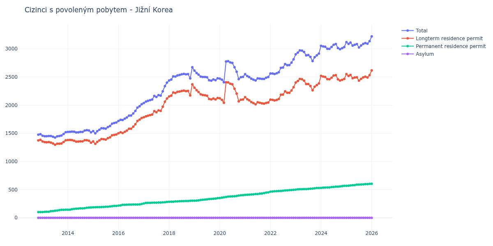

# Jižní Korea

## Souhrnné statistiky (Min/Max pro rok) / Summary Statistics (Min/Max per year)

| Year   | Total         | Longterm Residence Permit   | Permanent Residence Permit   | Asylum   |
|--------|---------------|-----------------------------|------------------------------|----------|
| 2012   | 1 475 / 1 485 | 1 374 / 1 384               | 101 / 101                    | 0 / 0    |
| 2013   | 1 424 / 1 520 | 1 298 / 1 376               | 101 / 144                    | 0 / 0    |
| 2014   | 1 515 / 1 555 | 1 334 / 1 383               | 144 / 183                    | 0 / 0    |
| 2015   | 1 500 / 1 692 | 1 313 / 1 480               | 185 / 212                    | 0 / 0    |
| 2016   | 1 719 / 2 017 | 1 502 / 1 772               | 217 / 245                    | 0 / 0    |
| 2017   | 2 039 / 2 401 | 1 785 / 2 119               | 254 / 282                    | 0 / 0    |
| 2018   | 2 438 / 2 673 | 2 154 / 2 370               | 284 / 303                    | 0 / 0    |
| 2019   | 2 435 / 2 614 | 2 101 / 2 310               | 304 / 349                    | 0 / 0    |
| 2020   | 2 406 / 2 781 | 2 042 / 2 406               | 351 / 403                    | 0 / 0    |
| 2021   | 2 438 / 2 550 | 2 015 / 2 142               | 408 / 452                    | 0 / 0    |
| 2022   | 2 554 / 2 814 | 2 083 / 2 318               | 464 / 496                    | 0 / 0    |
| 2023   | 2 783 / 2 972 | 2 264 / 2 465               | 500 / 530                    | 0 / 0    |
| 2024   | 2 993 / 3 087 | 2 437 / 2 534               | 532 / 567                    | 0 / 0    |
| 2025   | 3 024 / 3 135 | 2 434 / 2 552               | 568 / 602                    | 0 / 0    |
| 2026   | 3 221 / 3 221 | 2 617 / 2 617               | 604 / 604                    | 0 / 0    |

## Detailní tabulka / Detailed Data Table

| Date     | Total           | Longterm Residence Permit   | Permanent Residence Permit   | Asylum   |
|----------|-----------------|-----------------------------|------------------------------|----------|
| **2012** |                 |                             |                              |          |
| 11.2012  | 1 475           | 1 374                       | 101                          | 0        |
| 12.2012  | 1 485 (+0.68%)  | 1 384 (+0.73%)              | 101 (+0.00%)                 | 0        |
| **2013** |                 |                             |                              |          |
| 01.2013  | 1 457 (-1.89%)  | 1 356 (-2.02%)              | 101 (+0.00%)                 | 0        |
| 02.2013  | 1 449 (-0.55%)  | 1 344 (-0.88%)              | 105 (+3.96%)                 | 0        |
| 03.2013  | 1 449 (+0.00%)  | 1 342 (-0.15%)              | 107 (+1.90%)                 | 0        |
| 04.2013  | 1 452 (+0.21%)  | 1 345 (+0.22%)              | 107 (+0.00%)                 | 0        |
| 05.2013  | 1 453 (+0.07%)  | 1 335 (-0.74%)              | 118 (+10.28%)                | 0        |
| 06.2013  | 1 440 (-0.89%)  | 1 320 (-1.12%)              | 120 (+1.69%)                 | 0        |
| 07.2013  | 1 424 (-1.11%)  | 1 298 (-1.67%)              | 126 (+5.00%)                 | 0        |
| 08.2013  | 1 446 (+1.54%)  | 1 316 (+1.39%)              | 130 (+3.17%)                 | 0        |
| 09.2013  | 1 453 (+0.48%)  | 1 316 (+0.00%)              | 137 (+5.38%)                 | 0        |
| 10.2013  | 1 461 (+0.55%)  | 1 319 (+0.23%)              | 142 (+3.65%)                 | 0        |
| 11.2013  | 1 489 (+1.92%)  | 1 347 (+2.12%)              | 142 (+0.00%)                 | 0        |
| 12.2013  | 1 520 (+2.08%)  | 1 376 (+2.15%)              | 144 (+1.41%)                 | 0        |
| **2014** |                 |                             |                              |          |
| 01.2014  | 1 525 (+0.33%)  | 1 381 (+0.36%)              | 144 (+0.00%)                 | 0        |
| 02.2014  | 1 527 (+0.13%)  | 1 383 (+0.14%)              | 144 (+0.00%)                 | 0        |
| 03.2014  | 1 531 (+0.26%)  | 1 379 (-0.29%)              | 152 (+5.56%)                 | 0        |
| 04.2014  | 1 528 (-0.20%)  | 1 369 (-0.73%)              | 159 (+4.61%)                 | 0        |
| 05.2014  | 1 515 (-0.85%)  | 1 353 (-1.17%)              | 162 (+1.89%)                 | 0        |
| 06.2014  | 1 517 (+0.13%)  | 1 354 (+0.07%)              | 163 (+0.62%)                 | 0        |
| 07.2014  | 1 525 (+0.53%)  | 1 357 (+0.22%)              | 168 (+3.07%)                 | 0        |
| 08.2014  | 1 525 (+0.00%)  | 1 357 (+0.00%)              | 168 (+0.00%)                 | 0        |
| 09.2014  | 1 549 (+1.57%)  | 1 378 (+1.55%)              | 171 (+1.79%)                 | 0        |
| 10.2014  | 1 555 (+0.39%)  | 1 377 (-0.07%)              | 178 (+4.09%)                 | 0        |
| 11.2014  | 1 551 (-0.26%)  | 1 369 (-0.58%)              | 182 (+2.25%)                 | 0        |
| 12.2014  | 1 517 (-2.19%)  | 1 334 (-2.56%)              | 183 (+0.55%)                 | 0        |
| **2015** |                 |                             |                              |          |
| 01.2015  | 1 540 (+1.52%)  | 1 355 (+1.57%)              | 185 (+1.09%)                 | 0        |
| 02.2015  | 1 500 (-2.60%)  | 1 313 (-3.10%)              | 187 (+1.08%)                 | 0        |
| 03.2015  | 1 538 (+2.53%)  | 1 349 (+2.74%)              | 189 (+1.07%)                 | 0        |
| 04.2015  | 1 564 (+1.69%)  | 1 374 (+1.85%)              | 190 (+0.53%)                 | 0        |
| 05.2015  | 1 590 (+1.66%)  | 1 399 (+1.82%)              | 191 (+0.53%)                 | 0        |
| 06.2015  | 1 588 (-0.13%)  | 1 396 (-0.21%)              | 192 (+0.52%)                 | 0        |
| 07.2015  | 1 584 (-0.25%)  | 1 388 (-0.57%)              | 196 (+2.08%)                 | 0        |
| 08.2015  | 1 611 (+1.70%)  | 1 414 (+1.87%)              | 197 (+0.51%)                 | 0        |
| 09.2015  | 1 630 (+1.18%)  | 1 428 (+0.99%)              | 202 (+2.54%)                 | 0        |
| 10.2015  | 1 671 (+2.52%)  | 1 465 (+2.59%)              | 206 (+1.98%)                 | 0        |
| 11.2015  | 1 684 (+0.78%)  | 1 473 (+0.55%)              | 211 (+2.43%)                 | 0        |
| 12.2015  | 1 692 (+0.48%)  | 1 480 (+0.48%)              | 212 (+0.47%)                 | 0        |
| **2016** |                 |                             |                              |          |
| 01.2016  | 1 719 (+1.60%)  | 1 502 (+1.49%)              | 217 (+2.36%)                 | 0        |
| 02.2016  | 1 740 (+1.22%)  | 1 520 (+1.20%)              | 220 (+1.38%)                 | 0        |
| 03.2016  | 1 736 (-0.23%)  | 1 505 (-0.99%)              | 231 (+5.00%)                 | 0        |
| 04.2016  | 1 759 (+1.32%)  | 1 527 (+1.46%)              | 232 (+0.43%)                 | 0        |
| 05.2016  | 1 782 (+1.31%)  | 1 549 (+1.44%)              | 233 (+0.43%)                 | 0        |
| 06.2016  | 1 815 (+1.85%)  | 1 581 (+2.07%)              | 234 (+0.43%)                 | 0        |
| 07.2016  | 1 817 (+0.11%)  | 1 582 (+0.06%)              | 235 (+0.43%)                 | 0        |
| 08.2016  | 1 853 (+1.98%)  | 1 617 (+2.21%)              | 236 (+0.43%)                 | 0        |
| 09.2016  | 1 898 (+2.43%)  | 1 662 (+2.78%)              | 236 (+0.00%)                 | 0        |
| 10.2016  | 1 956 (+3.06%)  | 1 719 (+3.43%)              | 237 (+0.42%)                 | 0        |
| 11.2016  | 1 982 (+1.33%)  | 1 743 (+1.40%)              | 239 (+0.84%)                 | 0        |
| 12.2016  | 2 017 (+1.77%)  | 1 772 (+1.66%)              | 245 (+2.51%)                 | 0        |
| **2017** |                 |                             |                              |          |
| 01.2017  | 2 039 (+1.09%)  | 1 785 (+0.73%)              | 254 (+3.67%)                 | 0        |
| 02.2017  | 2 064 (+1.23%)  | 1 801 (+0.90%)              | 263 (+3.54%)                 | 0        |
| 03.2017  | 2 077 (+0.63%)  | 1 812 (+0.61%)              | 265 (+0.76%)                 | 0        |
| 04.2017  | 2 089 (+0.58%)  | 1 823 (+0.61%)              | 266 (+0.38%)                 | 0        |
| 05.2017  | 2 100 (+0.53%)  | 1 832 (+0.49%)              | 268 (+0.75%)                 | 0        |
| 06.2017  | 2 163 (+3.00%)  | 1 894 (+3.38%)              | 269 (+0.37%)                 | 0        |
| 07.2017  | 2 145 (-0.83%)  | 1 875 (-1.00%)              | 270 (+0.37%)                 | 0        |
| 08.2017  | 2 178 (+1.54%)  | 1 907 (+1.71%)              | 271 (+0.37%)                 | 0        |
| 09.2017  | 2 170 (-0.37%)  | 1 898 (-0.47%)              | 272 (+0.37%)                 | 0        |
| 10.2017  | 2 246 (+3.50%)  | 1 972 (+3.90%)              | 274 (+0.74%)                 | 0        |
| 11.2017  | 2 338 (+4.10%)  | 2 062 (+4.56%)              | 276 (+0.73%)                 | 0        |
| 12.2017  | 2 401 (+2.69%)  | 2 119 (+2.76%)              | 282 (+2.17%)                 | 0        |
| **2018** |                 |                             |                              |          |
| 01.2018  | 2 438 (+1.54%)  | 2 154 (+1.65%)              | 284 (+0.71%)                 | 0        |
| 02.2018  | 2 455 (+0.70%)  | 2 169 (+0.70%)              | 286 (+0.70%)                 | 0        |
| 03.2018  | 2 511 (+2.28%)  | 2 226 (+2.63%)              | 285 (-0.35%)                 | 0        |
| 04.2018  | 2 508 (-0.12%)  | 2 217 (-0.40%)              | 291 (+2.11%)                 | 0        |
| 05.2018  | 2 528 (+0.80%)  | 2 236 (+0.86%)              | 292 (+0.34%)                 | 0        |
| 06.2018  | 2 536 (+0.32%)  | 2 242 (+0.27%)              | 294 (+0.68%)                 | 0        |
| 07.2018  | 2 547 (+0.43%)  | 2 251 (+0.40%)              | 296 (+0.68%)                 | 0        |
| 08.2018  | 2 555 (+0.31%)  | 2 259 (+0.36%)              | 296 (+0.00%)                 | 0        |
| 09.2018  | 2 547 (-0.31%)  | 2 249 (-0.44%)              | 298 (+0.68%)                 | 0        |
| 10.2018  | 2 552 (+0.20%)  | 2 253 (+0.18%)              | 299 (+0.34%)                 | 0        |
| 11.2018  | 2 474 (-3.06%)  | 2 172 (-3.60%)              | 302 (+1.00%)                 | 0        |
| 12.2018  | 2 673 (+8.04%)  | 2 370 (+9.12%)              | 303 (+0.33%)                 | 0        |
| **2019** |                 |                             |                              |          |
| 01.2019  | 2 614 (-2.21%)  | 2 310 (-2.53%)              | 304 (+0.33%)                 | 0        |
| 02.2019  | 2 572 (-1.61%)  | 2 266 (-1.90%)              | 306 (+0.66%)                 | 0        |
| 03.2019  | 2 543 (-1.13%)  | 2 233 (-1.46%)              | 310 (+1.31%)                 | 0        |
| 04.2019  | 2 508 (-1.38%)  | 2 192 (-1.84%)              | 316 (+1.94%)                 | 0        |
| 05.2019  | 2 500 (-0.32%)  | 2 180 (-0.55%)              | 320 (+1.27%)                 | 0        |
| 06.2019  | 2 500 (+0.00%)  | 2 176 (-0.18%)              | 324 (+1.25%)                 | 0        |
| 07.2019  | 2 495 (-0.20%)  | 2 168 (-0.37%)              | 327 (+0.93%)                 | 0        |
| 08.2019  | 2 443 (-2.08%)  | 2 110 (-2.68%)              | 333 (+1.83%)                 | 0        |
| 09.2019  | 2 435 (-0.33%)  | 2 101 (-0.43%)              | 334 (+0.30%)                 | 0        |
| 10.2019  | 2 457 (+0.90%)  | 2 119 (+0.86%)              | 338 (+1.20%)                 | 0        |
| 11.2019  | 2 444 (-0.53%)  | 2 101 (-0.85%)              | 343 (+1.48%)                 | 0        |
| 12.2019  | 2 476 (+1.31%)  | 2 127 (+1.24%)              | 349 (+1.75%)                 | 0        |
| **2020** |                 |                             |                              |          |
| 01.2020  | 2 472 (-0.16%)  | 2 121 (-0.28%)              | 351 (+0.57%)                 | 0        |
| 02.2020  | 2 453 (-0.77%)  | 2 094 (-1.27%)              | 359 (+2.28%)                 | 0        |
| 03.2020  | 2 406 (-1.92%)  | 2 042 (-2.48%)              | 364 (+1.39%)                 | 0        |
| 04.2020  | 2 775 (+15.34%) | 2 406 (+17.83%)             | 369 (+1.37%)                 | 0        |
| 05.2020  | 2 781 (+0.22%)  | 2 404 (-0.08%)              | 377 (+2.17%)                 | 0        |
| 06.2020  | 2 759 (-0.79%)  | 2 381 (-0.96%)              | 378 (+0.27%)                 | 0        |
| 07.2020  | 2 749 (-0.36%)  | 2 369 (-0.50%)              | 380 (+0.53%)                 | 0        |
| 08.2020  | 2 674 (-2.73%)  | 2 291 (-3.29%)              | 383 (+0.79%)                 | 0        |
| 09.2020  | 2 593 (-3.03%)  | 2 205 (-3.75%)              | 388 (+1.31%)                 | 0        |
| 10.2020  | 2 463 (-5.01%)  | 2 068 (-6.21%)              | 395 (+1.80%)                 | 0        |
| 11.2020  | 2 496 (+1.34%)  | 2 096 (+1.35%)              | 400 (+1.27%)                 | 0        |
| 12.2020  | 2 503 (+0.28%)  | 2 100 (+0.19%)              | 403 (+0.75%)                 | 0        |
| **2021** |                 |                             |                              |          |
| 01.2021  | 2 550 (+1.88%)  | 2 142 (+2.00%)              | 408 (+1.24%)                 | 0        |
| 02.2021  | 2 516 (-1.33%)  | 2 106 (-1.68%)              | 410 (+0.49%)                 | 0        |
| 03.2021  | 2 498 (-0.72%)  | 2 086 (-0.95%)              | 412 (+0.49%)                 | 0        |
| 04.2021  | 2 470 (-1.12%)  | 2 055 (-1.49%)              | 415 (+0.73%)                 | 0        |
| 05.2021  | 2 453 (-0.69%)  | 2 036 (-0.92%)              | 417 (+0.48%)                 | 0        |
| 06.2021  | 2 438 (-0.61%)  | 2 015 (-1.03%)              | 423 (+1.44%)                 | 0        |
| 07.2021  | 2 475 (+1.52%)  | 2 052 (+1.84%)              | 423 (+0.00%)                 | 0        |
| 08.2021  | 2 471 (-0.16%)  | 2 041 (-0.54%)              | 430 (+1.65%)                 | 0        |
| 09.2021  | 2 465 (-0.24%)  | 2 033 (-0.39%)              | 432 (+0.47%)                 | 0        |
| 10.2021  | 2 465 (+0.00%)  | 2 027 (-0.30%)              | 438 (+1.39%)                 | 0        |
| 11.2021  | 2 487 (+0.89%)  | 2 040 (+0.64%)              | 447 (+2.05%)                 | 0        |
| 12.2021  | 2 500 (+0.52%)  | 2 048 (+0.39%)              | 452 (+1.12%)                 | 0        |
| **2022** |                 |                             |                              |          |
| 01.2022  | 2 563 (+2.52%)  | 2 099 (+2.49%)              | 464 (+2.65%)                 | 0        |
| 02.2022  | 2 562 (-0.04%)  | 2 094 (-0.24%)              | 468 (+0.86%)                 | 0        |
| 03.2022  | 2 554 (-0.31%)  | 2 083 (-0.53%)              | 471 (+0.64%)                 | 0        |
| 04.2022  | 2 566 (+0.47%)  | 2 093 (+0.48%)              | 473 (+0.42%)                 | 0        |
| 05.2022  | 2 584 (+0.70%)  | 2 109 (+0.76%)              | 475 (+0.42%)                 | 0        |
| 06.2022  | 2 663 (+3.06%)  | 2 186 (+3.65%)              | 477 (+0.42%)                 | 0        |
| 07.2022  | 2 668 (+0.19%)  | 2 188 (+0.09%)              | 480 (+0.63%)                 | 0        |
| 08.2022  | 2 730 (+2.32%)  | 2 245 (+2.61%)              | 485 (+1.04%)                 | 0        |
| 09.2022  | 2 709 (-0.77%)  | 2 221 (-1.07%)              | 488 (+0.62%)                 | 0        |
| 10.2022  | 2 712 (+0.11%)  | 2 220 (-0.05%)              | 492 (+0.82%)                 | 0        |
| 11.2022  | 2 755 (+1.59%)  | 2 261 (+1.85%)              | 494 (+0.41%)                 | 0        |
| 12.2022  | 2 814 (+2.14%)  | 2 318 (+2.52%)              | 496 (+0.40%)                 | 0        |
| **2023** |                 |                             |                              |          |
| 01.2023  | 2 902 (+3.13%)  | 2 402 (+3.62%)              | 500 (+0.81%)                 | 0        |
| 02.2023  | 2 934 (+1.10%)  | 2 429 (+1.12%)              | 505 (+1.00%)                 | 0        |
| 03.2023  | 2 972 (+1.30%)  | 2 465 (+1.48%)              | 507 (+0.40%)                 | 0        |
| 04.2023  | 2 968 (-0.13%)  | 2 460 (-0.20%)              | 508 (+0.20%)                 | 0        |
| 05.2023  | 2 944 (-0.81%)  | 2 435 (-1.02%)              | 509 (+0.20%)                 | 0        |
| 06.2023  | 2 884 (-2.04%)  | 2 374 (-2.51%)              | 510 (+0.20%)                 | 0        |
| 07.2023  | 2 889 (+0.17%)  | 2 375 (+0.04%)              | 514 (+0.78%)                 | 0        |
| 08.2023  | 2 857 (-1.11%)  | 2 341 (-1.43%)              | 516 (+0.39%)                 | 0        |
| 09.2023  | 2 783 (-2.59%)  | 2 264 (-3.29%)              | 519 (+0.58%)                 | 0        |
| 10.2023  | 2 852 (+2.48%)  | 2 327 (+2.78%)              | 525 (+1.16%)                 | 0        |
| 11.2023  | 2 885 (+1.16%)  | 2 356 (+1.25%)              | 529 (+0.76%)                 | 0        |
| 12.2023  | 2 915 (+1.04%)  | 2 385 (+1.23%)              | 530 (+0.19%)                 | 0        |
| **2024** |                 |                             |                              |          |
| 01.2024  | 3 053 (+4.73%)  | 2 521 (+5.70%)              | 532 (+0.38%)                 | 0        |
| 02.2024  | 3 043 (-0.33%)  | 2 508 (-0.52%)              | 535 (+0.56%)                 | 0        |
| 03.2024  | 3 037 (-0.20%)  | 2 500 (-0.32%)              | 537 (+0.37%)                 | 0        |
| 04.2024  | 3 001 (-1.19%)  | 2 463 (-1.48%)              | 538 (+0.19%)                 | 0        |
| 05.2024  | 2 999 (-0.07%)  | 2 460 (-0.12%)              | 539 (+0.19%)                 | 0        |
| 06.2024  | 3 033 (+1.13%)  | 2 487 (+1.10%)              | 546 (+1.30%)                 | 0        |
| 07.2024  | 3 072 (+1.29%)  | 2 525 (+1.53%)              | 547 (+0.18%)                 | 0        |
| 08.2024  | 3 087 (+0.49%)  | 2 534 (+0.36%)              | 553 (+1.10%)                 | 0        |
| 09.2024  | 3 013 (-2.40%)  | 2 459 (-2.96%)              | 554 (+0.18%)                 | 0        |
| 10.2024  | 2 993 (-0.66%)  | 2 437 (-0.89%)              | 556 (+0.36%)                 | 0        |
| 11.2024  | 3 011 (+0.60%)  | 2 449 (+0.49%)              | 562 (+1.08%)                 | 0        |
| 12.2024  | 3 032 (+0.70%)  | 2 465 (+0.65%)              | 567 (+0.89%)                 | 0        |
| **2025** |                 |                             |                              |          |
| 01.2025  | 3 120 (+2.90%)  | 2 552 (+3.53%)              | 568 (+0.18%)                 | 0        |
| 02.2025  | 3 088 (-1.03%)  | 2 518 (-1.33%)              | 570 (+0.35%)                 | 0        |
| 03.2025  | 3 112 (+0.78%)  | 2 537 (+0.75%)              | 575 (+0.88%)                 | 0        |
| 04.2025  | 3 057 (-1.77%)  | 2 479 (-2.29%)              | 578 (+0.52%)                 | 0        |
| 05.2025  | 3 072 (+0.49%)  | 2 492 (+0.52%)              | 580 (+0.35%)                 | 0        |
| 06.2025  | 3 084 (+0.39%)  | 2 495 (+0.12%)              | 589 (+1.55%)                 | 0        |
| 07.2025  | 3 024 (-1.95%)  | 2 434 (-2.44%)              | 590 (+0.17%)                 | 0        |
| 08.2025  | 3 059 (+1.16%)  | 2 467 (+1.36%)              | 592 (+0.34%)                 | 0        |
| 09.2025  | 3 088 (+0.95%)  | 2 494 (+1.09%)              | 594 (+0.34%)                 | 0        |
| 10.2025  | 3 103 (+0.49%)  | 2 505 (+0.44%)              | 598 (+0.67%)                 | 0        |
| 11.2025  | 3 091 (-0.39%)  | 2 492 (-0.52%)              | 599 (+0.17%)                 | 0        |
| 12.2025  | 3 135 (+1.42%)  | 2 533 (+1.65%)              | 602 (+0.50%)                 | 0        |
| **2026** |                 |                             |                              |          |
| 01.2026  | 3 221 (+2.74%)  | 2 617 (+3.32%)              | 604 (+0.33%)                 | 0        |
