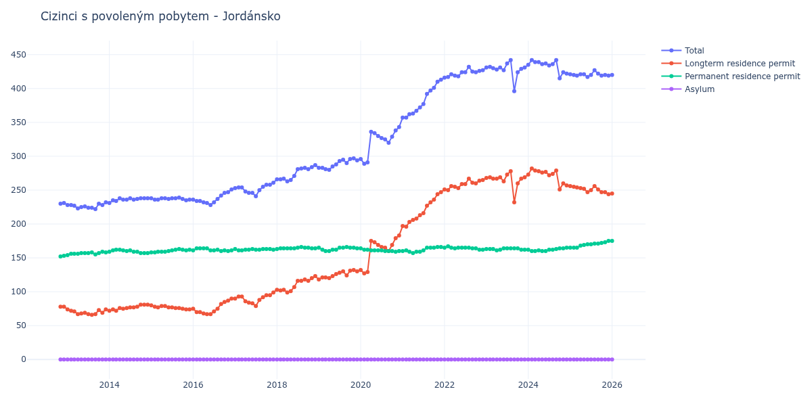

# Jordánsko

## Souhrnné statistiky (Min/Max pro rok) / Summary Statistics (Min/Max per year)

| Year   | Total     | Longterm Residence Permit   | Permanent Residence Permit   | Asylum   |
|--------|-----------|-----------------------------|------------------------------|----------|
| 2012   | 230 / 231 | 78 / 78                     | 152 / 153                    | 0 / 0    |
| 2013   | 222 / 232 | 66 / 74                     | 154 / 159                    | 0 / 0    |
| 2014   | 231 / 238 | 72 / 81                     | 157 / 162                    | 0 / 0    |
| 2015   | 235 / 239 | 74 / 80                     | 158 / 163                    | 0 / 0    |
| 2016   | 228 / 251 | 67 / 90                     | 160 / 164                    | 0 / 0    |
| 2017   | 241 / 261 | 79 / 99                     | 161 / 163                    | 0 / 0    |
| 2018   | 263 / 287 | 99 / 123                    | 163 / 166                    | 0 / 0    |
| 2019   | 280 / 297 | 118 / 132                   | 160 / 166                    | 0 / 0    |
| 2020   | 289 / 343 | 127 / 183                   | 159 / 164                    | 0 / 0    |
| 2021   | 357 / 413 | 196 / 247                   | 157 / 166                    | 0 / 0    |
| 2022   | 416 / 432 | 250 / 267                   | 162 / 167                    | 0 / 0    |
| 2023   | 396 / 442 | 232 / 278                   | 161 / 164                    | 0 / 0    |
| 2024   | 415 / 442 | 251 / 282                   | 160 / 165                    | 0 / 0    |
| 2025   | 417 / 427 | 244 / 256                   | 165 / 175                    | 0 / 0    |
| 2026   | 420 / 420 | 245 / 245                   | 175 / 175                    | 0 / 0    |

## Detailní tabulka / Detailed Data Table

| Date     | Total         | Longterm Residence Permit   | Permanent Residence Permit   | Asylum   |
|----------|---------------|-----------------------------|------------------------------|----------|
| **2012** |               |                             |                              |          |
| 11.2012  | 230           | 78                          | 152                          | 0        |
| 12.2012  | 231 (+0.43%)  | 78 (+0.00%)                 | 153 (+0.66%)                 | 0        |
| **2013** |               |                             |                              |          |
| 01.2013  | 228 (-1.30%)  | 74 (-5.13%)                 | 154 (+0.65%)                 | 0        |
| 02.2013  | 228 (+0.00%)  | 72 (-2.70%)                 | 156 (+1.30%)                 | 0        |
| 03.2013  | 227 (-0.44%)  | 71 (-1.39%)                 | 156 (+0.00%)                 | 0        |
| 04.2013  | 223 (-1.76%)  | 67 (-5.63%)                 | 156 (+0.00%)                 | 0        |
| 05.2013  | 225 (+0.90%)  | 68 (+1.49%)                 | 157 (+0.64%)                 | 0        |
| 06.2013  | 226 (+0.44%)  | 69 (+1.47%)                 | 157 (+0.00%)                 | 0        |
| 07.2013  | 224 (-0.88%)  | 67 (-2.90%)                 | 157 (+0.00%)                 | 0        |
| 08.2013  | 224 (+0.00%)  | 66 (-1.49%)                 | 158 (+0.64%)                 | 0        |
| 09.2013  | 222 (-0.89%)  | 67 (+1.52%)                 | 155 (-1.90%)                 | 0        |
| 10.2013  | 230 (+3.60%)  | 73 (+8.96%)                 | 157 (+1.29%)                 | 0        |
| 11.2013  | 228 (-0.87%)  | 69 (-5.48%)                 | 159 (+1.27%)                 | 0        |
| 12.2013  | 232 (+1.75%)  | 74 (+7.25%)                 | 158 (-0.63%)                 | 0        |
| **2014** |               |                             |                              |          |
| 01.2014  | 231 (-0.43%)  | 72 (-2.70%)                 | 159 (+0.63%)                 | 0        |
| 02.2014  | 235 (+1.73%)  | 74 (+2.78%)                 | 161 (+1.26%)                 | 0        |
| 03.2014  | 234 (-0.43%)  | 72 (-2.70%)                 | 162 (+0.62%)                 | 0        |
| 04.2014  | 238 (+1.71%)  | 76 (+5.56%)                 | 162 (+0.00%)                 | 0        |
| 05.2014  | 236 (-0.84%)  | 75 (-1.32%)                 | 161 (-0.62%)                 | 0        |
| 06.2014  | 236 (+0.00%)  | 76 (+1.33%)                 | 160 (-0.62%)                 | 0        |
| 07.2014  | 238 (+0.85%)  | 77 (+1.32%)                 | 161 (+0.63%)                 | 0        |
| 08.2014  | 236 (-0.84%)  | 77 (+0.00%)                 | 159 (-1.24%)                 | 0        |
| 09.2014  | 237 (+0.42%)  | 78 (+1.30%)                 | 159 (+0.00%)                 | 0        |
| 10.2014  | 238 (+0.42%)  | 81 (+3.85%)                 | 157 (-1.26%)                 | 0        |
| 11.2014  | 238 (+0.00%)  | 81 (+0.00%)                 | 157 (+0.00%)                 | 0        |
| 12.2014  | 238 (+0.00%)  | 81 (+0.00%)                 | 157 (+0.00%)                 | 0        |
| **2015** |               |                             |                              |          |
| 01.2015  | 238 (+0.00%)  | 80 (-1.23%)                 | 158 (+0.64%)                 | 0        |
| 02.2015  | 236 (-0.84%)  | 78 (-2.50%)                 | 158 (+0.00%)                 | 0        |
| 03.2015  | 236 (+0.00%)  | 77 (-1.28%)                 | 159 (+0.63%)                 | 0        |
| 04.2015  | 238 (+0.85%)  | 79 (+2.60%)                 | 159 (+0.00%)                 | 0        |
| 05.2015  | 238 (+0.00%)  | 79 (+0.00%)                 | 159 (+0.00%)                 | 0        |
| 06.2015  | 237 (-0.42%)  | 77 (-2.53%)                 | 160 (+0.63%)                 | 0        |
| 07.2015  | 238 (+0.42%)  | 77 (+0.00%)                 | 161 (+0.63%)                 | 0        |
| 08.2015  | 238 (+0.00%)  | 76 (-1.30%)                 | 162 (+0.62%)                 | 0        |
| 09.2015  | 239 (+0.42%)  | 76 (+0.00%)                 | 163 (+0.62%)                 | 0        |
| 10.2015  | 237 (-0.84%)  | 75 (-1.32%)                 | 162 (-0.61%)                 | 0        |
| 11.2015  | 235 (-0.84%)  | 74 (-1.33%)                 | 161 (-0.62%)                 | 0        |
| 12.2015  | 236 (+0.43%)  | 74 (+0.00%)                 | 162 (+0.62%)                 | 0        |
| **2016** |               |                             |                              |          |
| 01.2016  | 236 (+0.00%)  | 75 (+1.35%)                 | 161 (-0.62%)                 | 0        |
| 02.2016  | 234 (-0.85%)  | 70 (-6.67%)                 | 164 (+1.86%)                 | 0        |
| 03.2016  | 234 (+0.00%)  | 70 (+0.00%)                 | 164 (+0.00%)                 | 0        |
| 04.2016  | 232 (-0.85%)  | 68 (-2.86%)                 | 164 (+0.00%)                 | 0        |
| 05.2016  | 231 (-0.43%)  | 67 (-1.47%)                 | 164 (+0.00%)                 | 0        |
| 06.2016  | 228 (-1.30%)  | 67 (+0.00%)                 | 161 (-1.83%)                 | 0        |
| 07.2016  | 232 (+1.75%)  | 71 (+5.97%)                 | 161 (+0.00%)                 | 0        |
| 08.2016  | 237 (+2.16%)  | 75 (+5.63%)                 | 162 (+0.62%)                 | 0        |
| 09.2016  | 242 (+2.11%)  | 82 (+9.33%)                 | 160 (-1.23%)                 | 0        |
| 10.2016  | 246 (+1.65%)  | 85 (+3.66%)                 | 161 (+0.63%)                 | 0        |
| 11.2016  | 247 (+0.41%)  | 87 (+2.35%)                 | 160 (-0.62%)                 | 0        |
| 12.2016  | 251 (+1.62%)  | 90 (+3.45%)                 | 161 (+0.63%)                 | 0        |
| **2017** |               |                             |                              |          |
| 01.2017  | 253 (+0.80%)  | 90 (+0.00%)                 | 163 (+1.24%)                 | 0        |
| 02.2017  | 254 (+0.40%)  | 93 (+3.33%)                 | 161 (-1.23%)                 | 0        |
| 03.2017  | 254 (+0.00%)  | 93 (+0.00%)                 | 161 (+0.00%)                 | 0        |
| 04.2017  | 248 (-2.36%)  | 86 (-7.53%)                 | 162 (+0.62%)                 | 0        |
| 05.2017  | 246 (-0.81%)  | 84 (-2.33%)                 | 162 (+0.00%)                 | 0        |
| 06.2017  | 246 (+0.00%)  | 83 (-1.19%)                 | 163 (+0.62%)                 | 0        |
| 07.2017  | 241 (-2.03%)  | 79 (-4.82%)                 | 162 (-0.61%)                 | 0        |
| 08.2017  | 250 (+3.73%)  | 88 (+11.39%)                | 162 (+0.00%)                 | 0        |
| 09.2017  | 255 (+2.00%)  | 92 (+4.55%)                 | 163 (+0.62%)                 | 0        |
| 10.2017  | 258 (+1.18%)  | 95 (+3.26%)                 | 163 (+0.00%)                 | 0        |
| 11.2017  | 258 (+0.00%)  | 95 (+0.00%)                 | 163 (+0.00%)                 | 0        |
| 12.2017  | 261 (+1.16%)  | 99 (+4.21%)                 | 162 (-0.61%)                 | 0        |
| **2018** |               |                             |                              |          |
| 01.2018  | 266 (+1.92%)  | 103 (+4.04%)                | 163 (+0.62%)                 | 0        |
| 02.2018  | 266 (+0.00%)  | 102 (-0.97%)                | 164 (+0.61%)                 | 0        |
| 03.2018  | 267 (+0.38%)  | 103 (+0.98%)                | 164 (+0.00%)                 | 0        |
| 04.2018  | 263 (-1.50%)  | 99 (-3.88%)                 | 164 (+0.00%)                 | 0        |
| 05.2018  | 265 (+0.76%)  | 101 (+2.02%)                | 164 (+0.00%)                 | 0        |
| 06.2018  | 271 (+2.26%)  | 107 (+5.94%)                | 164 (+0.00%)                 | 0        |
| 07.2018  | 281 (+3.69%)  | 116 (+8.41%)                | 165 (+0.61%)                 | 0        |
| 08.2018  | 282 (+0.36%)  | 116 (+0.00%)                | 166 (+0.61%)                 | 0        |
| 09.2018  | 283 (+0.35%)  | 118 (+1.72%)                | 165 (-0.60%)                 | 0        |
| 10.2018  | 281 (-0.71%)  | 116 (-1.69%)                | 165 (+0.00%)                 | 0        |
| 11.2018  | 284 (+1.07%)  | 120 (+3.45%)                | 164 (-0.61%)                 | 0        |
| 12.2018  | 287 (+1.06%)  | 123 (+2.50%)                | 164 (+0.00%)                 | 0        |
| **2019** |               |                             |                              |          |
| 01.2019  | 283 (-1.39%)  | 118 (-4.07%)                | 165 (+0.61%)                 | 0        |
| 02.2019  | 283 (+0.00%)  | 121 (+2.54%)                | 162 (-1.82%)                 | 0        |
| 03.2019  | 281 (-0.71%)  | 121 (+0.00%)                | 160 (-1.23%)                 | 0        |
| 04.2019  | 280 (-0.36%)  | 120 (-0.83%)                | 160 (+0.00%)                 | 0        |
| 05.2019  | 285 (+1.79%)  | 123 (+2.50%)                | 162 (+1.25%)                 | 0        |
| 06.2019  | 288 (+1.05%)  | 126 (+2.44%)                | 162 (+0.00%)                 | 0        |
| 07.2019  | 293 (+1.74%)  | 128 (+1.59%)                | 165 (+1.85%)                 | 0        |
| 08.2019  | 295 (+0.68%)  | 130 (+1.56%)                | 165 (+0.00%)                 | 0        |
| 09.2019  | 290 (-1.69%)  | 124 (-4.62%)                | 166 (+0.61%)                 | 0        |
| 10.2019  | 296 (+2.07%)  | 131 (+5.65%)                | 165 (-0.60%)                 | 0        |
| 11.2019  | 297 (+0.34%)  | 132 (+0.76%)                | 165 (+0.00%)                 | 0        |
| 12.2019  | 294 (-1.01%)  | 130 (-1.52%)                | 164 (-0.61%)                 | 0        |
| **2020** |               |                             |                              |          |
| 01.2020  | 296 (+0.68%)  | 132 (+1.54%)                | 164 (+0.00%)                 | 0        |
| 02.2020  | 289 (-2.36%)  | 127 (-3.79%)                | 162 (-1.22%)                 | 0        |
| 03.2020  | 291 (+0.69%)  | 129 (+1.57%)                | 162 (+0.00%)                 | 0        |
| 04.2020  | 336 (+15.46%) | 175 (+35.66%)               | 161 (-0.62%)                 | 0        |
| 05.2020  | 334 (-0.60%)  | 173 (-1.14%)                | 161 (+0.00%)                 | 0        |
| 06.2020  | 330 (-1.20%)  | 169 (-2.31%)                | 161 (+0.00%)                 | 0        |
| 07.2020  | 327 (-0.91%)  | 166 (-1.78%)                | 161 (+0.00%)                 | 0        |
| 08.2020  | 325 (-0.61%)  | 165 (-0.60%)                | 160 (-0.62%)                 | 0        |
| 09.2020  | 320 (-1.54%)  | 160 (-3.03%)                | 160 (+0.00%)                 | 0        |
| 10.2020  | 329 (+2.81%)  | 169 (+5.62%)                | 160 (+0.00%)                 | 0        |
| 11.2020  | 338 (+2.74%)  | 179 (+5.92%)                | 159 (-0.62%)                 | 0        |
| 12.2020  | 343 (+1.48%)  | 183 (+2.23%)                | 160 (+0.63%)                 | 0        |
| **2021** |               |                             |                              |          |
| 01.2021  | 357 (+4.08%)  | 197 (+7.65%)                | 160 (+0.00%)                 | 0        |
| 02.2021  | 357 (+0.00%)  | 196 (-0.51%)                | 161 (+0.63%)                 | 0        |
| 03.2021  | 362 (+1.40%)  | 203 (+3.57%)                | 159 (-1.24%)                 | 0        |
| 04.2021  | 363 (+0.28%)  | 206 (+1.48%)                | 157 (-1.26%)                 | 0        |
| 05.2021  | 367 (+1.10%)  | 208 (+0.97%)                | 159 (+1.27%)                 | 0        |
| 06.2021  | 372 (+1.36%)  | 213 (+2.40%)                | 159 (+0.00%)                 | 0        |
| 07.2021  | 377 (+1.34%)  | 216 (+1.41%)                | 161 (+1.26%)                 | 0        |
| 08.2021  | 392 (+3.98%)  | 227 (+5.09%)                | 165 (+2.48%)                 | 0        |
| 09.2021  | 397 (+1.28%)  | 232 (+2.20%)                | 165 (+0.00%)                 | 0        |
| 10.2021  | 401 (+1.01%)  | 236 (+1.72%)                | 165 (+0.00%)                 | 0        |
| 11.2021  | 410 (+2.24%)  | 244 (+3.39%)                | 166 (+0.61%)                 | 0        |
| 12.2021  | 413 (+0.73%)  | 247 (+1.23%)                | 166 (+0.00%)                 | 0        |
| **2022** |               |                             |                              |          |
| 01.2022  | 416 (+0.73%)  | 251 (+1.62%)                | 165 (-0.60%)                 | 0        |
| 02.2022  | 417 (+0.24%)  | 250 (-0.40%)                | 167 (+1.21%)                 | 0        |
| 03.2022  | 421 (+0.96%)  | 256 (+2.40%)                | 165 (-1.20%)                 | 0        |
| 04.2022  | 419 (-0.48%)  | 255 (-0.39%)                | 164 (-0.61%)                 | 0        |
| 05.2022  | 418 (-0.24%)  | 253 (-0.78%)                | 165 (+0.61%)                 | 0        |
| 06.2022  | 424 (+1.44%)  | 259 (+2.37%)                | 165 (+0.00%)                 | 0        |
| 07.2022  | 424 (+0.00%)  | 259 (+0.00%)                | 165 (+0.00%)                 | 0        |
| 08.2022  | 432 (+1.89%)  | 267 (+3.09%)                | 165 (+0.00%)                 | 0        |
| 09.2022  | 425 (-1.62%)  | 261 (-2.25%)                | 164 (-0.61%)                 | 0        |
| 10.2022  | 424 (-0.24%)  | 260 (-0.38%)                | 164 (+0.00%)                 | 0        |
| 11.2022  | 426 (+0.47%)  | 264 (+1.54%)                | 162 (-1.22%)                 | 0        |
| 12.2022  | 427 (+0.23%)  | 265 (+0.38%)                | 162 (+0.00%)                 | 0        |
| **2023** |               |                             |                              |          |
| 01.2023  | 431 (+0.94%)  | 268 (+1.13%)                | 163 (+0.62%)                 | 0        |
| 02.2023  | 432 (+0.23%)  | 269 (+0.37%)                | 163 (+0.00%)                 | 0        |
| 03.2023  | 430 (-0.46%)  | 267 (-0.74%)                | 163 (+0.00%)                 | 0        |
| 04.2023  | 428 (-0.47%)  | 267 (+0.00%)                | 161 (-1.23%)                 | 0        |
| 05.2023  | 431 (+0.70%)  | 269 (+0.75%)                | 162 (+0.62%)                 | 0        |
| 06.2023  | 427 (-0.93%)  | 263 (-2.23%)                | 164 (+1.23%)                 | 0        |
| 07.2023  | 437 (+2.34%)  | 273 (+3.80%)                | 164 (+0.00%)                 | 0        |
| 08.2023  | 442 (+1.14%)  | 278 (+1.83%)                | 164 (+0.00%)                 | 0        |
| 09.2023  | 396 (-10.41%) | 232 (-16.55%)               | 164 (+0.00%)                 | 0        |
| 10.2023  | 424 (+7.07%)  | 260 (+12.07%)               | 164 (+0.00%)                 | 0        |
| 11.2023  | 429 (+1.18%)  | 267 (+2.69%)                | 162 (-1.22%)                 | 0        |
| 12.2023  | 431 (+0.47%)  | 269 (+0.75%)                | 162 (+0.00%)                 | 0        |
| **2024** |               |                             |                              |          |
| 01.2024  | 435 (+0.93%)  | 273 (+1.49%)                | 162 (+0.00%)                 | 0        |
| 02.2024  | 442 (+1.61%)  | 282 (+3.30%)                | 160 (-1.23%)                 | 0        |
| 03.2024  | 439 (-0.68%)  | 279 (-1.06%)                | 160 (+0.00%)                 | 0        |
| 04.2024  | 439 (+0.00%)  | 278 (-0.36%)                | 161 (+0.63%)                 | 0        |
| 05.2024  | 436 (-0.68%)  | 276 (-0.72%)                | 160 (-0.62%)                 | 0        |
| 06.2024  | 437 (+0.23%)  | 277 (+0.36%)                | 160 (+0.00%)                 | 0        |
| 07.2024  | 434 (-0.69%)  | 272 (-1.81%)                | 162 (+1.25%)                 | 0        |
| 08.2024  | 436 (+0.46%)  | 274 (+0.74%)                | 162 (+0.00%)                 | 0        |
| 09.2024  | 442 (+1.38%)  | 279 (+1.82%)                | 163 (+0.62%)                 | 0        |
| 10.2024  | 415 (-6.11%)  | 251 (-10.04%)               | 164 (+0.61%)                 | 0        |
| 11.2024  | 424 (+2.17%)  | 260 (+3.59%)                | 164 (+0.00%)                 | 0        |
| 12.2024  | 422 (-0.47%)  | 257 (-1.15%)                | 165 (+0.61%)                 | 0        |
| **2025** |               |                             |                              |          |
| 01.2025  | 421 (-0.24%)  | 256 (-0.39%)                | 165 (+0.00%)                 | 0        |
| 02.2025  | 420 (-0.24%)  | 255 (-0.39%)                | 165 (+0.00%)                 | 0        |
| 03.2025  | 419 (-0.24%)  | 254 (-0.39%)                | 165 (+0.00%)                 | 0        |
| 04.2025  | 421 (+0.48%)  | 253 (-0.39%)                | 168 (+1.82%)                 | 0        |
| 05.2025  | 421 (+0.00%)  | 252 (-0.40%)                | 169 (+0.60%)                 | 0        |
| 06.2025  | 417 (-0.95%)  | 247 (-1.98%)                | 170 (+0.59%)                 | 0        |
| 07.2025  | 420 (+0.72%)  | 250 (+1.21%)                | 170 (+0.00%)                 | 0        |
| 08.2025  | 427 (+1.67%)  | 256 (+2.40%)                | 171 (+0.59%)                 | 0        |
| 09.2025  | 422 (-1.17%)  | 251 (-1.95%)                | 171 (+0.00%)                 | 0        |
| 10.2025  | 419 (-0.71%)  | 247 (-1.59%)                | 172 (+0.58%)                 | 0        |
| 11.2025  | 420 (+0.24%)  | 247 (+0.00%)                | 173 (+0.58%)                 | 0        |
| 12.2025  | 419 (-0.24%)  | 244 (-1.21%)                | 175 (+1.16%)                 | 0        |
| **2026** |               |                             |                              |          |
| 01.2026  | 420 (+0.24%)  | 245 (+0.41%)                | 175 (+0.00%)                 | 0        |
