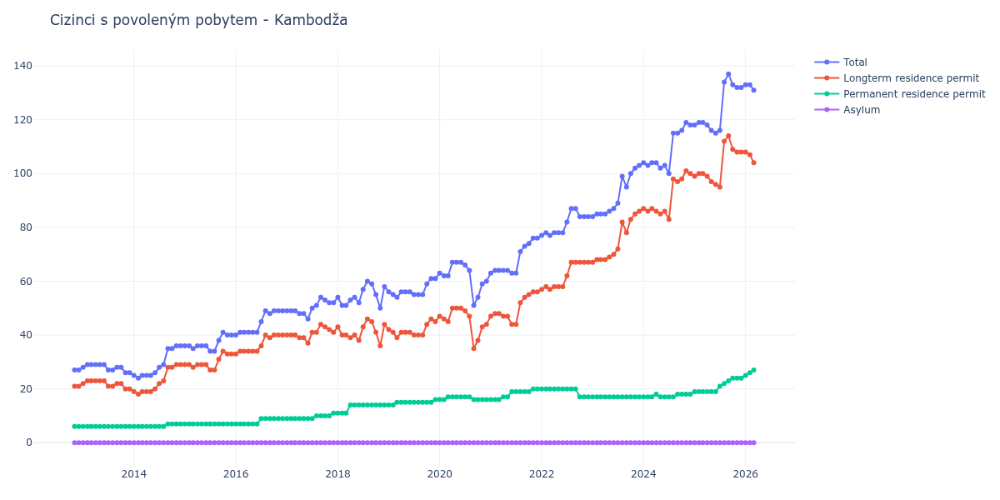

# Kambodža

## Souhrnné statistiky (Min/Max pro rok) / Summary Statistics (Min/Max per year)

| Year   | Total     | Longterm Residence Permit   | Permanent Residence Permit   | Asylum   |
|--------|-----------|-----------------------------|------------------------------|----------|
| 2012   | 27 / 27   | 21 / 21                     | 6 / 6                        | 0 / 0    |
| 2013   | 26 / 29   | 20 / 23                     | 6 / 6                        | 0 / 0    |
| 2014   | 24 / 36   | 18 / 29                     | 6 / 7                        | 0 / 0    |
| 2015   | 34 / 41   | 27 / 34                     | 7 / 7                        | 0 / 0    |
| 2016   | 40 / 49   | 33 / 40                     | 7 / 9                        | 0 / 0    |
| 2017   | 46 / 54   | 37 / 44                     | 9 / 11                       | 0 / 0    |
| 2018   | 50 / 60   | 36 / 46                     | 11 / 14                      | 0 / 0    |
| 2019   | 54 / 61   | 39 / 46                     | 14 / 16                      | 0 / 0    |
| 2020   | 51 / 67   | 35 / 50                     | 16 / 17                      | 0 / 0    |
| 2021   | 63 / 76   | 44 / 56                     | 16 / 20                      | 0 / 0    |
| 2022   | 77 / 87   | 57 / 67                     | 17 / 20                      | 0 / 0    |
| 2023   | 84 / 103  | 67 / 86                     | 17 / 17                      | 0 / 0    |
| 2024   | 100 / 119 | 83 / 101                    | 17 / 18                      | 0 / 0    |
| 2025   | 115 / 137 | 95 / 114                    | 19 / 24                      | 0 / 0    |
| 2026   | 131 / 133 | 104 / 108                   | 25 / 27                      | 0 / 0    |

## Detailní tabulka / Detailed Data Table

| Date     | Total         | Longterm Residence Permit   | Permanent Residence Permit   | Asylum   |
|----------|---------------|-----------------------------|------------------------------|----------|
| **2012** |               |                             |                              |          |
| 11.2012  | 27            | 21                          | 6                            | 0        |
| 12.2012  | 27 (+0.00%)   | 21 (+0.00%)                 | 6 (+0.00%)                   | 0        |
| **2013** |               |                             |                              |          |
| 01.2013  | 28 (+3.70%)   | 22 (+4.76%)                 | 6 (+0.00%)                   | 0        |
| 02.2013  | 29 (+3.57%)   | 23 (+4.55%)                 | 6 (+0.00%)                   | 0        |
| 03.2013  | 29 (+0.00%)   | 23 (+0.00%)                 | 6 (+0.00%)                   | 0        |
| 04.2013  | 29 (+0.00%)   | 23 (+0.00%)                 | 6 (+0.00%)                   | 0        |
| 05.2013  | 29 (+0.00%)   | 23 (+0.00%)                 | 6 (+0.00%)                   | 0        |
| 06.2013  | 29 (+0.00%)   | 23 (+0.00%)                 | 6 (+0.00%)                   | 0        |
| 07.2013  | 27 (-6.90%)   | 21 (-8.70%)                 | 6 (+0.00%)                   | 0        |
| 08.2013  | 27 (+0.00%)   | 21 (+0.00%)                 | 6 (+0.00%)                   | 0        |
| 09.2013  | 28 (+3.70%)   | 22 (+4.76%)                 | 6 (+0.00%)                   | 0        |
| 10.2013  | 28 (+0.00%)   | 22 (+0.00%)                 | 6 (+0.00%)                   | 0        |
| 11.2013  | 26 (-7.14%)   | 20 (-9.09%)                 | 6 (+0.00%)                   | 0        |
| 12.2013  | 26 (+0.00%)   | 20 (+0.00%)                 | 6 (+0.00%)                   | 0        |
| **2014** |               |                             |                              |          |
| 01.2014  | 25 (-3.85%)   | 19 (-5.00%)                 | 6 (+0.00%)                   | 0        |
| 02.2014  | 24 (-4.00%)   | 18 (-5.26%)                 | 6 (+0.00%)                   | 0        |
| 03.2014  | 25 (+4.17%)   | 19 (+5.56%)                 | 6 (+0.00%)                   | 0        |
| 04.2014  | 25 (+0.00%)   | 19 (+0.00%)                 | 6 (+0.00%)                   | 0        |
| 05.2014  | 25 (+0.00%)   | 19 (+0.00%)                 | 6 (+0.00%)                   | 0        |
| 06.2014  | 26 (+4.00%)   | 20 (+5.26%)                 | 6 (+0.00%)                   | 0        |
| 07.2014  | 28 (+7.69%)   | 22 (+10.00%)                | 6 (+0.00%)                   | 0        |
| 08.2014  | 29 (+3.57%)   | 23 (+4.55%)                 | 6 (+0.00%)                   | 0        |
| 09.2014  | 35 (+20.69%)  | 28 (+21.74%)                | 7 (+16.67%)                  | 0        |
| 10.2014  | 35 (+0.00%)   | 28 (+0.00%)                 | 7 (+0.00%)                   | 0        |
| 11.2014  | 36 (+2.86%)   | 29 (+3.57%)                 | 7 (+0.00%)                   | 0        |
| 12.2014  | 36 (+0.00%)   | 29 (+0.00%)                 | 7 (+0.00%)                   | 0        |
| **2015** |               |                             |                              |          |
| 01.2015  | 36 (+0.00%)   | 29 (+0.00%)                 | 7 (+0.00%)                   | 0        |
| 02.2015  | 36 (+0.00%)   | 29 (+0.00%)                 | 7 (+0.00%)                   | 0        |
| 03.2015  | 35 (-2.78%)   | 28 (-3.45%)                 | 7 (+0.00%)                   | 0        |
| 04.2015  | 36 (+2.86%)   | 29 (+3.57%)                 | 7 (+0.00%)                   | 0        |
| 05.2015  | 36 (+0.00%)   | 29 (+0.00%)                 | 7 (+0.00%)                   | 0        |
| 06.2015  | 36 (+0.00%)   | 29 (+0.00%)                 | 7 (+0.00%)                   | 0        |
| 07.2015  | 34 (-5.56%)   | 27 (-6.90%)                 | 7 (+0.00%)                   | 0        |
| 08.2015  | 34 (+0.00%)   | 27 (+0.00%)                 | 7 (+0.00%)                   | 0        |
| 09.2015  | 38 (+11.76%)  | 31 (+14.81%)                | 7 (+0.00%)                   | 0        |
| 10.2015  | 41 (+7.89%)   | 34 (+9.68%)                 | 7 (+0.00%)                   | 0        |
| 11.2015  | 40 (-2.44%)   | 33 (-2.94%)                 | 7 (+0.00%)                   | 0        |
| 12.2015  | 40 (+0.00%)   | 33 (+0.00%)                 | 7 (+0.00%)                   | 0        |
| **2016** |               |                             |                              |          |
| 01.2016  | 40 (+0.00%)   | 33 (+0.00%)                 | 7 (+0.00%)                   | 0        |
| 02.2016  | 41 (+2.50%)   | 34 (+3.03%)                 | 7 (+0.00%)                   | 0        |
| 03.2016  | 41 (+0.00%)   | 34 (+0.00%)                 | 7 (+0.00%)                   | 0        |
| 04.2016  | 41 (+0.00%)   | 34 (+0.00%)                 | 7 (+0.00%)                   | 0        |
| 05.2016  | 41 (+0.00%)   | 34 (+0.00%)                 | 7 (+0.00%)                   | 0        |
| 06.2016  | 41 (+0.00%)   | 34 (+0.00%)                 | 7 (+0.00%)                   | 0        |
| 07.2016  | 45 (+9.76%)   | 36 (+5.88%)                 | 9 (+28.57%)                  | 0        |
| 08.2016  | 49 (+8.89%)   | 40 (+11.11%)                | 9 (+0.00%)                   | 0        |
| 09.2016  | 48 (-2.04%)   | 39 (-2.50%)                 | 9 (+0.00%)                   | 0        |
| 10.2016  | 49 (+2.08%)   | 40 (+2.56%)                 | 9 (+0.00%)                   | 0        |
| 11.2016  | 49 (+0.00%)   | 40 (+0.00%)                 | 9 (+0.00%)                   | 0        |
| 12.2016  | 49 (+0.00%)   | 40 (+0.00%)                 | 9 (+0.00%)                   | 0        |
| **2017** |               |                             |                              |          |
| 01.2017  | 49 (+0.00%)   | 40 (+0.00%)                 | 9 (+0.00%)                   | 0        |
| 02.2017  | 49 (+0.00%)   | 40 (+0.00%)                 | 9 (+0.00%)                   | 0        |
| 03.2017  | 49 (+0.00%)   | 40 (+0.00%)                 | 9 (+0.00%)                   | 0        |
| 04.2017  | 48 (-2.04%)   | 39 (-2.50%)                 | 9 (+0.00%)                   | 0        |
| 05.2017  | 48 (+0.00%)   | 39 (+0.00%)                 | 9 (+0.00%)                   | 0        |
| 06.2017  | 46 (-4.17%)   | 37 (-5.13%)                 | 9 (+0.00%)                   | 0        |
| 07.2017  | 50 (+8.70%)   | 41 (+10.81%)                | 9 (+0.00%)                   | 0        |
| 08.2017  | 51 (+2.00%)   | 41 (+0.00%)                 | 10 (+11.11%)                 | 0        |
| 09.2017  | 54 (+5.88%)   | 44 (+7.32%)                 | 10 (+0.00%)                  | 0        |
| 10.2017  | 53 (-1.85%)   | 43 (-2.27%)                 | 10 (+0.00%)                  | 0        |
| 11.2017  | 52 (-1.89%)   | 42 (-2.33%)                 | 10 (+0.00%)                  | 0        |
| 12.2017  | 52 (+0.00%)   | 41 (-2.38%)                 | 11 (+10.00%)                 | 0        |
| **2018** |               |                             |                              |          |
| 01.2018  | 54 (+3.85%)   | 43 (+4.88%)                 | 11 (+0.00%)                  | 0        |
| 02.2018  | 51 (-5.56%)   | 40 (-6.98%)                 | 11 (+0.00%)                  | 0        |
| 03.2018  | 51 (+0.00%)   | 40 (+0.00%)                 | 11 (+0.00%)                  | 0        |
| 04.2018  | 53 (+3.92%)   | 39 (-2.50%)                 | 14 (+27.27%)                 | 0        |
| 05.2018  | 54 (+1.89%)   | 40 (+2.56%)                 | 14 (+0.00%)                  | 0        |
| 06.2018  | 52 (-3.70%)   | 38 (-5.00%)                 | 14 (+0.00%)                  | 0        |
| 07.2018  | 57 (+9.62%)   | 43 (+13.16%)                | 14 (+0.00%)                  | 0        |
| 08.2018  | 60 (+5.26%)   | 46 (+6.98%)                 | 14 (+0.00%)                  | 0        |
| 09.2018  | 59 (-1.67%)   | 45 (-2.17%)                 | 14 (+0.00%)                  | 0        |
| 10.2018  | 55 (-6.78%)   | 41 (-8.89%)                 | 14 (+0.00%)                  | 0        |
| 11.2018  | 50 (-9.09%)   | 36 (-12.20%)                | 14 (+0.00%)                  | 0        |
| 12.2018  | 58 (+16.00%)  | 44 (+22.22%)                | 14 (+0.00%)                  | 0        |
| **2019** |               |                             |                              |          |
| 01.2019  | 56 (-3.45%)   | 42 (-4.55%)                 | 14 (+0.00%)                  | 0        |
| 02.2019  | 55 (-1.79%)   | 41 (-2.38%)                 | 14 (+0.00%)                  | 0        |
| 03.2019  | 54 (-1.82%)   | 39 (-4.88%)                 | 15 (+7.14%)                  | 0        |
| 04.2019  | 56 (+3.70%)   | 41 (+5.13%)                 | 15 (+0.00%)                  | 0        |
| 05.2019  | 56 (+0.00%)   | 41 (+0.00%)                 | 15 (+0.00%)                  | 0        |
| 06.2019  | 56 (+0.00%)   | 41 (+0.00%)                 | 15 (+0.00%)                  | 0        |
| 07.2019  | 55 (-1.79%)   | 40 (-2.44%)                 | 15 (+0.00%)                  | 0        |
| 08.2019  | 55 (+0.00%)   | 40 (+0.00%)                 | 15 (+0.00%)                  | 0        |
| 09.2019  | 55 (+0.00%)   | 40 (+0.00%)                 | 15 (+0.00%)                  | 0        |
| 10.2019  | 59 (+7.27%)   | 44 (+10.00%)                | 15 (+0.00%)                  | 0        |
| 11.2019  | 61 (+3.39%)   | 46 (+4.55%)                 | 15 (+0.00%)                  | 0        |
| 12.2019  | 61 (+0.00%)   | 45 (-2.17%)                 | 16 (+6.67%)                  | 0        |
| **2020** |               |                             |                              |          |
| 01.2020  | 63 (+3.28%)   | 47 (+4.44%)                 | 16 (+0.00%)                  | 0        |
| 02.2020  | 62 (-1.59%)   | 46 (-2.13%)                 | 16 (+0.00%)                  | 0        |
| 03.2020  | 62 (+0.00%)   | 45 (-2.17%)                 | 17 (+6.25%)                  | 0        |
| 04.2020  | 67 (+8.06%)   | 50 (+11.11%)                | 17 (+0.00%)                  | 0        |
| 05.2020  | 67 (+0.00%)   | 50 (+0.00%)                 | 17 (+0.00%)                  | 0        |
| 06.2020  | 67 (+0.00%)   | 50 (+0.00%)                 | 17 (+0.00%)                  | 0        |
| 07.2020  | 66 (-1.49%)   | 49 (-2.00%)                 | 17 (+0.00%)                  | 0        |
| 08.2020  | 64 (-3.03%)   | 47 (-4.08%)                 | 17 (+0.00%)                  | 0        |
| 09.2020  | 51 (-20.31%)  | 35 (-25.53%)                | 16 (-5.88%)                  | 0        |
| 10.2020  | 54 (+5.88%)   | 38 (+8.57%)                 | 16 (+0.00%)                  | 0        |
| 11.2020  | 59 (+9.26%)   | 43 (+13.16%)                | 16 (+0.00%)                  | 0        |
| 12.2020  | 60 (+1.69%)   | 44 (+2.33%)                 | 16 (+0.00%)                  | 0        |
| **2021** |               |                             |                              |          |
| 01.2021  | 63 (+5.00%)   | 47 (+6.82%)                 | 16 (+0.00%)                  | 0        |
| 02.2021  | 64 (+1.59%)   | 48 (+2.13%)                 | 16 (+0.00%)                  | 0        |
| 03.2021  | 64 (+0.00%)   | 48 (+0.00%)                 | 16 (+0.00%)                  | 0        |
| 04.2021  | 64 (+0.00%)   | 47 (-2.08%)                 | 17 (+6.25%)                  | 0        |
| 05.2021  | 64 (+0.00%)   | 47 (+0.00%)                 | 17 (+0.00%)                  | 0        |
| 06.2021  | 63 (-1.56%)   | 44 (-6.38%)                 | 19 (+11.76%)                 | 0        |
| 07.2021  | 63 (+0.00%)   | 44 (+0.00%)                 | 19 (+0.00%)                  | 0        |
| 08.2021  | 71 (+12.70%)  | 52 (+18.18%)                | 19 (+0.00%)                  | 0        |
| 09.2021  | 73 (+2.82%)   | 54 (+3.85%)                 | 19 (+0.00%)                  | 0        |
| 10.2021  | 74 (+1.37%)   | 55 (+1.85%)                 | 19 (+0.00%)                  | 0        |
| 11.2021  | 76 (+2.70%)   | 56 (+1.82%)                 | 20 (+5.26%)                  | 0        |
| 12.2021  | 76 (+0.00%)   | 56 (+0.00%)                 | 20 (+0.00%)                  | 0        |
| **2022** |               |                             |                              |          |
| 01.2022  | 77 (+1.32%)   | 57 (+1.79%)                 | 20 (+0.00%)                  | 0        |
| 02.2022  | 78 (+1.30%)   | 58 (+1.75%)                 | 20 (+0.00%)                  | 0        |
| 03.2022  | 77 (-1.28%)   | 57 (-1.72%)                 | 20 (+0.00%)                  | 0        |
| 04.2022  | 78 (+1.30%)   | 58 (+1.75%)                 | 20 (+0.00%)                  | 0        |
| 05.2022  | 78 (+0.00%)   | 58 (+0.00%)                 | 20 (+0.00%)                  | 0        |
| 06.2022  | 78 (+0.00%)   | 58 (+0.00%)                 | 20 (+0.00%)                  | 0        |
| 07.2022  | 82 (+5.13%)   | 62 (+6.90%)                 | 20 (+0.00%)                  | 0        |
| 08.2022  | 87 (+6.10%)   | 67 (+8.06%)                 | 20 (+0.00%)                  | 0        |
| 09.2022  | 87 (+0.00%)   | 67 (+0.00%)                 | 20 (+0.00%)                  | 0        |
| 10.2022  | 84 (-3.45%)   | 67 (+0.00%)                 | 17 (-15.00%)                 | 0        |
| 11.2022  | 84 (+0.00%)   | 67 (+0.00%)                 | 17 (+0.00%)                  | 0        |
| 12.2022  | 84 (+0.00%)   | 67 (+0.00%)                 | 17 (+0.00%)                  | 0        |
| **2023** |               |                             |                              |          |
| 01.2023  | 84 (+0.00%)   | 67 (+0.00%)                 | 17 (+0.00%)                  | 0        |
| 02.2023  | 85 (+1.19%)   | 68 (+1.49%)                 | 17 (+0.00%)                  | 0        |
| 03.2023  | 85 (+0.00%)   | 68 (+0.00%)                 | 17 (+0.00%)                  | 0        |
| 04.2023  | 85 (+0.00%)   | 68 (+0.00%)                 | 17 (+0.00%)                  | 0        |
| 05.2023  | 86 (+1.18%)   | 69 (+1.47%)                 | 17 (+0.00%)                  | 0        |
| 06.2023  | 87 (+1.16%)   | 70 (+1.45%)                 | 17 (+0.00%)                  | 0        |
| 07.2023  | 89 (+2.30%)   | 72 (+2.86%)                 | 17 (+0.00%)                  | 0        |
| 08.2023  | 99 (+11.24%)  | 82 (+13.89%)                | 17 (+0.00%)                  | 0        |
| 09.2023  | 95 (-4.04%)   | 78 (-4.88%)                 | 17 (+0.00%)                  | 0        |
| 10.2023  | 100 (+5.26%)  | 83 (+6.41%)                 | 17 (+0.00%)                  | 0        |
| 11.2023  | 102 (+2.00%)  | 85 (+2.41%)                 | 17 (+0.00%)                  | 0        |
| 12.2023  | 103 (+0.98%)  | 86 (+1.18%)                 | 17 (+0.00%)                  | 0        |
| **2024** |               |                             |                              |          |
| 01.2024  | 104 (+0.97%)  | 87 (+1.16%)                 | 17 (+0.00%)                  | 0        |
| 02.2024  | 103 (-0.96%)  | 86 (-1.15%)                 | 17 (+0.00%)                  | 0        |
| 03.2024  | 104 (+0.97%)  | 87 (+1.16%)                 | 17 (+0.00%)                  | 0        |
| 04.2024  | 104 (+0.00%)  | 86 (-1.15%)                 | 18 (+5.88%)                  | 0        |
| 05.2024  | 102 (-1.92%)  | 85 (-1.16%)                 | 17 (-5.56%)                  | 0        |
| 06.2024  | 103 (+0.98%)  | 86 (+1.18%)                 | 17 (+0.00%)                  | 0        |
| 07.2024  | 100 (-2.91%)  | 83 (-3.49%)                 | 17 (+0.00%)                  | 0        |
| 08.2024  | 115 (+15.00%) | 98 (+18.07%)                | 17 (+0.00%)                  | 0        |
| 09.2024  | 115 (+0.00%)  | 97 (-1.02%)                 | 18 (+5.88%)                  | 0        |
| 10.2024  | 116 (+0.87%)  | 98 (+1.03%)                 | 18 (+0.00%)                  | 0        |
| 11.2024  | 119 (+2.59%)  | 101 (+3.06%)                | 18 (+0.00%)                  | 0        |
| 12.2024  | 118 (-0.84%)  | 100 (-0.99%)                | 18 (+0.00%)                  | 0        |
| **2025** |               |                             |                              |          |
| 01.2025  | 118 (+0.00%)  | 99 (-1.00%)                 | 19 (+5.56%)                  | 0        |
| 02.2025  | 119 (+0.85%)  | 100 (+1.01%)                | 19 (+0.00%)                  | 0        |
| 03.2025  | 119 (+0.00%)  | 100 (+0.00%)                | 19 (+0.00%)                  | 0        |
| 04.2025  | 118 (-0.84%)  | 99 (-1.00%)                 | 19 (+0.00%)                  | 0        |
| 05.2025  | 116 (-1.69%)  | 97 (-2.02%)                 | 19 (+0.00%)                  | 0        |
| 06.2025  | 115 (-0.86%)  | 96 (-1.03%)                 | 19 (+0.00%)                  | 0        |
| 07.2025  | 116 (+0.87%)  | 95 (-1.04%)                 | 21 (+10.53%)                 | 0        |
| 08.2025  | 134 (+15.52%) | 112 (+17.89%)               | 22 (+4.76%)                  | 0        |
| 09.2025  | 137 (+2.24%)  | 114 (+1.79%)                | 23 (+4.55%)                  | 0        |
| 10.2025  | 133 (-2.92%)  | 109 (-4.39%)                | 24 (+4.35%)                  | 0        |
| 11.2025  | 132 (-0.75%)  | 108 (-0.92%)                | 24 (+0.00%)                  | 0        |
| 12.2025  | 132 (+0.00%)  | 108 (+0.00%)                | 24 (+0.00%)                  | 0        |
| **2026** |               |                             |                              |          |
| 01.2026  | 133 (+0.76%)  | 108 (+0.00%)                | 25 (+4.17%)                  | 0        |
| 02.2026  | 133 (+0.00%)  | 107 (-0.93%)                | 26 (+4.00%)                  | 0        |
| 03.2026  | 131 (-1.50%)  | 104 (-2.80%)                | 27 (+3.85%)                  | 0        |
