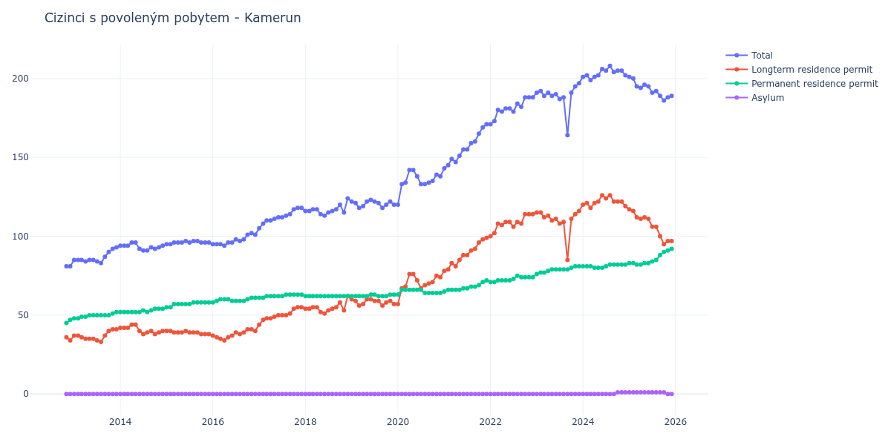

# Kamerun

## Souhrnné statistiky (Min/Max pro rok) / Summary Statistics (Min/Max per year)

| Year   | Total Min/Max   | Longterm Residence Permit Min/Max   | Permanent Residence Permit Min/Max   | Asylum Min/Max   |
|--------|-----------------|-------------------------------------|--------------------------------------|------------------|
| 2012   | 81 / 81         | 34 / 36                             | 45 / 47                              | 0 / 0            |
| 2013   | 83 / 93         | 33 / 41                             | 48 / 52                              | 0 / 0            |
| 2014   | 91 / 96         | 38 / 44                             | 52 / 54                              | 0 / 0            |
| 2015   | 95 / 97         | 38 / 40                             | 55 / 58                              | 0 / 0            |
| 2016   | 94 / 102        | 34 / 41                             | 58 / 61                              | 0 / 0            |
| 2017   | 105 / 118       | 44 / 55                             | 61 / 63                              | 0 / 0            |
| 2018   | 113 / 124       | 51 / 62                             | 62 / 62                              | 0 / 0            |
| 2019   | 118 / 123       | 56 / 60                             | 62 / 63                              | 0 / 0            |
| 2020   | 120 / 142       | 57 / 76                             | 63 / 66                              | 0 / 0            |
| 2021   | 143 / 171       | 78 / 99                             | 65 / 72                              | 0 / 0            |
| 2022   | 171 / 188       | 100 / 114                           | 71 / 75                              | 0 / 0            |
| 2023   | 164 / 197       | 85 / 116                            | 76 / 81                              | 0 / 0            |
| 2024   | 199 / 208       | 118 / 126                           | 80 / 82                              | 0 / 1            |
| 2025   | 186 / 201       | 95 / 117                            | 82 / 92                              | 0 / 1            |

## Detailní tabulka / Detailed Data Table

| Date     | Total         | Longterm Residence Permit   | Permanent Residence Permit   | Asylum       |
|----------|---------------|-----------------------------|------------------------------|--------------|
| **2012** |               |                             |                              |              |
| 11.2012  | 81            | 36                          | 45                           | 0            |
| 12.2012  | 81 (+0.00%)   | 34 (-5.56%)                 | 47 (+4.44%)                  | 0            |
| **2013** |               |                             |                              |              |
| 01.2013  | 85 (+4.94%)   | 37 (+8.82%)                 | 48 (+2.13%)                  | 0            |
| 02.2013  | 85 (+0.00%)   | 37 (+0.00%)                 | 48 (+0.00%)                  | 0            |
| 03.2013  | 85 (+0.00%)   | 36 (-2.70%)                 | 49 (+2.08%)                  | 0            |
| 04.2013  | 84 (-1.18%)   | 35 (-2.78%)                 | 49 (+0.00%)                  | 0            |
| 05.2013  | 85 (+1.19%)   | 35 (+0.00%)                 | 50 (+2.04%)                  | 0            |
| 06.2013  | 85 (+0.00%)   | 35 (+0.00%)                 | 50 (+0.00%)                  | 0            |
| 07.2013  | 84 (-1.18%)   | 34 (-2.86%)                 | 50 (+0.00%)                  | 0            |
| 08.2013  | 83 (-1.19%)   | 33 (-2.94%)                 | 50 (+0.00%)                  | 0            |
| 09.2013  | 87 (+4.82%)   | 37 (+12.12%)                | 50 (+0.00%)                  | 0            |
| 10.2013  | 90 (+3.45%)   | 40 (+8.11%)                 | 50 (+0.00%)                  | 0            |
| 11.2013  | 92 (+2.22%)   | 41 (+2.50%)                 | 51 (+2.00%)                  | 0            |
| 12.2013  | 93 (+1.09%)   | 41 (+0.00%)                 | 52 (+1.96%)                  | 0            |
| **2014** |               |                             |                              |              |
| 01.2014  | 94 (+1.08%)   | 42 (+2.44%)                 | 52 (+0.00%)                  | 0            |
| 02.2014  | 94 (+0.00%)   | 42 (+0.00%)                 | 52 (+0.00%)                  | 0            |
| 03.2014  | 94 (+0.00%)   | 42 (+0.00%)                 | 52 (+0.00%)                  | 0            |
| 04.2014  | 96 (+2.13%)   | 44 (+4.76%)                 | 52 (+0.00%)                  | 0            |
| 05.2014  | 96 (+0.00%)   | 44 (+0.00%)                 | 52 (+0.00%)                  | 0            |
| 06.2014  | 92 (-4.17%)   | 40 (-9.09%)                 | 52 (+0.00%)                  | 0            |
| 07.2014  | 91 (-1.09%)   | 38 (-5.00%)                 | 53 (+1.92%)                  | 0            |
| 08.2014  | 91 (+0.00%)   | 39 (+2.63%)                 | 52 (-1.89%)                  | 0            |
| 09.2014  | 93 (+2.20%)   | 40 (+2.56%)                 | 53 (+1.92%)                  | 0            |
| 10.2014  | 92 (-1.08%)   | 38 (-5.00%)                 | 54 (+1.89%)                  | 0            |
| 11.2014  | 93 (+1.09%)   | 39 (+2.63%)                 | 54 (+0.00%)                  | 0            |
| 12.2014  | 94 (+1.08%)   | 40 (+2.56%)                 | 54 (+0.00%)                  | 0            |
| **2015** |               |                             |                              |              |
| 01.2015  | 95 (+1.06%)   | 40 (+0.00%)                 | 55 (+1.85%)                  | 0            |
| 02.2015  | 95 (+0.00%)   | 40 (+0.00%)                 | 55 (+0.00%)                  | 0            |
| 03.2015  | 96 (+1.05%)   | 39 (-2.50%)                 | 57 (+3.64%)                  | 0            |
| 04.2015  | 96 (+0.00%)   | 39 (+0.00%)                 | 57 (+0.00%)                  | 0            |
| 05.2015  | 96 (+0.00%)   | 39 (+0.00%)                 | 57 (+0.00%)                  | 0            |
| 06.2015  | 97 (+1.04%)   | 40 (+2.56%)                 | 57 (+0.00%)                  | 0            |
| 07.2015  | 96 (-1.03%)   | 39 (-2.50%)                 | 57 (+0.00%)                  | 0            |
| 08.2015  | 97 (+1.04%)   | 39 (+0.00%)                 | 58 (+1.75%)                  | 0            |
| 09.2015  | 97 (+0.00%)   | 39 (+0.00%)                 | 58 (+0.00%)                  | 0            |
| 10.2015  | 96 (-1.03%)   | 38 (-2.56%)                 | 58 (+0.00%)                  | 0            |
| 11.2015  | 96 (+0.00%)   | 38 (+0.00%)                 | 58 (+0.00%)                  | 0            |
| 12.2015  | 96 (+0.00%)   | 38 (+0.00%)                 | 58 (+0.00%)                  | 0            |
| **2016** |               |                             |                              |              |
| 01.2016  | 95 (-1.04%)   | 37 (-2.63%)                 | 58 (+0.00%)                  | 0            |
| 02.2016  | 95 (+0.00%)   | 36 (-2.70%)                 | 59 (+1.72%)                  | 0            |
| 03.2016  | 95 (+0.00%)   | 35 (-2.78%)                 | 60 (+1.69%)                  | 0            |
| 04.2016  | 94 (-1.05%)   | 34 (-2.86%)                 | 60 (+0.00%)                  | 0            |
| 05.2016  | 96 (+2.13%)   | 36 (+5.88%)                 | 60 (+0.00%)                  | 0            |
| 06.2016  | 96 (+0.00%)   | 37 (+2.78%)                 | 59 (-1.67%)                  | 0            |
| 07.2016  | 98 (+2.08%)   | 39 (+5.41%)                 | 59 (+0.00%)                  | 0            |
| 08.2016  | 97 (-1.02%)   | 38 (-2.56%)                 | 59 (+0.00%)                  | 0            |
| 09.2016  | 98 (+1.03%)   | 39 (+2.63%)                 | 59 (+0.00%)                  | 0            |
| 10.2016  | 101 (+3.06%)  | 41 (+5.13%)                 | 60 (+1.69%)                  | 0            |
| 11.2016  | 102 (+0.99%)  | 41 (+0.00%)                 | 61 (+1.67%)                  | 0            |
| 12.2016  | 101 (-0.98%)  | 40 (-2.44%)                 | 61 (+0.00%)                  | 0            |
| **2017** |               |                             |                              |              |
| 01.2017  | 105 (+3.96%)  | 44 (+10.00%)                | 61 (+0.00%)                  | 0            |
| 02.2017  | 108 (+2.86%)  | 47 (+6.82%)                 | 61 (+0.00%)                  | 0            |
| 03.2017  | 110 (+1.85%)  | 48 (+2.13%)                 | 62 (+1.64%)                  | 0            |
| 04.2017  | 110 (+0.00%)  | 48 (+0.00%)                 | 62 (+0.00%)                  | 0            |
| 05.2017  | 111 (+0.91%)  | 49 (+2.08%)                 | 62 (+0.00%)                  | 0            |
| 06.2017  | 112 (+0.90%)  | 50 (+2.04%)                 | 62 (+0.00%)                  | 0            |
| 07.2017  | 112 (+0.00%)  | 50 (+0.00%)                 | 62 (+0.00%)                  | 0            |
| 08.2017  | 113 (+0.89%)  | 50 (+0.00%)                 | 63 (+1.61%)                  | 0            |
| 09.2017  | 114 (+0.88%)  | 51 (+2.00%)                 | 63 (+0.00%)                  | 0            |
| 10.2017  | 117 (+2.63%)  | 54 (+5.88%)                 | 63 (+0.00%)                  | 0            |
| 11.2017  | 118 (+0.85%)  | 55 (+1.85%)                 | 63 (+0.00%)                  | 0            |
| 12.2017  | 118 (+0.00%)  | 55 (+0.00%)                 | 63 (+0.00%)                  | 0            |
| **2018** |               |                             |                              |              |
| 01.2018  | 116 (-1.69%)  | 54 (-1.82%)                 | 62 (-1.59%)                  | 0            |
| 02.2018  | 116 (+0.00%)  | 54 (+0.00%)                 | 62 (+0.00%)                  | 0            |
| 03.2018  | 117 (+0.86%)  | 55 (+1.85%)                 | 62 (+0.00%)                  | 0            |
| 04.2018  | 117 (+0.00%)  | 55 (+0.00%)                 | 62 (+0.00%)                  | 0            |
| 05.2018  | 114 (-2.56%)  | 52 (-5.45%)                 | 62 (+0.00%)                  | 0            |
| 06.2018  | 113 (-0.88%)  | 51 (-1.92%)                 | 62 (+0.00%)                  | 0            |
| 07.2018  | 115 (+1.77%)  | 53 (+3.92%)                 | 62 (+0.00%)                  | 0            |
| 08.2018  | 116 (+0.87%)  | 54 (+1.89%)                 | 62 (+0.00%)                  | 0            |
| 09.2018  | 117 (+0.86%)  | 55 (+1.85%)                 | 62 (+0.00%)                  | 0            |
| 10.2018  | 120 (+2.56%)  | 58 (+5.45%)                 | 62 (+0.00%)                  | 0            |
| 11.2018  | 115 (-4.17%)  | 53 (-8.62%)                 | 62 (+0.00%)                  | 0            |
| 12.2018  | 124 (+7.83%)  | 62 (+16.98%)                | 62 (+0.00%)                  | 0            |
| **2019** |               |                             |                              |              |
| 01.2019  | 122 (-1.61%)  | 60 (-3.23%)                 | 62 (+0.00%)                  | 0            |
| 02.2019  | 121 (-0.82%)  | 59 (-1.67%)                 | 62 (+0.00%)                  | 0            |
| 03.2019  | 118 (-2.48%)  | 56 (-5.08%)                 | 62 (+0.00%)                  | 0            |
| 04.2019  | 119 (+0.85%)  | 57 (+1.79%)                 | 62 (+0.00%)                  | 0            |
| 05.2019  | 122 (+2.52%)  | 60 (+5.26%)                 | 62 (+0.00%)                  | 0            |
| 06.2019  | 123 (+0.82%)  | 60 (+0.00%)                 | 63 (+1.61%)                  | 0            |
| 07.2019  | 122 (-0.81%)  | 59 (-1.67%)                 | 63 (+0.00%)                  | 0            |
| 08.2019  | 121 (-0.82%)  | 59 (+0.00%)                 | 62 (-1.59%)                  | 0            |
| 09.2019  | 118 (-2.48%)  | 56 (-5.08%)                 | 62 (+0.00%)                  | 0            |
| 10.2019  | 120 (+1.69%)  | 58 (+3.57%)                 | 62 (+0.00%)                  | 0            |
| 11.2019  | 122 (+1.67%)  | 59 (+1.72%)                 | 63 (+1.61%)                  | 0            |
| 12.2019  | 120 (-1.64%)  | 57 (-3.39%)                 | 63 (+0.00%)                  | 0            |
| **2020** |               |                             |                              |              |
| 01.2020  | 120 (+0.00%)  | 57 (+0.00%)                 | 63 (+0.00%)                  | 0            |
| 02.2020  | 133 (+10.83%) | 67 (+17.54%)                | 66 (+4.76%)                  | 0            |
| 03.2020  | 134 (+0.75%)  | 68 (+1.49%)                 | 66 (+0.00%)                  | 0            |
| 04.2020  | 142 (+5.97%)  | 76 (+11.76%)                | 66 (+0.00%)                  | 0            |
| 05.2020  | 142 (+0.00%)  | 76 (+0.00%)                 | 66 (+0.00%)                  | 0            |
| 06.2020  | 138 (-2.82%)  | 72 (-5.26%)                 | 66 (+0.00%)                  | 0            |
| 07.2020  | 133 (-3.62%)  | 67 (-6.94%)                 | 66 (+0.00%)                  | 0            |
| 08.2020  | 133 (+0.00%)  | 69 (+2.99%)                 | 64 (-3.03%)                  | 0            |
| 09.2020  | 134 (+0.75%)  | 70 (+1.45%)                 | 64 (+0.00%)                  | 0            |
| 10.2020  | 135 (+0.75%)  | 71 (+1.43%)                 | 64 (+0.00%)                  | 0            |
| 11.2020  | 139 (+2.96%)  | 75 (+5.63%)                 | 64 (+0.00%)                  | 0            |
| 12.2020  | 138 (-0.72%)  | 74 (-1.33%)                 | 64 (+0.00%)                  | 0            |
| **2021** |               |                             |                              |              |
| 01.2021  | 143 (+3.62%)  | 78 (+5.41%)                 | 65 (+1.56%)                  | 0            |
| 02.2021  | 145 (+1.40%)  | 79 (+1.28%)                 | 66 (+1.54%)                  | 0            |
| 03.2021  | 149 (+2.76%)  | 83 (+5.06%)                 | 66 (+0.00%)                  | 0            |
| 04.2021  | 147 (-1.34%)  | 81 (-2.41%)                 | 66 (+0.00%)                  | 0            |
| 05.2021  | 151 (+2.72%)  | 85 (+4.94%)                 | 66 (+0.00%)                  | 0            |
| 06.2021  | 155 (+2.65%)  | 88 (+3.53%)                 | 67 (+1.52%)                  | 0            |
| 07.2021  | 155 (+0.00%)  | 88 (+0.00%)                 | 67 (+0.00%)                  | 0            |
| 08.2021  | 159 (+2.58%)  | 91 (+3.41%)                 | 68 (+1.49%)                  | 0            |
| 09.2021  | 160 (+0.63%)  | 92 (+1.10%)                 | 68 (+0.00%)                  | 0            |
| 10.2021  | 165 (+3.12%)  | 96 (+4.35%)                 | 69 (+1.47%)                  | 0            |
| 11.2021  | 169 (+2.42%)  | 98 (+2.08%)                 | 71 (+2.90%)                  | 0            |
| 12.2021  | 171 (+1.18%)  | 99 (+1.02%)                 | 72 (+1.41%)                  | 0            |
| **2022** |               |                             |                              |              |
| 01.2022  | 171 (+0.00%)  | 100 (+1.01%)                | 71 (-1.39%)                  | 0            |
| 02.2022  | 173 (+1.17%)  | 102 (+2.00%)                | 71 (+0.00%)                  | 0            |
| 03.2022  | 180 (+4.05%)  | 108 (+5.88%)                | 72 (+1.41%)                  | 0            |
| 04.2022  | 179 (-0.56%)  | 107 (-0.93%)                | 72 (+0.00%)                  | 0            |
| 05.2022  | 181 (+1.12%)  | 109 (+1.87%)                | 72 (+0.00%)                  | 0            |
| 06.2022  | 181 (+0.00%)  | 109 (+0.00%)                | 72 (+0.00%)                  | 0            |
| 07.2022  | 179 (-1.10%)  | 106 (-2.75%)                | 73 (+1.39%)                  | 0            |
| 08.2022  | 184 (+2.79%)  | 109 (+2.83%)                | 75 (+2.74%)                  | 0            |
| 09.2022  | 182 (-1.09%)  | 108 (-0.92%)                | 74 (-1.33%)                  | 0            |
| 10.2022  | 188 (+3.30%)  | 114 (+5.56%)                | 74 (+0.00%)                  | 0            |
| 11.2022  | 188 (+0.00%)  | 114 (+0.00%)                | 74 (+0.00%)                  | 0            |
| 12.2022  | 188 (+0.00%)  | 114 (+0.00%)                | 74 (+0.00%)                  | 0            |
| **2023** |               |                             |                              |              |
| 01.2023  | 191 (+1.60%)  | 115 (+0.88%)                | 76 (+2.70%)                  | 0            |
| 02.2023  | 192 (+0.52%)  | 115 (+0.00%)                | 77 (+1.32%)                  | 0            |
| 03.2023  | 189 (-1.56%)  | 112 (-2.61%)                | 77 (+0.00%)                  | 0            |
| 04.2023  | 191 (+1.06%)  | 113 (+0.89%)                | 78 (+1.30%)                  | 0            |
| 05.2023  | 189 (-1.05%)  | 110 (-2.65%)                | 79 (+1.28%)                  | 0            |
| 06.2023  | 190 (+0.53%)  | 111 (+0.91%)                | 79 (+0.00%)                  | 0            |
| 07.2023  | 187 (-1.58%)  | 108 (-2.70%)                | 79 (+0.00%)                  | 0            |
| 08.2023  | 188 (+0.53%)  | 109 (+0.93%)                | 79 (+0.00%)                  | 0            |
| 09.2023  | 164 (-12.77%) | 85 (-22.02%)                | 79 (+0.00%)                  | 0            |
| 10.2023  | 191 (+16.46%) | 111 (+30.59%)               | 80 (+1.27%)                  | 0            |
| 11.2023  | 195 (+2.09%)  | 114 (+2.70%)                | 81 (+1.25%)                  | 0            |
| 12.2023  | 197 (+1.03%)  | 116 (+1.75%)                | 81 (+0.00%)                  | 0            |
| **2024** |               |                             |                              |              |
| 01.2024  | 201 (+2.03%)  | 120 (+3.45%)                | 81 (+0.00%)                  | 0            |
| 02.2024  | 202 (+0.50%)  | 121 (+0.83%)                | 81 (+0.00%)                  | 0            |
| 03.2024  | 199 (-1.49%)  | 118 (-2.48%)                | 81 (+0.00%)                  | 0            |
| 04.2024  | 201 (+1.01%)  | 121 (+2.54%)                | 80 (-1.23%)                  | 0            |
| 05.2024  | 202 (+0.50%)  | 122 (+0.83%)                | 80 (+0.00%)                  | 0            |
| 06.2024  | 206 (+1.98%)  | 126 (+3.28%)                | 80 (+0.00%)                  | 0            |
| 07.2024  | 205 (-0.49%)  | 124 (-1.59%)                | 81 (+1.25%)                  | 0            |
| 08.2024  | 208 (+1.46%)  | 126 (+1.61%)                | 82 (+1.23%)                  | 0            |
| 09.2024  | 204 (-1.92%)  | 122 (-3.17%)                | 82 (+0.00%)                  | 0            |
| 10.2024  | 205 (+0.49%)  | 122 (+0.00%)                | 82 (+0.00%)                  | 1            |
| 11.2024  | 205 (+0.00%)  | 122 (+0.00%)                | 82 (+0.00%)                  | 1 (+0.00%)   |
| 12.2024  | 202 (-1.46%)  | 119 (-2.46%)                | 82 (+0.00%)                  | 1 (+0.00%)   |
| **2025** |               |                             |                              |              |
| 01.2025  | 201 (-0.50%)  | 117 (-1.68%)                | 83 (+1.22%)                  | 1 (+0.00%)   |
| 02.2025  | 200 (-0.50%)  | 116 (-0.85%)                | 83 (+0.00%)                  | 1 (+0.00%)   |
| 03.2025  | 195 (-2.50%)  | 112 (-3.45%)                | 82 (-1.20%)                  | 1 (+0.00%)   |
| 04.2025  | 194 (-0.51%)  | 111 (-0.89%)                | 82 (+0.00%)                  | 1 (+0.00%)   |
| 05.2025  | 196 (+1.03%)  | 112 (+0.90%)                | 83 (+1.22%)                  | 1 (+0.00%)   |
| 06.2025  | 195 (-0.51%)  | 111 (-0.89%)                | 83 (+0.00%)                  | 1 (+0.00%)   |
| 07.2025  | 191 (-2.05%)  | 106 (-4.50%)                | 84 (+1.20%)                  | 1 (+0.00%)   |
| 08.2025  | 192 (+0.52%)  | 106 (+0.00%)                | 85 (+1.19%)                  | 1 (+0.00%)   |
| 09.2025  | 189 (-1.56%)  | 100 (-5.66%)                | 88 (+3.53%)                  | 1 (+0.00%)   |
| 10.2025  | 186 (-1.59%)  | 95 (-5.00%)                 | 90 (+2.27%)                  | 1 (+0.00%)   |
| 11.2025  | 188 (+1.08%)  | 97 (+2.11%)                 | 91 (+1.11%)                  | 0 (-100.00%) |
| 12.2025  | 189 (+0.53%)  | 97 (+0.00%)                 | 92 (+1.10%)                  | 0            |
