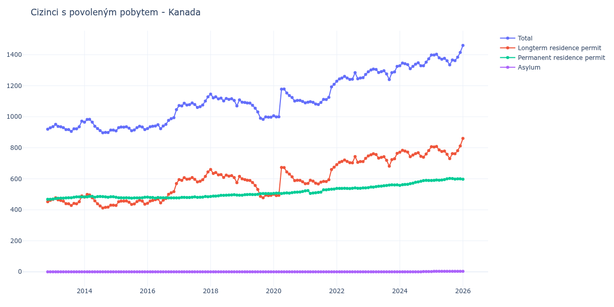

# Kanada

## Souhrnné statistiky (Min/Max pro rok) / Summary Statistics (Min/Max per year)

| Year   | Total         | Longterm Residence Permit   | Permanent Residence Permit   | Asylum   |
|--------|---------------|-----------------------------|------------------------------|----------|
| 2012   | 920 / 929     | 452 / 461                   | 468 / 468                    | 0 / 0    |
| 2013   | 906 / 972     | 428 / 489                   | 469 / 483                    | 0 / 0    |
| 2014   | 897 / 983     | 412 / 499                   | 481 / 487                    | 0 / 0    |
| 2015   | 909 / 939     | 428 / 462                   | 475 / 481                    | 0 / 0    |
| 2016   | 923 / 1 046   | 442 / 569                   | 475 / 482                    | 0 / 0    |
| 2017   | 1 060 / 1 128 | 580 / 644                   | 477 / 486                    | 0 / 0    |
| 2018   | 1 070 / 1 146 | 575 / 660                   | 486 / 497                    | 0 / 0    |
| 2019   | 983 / 1 094   | 478 / 600                   | 494 / 505                    | 0 / 0    |
| 2020   | 999 / 1 179   | 492 / 673                   | 505 / 518                    | 0 / 0    |
| 2021   | 1 079 / 1 209 | 567 / 675                   | 506 / 534                    | 0 / 0    |
| 2022   | 1 229 / 1 284 | 691 / 743                   | 537 / 541                    | 0 / 0    |
| 2023   | 1 240 / 1 325 | 681 / 764                   | 543 / 561                    | 0 / 0    |
| 2024   | 1 310 / 1 373 | 739 / 784                   | 558 / 590                    | 0 / 2    |
| 2025   | 1 335 / 1 415 | 730 / 812                   | 589 / 602                    | 2 / 3    |
| 2026   | 1 460 / 1 460 | 860 / 860                   | 597 / 597                    | 3 / 3    |

## Detailní tabulka / Detailed Data Table

| Date     | Total           | Longterm Residence Permit   | Permanent Residence Permit   | Asylum      |
|----------|-----------------|-----------------------------|------------------------------|-------------|
| **2012** |                 |                             |                              |             |
| 11.2012  | 920             | 452                         | 468                          | 0           |
| 12.2012  | 929 (+0.98%)    | 461 (+1.99%)                | 468 (+0.00%)                 | 0           |
| **2013** |                 |                             |                              |             |
| 01.2013  | 936 (+0.75%)    | 467 (+1.30%)                | 469 (+0.21%)                 | 0           |
| 02.2013  | 951 (+1.60%)    | 478 (+2.36%)                | 473 (+0.85%)                 | 0           |
| 03.2013  | 938 (-1.37%)    | 464 (-2.93%)                | 474 (+0.21%)                 | 0           |
| 04.2013  | 935 (-0.32%)    | 460 (-0.86%)                | 475 (+0.21%)                 | 0           |
| 05.2013  | 930 (-0.53%)    | 455 (-1.09%)                | 475 (+0.00%)                 | 0           |
| 06.2013  | 917 (-1.40%)    | 440 (-3.30%)                | 477 (+0.42%)                 | 0           |
| 07.2013  | 917 (+0.00%)    | 439 (-0.23%)                | 478 (+0.21%)                 | 0           |
| 08.2013  | 906 (-1.20%)    | 428 (-2.51%)                | 478 (+0.00%)                 | 0           |
| 09.2013  | 922 (+1.77%)    | 441 (+3.04%)                | 481 (+0.63%)                 | 0           |
| 10.2013  | 922 (+0.00%)    | 439 (-0.45%)                | 483 (+0.42%)                 | 0           |
| 11.2013  | 935 (+1.41%)    | 452 (+2.96%)                | 483 (+0.00%)                 | 0           |
| 12.2013  | 972 (+3.96%)    | 489 (+8.19%)                | 483 (+0.00%)                 | 0           |
| **2014** |                 |                             |                              |             |
| 01.2014  | 965 (-0.72%)    | 482 (-1.43%)                | 483 (+0.00%)                 | 0           |
| 02.2014  | 982 (+1.76%)    | 499 (+3.53%)                | 483 (+0.00%)                 | 0           |
| 03.2014  | 983 (+0.10%)    | 496 (-0.60%)                | 487 (+0.83%)                 | 0           |
| 04.2014  | 965 (-1.83%)    | 478 (-3.63%)                | 487 (+0.00%)                 | 0           |
| 05.2014  | 939 (-2.69%)    | 458 (-4.18%)                | 481 (-1.23%)                 | 0           |
| 06.2014  | 924 (-1.60%)    | 439 (-4.15%)                | 485 (+0.83%)                 | 0           |
| 07.2014  | 911 (-1.41%)    | 425 (-3.19%)                | 486 (+0.21%)                 | 0           |
| 08.2014  | 897 (-1.54%)    | 412 (-3.06%)                | 485 (-0.21%)                 | 0           |
| 09.2014  | 899 (+0.22%)    | 416 (+0.97%)                | 483 (-0.41%)                 | 0           |
| 10.2014  | 898 (-0.11%)    | 417 (+0.24%)                | 481 (-0.41%)                 | 0           |
| 11.2014  | 914 (+1.78%)    | 430 (+3.12%)                | 484 (+0.62%)                 | 0           |
| 12.2014  | 914 (+0.00%)    | 430 (+0.00%)                | 484 (+0.00%)                 | 0           |
| **2015** |                 |                             |                              |             |
| 01.2015  | 909 (-0.55%)    | 428 (-0.47%)                | 481 (-0.62%)                 | 0           |
| 02.2015  | 930 (+2.31%)    | 452 (+5.61%)                | 478 (-0.62%)                 | 0           |
| 03.2015  | 934 (+0.43%)    | 456 (+0.88%)                | 478 (+0.00%)                 | 0           |
| 04.2015  | 933 (-0.11%)    | 456 (+0.00%)                | 477 (-0.21%)                 | 0           |
| 05.2015  | 935 (+0.21%)    | 457 (+0.22%)                | 478 (+0.21%)                 | 0           |
| 06.2015  | 926 (-0.96%)    | 449 (-1.75%)                | 477 (-0.21%)                 | 0           |
| 07.2015  | 910 (-1.73%)    | 435 (-3.12%)                | 475 (-0.42%)                 | 0           |
| 08.2015  | 915 (+0.55%)    | 438 (+0.69%)                | 477 (+0.42%)                 | 0           |
| 09.2015  | 930 (+1.64%)    | 453 (+3.42%)                | 477 (+0.00%)                 | 0           |
| 10.2015  | 939 (+0.97%)    | 462 (+1.99%)                | 477 (+0.00%)                 | 0           |
| 11.2015  | 934 (-0.53%)    | 456 (-1.30%)                | 478 (+0.21%)                 | 0           |
| 12.2015  | 917 (-1.82%)    | 436 (-4.39%)                | 481 (+0.63%)                 | 0           |
| **2016** |                 |                             |                              |             |
| 01.2016  | 924 (+0.76%)    | 442 (+1.38%)                | 482 (+0.21%)                 | 0           |
| 02.2016  | 935 (+1.19%)    | 456 (+3.17%)                | 479 (-0.62%)                 | 0           |
| 03.2016  | 939 (+0.43%)    | 460 (+0.88%)                | 479 (+0.00%)                 | 0           |
| 04.2016  | 940 (+0.11%)    | 465 (+1.09%)                | 475 (-0.84%)                 | 0           |
| 05.2016  | 949 (+0.96%)    | 470 (+1.08%)                | 479 (+0.84%)                 | 0           |
| 06.2016  | 923 (-2.74%)    | 445 (-5.32%)                | 478 (-0.21%)                 | 0           |
| 07.2016  | 940 (+1.84%)    | 462 (+3.82%)                | 478 (+0.00%)                 | 0           |
| 08.2016  | 951 (+1.17%)    | 473 (+2.38%)                | 478 (+0.00%)                 | 0           |
| 09.2016  | 977 (+2.73%)    | 500 (+5.71%)                | 477 (-0.21%)                 | 0           |
| 10.2016  | 987 (+1.02%)    | 510 (+2.00%)                | 477 (+0.00%)                 | 0           |
| 11.2016  | 994 (+0.71%)    | 517 (+1.37%)                | 477 (+0.00%)                 | 0           |
| 12.2016  | 1 046 (+5.23%)  | 569 (+10.06%)               | 477 (+0.00%)                 | 0           |
| **2017** |                 |                             |                              |             |
| 01.2017  | 1 072 (+2.49%)  | 595 (+4.57%)                | 477 (+0.00%)                 | 0           |
| 02.2017  | 1 070 (-0.19%)  | 590 (-0.84%)                | 480 (+0.63%)                 | 0           |
| 03.2017  | 1 087 (+1.59%)  | 607 (+2.88%)                | 480 (+0.00%)                 | 0           |
| 04.2017  | 1 076 (-1.01%)  | 597 (-1.65%)                | 479 (-0.21%)                 | 0           |
| 05.2017  | 1 078 (+0.19%)  | 599 (+0.34%)                | 479 (+0.00%)                 | 0           |
| 06.2017  | 1 089 (+1.02%)  | 608 (+1.50%)                | 481 (+0.42%)                 | 0           |
| 07.2017  | 1 079 (-0.92%)  | 596 (-1.97%)                | 483 (+0.42%)                 | 0           |
| 08.2017  | 1 060 (-1.76%)  | 580 (-2.68%)                | 480 (-0.62%)                 | 0           |
| 09.2017  | 1 065 (+0.47%)  | 584 (+0.69%)                | 481 (+0.21%)                 | 0           |
| 10.2017  | 1 076 (+1.03%)  | 594 (+1.71%)                | 482 (+0.21%)                 | 0           |
| 11.2017  | 1 101 (+2.32%)  | 615 (+3.54%)                | 486 (+0.83%)                 | 0           |
| 12.2017  | 1 128 (+2.45%)  | 644 (+4.72%)                | 484 (-0.41%)                 | 0           |
| **2018** |                 |                             |                              |             |
| 01.2018  | 1 146 (+1.60%)  | 660 (+2.48%)                | 486 (+0.41%)                 | 0           |
| 02.2018  | 1 122 (-2.09%)  | 634 (-3.94%)                | 488 (+0.41%)                 | 0           |
| 03.2018  | 1 128 (+0.53%)  | 640 (+0.95%)                | 488 (+0.00%)                 | 0           |
| 04.2018  | 1 115 (-1.15%)  | 625 (-2.34%)                | 490 (+0.41%)                 | 0           |
| 05.2018  | 1 120 (+0.45%)  | 627 (+0.32%)                | 493 (+0.61%)                 | 0           |
| 06.2018  | 1 102 (-1.61%)  | 609 (-2.87%)                | 493 (+0.00%)                 | 0           |
| 07.2018  | 1 118 (+1.45%)  | 624 (+2.46%)                | 494 (+0.20%)                 | 0           |
| 08.2018  | 1 112 (-0.54%)  | 617 (-1.12%)                | 495 (+0.20%)                 | 0           |
| 09.2018  | 1 116 (+0.36%)  | 620 (+0.49%)                | 496 (+0.20%)                 | 0           |
| 10.2018  | 1 105 (-0.99%)  | 608 (-1.94%)                | 497 (+0.20%)                 | 0           |
| 11.2018  | 1 070 (-3.17%)  | 575 (-5.43%)                | 495 (-0.40%)                 | 0           |
| 12.2018  | 1 109 (+3.64%)  | 615 (+6.96%)                | 494 (-0.20%)                 | 0           |
| **2019** |                 |                             |                              |             |
| 01.2019  | 1 094 (-1.35%)  | 600 (-2.44%)                | 494 (+0.00%)                 | 0           |
| 02.2019  | 1 092 (-0.18%)  | 595 (-0.83%)                | 497 (+0.61%)                 | 0           |
| 03.2019  | 1 089 (-0.27%)  | 591 (-0.67%)                | 498 (+0.20%)                 | 0           |
| 04.2019  | 1 088 (-0.09%)  | 589 (-0.34%)                | 499 (+0.20%)                 | 0           |
| 05.2019  | 1 074 (-1.29%)  | 576 (-2.21%)                | 498 (-0.20%)                 | 0           |
| 06.2019  | 1 055 (-1.77%)  | 557 (-3.30%)                | 498 (+0.00%)                 | 0           |
| 07.2019  | 1 031 (-2.27%)  | 531 (-4.67%)                | 500 (+0.40%)                 | 0           |
| 08.2019  | 991 (-3.88%)    | 487 (-8.29%)                | 504 (+0.80%)                 | 0           |
| 09.2019  | 983 (-0.81%)    | 478 (-1.85%)                | 505 (+0.20%)                 | 0           |
| 10.2019  | 999 (+1.63%)    | 494 (+3.35%)                | 505 (+0.00%)                 | 0           |
| 11.2019  | 997 (-0.20%)    | 492 (-0.40%)                | 505 (+0.00%)                 | 0           |
| 12.2019  | 997 (+0.00%)    | 493 (+0.20%)                | 504 (-0.20%)                 | 0           |
| **2020** |                 |                             |                              |             |
| 01.2020  | 1 006 (+0.90%)  | 500 (+1.42%)                | 506 (+0.40%)                 | 0           |
| 02.2020  | 999 (-0.70%)    | 492 (-1.60%)                | 507 (+0.20%)                 | 0           |
| 03.2020  | 1 000 (+0.10%)  | 493 (+0.20%)                | 507 (+0.00%)                 | 0           |
| 04.2020  | 1 178 (+17.80%) | 673 (+36.51%)               | 505 (-0.39%)                 | 0           |
| 05.2020  | 1 179 (+0.08%)  | 672 (-0.15%)                | 507 (+0.40%)                 | 0           |
| 06.2020  | 1 153 (-2.21%)  | 644 (-4.17%)                | 509 (+0.39%)                 | 0           |
| 07.2020  | 1 137 (-1.39%)  | 630 (-2.17%)                | 507 (-0.39%)                 | 0           |
| 08.2020  | 1 124 (-1.14%)  | 613 (-2.70%)                | 511 (+0.79%)                 | 0           |
| 09.2020  | 1 101 (-2.05%)  | 588 (-4.08%)                | 513 (+0.39%)                 | 0           |
| 10.2020  | 1 105 (+0.36%)  | 591 (+0.51%)                | 514 (+0.19%)                 | 0           |
| 11.2020  | 1 105 (+0.00%)  | 590 (-0.17%)                | 515 (+0.19%)                 | 0           |
| 12.2020  | 1 099 (-0.54%)  | 581 (-1.53%)                | 518 (+0.58%)                 | 0           |
| **2021** |                 |                             |                              |             |
| 01.2021  | 1 090 (-0.82%)  | 568 (-2.24%)                | 522 (+0.77%)                 | 0           |
| 02.2021  | 1 094 (+0.37%)  | 570 (+0.35%)                | 524 (+0.38%)                 | 0           |
| 03.2021  | 1 097 (+0.27%)  | 591 (+3.68%)                | 506 (-3.44%)                 | 0           |
| 04.2021  | 1 093 (-0.36%)  | 585 (-1.02%)                | 508 (+0.40%)                 | 0           |
| 05.2021  | 1 082 (-1.01%)  | 572 (-2.22%)                | 510 (+0.39%)                 | 0           |
| 06.2021  | 1 079 (-0.28%)  | 567 (-0.87%)                | 512 (+0.39%)                 | 0           |
| 07.2021  | 1 092 (+1.20%)  | 578 (+1.94%)                | 514 (+0.39%)                 | 0           |
| 08.2021  | 1 112 (+1.83%)  | 583 (+0.87%)                | 529 (+2.92%)                 | 0           |
| 09.2021  | 1 111 (-0.09%)  | 582 (-0.17%)                | 529 (+0.00%)                 | 0           |
| 10.2021  | 1 125 (+1.26%)  | 594 (+2.06%)                | 531 (+0.38%)                 | 0           |
| 11.2021  | 1 193 (+6.04%)  | 660 (+11.11%)               | 533 (+0.38%)                 | 0           |
| 12.2021  | 1 209 (+1.34%)  | 675 (+2.27%)                | 534 (+0.19%)                 | 0           |
| **2022** |                 |                             |                              |             |
| 01.2022  | 1 229 (+1.65%)  | 691 (+2.37%)                | 538 (+0.75%)                 | 0           |
| 02.2022  | 1 244 (+1.22%)  | 706 (+2.17%)                | 538 (+0.00%)                 | 0           |
| 03.2022  | 1 250 (+0.48%)  | 712 (+0.85%)                | 538 (+0.00%)                 | 0           |
| 04.2022  | 1 260 (+0.80%)  | 721 (+1.26%)                | 539 (+0.19%)                 | 0           |
| 05.2022  | 1 250 (-0.79%)  | 712 (-1.25%)                | 538 (-0.19%)                 | 0           |
| 06.2022  | 1 241 (-0.72%)  | 704 (-1.12%)                | 537 (-0.19%)                 | 0           |
| 07.2022  | 1 242 (+0.08%)  | 703 (-0.14%)                | 539 (+0.37%)                 | 0           |
| 08.2022  | 1 284 (+3.38%)  | 743 (+5.69%)                | 541 (+0.37%)                 | 0           |
| 09.2022  | 1 245 (-3.04%)  | 706 (-4.98%)                | 539 (-0.37%)                 | 0           |
| 10.2022  | 1 250 (+0.40%)  | 711 (+0.71%)                | 539 (+0.00%)                 | 0           |
| 11.2022  | 1 252 (+0.16%)  | 711 (+0.00%)                | 541 (+0.37%)                 | 0           |
| 12.2022  | 1 273 (+1.68%)  | 732 (+2.95%)                | 541 (+0.00%)                 | 0           |
| **2023** |                 |                             |                              |             |
| 01.2023  | 1 290 (+1.34%)  | 747 (+2.05%)                | 543 (+0.37%)                 | 0           |
| 02.2023  | 1 302 (+0.93%)  | 755 (+1.07%)                | 547 (+0.74%)                 | 0           |
| 03.2023  | 1 307 (+0.38%)  | 761 (+0.79%)                | 546 (-0.18%)                 | 0           |
| 04.2023  | 1 305 (-0.15%)  | 756 (-0.66%)                | 549 (+0.55%)                 | 0           |
| 05.2023  | 1 285 (-1.53%)  | 733 (-3.04%)                | 552 (+0.55%)                 | 0           |
| 06.2023  | 1 291 (+0.47%)  | 738 (+0.68%)                | 553 (+0.18%)                 | 0           |
| 07.2023  | 1 297 (+0.46%)  | 742 (+0.54%)                | 555 (+0.36%)                 | 0           |
| 08.2023  | 1 276 (-1.62%)  | 719 (-3.10%)                | 557 (+0.36%)                 | 0           |
| 09.2023  | 1 240 (-2.82%)  | 681 (-5.29%)                | 559 (+0.36%)                 | 0           |
| 10.2023  | 1 284 (+3.55%)  | 723 (+6.17%)                | 561 (+0.36%)                 | 0           |
| 11.2023  | 1 289 (+0.39%)  | 729 (+0.83%)                | 560 (-0.18%)                 | 0           |
| 12.2023  | 1 325 (+2.79%)  | 764 (+4.80%)                | 561 (+0.18%)                 | 0           |
| **2024** |                 |                             |                              |             |
| 01.2024  | 1 329 (+0.30%)  | 771 (+0.92%)                | 558 (-0.53%)                 | 0           |
| 02.2024  | 1 346 (+1.28%)  | 784 (+1.69%)                | 562 (+0.72%)                 | 0           |
| 03.2024  | 1 342 (-0.30%)  | 779 (-0.64%)                | 563 (+0.18%)                 | 0           |
| 04.2024  | 1 336 (-0.45%)  | 772 (-0.90%)                | 564 (+0.18%)                 | 0           |
| 05.2024  | 1 310 (-1.95%)  | 742 (-3.89%)                | 568 (+0.71%)                 | 0           |
| 06.2024  | 1 325 (+1.15%)  | 753 (+1.48%)                | 572 (+0.70%)                 | 0           |
| 07.2024  | 1 339 (+1.06%)  | 762 (+1.20%)                | 577 (+0.87%)                 | 0           |
| 08.2024  | 1 348 (+0.67%)  | 768 (+0.79%)                | 580 (+0.52%)                 | 0           |
| 09.2024  | 1 329 (-1.41%)  | 745 (-2.99%)                | 584 (+0.69%)                 | 0           |
| 10.2024  | 1 329 (+0.00%)  | 739 (-0.81%)                | 588 (+0.68%)                 | 2           |
| 11.2024  | 1 352 (+1.73%)  | 760 (+2.84%)                | 590 (+0.34%)                 | 2 (+0.00%)  |
| 12.2024  | 1 373 (+1.55%)  | 782 (+2.89%)                | 589 (-0.17%)                 | 2 (+0.00%)  |
| **2025** |                 |                             |                              |             |
| 01.2025  | 1 398 (+1.82%)  | 807 (+3.20%)                | 589 (+0.00%)                 | 2 (+0.00%)  |
| 02.2025  | 1 398 (+0.00%)  | 805 (-0.25%)                | 590 (+0.17%)                 | 3 (+50.00%) |
| 03.2025  | 1 403 (+0.36%)  | 808 (+0.37%)                | 592 (+0.34%)                 | 3 (+0.00%)  |
| 04.2025  | 1 380 (-1.64%)  | 786 (-2.72%)                | 591 (-0.17%)                 | 3 (+0.00%)  |
| 05.2025  | 1 371 (-0.65%)  | 776 (-1.27%)                | 592 (+0.17%)                 | 3 (+0.00%)  |
| 06.2025  | 1 377 (+0.44%)  | 779 (+0.39%)                | 595 (+0.51%)                 | 3 (+0.00%)  |
| 07.2025  | 1 361 (-1.16%)  | 758 (-2.70%)                | 600 (+0.84%)                 | 3 (+0.00%)  |
| 08.2025  | 1 335 (-1.91%)  | 730 (-3.69%)                | 602 (+0.33%)                 | 3 (+0.00%)  |
| 09.2025  | 1 366 (+2.32%)  | 762 (+4.38%)                | 601 (-0.17%)                 | 3 (+0.00%)  |
| 10.2025  | 1 362 (-0.29%)  | 761 (-0.13%)                | 598 (-0.50%)                 | 3 (+0.00%)  |
| 11.2025  | 1 384 (+1.62%)  | 781 (+2.63%)                | 600 (+0.33%)                 | 3 (+0.00%)  |
| 12.2025  | 1 415 (+2.24%)  | 812 (+3.97%)                | 600 (+0.00%)                 | 3 (+0.00%)  |
| **2026** |                 |                             |                              |             |
| 01.2026  | 1 460 (+3.18%)  | 860 (+5.91%)                | 597 (-0.50%)                 | 3 (+0.00%)  |
