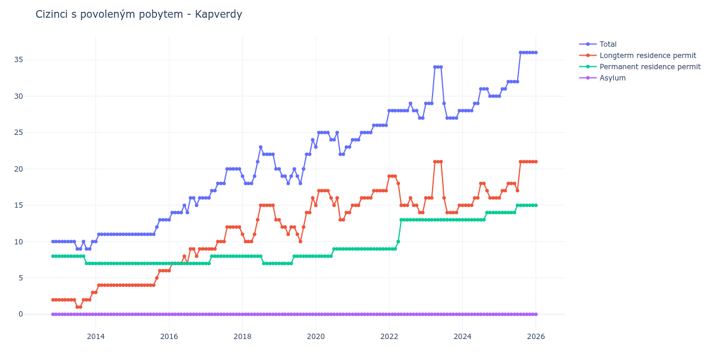

# Kapverdy

## Souhrnné statistiky (Min/Max pro rok) / Summary Statistics (Min/Max per year)

| Year   | Total   | Longterm Residence Permit   | Permanent Residence Permit   | Asylum   |
|--------|---------|-----------------------------|------------------------------|----------|
| 2012   | 10 / 10 | 2 / 2                       | 8 / 8                        | 0 / 0    |
| 2013   | 9 / 10  | 1 / 3                       | 7 / 8                        | 0 / 0    |
| 2014   | 10 / 11 | 3 / 4                       | 7 / 7                        | 0 / 0    |
| 2015   | 11 / 13 | 4 / 6                       | 7 / 7                        | 0 / 0    |
| 2016   | 13 / 16 | 6 / 9                       | 7 / 7                        | 0 / 0    |
| 2017   | 16 / 20 | 9 / 12                      | 7 / 8                        | 0 / 0    |
| 2018   | 18 / 23 | 10 / 15                     | 7 / 8                        | 0 / 0    |
| 2019   | 18 / 24 | 10 / 16                     | 7 / 8                        | 0 / 0    |
| 2020   | 22 / 25 | 13 / 17                     | 8 / 9                        | 0 / 0    |
| 2021   | 24 / 26 | 15 / 17                     | 9 / 9                        | 0 / 0    |
| 2022   | 27 / 29 | 14 / 19                     | 9 / 13                       | 0 / 0    |
| 2023   | 27 / 34 | 14 / 21                     | 13 / 13                      | 0 / 0    |
| 2024   | 28 / 31 | 15 / 18                     | 13 / 14                      | 0 / 0    |
| 2025   | 30 / 36 | 16 / 21                     | 14 / 15                      | 0 / 0    |
| 2026   | 36 / 36 | 21 / 21                     | 15 / 15                      | 0 / 0    |

## Detailní tabulka / Detailed Data Table

| Date     | Total        | Longterm Residence Permit   | Permanent Residence Permit   | Asylum   |
|----------|--------------|-----------------------------|------------------------------|----------|
| **2012** |              |                             |                              |          |
| 11.2012  | 10           | 2                           | 8                            | 0        |
| 12.2012  | 10 (+0.00%)  | 2 (+0.00%)                  | 8 (+0.00%)                   | 0        |
| **2013** |              |                             |                              |          |
| 01.2013  | 10 (+0.00%)  | 2 (+0.00%)                  | 8 (+0.00%)                   | 0        |
| 02.2013  | 10 (+0.00%)  | 2 (+0.00%)                  | 8 (+0.00%)                   | 0        |
| 03.2013  | 10 (+0.00%)  | 2 (+0.00%)                  | 8 (+0.00%)                   | 0        |
| 04.2013  | 10 (+0.00%)  | 2 (+0.00%)                  | 8 (+0.00%)                   | 0        |
| 05.2013  | 10 (+0.00%)  | 2 (+0.00%)                  | 8 (+0.00%)                   | 0        |
| 06.2013  | 10 (+0.00%)  | 2 (+0.00%)                  | 8 (+0.00%)                   | 0        |
| 07.2013  | 9 (-10.00%)  | 1 (-50.00%)                 | 8 (+0.00%)                   | 0        |
| 08.2013  | 9 (+0.00%)   | 1 (+0.00%)                  | 8 (+0.00%)                   | 0        |
| 09.2013  | 10 (+11.11%) | 2 (+100.00%)                | 8 (+0.00%)                   | 0        |
| 10.2013  | 9 (-10.00%)  | 2 (+0.00%)                  | 7 (-12.50%)                  | 0        |
| 11.2013  | 9 (+0.00%)   | 2 (+0.00%)                  | 7 (+0.00%)                   | 0        |
| 12.2013  | 10 (+11.11%) | 3 (+50.00%)                 | 7 (+0.00%)                   | 0        |
| **2014** |              |                             |                              |          |
| 01.2014  | 10 (+0.00%)  | 3 (+0.00%)                  | 7 (+0.00%)                   | 0        |
| 02.2014  | 11 (+10.00%) | 4 (+33.33%)                 | 7 (+0.00%)                   | 0        |
| 03.2014  | 11 (+0.00%)  | 4 (+0.00%)                  | 7 (+0.00%)                   | 0        |
| 04.2014  | 11 (+0.00%)  | 4 (+0.00%)                  | 7 (+0.00%)                   | 0        |
| 05.2014  | 11 (+0.00%)  | 4 (+0.00%)                  | 7 (+0.00%)                   | 0        |
| 06.2014  | 11 (+0.00%)  | 4 (+0.00%)                  | 7 (+0.00%)                   | 0        |
| 07.2014  | 11 (+0.00%)  | 4 (+0.00%)                  | 7 (+0.00%)                   | 0        |
| 08.2014  | 11 (+0.00%)  | 4 (+0.00%)                  | 7 (+0.00%)                   | 0        |
| 09.2014  | 11 (+0.00%)  | 4 (+0.00%)                  | 7 (+0.00%)                   | 0        |
| 10.2014  | 11 (+0.00%)  | 4 (+0.00%)                  | 7 (+0.00%)                   | 0        |
| 11.2014  | 11 (+0.00%)  | 4 (+0.00%)                  | 7 (+0.00%)                   | 0        |
| 12.2014  | 11 (+0.00%)  | 4 (+0.00%)                  | 7 (+0.00%)                   | 0        |
| **2015** |              |                             |                              |          |
| 01.2015  | 11 (+0.00%)  | 4 (+0.00%)                  | 7 (+0.00%)                   | 0        |
| 02.2015  | 11 (+0.00%)  | 4 (+0.00%)                  | 7 (+0.00%)                   | 0        |
| 03.2015  | 11 (+0.00%)  | 4 (+0.00%)                  | 7 (+0.00%)                   | 0        |
| 04.2015  | 11 (+0.00%)  | 4 (+0.00%)                  | 7 (+0.00%)                   | 0        |
| 05.2015  | 11 (+0.00%)  | 4 (+0.00%)                  | 7 (+0.00%)                   | 0        |
| 06.2015  | 11 (+0.00%)  | 4 (+0.00%)                  | 7 (+0.00%)                   | 0        |
| 07.2015  | 11 (+0.00%)  | 4 (+0.00%)                  | 7 (+0.00%)                   | 0        |
| 08.2015  | 11 (+0.00%)  | 4 (+0.00%)                  | 7 (+0.00%)                   | 0        |
| 09.2015  | 12 (+9.09%)  | 5 (+25.00%)                 | 7 (+0.00%)                   | 0        |
| 10.2015  | 13 (+8.33%)  | 6 (+20.00%)                 | 7 (+0.00%)                   | 0        |
| 11.2015  | 13 (+0.00%)  | 6 (+0.00%)                  | 7 (+0.00%)                   | 0        |
| 12.2015  | 13 (+0.00%)  | 6 (+0.00%)                  | 7 (+0.00%)                   | 0        |
| **2016** |              |                             |                              |          |
| 01.2016  | 13 (+0.00%)  | 6 (+0.00%)                  | 7 (+0.00%)                   | 0        |
| 02.2016  | 14 (+7.69%)  | 7 (+16.67%)                 | 7 (+0.00%)                   | 0        |
| 03.2016  | 14 (+0.00%)  | 7 (+0.00%)                  | 7 (+0.00%)                   | 0        |
| 04.2016  | 14 (+0.00%)  | 7 (+0.00%)                  | 7 (+0.00%)                   | 0        |
| 05.2016  | 14 (+0.00%)  | 7 (+0.00%)                  | 7 (+0.00%)                   | 0        |
| 06.2016  | 15 (+7.14%)  | 8 (+14.29%)                 | 7 (+0.00%)                   | 0        |
| 07.2016  | 14 (-6.67%)  | 7 (-12.50%)                 | 7 (+0.00%)                   | 0        |
| 08.2016  | 16 (+14.29%) | 9 (+28.57%)                 | 7 (+0.00%)                   | 0        |
| 09.2016  | 16 (+0.00%)  | 9 (+0.00%)                  | 7 (+0.00%)                   | 0        |
| 10.2016  | 15 (-6.25%)  | 8 (-11.11%)                 | 7 (+0.00%)                   | 0        |
| 11.2016  | 16 (+6.67%)  | 9 (+12.50%)                 | 7 (+0.00%)                   | 0        |
| 12.2016  | 16 (+0.00%)  | 9 (+0.00%)                  | 7 (+0.00%)                   | 0        |
| **2017** |              |                             |                              |          |
| 01.2017  | 16 (+0.00%)  | 9 (+0.00%)                  | 7 (+0.00%)                   | 0        |
| 02.2017  | 16 (+0.00%)  | 9 (+0.00%)                  | 7 (+0.00%)                   | 0        |
| 03.2017  | 17 (+6.25%)  | 9 (+0.00%)                  | 8 (+14.29%)                  | 0        |
| 04.2017  | 17 (+0.00%)  | 9 (+0.00%)                  | 8 (+0.00%)                   | 0        |
| 05.2017  | 18 (+5.88%)  | 10 (+11.11%)                | 8 (+0.00%)                   | 0        |
| 06.2017  | 18 (+0.00%)  | 10 (+0.00%)                 | 8 (+0.00%)                   | 0        |
| 07.2017  | 18 (+0.00%)  | 10 (+0.00%)                 | 8 (+0.00%)                   | 0        |
| 08.2017  | 20 (+11.11%) | 12 (+20.00%)                | 8 (+0.00%)                   | 0        |
| 09.2017  | 20 (+0.00%)  | 12 (+0.00%)                 | 8 (+0.00%)                   | 0        |
| 10.2017  | 20 (+0.00%)  | 12 (+0.00%)                 | 8 (+0.00%)                   | 0        |
| 11.2017  | 20 (+0.00%)  | 12 (+0.00%)                 | 8 (+0.00%)                   | 0        |
| 12.2017  | 20 (+0.00%)  | 12 (+0.00%)                 | 8 (+0.00%)                   | 0        |
| **2018** |              |                             |                              |          |
| 01.2018  | 19 (-5.00%)  | 11 (-8.33%)                 | 8 (+0.00%)                   | 0        |
| 02.2018  | 18 (-5.26%)  | 10 (-9.09%)                 | 8 (+0.00%)                   | 0        |
| 03.2018  | 18 (+0.00%)  | 10 (+0.00%)                 | 8 (+0.00%)                   | 0        |
| 04.2018  | 18 (+0.00%)  | 10 (+0.00%)                 | 8 (+0.00%)                   | 0        |
| 05.2018  | 19 (+5.56%)  | 11 (+10.00%)                | 8 (+0.00%)                   | 0        |
| 06.2018  | 21 (+10.53%) | 13 (+18.18%)                | 8 (+0.00%)                   | 0        |
| 07.2018  | 23 (+9.52%)  | 15 (+15.38%)                | 8 (+0.00%)                   | 0        |
| 08.2018  | 22 (-4.35%)  | 15 (+0.00%)                 | 7 (-12.50%)                  | 0        |
| 09.2018  | 22 (+0.00%)  | 15 (+0.00%)                 | 7 (+0.00%)                   | 0        |
| 10.2018  | 22 (+0.00%)  | 15 (+0.00%)                 | 7 (+0.00%)                   | 0        |
| 11.2018  | 22 (+0.00%)  | 15 (+0.00%)                 | 7 (+0.00%)                   | 0        |
| 12.2018  | 20 (-9.09%)  | 13 (-13.33%)                | 7 (+0.00%)                   | 0        |
| **2019** |              |                             |                              |          |
| 01.2019  | 20 (+0.00%)  | 13 (+0.00%)                 | 7 (+0.00%)                   | 0        |
| 02.2019  | 19 (-5.00%)  | 12 (-7.69%)                 | 7 (+0.00%)                   | 0        |
| 03.2019  | 19 (+0.00%)  | 12 (+0.00%)                 | 7 (+0.00%)                   | 0        |
| 04.2019  | 18 (-5.26%)  | 11 (-8.33%)                 | 7 (+0.00%)                   | 0        |
| 05.2019  | 19 (+5.56%)  | 12 (+9.09%)                 | 7 (+0.00%)                   | 0        |
| 06.2019  | 20 (+5.26%)  | 12 (+0.00%)                 | 8 (+14.29%)                  | 0        |
| 07.2019  | 19 (-5.00%)  | 11 (-8.33%)                 | 8 (+0.00%)                   | 0        |
| 08.2019  | 18 (-5.26%)  | 10 (-9.09%)                 | 8 (+0.00%)                   | 0        |
| 09.2019  | 20 (+11.11%) | 12 (+20.00%)                | 8 (+0.00%)                   | 0        |
| 10.2019  | 22 (+10.00%) | 14 (+16.67%)                | 8 (+0.00%)                   | 0        |
| 11.2019  | 22 (+0.00%)  | 14 (+0.00%)                 | 8 (+0.00%)                   | 0        |
| 12.2019  | 24 (+9.09%)  | 16 (+14.29%)                | 8 (+0.00%)                   | 0        |
| **2020** |              |                             |                              |          |
| 01.2020  | 23 (-4.17%)  | 15 (-6.25%)                 | 8 (+0.00%)                   | 0        |
| 02.2020  | 25 (+8.70%)  | 17 (+13.33%)                | 8 (+0.00%)                   | 0        |
| 03.2020  | 25 (+0.00%)  | 17 (+0.00%)                 | 8 (+0.00%)                   | 0        |
| 04.2020  | 25 (+0.00%)  | 17 (+0.00%)                 | 8 (+0.00%)                   | 0        |
| 05.2020  | 25 (+0.00%)  | 17 (+0.00%)                 | 8 (+0.00%)                   | 0        |
| 06.2020  | 24 (-4.00%)  | 16 (-5.88%)                 | 8 (+0.00%)                   | 0        |
| 07.2020  | 24 (+0.00%)  | 15 (-6.25%)                 | 9 (+12.50%)                  | 0        |
| 08.2020  | 25 (+4.17%)  | 16 (+6.67%)                 | 9 (+0.00%)                   | 0        |
| 09.2020  | 22 (-12.00%) | 13 (-18.75%)                | 9 (+0.00%)                   | 0        |
| 10.2020  | 22 (+0.00%)  | 13 (+0.00%)                 | 9 (+0.00%)                   | 0        |
| 11.2020  | 23 (+4.55%)  | 14 (+7.69%)                 | 9 (+0.00%)                   | 0        |
| 12.2020  | 23 (+0.00%)  | 14 (+0.00%)                 | 9 (+0.00%)                   | 0        |
| **2021** |              |                             |                              |          |
| 01.2021  | 24 (+4.35%)  | 15 (+7.14%)                 | 9 (+0.00%)                   | 0        |
| 02.2021  | 24 (+0.00%)  | 15 (+0.00%)                 | 9 (+0.00%)                   | 0        |
| 03.2021  | 24 (+0.00%)  | 15 (+0.00%)                 | 9 (+0.00%)                   | 0        |
| 04.2021  | 25 (+4.17%)  | 16 (+6.67%)                 | 9 (+0.00%)                   | 0        |
| 05.2021  | 25 (+0.00%)  | 16 (+0.00%)                 | 9 (+0.00%)                   | 0        |
| 06.2021  | 25 (+0.00%)  | 16 (+0.00%)                 | 9 (+0.00%)                   | 0        |
| 07.2021  | 25 (+0.00%)  | 16 (+0.00%)                 | 9 (+0.00%)                   | 0        |
| 08.2021  | 26 (+4.00%)  | 17 (+6.25%)                 | 9 (+0.00%)                   | 0        |
| 09.2021  | 26 (+0.00%)  | 17 (+0.00%)                 | 9 (+0.00%)                   | 0        |
| 10.2021  | 26 (+0.00%)  | 17 (+0.00%)                 | 9 (+0.00%)                   | 0        |
| 11.2021  | 26 (+0.00%)  | 17 (+0.00%)                 | 9 (+0.00%)                   | 0        |
| 12.2021  | 26 (+0.00%)  | 17 (+0.00%)                 | 9 (+0.00%)                   | 0        |
| **2022** |              |                             |                              |          |
| 01.2022  | 28 (+7.69%)  | 19 (+11.76%)                | 9 (+0.00%)                   | 0        |
| 02.2022  | 28 (+0.00%)  | 19 (+0.00%)                 | 9 (+0.00%)                   | 0        |
| 03.2022  | 28 (+0.00%)  | 19 (+0.00%)                 | 9 (+0.00%)                   | 0        |
| 04.2022  | 28 (+0.00%)  | 18 (-5.26%)                 | 10 (+11.11%)                 | 0        |
| 05.2022  | 28 (+0.00%)  | 15 (-16.67%)                | 13 (+30.00%)                 | 0        |
| 06.2022  | 28 (+0.00%)  | 15 (+0.00%)                 | 13 (+0.00%)                  | 0        |
| 07.2022  | 28 (+0.00%)  | 15 (+0.00%)                 | 13 (+0.00%)                  | 0        |
| 08.2022  | 29 (+3.57%)  | 16 (+6.67%)                 | 13 (+0.00%)                  | 0        |
| 09.2022  | 28 (-3.45%)  | 15 (-6.25%)                 | 13 (+0.00%)                  | 0        |
| 10.2022  | 28 (+0.00%)  | 15 (+0.00%)                 | 13 (+0.00%)                  | 0        |
| 11.2022  | 27 (-3.57%)  | 14 (-6.67%)                 | 13 (+0.00%)                  | 0        |
| 12.2022  | 27 (+0.00%)  | 14 (+0.00%)                 | 13 (+0.00%)                  | 0        |
| **2023** |              |                             |                              |          |
| 01.2023  | 29 (+7.41%)  | 16 (+14.29%)                | 13 (+0.00%)                  | 0        |
| 02.2023  | 29 (+0.00%)  | 16 (+0.00%)                 | 13 (+0.00%)                  | 0        |
| 03.2023  | 29 (+0.00%)  | 16 (+0.00%)                 | 13 (+0.00%)                  | 0        |
| 04.2023  | 34 (+17.24%) | 21 (+31.25%)                | 13 (+0.00%)                  | 0        |
| 05.2023  | 34 (+0.00%)  | 21 (+0.00%)                 | 13 (+0.00%)                  | 0        |
| 06.2023  | 34 (+0.00%)  | 21 (+0.00%)                 | 13 (+0.00%)                  | 0        |
| 07.2023  | 29 (-14.71%) | 16 (-23.81%)                | 13 (+0.00%)                  | 0        |
| 08.2023  | 27 (-6.90%)  | 14 (-12.50%)                | 13 (+0.00%)                  | 0        |
| 09.2023  | 27 (+0.00%)  | 14 (+0.00%)                 | 13 (+0.00%)                  | 0        |
| 10.2023  | 27 (+0.00%)  | 14 (+0.00%)                 | 13 (+0.00%)                  | 0        |
| 11.2023  | 27 (+0.00%)  | 14 (+0.00%)                 | 13 (+0.00%)                  | 0        |
| 12.2023  | 28 (+3.70%)  | 15 (+7.14%)                 | 13 (+0.00%)                  | 0        |
| **2024** |              |                             |                              |          |
| 01.2024  | 28 (+0.00%)  | 15 (+0.00%)                 | 13 (+0.00%)                  | 0        |
| 02.2024  | 28 (+0.00%)  | 15 (+0.00%)                 | 13 (+0.00%)                  | 0        |
| 03.2024  | 28 (+0.00%)  | 15 (+0.00%)                 | 13 (+0.00%)                  | 0        |
| 04.2024  | 28 (+0.00%)  | 15 (+0.00%)                 | 13 (+0.00%)                  | 0        |
| 05.2024  | 29 (+3.57%)  | 16 (+6.67%)                 | 13 (+0.00%)                  | 0        |
| 06.2024  | 29 (+0.00%)  | 16 (+0.00%)                 | 13 (+0.00%)                  | 0        |
| 07.2024  | 31 (+6.90%)  | 18 (+12.50%)                | 13 (+0.00%)                  | 0        |
| 08.2024  | 31 (+0.00%)  | 18 (+0.00%)                 | 13 (+0.00%)                  | 0        |
| 09.2024  | 31 (+0.00%)  | 17 (-5.56%)                 | 14 (+7.69%)                  | 0        |
| 10.2024  | 30 (-3.23%)  | 16 (-5.88%)                 | 14 (+0.00%)                  | 0        |
| 11.2024  | 30 (+0.00%)  | 16 (+0.00%)                 | 14 (+0.00%)                  | 0        |
| 12.2024  | 30 (+0.00%)  | 16 (+0.00%)                 | 14 (+0.00%)                  | 0        |
| **2025** |              |                             |                              |          |
| 01.2025  | 30 (+0.00%)  | 16 (+0.00%)                 | 14 (+0.00%)                  | 0        |
| 02.2025  | 31 (+3.33%)  | 17 (+6.25%)                 | 14 (+0.00%)                  | 0        |
| 03.2025  | 31 (+0.00%)  | 17 (+0.00%)                 | 14 (+0.00%)                  | 0        |
| 04.2025  | 32 (+3.23%)  | 18 (+5.88%)                 | 14 (+0.00%)                  | 0        |
| 05.2025  | 32 (+0.00%)  | 18 (+0.00%)                 | 14 (+0.00%)                  | 0        |
| 06.2025  | 32 (+0.00%)  | 18 (+0.00%)                 | 14 (+0.00%)                  | 0        |
| 07.2025  | 32 (+0.00%)  | 17 (-5.56%)                 | 15 (+7.14%)                  | 0        |
| 08.2025  | 36 (+12.50%) | 21 (+23.53%)                | 15 (+0.00%)                  | 0        |
| 09.2025  | 36 (+0.00%)  | 21 (+0.00%)                 | 15 (+0.00%)                  | 0        |
| 10.2025  | 36 (+0.00%)  | 21 (+0.00%)                 | 15 (+0.00%)                  | 0        |
| 11.2025  | 36 (+0.00%)  | 21 (+0.00%)                 | 15 (+0.00%)                  | 0        |
| 12.2025  | 36 (+0.00%)  | 21 (+0.00%)                 | 15 (+0.00%)                  | 0        |
| **2026** |              |                             |                              |          |
| 01.2026  | 36 (+0.00%)  | 21 (+0.00%)                 | 15 (+0.00%)                  | 0        |
