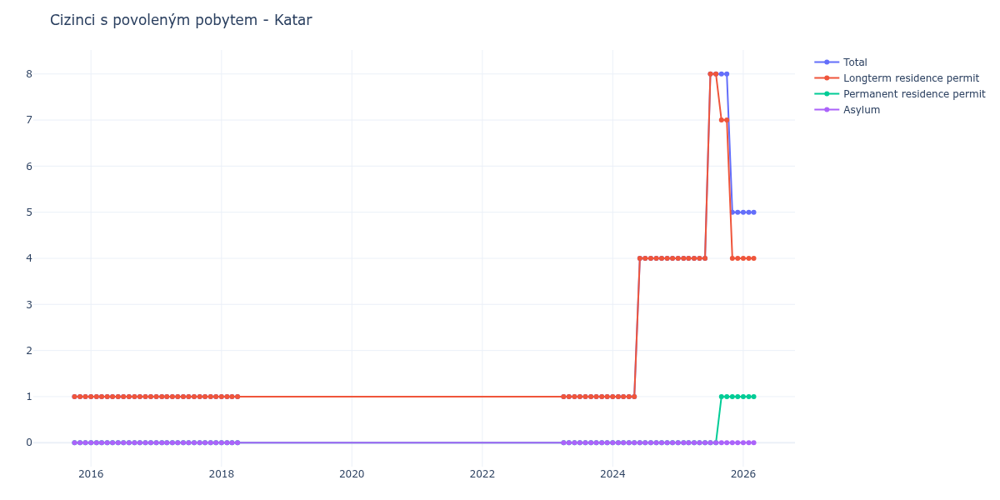

# Katar

## Souhrnné statistiky (Min/Max pro rok) / Summary Statistics (Min/Max per year)

| Year   | Total   | Longterm Residence Permit   | Permanent Residence Permit   | Asylum   |
|--------|---------|-----------------------------|------------------------------|----------|
| 2015   | 1 / 1   | 1 / 1                       | 0 / 0                        | 0 / 0    |
| 2016   | 1 / 1   | 1 / 1                       | 0 / 0                        | 0 / 0    |
| 2017   | 1 / 1   | 1 / 1                       | 0 / 0                        | 0 / 0    |
| 2018   | 1 / 1   | 1 / 1                       | 0 / 0                        | 0 / 0    |
| 2023   | 1 / 1   | 1 / 1                       | 0 / 0                        | 0 / 0    |
| 2024   | 1 / 4   | 1 / 4                       | 0 / 0                        | 0 / 0    |
| 2025   | 4 / 8   | 4 / 8                       | 0 / 1                        | 0 / 0    |
| 2026   | 5 / 5   | 4 / 4                       | 1 / 1                        | 0 / 0    |

## Detailní tabulka / Detailed Data Table

| Date     | Total        | Longterm Residence Permit   | Permanent Residence Permit   | Asylum   |
|----------|--------------|-----------------------------|------------------------------|----------|
| **2015** |              |                             |                              |          |
| 10.2015  | 1            | 1                           | 0                            | 0        |
| 11.2015  | 1 (+0.00%)   | 1 (+0.00%)                  | 0                            | 0        |
| 12.2015  | 1 (+0.00%)   | 1 (+0.00%)                  | 0                            | 0        |
| **2016** |              |                             |                              |          |
| 01.2016  | 1 (+0.00%)   | 1 (+0.00%)                  | 0                            | 0        |
| 02.2016  | 1 (+0.00%)   | 1 (+0.00%)                  | 0                            | 0        |
| 03.2016  | 1 (+0.00%)   | 1 (+0.00%)                  | 0                            | 0        |
| 04.2016  | 1 (+0.00%)   | 1 (+0.00%)                  | 0                            | 0        |
| 05.2016  | 1 (+0.00%)   | 1 (+0.00%)                  | 0                            | 0        |
| 06.2016  | 1 (+0.00%)   | 1 (+0.00%)                  | 0                            | 0        |
| 07.2016  | 1 (+0.00%)   | 1 (+0.00%)                  | 0                            | 0        |
| 08.2016  | 1 (+0.00%)   | 1 (+0.00%)                  | 0                            | 0        |
| 09.2016  | 1 (+0.00%)   | 1 (+0.00%)                  | 0                            | 0        |
| 10.2016  | 1 (+0.00%)   | 1 (+0.00%)                  | 0                            | 0        |
| 11.2016  | 1 (+0.00%)   | 1 (+0.00%)                  | 0                            | 0        |
| 12.2016  | 1 (+0.00%)   | 1 (+0.00%)                  | 0                            | 0        |
| **2017** |              |                             |                              |          |
| 01.2017  | 1 (+0.00%)   | 1 (+0.00%)                  | 0                            | 0        |
| 02.2017  | 1 (+0.00%)   | 1 (+0.00%)                  | 0                            | 0        |
| 03.2017  | 1 (+0.00%)   | 1 (+0.00%)                  | 0                            | 0        |
| 04.2017  | 1 (+0.00%)   | 1 (+0.00%)                  | 0                            | 0        |
| 05.2017  | 1 (+0.00%)   | 1 (+0.00%)                  | 0                            | 0        |
| 06.2017  | 1 (+0.00%)   | 1 (+0.00%)                  | 0                            | 0        |
| 07.2017  | 1 (+0.00%)   | 1 (+0.00%)                  | 0                            | 0        |
| 08.2017  | 1 (+0.00%)   | 1 (+0.00%)                  | 0                            | 0        |
| 09.2017  | 1 (+0.00%)   | 1 (+0.00%)                  | 0                            | 0        |
| 10.2017  | 1 (+0.00%)   | 1 (+0.00%)                  | 0                            | 0        |
| 11.2017  | 1 (+0.00%)   | 1 (+0.00%)                  | 0                            | 0        |
| 12.2017  | 1 (+0.00%)   | 1 (+0.00%)                  | 0                            | 0        |
| **2018** |              |                             |                              |          |
| 01.2018  | 1 (+0.00%)   | 1 (+0.00%)                  | 0                            | 0        |
| 02.2018  | 1 (+0.00%)   | 1 (+0.00%)                  | 0                            | 0        |
| 03.2018  | 1 (+0.00%)   | 1 (+0.00%)                  | 0                            | 0        |
| 04.2018  | 1 (+0.00%)   | 1 (+0.00%)                  | 0                            | 0        |
| **2023** |              |                             |                              |          |
| 04.2023  | 1 (+0.00%)   | 1 (+0.00%)                  | 0                            | 0        |
| 05.2023  | 1 (+0.00%)   | 1 (+0.00%)                  | 0                            | 0        |
| 06.2023  | 1 (+0.00%)   | 1 (+0.00%)                  | 0                            | 0        |
| 07.2023  | 1 (+0.00%)   | 1 (+0.00%)                  | 0                            | 0        |
| 08.2023  | 1 (+0.00%)   | 1 (+0.00%)                  | 0                            | 0        |
| 09.2023  | 1 (+0.00%)   | 1 (+0.00%)                  | 0                            | 0        |
| 10.2023  | 1 (+0.00%)   | 1 (+0.00%)                  | 0                            | 0        |
| 11.2023  | 1 (+0.00%)   | 1 (+0.00%)                  | 0                            | 0        |
| 12.2023  | 1 (+0.00%)   | 1 (+0.00%)                  | 0                            | 0        |
| **2024** |              |                             |                              |          |
| 01.2024  | 1 (+0.00%)   | 1 (+0.00%)                  | 0                            | 0        |
| 02.2024  | 1 (+0.00%)   | 1 (+0.00%)                  | 0                            | 0        |
| 03.2024  | 1 (+0.00%)   | 1 (+0.00%)                  | 0                            | 0        |
| 04.2024  | 1 (+0.00%)   | 1 (+0.00%)                  | 0                            | 0        |
| 05.2024  | 1 (+0.00%)   | 1 (+0.00%)                  | 0                            | 0        |
| 06.2024  | 4 (+300.00%) | 4 (+300.00%)                | 0                            | 0        |
| 07.2024  | 4 (+0.00%)   | 4 (+0.00%)                  | 0                            | 0        |
| 08.2024  | 4 (+0.00%)   | 4 (+0.00%)                  | 0                            | 0        |
| 09.2024  | 4 (+0.00%)   | 4 (+0.00%)                  | 0                            | 0        |
| 10.2024  | 4 (+0.00%)   | 4 (+0.00%)                  | 0                            | 0        |
| 11.2024  | 4 (+0.00%)   | 4 (+0.00%)                  | 0                            | 0        |
| 12.2024  | 4 (+0.00%)   | 4 (+0.00%)                  | 0                            | 0        |
| **2025** |              |                             |                              |          |
| 01.2025  | 4 (+0.00%)   | 4 (+0.00%)                  | 0                            | 0        |
| 02.2025  | 4 (+0.00%)   | 4 (+0.00%)                  | 0                            | 0        |
| 03.2025  | 4 (+0.00%)   | 4 (+0.00%)                  | 0                            | 0        |
| 04.2025  | 4 (+0.00%)   | 4 (+0.00%)                  | 0                            | 0        |
| 05.2025  | 4 (+0.00%)   | 4 (+0.00%)                  | 0                            | 0        |
| 06.2025  | 4 (+0.00%)   | 4 (+0.00%)                  | 0                            | 0        |
| 07.2025  | 8 (+100.00%) | 8 (+100.00%)                | 0                            | 0        |
| 08.2025  | 8 (+0.00%)   | 8 (+0.00%)                  | 0                            | 0        |
| 09.2025  | 8 (+0.00%)   | 7 (-12.50%)                 | 1                            | 0        |
| 10.2025  | 8 (+0.00%)   | 7 (+0.00%)                  | 1 (+0.00%)                   | 0        |
| 11.2025  | 5 (-37.50%)  | 4 (-42.86%)                 | 1 (+0.00%)                   | 0        |
| 12.2025  | 5 (+0.00%)   | 4 (+0.00%)                  | 1 (+0.00%)                   | 0        |
| **2026** |              |                             |                              |          |
| 01.2026  | 5 (+0.00%)   | 4 (+0.00%)                  | 1 (+0.00%)                   | 0        |
| 02.2026  | 5 (+0.00%)   | 4 (+0.00%)                  | 1 (+0.00%)                   | 0        |
| 03.2026  | 5 (+0.00%)   | 4 (+0.00%)                  | 1 (+0.00%)                   | 0        |
