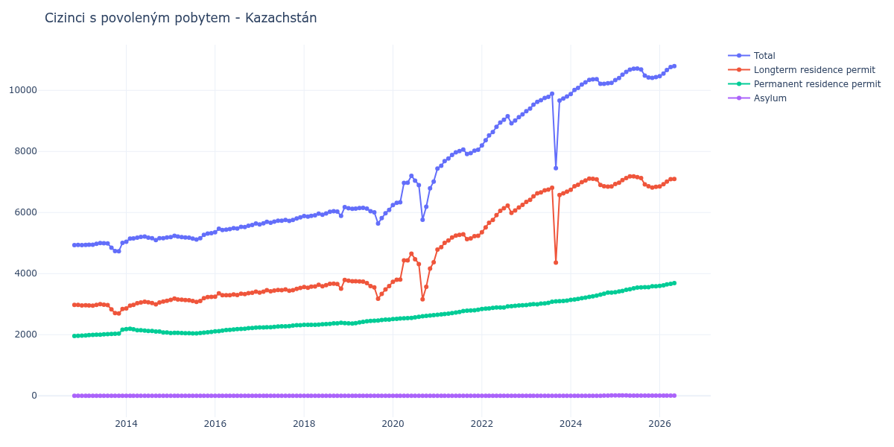

# Kazachstán

## Souhrnné statistiky (Min/Max pro rok) / Summary Statistics (Min/Max per year)

| Year   | Total           | Longterm Residence Permit   | Permanent Residence Permit   | Asylum   |
|--------|-----------------|-----------------------------|------------------------------|----------|
| 2012   | 4 934 / 4 941   | 2 977 / 2 978               | 1 956 / 1 964                | 0 / 0    |
| 2013   | 4 732 / 5 007   | 2 695 / 3 001               | 1 972 / 2 166                | 0 / 0    |
| 2014   | 5 043 / 5 214   | 2 859 / 3 109               | 2 072 / 2 195                | 0 / 0    |
| 2015   | 5 116 / 5 324   | 3 074 / 3 235               | 2 042 / 2 089                | 0 / 0    |
| 2016   | 5 353 / 5 639   | 3 245 / 3 410               | 2 108 / 2 229                | 0 / 0    |
| 2017   | 5 611 / 5 841   | 3 376 / 3 532               | 2 235 / 2 309                | 0 / 0    |
| 2018   | 5 863 / 6 174   | 3 504 / 3 793               | 2 321 / 2 388                | 0 / 0    |
| 2019   | 5 643 / 6 155   | 3 178 / 3 767               | 2 368 / 2 496                | 0 / 0    |
| 2020   | 5 761 / 7 200   | 3 160 / 4 651               | 2 513 / 2 641                | 0 / 0    |
| 2021   | 7 441 / 8 062   | 4 787 / 5 286               | 2 654 / 2 818                | 0 / 0    |
| 2022   | 8 194 / 9 214   | 5 352 / 6 249               | 2 842 / 2 965                | 0 / 0    |
| 2023   | 7 450 / 9 891   | 4 360 / 6 812               | 2 970 / 3 115                | 0 / 0    |
| 2024   | 9 880 / 10 366  | 6 742 / 7 107               | 3 138 / 3 377                | 0 / 10   |
| 2025   | 10 335 / 10 711 | 6 816 / 7 183               | 3 391 / 3 587                | 6 / 10   |
| 2026   | 10 461 / 10 793 | 6 855 / 7 095               | 3 600 / 3 692                | 6 / 6    |

## Detailní tabulka / Detailed Data Table

| Date     | Total           | Longterm Residence Permit   | Permanent Residence Permit   | Asylum       |
|----------|-----------------|-----------------------------|------------------------------|--------------|
| **2012** |                 |                             |                              |              |
| 11.2012  | 4 934           | 2 978                       | 1 956                        | 0            |
| 12.2012  | 4 941 (+0.14%)  | 2 977 (-0.03%)              | 1 964 (+0.41%)               | 0            |
| **2013** |                 |                             |                              |              |
| 01.2013  | 4 931 (-0.20%)  | 2 959 (-0.60%)              | 1 972 (+0.41%)               | 0            |
| 02.2013  | 4 938 (+0.14%)  | 2 962 (+0.10%)              | 1 976 (+0.20%)               | 0            |
| 03.2013  | 4 946 (+0.16%)  | 2 956 (-0.20%)              | 1 990 (+0.71%)               | 0            |
| 04.2013  | 4 946 (+0.00%)  | 2 953 (-0.10%)              | 1 993 (+0.15%)               | 0            |
| 05.2013  | 4 975 (+0.59%)  | 2 977 (+0.81%)              | 1 998 (+0.25%)               | 0            |
| 06.2013  | 5 000 (+0.50%)  | 3 001 (+0.81%)              | 1 999 (+0.05%)               | 0            |
| 07.2013  | 4 992 (-0.16%)  | 2 982 (-0.63%)              | 2 010 (+0.55%)               | 0            |
| 08.2013  | 4 985 (-0.14%)  | 2 968 (-0.47%)              | 2 017 (+0.35%)               | 0            |
| 09.2013  | 4 850 (-2.71%)  | 2 827 (-4.75%)              | 2 023 (+0.30%)               | 0            |
| 10.2013  | 4 737 (-2.33%)  | 2 705 (-4.32%)              | 2 032 (+0.44%)               | 0            |
| 11.2013  | 4 732 (-0.11%)  | 2 695 (-0.37%)              | 2 037 (+0.25%)               | 0            |
| 12.2013  | 5 007 (+5.81%)  | 2 841 (+5.42%)              | 2 166 (+6.33%)               | 0            |
| **2014** |                 |                             |                              |              |
| 01.2014  | 5 043 (+0.72%)  | 2 859 (+0.63%)              | 2 184 (+0.83%)               | 0            |
| 02.2014  | 5 149 (+2.10%)  | 2 954 (+3.32%)              | 2 195 (+0.50%)               | 0            |
| 03.2014  | 5 152 (+0.06%)  | 2 978 (+0.81%)              | 2 174 (-0.96%)               | 0            |
| 04.2014  | 5 174 (+0.43%)  | 3 029 (+1.71%)              | 2 145 (-1.33%)               | 0            |
| 05.2014  | 5 203 (+0.56%)  | 3 056 (+0.89%)              | 2 147 (+0.09%)               | 0            |
| 06.2014  | 5 214 (+0.21%)  | 3 080 (+0.79%)              | 2 134 (-0.61%)               | 0            |
| 07.2014  | 5 179 (-0.67%)  | 3 059 (-0.68%)              | 2 120 (-0.66%)               | 0            |
| 08.2014  | 5 156 (-0.44%)  | 3 035 (-0.78%)              | 2 121 (+0.05%)               | 0            |
| 09.2014  | 5 098 (-1.12%)  | 2 997 (-1.25%)              | 2 101 (-0.94%)               | 0            |
| 10.2014  | 5 160 (+1.22%)  | 3 055 (+1.94%)              | 2 105 (+0.19%)               | 0            |
| 11.2014  | 5 161 (+0.02%)  | 3 088 (+1.08%)              | 2 073 (-1.52%)               | 0            |
| 12.2014  | 5 181 (+0.39%)  | 3 109 (+0.68%)              | 2 072 (-0.05%)               | 0            |
| **2015** |                 |                             |                              |              |
| 01.2015  | 5 196 (+0.29%)  | 3 142 (+1.06%)              | 2 054 (-0.87%)               | 0            |
| 02.2015  | 5 238 (+0.81%)  | 3 180 (+1.21%)              | 2 058 (+0.19%)               | 0            |
| 03.2015  | 5 214 (-0.46%)  | 3 155 (-0.79%)              | 2 059 (+0.05%)               | 0            |
| 04.2015  | 5 197 (-0.33%)  | 3 144 (-0.35%)              | 2 053 (-0.29%)               | 0            |
| 05.2015  | 5 185 (-0.23%)  | 3 136 (-0.25%)              | 2 049 (-0.19%)               | 0            |
| 06.2015  | 5 177 (-0.15%)  | 3 131 (-0.16%)              | 2 046 (-0.15%)               | 0            |
| 07.2015  | 5 146 (-0.60%)  | 3 103 (-0.89%)              | 2 043 (-0.15%)               | 0            |
| 08.2015  | 5 116 (-0.58%)  | 3 074 (-0.93%)              | 2 042 (-0.05%)               | 0            |
| 09.2015  | 5 161 (+0.88%)  | 3 105 (+1.01%)              | 2 056 (+0.69%)               | 0            |
| 10.2015  | 5 267 (+2.05%)  | 3 198 (+3.00%)              | 2 069 (+0.63%)               | 0            |
| 11.2015  | 5 310 (+0.82%)  | 3 231 (+1.03%)              | 2 079 (+0.48%)               | 0            |
| 12.2015  | 5 324 (+0.26%)  | 3 235 (+0.12%)              | 2 089 (+0.48%)               | 0            |
| **2016** |                 |                             |                              |              |
| 01.2016  | 5 353 (+0.54%)  | 3 245 (+0.31%)              | 2 108 (+0.91%)               | 0            |
| 02.2016  | 5 468 (+2.15%)  | 3 352 (+3.30%)              | 2 116 (+0.38%)               | 0            |
| 03.2016  | 5 429 (-0.71%)  | 3 295 (-1.70%)              | 2 134 (+0.85%)               | 0            |
| 04.2016  | 5 440 (+0.20%)  | 3 290 (-0.15%)              | 2 150 (+0.75%)               | 0            |
| 05.2016  | 5 455 (+0.28%)  | 3 294 (+0.12%)              | 2 161 (+0.51%)               | 0            |
| 06.2016  | 5 490 (+0.64%)  | 3 320 (+0.79%)              | 2 170 (+0.42%)               | 0            |
| 07.2016  | 5 478 (-0.22%)  | 3 296 (-0.72%)              | 2 182 (+0.55%)               | 0            |
| 08.2016  | 5 533 (+1.00%)  | 3 343 (+1.43%)              | 2 190 (+0.37%)               | 0            |
| 09.2016  | 5 526 (-0.13%)  | 3 332 (-0.33%)              | 2 194 (+0.18%)               | 0            |
| 10.2016  | 5 569 (+0.78%)  | 3 358 (+0.78%)              | 2 211 (+0.77%)               | 0            |
| 11.2016  | 5 591 (+0.40%)  | 3 371 (+0.39%)              | 2 220 (+0.41%)               | 0            |
| 12.2016  | 5 639 (+0.86%)  | 3 410 (+1.16%)              | 2 229 (+0.41%)               | 0            |
| **2017** |                 |                             |                              |              |
| 01.2017  | 5 611 (-0.50%)  | 3 376 (-1.00%)              | 2 235 (+0.27%)               | 0            |
| 02.2017  | 5 649 (+0.68%)  | 3 411 (+1.04%)              | 2 238 (+0.13%)               | 0            |
| 03.2017  | 5 698 (+0.87%)  | 3 456 (+1.32%)              | 2 242 (+0.18%)               | 0            |
| 04.2017  | 5 665 (-0.58%)  | 3 418 (-1.10%)              | 2 247 (+0.22%)               | 0            |
| 05.2017  | 5 700 (+0.62%)  | 3 443 (+0.73%)              | 2 257 (+0.45%)               | 0            |
| 06.2017  | 5 730 (+0.53%)  | 3 462 (+0.55%)              | 2 268 (+0.49%)               | 0            |
| 07.2017  | 5 733 (+0.05%)  | 3 458 (-0.12%)              | 2 275 (+0.31%)               | 0            |
| 08.2017  | 5 756 (+0.40%)  | 3 479 (+0.61%)              | 2 277 (+0.09%)               | 0            |
| 09.2017  | 5 725 (-0.54%)  | 3 442 (-1.06%)              | 2 283 (+0.26%)               | 0            |
| 10.2017  | 5 759 (+0.59%)  | 3 460 (+0.52%)              | 2 299 (+0.70%)               | 0            |
| 11.2017  | 5 807 (+0.83%)  | 3 499 (+1.13%)              | 2 308 (+0.39%)               | 0            |
| 12.2017  | 5 841 (+0.59%)  | 3 532 (+0.94%)              | 2 309 (+0.04%)               | 0            |
| **2018** |                 |                             |                              |              |
| 01.2018  | 5 883 (+0.72%)  | 3 562 (+0.85%)              | 2 321 (+0.52%)               | 0            |
| 02.2018  | 5 863 (-0.34%)  | 3 537 (-0.70%)              | 2 326 (+0.22%)               | 0            |
| 03.2018  | 5 893 (+0.51%)  | 3 572 (+0.99%)              | 2 321 (-0.21%)               | 0            |
| 04.2018  | 5 907 (+0.24%)  | 3 582 (+0.28%)              | 2 325 (+0.17%)               | 0            |
| 05.2018  | 5 966 (+1.00%)  | 3 637 (+1.54%)              | 2 329 (+0.17%)               | 0            |
| 06.2018  | 5 929 (-0.62%)  | 3 585 (-1.43%)              | 2 344 (+0.64%)               | 0            |
| 07.2018  | 5 969 (+0.67%)  | 3 620 (+0.98%)              | 2 349 (+0.21%)               | 0            |
| 08.2018  | 6 022 (+0.89%)  | 3 667 (+1.30%)              | 2 355 (+0.26%)               | 0            |
| 09.2018  | 6 044 (+0.37%)  | 3 670 (+0.08%)              | 2 374 (+0.81%)               | 0            |
| 10.2018  | 6 030 (-0.23%)  | 3 659 (-0.30%)              | 2 371 (-0.13%)               | 0            |
| 11.2018  | 5 892 (-2.29%)  | 3 504 (-4.24%)              | 2 388 (+0.72%)               | 0            |
| 12.2018  | 6 174 (+4.79%)  | 3 793 (+8.25%)              | 2 381 (-0.29%)               | 0            |
| **2019** |                 |                             |                              |              |
| 01.2019  | 6 142 (-0.52%)  | 3 767 (-0.69%)              | 2 375 (-0.25%)               | 0            |
| 02.2019  | 6 120 (-0.36%)  | 3 752 (-0.40%)              | 2 368 (-0.29%)               | 0            |
| 03.2019  | 6 128 (+0.13%)  | 3 752 (+0.00%)              | 2 376 (+0.34%)               | 0            |
| 04.2019  | 6 147 (+0.31%)  | 3 745 (-0.19%)              | 2 402 (+1.09%)               | 0            |
| 05.2019  | 6 155 (+0.13%)  | 3 737 (-0.21%)              | 2 418 (+0.67%)               | 0            |
| 06.2019  | 6 127 (-0.45%)  | 3 687 (-1.34%)              | 2 440 (+0.91%)               | 0            |
| 07.2019  | 6 040 (-1.42%)  | 3 591 (-2.60%)              | 2 449 (+0.37%)               | 0            |
| 08.2019  | 6 006 (-0.56%)  | 3 550 (-1.14%)              | 2 456 (+0.29%)               | 0            |
| 09.2019  | 5 643 (-6.04%)  | 3 178 (-10.48%)             | 2 465 (+0.37%)               | 0            |
| 10.2019  | 5 815 (+3.05%)  | 3 335 (+4.94%)              | 2 480 (+0.61%)               | 0            |
| 11.2019  | 5 975 (+2.75%)  | 3 484 (+4.47%)              | 2 491 (+0.44%)               | 0            |
| 12.2019  | 6 087 (+1.87%)  | 3 591 (+3.07%)              | 2 496 (+0.20%)               | 0            |
| **2020** |                 |                             |                              |              |
| 01.2020  | 6 247 (+2.63%)  | 3 734 (+3.98%)              | 2 513 (+0.68%)               | 0            |
| 02.2020  | 6 318 (+1.14%)  | 3 800 (+1.77%)              | 2 518 (+0.20%)               | 0            |
| 03.2020  | 6 335 (+0.27%)  | 3 806 (+0.16%)              | 2 529 (+0.44%)               | 0            |
| 04.2020  | 6 972 (+10.06%) | 4 433 (+16.47%)             | 2 539 (+0.40%)               | 0            |
| 05.2020  | 6 977 (+0.07%)  | 4 435 (+0.05%)              | 2 542 (+0.12%)               | 0            |
| 06.2020  | 7 200 (+3.20%)  | 4 651 (+4.87%)              | 2 549 (+0.28%)               | 0            |
| 07.2020  | 7 040 (-2.22%)  | 4 470 (-3.89%)              | 2 570 (+0.82%)               | 0            |
| 08.2020  | 6 899 (-2.00%)  | 4 314 (-3.49%)              | 2 585 (+0.58%)               | 0            |
| 09.2020  | 5 761 (-16.50%) | 3 160 (-26.75%)             | 2 601 (+0.62%)               | 0            |
| 10.2020  | 6 188 (+7.41%)  | 3 570 (+12.97%)             | 2 618 (+0.65%)               | 0            |
| 11.2020  | 6 790 (+9.73%)  | 4 163 (+16.61%)             | 2 627 (+0.34%)               | 0            |
| 12.2020  | 7 013 (+3.28%)  | 4 372 (+5.02%)              | 2 641 (+0.53%)               | 0            |
| **2021** |                 |                             |                              |              |
| 01.2021  | 7 441 (+6.10%)  | 4 787 (+9.49%)              | 2 654 (+0.49%)               | 0            |
| 02.2021  | 7 530 (+1.20%)  | 4 864 (+1.61%)              | 2 666 (+0.45%)               | 0            |
| 03.2021  | 7 683 (+2.03%)  | 5 004 (+2.88%)              | 2 679 (+0.49%)               | 0            |
| 04.2021  | 7 771 (+1.15%)  | 5 083 (+1.58%)              | 2 688 (+0.34%)               | 0            |
| 05.2021  | 7 887 (+1.49%)  | 5 181 (+1.93%)              | 2 706 (+0.67%)               | 0            |
| 06.2021  | 7 971 (+1.07%)  | 5 245 (+1.24%)              | 2 726 (+0.74%)               | 0            |
| 07.2021  | 8 010 (+0.49%)  | 5 268 (+0.44%)              | 2 742 (+0.59%)               | 0            |
| 08.2021  | 8 062 (+0.65%)  | 5 286 (+0.34%)              | 2 776 (+1.24%)               | 0            |
| 09.2021  | 7 915 (-1.82%)  | 5 129 (-2.97%)              | 2 786 (+0.36%)               | 0            |
| 10.2021  | 7 946 (+0.39%)  | 5 153 (+0.47%)              | 2 793 (+0.25%)               | 0            |
| 11.2021  | 8 025 (+0.99%)  | 5 225 (+1.40%)              | 2 800 (+0.25%)               | 0            |
| 12.2021  | 8 057 (+0.40%)  | 5 239 (+0.27%)              | 2 818 (+0.64%)               | 0            |
| **2022** |                 |                             |                              |              |
| 01.2022  | 8 194 (+1.70%)  | 5 352 (+2.16%)              | 2 842 (+0.85%)               | 0            |
| 02.2022  | 8 368 (+2.12%)  | 5 515 (+3.05%)              | 2 853 (+0.39%)               | 0            |
| 03.2022  | 8 523 (+1.85%)  | 5 665 (+2.72%)              | 2 858 (+0.18%)               | 0            |
| 04.2022  | 8 635 (+1.31%)  | 5 759 (+1.66%)              | 2 876 (+0.63%)               | 0            |
| 05.2022  | 8 807 (+1.99%)  | 5 917 (+2.74%)              | 2 890 (+0.49%)               | 0            |
| 06.2022  | 8 945 (+1.57%)  | 6 057 (+2.37%)              | 2 888 (-0.07%)               | 0            |
| 07.2022  | 9 034 (+0.99%)  | 6 141 (+1.39%)              | 2 893 (+0.17%)               | 0            |
| 08.2022  | 9 150 (+1.28%)  | 6 226 (+1.38%)              | 2 924 (+1.07%)               | 0            |
| 09.2022  | 8 918 (-2.54%)  | 5 987 (-3.84%)              | 2 931 (+0.24%)               | 0            |
| 10.2022  | 9 014 (+1.08%)  | 6 066 (+1.32%)              | 2 948 (+0.58%)               | 0            |
| 11.2022  | 9 121 (+1.19%)  | 6 164 (+1.62%)              | 2 957 (+0.31%)               | 0            |
| 12.2022  | 9 214 (+1.02%)  | 6 249 (+1.38%)              | 2 965 (+0.27%)               | 0            |
| **2023** |                 |                             |                              |              |
| 01.2023  | 9 319 (+1.14%)  | 6 349 (+1.60%)              | 2 970 (+0.17%)               | 0            |
| 02.2023  | 9 402 (+0.89%)  | 6 414 (+1.02%)              | 2 988 (+0.61%)               | 0            |
| 03.2023  | 9 529 (+1.35%)  | 6 528 (+1.78%)              | 3 001 (+0.44%)               | 0            |
| 04.2023  | 9 624 (+1.00%)  | 6 629 (+1.55%)              | 2 995 (-0.20%)               | 0            |
| 05.2023  | 9 680 (+0.58%)  | 6 660 (+0.47%)              | 3 020 (+0.83%)               | 0            |
| 06.2023  | 9 751 (+0.73%)  | 6 725 (+0.98%)              | 3 026 (+0.20%)               | 0            |
| 07.2023  | 9 788 (+0.38%)  | 6 748 (+0.34%)              | 3 040 (+0.46%)               | 0            |
| 08.2023  | 9 891 (+1.05%)  | 6 812 (+0.95%)              | 3 079 (+1.28%)               | 0            |
| 09.2023  | 7 450 (-24.68%) | 4 360 (-36.00%)             | 3 090 (+0.36%)               | 0            |
| 10.2023  | 9 666 (+29.74%) | 6 571 (+50.71%)             | 3 095 (+0.16%)               | 0            |
| 11.2023  | 9 734 (+0.70%)  | 6 630 (+0.90%)              | 3 104 (+0.29%)               | 0            |
| 12.2023  | 9 798 (+0.66%)  | 6 683 (+0.80%)              | 3 115 (+0.35%)               | 0            |
| **2024** |                 |                             |                              |              |
| 01.2024  | 9 880 (+0.84%)  | 6 742 (+0.88%)              | 3 138 (+0.74%)               | 0            |
| 02.2024  | 10 012 (+1.34%) | 6 861 (+1.77%)              | 3 151 (+0.41%)               | 0            |
| 03.2024  | 10 082 (+0.70%) | 6 911 (+0.73%)              | 3 171 (+0.63%)               | 0            |
| 04.2024  | 10 189 (+1.06%) | 6 996 (+1.23%)              | 3 193 (+0.69%)               | 0            |
| 05.2024  | 10 264 (+0.74%) | 7 049 (+0.76%)              | 3 215 (+0.69%)               | 0            |
| 06.2024  | 10 344 (+0.78%) | 7 107 (+0.82%)              | 3 237 (+0.68%)               | 0            |
| 07.2024  | 10 359 (+0.15%) | 7 101 (-0.08%)              | 3 258 (+0.65%)               | 0            |
| 08.2024  | 10 366 (+0.07%) | 7 085 (-0.23%)              | 3 281 (+0.71%)               | 0            |
| 09.2024  | 10 211 (-1.50%) | 6 900 (-2.61%)              | 3 311 (+0.91%)               | 0            |
| 10.2024  | 10 212 (+0.01%) | 6 859 (-0.59%)              | 3 344 (+1.00%)               | 9            |
| 11.2024  | 10 234 (+0.22%) | 6 849 (-0.15%)              | 3 376 (+0.96%)               | 9 (+0.00%)   |
| 12.2024  | 10 243 (+0.09%) | 6 856 (+0.10%)              | 3 377 (+0.03%)               | 10 (+11.11%) |
| **2025** |                 |                             |                              |              |
| 01.2025  | 10 335 (+0.90%) | 6 934 (+1.14%)              | 3 391 (+0.41%)               | 10 (+0.00%)  |
| 02.2025  | 10 405 (+0.68%) | 6 978 (+0.63%)              | 3 417 (+0.77%)               | 10 (+0.00%)  |
| 03.2025  | 10 510 (+1.01%) | 7 064 (+1.23%)              | 3 436 (+0.56%)               | 10 (+0.00%)  |
| 04.2025  | 10 606 (+0.91%) | 7 126 (+0.88%)              | 3 470 (+0.99%)               | 10 (+0.00%)  |
| 05.2025  | 10 677 (+0.67%) | 7 183 (+0.80%)              | 3 485 (+0.43%)               | 9 (-10.00%)  |
| 06.2025  | 10 705 (+0.26%) | 7 181 (-0.03%)              | 3 516 (+0.89%)               | 8 (-11.11%)  |
| 07.2025  | 10 711 (+0.06%) | 7 160 (-0.29%)              | 3 543 (+0.77%)               | 8 (+0.00%)   |
| 08.2025  | 10 686 (-0.23%) | 7 127 (-0.46%)              | 3 551 (+0.23%)               | 8 (+0.00%)   |
| 09.2025  | 10 483 (-1.90%) | 6 918 (-2.93%)              | 3 557 (+0.17%)               | 8 (+0.00%)   |
| 10.2025  | 10 422 (-0.58%) | 6 858 (-0.87%)              | 3 557 (+0.00%)               | 7 (-12.50%)  |
| 11.2025  | 10 407 (-0.14%) | 6 816 (-0.61%)              | 3 585 (+0.79%)               | 6 (-14.29%)  |
| 12.2025  | 10 435 (+0.27%) | 6 841 (+0.37%)              | 3 587 (+0.06%)               | 7 (+16.67%)  |
| **2026** |                 |                             |                              |              |
| 01.2026  | 10 461 (+0.25%) | 6 855 (+0.20%)              | 3 600 (+0.36%)               | 6 (-14.29%)  |
| 02.2026  | 10 550 (+0.85%) | 6 926 (+1.04%)              | 3 618 (+0.50%)               | 6 (+0.00%)   |
| 03.2026  | 10 666 (+1.10%) | 7 012 (+1.24%)              | 3 648 (+0.83%)               | 6 (+0.00%)   |
| 04.2026  | 10 765 (+0.93%) | 7 093 (+1.16%)              | 3 666 (+0.49%)               | 6 (+0.00%)   |
| 05.2026  | 10 793 (+0.26%) | 7 095 (+0.03%)              | 3 692 (+0.71%)               | 6 (+0.00%)   |
