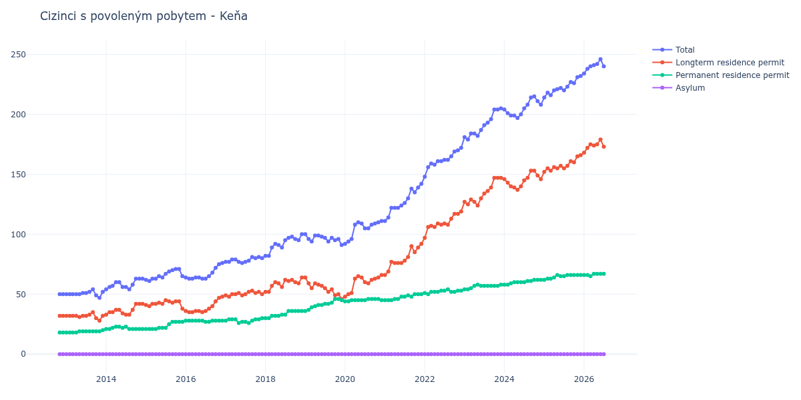

# Keňa

## Souhrnné statistiky (Min/Max pro rok) / Summary Statistics (Min/Max per year)

| Year   | Total     | Longterm Residence Permit   | Permanent Residence Permit   | Asylum   |
|--------|-----------|-----------------------------|------------------------------|----------|
| 2012   | 50 / 50   | 32 / 32                     | 18 / 18                      | 0 / 0    |
| 2013   | 47 / 54   | 28 / 35                     | 18 / 20                      | 0 / 0    |
| 2014   | 54 / 63   | 33 / 42                     | 21 / 23                      | 0 / 0    |
| 2015   | 61 / 71   | 38 / 45                     | 21 / 27                      | 0 / 0    |
| 2016   | 63 / 76   | 35 / 48                     | 27 / 28                      | 0 / 0    |
| 2017   | 76 / 81   | 48 / 53                     | 26 / 30                      | 0 / 0    |
| 2018   | 82 / 100  | 52 / 64                     | 30 / 36                      | 0 / 0    |
| 2019   | 91 / 100  | 46 / 64                     | 36 / 46                      | 0 / 0    |
| 2020   | 92 / 111  | 48 / 66                     | 44 / 46                      | 0 / 0    |
| 2021   | 111 / 142 | 66 / 92                     | 45 / 50                      | 0 / 0    |
| 2022   | 148 / 172 | 97 / 119                    | 50 / 54                      | 0 / 0    |
| 2023   | 179 / 205 | 124 / 147                   | 54 / 58                      | 0 / 0    |
| 2024   | 197 / 215 | 137 / 153                   | 58 / 62                      | 0 / 0    |
| 2025   | 214 / 232 | 152 / 166                   | 62 / 66                      | 0 / 0    |
| 2026   | 234 / 246 | 168 / 179                   | 65 / 67                      | 0 / 0    |

## Detailní tabulka / Detailed Data Table

| Date     | Total         | Longterm Residence Permit   | Permanent Residence Permit   | Asylum   |
|----------|---------------|-----------------------------|------------------------------|----------|
| **2012** |               |                             |                              |          |
| 11.2012  | 50            | 32                          | 18                           | 0        |
| 12.2012  | 50 (+0.00%)   | 32 (+0.00%)                 | 18 (+0.00%)                  | 0        |
| **2013** |               |                             |                              |          |
| 01.2013  | 50 (+0.00%)   | 32 (+0.00%)                 | 18 (+0.00%)                  | 0        |
| 02.2013  | 50 (+0.00%)   | 32 (+0.00%)                 | 18 (+0.00%)                  | 0        |
| 03.2013  | 50 (+0.00%)   | 32 (+0.00%)                 | 18 (+0.00%)                  | 0        |
| 04.2013  | 50 (+0.00%)   | 32 (+0.00%)                 | 18 (+0.00%)                  | 0        |
| 05.2013  | 50 (+0.00%)   | 31 (-3.12%)                 | 19 (+5.56%)                  | 0        |
| 06.2013  | 51 (+2.00%)   | 32 (+3.23%)                 | 19 (+0.00%)                  | 0        |
| 07.2013  | 51 (+0.00%)   | 32 (+0.00%)                 | 19 (+0.00%)                  | 0        |
| 08.2013  | 52 (+1.96%)   | 33 (+3.12%)                 | 19 (+0.00%)                  | 0        |
| 09.2013  | 54 (+3.85%)   | 35 (+6.06%)                 | 19 (+0.00%)                  | 0        |
| 10.2013  | 49 (-9.26%)   | 30 (-14.29%)                | 19 (+0.00%)                  | 0        |
| 11.2013  | 47 (-4.08%)   | 28 (-6.67%)                 | 19 (+0.00%)                  | 0        |
| 12.2013  | 52 (+10.64%)  | 32 (+14.29%)                | 20 (+5.26%)                  | 0        |
| **2014** |               |                             |                              |          |
| 01.2014  | 54 (+3.85%)   | 33 (+3.12%)                 | 21 (+5.00%)                  | 0        |
| 02.2014  | 56 (+3.70%)   | 35 (+6.06%)                 | 21 (+0.00%)                  | 0        |
| 03.2014  | 57 (+1.79%)   | 35 (+0.00%)                 | 22 (+4.76%)                  | 0        |
| 04.2014  | 60 (+5.26%)   | 37 (+5.71%)                 | 23 (+4.55%)                  | 0        |
| 05.2014  | 60 (+0.00%)   | 37 (+0.00%)                 | 23 (+0.00%)                  | 0        |
| 06.2014  | 56 (-6.67%)   | 34 (-8.11%)                 | 22 (-4.35%)                  | 0        |
| 07.2014  | 56 (+0.00%)   | 33 (-2.94%)                 | 23 (+4.55%)                  | 0        |
| 08.2014  | 54 (-3.57%)   | 33 (+0.00%)                 | 21 (-8.70%)                  | 0        |
| 09.2014  | 58 (+7.41%)   | 37 (+12.12%)                | 21 (+0.00%)                  | 0        |
| 10.2014  | 63 (+8.62%)   | 42 (+13.51%)                | 21 (+0.00%)                  | 0        |
| 11.2014  | 63 (+0.00%)   | 42 (+0.00%)                 | 21 (+0.00%)                  | 0        |
| 12.2014  | 63 (+0.00%)   | 42 (+0.00%)                 | 21 (+0.00%)                  | 0        |
| **2015** |               |                             |                              |          |
| 01.2015  | 62 (-1.59%)   | 41 (-2.38%)                 | 21 (+0.00%)                  | 0        |
| 02.2015  | 61 (-1.61%)   | 40 (-2.44%)                 | 21 (+0.00%)                  | 0        |
| 03.2015  | 63 (+3.28%)   | 42 (+5.00%)                 | 21 (+0.00%)                  | 0        |
| 04.2015  | 63 (+0.00%)   | 42 (+0.00%)                 | 21 (+0.00%)                  | 0        |
| 05.2015  | 65 (+3.17%)   | 43 (+2.38%)                 | 22 (+4.76%)                  | 0        |
| 06.2015  | 64 (-1.54%)   | 42 (-2.33%)                 | 22 (+0.00%)                  | 0        |
| 07.2015  | 67 (+4.69%)   | 45 (+7.14%)                 | 22 (+0.00%)                  | 0        |
| 08.2015  | 69 (+2.99%)   | 44 (-2.22%)                 | 25 (+13.64%)                 | 0        |
| 09.2015  | 70 (+1.45%)   | 43 (-2.27%)                 | 27 (+8.00%)                  | 0        |
| 10.2015  | 71 (+1.43%)   | 44 (+2.33%)                 | 27 (+0.00%)                  | 0        |
| 11.2015  | 71 (+0.00%)   | 44 (+0.00%)                 | 27 (+0.00%)                  | 0        |
| 12.2015  | 65 (-8.45%)   | 38 (-13.64%)                | 27 (+0.00%)                  | 0        |
| **2016** |               |                             |                              |          |
| 01.2016  | 64 (-1.54%)   | 36 (-5.26%)                 | 28 (+3.70%)                  | 0        |
| 02.2016  | 63 (-1.56%)   | 35 (-2.78%)                 | 28 (+0.00%)                  | 0        |
| 03.2016  | 63 (+0.00%)   | 35 (+0.00%)                 | 28 (+0.00%)                  | 0        |
| 04.2016  | 64 (+1.59%)   | 36 (+2.86%)                 | 28 (+0.00%)                  | 0        |
| 05.2016  | 64 (+0.00%)   | 36 (+0.00%)                 | 28 (+0.00%)                  | 0        |
| 06.2016  | 63 (-1.56%)   | 35 (-2.78%)                 | 28 (+0.00%)                  | 0        |
| 07.2016  | 63 (+0.00%)   | 36 (+2.86%)                 | 27 (-3.57%)                  | 0        |
| 08.2016  | 65 (+3.17%)   | 38 (+5.56%)                 | 27 (+0.00%)                  | 0        |
| 09.2016  | 68 (+4.62%)   | 40 (+5.26%)                 | 28 (+3.70%)                  | 0        |
| 10.2016  | 72 (+5.88%)   | 44 (+10.00%)                | 28 (+0.00%)                  | 0        |
| 11.2016  | 75 (+4.17%)   | 47 (+6.82%)                 | 28 (+0.00%)                  | 0        |
| 12.2016  | 76 (+1.33%)   | 48 (+2.13%)                 | 28 (+0.00%)                  | 0        |
| **2017** |               |                             |                              |          |
| 01.2017  | 77 (+1.32%)   | 49 (+2.08%)                 | 28 (+0.00%)                  | 0        |
| 02.2017  | 77 (+0.00%)   | 48 (-2.04%)                 | 29 (+3.57%)                  | 0        |
| 03.2017  | 79 (+2.60%)   | 50 (+4.17%)                 | 29 (+0.00%)                  | 0        |
| 04.2017  | 79 (+0.00%)   | 50 (+0.00%)                 | 29 (+0.00%)                  | 0        |
| 05.2017  | 77 (-2.53%)   | 51 (+2.00%)                 | 26 (-10.34%)                 | 0        |
| 06.2017  | 76 (-1.30%)   | 49 (-3.92%)                 | 27 (+3.85%)                  | 0        |
| 07.2017  | 77 (+1.32%)   | 50 (+2.04%)                 | 27 (+0.00%)                  | 0        |
| 08.2017  | 78 (+1.30%)   | 52 (+4.00%)                 | 26 (-3.70%)                  | 0        |
| 09.2017  | 81 (+3.85%)   | 53 (+1.92%)                 | 28 (+7.69%)                  | 0        |
| 10.2017  | 80 (-1.23%)   | 51 (-3.77%)                 | 29 (+3.57%)                  | 0        |
| 11.2017  | 81 (+1.25%)   | 52 (+1.96%)                 | 29 (+0.00%)                  | 0        |
| 12.2017  | 80 (-1.23%)   | 50 (-3.85%)                 | 30 (+3.45%)                  | 0        |
| **2018** |               |                             |                              |          |
| 01.2018  | 82 (+2.50%)   | 52 (+4.00%)                 | 30 (+0.00%)                  | 0        |
| 02.2018  | 82 (+0.00%)   | 52 (+0.00%)                 | 30 (+0.00%)                  | 0        |
| 03.2018  | 89 (+8.54%)   | 57 (+9.62%)                 | 32 (+6.67%)                  | 0        |
| 04.2018  | 92 (+3.37%)   | 60 (+5.26%)                 | 32 (+0.00%)                  | 0        |
| 05.2018  | 91 (-1.09%)   | 59 (-1.67%)                 | 32 (+0.00%)                  | 0        |
| 06.2018  | 89 (-2.20%)   | 56 (-5.08%)                 | 33 (+3.12%)                  | 0        |
| 07.2018  | 95 (+6.74%)   | 62 (+10.71%)                | 33 (+0.00%)                  | 0        |
| 08.2018  | 97 (+2.11%)   | 61 (-1.61%)                 | 36 (+9.09%)                  | 0        |
| 09.2018  | 98 (+1.03%)   | 62 (+1.64%)                 | 36 (+0.00%)                  | 0        |
| 10.2018  | 96 (-2.04%)   | 60 (-3.23%)                 | 36 (+0.00%)                  | 0        |
| 11.2018  | 95 (-1.04%)   | 59 (-1.67%)                 | 36 (+0.00%)                  | 0        |
| 12.2018  | 100 (+5.26%)  | 64 (+8.47%)                 | 36 (+0.00%)                  | 0        |
| **2019** |               |                             |                              |          |
| 01.2019  | 100 (+0.00%)  | 64 (+0.00%)                 | 36 (+0.00%)                  | 0        |
| 02.2019  | 96 (-4.00%)   | 59 (-7.81%)                 | 37 (+2.78%)                  | 0        |
| 03.2019  | 94 (-2.08%)   | 55 (-6.78%)                 | 39 (+5.41%)                  | 0        |
| 04.2019  | 99 (+5.32%)   | 59 (+7.27%)                 | 40 (+2.56%)                  | 0        |
| 05.2019  | 99 (+0.00%)   | 58 (-1.69%)                 | 41 (+2.50%)                  | 0        |
| 06.2019  | 98 (-1.01%)   | 57 (-1.72%)                 | 41 (+0.00%)                  | 0        |
| 07.2019  | 97 (-1.02%)   | 55 (-3.51%)                 | 42 (+2.44%)                  | 0        |
| 08.2019  | 94 (-3.09%)   | 52 (-5.45%)                 | 42 (+0.00%)                  | 0        |
| 09.2019  | 97 (+3.19%)   | 54 (+3.85%)                 | 43 (+2.38%)                  | 0        |
| 10.2019  | 95 (-2.06%)   | 49 (-9.26%)                 | 46 (+6.98%)                  | 0        |
| 11.2019  | 96 (+1.05%)   | 50 (+2.04%)                 | 46 (+0.00%)                  | 0        |
| 12.2019  | 91 (-5.21%)   | 46 (-8.00%)                 | 45 (-2.17%)                  | 0        |
| **2020** |               |                             |                              |          |
| 01.2020  | 92 (+1.10%)   | 48 (+4.35%)                 | 44 (-2.22%)                  | 0        |
| 02.2020  | 94 (+2.17%)   | 50 (+4.17%)                 | 44 (+0.00%)                  | 0        |
| 03.2020  | 96 (+2.13%)   | 51 (+2.00%)                 | 45 (+2.27%)                  | 0        |
| 04.2020  | 108 (+12.50%) | 63 (+23.53%)                | 45 (+0.00%)                  | 0        |
| 05.2020  | 110 (+1.85%)  | 65 (+3.17%)                 | 45 (+0.00%)                  | 0        |
| 06.2020  | 109 (-0.91%)  | 64 (-1.54%)                 | 45 (+0.00%)                  | 0        |
| 07.2020  | 105 (-3.67%)  | 60 (-6.25%)                 | 45 (+0.00%)                  | 0        |
| 08.2020  | 105 (+0.00%)  | 59 (-1.67%)                 | 46 (+2.22%)                  | 0        |
| 09.2020  | 108 (+2.86%)  | 62 (+5.08%)                 | 46 (+0.00%)                  | 0        |
| 10.2020  | 109 (+0.93%)  | 63 (+1.61%)                 | 46 (+0.00%)                  | 0        |
| 11.2020  | 110 (+0.92%)  | 64 (+1.59%)                 | 46 (+0.00%)                  | 0        |
| 12.2020  | 111 (+0.91%)  | 66 (+3.12%)                 | 45 (-2.17%)                  | 0        |
| **2021** |               |                             |                              |          |
| 01.2021  | 111 (+0.00%)  | 66 (+0.00%)                 | 45 (+0.00%)                  | 0        |
| 02.2021  | 114 (+2.70%)  | 69 (+4.55%)                 | 45 (+0.00%)                  | 0        |
| 03.2021  | 122 (+7.02%)  | 77 (+11.59%)                | 45 (+0.00%)                  | 0        |
| 04.2021  | 122 (+0.00%)  | 76 (-1.30%)                 | 46 (+2.22%)                  | 0        |
| 05.2021  | 122 (+0.00%)  | 76 (+0.00%)                 | 46 (+0.00%)                  | 0        |
| 06.2021  | 124 (+1.64%)  | 76 (+0.00%)                 | 48 (+4.35%)                  | 0        |
| 07.2021  | 126 (+1.61%)  | 78 (+2.63%)                 | 48 (+0.00%)                  | 0        |
| 08.2021  | 130 (+3.17%)  | 81 (+3.85%)                 | 49 (+2.08%)                  | 0        |
| 09.2021  | 138 (+6.15%)  | 90 (+11.11%)                | 48 (-2.04%)                  | 0        |
| 10.2021  | 135 (-2.17%)  | 85 (-5.56%)                 | 50 (+4.17%)                  | 0        |
| 11.2021  | 139 (+2.96%)  | 89 (+4.71%)                 | 50 (+0.00%)                  | 0        |
| 12.2021  | 142 (+2.16%)  | 92 (+3.37%)                 | 50 (+0.00%)                  | 0        |
| **2022** |               |                             |                              |          |
| 01.2022  | 148 (+4.23%)  | 97 (+5.43%)                 | 51 (+2.00%)                  | 0        |
| 02.2022  | 156 (+5.41%)  | 106 (+9.28%)                | 50 (-1.96%)                  | 0        |
| 03.2022  | 159 (+1.92%)  | 107 (+0.94%)                | 52 (+4.00%)                  | 0        |
| 04.2022  | 158 (-0.63%)  | 106 (-0.93%)                | 52 (+0.00%)                  | 0        |
| 05.2022  | 161 (+1.90%)  | 109 (+2.83%)                | 52 (+0.00%)                  | 0        |
| 06.2022  | 161 (+0.00%)  | 108 (-0.92%)                | 53 (+1.92%)                  | 0        |
| 07.2022  | 162 (+0.62%)  | 109 (+0.93%)                | 53 (+0.00%)                  | 0        |
| 08.2022  | 162 (+0.00%)  | 108 (-0.92%)                | 54 (+1.89%)                  | 0        |
| 09.2022  | 165 (+1.85%)  | 113 (+4.63%)                | 52 (-3.70%)                  | 0        |
| 10.2022  | 169 (+2.42%)  | 117 (+3.54%)                | 52 (+0.00%)                  | 0        |
| 11.2022  | 170 (+0.59%)  | 117 (+0.00%)                | 53 (+1.92%)                  | 0        |
| 12.2022  | 172 (+1.18%)  | 119 (+1.71%)                | 53 (+0.00%)                  | 0        |
| **2023** |               |                             |                              |          |
| 01.2023  | 181 (+5.23%)  | 127 (+6.72%)                | 54 (+1.89%)                  | 0        |
| 02.2023  | 179 (-1.10%)  | 125 (-1.57%)                | 54 (+0.00%)                  | 0        |
| 03.2023  | 184 (+2.79%)  | 129 (+3.20%)                | 55 (+1.85%)                  | 0        |
| 04.2023  | 184 (+0.00%)  | 127 (-1.55%)                | 57 (+3.64%)                  | 0        |
| 05.2023  | 182 (-1.09%)  | 124 (-2.36%)                | 58 (+1.75%)                  | 0        |
| 06.2023  | 187 (+2.75%)  | 130 (+4.84%)                | 57 (-1.72%)                  | 0        |
| 07.2023  | 191 (+2.14%)  | 134 (+3.08%)                | 57 (+0.00%)                  | 0        |
| 08.2023  | 193 (+1.05%)  | 136 (+1.49%)                | 57 (+0.00%)                  | 0        |
| 09.2023  | 196 (+1.55%)  | 139 (+2.21%)                | 57 (+0.00%)                  | 0        |
| 10.2023  | 204 (+4.08%)  | 147 (+5.76%)                | 57 (+0.00%)                  | 0        |
| 11.2023  | 204 (+0.00%)  | 147 (+0.00%)                | 57 (+0.00%)                  | 0        |
| 12.2023  | 205 (+0.49%)  | 147 (+0.00%)                | 58 (+1.75%)                  | 0        |
| **2024** |               |                             |                              |          |
| 01.2024  | 204 (-0.49%)  | 146 (-0.68%)                | 58 (+0.00%)                  | 0        |
| 02.2024  | 201 (-1.47%)  | 143 (-2.05%)                | 58 (+0.00%)                  | 0        |
| 03.2024  | 199 (-1.00%)  | 140 (-2.10%)                | 59 (+1.72%)                  | 0        |
| 04.2024  | 199 (+0.00%)  | 139 (-0.71%)                | 60 (+1.69%)                  | 0        |
| 05.2024  | 197 (-1.01%)  | 137 (-1.44%)                | 60 (+0.00%)                  | 0        |
| 06.2024  | 200 (+1.52%)  | 140 (+2.19%)                | 60 (+0.00%)                  | 0        |
| 07.2024  | 205 (+2.50%)  | 145 (+3.57%)                | 60 (+0.00%)                  | 0        |
| 08.2024  | 208 (+1.46%)  | 147 (+1.38%)                | 61 (+1.67%)                  | 0        |
| 09.2024  | 214 (+2.88%)  | 153 (+4.08%)                | 61 (+0.00%)                  | 0        |
| 10.2024  | 215 (+0.47%)  | 153 (+0.00%)                | 62 (+1.64%)                  | 0        |
| 11.2024  | 211 (-1.86%)  | 149 (-2.61%)                | 62 (+0.00%)                  | 0        |
| 12.2024  | 208 (-1.42%)  | 146 (-2.01%)                | 62 (+0.00%)                  | 0        |
| **2025** |               |                             |                              |          |
| 01.2025  | 214 (+2.88%)  | 152 (+4.11%)                | 62 (+0.00%)                  | 0        |
| 02.2025  | 218 (+1.87%)  | 155 (+1.97%)                | 63 (+1.61%)                  | 0        |
| 03.2025  | 216 (-0.92%)  | 153 (-1.29%)                | 63 (+0.00%)                  | 0        |
| 04.2025  | 220 (+1.85%)  | 156 (+1.96%)                | 64 (+1.59%)                  | 0        |
| 05.2025  | 221 (+0.45%)  | 155 (-0.64%)                | 66 (+3.12%)                  | 0        |
| 06.2025  | 222 (+0.45%)  | 157 (+1.29%)                | 65 (-1.52%)                  | 0        |
| 07.2025  | 220 (-0.90%)  | 155 (-1.27%)                | 65 (+0.00%)                  | 0        |
| 08.2025  | 223 (+1.36%)  | 157 (+1.29%)                | 66 (+1.54%)                  | 0        |
| 09.2025  | 227 (+1.79%)  | 161 (+2.55%)                | 66 (+0.00%)                  | 0        |
| 10.2025  | 226 (-0.44%)  | 160 (-0.62%)                | 66 (+0.00%)                  | 0        |
| 11.2025  | 231 (+2.21%)  | 165 (+3.12%)                | 66 (+0.00%)                  | 0        |
| 12.2025  | 232 (+0.43%)  | 166 (+0.61%)                | 66 (+0.00%)                  | 0        |
| **2026** |               |                             |                              |          |
| 01.2026  | 234 (+0.86%)  | 168 (+1.20%)                | 66 (+0.00%)                  | 0        |
| 02.2026  | 238 (+1.71%)  | 172 (+2.38%)                | 66 (+0.00%)                  | 0        |
| 03.2026  | 240 (+0.84%)  | 175 (+1.74%)                | 65 (-1.52%)                  | 0        |
| 04.2026  | 241 (+0.42%)  | 174 (-0.57%)                | 67 (+3.08%)                  | 0        |
| 05.2026  | 242 (+0.41%)  | 175 (+0.57%)                | 67 (+0.00%)                  | 0        |
| 06.2026  | 246 (+1.65%)  | 179 (+2.29%)                | 67 (+0.00%)                  | 0        |
| 07.2026  | 240 (-2.44%)  | 173 (-3.35%)                | 67 (+0.00%)                  | 0        |
