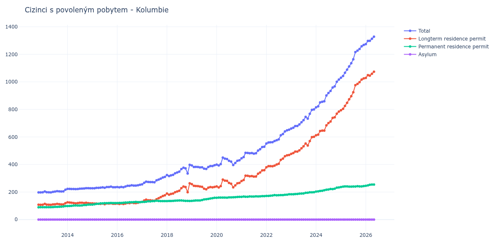

# Kolumbie

## Souhrnné statistiky (Min/Max pro rok) / Summary Statistics (Min/Max per year)

| Year   | Total         | Longterm Residence Permit   | Permanent Residence Permit   | Asylum   |
|--------|---------------|-----------------------------|------------------------------|----------|
| 2012   | 197 / 197     | 107 / 108                   | 89 / 90                      | 0 / 0    |
| 2013   | 197 / 217     | 107 / 119                   | 90 / 98                      | 0 / 0    |
| 2014   | 221 / 228     | 118 / 125                   | 98 / 109                     | 0 / 0    |
| 2015   | 227 / 239     | 112 / 118                   | 109 / 121                    | 0 / 0    |
| 2016   | 234 / 253     | 113 / 127                   | 120 / 128                    | 0 / 0    |
| 2017   | 256 / 310     | 128 / 176                   | 128 / 137                    | 0 / 0    |
| 2018   | 316 / 398     | 181 / 263                   | 134 / 139                    | 0 / 0    |
| 2019   | 368 / 395     | 220 / 257                   | 136 / 158                    | 0 / 0    |
| 2020   | 393 / 450     | 233 / 290                   | 158 / 165                    | 0 / 0    |
| 2021   | 445 / 529     | 280 / 359                   | 165 / 170                    | 0 / 0    |
| 2022   | 552 / 653     | 380 / 469                   | 172 / 184                    | 0 / 0    |
| 2023   | 661 / 800     | 477 / 601                   | 184 / 199                    | 0 / 0    |
| 2024   | 815 / 1 017   | 612 / 784                   | 203 / 233                    | 0 / 0    |
| 2025   | 1 030 / 1 268 | 794 / 1 025                 | 236 / 243                    | 0 / 0    |
| 2026   | 1 274 / 1 328 | 1 029 / 1 074               | 245 / 254                    | 0 / 0    |

## Detailní tabulka / Detailed Data Table

| Date     | Total          | Longterm Residence Permit   | Permanent Residence Permit   | Asylum   |
|----------|----------------|-----------------------------|------------------------------|----------|
| **2012** |                |                             |                              |          |
| 11.2012  | 197            | 108                         | 89                           | 0        |
| 12.2012  | 197 (+0.00%)   | 107 (-0.93%)                | 90 (+1.12%)                  | 0        |
| **2013** |                |                             |                              |          |
| 01.2013  | 198 (+0.51%)   | 108 (+0.93%)                | 90 (+0.00%)                  | 0        |
| 02.2013  | 204 (+3.03%)   | 114 (+5.56%)                | 90 (+0.00%)                  | 0        |
| 03.2013  | 199 (-2.45%)   | 109 (-4.39%)                | 90 (+0.00%)                  | 0        |
| 04.2013  | 198 (-0.50%)   | 108 (-0.92%)                | 90 (+0.00%)                  | 0        |
| 05.2013  | 197 (-0.51%)   | 107 (-0.93%)                | 90 (+0.00%)                  | 0        |
| 06.2013  | 201 (+2.03%)   | 110 (+2.80%)                | 91 (+1.11%)                  | 0        |
| 07.2013  | 203 (+1.00%)   | 111 (+0.91%)                | 92 (+1.10%)                  | 0        |
| 08.2013  | 206 (+1.48%)   | 114 (+2.70%)                | 92 (+0.00%)                  | 0        |
| 09.2013  | 205 (-0.49%)   | 112 (-1.75%)                | 93 (+1.09%)                  | 0        |
| 10.2013  | 204 (-0.49%)   | 110 (-1.79%)                | 94 (+1.08%)                  | 0        |
| 11.2013  | 205 (+0.49%)   | 110 (+0.00%)                | 95 (+1.06%)                  | 0        |
| 12.2013  | 217 (+5.85%)   | 119 (+8.18%)                | 98 (+3.16%)                  | 0        |
| **2014** |                |                             |                              |          |
| 01.2014  | 223 (+2.76%)   | 125 (+5.04%)                | 98 (+0.00%)                  | 0        |
| 02.2014  | 223 (+0.00%)   | 124 (-0.80%)                | 99 (+1.02%)                  | 0        |
| 03.2014  | 222 (-0.45%)   | 122 (-1.61%)                | 100 (+1.01%)                 | 0        |
| 04.2014  | 222 (+0.00%)   | 120 (-1.64%)                | 102 (+2.00%)                 | 0        |
| 05.2014  | 221 (-0.45%)   | 118 (-1.67%)                | 103 (+0.98%)                 | 0        |
| 06.2014  | 222 (+0.45%)   | 120 (+1.69%)                | 102 (-0.97%)                 | 0        |
| 07.2014  | 224 (+0.90%)   | 122 (+1.67%)                | 102 (+0.00%)                 | 0        |
| 08.2014  | 225 (+0.45%)   | 122 (+0.00%)                | 103 (+0.98%)                 | 0        |
| 09.2014  | 226 (+0.44%)   | 120 (-1.64%)                | 106 (+2.91%)                 | 0        |
| 10.2014  | 228 (+0.88%)   | 122 (+1.67%)                | 106 (+0.00%)                 | 0        |
| 11.2014  | 228 (+0.00%)   | 119 (-2.46%)                | 109 (+2.83%)                 | 0        |
| 12.2014  | 227 (-0.44%)   | 118 (-0.84%)                | 109 (+0.00%)                 | 0        |
| **2015** |                |                             |                              |          |
| 01.2015  | 227 (+0.00%)   | 118 (+0.00%)                | 109 (+0.00%)                 | 0        |
| 02.2015  | 227 (+0.00%)   | 116 (-1.69%)                | 111 (+1.83%)                 | 0        |
| 03.2015  | 230 (+1.32%)   | 116 (+0.00%)                | 114 (+2.70%)                 | 0        |
| 04.2015  | 230 (+0.00%)   | 115 (-0.86%)                | 115 (+0.88%)                 | 0        |
| 05.2015  | 232 (+0.87%)   | 114 (-0.87%)                | 118 (+2.61%)                 | 0        |
| 06.2015  | 234 (+0.86%)   | 116 (+1.75%)                | 118 (+0.00%)                 | 0        |
| 07.2015  | 231 (-1.28%)   | 112 (-3.45%)                | 119 (+0.85%)                 | 0        |
| 08.2015  | 236 (+2.16%)   | 117 (+4.46%)                | 119 (+0.00%)                 | 0        |
| 09.2015  | 236 (+0.00%)   | 116 (-0.85%)                | 120 (+0.84%)                 | 0        |
| 10.2015  | 239 (+1.27%)   | 118 (+1.72%)                | 121 (+0.83%)                 | 0        |
| 11.2015  | 235 (-1.67%)   | 115 (-2.54%)                | 120 (-0.83%)                 | 0        |
| 12.2015  | 235 (+0.00%)   | 115 (+0.00%)                | 120 (+0.00%)                 | 0        |
| **2016** |                |                             |                              |          |
| 01.2016  | 236 (+0.43%)   | 116 (+0.87%)                | 120 (+0.00%)                 | 0        |
| 02.2016  | 234 (-0.85%)   | 113 (-2.59%)                | 121 (+0.83%)                 | 0        |
| 03.2016  | 237 (+1.28%)   | 116 (+2.65%)                | 121 (+0.00%)                 | 0        |
| 04.2016  | 235 (-0.84%)   | 113 (-2.59%)                | 122 (+0.83%)                 | 0        |
| 05.2016  | 240 (+2.13%)   | 116 (+2.65%)                | 124 (+1.64%)                 | 0        |
| 06.2016  | 245 (+2.08%)   | 121 (+4.31%)                | 124 (+0.00%)                 | 0        |
| 07.2016  | 245 (+0.00%)   | 119 (-1.65%)                | 126 (+1.61%)                 | 0        |
| 08.2016  | 249 (+1.63%)   | 123 (+3.36%)                | 126 (+0.00%)                 | 0        |
| 09.2016  | 247 (-0.80%)   | 120 (-2.44%)                | 127 (+0.79%)                 | 0        |
| 10.2016  | 247 (+0.00%)   | 119 (-0.83%)                | 128 (+0.79%)                 | 0        |
| 11.2016  | 249 (+0.81%)   | 122 (+2.52%)                | 127 (-0.78%)                 | 0        |
| 12.2016  | 253 (+1.61%)   | 127 (+4.10%)                | 126 (-0.79%)                 | 0        |
| **2017** |                |                             |                              |          |
| 01.2017  | 256 (+1.19%)   | 128 (+0.79%)                | 128 (+1.59%)                 | 0        |
| 02.2017  | 267 (+4.30%)   | 139 (+8.59%)                | 128 (+0.00%)                 | 0        |
| 03.2017  | 275 (+3.00%)   | 145 (+4.32%)                | 130 (+1.56%)                 | 0        |
| 04.2017  | 273 (-0.73%)   | 140 (-3.45%)                | 133 (+2.31%)                 | 0        |
| 05.2017  | 272 (-0.37%)   | 140 (+0.00%)                | 132 (-0.75%)                 | 0        |
| 06.2017  | 272 (+0.00%)   | 138 (-1.43%)                | 134 (+1.52%)                 | 0        |
| 07.2017  | 271 (-0.37%)   | 137 (-0.72%)                | 134 (+0.00%)                 | 0        |
| 08.2017  | 285 (+5.17%)   | 148 (+8.03%)                | 137 (+2.24%)                 | 0        |
| 09.2017  | 290 (+1.75%)   | 155 (+4.73%)                | 135 (-1.46%)                 | 0        |
| 10.2017  | 297 (+2.41%)   | 163 (+5.16%)                | 134 (-0.74%)                 | 0        |
| 11.2017  | 305 (+2.69%)   | 171 (+4.91%)                | 134 (+0.00%)                 | 0        |
| 12.2017  | 310 (+1.64%)   | 176 (+2.92%)                | 134 (+0.00%)                 | 0        |
| **2018** |                |                             |                              |          |
| 01.2018  | 323 (+4.19%)   | 189 (+7.39%)                | 134 (+0.00%)                 | 0        |
| 02.2018  | 316 (-2.17%)   | 181 (-4.23%)                | 135 (+0.75%)                 | 0        |
| 03.2018  | 321 (+1.58%)   | 186 (+2.76%)                | 135 (+0.00%)                 | 0        |
| 04.2018  | 325 (+1.25%)   | 189 (+1.61%)                | 136 (+0.74%)                 | 0        |
| 05.2018  | 336 (+3.38%)   | 199 (+5.29%)                | 137 (+0.74%)                 | 0        |
| 06.2018  | 342 (+1.79%)   | 204 (+2.51%)                | 138 (+0.73%)                 | 0        |
| 07.2018  | 348 (+1.75%)   | 209 (+2.45%)                | 139 (+0.72%)                 | 0        |
| 08.2018  | 367 (+5.46%)   | 228 (+9.09%)                | 139 (+0.00%)                 | 0        |
| 09.2018  | 377 (+2.72%)   | 240 (+5.26%)                | 137 (-1.44%)                 | 0        |
| 10.2018  | 372 (-1.33%)   | 236 (-1.67%)                | 136 (-0.73%)                 | 0        |
| 11.2018  | 335 (-9.95%)   | 199 (-15.68%)               | 136 (+0.00%)                 | 0        |
| 12.2018  | 398 (+18.81%)  | 263 (+32.16%)               | 135 (-0.74%)                 | 0        |
| **2019** |                |                             |                              |          |
| 01.2019  | 393 (-1.26%)   | 257 (-2.28%)                | 136 (+0.74%)                 | 0        |
| 02.2019  | 382 (-2.80%)   | 245 (-4.67%)                | 137 (+0.74%)                 | 0        |
| 03.2019  | 383 (+0.26%)   | 244 (-0.41%)                | 139 (+1.46%)                 | 0        |
| 04.2019  | 382 (-0.26%)   | 243 (-0.41%)                | 139 (+0.00%)                 | 0        |
| 05.2019  | 379 (-0.79%)   | 240 (-1.23%)                | 139 (+0.00%)                 | 0        |
| 06.2019  | 380 (+0.26%)   | 238 (-0.83%)                | 142 (+2.16%)                 | 0        |
| 07.2019  | 370 (-2.63%)   | 224 (-5.88%)                | 146 (+2.82%)                 | 0        |
| 08.2019  | 368 (-0.54%)   | 220 (-1.79%)                | 148 (+1.37%)                 | 0        |
| 09.2019  | 382 (+3.80%)   | 232 (+5.45%)                | 150 (+1.35%)                 | 0        |
| 10.2019  | 389 (+1.83%)   | 236 (+1.72%)                | 153 (+2.00%)                 | 0        |
| 11.2019  | 389 (+0.00%)   | 234 (-0.85%)                | 155 (+1.31%)                 | 0        |
| 12.2019  | 395 (+1.54%)   | 237 (+1.28%)                | 158 (+1.94%)                 | 0        |
| **2020** |                |                             |                              |          |
| 01.2020  | 399 (+1.01%)   | 241 (+1.69%)                | 158 (+0.00%)                 | 0        |
| 02.2020  | 393 (-1.50%)   | 233 (-3.32%)                | 160 (+1.27%)                 | 0        |
| 03.2020  | 403 (+2.54%)   | 243 (+4.29%)                | 160 (+0.00%)                 | 0        |
| 04.2020  | 450 (+11.66%)  | 290 (+19.34%)               | 160 (+0.00%)                 | 0        |
| 05.2020  | 443 (-1.56%)   | 283 (-2.41%)                | 160 (+0.00%)                 | 0        |
| 06.2020  | 440 (-0.68%)   | 281 (-0.71%)                | 159 (-0.62%)                 | 0        |
| 07.2020  | 427 (-2.95%)   | 266 (-5.34%)                | 161 (+1.26%)                 | 0        |
| 08.2020  | 421 (-1.41%)   | 260 (-2.26%)                | 161 (+0.00%)                 | 0        |
| 09.2020  | 396 (-5.94%)   | 234 (-10.00%)               | 162 (+0.62%)                 | 0        |
| 10.2020  | 411 (+3.79%)   | 248 (+5.98%)                | 163 (+0.62%)                 | 0        |
| 11.2020  | 427 (+3.89%)   | 263 (+6.05%)                | 164 (+0.61%)                 | 0        |
| 12.2020  | 431 (+0.94%)   | 266 (+1.14%)                | 165 (+0.61%)                 | 0        |
| **2021** |                |                             |                              |          |
| 01.2021  | 445 (+3.25%)   | 280 (+5.26%)                | 165 (+0.00%)                 | 0        |
| 02.2021  | 454 (+2.02%)   | 287 (+2.50%)                | 167 (+1.21%)                 | 0        |
| 03.2021  | 485 (+6.83%)   | 319 (+11.15%)               | 166 (-0.60%)                 | 0        |
| 04.2021  | 484 (-0.21%)   | 318 (-0.31%)                | 166 (+0.00%)                 | 0        |
| 05.2021  | 482 (-0.41%)   | 314 (-1.26%)                | 168 (+1.20%)                 | 0        |
| 06.2021  | 483 (+0.21%)   | 316 (+0.64%)                | 167 (-0.60%)                 | 0        |
| 07.2021  | 479 (-0.83%)   | 312 (-1.27%)                | 167 (+0.00%)                 | 0        |
| 08.2021  | 482 (+0.63%)   | 313 (+0.32%)                | 169 (+1.20%)                 | 0        |
| 09.2021  | 501 (+3.94%)   | 333 (+6.39%)                | 168 (-0.59%)                 | 0        |
| 10.2021  | 511 (+2.00%)   | 342 (+2.70%)                | 169 (+0.60%)                 | 0        |
| 11.2021  | 527 (+3.13%)   | 357 (+4.39%)                | 170 (+0.59%)                 | 0        |
| 12.2021  | 529 (+0.38%)   | 359 (+0.56%)                | 170 (+0.00%)                 | 0        |
| **2022** |                |                             |                              |          |
| 01.2022  | 552 (+4.35%)   | 380 (+5.85%)                | 172 (+1.18%)                 | 0        |
| 02.2022  | 560 (+1.45%)   | 388 (+2.11%)                | 172 (+0.00%)                 | 0        |
| 03.2022  | 561 (+0.18%)   | 388 (+0.00%)                | 173 (+0.58%)                 | 0        |
| 04.2022  | 562 (+0.18%)   | 387 (-0.26%)                | 175 (+1.16%)                 | 0        |
| 05.2022  | 570 (+1.42%)   | 392 (+1.29%)                | 178 (+1.71%)                 | 0        |
| 06.2022  | 576 (+1.05%)   | 400 (+2.04%)                | 176 (-1.12%)                 | 0        |
| 07.2022  | 582 (+1.04%)   | 405 (+1.25%)                | 177 (+0.57%)                 | 0        |
| 08.2022  | 612 (+5.15%)   | 434 (+7.16%)                | 178 (+0.56%)                 | 0        |
| 09.2022  | 621 (+1.47%)   | 443 (+2.07%)                | 178 (+0.00%)                 | 0        |
| 10.2022  | 640 (+3.06%)   | 460 (+3.84%)                | 180 (+1.12%)                 | 0        |
| 11.2022  | 648 (+1.25%)   | 467 (+1.52%)                | 181 (+0.56%)                 | 0        |
| 12.2022  | 653 (+0.77%)   | 469 (+0.43%)                | 184 (+1.66%)                 | 0        |
| **2023** |                |                             |                              |          |
| 01.2023  | 661 (+1.23%)   | 477 (+1.71%)                | 184 (+0.00%)                 | 0        |
| 02.2023  | 667 (+0.91%)   | 483 (+1.26%)                | 184 (+0.00%)                 | 0        |
| 03.2023  | 679 (+1.80%)   | 494 (+2.28%)                | 185 (+0.54%)                 | 0        |
| 04.2023  | 680 (+0.15%)   | 494 (+0.00%)                | 186 (+0.54%)                 | 0        |
| 05.2023  | 691 (+1.62%)   | 503 (+1.82%)                | 188 (+1.08%)                 | 0        |
| 06.2023  | 707 (+2.32%)   | 518 (+2.98%)                | 189 (+0.53%)                 | 0        |
| 07.2023  | 722 (+2.12%)   | 532 (+2.70%)                | 190 (+0.53%)                 | 0        |
| 08.2023  | 746 (+3.32%)   | 552 (+3.76%)                | 194 (+2.11%)                 | 0        |
| 09.2023  | 733 (-1.74%)   | 538 (-2.54%)                | 195 (+0.52%)                 | 0        |
| 10.2023  | 768 (+4.77%)   | 570 (+5.95%)                | 198 (+1.54%)                 | 0        |
| 11.2023  | 797 (+3.78%)   | 599 (+5.09%)                | 198 (+0.00%)                 | 0        |
| 12.2023  | 800 (+0.38%)   | 601 (+0.33%)                | 199 (+0.51%)                 | 0        |
| **2024** |                |                             |                              |          |
| 01.2024  | 815 (+1.88%)   | 612 (+1.83%)                | 203 (+2.01%)                 | 0        |
| 02.2024  | 822 (+0.86%)   | 617 (+0.82%)                | 205 (+0.99%)                 | 0        |
| 03.2024  | 851 (+3.53%)   | 643 (+4.21%)                | 208 (+1.46%)                 | 0        |
| 04.2024  | 855 (+0.47%)   | 646 (+0.47%)                | 209 (+0.48%)                 | 0        |
| 05.2024  | 859 (+0.47%)   | 646 (+0.00%)                | 213 (+1.91%)                 | 0        |
| 06.2024  | 901 (+4.89%)   | 684 (+5.88%)                | 217 (+1.88%)                 | 0        |
| 07.2024  | 919 (+2.00%)   | 701 (+2.49%)                | 218 (+0.46%)                 | 0        |
| 08.2024  | 934 (+1.63%)   | 712 (+1.57%)                | 222 (+1.83%)                 | 0        |
| 09.2024  | 959 (+2.68%)   | 738 (+3.65%)                | 221 (-0.45%)                 | 0        |
| 10.2024  | 967 (+0.83%)   | 743 (+0.68%)                | 224 (+1.36%)                 | 0        |
| 11.2024  | 1 001 (+3.52%) | 769 (+3.50%)                | 232 (+3.57%)                 | 0        |
| 12.2024  | 1 017 (+1.60%) | 784 (+1.95%)                | 233 (+0.43%)                 | 0        |
| **2025** |                |                             |                              |          |
| 01.2025  | 1 030 (+1.28%) | 794 (+1.28%)                | 236 (+1.29%)                 | 0        |
| 02.2025  | 1 043 (+1.26%) | 804 (+1.26%)                | 239 (+1.27%)                 | 0        |
| 03.2025  | 1 066 (+2.21%) | 825 (+2.61%)                | 241 (+0.84%)                 | 0        |
| 04.2025  | 1 089 (+2.16%) | 848 (+2.79%)                | 241 (+0.00%)                 | 0        |
| 05.2025  | 1 112 (+2.11%) | 873 (+2.95%)                | 239 (-0.83%)                 | 0        |
| 06.2025  | 1 135 (+2.07%) | 896 (+2.63%)                | 239 (+0.00%)                 | 0        |
| 07.2025  | 1 164 (+2.56%) | 924 (+3.12%)                | 240 (+0.42%)                 | 0        |
| 08.2025  | 1 216 (+4.47%) | 976 (+5.63%)                | 240 (+0.00%)                 | 0        |
| 09.2025  | 1 227 (+0.90%) | 985 (+0.92%)                | 242 (+0.83%)                 | 0        |
| 10.2025  | 1 239 (+0.98%) | 998 (+1.32%)                | 241 (-0.41%)                 | 0        |
| 11.2025  | 1 258 (+1.53%) | 1 017 (+1.90%)              | 241 (+0.00%)                 | 0        |
| 12.2025  | 1 268 (+0.79%) | 1 025 (+0.79%)              | 243 (+0.83%)                 | 0        |
| **2026** |                |                             |                              |          |
| 01.2026  | 1 274 (+0.47%) | 1 029 (+0.39%)              | 245 (+0.82%)                 | 0        |
| 02.2026  | 1 297 (+1.81%) | 1 049 (+1.94%)              | 248 (+1.22%)                 | 0        |
| 03.2026  | 1 298 (+0.08%) | 1 045 (-0.38%)              | 253 (+2.02%)                 | 0        |
| 04.2026  | 1 313 (+1.16%) | 1 059 (+1.34%)              | 254 (+0.40%)                 | 0        |
| 05.2026  | 1 328 (+1.14%) | 1 074 (+1.42%)              | 254 (+0.00%)                 | 0        |
