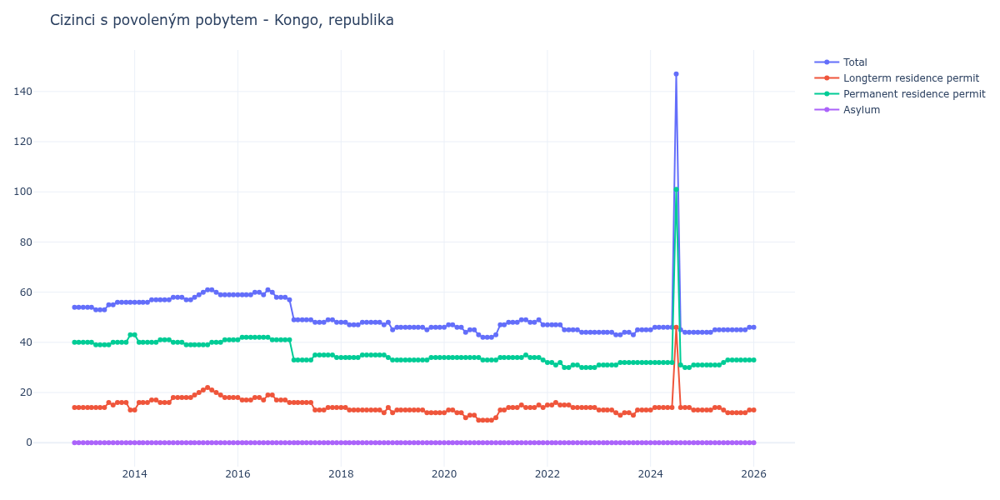

# Kongo, republika

## Souhrnné statistiky (Min/Max pro rok) / Summary Statistics (Min/Max per year)

| Year   | Total    | Longterm Residence Permit   | Permanent Residence Permit   | Asylum   |
|--------|----------|-----------------------------|------------------------------|----------|
| 2012   | 54 / 54  | 14 / 14                     | 40 / 40                      | 0 / 0    |
| 2013   | 53 / 56  | 13 / 16                     | 39 / 43                      | 0 / 0    |
| 2014   | 56 / 58  | 13 / 18                     | 40 / 43                      | 0 / 0    |
| 2015   | 57 / 61  | 18 / 22                     | 39 / 41                      | 0 / 0    |
| 2016   | 58 / 61  | 17 / 19                     | 41 / 42                      | 0 / 0    |
| 2017   | 48 / 57  | 13 / 16                     | 33 / 41                      | 0 / 0    |
| 2018   | 47 / 48  | 12 / 14                     | 34 / 35                      | 0 / 0    |
| 2019   | 45 / 46  | 12 / 13                     | 33 / 34                      | 0 / 0    |
| 2020   | 42 / 47  | 9 / 13                      | 33 / 34                      | 0 / 0    |
| 2021   | 43 / 49  | 10 / 15                     | 33 / 35                      | 0 / 0    |
| 2022   | 44 / 47  | 14 / 16                     | 30 / 32                      | 0 / 0    |
| 2023   | 43 / 45  | 11 / 13                     | 31 / 32                      | 0 / 0    |
| 2024   | 44 / 147 | 13 / 46                     | 30 / 101                     | 0 / 0    |
| 2025   | 44 / 46  | 12 / 14                     | 31 / 33                      | 0 / 0    |
| 2026   | 46 / 46  | 13 / 13                     | 33 / 33                      | 0 / 0    |

## Detailní tabulka / Detailed Data Table

| Date     | Total          | Longterm Residence Permit   | Permanent Residence Permit   | Asylum   |
|----------|----------------|-----------------------------|------------------------------|----------|
| **2012** |                |                             |                              |          |
| 11.2012  | 54             | 14                          | 40                           | 0        |
| 12.2012  | 54 (+0.00%)    | 14 (+0.00%)                 | 40 (+0.00%)                  | 0        |
| **2013** |                |                             |                              |          |
| 01.2013  | 54 (+0.00%)    | 14 (+0.00%)                 | 40 (+0.00%)                  | 0        |
| 02.2013  | 54 (+0.00%)    | 14 (+0.00%)                 | 40 (+0.00%)                  | 0        |
| 03.2013  | 54 (+0.00%)    | 14 (+0.00%)                 | 40 (+0.00%)                  | 0        |
| 04.2013  | 53 (-1.85%)    | 14 (+0.00%)                 | 39 (-2.50%)                  | 0        |
| 05.2013  | 53 (+0.00%)    | 14 (+0.00%)                 | 39 (+0.00%)                  | 0        |
| 06.2013  | 53 (+0.00%)    | 14 (+0.00%)                 | 39 (+0.00%)                  | 0        |
| 07.2013  | 55 (+3.77%)    | 16 (+14.29%)                | 39 (+0.00%)                  | 0        |
| 08.2013  | 55 (+0.00%)    | 15 (-6.25%)                 | 40 (+2.56%)                  | 0        |
| 09.2013  | 56 (+1.82%)    | 16 (+6.67%)                 | 40 (+0.00%)                  | 0        |
| 10.2013  | 56 (+0.00%)    | 16 (+0.00%)                 | 40 (+0.00%)                  | 0        |
| 11.2013  | 56 (+0.00%)    | 16 (+0.00%)                 | 40 (+0.00%)                  | 0        |
| 12.2013  | 56 (+0.00%)    | 13 (-18.75%)                | 43 (+7.50%)                  | 0        |
| **2014** |                |                             |                              |          |
| 01.2014  | 56 (+0.00%)    | 13 (+0.00%)                 | 43 (+0.00%)                  | 0        |
| 02.2014  | 56 (+0.00%)    | 16 (+23.08%)                | 40 (-6.98%)                  | 0        |
| 03.2014  | 56 (+0.00%)    | 16 (+0.00%)                 | 40 (+0.00%)                  | 0        |
| 04.2014  | 56 (+0.00%)    | 16 (+0.00%)                 | 40 (+0.00%)                  | 0        |
| 05.2014  | 57 (+1.79%)    | 17 (+6.25%)                 | 40 (+0.00%)                  | 0        |
| 06.2014  | 57 (+0.00%)    | 17 (+0.00%)                 | 40 (+0.00%)                  | 0        |
| 07.2014  | 57 (+0.00%)    | 16 (-5.88%)                 | 41 (+2.50%)                  | 0        |
| 08.2014  | 57 (+0.00%)    | 16 (+0.00%)                 | 41 (+0.00%)                  | 0        |
| 09.2014  | 57 (+0.00%)    | 16 (+0.00%)                 | 41 (+0.00%)                  | 0        |
| 10.2014  | 58 (+1.75%)    | 18 (+12.50%)                | 40 (-2.44%)                  | 0        |
| 11.2014  | 58 (+0.00%)    | 18 (+0.00%)                 | 40 (+0.00%)                  | 0        |
| 12.2014  | 58 (+0.00%)    | 18 (+0.00%)                 | 40 (+0.00%)                  | 0        |
| **2015** |                |                             |                              |          |
| 01.2015  | 57 (-1.72%)    | 18 (+0.00%)                 | 39 (-2.50%)                  | 0        |
| 02.2015  | 57 (+0.00%)    | 18 (+0.00%)                 | 39 (+0.00%)                  | 0        |
| 03.2015  | 58 (+1.75%)    | 19 (+5.56%)                 | 39 (+0.00%)                  | 0        |
| 04.2015  | 59 (+1.72%)    | 20 (+5.26%)                 | 39 (+0.00%)                  | 0        |
| 05.2015  | 60 (+1.69%)    | 21 (+5.00%)                 | 39 (+0.00%)                  | 0        |
| 06.2015  | 61 (+1.67%)    | 22 (+4.76%)                 | 39 (+0.00%)                  | 0        |
| 07.2015  | 61 (+0.00%)    | 21 (-4.55%)                 | 40 (+2.56%)                  | 0        |
| 08.2015  | 60 (-1.64%)    | 20 (-4.76%)                 | 40 (+0.00%)                  | 0        |
| 09.2015  | 59 (-1.67%)    | 19 (-5.00%)                 | 40 (+0.00%)                  | 0        |
| 10.2015  | 59 (+0.00%)    | 18 (-5.26%)                 | 41 (+2.50%)                  | 0        |
| 11.2015  | 59 (+0.00%)    | 18 (+0.00%)                 | 41 (+0.00%)                  | 0        |
| 12.2015  | 59 (+0.00%)    | 18 (+0.00%)                 | 41 (+0.00%)                  | 0        |
| **2016** |                |                             |                              |          |
| 01.2016  | 59 (+0.00%)    | 18 (+0.00%)                 | 41 (+0.00%)                  | 0        |
| 02.2016  | 59 (+0.00%)    | 17 (-5.56%)                 | 42 (+2.44%)                  | 0        |
| 03.2016  | 59 (+0.00%)    | 17 (+0.00%)                 | 42 (+0.00%)                  | 0        |
| 04.2016  | 59 (+0.00%)    | 17 (+0.00%)                 | 42 (+0.00%)                  | 0        |
| 05.2016  | 60 (+1.69%)    | 18 (+5.88%)                 | 42 (+0.00%)                  | 0        |
| 06.2016  | 60 (+0.00%)    | 18 (+0.00%)                 | 42 (+0.00%)                  | 0        |
| 07.2016  | 59 (-1.67%)    | 17 (-5.56%)                 | 42 (+0.00%)                  | 0        |
| 08.2016  | 61 (+3.39%)    | 19 (+11.76%)                | 42 (+0.00%)                  | 0        |
| 09.2016  | 60 (-1.64%)    | 19 (+0.00%)                 | 41 (-2.38%)                  | 0        |
| 10.2016  | 58 (-3.33%)    | 17 (-10.53%)                | 41 (+0.00%)                  | 0        |
| 11.2016  | 58 (+0.00%)    | 17 (+0.00%)                 | 41 (+0.00%)                  | 0        |
| 12.2016  | 58 (+0.00%)    | 17 (+0.00%)                 | 41 (+0.00%)                  | 0        |
| **2017** |                |                             |                              |          |
| 01.2017  | 57 (-1.72%)    | 16 (-5.88%)                 | 41 (+0.00%)                  | 0        |
| 02.2017  | 49 (-14.04%)   | 16 (+0.00%)                 | 33 (-19.51%)                 | 0        |
| 03.2017  | 49 (+0.00%)    | 16 (+0.00%)                 | 33 (+0.00%)                  | 0        |
| 04.2017  | 49 (+0.00%)    | 16 (+0.00%)                 | 33 (+0.00%)                  | 0        |
| 05.2017  | 49 (+0.00%)    | 16 (+0.00%)                 | 33 (+0.00%)                  | 0        |
| 06.2017  | 49 (+0.00%)    | 16 (+0.00%)                 | 33 (+0.00%)                  | 0        |
| 07.2017  | 48 (-2.04%)    | 13 (-18.75%)                | 35 (+6.06%)                  | 0        |
| 08.2017  | 48 (+0.00%)    | 13 (+0.00%)                 | 35 (+0.00%)                  | 0        |
| 09.2017  | 48 (+0.00%)    | 13 (+0.00%)                 | 35 (+0.00%)                  | 0        |
| 10.2017  | 49 (+2.08%)    | 14 (+7.69%)                 | 35 (+0.00%)                  | 0        |
| 11.2017  | 49 (+0.00%)    | 14 (+0.00%)                 | 35 (+0.00%)                  | 0        |
| 12.2017  | 48 (-2.04%)    | 14 (+0.00%)                 | 34 (-2.86%)                  | 0        |
| **2018** |                |                             |                              |          |
| 01.2018  | 48 (+0.00%)    | 14 (+0.00%)                 | 34 (+0.00%)                  | 0        |
| 02.2018  | 48 (+0.00%)    | 14 (+0.00%)                 | 34 (+0.00%)                  | 0        |
| 03.2018  | 47 (-2.08%)    | 13 (-7.14%)                 | 34 (+0.00%)                  | 0        |
| 04.2018  | 47 (+0.00%)    | 13 (+0.00%)                 | 34 (+0.00%)                  | 0        |
| 05.2018  | 47 (+0.00%)    | 13 (+0.00%)                 | 34 (+0.00%)                  | 0        |
| 06.2018  | 48 (+2.13%)    | 13 (+0.00%)                 | 35 (+2.94%)                  | 0        |
| 07.2018  | 48 (+0.00%)    | 13 (+0.00%)                 | 35 (+0.00%)                  | 0        |
| 08.2018  | 48 (+0.00%)    | 13 (+0.00%)                 | 35 (+0.00%)                  | 0        |
| 09.2018  | 48 (+0.00%)    | 13 (+0.00%)                 | 35 (+0.00%)                  | 0        |
| 10.2018  | 48 (+0.00%)    | 13 (+0.00%)                 | 35 (+0.00%)                  | 0        |
| 11.2018  | 47 (-2.08%)    | 12 (-7.69%)                 | 35 (+0.00%)                  | 0        |
| 12.2018  | 48 (+2.13%)    | 14 (+16.67%)                | 34 (-2.86%)                  | 0        |
| **2019** |                |                             |                              |          |
| 01.2019  | 45 (-6.25%)    | 12 (-14.29%)                | 33 (-2.94%)                  | 0        |
| 02.2019  | 46 (+2.22%)    | 13 (+8.33%)                 | 33 (+0.00%)                  | 0        |
| 03.2019  | 46 (+0.00%)    | 13 (+0.00%)                 | 33 (+0.00%)                  | 0        |
| 04.2019  | 46 (+0.00%)    | 13 (+0.00%)                 | 33 (+0.00%)                  | 0        |
| 05.2019  | 46 (+0.00%)    | 13 (+0.00%)                 | 33 (+0.00%)                  | 0        |
| 06.2019  | 46 (+0.00%)    | 13 (+0.00%)                 | 33 (+0.00%)                  | 0        |
| 07.2019  | 46 (+0.00%)    | 13 (+0.00%)                 | 33 (+0.00%)                  | 0        |
| 08.2019  | 46 (+0.00%)    | 13 (+0.00%)                 | 33 (+0.00%)                  | 0        |
| 09.2019  | 45 (-2.17%)    | 12 (-7.69%)                 | 33 (+0.00%)                  | 0        |
| 10.2019  | 46 (+2.22%)    | 12 (+0.00%)                 | 34 (+3.03%)                  | 0        |
| 11.2019  | 46 (+0.00%)    | 12 (+0.00%)                 | 34 (+0.00%)                  | 0        |
| 12.2019  | 46 (+0.00%)    | 12 (+0.00%)                 | 34 (+0.00%)                  | 0        |
| **2020** |                |                             |                              |          |
| 01.2020  | 46 (+0.00%)    | 12 (+0.00%)                 | 34 (+0.00%)                  | 0        |
| 02.2020  | 47 (+2.17%)    | 13 (+8.33%)                 | 34 (+0.00%)                  | 0        |
| 03.2020  | 47 (+0.00%)    | 13 (+0.00%)                 | 34 (+0.00%)                  | 0        |
| 04.2020  | 46 (-2.13%)    | 12 (-7.69%)                 | 34 (+0.00%)                  | 0        |
| 05.2020  | 46 (+0.00%)    | 12 (+0.00%)                 | 34 (+0.00%)                  | 0        |
| 06.2020  | 44 (-4.35%)    | 10 (-16.67%)                | 34 (+0.00%)                  | 0        |
| 07.2020  | 45 (+2.27%)    | 11 (+10.00%)                | 34 (+0.00%)                  | 0        |
| 08.2020  | 45 (+0.00%)    | 11 (+0.00%)                 | 34 (+0.00%)                  | 0        |
| 09.2020  | 43 (-4.44%)    | 9 (-18.18%)                 | 34 (+0.00%)                  | 0        |
| 10.2020  | 42 (-2.33%)    | 9 (+0.00%)                  | 33 (-2.94%)                  | 0        |
| 11.2020  | 42 (+0.00%)    | 9 (+0.00%)                  | 33 (+0.00%)                  | 0        |
| 12.2020  | 42 (+0.00%)    | 9 (+0.00%)                  | 33 (+0.00%)                  | 0        |
| **2021** |                |                             |                              |          |
| 01.2021  | 43 (+2.38%)    | 10 (+11.11%)                | 33 (+0.00%)                  | 0        |
| 02.2021  | 47 (+9.30%)    | 13 (+30.00%)                | 34 (+3.03%)                  | 0        |
| 03.2021  | 47 (+0.00%)    | 13 (+0.00%)                 | 34 (+0.00%)                  | 0        |
| 04.2021  | 48 (+2.13%)    | 14 (+7.69%)                 | 34 (+0.00%)                  | 0        |
| 05.2021  | 48 (+0.00%)    | 14 (+0.00%)                 | 34 (+0.00%)                  | 0        |
| 06.2021  | 48 (+0.00%)    | 14 (+0.00%)                 | 34 (+0.00%)                  | 0        |
| 07.2021  | 49 (+2.08%)    | 15 (+7.14%)                 | 34 (+0.00%)                  | 0        |
| 08.2021  | 49 (+0.00%)    | 14 (-6.67%)                 | 35 (+2.94%)                  | 0        |
| 09.2021  | 48 (-2.04%)    | 14 (+0.00%)                 | 34 (-2.86%)                  | 0        |
| 10.2021  | 48 (+0.00%)    | 14 (+0.00%)                 | 34 (+0.00%)                  | 0        |
| 11.2021  | 49 (+2.08%)    | 15 (+7.14%)                 | 34 (+0.00%)                  | 0        |
| 12.2021  | 47 (-4.08%)    | 14 (-6.67%)                 | 33 (-2.94%)                  | 0        |
| **2022** |                |                             |                              |          |
| 01.2022  | 47 (+0.00%)    | 15 (+7.14%)                 | 32 (-3.03%)                  | 0        |
| 02.2022  | 47 (+0.00%)    | 15 (+0.00%)                 | 32 (+0.00%)                  | 0        |
| 03.2022  | 47 (+0.00%)    | 16 (+6.67%)                 | 31 (-3.12%)                  | 0        |
| 04.2022  | 47 (+0.00%)    | 15 (-6.25%)                 | 32 (+3.23%)                  | 0        |
| 05.2022  | 45 (-4.26%)    | 15 (+0.00%)                 | 30 (-6.25%)                  | 0        |
| 06.2022  | 45 (+0.00%)    | 15 (+0.00%)                 | 30 (+0.00%)                  | 0        |
| 07.2022  | 45 (+0.00%)    | 14 (-6.67%)                 | 31 (+3.33%)                  | 0        |
| 08.2022  | 45 (+0.00%)    | 14 (+0.00%)                 | 31 (+0.00%)                  | 0        |
| 09.2022  | 44 (-2.22%)    | 14 (+0.00%)                 | 30 (-3.23%)                  | 0        |
| 10.2022  | 44 (+0.00%)    | 14 (+0.00%)                 | 30 (+0.00%)                  | 0        |
| 11.2022  | 44 (+0.00%)    | 14 (+0.00%)                 | 30 (+0.00%)                  | 0        |
| 12.2022  | 44 (+0.00%)    | 14 (+0.00%)                 | 30 (+0.00%)                  | 0        |
| **2023** |                |                             |                              |          |
| 01.2023  | 44 (+0.00%)    | 13 (-7.14%)                 | 31 (+3.33%)                  | 0        |
| 02.2023  | 44 (+0.00%)    | 13 (+0.00%)                 | 31 (+0.00%)                  | 0        |
| 03.2023  | 44 (+0.00%)    | 13 (+0.00%)                 | 31 (+0.00%)                  | 0        |
| 04.2023  | 44 (+0.00%)    | 13 (+0.00%)                 | 31 (+0.00%)                  | 0        |
| 05.2023  | 43 (-2.27%)    | 12 (-7.69%)                 | 31 (+0.00%)                  | 0        |
| 06.2023  | 43 (+0.00%)    | 11 (-8.33%)                 | 32 (+3.23%)                  | 0        |
| 07.2023  | 44 (+2.33%)    | 12 (+9.09%)                 | 32 (+0.00%)                  | 0        |
| 08.2023  | 44 (+0.00%)    | 12 (+0.00%)                 | 32 (+0.00%)                  | 0        |
| 09.2023  | 43 (-2.27%)    | 11 (-8.33%)                 | 32 (+0.00%)                  | 0        |
| 10.2023  | 45 (+4.65%)    | 13 (+18.18%)                | 32 (+0.00%)                  | 0        |
| 11.2023  | 45 (+0.00%)    | 13 (+0.00%)                 | 32 (+0.00%)                  | 0        |
| 12.2023  | 45 (+0.00%)    | 13 (+0.00%)                 | 32 (+0.00%)                  | 0        |
| **2024** |                |                             |                              |          |
| 01.2024  | 45 (+0.00%)    | 13 (+0.00%)                 | 32 (+0.00%)                  | 0        |
| 02.2024  | 46 (+2.22%)    | 14 (+7.69%)                 | 32 (+0.00%)                  | 0        |
| 03.2024  | 46 (+0.00%)    | 14 (+0.00%)                 | 32 (+0.00%)                  | 0        |
| 04.2024  | 46 (+0.00%)    | 14 (+0.00%)                 | 32 (+0.00%)                  | 0        |
| 05.2024  | 46 (+0.00%)    | 14 (+0.00%)                 | 32 (+0.00%)                  | 0        |
| 06.2024  | 46 (+0.00%)    | 14 (+0.00%)                 | 32 (+0.00%)                  | 0        |
| 07.2024  | 147 (+219.57%) | 46 (+228.57%)               | 101 (+215.62%)               | 0        |
| 08.2024  | 45 (-69.39%)   | 14 (-69.57%)                | 31 (-69.31%)                 | 0        |
| 09.2024  | 44 (-2.22%)    | 14 (+0.00%)                 | 30 (-3.23%)                  | 0        |
| 10.2024  | 44 (+0.00%)    | 14 (+0.00%)                 | 30 (+0.00%)                  | 0        |
| 11.2024  | 44 (+0.00%)    | 13 (-7.14%)                 | 31 (+3.33%)                  | 0        |
| 12.2024  | 44 (+0.00%)    | 13 (+0.00%)                 | 31 (+0.00%)                  | 0        |
| **2025** |                |                             |                              |          |
| 01.2025  | 44 (+0.00%)    | 13 (+0.00%)                 | 31 (+0.00%)                  | 0        |
| 02.2025  | 44 (+0.00%)    | 13 (+0.00%)                 | 31 (+0.00%)                  | 0        |
| 03.2025  | 44 (+0.00%)    | 13 (+0.00%)                 | 31 (+0.00%)                  | 0        |
| 04.2025  | 45 (+2.27%)    | 14 (+7.69%)                 | 31 (+0.00%)                  | 0        |
| 05.2025  | 45 (+0.00%)    | 14 (+0.00%)                 | 31 (+0.00%)                  | 0        |
| 06.2025  | 45 (+0.00%)    | 13 (-7.14%)                 | 32 (+3.23%)                  | 0        |
| 07.2025  | 45 (+0.00%)    | 12 (-7.69%)                 | 33 (+3.12%)                  | 0        |
| 08.2025  | 45 (+0.00%)    | 12 (+0.00%)                 | 33 (+0.00%)                  | 0        |
| 09.2025  | 45 (+0.00%)    | 12 (+0.00%)                 | 33 (+0.00%)                  | 0        |
| 10.2025  | 45 (+0.00%)    | 12 (+0.00%)                 | 33 (+0.00%)                  | 0        |
| 11.2025  | 45 (+0.00%)    | 12 (+0.00%)                 | 33 (+0.00%)                  | 0        |
| 12.2025  | 46 (+2.22%)    | 13 (+8.33%)                 | 33 (+0.00%)                  | 0        |
| **2026** |                |                             |                              |          |
| 01.2026  | 46 (+0.00%)    | 13 (+0.00%)                 | 33 (+0.00%)                  | 0        |
