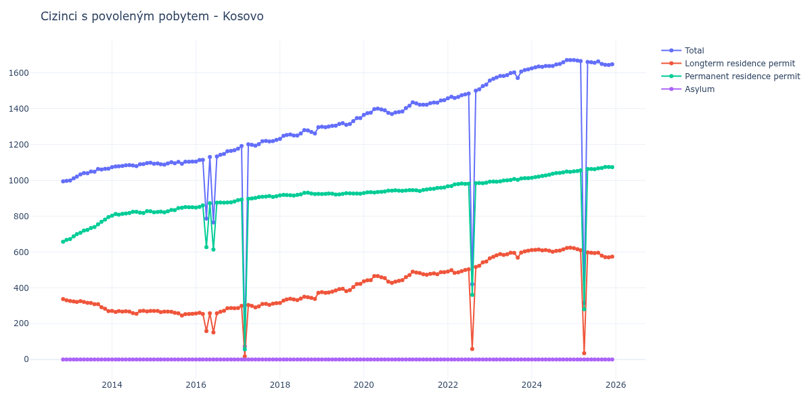

# Kosovo

## Souhrnné statistiky (Min/Max pro rok) / Summary Statistics (Min/Max per year)

| Year   | Total Min/Max   | Longterm Residence Permit Min/Max   | Permanent Residence Permit Min/Max   | Asylum Min/Max   |
|--------|-----------------|-------------------------------------|--------------------------------------|------------------|
| 2012   | 994 / 997       | 330 / 337                           | 657 / 667                            | 0 / 0            |
| 2013   | 999 / 1 065     | 270 / 327                           | 672 / 795                            | 0 / 0            |
| 2014   | 1 073 / 1 098   | 255 / 272                           | 802 / 828                            | 0 / 0            |
| 2015   | 1 088 / 1 105   | 245 / 271                           | 821 / 851                            | 0 / 0            |
| 2016   | 765 / 1 168     | 151 / 287                           | 614 / 882                            | 0 / 0            |
| 2017   | 74 / 1 225      | 17 / 314                            | 57 / 912                             | 0 / 0            |
| 2018   | 1 231 / 1 296   | 315 / 372                           | 915 / 931                            | 0 / 0            |
| 2019   | 1 296 / 1 347   | 372 / 422                           | 920 / 928                            | 0 / 0            |
| 2020   | 1 365 / 1 400   | 428 / 465                           | 929 / 944                            | 0 / 0            |
| 2021   | 1 403 / 1 447   | 460 / 490                           | 940 / 960                            | 0 / 0            |
| 2022   | 420 / 1 534     | 59 / 547                            | 361 / 987                            | 0 / 0            |
| 2023   | 1 557 / 1 619   | 565 / 607                           | 992 / 1 012                          | 0 / 0            |
| 2024   | 1 625 / 1 671   | 601 / 624                           | 1 014 / 1 049                        | 0 / 0            |
| 2025   | 315 / 1 671     | 35 / 621                            | 280 / 1 074                          | 0 / 0            |

## Detailní tabulka / Detailed Data Table

| Date     | Total             | Longterm Residence Permit   | Permanent Residence Permit   | Asylum   |
|----------|-------------------|-----------------------------|------------------------------|----------|
| **2012** |                   |                             |                              |          |
| 11.2012  | 994               | 337                         | 657                          | 0        |
| 12.2012  | 997 (+0.30%)      | 330 (-2.08%)                | 667 (+1.52%)                 | 0        |
| **2013** |                   |                             |                              |          |
| 01.2013  | 999 (+0.20%)      | 327 (-0.91%)                | 672 (+0.75%)                 | 0        |
| 02.2013  | 1 011 (+1.20%)    | 324 (-0.92%)                | 687 (+2.23%)                 | 0        |
| 03.2013  | 1 021 (+0.99%)    | 321 (-0.93%)                | 700 (+1.89%)                 | 0        |
| 04.2013  | 1 033 (+1.18%)    | 326 (+1.56%)                | 707 (+1.00%)                 | 0        |
| 05.2013  | 1 040 (+0.68%)    | 321 (-1.53%)                | 719 (+1.70%)                 | 0        |
| 06.2013  | 1 039 (-0.10%)    | 316 (-1.56%)                | 723 (+0.56%)                 | 0        |
| 07.2013  | 1 049 (+0.96%)    | 315 (-0.32%)                | 734 (+1.52%)                 | 0        |
| 08.2013  | 1 048 (-0.10%)    | 309 (-1.90%)                | 739 (+0.68%)                 | 0        |
| 09.2013  | 1 063 (+1.43%)    | 309 (+0.00%)                | 754 (+2.03%)                 | 0        |
| 10.2013  | 1 060 (-0.28%)    | 292 (-5.50%)                | 768 (+1.86%)                 | 0        |
| 11.2013  | 1 064 (+0.38%)    | 283 (-3.08%)                | 781 (+1.69%)                 | 0        |
| 12.2013  | 1 065 (+0.09%)    | 270 (-4.59%)                | 795 (+1.79%)                 | 0        |
| **2014** |                   |                             |                              |          |
| 01.2014  | 1 073 (+0.75%)    | 271 (+0.37%)                | 802 (+0.88%)                 | 0        |
| 02.2014  | 1 077 (+0.37%)    | 265 (-2.21%)                | 812 (+1.25%)                 | 0        |
| 03.2014  | 1 078 (+0.09%)    | 270 (+1.89%)                | 808 (-0.49%)                 | 0        |
| 04.2014  | 1 080 (+0.19%)    | 267 (-1.11%)                | 813 (+0.62%)                 | 0        |
| 05.2014  | 1 084 (+0.37%)    | 269 (+0.75%)                | 815 (+0.25%)                 | 0        |
| 06.2014  | 1 085 (+0.09%)    | 267 (-0.74%)                | 818 (+0.37%)                 | 0        |
| 07.2014  | 1 083 (-0.18%)    | 259 (-3.00%)                | 824 (+0.73%)                 | 0        |
| 08.2014  | 1 079 (-0.37%)    | 255 (-1.54%)                | 824 (+0.00%)                 | 0        |
| 09.2014  | 1 089 (+0.93%)    | 270 (+5.88%)                | 819 (-0.61%)                 | 0        |
| 10.2014  | 1 090 (+0.09%)    | 272 (+0.74%)                | 818 (-0.12%)                 | 0        |
| 11.2014  | 1 096 (+0.55%)    | 268 (-1.47%)                | 828 (+1.22%)                 | 0        |
| 12.2014  | 1 098 (+0.18%)    | 271 (+1.12%)                | 827 (-0.12%)                 | 0        |
| **2015** |                   |                             |                              |          |
| 01.2015  | 1 092 (-0.55%)    | 271 (+0.00%)                | 821 (-0.73%)                 | 0        |
| 02.2015  | 1 094 (+0.18%)    | 271 (+0.00%)                | 823 (+0.24%)                 | 0        |
| 03.2015  | 1 089 (-0.46%)    | 264 (-2.58%)                | 825 (+0.24%)                 | 0        |
| 04.2015  | 1 088 (-0.09%)    | 267 (+1.14%)                | 821 (-0.48%)                 | 0        |
| 05.2015  | 1 094 (+0.55%)    | 267 (+0.00%)                | 827 (+0.73%)                 | 0        |
| 06.2015  | 1 101 (+0.64%)    | 266 (-0.37%)                | 835 (+0.97%)                 | 0        |
| 07.2015  | 1 095 (-0.54%)    | 261 (-1.88%)                | 834 (-0.12%)                 | 0        |
| 08.2015  | 1 103 (+0.73%)    | 258 (-1.15%)                | 845 (+1.32%)                 | 0        |
| 09.2015  | 1 092 (-1.00%)    | 245 (-5.04%)                | 847 (+0.24%)                 | 0        |
| 10.2015  | 1 104 (+1.10%)    | 253 (+3.27%)                | 851 (+0.47%)                 | 0        |
| 11.2015  | 1 104 (+0.00%)    | 254 (+0.40%)                | 850 (-0.12%)                 | 0        |
| 12.2015  | 1 105 (+0.09%)    | 255 (+0.39%)                | 850 (+0.00%)                 | 0        |
| **2016** |                   |                             |                              |          |
| 01.2016  | 1 105 (+0.00%)    | 257 (+0.78%)                | 848 (-0.24%)                 | 0        |
| 02.2016  | 1 113 (+0.72%)    | 261 (+1.56%)                | 852 (+0.47%)                 | 0        |
| 03.2016  | 1 114 (+0.09%)    | 254 (-2.68%)                | 860 (+0.94%)                 | 0        |
| 04.2016  | 786 (-29.44%)     | 159 (-37.40%)               | 627 (-27.09%)                | 0        |
| 05.2016  | 1 130 (+43.77%)   | 258 (+62.26%)               | 872 (+39.07%)                | 0        |
| 06.2016  | 765 (-32.30%)     | 151 (-41.47%)               | 614 (-29.59%)                | 0        |
| 07.2016  | 1 133 (+48.10%)   | 258 (+70.86%)               | 875 (+42.51%)                | 0        |
| 08.2016  | 1 142 (+0.79%)    | 266 (+3.10%)                | 876 (+0.11%)                 | 0        |
| 09.2016  | 1 147 (+0.44%)    | 272 (+2.26%)                | 875 (-0.11%)                 | 0        |
| 10.2016  | 1 162 (+1.31%)    | 286 (+5.15%)                | 876 (+0.11%)                 | 0        |
| 11.2016  | 1 164 (+0.17%)    | 287 (+0.35%)                | 877 (+0.11%)                 | 0        |
| 12.2016  | 1 168 (+0.34%)    | 286 (-0.35%)                | 882 (+0.57%)                 | 0        |
| **2017** |                   |                             |                              |          |
| 01.2017  | 1 176 (+0.68%)    | 287 (+0.35%)                | 889 (+0.79%)                 | 0        |
| 02.2017  | 1 191 (+1.28%)    | 299 (+4.18%)                | 892 (+0.34%)                 | 0        |
| 03.2017  | 74 (-93.79%)      | 17 (-94.31%)                | 57 (-93.61%)                 | 0        |
| 04.2017  | 1 201 (+1522.97%) | 304 (+1688.24%)             | 897 (+1473.68%)              | 0        |
| 05.2017  | 1 198 (-0.25%)    | 299 (-1.64%)                | 899 (+0.22%)                 | 0        |
| 06.2017  | 1 193 (-0.42%)    | 291 (-2.68%)                | 902 (+0.33%)                 | 0        |
| 07.2017  | 1 202 (+0.75%)    | 296 (+1.72%)                | 906 (+0.44%)                 | 0        |
| 08.2017  | 1 218 (+1.33%)    | 310 (+4.73%)                | 908 (+0.22%)                 | 0        |
| 09.2017  | 1 220 (+0.16%)    | 311 (+0.32%)                | 909 (+0.11%)                 | 0        |
| 10.2017  | 1 217 (-0.25%)    | 305 (-1.93%)                | 912 (+0.33%)                 | 0        |
| 11.2017  | 1 219 (+0.16%)    | 312 (+2.30%)                | 907 (-0.55%)                 | 0        |
| 12.2017  | 1 225 (+0.49%)    | 314 (+0.64%)                | 911 (+0.44%)                 | 0        |
| **2018** |                   |                             |                              |          |
| 01.2018  | 1 231 (+0.49%)    | 315 (+0.32%)                | 916 (+0.55%)                 | 0        |
| 02.2018  | 1 248 (+1.38%)    | 329 (+4.44%)                | 919 (+0.33%)                 | 0        |
| 03.2018  | 1 253 (+0.40%)    | 335 (+1.82%)                | 918 (-0.11%)                 | 0        |
| 04.2018  | 1 256 (+0.24%)    | 339 (+1.19%)                | 917 (-0.11%)                 | 0        |
| 05.2018  | 1 250 (-0.48%)    | 335 (-1.18%)                | 915 (-0.22%)                 | 0        |
| 06.2018  | 1 250 (+0.00%)    | 331 (-1.19%)                | 919 (+0.44%)                 | 0        |
| 07.2018  | 1 261 (+0.88%)    | 340 (+2.72%)                | 921 (+0.22%)                 | 0        |
| 08.2018  | 1 280 (+1.51%)    | 350 (+2.94%)                | 930 (+0.98%)                 | 0        |
| 09.2018  | 1 278 (-0.16%)    | 347 (-0.86%)                | 931 (+0.11%)                 | 0        |
| 10.2018  | 1 270 (-0.63%)    | 344 (-0.86%)                | 926 (-0.54%)                 | 0        |
| 11.2018  | 1 261 (-0.71%)    | 338 (-1.74%)                | 923 (-0.32%)                 | 0        |
| 12.2018  | 1 296 (+2.78%)    | 372 (+10.06%)               | 924 (+0.11%)                 | 0        |
| **2019** |                   |                             |                              |          |
| 01.2019  | 1 299 (+0.23%)    | 376 (+1.08%)                | 923 (-0.11%)                 | 0        |
| 02.2019  | 1 296 (-0.23%)    | 372 (-1.06%)                | 924 (+0.11%)                 | 0        |
| 03.2019  | 1 300 (+0.31%)    | 374 (+0.54%)                | 926 (+0.22%)                 | 0        |
| 04.2019  | 1 304 (+0.31%)    | 379 (+1.34%)                | 925 (-0.11%)                 | 0        |
| 05.2019  | 1 305 (+0.08%)    | 385 (+1.58%)                | 920 (-0.54%)                 | 0        |
| 06.2019  | 1 314 (+0.69%)    | 393 (+2.08%)                | 921 (+0.11%)                 | 0        |
| 07.2019  | 1 319 (+0.38%)    | 395 (+0.51%)                | 924 (+0.33%)                 | 0        |
| 08.2019  | 1 309 (-0.76%)    | 381 (-3.54%)                | 928 (+0.43%)                 | 0        |
| 09.2019  | 1 314 (+0.38%)    | 387 (+1.57%)                | 927 (-0.11%)                 | 0        |
| 10.2019  | 1 330 (+1.22%)    | 404 (+4.39%)                | 926 (-0.11%)                 | 0        |
| 11.2019  | 1 347 (+1.28%)    | 421 (+4.21%)                | 926 (+0.00%)                 | 0        |
| 12.2019  | 1 347 (+0.00%)    | 422 (+0.24%)                | 925 (-0.11%)                 | 0        |
| **2020** |                   |                             |                              |          |
| 01.2020  | 1 365 (+1.34%)    | 436 (+3.32%)                | 929 (+0.43%)                 | 0        |
| 02.2020  | 1 375 (+0.73%)    | 442 (+1.38%)                | 933 (+0.43%)                 | 0        |
| 03.2020  | 1 377 (+0.15%)    | 443 (+0.23%)                | 934 (+0.11%)                 | 0        |
| 04.2020  | 1 397 (+1.45%)    | 465 (+4.97%)                | 932 (-0.21%)                 | 0        |
| 05.2020  | 1 400 (+0.21%)    | 465 (+0.00%)                | 935 (+0.32%)                 | 0        |
| 06.2020  | 1 395 (-0.36%)    | 459 (-1.29%)                | 936 (+0.11%)                 | 0        |
| 07.2020  | 1 391 (-0.29%)    | 454 (-1.09%)                | 937 (+0.11%)                 | 0        |
| 08.2020  | 1 376 (-1.08%)    | 434 (-4.41%)                | 942 (+0.53%)                 | 0        |
| 09.2020  | 1 370 (-0.44%)    | 428 (-1.38%)                | 942 (+0.00%)                 | 0        |
| 10.2020  | 1 378 (+0.58%)    | 434 (+1.40%)                | 944 (+0.21%)                 | 0        |
| 11.2020  | 1 381 (+0.22%)    | 439 (+1.15%)                | 942 (-0.21%)                 | 0        |
| 12.2020  | 1 384 (+0.22%)    | 443 (+0.91%)                | 941 (-0.11%)                 | 0        |
| **2021** |                   |                             |                              |          |
| 01.2021  | 1 403 (+1.37%)    | 460 (+3.84%)                | 943 (+0.21%)                 | 0        |
| 02.2021  | 1 416 (+0.93%)    | 471 (+2.39%)                | 945 (+0.21%)                 | 0        |
| 03.2021  | 1 435 (+1.34%)    | 490 (+4.03%)                | 945 (+0.00%)                 | 0        |
| 04.2021  | 1 429 (-0.42%)    | 485 (-1.02%)                | 944 (-0.11%)                 | 0        |
| 05.2021  | 1 422 (-0.49%)    | 482 (-0.62%)                | 940 (-0.42%)                 | 0        |
| 06.2021  | 1 422 (+0.00%)    | 476 (-1.24%)                | 946 (+0.64%)                 | 0        |
| 07.2021  | 1 422 (+0.00%)    | 473 (-0.63%)                | 949 (+0.32%)                 | 0        |
| 08.2021  | 1 430 (+0.56%)    | 478 (+1.06%)                | 952 (+0.32%)                 | 0        |
| 09.2021  | 1 434 (+0.28%)    | 481 (+0.63%)                | 953 (+0.11%)                 | 0        |
| 10.2021  | 1 433 (-0.07%)    | 476 (-1.04%)                | 957 (+0.42%)                 | 0        |
| 11.2021  | 1 445 (+0.84%)    | 487 (+2.31%)                | 958 (+0.10%)                 | 0        |
| 12.2021  | 1 447 (+0.14%)    | 487 (+0.00%)                | 960 (+0.21%)                 | 0        |
| **2022** |                   |                             |                              |          |
| 01.2022  | 1 458 (+0.76%)    | 491 (+0.82%)                | 967 (+0.73%)                 | 0        |
| 02.2022  | 1 466 (+0.55%)    | 498 (+1.43%)                | 968 (+0.10%)                 | 0        |
| 03.2022  | 1 460 (-0.41%)    | 483 (-3.01%)                | 977 (+0.93%)                 | 0        |
| 04.2022  | 1 465 (+0.34%)    | 486 (+0.62%)                | 979 (+0.20%)                 | 0        |
| 05.2022  | 1 475 (+0.68%)    | 493 (+1.44%)                | 982 (+0.31%)                 | 0        |
| 06.2022  | 1 479 (+0.27%)    | 499 (+1.22%)                | 980 (-0.20%)                 | 0        |
| 07.2022  | 1 484 (+0.34%)    | 503 (+0.80%)                | 981 (+0.10%)                 | 0        |
| 08.2022  | 420 (-71.70%)     | 59 (-88.27%)                | 361 (-63.20%)                | 0        |
| 09.2022  | 1 500 (+257.14%)  | 516 (+774.58%)              | 984 (+172.58%)               | 0        |
| 10.2022  | 1 508 (+0.53%)    | 523 (+1.36%)                | 985 (+0.10%)                 | 0        |
| 11.2022  | 1 526 (+1.19%)    | 542 (+3.63%)                | 984 (-0.10%)                 | 0        |
| 12.2022  | 1 534 (+0.52%)    | 547 (+0.92%)                | 987 (+0.30%)                 | 0        |
| **2023** |                   |                             |                              |          |
| 01.2023  | 1 557 (+1.50%)    | 565 (+3.29%)                | 992 (+0.51%)                 | 0        |
| 02.2023  | 1 566 (+0.58%)    | 573 (+1.42%)                | 993 (+0.10%)                 | 0        |
| 03.2023  | 1 574 (+0.51%)    | 582 (+1.57%)                | 992 (-0.10%)                 | 0        |
| 04.2023  | 1 582 (+0.51%)    | 588 (+1.03%)                | 994 (+0.20%)                 | 0        |
| 05.2023  | 1 582 (+0.00%)    | 583 (-0.85%)                | 999 (+0.50%)                 | 0        |
| 06.2023  | 1 587 (+0.32%)    | 587 (+0.69%)                | 1 000 (+0.10%)               | 0        |
| 07.2023  | 1 598 (+0.69%)    | 596 (+1.53%)                | 1 002 (+0.20%)               | 0        |
| 08.2023  | 1 602 (+0.25%)    | 595 (-0.17%)                | 1 007 (+0.50%)               | 0        |
| 09.2023  | 1 571 (-1.94%)    | 568 (-4.54%)                | 1 003 (-0.40%)               | 0        |
| 10.2023  | 1 607 (+2.29%)    | 597 (+5.11%)                | 1 010 (+0.70%)               | 0        |
| 11.2023  | 1 615 (+0.50%)    | 603 (+1.01%)                | 1 012 (+0.20%)               | 0        |
| 12.2023  | 1 619 (+0.25%)    | 607 (+0.66%)                | 1 012 (+0.00%)               | 0        |
| **2024** |                   |                             |                              |          |
| 01.2024  | 1 625 (+0.37%)    | 611 (+0.66%)                | 1 014 (+0.20%)               | 0        |
| 02.2024  | 1 630 (+0.31%)    | 612 (+0.16%)                | 1 018 (+0.39%)               | 0        |
| 03.2024  | 1 635 (+0.31%)    | 614 (+0.33%)                | 1 021 (+0.29%)               | 0        |
| 04.2024  | 1 633 (-0.12%)    | 609 (-0.81%)                | 1 024 (+0.29%)               | 0        |
| 05.2024  | 1 638 (+0.31%)    | 611 (+0.33%)                | 1 027 (+0.29%)               | 0        |
| 06.2024  | 1 638 (+0.00%)    | 607 (-0.65%)                | 1 031 (+0.39%)               | 0        |
| 07.2024  | 1 638 (+0.00%)    | 601 (-0.99%)                | 1 037 (+0.58%)               | 0        |
| 08.2024  | 1 646 (+0.49%)    | 606 (+0.83%)                | 1 040 (+0.29%)               | 0        |
| 09.2024  | 1 649 (+0.18%)    | 608 (+0.33%)                | 1 041 (+0.10%)               | 0        |
| 10.2024  | 1 659 (+0.61%)    | 615 (+1.15%)                | 1 044 (+0.29%)               | 0        |
| 11.2024  | 1 671 (+0.72%)    | 622 (+1.14%)                | 1 049 (+0.48%)               | 0        |
| 12.2024  | 1 671 (+0.00%)    | 624 (+0.32%)                | 1 047 (-0.19%)               | 0        |
| **2025** |                   |                             |                              |          |
| 01.2025  | 1 671 (+0.00%)    | 621 (-0.48%)                | 1 050 (+0.29%)               | 0        |
| 02.2025  | 1 668 (-0.18%)    | 616 (-0.81%)                | 1 052 (+0.19%)               | 0        |
| 03.2025  | 1 665 (-0.18%)    | 610 (-0.97%)                | 1 055 (+0.29%)               | 0        |
| 04.2025  | 315 (-81.08%)     | 35 (-94.26%)                | 280 (-73.46%)                | 0        |
| 05.2025  | 1 661 (+427.30%)  | 598 (+1608.57%)             | 1 063 (+279.64%)             | 0        |
| 06.2025  | 1 659 (-0.12%)    | 596 (-0.33%)                | 1 063 (+0.00%)               | 0        |
| 07.2025  | 1 656 (-0.18%)    | 594 (-0.34%)                | 1 062 (-0.09%)               | 0        |
| 08.2025  | 1 663 (+0.42%)    | 596 (+0.34%)                | 1 067 (+0.47%)               | 0        |
| 09.2025  | 1 649 (-0.84%)    | 580 (-2.68%)                | 1 069 (+0.19%)               | 0        |
| 10.2025  | 1 645 (-0.24%)    | 571 (-1.55%)                | 1 074 (+0.47%)               | 0        |
| 11.2025  | 1 644 (-0.06%)    | 570 (-0.18%)                | 1 074 (+0.00%)               | 0        |
| 12.2025  | 1 647 (+0.18%)    | 574 (+0.70%)                | 1 073 (-0.09%)               | 0        |
