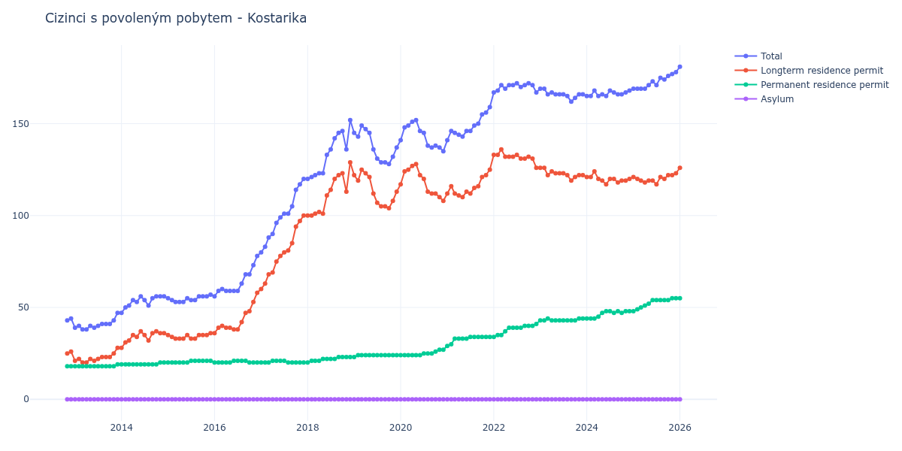

# Kostarika

## Souhrnné statistiky (Min/Max pro rok) / Summary Statistics (Min/Max per year)

| Year   | Total     | Longterm Residence Permit   | Permanent Residence Permit   | Asylum   |
|--------|-----------|-----------------------------|------------------------------|----------|
| 2012   | 43 / 44   | 25 / 26                     | 18 / 18                      | 0 / 0    |
| 2013   | 38 / 47   | 20 / 28                     | 18 / 19                      | 0 / 0    |
| 2014   | 47 / 56   | 28 / 37                     | 19 / 20                      | 0 / 0    |
| 2015   | 53 / 57   | 33 / 36                     | 20 / 21                      | 0 / 0    |
| 2016   | 56 / 78   | 36 / 58                     | 20 / 21                      | 0 / 0    |
| 2017   | 80 / 120  | 60 / 100                    | 20 / 21                      | 0 / 0    |
| 2018   | 120 / 152 | 100 / 129                   | 20 / 23                      | 0 / 0    |
| 2019   | 128 / 149 | 104 / 125                   | 23 / 24                      | 0 / 0    |
| 2020   | 135 / 152 | 108 / 128                   | 24 / 27                      | 0 / 0    |
| 2021   | 141 / 159 | 110 / 125                   | 29 / 34                      | 0 / 0    |
| 2022   | 167 / 172 | 126 / 136                   | 34 / 41                      | 0 / 0    |
| 2023   | 162 / 169 | 119 / 126                   | 43 / 44                      | 0 / 0    |
| 2024   | 165 / 168 | 117 / 124                   | 44 / 48                      | 0 / 0    |
| 2025   | 169 / 178 | 117 / 123                   | 48 / 55                      | 0 / 0    |
| 2026   | 181 / 181 | 126 / 126                   | 55 / 55                      | 0 / 0    |

## Detailní tabulka / Detailed Data Table

| Date     | Total         | Longterm Residence Permit   | Permanent Residence Permit   | Asylum   |
|----------|---------------|-----------------------------|------------------------------|----------|
| **2012** |               |                             |                              |          |
| 11.2012  | 43            | 25                          | 18                           | 0        |
| 12.2012  | 44 (+2.33%)   | 26 (+4.00%)                 | 18 (+0.00%)                  | 0        |
| **2013** |               |                             |                              |          |
| 01.2013  | 39 (-11.36%)  | 21 (-19.23%)                | 18 (+0.00%)                  | 0        |
| 02.2013  | 40 (+2.56%)   | 22 (+4.76%)                 | 18 (+0.00%)                  | 0        |
| 03.2013  | 38 (-5.00%)   | 20 (-9.09%)                 | 18 (+0.00%)                  | 0        |
| 04.2013  | 38 (+0.00%)   | 20 (+0.00%)                 | 18 (+0.00%)                  | 0        |
| 05.2013  | 40 (+5.26%)   | 22 (+10.00%)                | 18 (+0.00%)                  | 0        |
| 06.2013  | 39 (-2.50%)   | 21 (-4.55%)                 | 18 (+0.00%)                  | 0        |
| 07.2013  | 40 (+2.56%)   | 22 (+4.76%)                 | 18 (+0.00%)                  | 0        |
| 08.2013  | 41 (+2.50%)   | 23 (+4.55%)                 | 18 (+0.00%)                  | 0        |
| 09.2013  | 41 (+0.00%)   | 23 (+0.00%)                 | 18 (+0.00%)                  | 0        |
| 10.2013  | 41 (+0.00%)   | 23 (+0.00%)                 | 18 (+0.00%)                  | 0        |
| 11.2013  | 43 (+4.88%)   | 25 (+8.70%)                 | 18 (+0.00%)                  | 0        |
| 12.2013  | 47 (+9.30%)   | 28 (+12.00%)                | 19 (+5.56%)                  | 0        |
| **2014** |               |                             |                              |          |
| 01.2014  | 47 (+0.00%)   | 28 (+0.00%)                 | 19 (+0.00%)                  | 0        |
| 02.2014  | 50 (+6.38%)   | 31 (+10.71%)                | 19 (+0.00%)                  | 0        |
| 03.2014  | 51 (+2.00%)   | 32 (+3.23%)                 | 19 (+0.00%)                  | 0        |
| 04.2014  | 54 (+5.88%)   | 35 (+9.38%)                 | 19 (+0.00%)                  | 0        |
| 05.2014  | 53 (-1.85%)   | 34 (-2.86%)                 | 19 (+0.00%)                  | 0        |
| 06.2014  | 56 (+5.66%)   | 37 (+8.82%)                 | 19 (+0.00%)                  | 0        |
| 07.2014  | 54 (-3.57%)   | 35 (-5.41%)                 | 19 (+0.00%)                  | 0        |
| 08.2014  | 51 (-5.56%)   | 32 (-8.57%)                 | 19 (+0.00%)                  | 0        |
| 09.2014  | 55 (+7.84%)   | 36 (+12.50%)                | 19 (+0.00%)                  | 0        |
| 10.2014  | 56 (+1.82%)   | 37 (+2.78%)                 | 19 (+0.00%)                  | 0        |
| 11.2014  | 56 (+0.00%)   | 36 (-2.70%)                 | 20 (+5.26%)                  | 0        |
| 12.2014  | 56 (+0.00%)   | 36 (+0.00%)                 | 20 (+0.00%)                  | 0        |
| **2015** |               |                             |                              |          |
| 01.2015  | 55 (-1.79%)   | 35 (-2.78%)                 | 20 (+0.00%)                  | 0        |
| 02.2015  | 54 (-1.82%)   | 34 (-2.86%)                 | 20 (+0.00%)                  | 0        |
| 03.2015  | 53 (-1.85%)   | 33 (-2.94%)                 | 20 (+0.00%)                  | 0        |
| 04.2015  | 53 (+0.00%)   | 33 (+0.00%)                 | 20 (+0.00%)                  | 0        |
| 05.2015  | 53 (+0.00%)   | 33 (+0.00%)                 | 20 (+0.00%)                  | 0        |
| 06.2015  | 55 (+3.77%)   | 35 (+6.06%)                 | 20 (+0.00%)                  | 0        |
| 07.2015  | 54 (-1.82%)   | 33 (-5.71%)                 | 21 (+5.00%)                  | 0        |
| 08.2015  | 54 (+0.00%)   | 33 (+0.00%)                 | 21 (+0.00%)                  | 0        |
| 09.2015  | 56 (+3.70%)   | 35 (+6.06%)                 | 21 (+0.00%)                  | 0        |
| 10.2015  | 56 (+0.00%)   | 35 (+0.00%)                 | 21 (+0.00%)                  | 0        |
| 11.2015  | 56 (+0.00%)   | 35 (+0.00%)                 | 21 (+0.00%)                  | 0        |
| 12.2015  | 57 (+1.79%)   | 36 (+2.86%)                 | 21 (+0.00%)                  | 0        |
| **2016** |               |                             |                              |          |
| 01.2016  | 56 (-1.75%)   | 36 (+0.00%)                 | 20 (-4.76%)                  | 0        |
| 02.2016  | 59 (+5.36%)   | 39 (+8.33%)                 | 20 (+0.00%)                  | 0        |
| 03.2016  | 60 (+1.69%)   | 40 (+2.56%)                 | 20 (+0.00%)                  | 0        |
| 04.2016  | 59 (-1.67%)   | 39 (-2.50%)                 | 20 (+0.00%)                  | 0        |
| 05.2016  | 59 (+0.00%)   | 39 (+0.00%)                 | 20 (+0.00%)                  | 0        |
| 06.2016  | 59 (+0.00%)   | 38 (-2.56%)                 | 21 (+5.00%)                  | 0        |
| 07.2016  | 59 (+0.00%)   | 38 (+0.00%)                 | 21 (+0.00%)                  | 0        |
| 08.2016  | 63 (+6.78%)   | 42 (+10.53%)                | 21 (+0.00%)                  | 0        |
| 09.2016  | 68 (+7.94%)   | 47 (+11.90%)                | 21 (+0.00%)                  | 0        |
| 10.2016  | 68 (+0.00%)   | 48 (+2.13%)                 | 20 (-4.76%)                  | 0        |
| 11.2016  | 73 (+7.35%)   | 53 (+10.42%)                | 20 (+0.00%)                  | 0        |
| 12.2016  | 78 (+6.85%)   | 58 (+9.43%)                 | 20 (+0.00%)                  | 0        |
| **2017** |               |                             |                              |          |
| 01.2017  | 80 (+2.56%)   | 60 (+3.45%)                 | 20 (+0.00%)                  | 0        |
| 02.2017  | 83 (+3.75%)   | 63 (+5.00%)                 | 20 (+0.00%)                  | 0        |
| 03.2017  | 88 (+6.02%)   | 68 (+7.94%)                 | 20 (+0.00%)                  | 0        |
| 04.2017  | 90 (+2.27%)   | 69 (+1.47%)                 | 21 (+5.00%)                  | 0        |
| 05.2017  | 96 (+6.67%)   | 75 (+8.70%)                 | 21 (+0.00%)                  | 0        |
| 06.2017  | 99 (+3.12%)   | 78 (+4.00%)                 | 21 (+0.00%)                  | 0        |
| 07.2017  | 101 (+2.02%)  | 80 (+2.56%)                 | 21 (+0.00%)                  | 0        |
| 08.2017  | 101 (+0.00%)  | 81 (+1.25%)                 | 20 (-4.76%)                  | 0        |
| 09.2017  | 105 (+3.96%)  | 85 (+4.94%)                 | 20 (+0.00%)                  | 0        |
| 10.2017  | 114 (+8.57%)  | 94 (+10.59%)                | 20 (+0.00%)                  | 0        |
| 11.2017  | 117 (+2.63%)  | 97 (+3.19%)                 | 20 (+0.00%)                  | 0        |
| 12.2017  | 120 (+2.56%)  | 100 (+3.09%)                | 20 (+0.00%)                  | 0        |
| **2018** |               |                             |                              |          |
| 01.2018  | 120 (+0.00%)  | 100 (+0.00%)                | 20 (+0.00%)                  | 0        |
| 02.2018  | 121 (+0.83%)  | 100 (+0.00%)                | 21 (+5.00%)                  | 0        |
| 03.2018  | 122 (+0.83%)  | 101 (+1.00%)                | 21 (+0.00%)                  | 0        |
| 04.2018  | 123 (+0.82%)  | 102 (+0.99%)                | 21 (+0.00%)                  | 0        |
| 05.2018  | 123 (+0.00%)  | 101 (-0.98%)                | 22 (+4.76%)                  | 0        |
| 06.2018  | 133 (+8.13%)  | 111 (+9.90%)                | 22 (+0.00%)                  | 0        |
| 07.2018  | 136 (+2.26%)  | 114 (+2.70%)                | 22 (+0.00%)                  | 0        |
| 08.2018  | 142 (+4.41%)  | 120 (+5.26%)                | 22 (+0.00%)                  | 0        |
| 09.2018  | 145 (+2.11%)  | 122 (+1.67%)                | 23 (+4.55%)                  | 0        |
| 10.2018  | 146 (+0.69%)  | 123 (+0.82%)                | 23 (+0.00%)                  | 0        |
| 11.2018  | 136 (-6.85%)  | 113 (-8.13%)                | 23 (+0.00%)                  | 0        |
| 12.2018  | 152 (+11.76%) | 129 (+14.16%)               | 23 (+0.00%)                  | 0        |
| **2019** |               |                             |                              |          |
| 01.2019  | 145 (-4.61%)  | 122 (-5.43%)                | 23 (+0.00%)                  | 0        |
| 02.2019  | 143 (-1.38%)  | 119 (-2.46%)                | 24 (+4.35%)                  | 0        |
| 03.2019  | 149 (+4.20%)  | 125 (+5.04%)                | 24 (+0.00%)                  | 0        |
| 04.2019  | 147 (-1.34%)  | 123 (-1.60%)                | 24 (+0.00%)                  | 0        |
| 05.2019  | 145 (-1.36%)  | 121 (-1.63%)                | 24 (+0.00%)                  | 0        |
| 06.2019  | 136 (-6.21%)  | 112 (-7.44%)                | 24 (+0.00%)                  | 0        |
| 07.2019  | 131 (-3.68%)  | 107 (-4.46%)                | 24 (+0.00%)                  | 0        |
| 08.2019  | 129 (-1.53%)  | 105 (-1.87%)                | 24 (+0.00%)                  | 0        |
| 09.2019  | 129 (+0.00%)  | 105 (+0.00%)                | 24 (+0.00%)                  | 0        |
| 10.2019  | 128 (-0.78%)  | 104 (-0.95%)                | 24 (+0.00%)                  | 0        |
| 11.2019  | 132 (+3.12%)  | 108 (+3.85%)                | 24 (+0.00%)                  | 0        |
| 12.2019  | 137 (+3.79%)  | 113 (+4.63%)                | 24 (+0.00%)                  | 0        |
| **2020** |               |                             |                              |          |
| 01.2020  | 141 (+2.92%)  | 117 (+3.54%)                | 24 (+0.00%)                  | 0        |
| 02.2020  | 148 (+4.96%)  | 124 (+5.98%)                | 24 (+0.00%)                  | 0        |
| 03.2020  | 149 (+0.68%)  | 125 (+0.81%)                | 24 (+0.00%)                  | 0        |
| 04.2020  | 151 (+1.34%)  | 127 (+1.60%)                | 24 (+0.00%)                  | 0        |
| 05.2020  | 152 (+0.66%)  | 128 (+0.79%)                | 24 (+0.00%)                  | 0        |
| 06.2020  | 146 (-3.95%)  | 122 (-4.69%)                | 24 (+0.00%)                  | 0        |
| 07.2020  | 145 (-0.68%)  | 120 (-1.64%)                | 25 (+4.17%)                  | 0        |
| 08.2020  | 138 (-4.83%)  | 113 (-5.83%)                | 25 (+0.00%)                  | 0        |
| 09.2020  | 137 (-0.72%)  | 112 (-0.88%)                | 25 (+0.00%)                  | 0        |
| 10.2020  | 138 (+0.73%)  | 112 (+0.00%)                | 26 (+4.00%)                  | 0        |
| 11.2020  | 137 (-0.72%)  | 110 (-1.79%)                | 27 (+3.85%)                  | 0        |
| 12.2020  | 135 (-1.46%)  | 108 (-1.82%)                | 27 (+0.00%)                  | 0        |
| **2021** |               |                             |                              |          |
| 01.2021  | 141 (+4.44%)  | 112 (+3.70%)                | 29 (+7.41%)                  | 0        |
| 02.2021  | 146 (+3.55%)  | 116 (+3.57%)                | 30 (+3.45%)                  | 0        |
| 03.2021  | 145 (-0.68%)  | 112 (-3.45%)                | 33 (+10.00%)                 | 0        |
| 04.2021  | 144 (-0.69%)  | 111 (-0.89%)                | 33 (+0.00%)                  | 0        |
| 05.2021  | 143 (-0.69%)  | 110 (-0.90%)                | 33 (+0.00%)                  | 0        |
| 06.2021  | 146 (+2.10%)  | 113 (+2.73%)                | 33 (+0.00%)                  | 0        |
| 07.2021  | 146 (+0.00%)  | 112 (-0.88%)                | 34 (+3.03%)                  | 0        |
| 08.2021  | 149 (+2.05%)  | 115 (+2.68%)                | 34 (+0.00%)                  | 0        |
| 09.2021  | 150 (+0.67%)  | 116 (+0.87%)                | 34 (+0.00%)                  | 0        |
| 10.2021  | 155 (+3.33%)  | 121 (+4.31%)                | 34 (+0.00%)                  | 0        |
| 11.2021  | 156 (+0.65%)  | 122 (+0.83%)                | 34 (+0.00%)                  | 0        |
| 12.2021  | 159 (+1.92%)  | 125 (+2.46%)                | 34 (+0.00%)                  | 0        |
| **2022** |               |                             |                              |          |
| 01.2022  | 167 (+5.03%)  | 133 (+6.40%)                | 34 (+0.00%)                  | 0        |
| 02.2022  | 168 (+0.60%)  | 133 (+0.00%)                | 35 (+2.94%)                  | 0        |
| 03.2022  | 171 (+1.79%)  | 136 (+2.26%)                | 35 (+0.00%)                  | 0        |
| 04.2022  | 169 (-1.17%)  | 132 (-2.94%)                | 37 (+5.71%)                  | 0        |
| 05.2022  | 171 (+1.18%)  | 132 (+0.00%)                | 39 (+5.41%)                  | 0        |
| 06.2022  | 171 (+0.00%)  | 132 (+0.00%)                | 39 (+0.00%)                  | 0        |
| 07.2022  | 172 (+0.58%)  | 133 (+0.76%)                | 39 (+0.00%)                  | 0        |
| 08.2022  | 170 (-1.16%)  | 131 (-1.50%)                | 39 (+0.00%)                  | 0        |
| 09.2022  | 171 (+0.59%)  | 131 (+0.00%)                | 40 (+2.56%)                  | 0        |
| 10.2022  | 172 (+0.58%)  | 132 (+0.76%)                | 40 (+0.00%)                  | 0        |
| 11.2022  | 171 (-0.58%)  | 131 (-0.76%)                | 40 (+0.00%)                  | 0        |
| 12.2022  | 167 (-2.34%)  | 126 (-3.82%)                | 41 (+2.50%)                  | 0        |
| **2023** |               |                             |                              |          |
| 01.2023  | 169 (+1.20%)  | 126 (+0.00%)                | 43 (+4.88%)                  | 0        |
| 02.2023  | 169 (+0.00%)  | 126 (+0.00%)                | 43 (+0.00%)                  | 0        |
| 03.2023  | 166 (-1.78%)  | 122 (-3.17%)                | 44 (+2.33%)                  | 0        |
| 04.2023  | 167 (+0.60%)  | 124 (+1.64%)                | 43 (-2.27%)                  | 0        |
| 05.2023  | 166 (-0.60%)  | 123 (-0.81%)                | 43 (+0.00%)                  | 0        |
| 06.2023  | 166 (+0.00%)  | 123 (+0.00%)                | 43 (+0.00%)                  | 0        |
| 07.2023  | 166 (+0.00%)  | 123 (+0.00%)                | 43 (+0.00%)                  | 0        |
| 08.2023  | 165 (-0.60%)  | 122 (-0.81%)                | 43 (+0.00%)                  | 0        |
| 09.2023  | 162 (-1.82%)  | 119 (-2.46%)                | 43 (+0.00%)                  | 0        |
| 10.2023  | 164 (+1.23%)  | 121 (+1.68%)                | 43 (+0.00%)                  | 0        |
| 11.2023  | 166 (+1.22%)  | 122 (+0.83%)                | 44 (+2.33%)                  | 0        |
| 12.2023  | 166 (+0.00%)  | 122 (+0.00%)                | 44 (+0.00%)                  | 0        |
| **2024** |               |                             |                              |          |
| 01.2024  | 165 (-0.60%)  | 121 (-0.82%)                | 44 (+0.00%)                  | 0        |
| 02.2024  | 165 (+0.00%)  | 121 (+0.00%)                | 44 (+0.00%)                  | 0        |
| 03.2024  | 168 (+1.82%)  | 124 (+2.48%)                | 44 (+0.00%)                  | 0        |
| 04.2024  | 165 (-1.79%)  | 120 (-3.23%)                | 45 (+2.27%)                  | 0        |
| 05.2024  | 166 (+0.61%)  | 119 (-0.83%)                | 47 (+4.44%)                  | 0        |
| 06.2024  | 165 (-0.60%)  | 117 (-1.68%)                | 48 (+2.13%)                  | 0        |
| 07.2024  | 168 (+1.82%)  | 120 (+2.56%)                | 48 (+0.00%)                  | 0        |
| 08.2024  | 167 (-0.60%)  | 120 (+0.00%)                | 47 (-2.08%)                  | 0        |
| 09.2024  | 166 (-0.60%)  | 118 (-1.67%)                | 48 (+2.13%)                  | 0        |
| 10.2024  | 166 (+0.00%)  | 119 (+0.85%)                | 47 (-2.08%)                  | 0        |
| 11.2024  | 167 (+0.60%)  | 119 (+0.00%)                | 48 (+2.13%)                  | 0        |
| 12.2024  | 168 (+0.60%)  | 120 (+0.84%)                | 48 (+0.00%)                  | 0        |
| **2025** |               |                             |                              |          |
| 01.2025  | 169 (+0.60%)  | 121 (+0.83%)                | 48 (+0.00%)                  | 0        |
| 02.2025  | 169 (+0.00%)  | 120 (-0.83%)                | 49 (+2.08%)                  | 0        |
| 03.2025  | 169 (+0.00%)  | 119 (-0.83%)                | 50 (+2.04%)                  | 0        |
| 04.2025  | 169 (+0.00%)  | 118 (-0.84%)                | 51 (+2.00%)                  | 0        |
| 05.2025  | 171 (+1.18%)  | 119 (+0.85%)                | 52 (+1.96%)                  | 0        |
| 06.2025  | 173 (+1.17%)  | 119 (+0.00%)                | 54 (+3.85%)                  | 0        |
| 07.2025  | 171 (-1.16%)  | 117 (-1.68%)                | 54 (+0.00%)                  | 0        |
| 08.2025  | 175 (+2.34%)  | 121 (+3.42%)                | 54 (+0.00%)                  | 0        |
| 09.2025  | 174 (-0.57%)  | 120 (-0.83%)                | 54 (+0.00%)                  | 0        |
| 10.2025  | 176 (+1.15%)  | 122 (+1.67%)                | 54 (+0.00%)                  | 0        |
| 11.2025  | 177 (+0.57%)  | 122 (+0.00%)                | 55 (+1.85%)                  | 0        |
| 12.2025  | 178 (+0.56%)  | 123 (+0.82%)                | 55 (+0.00%)                  | 0        |
| **2026** |               |                             |                              |          |
| 01.2026  | 181 (+1.69%)  | 126 (+2.44%)                | 55 (+0.00%)                  | 0        |
