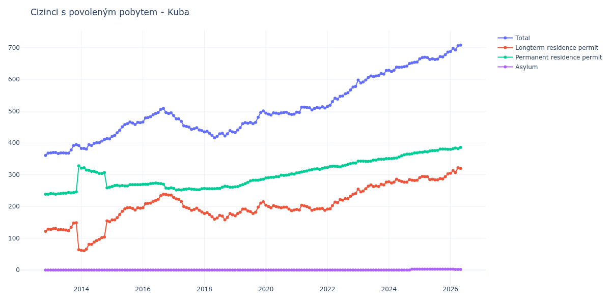

# Kuba

## Souhrnné statistiky (Min/Max pro rok) / Summary Statistics (Min/Max per year)

| Year   | Total     | Longterm Residence Permit   | Permanent Residence Permit   | Asylum   |
|--------|-----------|-----------------------------|------------------------------|----------|
| 2012   | 361 / 368 | 122 / 129                   | 239 / 239                    | 0 / 0    |
| 2013   | 367 / 395 | 64 / 149                    | 239 / 328                    | 0 / 0    |
| 2014   | 381 / 414 | 61 / 155                    | 259 / 322                    | 0 / 0    |
| 2015   | 421 / 466 | 158 / 197                   | 263 / 269                    | 0 / 0    |
| 2016   | 466 / 509 | 196 / 239                   | 257 / 274                    | 0 / 0    |
| 2017   | 439 / 486 | 183 / 229                   | 252 / 257                    | 0 / 0    |
| 2018   | 416 / 439 | 158 / 181                   | 256 / 264                    | 0 / 0    |
| 2019   | 433 / 501 | 171 / 215                   | 262 / 286                    | 0 / 0    |
| 2020   | 488 / 497 | 187 / 204                   | 290 / 303                    | 0 / 0    |
| 2021   | 496 / 514 | 188 / 204                   | 306 / 322                    | 0 / 0    |
| 2022   | 515 / 578 | 192 / 241                   | 323 / 337                    | 0 / 0    |
| 2023   | 589 / 628 | 246 / 277                   | 342 / 351                    | 0 / 0    |
| 2024   | 625 / 655 | 274 / 286                   | 351 / 369                    | 0 / 3    |
| 2025   | 663 / 686 | 284 / 303                   | 371 / 381                    | 3 / 3    |

## Detailní tabulka / Detailed Data Table

| Date     | Total        | Longterm Residence Permit   | Permanent Residence Permit   | Asylum     |
|----------|--------------|-----------------------------|------------------------------|------------|
| **2012** |              |                             |                              |            |
| 11.2012  | 361          | 122                         | 239                          | 0          |
| 12.2012  | 368 (+1.94%) | 129 (+5.74%)                | 239 (+0.00%)                 | 0          |
| **2013** |              |                             |                              |            |
| 01.2013  | 369 (+0.27%) | 128 (-0.78%)                | 241 (+0.84%)                 | 0          |
| 02.2013  | 370 (+0.27%) | 130 (+1.56%)                | 240 (-0.41%)                 | 0          |
| 03.2013  | 370 (+0.00%) | 131 (+0.77%)                | 239 (-0.42%)                 | 0          |
| 04.2013  | 367 (-0.81%) | 127 (-3.05%)                | 240 (+0.42%)                 | 0          |
| 05.2013  | 369 (+0.54%) | 128 (+0.79%)                | 241 (+0.42%)                 | 0          |
| 06.2013  | 369 (+0.00%) | 127 (-0.78%)                | 242 (+0.41%)                 | 0          |
| 07.2013  | 368 (-0.27%) | 126 (-0.79%)                | 242 (+0.00%)                 | 0          |
| 08.2013  | 368 (+0.00%) | 124 (-1.59%)                | 244 (+0.83%)                 | 0          |
| 09.2013  | 378 (+2.72%) | 135 (+8.87%)                | 243 (-0.41%)                 | 0          |
| 10.2013  | 392 (+3.70%) | 148 (+9.63%)                | 244 (+0.41%)                 | 0          |
| 11.2013  | 395 (+0.77%) | 149 (+0.68%)                | 246 (+0.82%)                 | 0          |
| 12.2013  | 392 (-0.76%) | 64 (-57.05%)                | 328 (+33.33%)                | 0          |
| **2014** |              |                             |                              |            |
| 01.2014  | 383 (-2.30%) | 62 (-3.12%)                 | 321 (-2.13%)                 | 0          |
| 02.2014  | 383 (+0.00%) | 61 (-1.61%)                 | 322 (+0.31%)                 | 0          |
| 03.2014  | 381 (-0.52%) | 66 (+8.20%)                 | 315 (-2.17%)                 | 0          |
| 04.2014  | 395 (+3.67%) | 81 (+22.73%)                | 314 (-0.32%)                 | 0          |
| 05.2014  | 392 (-0.76%) | 81 (+0.00%)                 | 311 (-0.96%)                 | 0          |
| 06.2014  | 399 (+1.79%) | 88 (+8.64%)                 | 311 (+0.00%)                 | 0          |
| 07.2014  | 401 (+0.50%) | 93 (+5.68%)                 | 308 (-0.96%)                 | 0          |
| 08.2014  | 401 (+0.00%) | 97 (+4.30%)                 | 304 (-1.30%)                 | 0          |
| 09.2014  | 406 (+1.25%) | 102 (+5.15%)                | 304 (+0.00%)                 | 0          |
| 10.2014  | 411 (+1.23%) | 104 (+1.96%)                | 307 (+0.99%)                 | 0          |
| 11.2014  | 414 (+0.73%) | 155 (+49.04%)               | 259 (-15.64%)                | 0          |
| 12.2014  | 413 (-0.24%) | 152 (-1.94%)                | 261 (+0.77%)                 | 0          |
| **2015** |              |                             |                              |            |
| 01.2015  | 421 (+1.94%) | 158 (+3.95%)                | 263 (+0.77%)                 | 0          |
| 02.2015  | 424 (+0.71%) | 158 (+0.00%)                | 266 (+1.14%)                 | 0          |
| 03.2015  | 432 (+1.89%) | 165 (+4.43%)                | 267 (+0.38%)                 | 0          |
| 04.2015  | 440 (+1.85%) | 175 (+6.06%)                | 265 (-0.75%)                 | 0          |
| 05.2015  | 451 (+2.50%) | 185 (+5.71%)                | 266 (+0.38%)                 | 0          |
| 06.2015  | 458 (+1.55%) | 193 (+4.32%)                | 265 (-0.38%)                 | 0          |
| 07.2015  | 461 (+0.66%) | 196 (+1.55%)                | 265 (+0.00%)                 | 0          |
| 08.2015  | 466 (+1.08%) | 197 (+0.51%)                | 269 (+1.51%)                 | 0          |
| 09.2015  | 463 (-0.64%) | 194 (-1.52%)                | 269 (+0.00%)                 | 0          |
| 10.2015  | 458 (-1.08%) | 189 (-2.58%)                | 269 (+0.00%)                 | 0          |
| 11.2015  | 465 (+1.53%) | 196 (+3.70%)                | 269 (+0.00%)                 | 0          |
| 12.2015  | 464 (-0.22%) | 195 (-0.51%)                | 269 (+0.00%)                 | 0          |
| **2016** |              |                             |                              |            |
| 01.2016  | 466 (+0.43%) | 196 (+0.51%)                | 270 (+0.37%)                 | 0          |
| 02.2016  | 479 (+2.79%) | 209 (+6.63%)                | 270 (+0.00%)                 | 0          |
| 03.2016  | 480 (+0.21%) | 210 (+0.48%)                | 270 (+0.00%)                 | 0          |
| 04.2016  | 483 (+0.63%) | 211 (+0.48%)                | 272 (+0.74%)                 | 0          |
| 05.2016  | 489 (+1.24%) | 216 (+2.37%)                | 273 (+0.37%)                 | 0          |
| 06.2016  | 493 (+0.82%) | 219 (+1.39%)                | 274 (+0.37%)                 | 0          |
| 07.2016  | 496 (+0.61%) | 223 (+1.83%)                | 273 (-0.36%)                 | 0          |
| 08.2016  | 506 (+2.02%) | 234 (+4.93%)                | 272 (-0.37%)                 | 0          |
| 09.2016  | 509 (+0.59%) | 239 (+2.14%)                | 270 (-0.74%)                 | 0          |
| 10.2016  | 496 (-2.55%) | 238 (-0.42%)                | 258 (-4.44%)                 | 0          |
| 11.2016  | 493 (-0.60%) | 236 (-0.84%)                | 257 (-0.39%)                 | 0          |
| 12.2016  | 495 (+0.41%) | 236 (+0.00%)                | 259 (+0.78%)                 | 0          |
| **2017** |              |                             |                              |            |
| 01.2017  | 486 (-1.82%) | 229 (-2.97%)                | 257 (-0.77%)                 | 0          |
| 02.2017  | 476 (-2.06%) | 224 (-2.18%)                | 252 (-1.95%)                 | 0          |
| 03.2017  | 476 (+0.00%) | 223 (-0.45%)                | 253 (+0.40%)                 | 0          |
| 04.2017  | 468 (-1.68%) | 216 (-3.14%)                | 252 (-0.40%)                 | 0          |
| 05.2017  | 454 (-2.99%) | 200 (-7.41%)                | 254 (+0.79%)                 | 0          |
| 06.2017  | 452 (-0.44%) | 197 (-1.50%)                | 255 (+0.39%)                 | 0          |
| 07.2017  | 450 (-0.44%) | 194 (-1.52%)                | 256 (+0.39%)                 | 0          |
| 08.2017  | 443 (-1.56%) | 188 (-3.09%)                | 255 (-0.39%)                 | 0          |
| 09.2017  | 445 (+0.45%) | 191 (+1.60%)                | 254 (-0.39%)                 | 0          |
| 10.2017  | 448 (+0.67%) | 195 (+2.09%)                | 253 (-0.39%)                 | 0          |
| 11.2017  | 441 (-1.56%) | 188 (-3.59%)                | 253 (+0.00%)                 | 0          |
| 12.2017  | 439 (-0.45%) | 183 (-2.66%)                | 256 (+1.19%)                 | 0          |
| **2018** |              |                             |                              |            |
| 01.2018  | 435 (-0.91%) | 178 (-2.73%)                | 257 (+0.39%)                 | 0          |
| 02.2018  | 437 (+0.46%) | 181 (+1.69%)                | 256 (-0.39%)                 | 0          |
| 03.2018  | 431 (-1.37%) | 175 (-3.31%)                | 256 (+0.00%)                 | 0          |
| 04.2018  | 424 (-1.62%) | 168 (-4.00%)                | 256 (+0.00%)                 | 0          |
| 05.2018  | 416 (-1.89%) | 160 (-4.76%)                | 256 (+0.00%)                 | 0          |
| 06.2018  | 421 (+1.20%) | 164 (+2.50%)                | 257 (+0.39%)                 | 0          |
| 07.2018  | 429 (+1.90%) | 172 (+4.88%)                | 257 (+0.00%)                 | 0          |
| 08.2018  | 431 (+0.47%) | 170 (-1.16%)                | 261 (+1.56%)                 | 0          |
| 09.2018  | 422 (-2.09%) | 158 (-7.06%)                | 264 (+1.15%)                 | 0          |
| 10.2018  | 429 (+1.66%) | 166 (+5.06%)                | 263 (-0.38%)                 | 0          |
| 11.2018  | 439 (+2.33%) | 178 (+7.23%)                | 261 (-0.76%)                 | 0          |
| 12.2018  | 435 (-0.91%) | 174 (-2.25%)                | 261 (+0.00%)                 | 0          |
| **2019** |              |                             |                              |            |
| 01.2019  | 433 (-0.46%) | 171 (-1.72%)                | 262 (+0.38%)                 | 0          |
| 02.2019  | 441 (+1.85%) | 178 (+4.09%)                | 263 (+0.38%)                 | 0          |
| 03.2019  | 448 (+1.59%) | 182 (+2.25%)                | 266 (+1.14%)                 | 0          |
| 04.2019  | 461 (+2.90%) | 192 (+5.49%)                | 269 (+1.13%)                 | 0          |
| 05.2019  | 464 (+0.65%) | 192 (+0.00%)                | 272 (+1.12%)                 | 0          |
| 06.2019  | 462 (-0.43%) | 186 (-3.12%)                | 276 (+1.47%)                 | 0          |
| 07.2019  | 465 (+0.65%) | 184 (-1.08%)                | 281 (+1.81%)                 | 0          |
| 08.2019  | 461 (-0.86%) | 178 (-3.26%)                | 283 (+0.71%)                 | 0          |
| 09.2019  | 465 (+0.87%) | 182 (+2.25%)                | 283 (+0.00%)                 | 0          |
| 10.2019  | 481 (+3.44%) | 198 (+8.79%)                | 283 (+0.00%)                 | 0          |
| 11.2019  | 496 (+3.12%) | 211 (+6.57%)                | 285 (+0.71%)                 | 0          |
| 12.2019  | 501 (+1.01%) | 215 (+1.90%)                | 286 (+0.35%)                 | 0          |
| **2020** |              |                             |                              |            |
| 01.2020  | 494 (-1.40%) | 204 (-5.12%)                | 290 (+1.40%)                 | 0          |
| 02.2020  | 491 (-0.61%) | 200 (-1.96%)                | 291 (+0.34%)                 | 0          |
| 03.2020  | 488 (-0.61%) | 196 (-2.00%)                | 292 (+0.34%)                 | 0          |
| 04.2020  | 495 (+1.43%) | 203 (+3.57%)                | 292 (+0.00%)                 | 0          |
| 05.2020  | 494 (-0.20%) | 200 (-1.48%)                | 294 (+0.68%)                 | 0          |
| 06.2020  | 492 (-0.40%) | 198 (-1.00%)                | 294 (+0.00%)                 | 0          |
| 07.2020  | 495 (+0.61%) | 196 (-1.01%)                | 299 (+1.70%)                 | 0          |
| 08.2020  | 496 (+0.20%) | 198 (+1.02%)                | 298 (-0.33%)                 | 0          |
| 09.2020  | 497 (+0.20%) | 198 (+0.00%)                | 299 (+0.34%)                 | 0          |
| 10.2020  | 492 (-1.01%) | 192 (-3.03%)                | 300 (+0.33%)                 | 0          |
| 11.2020  | 490 (-0.41%) | 187 (-2.60%)                | 303 (+1.00%)                 | 0          |
| 12.2020  | 491 (+0.20%) | 189 (+1.07%)                | 302 (-0.33%)                 | 0          |
| **2021** |              |                             |                              |            |
| 01.2021  | 497 (+1.22%) | 191 (+1.06%)                | 306 (+1.32%)                 | 0          |
| 02.2021  | 496 (-0.20%) | 189 (-1.05%)                | 307 (+0.33%)                 | 0          |
| 03.2021  | 513 (+3.43%) | 204 (+7.94%)                | 309 (+0.65%)                 | 0          |
| 04.2021  | 513 (+0.00%) | 202 (-0.98%)                | 311 (+0.65%)                 | 0          |
| 05.2021  | 512 (-0.19%) | 200 (-0.99%)                | 312 (+0.32%)                 | 0          |
| 06.2021  | 511 (-0.20%) | 196 (-2.00%)                | 315 (+0.96%)                 | 0          |
| 07.2021  | 504 (-1.37%) | 188 (-4.08%)                | 316 (+0.32%)                 | 0          |
| 08.2021  | 509 (+0.99%) | 191 (+1.60%)                | 318 (+0.63%)                 | 0          |
| 09.2021  | 512 (+0.59%) | 193 (+1.05%)                | 319 (+0.31%)                 | 0          |
| 10.2021  | 510 (-0.39%) | 193 (+0.00%)                | 317 (-0.63%)                 | 0          |
| 11.2021  | 514 (+0.78%) | 194 (+0.52%)                | 320 (+0.95%)                 | 0          |
| 12.2021  | 510 (-0.78%) | 188 (-3.09%)                | 322 (+0.63%)                 | 0          |
| **2022** |              |                             |                              |            |
| 01.2022  | 515 (+0.98%) | 192 (+2.13%)                | 323 (+0.31%)                 | 0          |
| 02.2022  | 519 (+0.78%) | 193 (+0.52%)                | 326 (+0.93%)                 | 0          |
| 03.2022  | 530 (+2.12%) | 203 (+5.18%)                | 327 (+0.31%)                 | 0          |
| 04.2022  | 541 (+2.08%) | 214 (+5.42%)                | 327 (+0.00%)                 | 0          |
| 05.2022  | 538 (-0.55%) | 212 (-0.93%)                | 326 (-0.31%)                 | 0          |
| 06.2022  | 547 (+1.67%) | 222 (+4.72%)                | 325 (-0.31%)                 | 0          |
| 07.2022  | 548 (+0.18%) | 220 (-0.90%)                | 328 (+0.92%)                 | 0          |
| 08.2022  | 555 (+1.28%) | 225 (+2.27%)                | 330 (+0.61%)                 | 0          |
| 09.2022  | 558 (+0.54%) | 225 (+0.00%)                | 333 (+0.91%)                 | 0          |
| 10.2022  | 567 (+1.61%) | 232 (+3.11%)                | 335 (+0.60%)                 | 0          |
| 11.2022  | 576 (+1.59%) | 239 (+3.02%)                | 337 (+0.60%)                 | 0          |
| 12.2022  | 578 (+0.35%) | 241 (+0.84%)                | 337 (+0.00%)                 | 0          |
| **2023** |              |                             |                              |            |
| 01.2023  | 598 (+3.46%) | 255 (+5.81%)                | 343 (+1.78%)                 | 0          |
| 02.2023  | 589 (-1.51%) | 246 (-3.53%)                | 343 (+0.00%)                 | 0          |
| 03.2023  | 592 (+0.51%) | 249 (+1.22%)                | 343 (+0.00%)                 | 0          |
| 04.2023  | 598 (+1.01%) | 256 (+2.81%)                | 342 (-0.29%)                 | 0          |
| 05.2023  | 606 (+1.34%) | 264 (+3.12%)                | 342 (+0.00%)                 | 0          |
| 06.2023  | 611 (+0.83%) | 268 (+1.52%)                | 343 (+0.29%)                 | 0          |
| 07.2023  | 609 (-0.33%) | 263 (-1.87%)                | 346 (+0.87%)                 | 0          |
| 08.2023  | 611 (+0.33%) | 265 (+0.76%)                | 346 (+0.00%)                 | 0          |
| 09.2023  | 612 (+0.16%) | 263 (-0.75%)                | 349 (+0.87%)                 | 0          |
| 10.2023  | 619 (+1.14%) | 270 (+2.66%)                | 349 (+0.00%)                 | 0          |
| 11.2023  | 617 (-0.32%) | 268 (-0.74%)                | 349 (+0.00%)                 | 0          |
| 12.2023  | 628 (+1.78%) | 277 (+3.36%)                | 351 (+0.57%)                 | 0          |
| **2024** |              |                             |                              |            |
| 01.2024  | 629 (+0.16%) | 278 (+0.36%)                | 351 (+0.00%)                 | 0          |
| 02.2024  | 625 (-0.64%) | 274 (-1.44%)                | 351 (+0.00%)                 | 0          |
| 03.2024  | 629 (+0.64%) | 277 (+1.09%)                | 352 (+0.28%)                 | 0          |
| 04.2024  | 639 (+1.59%) | 286 (+3.25%)                | 353 (+0.28%)                 | 0          |
| 05.2024  | 638 (-0.16%) | 282 (-1.40%)                | 356 (+0.85%)                 | 0          |
| 06.2024  | 639 (+0.16%) | 279 (-1.06%)                | 360 (+1.12%)                 | 0          |
| 07.2024  | 640 (+0.16%) | 277 (-0.72%)                | 363 (+0.83%)                 | 0          |
| 08.2024  | 642 (+0.31%) | 277 (+0.00%)                | 365 (+0.55%)                 | 0          |
| 09.2024  | 650 (+1.25%) | 285 (+2.89%)                | 365 (+0.00%)                 | 0          |
| 10.2024  | 652 (+0.31%) | 283 (-0.70%)                | 366 (+0.27%)                 | 3          |
| 11.2024  | 654 (+0.31%) | 282 (-0.35%)                | 369 (+0.82%)                 | 3 (+0.00%) |
| 12.2024  | 655 (+0.15%) | 283 (+0.35%)                | 369 (+0.00%)                 | 3 (+0.00%) |
| **2025** |              |                             |                              |            |
| 01.2025  | 665 (+1.53%) | 291 (+2.83%)                | 371 (+0.54%)                 | 3 (+0.00%) |
| 02.2025  | 669 (+0.60%) | 295 (+1.37%)                | 371 (+0.00%)                 | 3 (+0.00%) |
| 03.2025  | 670 (+0.15%) | 294 (-0.34%)                | 373 (+0.54%)                 | 3 (+0.00%) |
| 04.2025  | 669 (-0.15%) | 294 (+0.00%)                | 372 (-0.27%)                 | 3 (+0.00%) |
| 05.2025  | 663 (-0.90%) | 285 (-3.06%)                | 375 (+0.81%)                 | 3 (+0.00%) |
| 06.2025  | 665 (+0.30%) | 286 (+0.35%)                | 376 (+0.27%)                 | 3 (+0.00%) |
| 07.2025  | 663 (-0.30%) | 284 (-0.70%)                | 376 (+0.00%)                 | 3 (+0.00%) |
| 08.2025  | 664 (+0.15%) | 284 (+0.00%)                | 377 (+0.27%)                 | 3 (+0.00%) |
| 09.2025  | 672 (+1.20%) | 288 (+1.41%)                | 381 (+1.06%)                 | 3 (+0.00%) |
| 10.2025  | 671 (-0.15%) | 287 (-0.35%)                | 381 (+0.00%)                 | 3 (+0.00%) |
| 11.2025  | 678 (+1.04%) | 294 (+2.44%)                | 381 (+0.00%)                 | 3 (+0.00%) |
| 12.2025  | 686 (+1.18%) | 303 (+3.06%)                | 380 (-0.26%)                 | 3 (+0.00%) |
