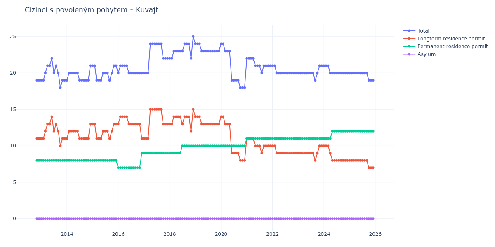

# Kuvajt

## Souhrnné statistiky (Min/Max pro rok) / Summary Statistics (Min/Max per year)

| Year   | Total Min/Max   | Longterm Residence Permit Min/Max   | Permanent Residence Permit Min/Max   | Asylum Min/Max   |
|--------|-----------------|-------------------------------------|--------------------------------------|------------------|
| 2012   | 19 / 19         | 11 / 11                             | 8 / 8                                | 0 / 0            |
| 2013   | 18 / 22         | 10 / 14                             | 8 / 8                                | 0 / 0            |
| 2014   | 19 / 21         | 11 / 13                             | 8 / 8                                | 0 / 0            |
| 2015   | 19 / 21         | 11 / 13                             | 8 / 8                                | 0 / 0            |
| 2016   | 20 / 21         | 11 / 14                             | 7 / 9                                | 0 / 0            |
| 2017   | 20 / 24         | 11 / 15                             | 9 / 9                                | 0 / 0            |
| 2018   | 22 / 25         | 12 / 15                             | 9 / 10                               | 0 / 0            |
| 2019   | 23 / 24         | 13 / 14                             | 10 / 10                              | 0 / 0            |
| 2020   | 18 / 24         | 8 / 14                              | 10 / 10                              | 0 / 0            |
| 2021   | 20 / 22         | 9 / 11                              | 11 / 11                              | 0 / 0            |
| 2022   | 20 / 21         | 9 / 10                              | 11 / 11                              | 0 / 0            |
| 2023   | 19 / 21         | 8 / 10                              | 11 / 11                              | 0 / 0            |
| 2024   | 20 / 21         | 8 / 10                              | 11 / 12                              | 0 / 0            |
| 2025   | 19 / 20         | 7 / 8                               | 12 / 12                              | 0 / 0            |

## Detailní tabulka / Detailed Data Table

| Date     | Total        | Longterm Residence Permit   | Permanent Residence Permit   | Asylum   |
|----------|--------------|-----------------------------|------------------------------|----------|
| **2012** |              |                             |                              |          |
| 11.2012  | 19           | 11                          | 8                            | 0        |
| 12.2012  | 19 (+0.00%)  | 11 (+0.00%)                 | 8 (+0.00%)                   | 0        |
| **2013** |              |                             |                              |          |
| 01.2013  | 19 (+0.00%)  | 11 (+0.00%)                 | 8 (+0.00%)                   | 0        |
| 02.2013  | 19 (+0.00%)  | 11 (+0.00%)                 | 8 (+0.00%)                   | 0        |
| 03.2013  | 20 (+5.26%)  | 12 (+9.09%)                 | 8 (+0.00%)                   | 0        |
| 04.2013  | 21 (+5.00%)  | 13 (+8.33%)                 | 8 (+0.00%)                   | 0        |
| 05.2013  | 21 (+0.00%)  | 13 (+0.00%)                 | 8 (+0.00%)                   | 0        |
| 06.2013  | 22 (+4.76%)  | 14 (+7.69%)                 | 8 (+0.00%)                   | 0        |
| 07.2013  | 20 (-9.09%)  | 12 (-14.29%)                | 8 (+0.00%)                   | 0        |
| 08.2013  | 21 (+5.00%)  | 13 (+8.33%)                 | 8 (+0.00%)                   | 0        |
| 09.2013  | 20 (-4.76%)  | 12 (-7.69%)                 | 8 (+0.00%)                   | 0        |
| 10.2013  | 18 (-10.00%) | 10 (-16.67%)                | 8 (+0.00%)                   | 0        |
| 11.2013  | 19 (+5.56%)  | 11 (+10.00%)                | 8 (+0.00%)                   | 0        |
| 12.2013  | 19 (+0.00%)  | 11 (+0.00%)                 | 8 (+0.00%)                   | 0        |
| **2014** |              |                             |                              |          |
| 01.2014  | 19 (+0.00%)  | 11 (+0.00%)                 | 8 (+0.00%)                   | 0        |
| 02.2014  | 20 (+5.26%)  | 12 (+9.09%)                 | 8 (+0.00%)                   | 0        |
| 03.2014  | 20 (+0.00%)  | 12 (+0.00%)                 | 8 (+0.00%)                   | 0        |
| 04.2014  | 20 (+0.00%)  | 12 (+0.00%)                 | 8 (+0.00%)                   | 0        |
| 05.2014  | 20 (+0.00%)  | 12 (+0.00%)                 | 8 (+0.00%)                   | 0        |
| 06.2014  | 20 (+0.00%)  | 12 (+0.00%)                 | 8 (+0.00%)                   | 0        |
| 07.2014  | 19 (-5.00%)  | 11 (-8.33%)                 | 8 (+0.00%)                   | 0        |
| 08.2014  | 19 (+0.00%)  | 11 (+0.00%)                 | 8 (+0.00%)                   | 0        |
| 09.2014  | 19 (+0.00%)  | 11 (+0.00%)                 | 8 (+0.00%)                   | 0        |
| 10.2014  | 19 (+0.00%)  | 11 (+0.00%)                 | 8 (+0.00%)                   | 0        |
| 11.2014  | 19 (+0.00%)  | 11 (+0.00%)                 | 8 (+0.00%)                   | 0        |
| 12.2014  | 21 (+10.53%) | 13 (+18.18%)                | 8 (+0.00%)                   | 0        |
| **2015** |              |                             |                              |          |
| 01.2015  | 21 (+0.00%)  | 13 (+0.00%)                 | 8 (+0.00%)                   | 0        |
| 02.2015  | 21 (+0.00%)  | 13 (+0.00%)                 | 8 (+0.00%)                   | 0        |
| 03.2015  | 19 (-9.52%)  | 11 (-15.38%)                | 8 (+0.00%)                   | 0        |
| 04.2015  | 19 (+0.00%)  | 11 (+0.00%)                 | 8 (+0.00%)                   | 0        |
| 05.2015  | 19 (+0.00%)  | 11 (+0.00%)                 | 8 (+0.00%)                   | 0        |
| 06.2015  | 20 (+5.26%)  | 12 (+9.09%)                 | 8 (+0.00%)                   | 0        |
| 07.2015  | 20 (+0.00%)  | 12 (+0.00%)                 | 8 (+0.00%)                   | 0        |
| 08.2015  | 20 (+0.00%)  | 12 (+0.00%)                 | 8 (+0.00%)                   | 0        |
| 09.2015  | 19 (-5.00%)  | 11 (-8.33%)                 | 8 (+0.00%)                   | 0        |
| 10.2015  | 20 (+5.26%)  | 12 (+9.09%)                 | 8 (+0.00%)                   | 0        |
| 11.2015  | 21 (+5.00%)  | 13 (+8.33%)                 | 8 (+0.00%)                   | 0        |
| 12.2015  | 21 (+0.00%)  | 13 (+0.00%)                 | 8 (+0.00%)                   | 0        |
| **2016** |              |                             |                              |          |
| 01.2016  | 20 (-4.76%)  | 13 (+0.00%)                 | 7 (-12.50%)                  | 0        |
| 02.2016  | 21 (+5.00%)  | 14 (+7.69%)                 | 7 (+0.00%)                   | 0        |
| 03.2016  | 21 (+0.00%)  | 14 (+0.00%)                 | 7 (+0.00%)                   | 0        |
| 04.2016  | 21 (+0.00%)  | 14 (+0.00%)                 | 7 (+0.00%)                   | 0        |
| 05.2016  | 21 (+0.00%)  | 14 (+0.00%)                 | 7 (+0.00%)                   | 0        |
| 06.2016  | 20 (-4.76%)  | 13 (-7.14%)                 | 7 (+0.00%)                   | 0        |
| 07.2016  | 20 (+0.00%)  | 13 (+0.00%)                 | 7 (+0.00%)                   | 0        |
| 08.2016  | 20 (+0.00%)  | 13 (+0.00%)                 | 7 (+0.00%)                   | 0        |
| 09.2016  | 20 (+0.00%)  | 13 (+0.00%)                 | 7 (+0.00%)                   | 0        |
| 10.2016  | 20 (+0.00%)  | 13 (+0.00%)                 | 7 (+0.00%)                   | 0        |
| 11.2016  | 20 (+0.00%)  | 13 (+0.00%)                 | 7 (+0.00%)                   | 0        |
| 12.2016  | 20 (+0.00%)  | 11 (-15.38%)                | 9 (+28.57%)                  | 0        |
| **2017** |              |                             |                              |          |
| 01.2017  | 20 (+0.00%)  | 11 (+0.00%)                 | 9 (+0.00%)                   | 0        |
| 02.2017  | 20 (+0.00%)  | 11 (+0.00%)                 | 9 (+0.00%)                   | 0        |
| 03.2017  | 20 (+0.00%)  | 11 (+0.00%)                 | 9 (+0.00%)                   | 0        |
| 04.2017  | 24 (+20.00%) | 15 (+36.36%)                | 9 (+0.00%)                   | 0        |
| 05.2017  | 24 (+0.00%)  | 15 (+0.00%)                 | 9 (+0.00%)                   | 0        |
| 06.2017  | 24 (+0.00%)  | 15 (+0.00%)                 | 9 (+0.00%)                   | 0        |
| 07.2017  | 24 (+0.00%)  | 15 (+0.00%)                 | 9 (+0.00%)                   | 0        |
| 08.2017  | 24 (+0.00%)  | 15 (+0.00%)                 | 9 (+0.00%)                   | 0        |
| 09.2017  | 24 (+0.00%)  | 15 (+0.00%)                 | 9 (+0.00%)                   | 0        |
| 10.2017  | 22 (-8.33%)  | 13 (-13.33%)                | 9 (+0.00%)                   | 0        |
| 11.2017  | 22 (+0.00%)  | 13 (+0.00%)                 | 9 (+0.00%)                   | 0        |
| 12.2017  | 22 (+0.00%)  | 13 (+0.00%)                 | 9 (+0.00%)                   | 0        |
| **2018** |              |                             |                              |          |
| 01.2018  | 22 (+0.00%)  | 13 (+0.00%)                 | 9 (+0.00%)                   | 0        |
| 02.2018  | 22 (+0.00%)  | 13 (+0.00%)                 | 9 (+0.00%)                   | 0        |
| 03.2018  | 23 (+4.55%)  | 14 (+7.69%)                 | 9 (+0.00%)                   | 0        |
| 04.2018  | 23 (+0.00%)  | 14 (+0.00%)                 | 9 (+0.00%)                   | 0        |
| 05.2018  | 23 (+0.00%)  | 14 (+0.00%)                 | 9 (+0.00%)                   | 0        |
| 06.2018  | 23 (+0.00%)  | 14 (+0.00%)                 | 9 (+0.00%)                   | 0        |
| 07.2018  | 23 (+0.00%)  | 13 (-7.14%)                 | 10 (+11.11%)                 | 0        |
| 08.2018  | 24 (+4.35%)  | 14 (+7.69%)                 | 10 (+0.00%)                  | 0        |
| 09.2018  | 24 (+0.00%)  | 14 (+0.00%)                 | 10 (+0.00%)                  | 0        |
| 10.2018  | 24 (+0.00%)  | 14 (+0.00%)                 | 10 (+0.00%)                  | 0        |
| 11.2018  | 22 (-8.33%)  | 12 (-14.29%)                | 10 (+0.00%)                  | 0        |
| 12.2018  | 25 (+13.64%) | 15 (+25.00%)                | 10 (+0.00%)                  | 0        |
| **2019** |              |                             |                              |          |
| 01.2019  | 24 (-4.00%)  | 14 (-6.67%)                 | 10 (+0.00%)                  | 0        |
| 02.2019  | 24 (+0.00%)  | 14 (+0.00%)                 | 10 (+0.00%)                  | 0        |
| 03.2019  | 24 (+0.00%)  | 14 (+0.00%)                 | 10 (+0.00%)                  | 0        |
| 04.2019  | 23 (-4.17%)  | 13 (-7.14%)                 | 10 (+0.00%)                  | 0        |
| 05.2019  | 23 (+0.00%)  | 13 (+0.00%)                 | 10 (+0.00%)                  | 0        |
| 06.2019  | 23 (+0.00%)  | 13 (+0.00%)                 | 10 (+0.00%)                  | 0        |
| 07.2019  | 23 (+0.00%)  | 13 (+0.00%)                 | 10 (+0.00%)                  | 0        |
| 08.2019  | 23 (+0.00%)  | 13 (+0.00%)                 | 10 (+0.00%)                  | 0        |
| 09.2019  | 23 (+0.00%)  | 13 (+0.00%)                 | 10 (+0.00%)                  | 0        |
| 10.2019  | 23 (+0.00%)  | 13 (+0.00%)                 | 10 (+0.00%)                  | 0        |
| 11.2019  | 23 (+0.00%)  | 13 (+0.00%)                 | 10 (+0.00%)                  | 0        |
| 12.2019  | 23 (+0.00%)  | 13 (+0.00%)                 | 10 (+0.00%)                  | 0        |
| **2020** |              |                             |                              |          |
| 01.2020  | 24 (+4.35%)  | 14 (+7.69%)                 | 10 (+0.00%)                  | 0        |
| 02.2020  | 24 (+0.00%)  | 14 (+0.00%)                 | 10 (+0.00%)                  | 0        |
| 03.2020  | 23 (-4.17%)  | 13 (-7.14%)                 | 10 (+0.00%)                  | 0        |
| 04.2020  | 23 (+0.00%)  | 13 (+0.00%)                 | 10 (+0.00%)                  | 0        |
| 05.2020  | 23 (+0.00%)  | 13 (+0.00%)                 | 10 (+0.00%)                  | 0        |
| 06.2020  | 19 (-17.39%) | 9 (-30.77%)                 | 10 (+0.00%)                  | 0        |
| 07.2020  | 19 (+0.00%)  | 9 (+0.00%)                  | 10 (+0.00%)                  | 0        |
| 08.2020  | 19 (+0.00%)  | 9 (+0.00%)                  | 10 (+0.00%)                  | 0        |
| 09.2020  | 19 (+0.00%)  | 9 (+0.00%)                  | 10 (+0.00%)                  | 0        |
| 10.2020  | 18 (-5.26%)  | 8 (-11.11%)                 | 10 (+0.00%)                  | 0        |
| 11.2020  | 18 (+0.00%)  | 8 (+0.00%)                  | 10 (+0.00%)                  | 0        |
| 12.2020  | 18 (+0.00%)  | 8 (+0.00%)                  | 10 (+0.00%)                  | 0        |
| **2021** |              |                             |                              |          |
| 01.2021  | 22 (+22.22%) | 11 (+37.50%)                | 11 (+10.00%)                 | 0        |
| 02.2021  | 22 (+0.00%)  | 11 (+0.00%)                 | 11 (+0.00%)                  | 0        |
| 03.2021  | 22 (+0.00%)  | 11 (+0.00%)                 | 11 (+0.00%)                  | 0        |
| 04.2021  | 22 (+0.00%)  | 11 (+0.00%)                 | 11 (+0.00%)                  | 0        |
| 05.2021  | 21 (-4.55%)  | 10 (-9.09%)                 | 11 (+0.00%)                  | 0        |
| 06.2021  | 21 (+0.00%)  | 10 (+0.00%)                 | 11 (+0.00%)                  | 0        |
| 07.2021  | 21 (+0.00%)  | 10 (+0.00%)                 | 11 (+0.00%)                  | 0        |
| 08.2021  | 20 (-4.76%)  | 9 (-10.00%)                 | 11 (+0.00%)                  | 0        |
| 09.2021  | 21 (+5.00%)  | 10 (+11.11%)                | 11 (+0.00%)                  | 0        |
| 10.2021  | 21 (+0.00%)  | 10 (+0.00%)                 | 11 (+0.00%)                  | 0        |
| 11.2021  | 21 (+0.00%)  | 10 (+0.00%)                 | 11 (+0.00%)                  | 0        |
| 12.2021  | 21 (+0.00%)  | 10 (+0.00%)                 | 11 (+0.00%)                  | 0        |
| **2022** |              |                             |                              |          |
| 01.2022  | 21 (+0.00%)  | 10 (+0.00%)                 | 11 (+0.00%)                  | 0        |
| 02.2022  | 21 (+0.00%)  | 10 (+0.00%)                 | 11 (+0.00%)                  | 0        |
| 03.2022  | 20 (-4.76%)  | 9 (-10.00%)                 | 11 (+0.00%)                  | 0        |
| 04.2022  | 20 (+0.00%)  | 9 (+0.00%)                  | 11 (+0.00%)                  | 0        |
| 05.2022  | 20 (+0.00%)  | 9 (+0.00%)                  | 11 (+0.00%)                  | 0        |
| 06.2022  | 20 (+0.00%)  | 9 (+0.00%)                  | 11 (+0.00%)                  | 0        |
| 07.2022  | 20 (+0.00%)  | 9 (+0.00%)                  | 11 (+0.00%)                  | 0        |
| 08.2022  | 20 (+0.00%)  | 9 (+0.00%)                  | 11 (+0.00%)                  | 0        |
| 09.2022  | 20 (+0.00%)  | 9 (+0.00%)                  | 11 (+0.00%)                  | 0        |
| 10.2022  | 20 (+0.00%)  | 9 (+0.00%)                  | 11 (+0.00%)                  | 0        |
| 11.2022  | 20 (+0.00%)  | 9 (+0.00%)                  | 11 (+0.00%)                  | 0        |
| 12.2022  | 20 (+0.00%)  | 9 (+0.00%)                  | 11 (+0.00%)                  | 0        |
| **2023** |              |                             |                              |          |
| 01.2023  | 20 (+0.00%)  | 9 (+0.00%)                  | 11 (+0.00%)                  | 0        |
| 02.2023  | 20 (+0.00%)  | 9 (+0.00%)                  | 11 (+0.00%)                  | 0        |
| 03.2023  | 20 (+0.00%)  | 9 (+0.00%)                  | 11 (+0.00%)                  | 0        |
| 04.2023  | 20 (+0.00%)  | 9 (+0.00%)                  | 11 (+0.00%)                  | 0        |
| 05.2023  | 20 (+0.00%)  | 9 (+0.00%)                  | 11 (+0.00%)                  | 0        |
| 06.2023  | 20 (+0.00%)  | 9 (+0.00%)                  | 11 (+0.00%)                  | 0        |
| 07.2023  | 20 (+0.00%)  | 9 (+0.00%)                  | 11 (+0.00%)                  | 0        |
| 08.2023  | 20 (+0.00%)  | 9 (+0.00%)                  | 11 (+0.00%)                  | 0        |
| 09.2023  | 19 (-5.00%)  | 8 (-11.11%)                 | 11 (+0.00%)                  | 0        |
| 10.2023  | 20 (+5.26%)  | 9 (+12.50%)                 | 11 (+0.00%)                  | 0        |
| 11.2023  | 21 (+5.00%)  | 10 (+11.11%)                | 11 (+0.00%)                  | 0        |
| 12.2023  | 21 (+0.00%)  | 10 (+0.00%)                 | 11 (+0.00%)                  | 0        |
| **2024** |              |                             |                              |          |
| 01.2024  | 21 (+0.00%)  | 10 (+0.00%)                 | 11 (+0.00%)                  | 0        |
| 02.2024  | 21 (+0.00%)  | 10 (+0.00%)                 | 11 (+0.00%)                  | 0        |
| 03.2024  | 21 (+0.00%)  | 10 (+0.00%)                 | 11 (+0.00%)                  | 0        |
| 04.2024  | 20 (-4.76%)  | 9 (-10.00%)                 | 11 (+0.00%)                  | 0        |
| 05.2024  | 20 (+0.00%)  | 8 (-11.11%)                 | 12 (+9.09%)                  | 0        |
| 06.2024  | 20 (+0.00%)  | 8 (+0.00%)                  | 12 (+0.00%)                  | 0        |
| 07.2024  | 20 (+0.00%)  | 8 (+0.00%)                  | 12 (+0.00%)                  | 0        |
| 08.2024  | 20 (+0.00%)  | 8 (+0.00%)                  | 12 (+0.00%)                  | 0        |
| 09.2024  | 20 (+0.00%)  | 8 (+0.00%)                  | 12 (+0.00%)                  | 0        |
| 10.2024  | 20 (+0.00%)  | 8 (+0.00%)                  | 12 (+0.00%)                  | 0        |
| 11.2024  | 20 (+0.00%)  | 8 (+0.00%)                  | 12 (+0.00%)                  | 0        |
| 12.2024  | 20 (+0.00%)  | 8 (+0.00%)                  | 12 (+0.00%)                  | 0        |
| **2025** |              |                             |                              |          |
| 01.2025  | 20 (+0.00%)  | 8 (+0.00%)                  | 12 (+0.00%)                  | 0        |
| 02.2025  | 20 (+0.00%)  | 8 (+0.00%)                  | 12 (+0.00%)                  | 0        |
| 03.2025  | 20 (+0.00%)  | 8 (+0.00%)                  | 12 (+0.00%)                  | 0        |
| 04.2025  | 20 (+0.00%)  | 8 (+0.00%)                  | 12 (+0.00%)                  | 0        |
| 05.2025  | 20 (+0.00%)  | 8 (+0.00%)                  | 12 (+0.00%)                  | 0        |
| 06.2025  | 20 (+0.00%)  | 8 (+0.00%)                  | 12 (+0.00%)                  | 0        |
| 07.2025  | 20 (+0.00%)  | 8 (+0.00%)                  | 12 (+0.00%)                  | 0        |
| 08.2025  | 20 (+0.00%)  | 8 (+0.00%)                  | 12 (+0.00%)                  | 0        |
| 09.2025  | 20 (+0.00%)  | 8 (+0.00%)                  | 12 (+0.00%)                  | 0        |
| 10.2025  | 19 (-5.00%)  | 7 (-12.50%)                 | 12 (+0.00%)                  | 0        |
| 11.2025  | 19 (+0.00%)  | 7 (+0.00%)                  | 12 (+0.00%)                  | 0        |
| 12.2025  | 19 (+0.00%)  | 7 (+0.00%)                  | 12 (+0.00%)                  | 0        |
