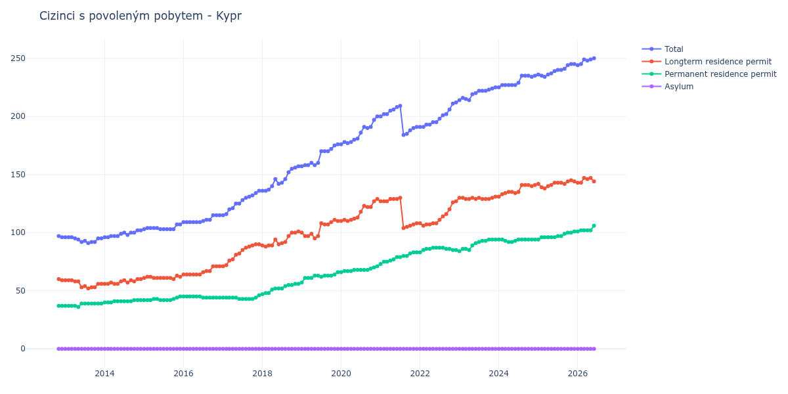

# Kypr

## Souhrnné statistiky (Min/Max pro rok) / Summary Statistics (Min/Max per year)

| Year   | Total     | Longterm Residence Permit   | Permanent Residence Permit   | Asylum   |
|--------|-----------|-----------------------------|------------------------------|----------|
| 2012   | 96 / 97   | 59 / 60                     | 37 / 37                      | 0 / 0    |
| 2013   | 91 / 96   | 52 / 59                     | 36 / 39                      | 0 / 0    |
| 2014   | 96 / 102  | 56 / 60                     | 40 / 42                      | 0 / 0    |
| 2015   | 103 / 107 | 60 / 63                     | 42 / 45                      | 0 / 0    |
| 2016   | 109 / 115 | 64 / 71                     | 44 / 45                      | 0 / 0    |
| 2017   | 115 / 136 | 71 / 90                     | 43 / 46                      | 0 / 0    |
| 2018   | 136 / 157 | 88 / 101                    | 47 / 56                      | 0 / 0    |
| 2019   | 157 / 176 | 95 / 111                    | 57 / 66                      | 0 / 0    |
| 2020   | 176 / 200 | 110 / 129                   | 66 / 71                      | 0 / 0    |
| 2021   | 184 / 209 | 104 / 130                   | 73 / 83                      | 0 / 0    |
| 2022   | 191 / 212 | 106 / 127                   | 83 / 87                      | 0 / 0    |
| 2023   | 214 / 225 | 129 / 131                   | 84 / 94                      | 0 / 0    |
| 2024   | 225 / 235 | 131 / 141                   | 92 / 94                      | 0 / 0    |
| 2025   | 234 / 245 | 138 / 145                   | 94 / 101                     | 0 / 0    |
| 2026   | 244 / 250 | 143 / 147                   | 101 / 106                    | 0 / 0    |

## Detailní tabulka / Detailed Data Table

| Date     | Total         | Longterm Residence Permit   | Permanent Residence Permit   | Asylum   |
|----------|---------------|-----------------------------|------------------------------|----------|
| **2012** |               |                             |                              |          |
| 11.2012  | 97            | 60                          | 37                           | 0        |
| 12.2012  | 96 (-1.03%)   | 59 (-1.67%)                 | 37 (+0.00%)                  | 0        |
| **2013** |               |                             |                              |          |
| 01.2013  | 96 (+0.00%)   | 59 (+0.00%)                 | 37 (+0.00%)                  | 0        |
| 02.2013  | 96 (+0.00%)   | 59 (+0.00%)                 | 37 (+0.00%)                  | 0        |
| 03.2013  | 96 (+0.00%)   | 59 (+0.00%)                 | 37 (+0.00%)                  | 0        |
| 04.2013  | 95 (-1.04%)   | 58 (-1.69%)                 | 37 (+0.00%)                  | 0        |
| 05.2013  | 94 (-1.05%)   | 58 (+0.00%)                 | 36 (-2.70%)                  | 0        |
| 06.2013  | 92 (-2.13%)   | 53 (-8.62%)                 | 39 (+8.33%)                  | 0        |
| 07.2013  | 93 (+1.09%)   | 54 (+1.89%)                 | 39 (+0.00%)                  | 0        |
| 08.2013  | 91 (-2.15%)   | 52 (-3.70%)                 | 39 (+0.00%)                  | 0        |
| 09.2013  | 92 (+1.10%)   | 53 (+1.92%)                 | 39 (+0.00%)                  | 0        |
| 10.2013  | 92 (+0.00%)   | 53 (+0.00%)                 | 39 (+0.00%)                  | 0        |
| 11.2013  | 95 (+3.26%)   | 56 (+5.66%)                 | 39 (+0.00%)                  | 0        |
| 12.2013  | 95 (+0.00%)   | 56 (+0.00%)                 | 39 (+0.00%)                  | 0        |
| **2014** |               |                             |                              |          |
| 01.2014  | 96 (+1.05%)   | 56 (+0.00%)                 | 40 (+2.56%)                  | 0        |
| 02.2014  | 96 (+0.00%)   | 56 (+0.00%)                 | 40 (+0.00%)                  | 0        |
| 03.2014  | 97 (+1.04%)   | 57 (+1.79%)                 | 40 (+0.00%)                  | 0        |
| 04.2014  | 97 (+0.00%)   | 56 (-1.75%)                 | 41 (+2.50%)                  | 0        |
| 05.2014  | 97 (+0.00%)   | 56 (+0.00%)                 | 41 (+0.00%)                  | 0        |
| 06.2014  | 99 (+2.06%)   | 58 (+3.57%)                 | 41 (+0.00%)                  | 0        |
| 07.2014  | 100 (+1.01%)  | 59 (+1.72%)                 | 41 (+0.00%)                  | 0        |
| 08.2014  | 98 (-2.00%)   | 57 (-3.39%)                 | 41 (+0.00%)                  | 0        |
| 09.2014  | 100 (+2.04%)  | 59 (+3.51%)                 | 41 (+0.00%)                  | 0        |
| 10.2014  | 100 (+0.00%)  | 58 (-1.69%)                 | 42 (+2.44%)                  | 0        |
| 11.2014  | 102 (+2.00%)  | 60 (+3.45%)                 | 42 (+0.00%)                  | 0        |
| 12.2014  | 102 (+0.00%)  | 60 (+0.00%)                 | 42 (+0.00%)                  | 0        |
| **2015** |               |                             |                              |          |
| 01.2015  | 103 (+0.98%)  | 61 (+1.67%)                 | 42 (+0.00%)                  | 0        |
| 02.2015  | 104 (+0.97%)  | 62 (+1.64%)                 | 42 (+0.00%)                  | 0        |
| 03.2015  | 104 (+0.00%)  | 62 (+0.00%)                 | 42 (+0.00%)                  | 0        |
| 04.2015  | 104 (+0.00%)  | 61 (-1.61%)                 | 43 (+2.38%)                  | 0        |
| 05.2015  | 104 (+0.00%)  | 61 (+0.00%)                 | 43 (+0.00%)                  | 0        |
| 06.2015  | 103 (-0.96%)  | 61 (+0.00%)                 | 42 (-2.33%)                  | 0        |
| 07.2015  | 103 (+0.00%)  | 61 (+0.00%)                 | 42 (+0.00%)                  | 0        |
| 08.2015  | 103 (+0.00%)  | 61 (+0.00%)                 | 42 (+0.00%)                  | 0        |
| 09.2015  | 103 (+0.00%)  | 61 (+0.00%)                 | 42 (+0.00%)                  | 0        |
| 10.2015  | 103 (+0.00%)  | 60 (-1.64%)                 | 43 (+2.38%)                  | 0        |
| 11.2015  | 107 (+3.88%)  | 63 (+5.00%)                 | 44 (+2.33%)                  | 0        |
| 12.2015  | 107 (+0.00%)  | 62 (-1.59%)                 | 45 (+2.27%)                  | 0        |
| **2016** |               |                             |                              |          |
| 01.2016  | 109 (+1.87%)  | 64 (+3.23%)                 | 45 (+0.00%)                  | 0        |
| 02.2016  | 109 (+0.00%)  | 64 (+0.00%)                 | 45 (+0.00%)                  | 0        |
| 03.2016  | 109 (+0.00%)  | 64 (+0.00%)                 | 45 (+0.00%)                  | 0        |
| 04.2016  | 109 (+0.00%)  | 64 (+0.00%)                 | 45 (+0.00%)                  | 0        |
| 05.2016  | 109 (+0.00%)  | 64 (+0.00%)                 | 45 (+0.00%)                  | 0        |
| 06.2016  | 109 (+0.00%)  | 64 (+0.00%)                 | 45 (+0.00%)                  | 0        |
| 07.2016  | 110 (+0.92%)  | 66 (+3.12%)                 | 44 (-2.22%)                  | 0        |
| 08.2016  | 111 (+0.91%)  | 67 (+1.52%)                 | 44 (+0.00%)                  | 0        |
| 09.2016  | 111 (+0.00%)  | 67 (+0.00%)                 | 44 (+0.00%)                  | 0        |
| 10.2016  | 115 (+3.60%)  | 71 (+5.97%)                 | 44 (+0.00%)                  | 0        |
| 11.2016  | 115 (+0.00%)  | 71 (+0.00%)                 | 44 (+0.00%)                  | 0        |
| 12.2016  | 115 (+0.00%)  | 71 (+0.00%)                 | 44 (+0.00%)                  | 0        |
| **2017** |               |                             |                              |          |
| 01.2017  | 115 (+0.00%)  | 71 (+0.00%)                 | 44 (+0.00%)                  | 0        |
| 02.2017  | 116 (+0.87%)  | 72 (+1.41%)                 | 44 (+0.00%)                  | 0        |
| 03.2017  | 120 (+3.45%)  | 76 (+5.56%)                 | 44 (+0.00%)                  | 0        |
| 04.2017  | 121 (+0.83%)  | 77 (+1.32%)                 | 44 (+0.00%)                  | 0        |
| 05.2017  | 125 (+3.31%)  | 81 (+5.19%)                 | 44 (+0.00%)                  | 0        |
| 06.2017  | 125 (+0.00%)  | 82 (+1.23%)                 | 43 (-2.27%)                  | 0        |
| 07.2017  | 128 (+2.40%)  | 85 (+3.66%)                 | 43 (+0.00%)                  | 0        |
| 08.2017  | 130 (+1.56%)  | 87 (+2.35%)                 | 43 (+0.00%)                  | 0        |
| 09.2017  | 131 (+0.77%)  | 88 (+1.15%)                 | 43 (+0.00%)                  | 0        |
| 10.2017  | 132 (+0.76%)  | 89 (+1.14%)                 | 43 (+0.00%)                  | 0        |
| 11.2017  | 134 (+1.52%)  | 90 (+1.12%)                 | 44 (+2.33%)                  | 0        |
| 12.2017  | 136 (+1.49%)  | 90 (+0.00%)                 | 46 (+4.55%)                  | 0        |
| **2018** |               |                             |                              |          |
| 01.2018  | 136 (+0.00%)  | 89 (-1.11%)                 | 47 (+2.17%)                  | 0        |
| 02.2018  | 136 (+0.00%)  | 88 (-1.12%)                 | 48 (+2.13%)                  | 0        |
| 03.2018  | 137 (+0.74%)  | 89 (+1.14%)                 | 48 (+0.00%)                  | 0        |
| 04.2018  | 140 (+2.19%)  | 89 (+0.00%)                 | 51 (+6.25%)                  | 0        |
| 05.2018  | 146 (+4.29%)  | 94 (+5.62%)                 | 52 (+1.96%)                  | 0        |
| 06.2018  | 142 (-2.74%)  | 90 (-4.26%)                 | 52 (+0.00%)                  | 0        |
| 07.2018  | 143 (+0.70%)  | 91 (+1.11%)                 | 52 (+0.00%)                  | 0        |
| 08.2018  | 146 (+2.10%)  | 92 (+1.10%)                 | 54 (+3.85%)                  | 0        |
| 09.2018  | 152 (+4.11%)  | 97 (+5.43%)                 | 55 (+1.85%)                  | 0        |
| 10.2018  | 155 (+1.97%)  | 100 (+3.09%)                | 55 (+0.00%)                  | 0        |
| 11.2018  | 156 (+0.65%)  | 100 (+0.00%)                | 56 (+1.82%)                  | 0        |
| 12.2018  | 157 (+0.64%)  | 101 (+1.00%)                | 56 (+0.00%)                  | 0        |
| **2019** |               |                             |                              |          |
| 01.2019  | 157 (+0.00%)  | 100 (-0.99%)                | 57 (+1.79%)                  | 0        |
| 02.2019  | 158 (+0.64%)  | 97 (-3.00%)                 | 61 (+7.02%)                  | 0        |
| 03.2019  | 158 (+0.00%)  | 97 (+0.00%)                 | 61 (+0.00%)                  | 0        |
| 04.2019  | 160 (+1.27%)  | 99 (+2.06%)                 | 61 (+0.00%)                  | 0        |
| 05.2019  | 158 (-1.25%)  | 95 (-4.04%)                 | 63 (+3.28%)                  | 0        |
| 06.2019  | 160 (+1.27%)  | 97 (+2.11%)                 | 63 (+0.00%)                  | 0        |
| 07.2019  | 170 (+6.25%)  | 108 (+11.34%)               | 62 (-1.59%)                  | 0        |
| 08.2019  | 170 (+0.00%)  | 107 (-0.93%)                | 63 (+1.61%)                  | 0        |
| 09.2019  | 170 (+0.00%)  | 107 (+0.00%)                | 63 (+0.00%)                  | 0        |
| 10.2019  | 172 (+1.18%)  | 109 (+1.87%)                | 63 (+0.00%)                  | 0        |
| 11.2019  | 175 (+1.74%)  | 111 (+1.83%)                | 64 (+1.59%)                  | 0        |
| 12.2019  | 176 (+0.57%)  | 110 (-0.90%)                | 66 (+3.12%)                  | 0        |
| **2020** |               |                             |                              |          |
| 01.2020  | 176 (+0.00%)  | 110 (+0.00%)                | 66 (+0.00%)                  | 0        |
| 02.2020  | 178 (+1.14%)  | 111 (+0.91%)                | 67 (+1.52%)                  | 0        |
| 03.2020  | 177 (-0.56%)  | 110 (-0.90%)                | 67 (+0.00%)                  | 0        |
| 04.2020  | 178 (+0.56%)  | 111 (+0.91%)                | 67 (+0.00%)                  | 0        |
| 05.2020  | 180 (+1.12%)  | 112 (+0.90%)                | 68 (+1.49%)                  | 0        |
| 06.2020  | 181 (+0.56%)  | 113 (+0.89%)                | 68 (+0.00%)                  | 0        |
| 07.2020  | 186 (+2.76%)  | 118 (+4.42%)                | 68 (+0.00%)                  | 0        |
| 08.2020  | 191 (+2.69%)  | 123 (+4.24%)                | 68 (+0.00%)                  | 0        |
| 09.2020  | 190 (-0.52%)  | 122 (-0.81%)                | 68 (+0.00%)                  | 0        |
| 10.2020  | 191 (+0.53%)  | 122 (+0.00%)                | 69 (+1.47%)                  | 0        |
| 11.2020  | 197 (+3.14%)  | 127 (+4.10%)                | 70 (+1.45%)                  | 0        |
| 12.2020  | 200 (+1.52%)  | 129 (+1.57%)                | 71 (+1.43%)                  | 0        |
| **2021** |               |                             |                              |          |
| 01.2021  | 200 (+0.00%)  | 127 (-1.55%)                | 73 (+2.82%)                  | 0        |
| 02.2021  | 202 (+1.00%)  | 127 (+0.00%)                | 75 (+2.74%)                  | 0        |
| 03.2021  | 202 (+0.00%)  | 127 (+0.00%)                | 75 (+0.00%)                  | 0        |
| 04.2021  | 205 (+1.49%)  | 129 (+1.57%)                | 76 (+1.33%)                  | 0        |
| 05.2021  | 206 (+0.49%)  | 129 (+0.00%)                | 77 (+1.32%)                  | 0        |
| 06.2021  | 208 (+0.97%)  | 129 (+0.00%)                | 79 (+2.60%)                  | 0        |
| 07.2021  | 209 (+0.48%)  | 130 (+0.78%)                | 79 (+0.00%)                  | 0        |
| 08.2021  | 184 (-11.96%) | 104 (-20.00%)               | 80 (+1.27%)                  | 0        |
| 09.2021  | 185 (+0.54%)  | 105 (+0.96%)                | 80 (+0.00%)                  | 0        |
| 10.2021  | 188 (+1.62%)  | 106 (+0.95%)                | 82 (+2.50%)                  | 0        |
| 11.2021  | 190 (+1.06%)  | 107 (+0.94%)                | 83 (+1.22%)                  | 0        |
| 12.2021  | 191 (+0.53%)  | 108 (+0.93%)                | 83 (+0.00%)                  | 0        |
| **2022** |               |                             |                              |          |
| 01.2022  | 191 (+0.00%)  | 108 (+0.00%)                | 83 (+0.00%)                  | 0        |
| 02.2022  | 191 (+0.00%)  | 106 (-1.85%)                | 85 (+2.41%)                  | 0        |
| 03.2022  | 193 (+1.05%)  | 107 (+0.94%)                | 86 (+1.18%)                  | 0        |
| 04.2022  | 193 (+0.00%)  | 107 (+0.00%)                | 86 (+0.00%)                  | 0        |
| 05.2022  | 195 (+1.04%)  | 108 (+0.93%)                | 87 (+1.16%)                  | 0        |
| 06.2022  | 195 (+0.00%)  | 108 (+0.00%)                | 87 (+0.00%)                  | 0        |
| 07.2022  | 198 (+1.54%)  | 111 (+2.78%)                | 87 (+0.00%)                  | 0        |
| 08.2022  | 201 (+1.52%)  | 114 (+2.70%)                | 87 (+0.00%)                  | 0        |
| 09.2022  | 202 (+0.50%)  | 116 (+1.75%)                | 86 (-1.15%)                  | 0        |
| 10.2022  | 206 (+1.98%)  | 120 (+3.45%)                | 86 (+0.00%)                  | 0        |
| 11.2022  | 211 (+2.43%)  | 126 (+5.00%)                | 85 (-1.16%)                  | 0        |
| 12.2022  | 212 (+0.47%)  | 127 (+0.79%)                | 85 (+0.00%)                  | 0        |
| **2023** |               |                             |                              |          |
| 01.2023  | 214 (+0.94%)  | 130 (+2.36%)                | 84 (-1.18%)                  | 0        |
| 02.2023  | 216 (+0.93%)  | 130 (+0.00%)                | 86 (+2.38%)                  | 0        |
| 03.2023  | 215 (-0.46%)  | 129 (-0.77%)                | 86 (+0.00%)                  | 0        |
| 04.2023  | 214 (-0.47%)  | 129 (+0.00%)                | 85 (-1.16%)                  | 0        |
| 05.2023  | 219 (+2.34%)  | 130 (+0.78%)                | 89 (+4.71%)                  | 0        |
| 06.2023  | 220 (+0.46%)  | 129 (-0.77%)                | 91 (+2.25%)                  | 0        |
| 07.2023  | 222 (+0.91%)  | 130 (+0.78%)                | 92 (+1.10%)                  | 0        |
| 08.2023  | 222 (+0.00%)  | 129 (-0.77%)                | 93 (+1.09%)                  | 0        |
| 09.2023  | 222 (+0.00%)  | 129 (+0.00%)                | 93 (+0.00%)                  | 0        |
| 10.2023  | 223 (+0.45%)  | 129 (+0.00%)                | 94 (+1.08%)                  | 0        |
| 11.2023  | 224 (+0.45%)  | 130 (+0.78%)                | 94 (+0.00%)                  | 0        |
| 12.2023  | 225 (+0.45%)  | 131 (+0.77%)                | 94 (+0.00%)                  | 0        |
| **2024** |               |                             |                              |          |
| 01.2024  | 225 (+0.00%)  | 131 (+0.00%)                | 94 (+0.00%)                  | 0        |
| 02.2024  | 227 (+0.89%)  | 133 (+1.53%)                | 94 (+0.00%)                  | 0        |
| 03.2024  | 227 (+0.00%)  | 134 (+0.75%)                | 93 (-1.06%)                  | 0        |
| 04.2024  | 227 (+0.00%)  | 135 (+0.75%)                | 92 (-1.08%)                  | 0        |
| 05.2024  | 227 (+0.00%)  | 135 (+0.00%)                | 92 (+0.00%)                  | 0        |
| 06.2024  | 227 (+0.00%)  | 134 (-0.74%)                | 93 (+1.09%)                  | 0        |
| 07.2024  | 229 (+0.88%)  | 135 (+0.75%)                | 94 (+1.08%)                  | 0        |
| 08.2024  | 235 (+2.62%)  | 141 (+4.44%)                | 94 (+0.00%)                  | 0        |
| 09.2024  | 235 (+0.00%)  | 141 (+0.00%)                | 94 (+0.00%)                  | 0        |
| 10.2024  | 235 (+0.00%)  | 141 (+0.00%)                | 94 (+0.00%)                  | 0        |
| 11.2024  | 234 (-0.43%)  | 140 (-0.71%)                | 94 (+0.00%)                  | 0        |
| 12.2024  | 235 (+0.43%)  | 141 (+0.71%)                | 94 (+0.00%)                  | 0        |
| **2025** |               |                             |                              |          |
| 01.2025  | 236 (+0.43%)  | 142 (+0.71%)                | 94 (+0.00%)                  | 0        |
| 02.2025  | 235 (-0.42%)  | 139 (-2.11%)                | 96 (+2.13%)                  | 0        |
| 03.2025  | 234 (-0.43%)  | 138 (-0.72%)                | 96 (+0.00%)                  | 0        |
| 04.2025  | 236 (+0.85%)  | 140 (+1.45%)                | 96 (+0.00%)                  | 0        |
| 05.2025  | 237 (+0.42%)  | 141 (+0.71%)                | 96 (+0.00%)                  | 0        |
| 06.2025  | 239 (+0.84%)  | 143 (+1.42%)                | 96 (+0.00%)                  | 0        |
| 07.2025  | 240 (+0.42%)  | 143 (+0.00%)                | 97 (+1.04%)                  | 0        |
| 08.2025  | 240 (+0.00%)  | 143 (+0.00%)                | 97 (+0.00%)                  | 0        |
| 09.2025  | 241 (+0.42%)  | 142 (-0.70%)                | 99 (+2.06%)                  | 0        |
| 10.2025  | 244 (+1.24%)  | 144 (+1.41%)                | 100 (+1.01%)                 | 0        |
| 11.2025  | 245 (+0.41%)  | 145 (+0.69%)                | 100 (+0.00%)                 | 0        |
| 12.2025  | 245 (+0.00%)  | 144 (-0.69%)                | 101 (+1.00%)                 | 0        |
| **2026** |               |                             |                              |          |
| 01.2026  | 244 (-0.41%)  | 143 (-0.69%)                | 101 (+0.00%)                 | 0        |
| 02.2026  | 245 (+0.41%)  | 143 (+0.00%)                | 102 (+0.99%)                 | 0        |
| 03.2026  | 249 (+1.63%)  | 147 (+2.80%)                | 102 (+0.00%)                 | 0        |
| 04.2026  | 248 (-0.40%)  | 146 (-0.68%)                | 102 (+0.00%)                 | 0        |
| 05.2026  | 249 (+0.40%)  | 147 (+0.68%)                | 102 (+0.00%)                 | 0        |
| 06.2026  | 250 (+0.40%)  | 144 (-2.04%)                | 106 (+3.92%)                 | 0        |
