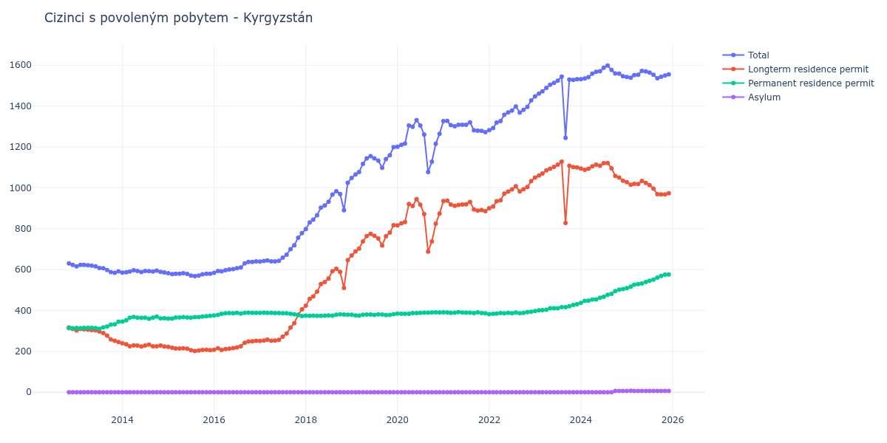

# Kyrgyzstán

## Souhrnné statistiky (Min/Max pro rok) / Summary Statistics (Min/Max per year)

| Year   | Total Min/Max   | Longterm Residence Permit Min/Max   | Permanent Residence Permit Min/Max   | Asylum Min/Max   |
|--------|-----------------|-------------------------------------|--------------------------------------|------------------|
| 2012   | 623 / 630       | 310 / 317                           | 313 / 313                            | 0 / 0            |
| 2013   | 584 / 623       | 246 / 310                           | 311 / 345                            | 0 / 0            |
| 2014   | 585 / 597       | 224 / 239                           | 346 / 370                            | 0 / 0            |
| 2015   | 568 / 582       | 201 / 222                           | 360 / 374                            | 0 / 0            |
| 2016   | 584 / 640       | 207 / 252                           | 376 / 389                            | 0 / 0            |
| 2017   | 639 / 778       | 251 / 405                           | 373 / 389                            | 0 / 0            |
| 2018   | 798 / 1 025     | 423 / 646                           | 374 / 381                            | 0 / 0            |
| 2019   | 1 048 / 1 199   | 669 / 817                           | 375 / 382                            | 0 / 0            |
| 2020   | 1 077 / 1 331   | 688 / 944                           | 384 / 391                            | 0 / 0            |
| 2021   | 1 272 / 1 327   | 886 / 937                           | 386 / 392                            | 0 / 0            |
| 2022   | 1 282 / 1 427   | 900 / 1 033                         | 382 / 394                            | 0 / 0            |
| 2023   | 1 244 / 1 544   | 828 / 1 128                         | 397 / 431                            | 0 / 0            |
| 2024   | 1 531 / 1 598   | 1 035 / 1 121                       | 437 / 505                            | 0 / 6            |
| 2025   | 1 536 / 1 572   | 968 / 1 034                         | 509 / 576                            | 6 / 7            |

## Detailní tabulka / Detailed Data Table

| Date     | Total           | Longterm Residence Permit   | Permanent Residence Permit   | Asylum      |
|----------|-----------------|-----------------------------|------------------------------|-------------|
| **2012** |                 |                             |                              |             |
| 11.2012  | 630             | 317                         | 313                          | 0           |
| 12.2012  | 623 (-1.11%)    | 310 (-2.21%)                | 313 (+0.00%)                 | 0           |
| **2013** |                 |                             |                              |             |
| 01.2013  | 616 (-1.12%)    | 302 (-2.58%)                | 314 (+0.32%)                 | 0           |
| 02.2013  | 623 (+1.14%)    | 310 (+2.65%)                | 313 (-0.32%)                 | 0           |
| 03.2013  | 623 (+0.00%)    | 308 (-0.65%)                | 315 (+0.64%)                 | 0           |
| 04.2013  | 621 (-0.32%)    | 306 (-0.65%)                | 315 (+0.00%)                 | 0           |
| 05.2013  | 619 (-0.32%)    | 304 (-0.65%)                | 315 (+0.00%)                 | 0           |
| 06.2013  | 616 (-0.48%)    | 302 (-0.66%)                | 314 (-0.32%)                 | 0           |
| 07.2013  | 608 (-1.30%)    | 297 (-1.66%)                | 311 (-0.96%)                 | 0           |
| 08.2013  | 607 (-0.16%)    | 290 (-2.36%)                | 317 (+1.93%)                 | 0           |
| 09.2013  | 598 (-1.48%)    | 277 (-4.48%)                | 321 (+1.26%)                 | 0           |
| 10.2013  | 588 (-1.67%)    | 258 (-6.86%)                | 330 (+2.80%)                 | 0           |
| 11.2013  | 584 (-0.68%)    | 252 (-2.33%)                | 332 (+0.61%)                 | 0           |
| 12.2013  | 591 (+1.20%)    | 246 (-2.38%)                | 345 (+3.92%)                 | 0           |
| **2014** |                 |                             |                              |             |
| 01.2014  | 585 (-1.02%)    | 239 (-2.85%)                | 346 (+0.29%)                 | 0           |
| 02.2014  | 587 (+0.34%)    | 235 (-1.67%)                | 352 (+1.73%)                 | 0           |
| 03.2014  | 590 (+0.51%)    | 225 (-4.26%)                | 365 (+3.69%)                 | 0           |
| 04.2014  | 597 (+1.19%)    | 229 (+1.78%)                | 368 (+0.82%)                 | 0           |
| 05.2014  | 593 (-0.67%)    | 228 (-0.44%)                | 365 (-0.82%)                 | 0           |
| 06.2014  | 588 (-0.84%)    | 224 (-1.75%)                | 364 (-0.27%)                 | 0           |
| 07.2014  | 593 (+0.85%)    | 228 (+1.79%)                | 365 (+0.27%)                 | 0           |
| 08.2014  | 592 (-0.17%)    | 233 (+2.19%)                | 359 (-1.64%)                 | 0           |
| 09.2014  | 590 (-0.34%)    | 225 (-3.43%)                | 365 (+1.67%)                 | 0           |
| 10.2014  | 595 (+0.85%)    | 225 (+0.00%)                | 370 (+1.37%)                 | 0           |
| 11.2014  | 589 (-1.01%)    | 228 (+1.33%)                | 361 (-2.43%)                 | 0           |
| 12.2014  | 586 (-0.51%)    | 224 (-1.75%)                | 362 (+0.28%)                 | 0           |
| **2015** |                 |                             |                              |             |
| 01.2015  | 582 (-0.68%)    | 222 (-0.89%)                | 360 (-0.55%)                 | 0           |
| 02.2015  | 578 (-0.69%)    | 218 (-1.80%)                | 360 (+0.00%)                 | 0           |
| 03.2015  | 580 (+0.35%)    | 214 (-1.83%)                | 366 (+1.67%)                 | 0           |
| 04.2015  | 580 (+0.00%)    | 214 (+0.00%)                | 366 (+0.00%)                 | 0           |
| 05.2015  | 582 (+0.34%)    | 215 (+0.47%)                | 367 (+0.27%)                 | 0           |
| 06.2015  | 579 (-0.52%)    | 213 (-0.93%)                | 366 (-0.27%)                 | 0           |
| 07.2015  | 571 (-1.38%)    | 206 (-3.29%)                | 365 (-0.27%)                 | 0           |
| 08.2015  | 568 (-0.53%)    | 201 (-2.43%)                | 367 (+0.55%)                 | 0           |
| 09.2015  | 571 (+0.53%)    | 204 (+1.49%)                | 367 (+0.00%)                 | 0           |
| 10.2015  | 577 (+1.05%)    | 207 (+1.47%)                | 370 (+0.82%)                 | 0           |
| 11.2015  | 580 (+0.52%)    | 208 (+0.48%)                | 372 (+0.54%)                 | 0           |
| 12.2015  | 580 (+0.00%)    | 206 (-0.96%)                | 374 (+0.54%)                 | 0           |
| **2016** |                 |                             |                              |             |
| 01.2016  | 584 (+0.69%)    | 208 (+0.97%)                | 376 (+0.53%)                 | 0           |
| 02.2016  | 593 (+1.54%)    | 215 (+3.37%)                | 378 (+0.53%)                 | 0           |
| 03.2016  | 591 (-0.34%)    | 207 (-3.72%)                | 384 (+1.59%)                 | 0           |
| 04.2016  | 597 (+1.02%)    | 211 (+1.93%)                | 386 (+0.52%)                 | 0           |
| 05.2016  | 600 (+0.50%)    | 213 (+0.95%)                | 387 (+0.26%)                 | 0           |
| 06.2016  | 602 (+0.33%)    | 216 (+1.41%)                | 386 (-0.26%)                 | 0           |
| 07.2016  | 607 (+0.83%)    | 219 (+1.39%)                | 388 (+0.52%)                 | 0           |
| 08.2016  | 610 (+0.49%)    | 225 (+2.74%)                | 385 (-0.77%)                 | 0           |
| 09.2016  | 630 (+3.28%)    | 242 (+7.56%)                | 388 (+0.78%)                 | 0           |
| 10.2016  | 637 (+1.11%)    | 248 (+2.48%)                | 389 (+0.26%)                 | 0           |
| 11.2016  | 637 (+0.00%)    | 249 (+0.40%)                | 388 (-0.26%)                 | 0           |
| 12.2016  | 640 (+0.47%)    | 252 (+1.20%)                | 388 (+0.00%)                 | 0           |
| **2017** |                 |                             |                              |             |
| 01.2017  | 639 (-0.16%)    | 251 (-0.40%)                | 388 (+0.00%)                 | 0           |
| 02.2017  | 642 (+0.47%)    | 253 (+0.80%)                | 389 (+0.26%)                 | 0           |
| 03.2017  | 645 (+0.47%)    | 257 (+1.58%)                | 388 (-0.26%)                 | 0           |
| 04.2017  | 640 (-0.78%)    | 252 (-1.95%)                | 388 (+0.00%)                 | 0           |
| 05.2017  | 640 (+0.00%)    | 253 (+0.40%)                | 387 (-0.26%)                 | 0           |
| 06.2017  | 643 (+0.47%)    | 256 (+1.19%)                | 387 (+0.00%)                 | 0           |
| 07.2017  | 658 (+2.33%)    | 272 (+6.25%)                | 386 (-0.26%)                 | 0           |
| 08.2017  | 673 (+2.28%)    | 287 (+5.51%)                | 386 (+0.00%)                 | 0           |
| 09.2017  | 700 (+4.01%)    | 316 (+10.10%)               | 384 (-0.52%)                 | 0           |
| 10.2017  | 719 (+2.71%)    | 338 (+6.96%)                | 381 (-0.78%)                 | 0           |
| 11.2017  | 756 (+5.15%)    | 379 (+12.13%)               | 377 (-1.05%)                 | 0           |
| 12.2017  | 778 (+2.91%)    | 405 (+6.86%)                | 373 (-1.06%)                 | 0           |
| **2018** |                 |                             |                              |             |
| 01.2018  | 798 (+2.57%)    | 423 (+4.44%)                | 375 (+0.54%)                 | 0           |
| 02.2018  | 831 (+4.14%)    | 457 (+8.04%)                | 374 (-0.27%)                 | 0           |
| 03.2018  | 844 (+1.56%)    | 469 (+2.63%)                | 375 (+0.27%)                 | 0           |
| 04.2018  | 866 (+2.61%)    | 492 (+4.90%)                | 374 (-0.27%)                 | 0           |
| 05.2018  | 903 (+4.27%)    | 529 (+7.52%)                | 374 (+0.00%)                 | 0           |
| 06.2018  | 914 (+1.22%)    | 539 (+1.89%)                | 375 (+0.27%)                 | 0           |
| 07.2018  | 932 (+1.97%)    | 556 (+3.15%)                | 376 (+0.27%)                 | 0           |
| 08.2018  | 967 (+3.76%)    | 592 (+6.47%)                | 375 (-0.27%)                 | 0           |
| 09.2018  | 983 (+1.65%)    | 604 (+2.03%)                | 379 (+1.07%)                 | 0           |
| 10.2018  | 970 (-1.32%)    | 589 (-2.48%)                | 381 (+0.53%)                 | 0           |
| 11.2018  | 890 (-8.25%)    | 510 (-13.41%)               | 380 (-0.26%)                 | 0           |
| 12.2018  | 1 025 (+15.17%) | 646 (+26.67%)               | 379 (-0.26%)                 | 0           |
| **2019** |                 |                             |                              |             |
| 01.2019  | 1 048 (+2.24%)  | 669 (+3.56%)                | 379 (+0.00%)                 | 0           |
| 02.2019  | 1 065 (+1.62%)  | 689 (+2.99%)                | 376 (-0.79%)                 | 0           |
| 03.2019  | 1 077 (+1.13%)  | 702 (+1.89%)                | 375 (-0.27%)                 | 0           |
| 04.2019  | 1 117 (+3.71%)  | 738 (+5.13%)                | 379 (+1.07%)                 | 0           |
| 05.2019  | 1 144 (+2.42%)  | 764 (+3.52%)                | 380 (+0.26%)                 | 0           |
| 06.2019  | 1 155 (+0.96%)  | 775 (+1.44%)                | 380 (+0.00%)                 | 0           |
| 07.2019  | 1 144 (-0.95%)  | 766 (-1.16%)                | 378 (-0.53%)                 | 0           |
| 08.2019  | 1 133 (-0.96%)  | 752 (-1.83%)                | 381 (+0.79%)                 | 0           |
| 09.2019  | 1 098 (-3.09%)  | 718 (-4.52%)                | 380 (-0.26%)                 | 0           |
| 10.2019  | 1 140 (+3.83%)  | 763 (+6.27%)                | 377 (-0.79%)                 | 0           |
| 11.2019  | 1 159 (+1.67%)  | 781 (+2.36%)                | 378 (+0.27%)                 | 0           |
| 12.2019  | 1 199 (+3.45%)  | 817 (+4.61%)                | 382 (+1.06%)                 | 0           |
| **2020** |                 |                             |                              |             |
| 01.2020  | 1 201 (+0.17%)  | 816 (-0.12%)                | 385 (+0.79%)                 | 0           |
| 02.2020  | 1 210 (+0.75%)  | 826 (+1.23%)                | 384 (-0.26%)                 | 0           |
| 03.2020  | 1 216 (+0.50%)  | 832 (+0.73%)                | 384 (+0.00%)                 | 0           |
| 04.2020  | 1 305 (+7.32%)  | 921 (+10.70%)               | 384 (+0.00%)                 | 0           |
| 05.2020  | 1 298 (-0.54%)  | 911 (-1.09%)                | 387 (+0.78%)                 | 0           |
| 06.2020  | 1 331 (+2.54%)  | 944 (+3.62%)                | 387 (+0.00%)                 | 0           |
| 07.2020  | 1 305 (-1.95%)  | 917 (-2.86%)                | 388 (+0.26%)                 | 0           |
| 08.2020  | 1 260 (-3.45%)  | 871 (-5.02%)                | 389 (+0.26%)                 | 0           |
| 09.2020  | 1 077 (-14.52%) | 688 (-21.01%)               | 389 (+0.00%)                 | 0           |
| 10.2020  | 1 128 (+4.74%)  | 738 (+7.27%)                | 390 (+0.26%)                 | 0           |
| 11.2020  | 1 215 (+7.71%)  | 824 (+11.65%)               | 391 (+0.26%)                 | 0           |
| 12.2020  | 1 264 (+4.03%)  | 874 (+6.07%)                | 390 (-0.26%)                 | 0           |
| **2021** |                 |                             |                              |             |
| 01.2021  | 1 326 (+4.91%)  | 935 (+6.98%)                | 391 (+0.26%)                 | 0           |
| 02.2021  | 1 327 (+0.08%)  | 937 (+0.21%)                | 390 (-0.26%)                 | 0           |
| 03.2021  | 1 306 (-1.58%)  | 918 (-2.03%)                | 388 (-0.51%)                 | 0           |
| 04.2021  | 1 301 (-0.38%)  | 912 (-0.65%)                | 389 (+0.26%)                 | 0           |
| 05.2021  | 1 308 (+0.54%)  | 916 (+0.44%)                | 392 (+0.77%)                 | 0           |
| 06.2021  | 1 308 (+0.00%)  | 918 (+0.22%)                | 390 (-0.51%)                 | 0           |
| 07.2021  | 1 308 (+0.00%)  | 919 (+0.11%)                | 389 (-0.26%)                 | 0           |
| 08.2021  | 1 320 (+0.92%)  | 931 (+1.31%)                | 389 (+0.00%)                 | 0           |
| 09.2021  | 1 281 (-2.95%)  | 894 (-3.97%)                | 387 (-0.51%)                 | 0           |
| 10.2021  | 1 279 (-0.16%)  | 888 (-0.67%)                | 391 (+1.03%)                 | 0           |
| 11.2021  | 1 278 (-0.08%)  | 891 (+0.34%)                | 387 (-1.02%)                 | 0           |
| 12.2021  | 1 272 (-0.47%)  | 886 (-0.56%)                | 386 (-0.26%)                 | 0           |
| **2022** |                 |                             |                              |             |
| 01.2022  | 1 282 (+0.79%)  | 900 (+1.58%)                | 382 (-1.04%)                 | 0           |
| 02.2022  | 1 292 (+0.78%)  | 908 (+0.89%)                | 384 (+0.52%)                 | 0           |
| 03.2022  | 1 319 (+2.09%)  | 934 (+2.86%)                | 385 (+0.26%)                 | 0           |
| 04.2022  | 1 326 (+0.53%)  | 939 (+0.54%)                | 387 (+0.52%)                 | 0           |
| 05.2022  | 1 357 (+2.34%)  | 971 (+3.41%)                | 386 (-0.26%)                 | 0           |
| 06.2022  | 1 369 (+0.88%)  | 981 (+1.03%)                | 388 (+0.52%)                 | 0           |
| 07.2022  | 1 378 (+0.66%)  | 992 (+1.12%)                | 386 (-0.52%)                 | 0           |
| 08.2022  | 1 398 (+1.45%)  | 1 008 (+1.61%)              | 390 (+1.04%)                 | 0           |
| 09.2022  | 1 368 (-2.15%)  | 982 (-2.58%)                | 386 (-1.03%)                 | 0           |
| 10.2022  | 1 381 (+0.95%)  | 993 (+1.12%)                | 388 (+0.52%)                 | 0           |
| 11.2022  | 1 396 (+1.09%)  | 1 004 (+1.11%)              | 392 (+1.03%)                 | 0           |
| 12.2022  | 1 427 (+2.22%)  | 1 033 (+2.89%)              | 394 (+0.51%)                 | 0           |
| **2023** |                 |                             |                              |             |
| 01.2023  | 1 447 (+1.40%)  | 1 050 (+1.65%)              | 397 (+0.76%)                 | 0           |
| 02.2023  | 1 461 (+0.97%)  | 1 060 (+0.95%)              | 401 (+1.01%)                 | 0           |
| 03.2023  | 1 472 (+0.75%)  | 1 070 (+0.94%)              | 402 (+0.25%)                 | 0           |
| 04.2023  | 1 489 (+1.15%)  | 1 085 (+1.40%)              | 404 (+0.50%)                 | 0           |
| 05.2023  | 1 504 (+1.01%)  | 1 093 (+0.74%)              | 411 (+1.73%)                 | 0           |
| 06.2023  | 1 513 (+0.60%)  | 1 102 (+0.82%)              | 411 (+0.00%)                 | 0           |
| 07.2023  | 1 524 (+0.73%)  | 1 113 (+1.00%)              | 411 (+0.00%)                 | 0           |
| 08.2023  | 1 544 (+1.31%)  | 1 128 (+1.35%)              | 416 (+1.22%)                 | 0           |
| 09.2023  | 1 244 (-19.43%) | 828 (-26.60%)               | 416 (+0.00%)                 | 0           |
| 10.2023  | 1 529 (+22.91%) | 1 108 (+33.82%)             | 421 (+1.20%)                 | 0           |
| 11.2023  | 1 528 (-0.07%)  | 1 101 (-0.63%)              | 427 (+1.43%)                 | 0           |
| 12.2023  | 1 531 (+0.20%)  | 1 100 (-0.09%)              | 431 (+0.94%)                 | 0           |
| **2024** |                 |                             |                              |             |
| 01.2024  | 1 531 (+0.00%)  | 1 094 (-0.55%)              | 437 (+1.39%)                 | 0           |
| 02.2024  | 1 535 (+0.26%)  | 1 088 (-0.55%)              | 447 (+2.29%)                 | 0           |
| 03.2024  | 1 541 (+0.39%)  | 1 093 (+0.46%)              | 448 (+0.22%)                 | 0           |
| 04.2024  | 1 558 (+1.10%)  | 1 105 (+1.10%)              | 453 (+1.12%)                 | 0           |
| 05.2024  | 1 567 (+0.58%)  | 1 113 (+0.72%)              | 454 (+0.22%)                 | 0           |
| 06.2024  | 1 570 (+0.19%)  | 1 108 (-0.45%)              | 462 (+1.76%)                 | 0           |
| 07.2024  | 1 587 (+1.08%)  | 1 120 (+1.08%)              | 467 (+1.08%)                 | 0           |
| 08.2024  | 1 598 (+0.69%)  | 1 121 (+0.09%)              | 477 (+2.14%)                 | 0           |
| 09.2024  | 1 576 (-1.38%)  | 1 095 (-2.32%)              | 481 (+0.84%)                 | 0           |
| 10.2024  | 1 559 (-1.08%)  | 1 058 (-3.38%)              | 495 (+2.91%)                 | 6           |
| 11.2024  | 1 558 (-0.06%)  | 1 050 (-0.76%)              | 502 (+1.41%)                 | 6 (+0.00%)  |
| 12.2024  | 1 546 (-0.77%)  | 1 035 (-1.43%)              | 505 (+0.60%)                 | 6 (+0.00%)  |
| **2025** |                 |                             |                              |             |
| 01.2025  | 1 542 (-0.26%)  | 1 027 (-0.77%)              | 509 (+0.79%)                 | 6 (+0.00%)  |
| 02.2025  | 1 538 (-0.26%)  | 1 015 (-1.17%)              | 516 (+1.38%)                 | 7 (+16.67%) |
| 03.2025  | 1 551 (+0.85%)  | 1 019 (+0.39%)              | 526 (+1.94%)                 | 6 (-14.29%) |
| 04.2025  | 1 553 (+0.13%)  | 1 018 (-0.10%)              | 529 (+0.57%)                 | 6 (+0.00%)  |
| 05.2025  | 1 572 (+1.22%)  | 1 034 (+1.57%)              | 532 (+0.57%)                 | 6 (+0.00%)  |
| 06.2025  | 1 569 (-0.19%)  | 1 024 (-0.97%)              | 539 (+1.32%)                 | 6 (+0.00%)  |
| 07.2025  | 1 564 (-0.32%)  | 1 013 (-1.07%)              | 545 (+1.11%)                 | 6 (+0.00%)  |
| 08.2025  | 1 553 (-0.70%)  | 996 (-1.68%)                | 551 (+1.10%)                 | 6 (+0.00%)  |
| 09.2025  | 1 536 (-1.09%)  | 969 (-2.71%)                | 561 (+1.81%)                 | 6 (+0.00%)  |
| 10.2025  | 1 543 (+0.46%)  | 968 (-0.10%)                | 569 (+1.43%)                 | 6 (+0.00%)  |
| 11.2025  | 1 549 (+0.39%)  | 968 (+0.00%)                | 575 (+1.05%)                 | 6 (+0.00%)  |
| 12.2025  | 1 555 (+0.39%)  | 973 (+0.52%)                | 576 (+0.17%)                 | 6 (+0.00%)  |
