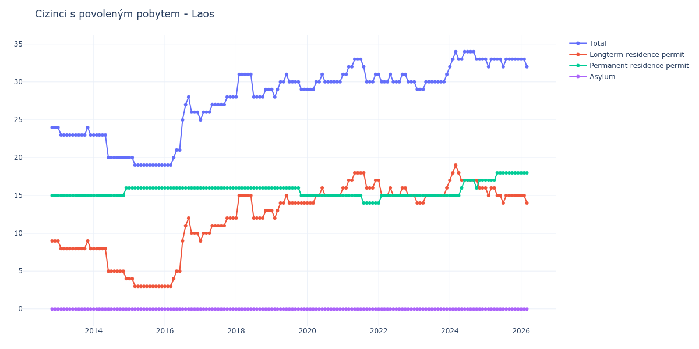

# Laos

## Souhrnné statistiky (Min/Max pro rok) / Summary Statistics (Min/Max per year)

| Year   | Total   | Longterm Residence Permit   | Permanent Residence Permit   | Asylum   |
|--------|---------|-----------------------------|------------------------------|----------|
| 2012   | 24 / 24 | 9 / 9                       | 15 / 15                      | 0 / 0    |
| 2013   | 23 / 24 | 8 / 9                       | 15 / 15                      | 0 / 0    |
| 2014   | 20 / 23 | 4 / 8                       | 15 / 16                      | 0 / 0    |
| 2015   | 19 / 20 | 3 / 4                       | 16 / 16                      | 0 / 0    |
| 2016   | 19 / 28 | 3 / 12                      | 16 / 16                      | 0 / 0    |
| 2017   | 25 / 28 | 9 / 12                      | 16 / 16                      | 0 / 0    |
| 2018   | 28 / 31 | 12 / 15                     | 16 / 16                      | 0 / 0    |
| 2019   | 28 / 31 | 12 / 15                     | 15 / 16                      | 0 / 0    |
| 2020   | 29 / 31 | 14 / 16                     | 15 / 15                      | 0 / 0    |
| 2021   | 30 / 33 | 16 / 18                     | 14 / 15                      | 0 / 0    |
| 2022   | 30 / 31 | 15 / 17                     | 14 / 15                      | 0 / 0    |
| 2023   | 29 / 31 | 14 / 16                     | 15 / 15                      | 0 / 0    |
| 2024   | 32 / 34 | 16 / 19                     | 15 / 17                      | 0 / 0    |
| 2025   | 32 / 33 | 14 / 16                     | 17 / 18                      | 0 / 0    |
| 2026   | 32 / 33 | 14 / 15                     | 18 / 18                      | 0 / 0    |

## Detailní tabulka / Detailed Data Table

| Date     | Total        | Longterm Residence Permit   | Permanent Residence Permit   | Asylum   |
|----------|--------------|-----------------------------|------------------------------|----------|
| **2012** |              |                             |                              |          |
| 11.2012  | 24           | 9                           | 15                           | 0        |
| 12.2012  | 24 (+0.00%)  | 9 (+0.00%)                  | 15 (+0.00%)                  | 0        |
| **2013** |              |                             |                              |          |
| 01.2013  | 24 (+0.00%)  | 9 (+0.00%)                  | 15 (+0.00%)                  | 0        |
| 02.2013  | 23 (-4.17%)  | 8 (-11.11%)                 | 15 (+0.00%)                  | 0        |
| 03.2013  | 23 (+0.00%)  | 8 (+0.00%)                  | 15 (+0.00%)                  | 0        |
| 04.2013  | 23 (+0.00%)  | 8 (+0.00%)                  | 15 (+0.00%)                  | 0        |
| 05.2013  | 23 (+0.00%)  | 8 (+0.00%)                  | 15 (+0.00%)                  | 0        |
| 06.2013  | 23 (+0.00%)  | 8 (+0.00%)                  | 15 (+0.00%)                  | 0        |
| 07.2013  | 23 (+0.00%)  | 8 (+0.00%)                  | 15 (+0.00%)                  | 0        |
| 08.2013  | 23 (+0.00%)  | 8 (+0.00%)                  | 15 (+0.00%)                  | 0        |
| 09.2013  | 23 (+0.00%)  | 8 (+0.00%)                  | 15 (+0.00%)                  | 0        |
| 10.2013  | 23 (+0.00%)  | 8 (+0.00%)                  | 15 (+0.00%)                  | 0        |
| 11.2013  | 24 (+4.35%)  | 9 (+12.50%)                 | 15 (+0.00%)                  | 0        |
| 12.2013  | 23 (-4.17%)  | 8 (-11.11%)                 | 15 (+0.00%)                  | 0        |
| **2014** |              |                             |                              |          |
| 01.2014  | 23 (+0.00%)  | 8 (+0.00%)                  | 15 (+0.00%)                  | 0        |
| 02.2014  | 23 (+0.00%)  | 8 (+0.00%)                  | 15 (+0.00%)                  | 0        |
| 03.2014  | 23 (+0.00%)  | 8 (+0.00%)                  | 15 (+0.00%)                  | 0        |
| 04.2014  | 23 (+0.00%)  | 8 (+0.00%)                  | 15 (+0.00%)                  | 0        |
| 05.2014  | 23 (+0.00%)  | 8 (+0.00%)                  | 15 (+0.00%)                  | 0        |
| 06.2014  | 20 (-13.04%) | 5 (-37.50%)                 | 15 (+0.00%)                  | 0        |
| 07.2014  | 20 (+0.00%)  | 5 (+0.00%)                  | 15 (+0.00%)                  | 0        |
| 08.2014  | 20 (+0.00%)  | 5 (+0.00%)                  | 15 (+0.00%)                  | 0        |
| 09.2014  | 20 (+0.00%)  | 5 (+0.00%)                  | 15 (+0.00%)                  | 0        |
| 10.2014  | 20 (+0.00%)  | 5 (+0.00%)                  | 15 (+0.00%)                  | 0        |
| 11.2014  | 20 (+0.00%)  | 5 (+0.00%)                  | 15 (+0.00%)                  | 0        |
| 12.2014  | 20 (+0.00%)  | 4 (-20.00%)                 | 16 (+6.67%)                  | 0        |
| **2015** |              |                             |                              |          |
| 01.2015  | 20 (+0.00%)  | 4 (+0.00%)                  | 16 (+0.00%)                  | 0        |
| 02.2015  | 20 (+0.00%)  | 4 (+0.00%)                  | 16 (+0.00%)                  | 0        |
| 03.2015  | 19 (-5.00%)  | 3 (-25.00%)                 | 16 (+0.00%)                  | 0        |
| 04.2015  | 19 (+0.00%)  | 3 (+0.00%)                  | 16 (+0.00%)                  | 0        |
| 05.2015  | 19 (+0.00%)  | 3 (+0.00%)                  | 16 (+0.00%)                  | 0        |
| 06.2015  | 19 (+0.00%)  | 3 (+0.00%)                  | 16 (+0.00%)                  | 0        |
| 07.2015  | 19 (+0.00%)  | 3 (+0.00%)                  | 16 (+0.00%)                  | 0        |
| 08.2015  | 19 (+0.00%)  | 3 (+0.00%)                  | 16 (+0.00%)                  | 0        |
| 09.2015  | 19 (+0.00%)  | 3 (+0.00%)                  | 16 (+0.00%)                  | 0        |
| 10.2015  | 19 (+0.00%)  | 3 (+0.00%)                  | 16 (+0.00%)                  | 0        |
| 11.2015  | 19 (+0.00%)  | 3 (+0.00%)                  | 16 (+0.00%)                  | 0        |
| 12.2015  | 19 (+0.00%)  | 3 (+0.00%)                  | 16 (+0.00%)                  | 0        |
| **2016** |              |                             |                              |          |
| 01.2016  | 19 (+0.00%)  | 3 (+0.00%)                  | 16 (+0.00%)                  | 0        |
| 02.2016  | 19 (+0.00%)  | 3 (+0.00%)                  | 16 (+0.00%)                  | 0        |
| 03.2016  | 19 (+0.00%)  | 3 (+0.00%)                  | 16 (+0.00%)                  | 0        |
| 04.2016  | 20 (+5.26%)  | 4 (+33.33%)                 | 16 (+0.00%)                  | 0        |
| 05.2016  | 21 (+5.00%)  | 5 (+25.00%)                 | 16 (+0.00%)                  | 0        |
| 06.2016  | 21 (+0.00%)  | 5 (+0.00%)                  | 16 (+0.00%)                  | 0        |
| 07.2016  | 25 (+19.05%) | 9 (+80.00%)                 | 16 (+0.00%)                  | 0        |
| 08.2016  | 27 (+8.00%)  | 11 (+22.22%)                | 16 (+0.00%)                  | 0        |
| 09.2016  | 28 (+3.70%)  | 12 (+9.09%)                 | 16 (+0.00%)                  | 0        |
| 10.2016  | 26 (-7.14%)  | 10 (-16.67%)                | 16 (+0.00%)                  | 0        |
| 11.2016  | 26 (+0.00%)  | 10 (+0.00%)                 | 16 (+0.00%)                  | 0        |
| 12.2016  | 26 (+0.00%)  | 10 (+0.00%)                 | 16 (+0.00%)                  | 0        |
| **2017** |              |                             |                              |          |
| 01.2017  | 25 (-3.85%)  | 9 (-10.00%)                 | 16 (+0.00%)                  | 0        |
| 02.2017  | 26 (+4.00%)  | 10 (+11.11%)                | 16 (+0.00%)                  | 0        |
| 03.2017  | 26 (+0.00%)  | 10 (+0.00%)                 | 16 (+0.00%)                  | 0        |
| 04.2017  | 26 (+0.00%)  | 10 (+0.00%)                 | 16 (+0.00%)                  | 0        |
| 05.2017  | 27 (+3.85%)  | 11 (+10.00%)                | 16 (+0.00%)                  | 0        |
| 06.2017  | 27 (+0.00%)  | 11 (+0.00%)                 | 16 (+0.00%)                  | 0        |
| 07.2017  | 27 (+0.00%)  | 11 (+0.00%)                 | 16 (+0.00%)                  | 0        |
| 08.2017  | 27 (+0.00%)  | 11 (+0.00%)                 | 16 (+0.00%)                  | 0        |
| 09.2017  | 27 (+0.00%)  | 11 (+0.00%)                 | 16 (+0.00%)                  | 0        |
| 10.2017  | 28 (+3.70%)  | 12 (+9.09%)                 | 16 (+0.00%)                  | 0        |
| 11.2017  | 28 (+0.00%)  | 12 (+0.00%)                 | 16 (+0.00%)                  | 0        |
| 12.2017  | 28 (+0.00%)  | 12 (+0.00%)                 | 16 (+0.00%)                  | 0        |
| **2018** |              |                             |                              |          |
| 01.2018  | 28 (+0.00%)  | 12 (+0.00%)                 | 16 (+0.00%)                  | 0        |
| 02.2018  | 31 (+10.71%) | 15 (+25.00%)                | 16 (+0.00%)                  | 0        |
| 03.2018  | 31 (+0.00%)  | 15 (+0.00%)                 | 16 (+0.00%)                  | 0        |
| 04.2018  | 31 (+0.00%)  | 15 (+0.00%)                 | 16 (+0.00%)                  | 0        |
| 05.2018  | 31 (+0.00%)  | 15 (+0.00%)                 | 16 (+0.00%)                  | 0        |
| 06.2018  | 31 (+0.00%)  | 15 (+0.00%)                 | 16 (+0.00%)                  | 0        |
| 07.2018  | 28 (-9.68%)  | 12 (-20.00%)                | 16 (+0.00%)                  | 0        |
| 08.2018  | 28 (+0.00%)  | 12 (+0.00%)                 | 16 (+0.00%)                  | 0        |
| 09.2018  | 28 (+0.00%)  | 12 (+0.00%)                 | 16 (+0.00%)                  | 0        |
| 10.2018  | 28 (+0.00%)  | 12 (+0.00%)                 | 16 (+0.00%)                  | 0        |
| 11.2018  | 29 (+3.57%)  | 13 (+8.33%)                 | 16 (+0.00%)                  | 0        |
| 12.2018  | 29 (+0.00%)  | 13 (+0.00%)                 | 16 (+0.00%)                  | 0        |
| **2019** |              |                             |                              |          |
| 01.2019  | 29 (+0.00%)  | 13 (+0.00%)                 | 16 (+0.00%)                  | 0        |
| 02.2019  | 28 (-3.45%)  | 12 (-7.69%)                 | 16 (+0.00%)                  | 0        |
| 03.2019  | 29 (+3.57%)  | 13 (+8.33%)                 | 16 (+0.00%)                  | 0        |
| 04.2019  | 30 (+3.45%)  | 14 (+7.69%)                 | 16 (+0.00%)                  | 0        |
| 05.2019  | 30 (+0.00%)  | 14 (+0.00%)                 | 16 (+0.00%)                  | 0        |
| 06.2019  | 31 (+3.33%)  | 15 (+7.14%)                 | 16 (+0.00%)                  | 0        |
| 07.2019  | 30 (-3.23%)  | 14 (-6.67%)                 | 16 (+0.00%)                  | 0        |
| 08.2019  | 30 (+0.00%)  | 14 (+0.00%)                 | 16 (+0.00%)                  | 0        |
| 09.2019  | 30 (+0.00%)  | 14 (+0.00%)                 | 16 (+0.00%)                  | 0        |
| 10.2019  | 30 (+0.00%)  | 14 (+0.00%)                 | 16 (+0.00%)                  | 0        |
| 11.2019  | 29 (-3.33%)  | 14 (+0.00%)                 | 15 (-6.25%)                  | 0        |
| 12.2019  | 29 (+0.00%)  | 14 (+0.00%)                 | 15 (+0.00%)                  | 0        |
| **2020** |              |                             |                              |          |
| 01.2020  | 29 (+0.00%)  | 14 (+0.00%)                 | 15 (+0.00%)                  | 0        |
| 02.2020  | 29 (+0.00%)  | 14 (+0.00%)                 | 15 (+0.00%)                  | 0        |
| 03.2020  | 29 (+0.00%)  | 14 (+0.00%)                 | 15 (+0.00%)                  | 0        |
| 04.2020  | 30 (+3.45%)  | 15 (+7.14%)                 | 15 (+0.00%)                  | 0        |
| 05.2020  | 30 (+0.00%)  | 15 (+0.00%)                 | 15 (+0.00%)                  | 0        |
| 06.2020  | 31 (+3.33%)  | 16 (+6.67%)                 | 15 (+0.00%)                  | 0        |
| 07.2020  | 30 (-3.23%)  | 15 (-6.25%)                 | 15 (+0.00%)                  | 0        |
| 08.2020  | 30 (+0.00%)  | 15 (+0.00%)                 | 15 (+0.00%)                  | 0        |
| 09.2020  | 30 (+0.00%)  | 15 (+0.00%)                 | 15 (+0.00%)                  | 0        |
| 10.2020  | 30 (+0.00%)  | 15 (+0.00%)                 | 15 (+0.00%)                  | 0        |
| 11.2020  | 30 (+0.00%)  | 15 (+0.00%)                 | 15 (+0.00%)                  | 0        |
| 12.2020  | 30 (+0.00%)  | 15 (+0.00%)                 | 15 (+0.00%)                  | 0        |
| **2021** |              |                             |                              |          |
| 01.2021  | 31 (+3.33%)  | 16 (+6.67%)                 | 15 (+0.00%)                  | 0        |
| 02.2021  | 31 (+0.00%)  | 16 (+0.00%)                 | 15 (+0.00%)                  | 0        |
| 03.2021  | 32 (+3.23%)  | 17 (+6.25%)                 | 15 (+0.00%)                  | 0        |
| 04.2021  | 32 (+0.00%)  | 17 (+0.00%)                 | 15 (+0.00%)                  | 0        |
| 05.2021  | 33 (+3.12%)  | 18 (+5.88%)                 | 15 (+0.00%)                  | 0        |
| 06.2021  | 33 (+0.00%)  | 18 (+0.00%)                 | 15 (+0.00%)                  | 0        |
| 07.2021  | 33 (+0.00%)  | 18 (+0.00%)                 | 15 (+0.00%)                  | 0        |
| 08.2021  | 32 (-3.03%)  | 18 (+0.00%)                 | 14 (-6.67%)                  | 0        |
| 09.2021  | 30 (-6.25%)  | 16 (-11.11%)                | 14 (+0.00%)                  | 0        |
| 10.2021  | 30 (+0.00%)  | 16 (+0.00%)                 | 14 (+0.00%)                  | 0        |
| 11.2021  | 30 (+0.00%)  | 16 (+0.00%)                 | 14 (+0.00%)                  | 0        |
| 12.2021  | 31 (+3.33%)  | 17 (+6.25%)                 | 14 (+0.00%)                  | 0        |
| **2022** |              |                             |                              |          |
| 01.2022  | 31 (+0.00%)  | 17 (+0.00%)                 | 14 (+0.00%)                  | 0        |
| 02.2022  | 30 (-3.23%)  | 15 (-11.76%)                | 15 (+7.14%)                  | 0        |
| 03.2022  | 30 (+0.00%)  | 15 (+0.00%)                 | 15 (+0.00%)                  | 0        |
| 04.2022  | 30 (+0.00%)  | 15 (+0.00%)                 | 15 (+0.00%)                  | 0        |
| 05.2022  | 31 (+3.33%)  | 16 (+6.67%)                 | 15 (+0.00%)                  | 0        |
| 06.2022  | 30 (-3.23%)  | 15 (-6.25%)                 | 15 (+0.00%)                  | 0        |
| 07.2022  | 30 (+0.00%)  | 15 (+0.00%)                 | 15 (+0.00%)                  | 0        |
| 08.2022  | 30 (+0.00%)  | 15 (+0.00%)                 | 15 (+0.00%)                  | 0        |
| 09.2022  | 31 (+3.33%)  | 16 (+6.67%)                 | 15 (+0.00%)                  | 0        |
| 10.2022  | 31 (+0.00%)  | 16 (+0.00%)                 | 15 (+0.00%)                  | 0        |
| 11.2022  | 30 (-3.23%)  | 15 (-6.25%)                 | 15 (+0.00%)                  | 0        |
| 12.2022  | 30 (+0.00%)  | 15 (+0.00%)                 | 15 (+0.00%)                  | 0        |
| **2023** |              |                             |                              |          |
| 01.2023  | 30 (+0.00%)  | 15 (+0.00%)                 | 15 (+0.00%)                  | 0        |
| 02.2023  | 29 (-3.33%)  | 14 (-6.67%)                 | 15 (+0.00%)                  | 0        |
| 03.2023  | 29 (+0.00%)  | 14 (+0.00%)                 | 15 (+0.00%)                  | 0        |
| 04.2023  | 29 (+0.00%)  | 14 (+0.00%)                 | 15 (+0.00%)                  | 0        |
| 05.2023  | 30 (+3.45%)  | 15 (+7.14%)                 | 15 (+0.00%)                  | 0        |
| 06.2023  | 30 (+0.00%)  | 15 (+0.00%)                 | 15 (+0.00%)                  | 0        |
| 07.2023  | 30 (+0.00%)  | 15 (+0.00%)                 | 15 (+0.00%)                  | 0        |
| 08.2023  | 30 (+0.00%)  | 15 (+0.00%)                 | 15 (+0.00%)                  | 0        |
| 09.2023  | 30 (+0.00%)  | 15 (+0.00%)                 | 15 (+0.00%)                  | 0        |
| 10.2023  | 30 (+0.00%)  | 15 (+0.00%)                 | 15 (+0.00%)                  | 0        |
| 11.2023  | 30 (+0.00%)  | 15 (+0.00%)                 | 15 (+0.00%)                  | 0        |
| 12.2023  | 31 (+3.33%)  | 16 (+6.67%)                 | 15 (+0.00%)                  | 0        |
| **2024** |              |                             |                              |          |
| 01.2024  | 32 (+3.23%)  | 17 (+6.25%)                 | 15 (+0.00%)                  | 0        |
| 02.2024  | 33 (+3.12%)  | 18 (+5.88%)                 | 15 (+0.00%)                  | 0        |
| 03.2024  | 34 (+3.03%)  | 19 (+5.56%)                 | 15 (+0.00%)                  | 0        |
| 04.2024  | 33 (-2.94%)  | 18 (-5.26%)                 | 15 (+0.00%)                  | 0        |
| 05.2024  | 33 (+0.00%)  | 17 (-5.56%)                 | 16 (+6.67%)                  | 0        |
| 06.2024  | 34 (+3.03%)  | 17 (+0.00%)                 | 17 (+6.25%)                  | 0        |
| 07.2024  | 34 (+0.00%)  | 17 (+0.00%)                 | 17 (+0.00%)                  | 0        |
| 08.2024  | 34 (+0.00%)  | 17 (+0.00%)                 | 17 (+0.00%)                  | 0        |
| 09.2024  | 34 (+0.00%)  | 17 (+0.00%)                 | 17 (+0.00%)                  | 0        |
| 10.2024  | 33 (-2.94%)  | 17 (+0.00%)                 | 16 (-5.88%)                  | 0        |
| 11.2024  | 33 (+0.00%)  | 16 (-5.88%)                 | 17 (+6.25%)                  | 0        |
| 12.2024  | 33 (+0.00%)  | 16 (+0.00%)                 | 17 (+0.00%)                  | 0        |
| **2025** |              |                             |                              |          |
| 01.2025  | 33 (+0.00%)  | 16 (+0.00%)                 | 17 (+0.00%)                  | 0        |
| 02.2025  | 32 (-3.03%)  | 15 (-6.25%)                 | 17 (+0.00%)                  | 0        |
| 03.2025  | 33 (+3.12%)  | 16 (+6.67%)                 | 17 (+0.00%)                  | 0        |
| 04.2025  | 33 (+0.00%)  | 16 (+0.00%)                 | 17 (+0.00%)                  | 0        |
| 05.2025  | 33 (+0.00%)  | 15 (-6.25%)                 | 18 (+5.88%)                  | 0        |
| 06.2025  | 33 (+0.00%)  | 15 (+0.00%)                 | 18 (+0.00%)                  | 0        |
| 07.2025  | 32 (-3.03%)  | 14 (-6.67%)                 | 18 (+0.00%)                  | 0        |
| 08.2025  | 33 (+3.12%)  | 15 (+7.14%)                 | 18 (+0.00%)                  | 0        |
| 09.2025  | 33 (+0.00%)  | 15 (+0.00%)                 | 18 (+0.00%)                  | 0        |
| 10.2025  | 33 (+0.00%)  | 15 (+0.00%)                 | 18 (+0.00%)                  | 0        |
| 11.2025  | 33 (+0.00%)  | 15 (+0.00%)                 | 18 (+0.00%)                  | 0        |
| 12.2025  | 33 (+0.00%)  | 15 (+0.00%)                 | 18 (+0.00%)                  | 0        |
| **2026** |              |                             |                              |          |
| 01.2026  | 33 (+0.00%)  | 15 (+0.00%)                 | 18 (+0.00%)                  | 0        |
| 02.2026  | 33 (+0.00%)  | 15 (+0.00%)                 | 18 (+0.00%)                  | 0        |
| 03.2026  | 32 (-3.03%)  | 14 (-6.67%)                 | 18 (+0.00%)                  | 0        |
