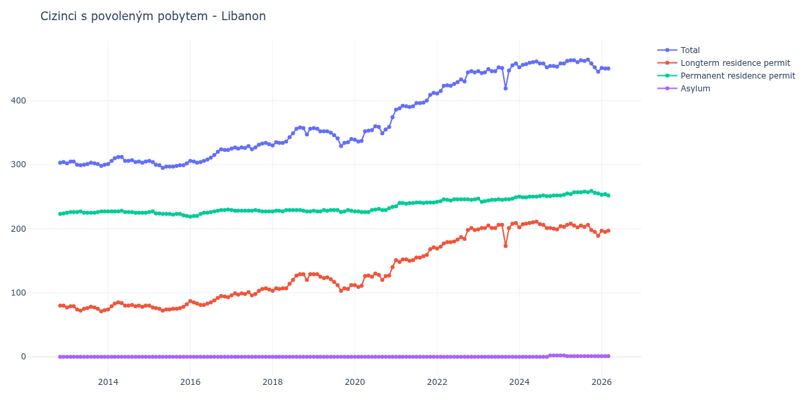

# Libanon

## Souhrnné statistiky (Min/Max pro rok) / Summary Statistics (Min/Max per year)

| Year   | Total     | Longterm Residence Permit   | Permanent Residence Permit   | Asylum   |
|--------|-----------|-----------------------------|------------------------------|----------|
| 2012   | 303 / 304 | 80 / 80                     | 223 / 224                    | 0 / 0    |
| 2013   | 298 / 305 | 71 / 79                     | 225 / 227                    | 0 / 0    |
| 2014   | 301 / 312 | 74 / 85                     | 225 / 228                    | 0 / 0    |
| 2015   | 295 / 306 | 72 / 82                     | 220 / 227                    | 0 / 0    |
| 2016   | 303 / 324 | 81 / 95                     | 219 / 230                    | 0 / 0    |
| 2017   | 324 / 334 | 96 / 107                    | 227 / 229                    | 0 / 0    |
| 2018   | 330 / 358 | 103 / 129                   | 227 / 229                    | 0 / 0    |
| 2019   | 329 / 357 | 103 / 129                   | 226 / 229                    | 0 / 0    |
| 2020   | 336 / 374 | 109 / 140                   | 226 / 234                    | 0 / 0    |
| 2021   | 386 / 412 | 148 / 171                   | 235 / 241                    | 0 / 0    |
| 2022   | 411 / 446 | 169 / 201                   | 242 / 246                    | 0 / 0    |
| 2023   | 419 / 458 | 173 / 209                   | 242 / 249                    | 0 / 0    |
| 2024   | 452 / 461 | 199 / 211                   | 249 / 252                    | 0 / 2    |
| 2025   | 445 / 464 | 189 / 208                   | 252 / 259                    | 1 / 2    |
| 2026   | 450 / 451 | 195 / 197                   | 252 / 254                    | 1 / 1    |

## Detailní tabulka / Detailed Data Table

| Date     | Total        | Longterm Residence Permit   | Permanent Residence Permit   | Asylum      |
|----------|--------------|-----------------------------|------------------------------|-------------|
| **2012** |              |                             |                              |             |
| 11.2012  | 303          | 80                          | 223                          | 0           |
| 12.2012  | 304 (+0.33%) | 80 (+0.00%)                 | 224 (+0.45%)                 | 0           |
| **2013** |              |                             |                              |             |
| 01.2013  | 302 (-0.66%) | 77 (-3.75%)                 | 225 (+0.45%)                 | 0           |
| 02.2013  | 305 (+0.99%) | 79 (+2.60%)                 | 226 (+0.44%)                 | 0           |
| 03.2013  | 305 (+0.00%) | 79 (+0.00%)                 | 226 (+0.00%)                 | 0           |
| 04.2013  | 300 (-1.64%) | 74 (-6.33%)                 | 226 (+0.00%)                 | 0           |
| 05.2013  | 299 (-0.33%) | 72 (-2.70%)                 | 227 (+0.44%)                 | 0           |
| 06.2013  | 300 (+0.33%) | 75 (+4.17%)                 | 225 (-0.88%)                 | 0           |
| 07.2013  | 301 (+0.33%) | 76 (+1.33%)                 | 225 (+0.00%)                 | 0           |
| 08.2013  | 303 (+0.66%) | 78 (+2.63%)                 | 225 (+0.00%)                 | 0           |
| 09.2013  | 302 (-0.33%) | 77 (-1.28%)                 | 225 (+0.00%)                 | 0           |
| 10.2013  | 301 (-0.33%) | 75 (-2.60%)                 | 226 (+0.44%)                 | 0           |
| 11.2013  | 298 (-1.00%) | 71 (-5.33%)                 | 227 (+0.44%)                 | 0           |
| 12.2013  | 300 (+0.67%) | 73 (+2.82%)                 | 227 (+0.00%)                 | 0           |
| **2014** |              |                             |                              |             |
| 01.2014  | 301 (+0.33%) | 74 (+1.37%)                 | 227 (+0.00%)                 | 0           |
| 02.2014  | 306 (+1.66%) | 79 (+6.76%)                 | 227 (+0.00%)                 | 0           |
| 03.2014  | 310 (+1.31%) | 83 (+5.06%)                 | 227 (+0.00%)                 | 0           |
| 04.2014  | 312 (+0.65%) | 85 (+2.41%)                 | 227 (+0.00%)                 | 0           |
| 05.2014  | 312 (+0.00%) | 84 (-1.18%)                 | 228 (+0.44%)                 | 0           |
| 06.2014  | 306 (-1.92%) | 80 (-4.76%)                 | 226 (-0.88%)                 | 0           |
| 07.2014  | 306 (+0.00%) | 80 (+0.00%)                 | 226 (+0.00%)                 | 0           |
| 08.2014  | 307 (+0.33%) | 81 (+1.25%)                 | 226 (+0.00%)                 | 0           |
| 09.2014  | 304 (-0.98%) | 79 (-2.47%)                 | 225 (-0.44%)                 | 0           |
| 10.2014  | 305 (+0.33%) | 80 (+1.27%)                 | 225 (+0.00%)                 | 0           |
| 11.2014  | 303 (-0.66%) | 78 (-2.50%)                 | 225 (+0.00%)                 | 0           |
| 12.2014  | 305 (+0.66%) | 80 (+2.56%)                 | 225 (+0.00%)                 | 0           |
| **2015** |              |                             |                              |             |
| 01.2015  | 306 (+0.33%) | 80 (+0.00%)                 | 226 (+0.44%)                 | 0           |
| 02.2015  | 304 (-0.65%) | 77 (-3.75%)                 | 227 (+0.44%)                 | 0           |
| 03.2015  | 300 (-1.32%) | 76 (-1.30%)                 | 224 (-1.32%)                 | 0           |
| 04.2015  | 299 (-0.33%) | 75 (-1.32%)                 | 224 (+0.00%)                 | 0           |
| 05.2015  | 295 (-1.34%) | 72 (-4.00%)                 | 223 (-0.45%)                 | 0           |
| 06.2015  | 297 (+0.68%) | 74 (+2.78%)                 | 223 (+0.00%)                 | 0           |
| 07.2015  | 297 (+0.00%) | 74 (+0.00%)                 | 223 (+0.00%)                 | 0           |
| 08.2015  | 297 (+0.00%) | 75 (+1.35%)                 | 222 (-0.45%)                 | 0           |
| 09.2015  | 298 (+0.34%) | 75 (+0.00%)                 | 223 (+0.45%)                 | 0           |
| 10.2015  | 299 (+0.34%) | 76 (+1.33%)                 | 223 (+0.00%)                 | 0           |
| 11.2015  | 299 (+0.00%) | 78 (+2.63%)                 | 221 (-0.90%)                 | 0           |
| 12.2015  | 302 (+1.00%) | 82 (+5.13%)                 | 220 (-0.45%)                 | 0           |
| **2016** |              |                             |                              |             |
| 01.2016  | 306 (+1.32%) | 87 (+6.10%)                 | 219 (-0.45%)                 | 0           |
| 02.2016  | 305 (-0.33%) | 85 (-2.30%)                 | 220 (+0.46%)                 | 0           |
| 03.2016  | 303 (-0.66%) | 83 (-2.35%)                 | 220 (+0.00%)                 | 0           |
| 04.2016  | 304 (+0.33%) | 81 (-2.41%)                 | 223 (+1.36%)                 | 0           |
| 05.2016  | 306 (+0.66%) | 81 (+0.00%)                 | 225 (+0.90%)                 | 0           |
| 06.2016  | 308 (+0.65%) | 83 (+2.47%)                 | 225 (+0.00%)                 | 0           |
| 07.2016  | 311 (+0.97%) | 85 (+2.41%)                 | 226 (+0.44%)                 | 0           |
| 08.2016  | 315 (+1.29%) | 88 (+3.53%)                 | 227 (+0.44%)                 | 0           |
| 09.2016  | 320 (+1.59%) | 92 (+4.55%)                 | 228 (+0.44%)                 | 0           |
| 10.2016  | 324 (+1.25%) | 95 (+3.26%)                 | 229 (+0.44%)                 | 0           |
| 11.2016  | 323 (-0.31%) | 94 (-1.05%)                 | 229 (+0.00%)                 | 0           |
| 12.2016  | 323 (+0.00%) | 93 (-1.06%)                 | 230 (+0.44%)                 | 0           |
| **2017** |              |                             |                              |             |
| 01.2017  | 325 (+0.62%) | 96 (+3.23%)                 | 229 (-0.43%)                 | 0           |
| 02.2017  | 327 (+0.62%) | 99 (+3.12%)                 | 228 (-0.44%)                 | 0           |
| 03.2017  | 325 (-0.61%) | 97 (-2.02%)                 | 228 (+0.00%)                 | 0           |
| 04.2017  | 327 (+0.62%) | 99 (+2.06%)                 | 228 (+0.00%)                 | 0           |
| 05.2017  | 326 (-0.31%) | 98 (-1.01%)                 | 228 (+0.00%)                 | 0           |
| 06.2017  | 329 (+0.92%) | 101 (+3.06%)                | 228 (+0.00%)                 | 0           |
| 07.2017  | 324 (-1.52%) | 96 (-4.95%)                 | 228 (+0.00%)                 | 0           |
| 08.2017  | 327 (+0.93%) | 98 (+2.08%)                 | 229 (+0.44%)                 | 0           |
| 09.2017  | 331 (+1.22%) | 103 (+5.10%)                | 228 (-0.44%)                 | 0           |
| 10.2017  | 333 (+0.60%) | 106 (+2.91%)                | 227 (-0.44%)                 | 0           |
| 11.2017  | 334 (+0.30%) | 107 (+0.94%)                | 227 (+0.00%)                 | 0           |
| 12.2017  | 332 (-0.60%) | 105 (-1.87%)                | 227 (+0.00%)                 | 0           |
| **2018** |              |                             |                              |             |
| 01.2018  | 330 (-0.60%) | 103 (-1.90%)                | 227 (+0.00%)                 | 0           |
| 02.2018  | 335 (+1.52%) | 107 (+3.88%)                | 228 (+0.44%)                 | 0           |
| 03.2018  | 334 (-0.30%) | 106 (-0.93%)                | 228 (+0.00%)                 | 0           |
| 04.2018  | 334 (+0.00%) | 107 (+0.94%)                | 227 (-0.44%)                 | 0           |
| 05.2018  | 336 (+0.60%) | 107 (+0.00%)                | 229 (+0.88%)                 | 0           |
| 06.2018  | 343 (+2.08%) | 114 (+6.54%)                | 229 (+0.00%)                 | 0           |
| 07.2018  | 349 (+1.75%) | 120 (+5.26%)                | 229 (+0.00%)                 | 0           |
| 08.2018  | 356 (+2.01%) | 127 (+5.83%)                | 229 (+0.00%)                 | 0           |
| 09.2018  | 358 (+0.56%) | 129 (+1.57%)                | 229 (+0.00%)                 | 0           |
| 10.2018  | 357 (-0.28%) | 129 (+0.00%)                | 228 (-0.44%)                 | 0           |
| 11.2018  | 347 (-2.80%) | 120 (-6.98%)                | 227 (-0.44%)                 | 0           |
| 12.2018  | 356 (+2.59%) | 129 (+7.50%)                | 227 (+0.00%)                 | 0           |
| **2019** |              |                             |                              |             |
| 01.2019  | 357 (+0.28%) | 129 (+0.00%)                | 228 (+0.44%)                 | 0           |
| 02.2019  | 356 (-0.28%) | 129 (+0.00%)                | 227 (-0.44%)                 | 0           |
| 03.2019  | 352 (-1.12%) | 125 (-3.10%)                | 227 (+0.00%)                 | 0           |
| 04.2019  | 352 (+0.00%) | 123 (-1.60%)                | 229 (+0.88%)                 | 0           |
| 05.2019  | 352 (+0.00%) | 124 (+0.81%)                | 228 (-0.44%)                 | 0           |
| 06.2019  | 350 (-0.57%) | 121 (-2.42%)                | 229 (+0.44%)                 | 0           |
| 07.2019  | 346 (-1.14%) | 117 (-3.31%)                | 229 (+0.00%)                 | 0           |
| 08.2019  | 341 (-1.45%) | 112 (-4.27%)                | 229 (+0.00%)                 | 0           |
| 09.2019  | 329 (-3.52%) | 103 (-8.04%)                | 226 (-1.31%)                 | 0           |
| 10.2019  | 334 (+1.52%) | 107 (+3.88%)                | 227 (+0.44%)                 | 0           |
| 11.2019  | 335 (+0.30%) | 106 (-0.93%)                | 229 (+0.88%)                 | 0           |
| 12.2019  | 340 (+1.49%) | 112 (+5.66%)                | 228 (-0.44%)                 | 0           |
| **2020** |              |                             |                              |             |
| 01.2020  | 339 (-0.29%) | 112 (+0.00%)                | 227 (-0.44%)                 | 0           |
| 02.2020  | 336 (-0.88%) | 109 (-2.68%)                | 227 (+0.00%)                 | 0           |
| 03.2020  | 337 (+0.30%) | 111 (+1.83%)                | 226 (-0.44%)                 | 0           |
| 04.2020  | 352 (+4.45%) | 126 (+13.51%)               | 226 (+0.00%)                 | 0           |
| 05.2020  | 353 (+0.28%) | 127 (+0.79%)                | 226 (+0.00%)                 | 0           |
| 06.2020  | 354 (+0.28%) | 125 (-1.57%)                | 229 (+1.33%)                 | 0           |
| 07.2020  | 360 (+1.69%) | 130 (+4.00%)                | 230 (+0.44%)                 | 0           |
| 08.2020  | 359 (-0.28%) | 128 (-1.54%)                | 231 (+0.43%)                 | 0           |
| 09.2020  | 349 (-2.79%) | 120 (-6.25%)                | 229 (-0.87%)                 | 0           |
| 10.2020  | 355 (+1.72%) | 126 (+5.00%)                | 229 (+0.00%)                 | 0           |
| 11.2020  | 359 (+1.13%) | 127 (+0.79%)                | 232 (+1.31%)                 | 0           |
| 12.2020  | 374 (+4.18%) | 140 (+10.24%)               | 234 (+0.86%)                 | 0           |
| **2021** |              |                             |                              |             |
| 01.2021  | 386 (+3.21%) | 151 (+7.86%)                | 235 (+0.43%)                 | 0           |
| 02.2021  | 388 (+0.52%) | 148 (-1.99%)                | 240 (+2.13%)                 | 0           |
| 03.2021  | 392 (+1.03%) | 152 (+2.70%)                | 240 (+0.00%)                 | 0           |
| 04.2021  | 391 (-0.26%) | 152 (+0.00%)                | 239 (-0.42%)                 | 0           |
| 05.2021  | 390 (-0.26%) | 150 (-1.32%)                | 240 (+0.42%)                 | 0           |
| 06.2021  | 391 (+0.26%) | 151 (+0.67%)                | 240 (+0.00%)                 | 0           |
| 07.2021  | 396 (+1.28%) | 155 (+2.65%)                | 241 (+0.42%)                 | 0           |
| 08.2021  | 396 (+0.00%) | 155 (+0.00%)                | 241 (+0.00%)                 | 0           |
| 09.2021  | 397 (+0.25%) | 157 (+1.29%)                | 240 (-0.41%)                 | 0           |
| 10.2021  | 400 (+0.76%) | 159 (+1.27%)                | 241 (+0.42%)                 | 0           |
| 11.2021  | 409 (+2.25%) | 168 (+5.66%)                | 241 (+0.00%)                 | 0           |
| 12.2021  | 412 (+0.73%) | 171 (+1.79%)                | 241 (+0.00%)                 | 0           |
| **2022** |              |                             |                              |             |
| 01.2022  | 411 (-0.24%) | 169 (-1.17%)                | 242 (+0.41%)                 | 0           |
| 02.2022  | 415 (+0.97%) | 172 (+1.78%)                | 243 (+0.41%)                 | 0           |
| 03.2022  | 423 (+1.93%) | 177 (+2.91%)                | 246 (+1.23%)                 | 0           |
| 04.2022  | 424 (+0.24%) | 179 (+1.13%)                | 245 (-0.41%)                 | 0           |
| 05.2022  | 423 (-0.24%) | 179 (+0.00%)                | 244 (-0.41%)                 | 0           |
| 06.2022  | 426 (+0.71%) | 180 (+0.56%)                | 246 (+0.82%)                 | 0           |
| 07.2022  | 429 (+0.70%) | 183 (+1.67%)                | 246 (+0.00%)                 | 0           |
| 08.2022  | 433 (+0.93%) | 187 (+2.19%)                | 246 (+0.00%)                 | 0           |
| 09.2022  | 430 (-0.69%) | 184 (-1.60%)                | 246 (+0.00%)                 | 0           |
| 10.2022  | 444 (+3.26%) | 198 (+7.61%)                | 246 (+0.00%)                 | 0           |
| 11.2022  | 446 (+0.45%) | 201 (+1.52%)                | 245 (-0.41%)                 | 0           |
| 12.2022  | 444 (-0.45%) | 198 (-1.49%)                | 246 (+0.41%)                 | 0           |
| **2023** |              |                             |                              |             |
| 01.2023  | 446 (+0.45%) | 199 (+0.51%)                | 247 (+0.41%)                 | 0           |
| 02.2023  | 443 (-0.67%) | 201 (+1.01%)                | 242 (-2.02%)                 | 0           |
| 03.2023  | 444 (+0.23%) | 201 (+0.00%)                | 243 (+0.41%)                 | 0           |
| 04.2023  | 449 (+1.13%) | 205 (+1.99%)                | 244 (+0.41%)                 | 0           |
| 05.2023  | 446 (-0.67%) | 201 (-1.95%)                | 245 (+0.41%)                 | 0           |
| 06.2023  | 446 (+0.00%) | 201 (+0.00%)                | 245 (+0.00%)                 | 0           |
| 07.2023  | 452 (+1.35%) | 206 (+2.49%)                | 246 (+0.41%)                 | 0           |
| 08.2023  | 451 (-0.22%) | 206 (+0.00%)                | 245 (-0.41%)                 | 0           |
| 09.2023  | 419 (-7.10%) | 173 (-16.02%)               | 246 (+0.41%)                 | 0           |
| 10.2023  | 447 (+6.68%) | 201 (+16.18%)               | 246 (+0.00%)                 | 0           |
| 11.2023  | 455 (+1.79%) | 208 (+3.48%)                | 247 (+0.41%)                 | 0           |
| 12.2023  | 458 (+0.66%) | 209 (+0.48%)                | 249 (+0.81%)                 | 0           |
| **2024** |              |                             |                              |             |
| 01.2024  | 452 (-1.31%) | 202 (-3.35%)                | 250 (+0.40%)                 | 0           |
| 02.2024  | 456 (+0.88%) | 207 (+2.48%)                | 249 (-0.40%)                 | 0           |
| 03.2024  | 457 (+0.22%) | 208 (+0.48%)                | 249 (+0.00%)                 | 0           |
| 04.2024  | 459 (+0.44%) | 209 (+0.48%)                | 250 (+0.40%)                 | 0           |
| 05.2024  | 460 (+0.22%) | 210 (+0.48%)                | 250 (+0.00%)                 | 0           |
| 06.2024  | 461 (+0.22%) | 211 (+0.48%)                | 250 (+0.00%)                 | 0           |
| 07.2024  | 458 (-0.65%) | 207 (-1.90%)                | 251 (+0.40%)                 | 0           |
| 08.2024  | 458 (+0.00%) | 206 (-0.48%)                | 252 (+0.40%)                 | 0           |
| 09.2024  | 452 (-1.31%) | 201 (-2.43%)                | 251 (-0.40%)                 | 0           |
| 10.2024  | 454 (+0.44%) | 201 (+0.00%)                | 251 (+0.00%)                 | 2           |
| 11.2024  | 454 (+0.00%) | 200 (-0.50%)                | 252 (+0.40%)                 | 2 (+0.00%)  |
| 12.2024  | 453 (-0.22%) | 199 (-0.50%)                | 252 (+0.00%)                 | 2 (+0.00%)  |
| **2025** |              |                             |                              |             |
| 01.2025  | 458 (+1.10%) | 204 (+2.51%)                | 252 (+0.00%)                 | 2 (+0.00%)  |
| 02.2025  | 458 (+0.00%) | 203 (-0.49%)                | 253 (+0.40%)                 | 2 (+0.00%)  |
| 03.2025  | 462 (+0.87%) | 206 (+1.48%)                | 255 (+0.79%)                 | 1 (-50.00%) |
| 04.2025  | 463 (+0.22%) | 208 (+0.97%)                | 254 (-0.39%)                 | 1 (+0.00%)  |
| 05.2025  | 463 (+0.00%) | 205 (-1.44%)                | 257 (+1.18%)                 | 1 (+0.00%)  |
| 06.2025  | 460 (-0.65%) | 202 (-1.46%)                | 257 (+0.00%)                 | 1 (+0.00%)  |
| 07.2025  | 463 (+0.65%) | 205 (+1.49%)                | 257 (+0.00%)                 | 1 (+0.00%)  |
| 08.2025  | 462 (-0.22%) | 203 (-0.98%)                | 258 (+0.39%)                 | 1 (+0.00%)  |
| 09.2025  | 464 (+0.43%) | 206 (+1.48%)                | 257 (-0.39%)                 | 1 (+0.00%)  |
| 10.2025  | 458 (-1.29%) | 198 (-3.88%)                | 259 (+0.78%)                 | 1 (+0.00%)  |
| 11.2025  | 452 (-1.31%) | 195 (-1.52%)                | 256 (-1.16%)                 | 1 (+0.00%)  |
| 12.2025  | 445 (-1.55%) | 189 (-3.08%)                | 255 (-0.39%)                 | 1 (+0.00%)  |
| **2026** |              |                             |                              |             |
| 01.2026  | 451 (+1.35%) | 197 (+4.23%)                | 253 (-0.78%)                 | 1 (+0.00%)  |
| 02.2026  | 450 (-0.22%) | 195 (-1.02%)                | 254 (+0.40%)                 | 1 (+0.00%)  |
| 03.2026  | 450 (+0.00%) | 197 (+1.03%)                | 252 (-0.79%)                 | 1 (+0.00%)  |
