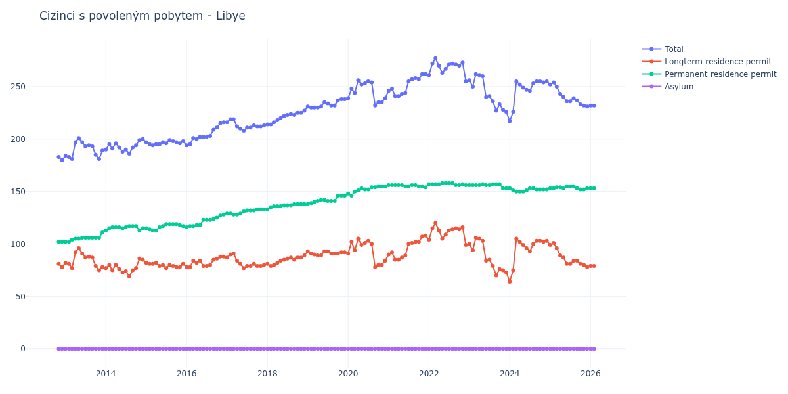

# Libye

## Souhrnné statistiky (Min/Max pro rok) / Summary Statistics (Min/Max per year)

| Year   | Total     | Longterm Residence Permit   | Permanent Residence Permit   | Asylum   |
|--------|-----------|-----------------------------|------------------------------|----------|
| 2012   | 180 / 183 | 78 / 81                     | 102 / 102                    | 0 / 0    |
| 2013   | 181 / 201 | 75 / 96                     | 102 / 111                    | 0 / 0    |
| 2014   | 186 / 200 | 69 / 86                     | 113 / 117                    | 0 / 0    |
| 2015   | 194 / 199 | 77 / 82                     | 113 / 119                    | 0 / 0    |
| 2016   | 194 / 216 | 78 / 88                     | 116 / 128                    | 0 / 0    |
| 2017   | 208 / 219 | 77 / 91                     | 128 / 133                    | 0 / 0    |
| 2018   | 214 / 227 | 79 / 89                     | 133 / 138                    | 0 / 0    |
| 2019   | 230 / 238 | 89 / 93                     | 138 / 146                    | 0 / 0    |
| 2020   | 232 / 256 | 78 / 105                    | 146 / 155                    | 0 / 0    |
| 2021   | 241 / 262 | 85 / 108                    | 154 / 156                    | 0 / 0    |
| 2022   | 255 / 277 | 99 / 120                    | 156 / 158                    | 0 / 0    |
| 2023   | 226 / 262 | 70 / 106                    | 153 / 157                    | 0 / 0    |
| 2024   | 217 / 255 | 64 / 105                    | 150 / 153                    | 0 / 0    |
| 2025   | 231 / 254 | 78 / 101                    | 152 / 155                    | 0 / 0    |
| 2026   | 232 / 232 | 79 / 79                     | 153 / 153                    | 0 / 0    |

## Detailní tabulka / Detailed Data Table

| Date     | Total         | Longterm Residence Permit   | Permanent Residence Permit   | Asylum   |
|----------|---------------|-----------------------------|------------------------------|----------|
| **2012** |               |                             |                              |          |
| 11.2012  | 183           | 81                          | 102                          | 0        |
| 12.2012  | 180 (-1.64%)  | 78 (-3.70%)                 | 102 (+0.00%)                 | 0        |
| **2013** |               |                             |                              |          |
| 01.2013  | 184 (+2.22%)  | 82 (+5.13%)                 | 102 (+0.00%)                 | 0        |
| 02.2013  | 183 (-0.54%)  | 81 (-1.22%)                 | 102 (+0.00%)                 | 0        |
| 03.2013  | 181 (-1.09%)  | 77 (-4.94%)                 | 104 (+1.96%)                 | 0        |
| 04.2013  | 197 (+8.84%)  | 92 (+19.48%)                | 105 (+0.96%)                 | 0        |
| 05.2013  | 201 (+2.03%)  | 96 (+4.35%)                 | 105 (+0.00%)                 | 0        |
| 06.2013  | 197 (-1.99%)  | 91 (-5.21%)                 | 106 (+0.95%)                 | 0        |
| 07.2013  | 193 (-2.03%)  | 87 (-4.40%)                 | 106 (+0.00%)                 | 0        |
| 08.2013  | 194 (+0.52%)  | 88 (+1.15%)                 | 106 (+0.00%)                 | 0        |
| 09.2013  | 193 (-0.52%)  | 87 (-1.14%)                 | 106 (+0.00%)                 | 0        |
| 10.2013  | 185 (-4.15%)  | 79 (-9.20%)                 | 106 (+0.00%)                 | 0        |
| 11.2013  | 181 (-2.16%)  | 75 (-5.06%)                 | 106 (+0.00%)                 | 0        |
| 12.2013  | 189 (+4.42%)  | 78 (+4.00%)                 | 111 (+4.72%)                 | 0        |
| **2014** |               |                             |                              |          |
| 01.2014  | 190 (+0.53%)  | 77 (-1.28%)                 | 113 (+1.80%)                 | 0        |
| 02.2014  | 195 (+2.63%)  | 80 (+3.90%)                 | 115 (+1.77%)                 | 0        |
| 03.2014  | 191 (-2.05%)  | 75 (-6.25%)                 | 116 (+0.87%)                 | 0        |
| 04.2014  | 196 (+2.62%)  | 80 (+6.67%)                 | 116 (+0.00%)                 | 0        |
| 05.2014  | 192 (-2.04%)  | 76 (-5.00%)                 | 116 (+0.00%)                 | 0        |
| 06.2014  | 188 (-2.08%)  | 73 (-3.95%)                 | 115 (-0.86%)                 | 0        |
| 07.2014  | 190 (+1.06%)  | 74 (+1.37%)                 | 116 (+0.87%)                 | 0        |
| 08.2014  | 186 (-2.11%)  | 69 (-6.76%)                 | 117 (+0.86%)                 | 0        |
| 09.2014  | 192 (+3.23%)  | 75 (+8.70%)                 | 117 (+0.00%)                 | 0        |
| 10.2014  | 194 (+1.04%)  | 77 (+2.67%)                 | 117 (+0.00%)                 | 0        |
| 11.2014  | 199 (+2.58%)  | 86 (+11.69%)                | 113 (-3.42%)                 | 0        |
| 12.2014  | 200 (+0.50%)  | 85 (-1.16%)                 | 115 (+1.77%)                 | 0        |
| **2015** |               |                             |                              |          |
| 01.2015  | 197 (-1.50%)  | 82 (-3.53%)                 | 115 (+0.00%)                 | 0        |
| 02.2015  | 195 (-1.02%)  | 81 (-1.22%)                 | 114 (-0.87%)                 | 0        |
| 03.2015  | 194 (-0.51%)  | 81 (+0.00%)                 | 113 (-0.88%)                 | 0        |
| 04.2015  | 195 (+0.52%)  | 82 (+1.23%)                 | 113 (+0.00%)                 | 0        |
| 05.2015  | 195 (+0.00%)  | 79 (-3.66%)                 | 116 (+2.65%)                 | 0        |
| 06.2015  | 197 (+1.03%)  | 80 (+1.27%)                 | 117 (+0.86%)                 | 0        |
| 07.2015  | 196 (-0.51%)  | 77 (-3.75%)                 | 119 (+1.71%)                 | 0        |
| 08.2015  | 199 (+1.53%)  | 80 (+3.90%)                 | 119 (+0.00%)                 | 0        |
| 09.2015  | 198 (-0.50%)  | 79 (-1.25%)                 | 119 (+0.00%)                 | 0        |
| 10.2015  | 197 (-0.51%)  | 78 (-1.27%)                 | 119 (+0.00%)                 | 0        |
| 11.2015  | 196 (-0.51%)  | 78 (+0.00%)                 | 118 (-0.84%)                 | 0        |
| 12.2015  | 198 (+1.02%)  | 81 (+3.85%)                 | 117 (-0.85%)                 | 0        |
| **2016** |               |                             |                              |          |
| 01.2016  | 194 (-2.02%)  | 78 (-3.70%)                 | 116 (-0.85%)                 | 0        |
| 02.2016  | 195 (+0.52%)  | 78 (+0.00%)                 | 117 (+0.86%)                 | 0        |
| 03.2016  | 201 (+3.08%)  | 84 (+7.69%)                 | 117 (+0.00%)                 | 0        |
| 04.2016  | 200 (-0.50%)  | 82 (-2.38%)                 | 118 (+0.85%)                 | 0        |
| 05.2016  | 202 (+1.00%)  | 84 (+2.44%)                 | 118 (+0.00%)                 | 0        |
| 06.2016  | 202 (+0.00%)  | 79 (-5.95%)                 | 123 (+4.24%)                 | 0        |
| 07.2016  | 202 (+0.00%)  | 79 (+0.00%)                 | 123 (+0.00%)                 | 0        |
| 08.2016  | 203 (+0.50%)  | 80 (+1.27%)                 | 123 (+0.00%)                 | 0        |
| 09.2016  | 209 (+2.96%)  | 85 (+6.25%)                 | 124 (+0.81%)                 | 0        |
| 10.2016  | 211 (+0.96%)  | 86 (+1.18%)                 | 125 (+0.81%)                 | 0        |
| 11.2016  | 215 (+1.90%)  | 88 (+2.33%)                 | 127 (+1.60%)                 | 0        |
| 12.2016  | 216 (+0.47%)  | 88 (+0.00%)                 | 128 (+0.79%)                 | 0        |
| **2017** |               |                             |                              |          |
| 01.2017  | 216 (+0.00%)  | 87 (-1.14%)                 | 129 (+0.78%)                 | 0        |
| 02.2017  | 219 (+1.39%)  | 90 (+3.45%)                 | 129 (+0.00%)                 | 0        |
| 03.2017  | 219 (+0.00%)  | 91 (+1.11%)                 | 128 (-0.78%)                 | 0        |
| 04.2017  | 212 (-3.20%)  | 84 (-7.69%)                 | 128 (+0.00%)                 | 0        |
| 05.2017  | 210 (-0.94%)  | 81 (-3.57%)                 | 129 (+0.78%)                 | 0        |
| 06.2017  | 208 (-0.95%)  | 77 (-4.94%)                 | 131 (+1.55%)                 | 0        |
| 07.2017  | 211 (+1.44%)  | 79 (+2.60%)                 | 132 (+0.76%)                 | 0        |
| 08.2017  | 211 (+0.00%)  | 79 (+0.00%)                 | 132 (+0.00%)                 | 0        |
| 09.2017  | 213 (+0.95%)  | 81 (+2.53%)                 | 132 (+0.00%)                 | 0        |
| 10.2017  | 212 (-0.47%)  | 79 (-2.47%)                 | 133 (+0.76%)                 | 0        |
| 11.2017  | 212 (+0.00%)  | 79 (+0.00%)                 | 133 (+0.00%)                 | 0        |
| 12.2017  | 213 (+0.47%)  | 80 (+1.27%)                 | 133 (+0.00%)                 | 0        |
| **2018** |               |                             |                              |          |
| 01.2018  | 214 (+0.47%)  | 81 (+1.25%)                 | 133 (+0.00%)                 | 0        |
| 02.2018  | 214 (+0.00%)  | 79 (-2.47%)                 | 135 (+1.50%)                 | 0        |
| 03.2018  | 216 (+0.93%)  | 80 (+1.27%)                 | 136 (+0.74%)                 | 0        |
| 04.2018  | 218 (+0.93%)  | 82 (+2.50%)                 | 136 (+0.00%)                 | 0        |
| 05.2018  | 220 (+0.92%)  | 84 (+2.44%)                 | 136 (+0.00%)                 | 0        |
| 06.2018  | 222 (+0.91%)  | 85 (+1.19%)                 | 137 (+0.74%)                 | 0        |
| 07.2018  | 223 (+0.45%)  | 86 (+1.18%)                 | 137 (+0.00%)                 | 0        |
| 08.2018  | 224 (+0.45%)  | 87 (+1.16%)                 | 137 (+0.00%)                 | 0        |
| 09.2018  | 223 (-0.45%)  | 85 (-2.30%)                 | 138 (+0.73%)                 | 0        |
| 10.2018  | 225 (+0.90%)  | 87 (+2.35%)                 | 138 (+0.00%)                 | 0        |
| 11.2018  | 225 (+0.00%)  | 87 (+0.00%)                 | 138 (+0.00%)                 | 0        |
| 12.2018  | 227 (+0.89%)  | 89 (+2.30%)                 | 138 (+0.00%)                 | 0        |
| **2019** |               |                             |                              |          |
| 01.2019  | 231 (+1.76%)  | 93 (+4.49%)                 | 138 (+0.00%)                 | 0        |
| 02.2019  | 230 (-0.43%)  | 91 (-2.15%)                 | 139 (+0.72%)                 | 0        |
| 03.2019  | 230 (+0.00%)  | 90 (-1.10%)                 | 140 (+0.72%)                 | 0        |
| 04.2019  | 230 (+0.00%)  | 89 (-1.11%)                 | 141 (+0.71%)                 | 0        |
| 05.2019  | 231 (+0.43%)  | 89 (+0.00%)                 | 142 (+0.71%)                 | 0        |
| 06.2019  | 235 (+1.73%)  | 93 (+4.49%)                 | 142 (+0.00%)                 | 0        |
| 07.2019  | 234 (-0.43%)  | 93 (+0.00%)                 | 141 (-0.70%)                 | 0        |
| 08.2019  | 232 (-0.85%)  | 91 (-2.15%)                 | 141 (+0.00%)                 | 0        |
| 09.2019  | 232 (+0.00%)  | 91 (+0.00%)                 | 141 (+0.00%)                 | 0        |
| 10.2019  | 237 (+2.16%)  | 91 (+0.00%)                 | 146 (+3.55%)                 | 0        |
| 11.2019  | 238 (+0.42%)  | 92 (+1.10%)                 | 146 (+0.00%)                 | 0        |
| 12.2019  | 238 (+0.00%)  | 92 (+0.00%)                 | 146 (+0.00%)                 | 0        |
| **2020** |               |                             |                              |          |
| 01.2020  | 239 (+0.42%)  | 91 (-1.09%)                 | 148 (+1.37%)                 | 0        |
| 02.2020  | 248 (+3.77%)  | 102 (+12.09%)               | 146 (-1.35%)                 | 0        |
| 03.2020  | 244 (-1.61%)  | 94 (-7.84%)                 | 150 (+2.74%)                 | 0        |
| 04.2020  | 256 (+4.92%)  | 105 (+11.70%)               | 151 (+0.67%)                 | 0        |
| 05.2020  | 252 (-1.56%)  | 99 (-5.71%)                 | 153 (+1.32%)                 | 0        |
| 06.2020  | 253 (+0.40%)  | 101 (+2.02%)                | 152 (-0.65%)                 | 0        |
| 07.2020  | 255 (+0.79%)  | 103 (+1.98%)                | 152 (+0.00%)                 | 0        |
| 08.2020  | 254 (-0.39%)  | 100 (-2.91%)                | 154 (+1.32%)                 | 0        |
| 09.2020  | 232 (-8.66%)  | 78 (-22.00%)                | 154 (+0.00%)                 | 0        |
| 10.2020  | 235 (+1.29%)  | 80 (+2.56%)                 | 155 (+0.65%)                 | 0        |
| 11.2020  | 235 (+0.00%)  | 80 (+0.00%)                 | 155 (+0.00%)                 | 0        |
| 12.2020  | 239 (+1.70%)  | 84 (+5.00%)                 | 155 (+0.00%)                 | 0        |
| **2021** |               |                             |                              |          |
| 01.2021  | 246 (+2.93%)  | 90 (+7.14%)                 | 156 (+0.65%)                 | 0        |
| 02.2021  | 248 (+0.81%)  | 92 (+2.22%)                 | 156 (+0.00%)                 | 0        |
| 03.2021  | 241 (-2.82%)  | 85 (-7.61%)                 | 156 (+0.00%)                 | 0        |
| 04.2021  | 241 (+0.00%)  | 85 (+0.00%)                 | 156 (+0.00%)                 | 0        |
| 05.2021  | 243 (+0.83%)  | 87 (+2.35%)                 | 156 (+0.00%)                 | 0        |
| 06.2021  | 244 (+0.41%)  | 89 (+2.30%)                 | 155 (-0.64%)                 | 0        |
| 07.2021  | 255 (+4.51%)  | 100 (+12.36%)               | 155 (+0.00%)                 | 0        |
| 08.2021  | 257 (+0.78%)  | 101 (+1.00%)                | 156 (+0.65%)                 | 0        |
| 09.2021  | 258 (+0.39%)  | 102 (+0.99%)                | 156 (+0.00%)                 | 0        |
| 10.2021  | 257 (-0.39%)  | 102 (+0.00%)                | 155 (-0.64%)                 | 0        |
| 11.2021  | 262 (+1.95%)  | 107 (+4.90%)                | 155 (+0.00%)                 | 0        |
| 12.2021  | 262 (+0.00%)  | 108 (+0.93%)                | 154 (-0.65%)                 | 0        |
| **2022** |               |                             |                              |          |
| 01.2022  | 261 (-0.38%)  | 104 (-3.70%)                | 157 (+1.95%)                 | 0        |
| 02.2022  | 272 (+4.21%)  | 115 (+10.58%)               | 157 (+0.00%)                 | 0        |
| 03.2022  | 277 (+1.84%)  | 120 (+4.35%)                | 157 (+0.00%)                 | 0        |
| 04.2022  | 270 (-2.53%)  | 113 (-5.83%)                | 157 (+0.00%)                 | 0        |
| 05.2022  | 263 (-2.59%)  | 105 (-7.08%)                | 158 (+0.64%)                 | 0        |
| 06.2022  | 267 (+1.52%)  | 109 (+3.81%)                | 158 (+0.00%)                 | 0        |
| 07.2022  | 271 (+1.50%)  | 113 (+3.67%)                | 158 (+0.00%)                 | 0        |
| 08.2022  | 272 (+0.37%)  | 114 (+0.88%)                | 158 (+0.00%)                 | 0        |
| 09.2022  | 271 (-0.37%)  | 115 (+0.88%)                | 156 (-1.27%)                 | 0        |
| 10.2022  | 270 (-0.37%)  | 114 (-0.87%)                | 156 (+0.00%)                 | 0        |
| 11.2022  | 273 (+1.11%)  | 116 (+1.75%)                | 157 (+0.64%)                 | 0        |
| 12.2022  | 255 (-6.59%)  | 99 (-14.66%)                | 156 (-0.64%)                 | 0        |
| **2023** |               |                             |                              |          |
| 01.2023  | 256 (+0.39%)  | 100 (+1.01%)                | 156 (+0.00%)                 | 0        |
| 02.2023  | 250 (-2.34%)  | 94 (-6.00%)                 | 156 (+0.00%)                 | 0        |
| 03.2023  | 262 (+4.80%)  | 106 (+12.77%)               | 156 (+0.00%)                 | 0        |
| 04.2023  | 261 (-0.38%)  | 105 (-0.94%)                | 156 (+0.00%)                 | 0        |
| 05.2023  | 260 (-0.38%)  | 103 (-1.90%)                | 157 (+0.64%)                 | 0        |
| 06.2023  | 240 (-7.69%)  | 84 (-18.45%)                | 156 (-0.64%)                 | 0        |
| 07.2023  | 241 (+0.42%)  | 85 (+1.19%)                 | 156 (+0.00%)                 | 0        |
| 08.2023  | 236 (-2.07%)  | 79 (-7.06%)                 | 157 (+0.64%)                 | 0        |
| 09.2023  | 227 (-3.81%)  | 70 (-11.39%)                | 157 (+0.00%)                 | 0        |
| 10.2023  | 233 (+2.64%)  | 76 (+8.57%)                 | 157 (+0.00%)                 | 0        |
| 11.2023  | 228 (-2.15%)  | 75 (-1.32%)                 | 153 (-2.55%)                 | 0        |
| 12.2023  | 226 (-0.88%)  | 73 (-2.67%)                 | 153 (+0.00%)                 | 0        |
| **2024** |               |                             |                              |          |
| 01.2024  | 217 (-3.98%)  | 64 (-12.33%)                | 153 (+0.00%)                 | 0        |
| 02.2024  | 226 (+4.15%)  | 75 (+17.19%)                | 151 (-1.31%)                 | 0        |
| 03.2024  | 255 (+12.83%) | 105 (+40.00%)               | 150 (-0.66%)                 | 0        |
| 04.2024  | 252 (-1.18%)  | 102 (-2.86%)                | 150 (+0.00%)                 | 0        |
| 05.2024  | 249 (-1.19%)  | 99 (-2.94%)                 | 150 (+0.00%)                 | 0        |
| 06.2024  | 247 (-0.80%)  | 96 (-3.03%)                 | 151 (+0.67%)                 | 0        |
| 07.2024  | 246 (-0.40%)  | 93 (-3.12%)                 | 153 (+1.32%)                 | 0        |
| 08.2024  | 253 (+2.85%)  | 100 (+7.53%)                | 153 (+0.00%)                 | 0        |
| 09.2024  | 255 (+0.79%)  | 103 (+3.00%)                | 152 (-0.65%)                 | 0        |
| 10.2024  | 255 (+0.00%)  | 103 (+0.00%)                | 152 (+0.00%)                 | 0        |
| 11.2024  | 254 (-0.39%)  | 102 (-0.97%)                | 152 (+0.00%)                 | 0        |
| 12.2024  | 255 (+0.39%)  | 103 (+0.98%)                | 152 (+0.00%)                 | 0        |
| **2025** |               |                             |                              |          |
| 01.2025  | 252 (-1.18%)  | 99 (-3.88%)                 | 153 (+0.66%)                 | 0        |
| 02.2025  | 254 (+0.79%)  | 101 (+2.02%)                | 153 (+0.00%)                 | 0        |
| 03.2025  | 250 (-1.57%)  | 96 (-4.95%)                 | 154 (+0.65%)                 | 0        |
| 04.2025  | 243 (-2.80%)  | 89 (-7.29%)                 | 154 (+0.00%)                 | 0        |
| 05.2025  | 240 (-1.23%)  | 87 (-2.25%)                 | 153 (-0.65%)                 | 0        |
| 06.2025  | 236 (-1.67%)  | 81 (-6.90%)                 | 155 (+1.31%)                 | 0        |
| 07.2025  | 236 (+0.00%)  | 81 (+0.00%)                 | 155 (+0.00%)                 | 0        |
| 08.2025  | 239 (+1.27%)  | 84 (+3.70%)                 | 155 (+0.00%)                 | 0        |
| 09.2025  | 237 (-0.84%)  | 84 (+0.00%)                 | 153 (-1.29%)                 | 0        |
| 10.2025  | 233 (-1.69%)  | 81 (-3.57%)                 | 152 (-0.65%)                 | 0        |
| 11.2025  | 232 (-0.43%)  | 80 (-1.23%)                 | 152 (+0.00%)                 | 0        |
| 12.2025  | 231 (-0.43%)  | 78 (-2.50%)                 | 153 (+0.66%)                 | 0        |
| **2026** |               |                             |                              |          |
| 01.2026  | 232 (+0.43%)  | 79 (+1.28%)                 | 153 (+0.00%)                 | 0        |
| 02.2026  | 232 (+0.00%)  | 79 (+0.00%)                 | 153 (+0.00%)                 | 0        |
