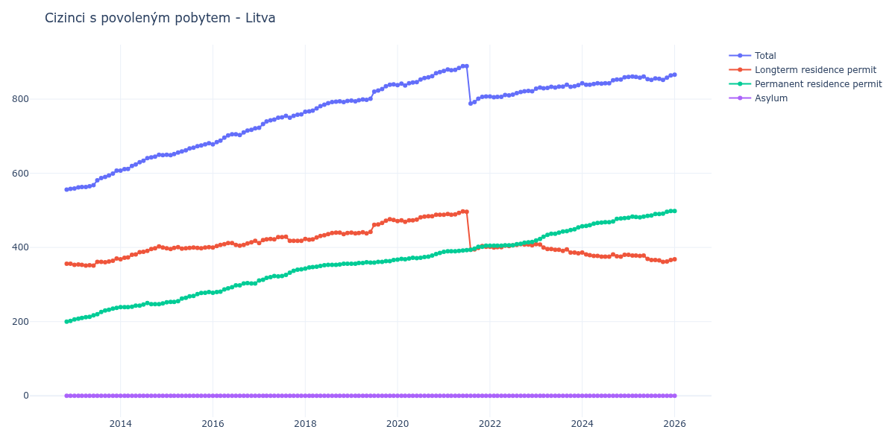

# Litva

## Souhrnné statistiky (Min/Max pro rok) / Summary Statistics (Min/Max per year)

| Year   | Total     | Longterm Residence Permit   | Permanent Residence Permit   | Asylum   |
|--------|-----------|-----------------------------|------------------------------|----------|
| 2012   | 556 / 558 | 356 / 356                   | 200 / 202                    | 0 / 0    |
| 2013   | 559 / 607 | 351 / 370                   | 206 / 237                    | 0 / 0    |
| 2014   | 607 / 650 | 368 / 403                   | 239 / 250                    | 0 / 0    |
| 2015   | 649 / 681 | 396 / 401                   | 252 / 280                    | 0 / 0    |
| 2016   | 678 / 721 | 400 / 418                   | 278 / 304                    | 0 / 0    |
| 2017   | 723 / 759 | 412 / 429                   | 311 / 341                    | 0 / 0    |
| 2018   | 766 / 795 | 421 / 440                   | 343 / 356                    | 0 / 0    |
| 2019   | 794 / 840 | 438 / 476                   | 356 / 366                    | 0 / 0    |
| 2020   | 837 / 873 | 469 / 488                   | 367 / 385                    | 0 / 0    |
| 2021   | 788 / 889 | 394 / 497                   | 388 / 405                    | 0 / 0    |
| 2022   | 805 / 822 | 400 / 409                   | 405 / 415                    | 0 / 0    |
| 2023   | 828 / 839 | 384 / 409                   | 419 / 454                    | 0 / 0    |
| 2024   | 839 / 859 | 375 / 386                   | 457 / 479                    | 0 / 0    |
| 2025   | 852 / 864 | 361 / 380                   | 480 / 498                    | 0 / 0    |
| 2026   | 866 / 866 | 368 / 368                   | 498 / 498                    | 0 / 0    |

## Detailní tabulka / Detailed Data Table

| Date     | Total         | Longterm Residence Permit   | Permanent Residence Permit   | Asylum   |
|----------|---------------|-----------------------------|------------------------------|----------|
| **2012** |               |                             |                              |          |
| 11.2012  | 556           | 356                         | 200                          | 0        |
| 12.2012  | 558 (+0.36%)  | 356 (+0.00%)                | 202 (+1.00%)                 | 0        |
| **2013** |               |                             |                              |          |
| 01.2013  | 559 (+0.18%)  | 353 (-0.84%)                | 206 (+1.98%)                 | 0        |
| 02.2013  | 562 (+0.54%)  | 354 (+0.28%)                | 208 (+0.97%)                 | 0        |
| 03.2013  | 563 (+0.18%)  | 353 (-0.28%)                | 210 (+0.96%)                 | 0        |
| 04.2013  | 563 (+0.00%)  | 351 (-0.57%)                | 212 (+0.95%)                 | 0        |
| 05.2013  | 565 (+0.36%)  | 352 (+0.28%)                | 213 (+0.47%)                 | 0        |
| 06.2013  | 568 (+0.53%)  | 351 (-0.28%)                | 217 (+1.88%)                 | 0        |
| 07.2013  | 581 (+2.29%)  | 361 (+2.85%)                | 220 (+1.38%)                 | 0        |
| 08.2013  | 587 (+1.03%)  | 361 (+0.00%)                | 226 (+2.73%)                 | 0        |
| 09.2013  | 590 (+0.51%)  | 360 (-0.28%)                | 230 (+1.77%)                 | 0        |
| 10.2013  | 594 (+0.68%)  | 362 (+0.56%)                | 232 (+0.87%)                 | 0        |
| 11.2013  | 599 (+0.84%)  | 364 (+0.55%)                | 235 (+1.29%)                 | 0        |
| 12.2013  | 607 (+1.34%)  | 370 (+1.65%)                | 237 (+0.85%)                 | 0        |
| **2014** |               |                             |                              |          |
| 01.2014  | 607 (+0.00%)  | 368 (-0.54%)                | 239 (+0.84%)                 | 0        |
| 02.2014  | 611 (+0.66%)  | 372 (+1.09%)                | 239 (+0.00%)                 | 0        |
| 03.2014  | 612 (+0.16%)  | 373 (+0.27%)                | 239 (+0.00%)                 | 0        |
| 04.2014  | 620 (+1.31%)  | 380 (+1.88%)                | 240 (+0.42%)                 | 0        |
| 05.2014  | 624 (+0.65%)  | 381 (+0.26%)                | 243 (+1.25%)                 | 0        |
| 06.2014  | 630 (+0.96%)  | 387 (+1.57%)                | 243 (+0.00%)                 | 0        |
| 07.2014  | 634 (+0.63%)  | 388 (+0.26%)                | 246 (+1.23%)                 | 0        |
| 08.2014  | 641 (+1.10%)  | 391 (+0.77%)                | 250 (+1.63%)                 | 0        |
| 09.2014  | 643 (+0.31%)  | 396 (+1.28%)                | 247 (-1.20%)                 | 0        |
| 10.2014  | 645 (+0.31%)  | 398 (+0.51%)                | 247 (+0.00%)                 | 0        |
| 11.2014  | 650 (+0.78%)  | 403 (+1.26%)                | 247 (+0.00%)                 | 0        |
| 12.2014  | 649 (-0.15%)  | 400 (-0.74%)                | 249 (+0.81%)                 | 0        |
| **2015** |               |                             |                              |          |
| 01.2015  | 650 (+0.15%)  | 398 (-0.50%)                | 252 (+1.20%)                 | 0        |
| 02.2015  | 649 (-0.15%)  | 396 (-0.50%)                | 253 (+0.40%)                 | 0        |
| 03.2015  | 652 (+0.46%)  | 399 (+0.76%)                | 253 (+0.00%)                 | 0        |
| 04.2015  | 656 (+0.61%)  | 401 (+0.50%)                | 255 (+0.79%)                 | 0        |
| 05.2015  | 659 (+0.46%)  | 397 (-1.00%)                | 262 (+2.75%)                 | 0        |
| 06.2015  | 662 (+0.46%)  | 398 (+0.25%)                | 264 (+0.76%)                 | 0        |
| 07.2015  | 667 (+0.76%)  | 399 (+0.25%)                | 268 (+1.52%)                 | 0        |
| 08.2015  | 669 (+0.30%)  | 400 (+0.25%)                | 269 (+0.37%)                 | 0        |
| 09.2015  | 673 (+0.60%)  | 399 (-0.25%)                | 274 (+1.86%)                 | 0        |
| 10.2015  | 675 (+0.30%)  | 398 (-0.25%)                | 277 (+1.09%)                 | 0        |
| 11.2015  | 678 (+0.44%)  | 400 (+0.50%)                | 278 (+0.36%)                 | 0        |
| 12.2015  | 681 (+0.44%)  | 401 (+0.25%)                | 280 (+0.72%)                 | 0        |
| **2016** |               |                             |                              |          |
| 01.2016  | 678 (-0.44%)  | 400 (-0.25%)                | 278 (-0.71%)                 | 0        |
| 02.2016  | 684 (+0.88%)  | 404 (+1.00%)                | 280 (+0.72%)                 | 0        |
| 03.2016  | 688 (+0.58%)  | 407 (+0.74%)                | 281 (+0.36%)                 | 0        |
| 04.2016  | 696 (+1.16%)  | 409 (+0.49%)                | 287 (+2.14%)                 | 0        |
| 05.2016  | 702 (+0.86%)  | 412 (+0.73%)                | 290 (+1.05%)                 | 0        |
| 06.2016  | 705 (+0.43%)  | 412 (+0.00%)                | 293 (+1.03%)                 | 0        |
| 07.2016  | 705 (+0.00%)  | 407 (-1.21%)                | 298 (+1.71%)                 | 0        |
| 08.2016  | 703 (-0.28%)  | 405 (-0.49%)                | 298 (+0.00%)                 | 0        |
| 09.2016  | 710 (+1.00%)  | 407 (+0.49%)                | 303 (+1.68%)                 | 0        |
| 10.2016  | 715 (+0.70%)  | 411 (+0.98%)                | 304 (+0.33%)                 | 0        |
| 11.2016  | 717 (+0.28%)  | 414 (+0.73%)                | 303 (-0.33%)                 | 0        |
| 12.2016  | 721 (+0.56%)  | 418 (+0.97%)                | 303 (+0.00%)                 | 0        |
| **2017** |               |                             |                              |          |
| 01.2017  | 723 (+0.28%)  | 412 (-1.44%)                | 311 (+2.64%)                 | 0        |
| 02.2017  | 733 (+1.38%)  | 420 (+1.94%)                | 313 (+0.64%)                 | 0        |
| 03.2017  | 740 (+0.95%)  | 422 (+0.48%)                | 318 (+1.60%)                 | 0        |
| 04.2017  | 743 (+0.41%)  | 423 (+0.24%)                | 320 (+0.63%)                 | 0        |
| 05.2017  | 745 (+0.27%)  | 422 (-0.24%)                | 323 (+0.94%)                 | 0        |
| 06.2017  | 750 (+0.67%)  | 428 (+1.42%)                | 322 (-0.31%)                 | 0        |
| 07.2017  | 751 (+0.13%)  | 428 (+0.00%)                | 323 (+0.31%)                 | 0        |
| 08.2017  | 755 (+0.53%)  | 429 (+0.23%)                | 326 (+0.93%)                 | 0        |
| 09.2017  | 750 (-0.66%)  | 418 (-2.56%)                | 332 (+1.84%)                 | 0        |
| 10.2017  | 755 (+0.67%)  | 418 (+0.00%)                | 337 (+1.51%)                 | 0        |
| 11.2017  | 758 (+0.40%)  | 418 (+0.00%)                | 340 (+0.89%)                 | 0        |
| 12.2017  | 759 (+0.13%)  | 418 (+0.00%)                | 341 (+0.29%)                 | 0        |
| **2018** |               |                             |                              |          |
| 01.2018  | 766 (+0.92%)  | 423 (+1.20%)                | 343 (+0.59%)                 | 0        |
| 02.2018  | 767 (+0.13%)  | 421 (-0.47%)                | 346 (+0.87%)                 | 0        |
| 03.2018  | 769 (+0.26%)  | 422 (+0.24%)                | 347 (+0.29%)                 | 0        |
| 04.2018  | 775 (+0.78%)  | 427 (+1.18%)                | 348 (+0.29%)                 | 0        |
| 05.2018  | 781 (+0.77%)  | 431 (+0.94%)                | 350 (+0.57%)                 | 0        |
| 06.2018  | 785 (+0.51%)  | 433 (+0.46%)                | 352 (+0.57%)                 | 0        |
| 07.2018  | 789 (+0.51%)  | 436 (+0.69%)                | 353 (+0.28%)                 | 0        |
| 08.2018  | 792 (+0.38%)  | 439 (+0.69%)                | 353 (+0.00%)                 | 0        |
| 09.2018  | 793 (+0.13%)  | 440 (+0.23%)                | 353 (+0.00%)                 | 0        |
| 10.2018  | 794 (+0.13%)  | 440 (+0.00%)                | 354 (+0.28%)                 | 0        |
| 11.2018  | 792 (-0.25%)  | 436 (-0.91%)                | 356 (+0.56%)                 | 0        |
| 12.2018  | 795 (+0.38%)  | 439 (+0.69%)                | 356 (+0.00%)                 | 0        |
| **2019** |               |                             |                              |          |
| 01.2019  | 796 (+0.13%)  | 440 (+0.23%)                | 356 (+0.00%)                 | 0        |
| 02.2019  | 794 (-0.25%)  | 438 (-0.45%)                | 356 (+0.00%)                 | 0        |
| 03.2019  | 797 (+0.38%)  | 439 (+0.23%)                | 358 (+0.56%)                 | 0        |
| 04.2019  | 799 (+0.25%)  | 441 (+0.46%)                | 358 (+0.00%)                 | 0        |
| 05.2019  | 798 (-0.13%)  | 438 (-0.68%)                | 360 (+0.56%)                 | 0        |
| 06.2019  | 801 (+0.38%)  | 442 (+0.91%)                | 359 (-0.28%)                 | 0        |
| 07.2019  | 820 (+2.37%)  | 461 (+4.30%)                | 359 (+0.00%)                 | 0        |
| 08.2019  | 823 (+0.37%)  | 462 (+0.22%)                | 361 (+0.56%)                 | 0        |
| 09.2019  | 827 (+0.49%)  | 466 (+0.87%)                | 361 (+0.00%)                 | 0        |
| 10.2019  | 835 (+0.97%)  | 472 (+1.29%)                | 363 (+0.55%)                 | 0        |
| 11.2019  | 839 (+0.48%)  | 476 (+0.85%)                | 363 (+0.00%)                 | 0        |
| 12.2019  | 840 (+0.12%)  | 474 (-0.42%)                | 366 (+0.83%)                 | 0        |
| **2020** |               |                             |                              |          |
| 01.2020  | 838 (-0.24%)  | 471 (-0.63%)                | 367 (+0.27%)                 | 0        |
| 02.2020  | 842 (+0.48%)  | 473 (+0.42%)                | 369 (+0.54%)                 | 0        |
| 03.2020  | 837 (-0.59%)  | 469 (-0.85%)                | 368 (-0.27%)                 | 0        |
| 04.2020  | 843 (+0.72%)  | 473 (+0.85%)                | 370 (+0.54%)                 | 0        |
| 05.2020  | 845 (+0.24%)  | 473 (+0.00%)                | 372 (+0.54%)                 | 0        |
| 06.2020  | 846 (+0.12%)  | 475 (+0.42%)                | 371 (-0.27%)                 | 0        |
| 07.2020  | 853 (+0.83%)  | 481 (+1.26%)                | 372 (+0.27%)                 | 0        |
| 08.2020  | 857 (+0.47%)  | 483 (+0.42%)                | 374 (+0.54%)                 | 0        |
| 09.2020  | 859 (+0.23%)  | 484 (+0.21%)                | 375 (+0.27%)                 | 0        |
| 10.2020  | 862 (+0.35%)  | 484 (+0.00%)                | 378 (+0.80%)                 | 0        |
| 11.2020  | 870 (+0.93%)  | 488 (+0.83%)                | 382 (+1.06%)                 | 0        |
| 12.2020  | 873 (+0.34%)  | 488 (+0.00%)                | 385 (+0.79%)                 | 0        |
| **2021** |               |                             |                              |          |
| 01.2021  | 876 (+0.34%)  | 488 (+0.00%)                | 388 (+0.78%)                 | 0        |
| 02.2021  | 880 (+0.46%)  | 490 (+0.41%)                | 390 (+0.52%)                 | 0        |
| 03.2021  | 878 (-0.23%)  | 488 (-0.41%)                | 390 (+0.00%)                 | 0        |
| 04.2021  | 879 (+0.11%)  | 489 (+0.20%)                | 390 (+0.00%)                 | 0        |
| 05.2021  | 884 (+0.57%)  | 493 (+0.82%)                | 391 (+0.26%)                 | 0        |
| 06.2021  | 889 (+0.57%)  | 497 (+0.81%)                | 392 (+0.26%)                 | 0        |
| 07.2021  | 889 (+0.00%)  | 496 (-0.20%)                | 393 (+0.26%)                 | 0        |
| 08.2021  | 788 (-11.36%) | 394 (-20.56%)               | 394 (+0.25%)                 | 0        |
| 09.2021  | 792 (+0.51%)  | 395 (+0.25%)                | 397 (+0.76%)                 | 0        |
| 10.2021  | 801 (+1.14%)  | 399 (+1.01%)                | 402 (+1.26%)                 | 0        |
| 11.2021  | 806 (+0.62%)  | 404 (+1.25%)                | 402 (+0.00%)                 | 0        |
| 12.2021  | 807 (+0.12%)  | 402 (-0.50%)                | 405 (+0.75%)                 | 0        |
| **2022** |               |                             |                              |          |
| 01.2022  | 807 (+0.00%)  | 402 (+0.00%)                | 405 (+0.00%)                 | 0        |
| 02.2022  | 805 (-0.25%)  | 400 (-0.50%)                | 405 (+0.00%)                 | 0        |
| 03.2022  | 806 (+0.12%)  | 401 (+0.25%)                | 405 (+0.00%)                 | 0        |
| 04.2022  | 806 (+0.00%)  | 401 (+0.00%)                | 405 (+0.00%)                 | 0        |
| 05.2022  | 811 (+0.62%)  | 405 (+1.00%)                | 406 (+0.25%)                 | 0        |
| 06.2022  | 810 (-0.12%)  | 404 (-0.25%)                | 406 (+0.00%)                 | 0        |
| 07.2022  | 812 (+0.25%)  | 406 (+0.50%)                | 406 (+0.00%)                 | 0        |
| 08.2022  | 816 (+0.49%)  | 407 (+0.25%)                | 409 (+0.74%)                 | 0        |
| 09.2022  | 819 (+0.37%)  | 409 (+0.49%)                | 410 (+0.24%)                 | 0        |
| 10.2022  | 821 (+0.24%)  | 408 (-0.24%)                | 413 (+0.73%)                 | 0        |
| 11.2022  | 822 (+0.12%)  | 408 (+0.00%)                | 414 (+0.24%)                 | 0        |
| 12.2022  | 821 (-0.12%)  | 406 (-0.49%)                | 415 (+0.24%)                 | 0        |
| **2023** |               |                             |                              |          |
| 01.2023  | 828 (+0.85%)  | 409 (+0.74%)                | 419 (+0.96%)                 | 0        |
| 02.2023  | 831 (+0.36%)  | 408 (-0.24%)                | 423 (+0.95%)                 | 0        |
| 03.2023  | 829 (-0.24%)  | 400 (-1.96%)                | 429 (+1.42%)                 | 0        |
| 04.2023  | 830 (+0.12%)  | 396 (-1.00%)                | 434 (+1.17%)                 | 0        |
| 05.2023  | 833 (+0.36%)  | 396 (+0.00%)                | 437 (+0.69%)                 | 0        |
| 06.2023  | 831 (-0.24%)  | 394 (-0.51%)                | 437 (+0.00%)                 | 0        |
| 07.2023  | 834 (+0.36%)  | 394 (+0.00%)                | 440 (+0.69%)                 | 0        |
| 08.2023  | 834 (+0.00%)  | 391 (-0.76%)                | 443 (+0.68%)                 | 0        |
| 09.2023  | 839 (+0.60%)  | 395 (+1.02%)                | 444 (+0.23%)                 | 0        |
| 10.2023  | 833 (-0.72%)  | 386 (-2.28%)                | 447 (+0.68%)                 | 0        |
| 11.2023  | 835 (+0.24%)  | 386 (+0.00%)                | 449 (+0.45%)                 | 0        |
| 12.2023  | 838 (+0.36%)  | 384 (-0.52%)                | 454 (+1.11%)                 | 0        |
| **2024** |               |                             |                              |          |
| 01.2024  | 843 (+0.60%)  | 386 (+0.52%)                | 457 (+0.66%)                 | 0        |
| 02.2024  | 839 (-0.47%)  | 381 (-1.30%)                | 458 (+0.22%)                 | 0        |
| 03.2024  | 839 (+0.00%)  | 379 (-0.52%)                | 460 (+0.44%)                 | 0        |
| 04.2024  | 841 (+0.24%)  | 377 (-0.53%)                | 464 (+0.87%)                 | 0        |
| 05.2024  | 843 (+0.24%)  | 377 (+0.00%)                | 466 (+0.43%)                 | 0        |
| 06.2024  | 842 (-0.12%)  | 375 (-0.53%)                | 467 (+0.21%)                 | 0        |
| 07.2024  | 843 (+0.12%)  | 375 (+0.00%)                | 468 (+0.21%)                 | 0        |
| 08.2024  | 843 (+0.00%)  | 375 (+0.00%)                | 468 (+0.00%)                 | 0        |
| 09.2024  | 851 (+0.95%)  | 381 (+1.60%)                | 470 (+0.43%)                 | 0        |
| 10.2024  | 853 (+0.24%)  | 376 (-1.31%)                | 477 (+1.49%)                 | 0        |
| 11.2024  | 853 (+0.00%)  | 375 (-0.27%)                | 478 (+0.21%)                 | 0        |
| 12.2024  | 859 (+0.70%)  | 380 (+1.33%)                | 479 (+0.21%)                 | 0        |
| **2025** |               |                             |                              |          |
| 01.2025  | 860 (+0.12%)  | 380 (+0.00%)                | 480 (+0.21%)                 | 0        |
| 02.2025  | 861 (+0.12%)  | 378 (-0.53%)                | 483 (+0.63%)                 | 0        |
| 03.2025  | 860 (-0.12%)  | 378 (+0.00%)                | 482 (-0.21%)                 | 0        |
| 04.2025  | 858 (-0.23%)  | 377 (-0.26%)                | 481 (-0.21%)                 | 0        |
| 05.2025  | 861 (+0.35%)  | 378 (+0.27%)                | 483 (+0.42%)                 | 0        |
| 06.2025  | 854 (-0.81%)  | 369 (-2.38%)                | 485 (+0.41%)                 | 0        |
| 07.2025  | 852 (-0.23%)  | 366 (-0.81%)                | 486 (+0.21%)                 | 0        |
| 08.2025  | 856 (+0.47%)  | 366 (+0.00%)                | 490 (+0.82%)                 | 0        |
| 09.2025  | 855 (-0.12%)  | 365 (-0.27%)                | 490 (+0.00%)                 | 0        |
| 10.2025  | 852 (-0.35%)  | 361 (-1.10%)                | 491 (+0.20%)                 | 0        |
| 11.2025  | 858 (+0.70%)  | 362 (+0.28%)                | 496 (+1.02%)                 | 0        |
| 12.2025  | 864 (+0.70%)  | 366 (+1.10%)                | 498 (+0.40%)                 | 0        |
| **2026** |               |                             |                              |          |
| 01.2026  | 866 (+0.23%)  | 368 (+0.55%)                | 498 (+0.00%)                 | 0        |
