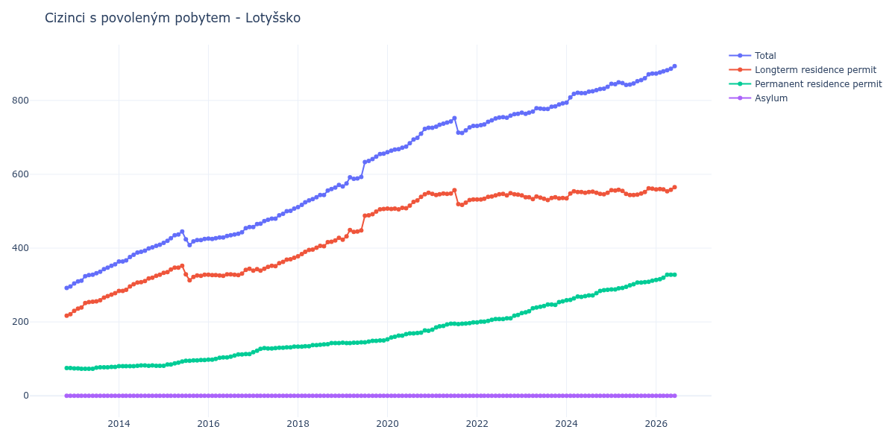

# Lotyšsko

## Souhrnné statistiky (Min/Max pro rok) / Summary Statistics (Min/Max per year)

| Year   | Total     | Longterm Residence Permit   | Permanent Residence Permit   | Asylum   |
|--------|-----------|-----------------------------|------------------------------|----------|
| 2012   | 292 / 296 | 217 / 221                   | 75 / 75                      | 0 / 0    |
| 2013   | 304 / 356 | 230 / 278                   | 73 / 78                      | 0 / 0    |
| 2014   | 364 / 409 | 284 / 328                   | 80 / 82                      | 0 / 0    |
| 2015   | 408 / 445 | 313 / 352                   | 81 / 97                      | 0 / 0    |
| 2016   | 425 / 457 | 325 / 344                   | 98 / 113                     | 0 / 0    |
| 2017   | 457 / 507 | 339 / 374                   | 118 / 133                    | 0 / 0    |
| 2018   | 511 / 571 | 378 / 428                   | 133 / 143                    | 0 / 0    |
| 2019   | 567 / 656 | 423 / 506                   | 143 / 150                    | 0 / 0    |
| 2020   | 660 / 726 | 505 / 550                   | 153 / 177                    | 0 / 0    |
| 2021   | 712 / 752 | 517 / 557                   | 179 / 199                    | 0 / 0    |
| 2022   | 731 / 764 | 532 / 549                   | 199 / 219                    | 0 / 0    |
| 2023   | 764 / 792 | 530 / 543                   | 224 / 256                    | 0 / 0    |
| 2024   | 794 / 837 | 535 / 554                   | 259 / 287                    | 0 / 0    |
| 2025   | 842 / 873 | 544 / 562                   | 288 / 312                    | 0 / 0    |
| 2026   | 873 / 893 | 554 / 565                   | 314 / 328                    | 0 / 0    |

## Detailní tabulka / Detailed Data Table

| Date     | Total        | Longterm Residence Permit   | Permanent Residence Permit   | Asylum   |
|----------|--------------|-----------------------------|------------------------------|----------|
| **2012** |              |                             |                              |          |
| 11.2012  | 292          | 217                         | 75                           | 0        |
| 12.2012  | 296 (+1.37%) | 221 (+1.84%)                | 75 (+0.00%)                  | 0        |
| **2013** |              |                             |                              |          |
| 01.2013  | 304 (+2.70%) | 230 (+4.07%)                | 74 (-1.33%)                  | 0        |
| 02.2013  | 310 (+1.97%) | 236 (+2.61%)                | 74 (+0.00%)                  | 0        |
| 03.2013  | 312 (+0.65%) | 239 (+1.27%)                | 73 (-1.35%)                  | 0        |
| 04.2013  | 324 (+3.85%) | 251 (+5.02%)                | 73 (+0.00%)                  | 0        |
| 05.2013  | 327 (+0.93%) | 254 (+1.20%)                | 73 (+0.00%)                  | 0        |
| 06.2013  | 328 (+0.31%) | 255 (+0.39%)                | 73 (+0.00%)                  | 0        |
| 07.2013  | 332 (+1.22%) | 256 (+0.39%)                | 76 (+4.11%)                  | 0        |
| 08.2013  | 336 (+1.20%) | 259 (+1.17%)                | 77 (+1.32%)                  | 0        |
| 09.2013  | 343 (+2.08%) | 266 (+2.70%)                | 77 (+0.00%)                  | 0        |
| 10.2013  | 347 (+1.17%) | 270 (+1.50%)                | 77 (+0.00%)                  | 0        |
| 11.2013  | 352 (+1.44%) | 274 (+1.48%)                | 78 (+1.30%)                  | 0        |
| 12.2013  | 356 (+1.14%) | 278 (+1.46%)                | 78 (+0.00%)                  | 0        |
| **2014** |              |                             |                              |          |
| 01.2014  | 364 (+2.25%) | 284 (+2.16%)                | 80 (+2.56%)                  | 0        |
| 02.2014  | 364 (+0.00%) | 284 (+0.00%)                | 80 (+0.00%)                  | 0        |
| 03.2014  | 367 (+0.82%) | 287 (+1.06%)                | 80 (+0.00%)                  | 0        |
| 04.2014  | 376 (+2.45%) | 296 (+3.14%)                | 80 (+0.00%)                  | 0        |
| 05.2014  | 382 (+1.60%) | 302 (+2.03%)                | 80 (+0.00%)                  | 0        |
| 06.2014  | 388 (+1.57%) | 307 (+1.66%)                | 81 (+1.25%)                  | 0        |
| 07.2014  | 390 (+0.52%) | 308 (+0.33%)                | 82 (+1.23%)                  | 0        |
| 08.2014  | 393 (+0.77%) | 311 (+0.97%)                | 82 (+0.00%)                  | 0        |
| 09.2014  | 399 (+1.53%) | 318 (+2.25%)                | 81 (-1.22%)                  | 0        |
| 10.2014  | 402 (+0.75%) | 320 (+0.63%)                | 82 (+1.23%)                  | 0        |
| 11.2014  | 406 (+1.00%) | 325 (+1.56%)                | 81 (-1.22%)                  | 0        |
| 12.2014  | 409 (+0.74%) | 328 (+0.92%)                | 81 (+0.00%)                  | 0        |
| **2015** |              |                             |                              |          |
| 01.2015  | 414 (+1.22%) | 333 (+1.52%)                | 81 (+0.00%)                  | 0        |
| 02.2015  | 420 (+1.45%) | 335 (+0.60%)                | 85 (+4.94%)                  | 0        |
| 03.2015  | 427 (+1.67%) | 342 (+2.09%)                | 85 (+0.00%)                  | 0        |
| 04.2015  | 435 (+1.87%) | 347 (+1.46%)                | 88 (+3.53%)                  | 0        |
| 05.2015  | 437 (+0.46%) | 347 (+0.00%)                | 90 (+2.27%)                  | 0        |
| 06.2015  | 445 (+1.83%) | 352 (+1.44%)                | 93 (+3.33%)                  | 0        |
| 07.2015  | 424 (-4.72%) | 329 (-6.53%)                | 95 (+2.15%)                  | 0        |
| 08.2015  | 408 (-3.77%) | 313 (-4.86%)                | 95 (+0.00%)                  | 0        |
| 09.2015  | 418 (+2.45%) | 322 (+2.88%)                | 96 (+1.05%)                  | 0        |
| 10.2015  | 422 (+0.96%) | 326 (+1.24%)                | 96 (+0.00%)                  | 0        |
| 11.2015  | 422 (+0.00%) | 325 (-0.31%)                | 97 (+1.04%)                  | 0        |
| 12.2015  | 425 (+0.71%) | 328 (+0.92%)                | 97 (+0.00%)                  | 0        |
| **2016** |              |                             |                              |          |
| 01.2016  | 426 (+0.24%) | 328 (+0.00%)                | 98 (+1.03%)                  | 0        |
| 02.2016  | 425 (-0.23%) | 327 (-0.30%)                | 98 (+0.00%)                  | 0        |
| 03.2016  | 427 (+0.47%) | 327 (+0.00%)                | 100 (+2.04%)                 | 0        |
| 04.2016  | 429 (+0.47%) | 326 (-0.31%)                | 103 (+3.00%)                 | 0        |
| 05.2016  | 429 (+0.00%) | 325 (-0.31%)                | 104 (+0.97%)                 | 0        |
| 06.2016  | 433 (+0.93%) | 329 (+1.23%)                | 104 (+0.00%)                 | 0        |
| 07.2016  | 435 (+0.46%) | 329 (+0.00%)                | 106 (+1.92%)                 | 0        |
| 08.2016  | 437 (+0.46%) | 328 (-0.30%)                | 109 (+2.83%)                 | 0        |
| 09.2016  | 439 (+0.46%) | 327 (-0.30%)                | 112 (+2.75%)                 | 0        |
| 10.2016  | 443 (+0.91%) | 331 (+1.22%)                | 112 (+0.00%)                 | 0        |
| 11.2016  | 454 (+2.48%) | 341 (+3.02%)                | 113 (+0.89%)                 | 0        |
| 12.2016  | 457 (+0.66%) | 344 (+0.88%)                | 113 (+0.00%)                 | 0        |
| **2017** |              |                             |                              |          |
| 01.2017  | 457 (+0.00%) | 339 (-1.45%)                | 118 (+4.42%)                 | 0        |
| 02.2017  | 465 (+1.75%) | 343 (+1.18%)                | 122 (+3.39%)                 | 0        |
| 03.2017  | 466 (+0.22%) | 339 (-1.17%)                | 127 (+4.10%)                 | 0        |
| 04.2017  | 473 (+1.50%) | 344 (+1.47%)                | 129 (+1.57%)                 | 0        |
| 05.2017  | 477 (+0.85%) | 349 (+1.45%)                | 128 (-0.78%)                 | 0        |
| 06.2017  | 480 (+0.63%) | 352 (+0.86%)                | 128 (+0.00%)                 | 0        |
| 07.2017  | 480 (+0.00%) | 351 (-0.28%)                | 129 (+0.78%)                 | 0        |
| 08.2017  | 489 (+1.88%) | 359 (+2.28%)                | 130 (+0.78%)                 | 0        |
| 09.2017  | 493 (+0.82%) | 363 (+1.11%)                | 130 (+0.00%)                 | 0        |
| 10.2017  | 500 (+1.42%) | 369 (+1.65%)                | 131 (+0.77%)                 | 0        |
| 11.2017  | 501 (+0.20%) | 370 (+0.27%)                | 131 (+0.00%)                 | 0        |
| 12.2017  | 507 (+1.20%) | 374 (+1.08%)                | 133 (+1.53%)                 | 0        |
| **2018** |              |                             |                              |          |
| 01.2018  | 511 (+0.79%) | 378 (+1.07%)                | 133 (+0.00%)                 | 0        |
| 02.2018  | 517 (+1.17%) | 384 (+1.59%)                | 133 (+0.00%)                 | 0        |
| 03.2018  | 524 (+1.35%) | 390 (+1.56%)                | 134 (+0.75%)                 | 0        |
| 04.2018  | 529 (+0.95%) | 395 (+1.28%)                | 134 (+0.00%)                 | 0        |
| 05.2018  | 533 (+0.76%) | 396 (+0.25%)                | 137 (+2.24%)                 | 0        |
| 06.2018  | 538 (+0.94%) | 401 (+1.26%)                | 137 (+0.00%)                 | 0        |
| 07.2018  | 544 (+1.12%) | 406 (+1.25%)                | 138 (+0.73%)                 | 0        |
| 08.2018  | 544 (+0.00%) | 405 (-0.25%)                | 139 (+0.72%)                 | 0        |
| 09.2018  | 556 (+2.21%) | 416 (+2.72%)                | 140 (+0.72%)                 | 0        |
| 10.2018  | 560 (+0.72%) | 417 (+0.24%)                | 143 (+2.14%)                 | 0        |
| 11.2018  | 564 (+0.71%) | 421 (+0.96%)                | 143 (+0.00%)                 | 0        |
| 12.2018  | 571 (+1.24%) | 428 (+1.66%)                | 143 (+0.00%)                 | 0        |
| **2019** |              |                             |                              |          |
| 01.2019  | 567 (-0.70%) | 423 (-1.17%)                | 144 (+0.70%)                 | 0        |
| 02.2019  | 575 (+1.41%) | 432 (+2.13%)                | 143 (-0.69%)                 | 0        |
| 03.2019  | 592 (+2.96%) | 449 (+3.94%)                | 143 (+0.00%)                 | 0        |
| 04.2019  | 588 (-0.68%) | 444 (-1.11%)                | 144 (+0.70%)                 | 0        |
| 05.2019  | 589 (+0.17%) | 445 (+0.23%)                | 144 (+0.00%)                 | 0        |
| 06.2019  | 593 (+0.68%) | 448 (+0.67%)                | 145 (+0.69%)                 | 0        |
| 07.2019  | 633 (+6.75%) | 488 (+8.93%)                | 145 (+0.00%)                 | 0        |
| 08.2019  | 636 (+0.47%) | 489 (+0.20%)                | 147 (+1.38%)                 | 0        |
| 09.2019  | 641 (+0.79%) | 492 (+0.61%)                | 149 (+1.36%)                 | 0        |
| 10.2019  | 648 (+1.09%) | 499 (+1.42%)                | 149 (+0.00%)                 | 0        |
| 11.2019  | 655 (+1.08%) | 505 (+1.20%)                | 150 (+0.67%)                 | 0        |
| 12.2019  | 656 (+0.15%) | 506 (+0.20%)                | 150 (+0.00%)                 | 0        |
| **2020** |              |                             |                              |          |
| 01.2020  | 660 (+0.61%) | 507 (+0.20%)                | 153 (+2.00%)                 | 0        |
| 02.2020  | 664 (+0.61%) | 506 (-0.20%)                | 158 (+3.27%)                 | 0        |
| 03.2020  | 667 (+0.45%) | 507 (+0.20%)                | 160 (+1.27%)                 | 0        |
| 04.2020  | 668 (+0.15%) | 505 (-0.39%)                | 163 (+1.88%)                 | 0        |
| 05.2020  | 672 (+0.60%) | 509 (+0.79%)                | 163 (+0.00%)                 | 0        |
| 06.2020  | 675 (+0.45%) | 508 (-0.20%)                | 167 (+2.45%)                 | 0        |
| 07.2020  | 684 (+1.33%) | 515 (+1.38%)                | 169 (+1.20%)                 | 0        |
| 08.2020  | 694 (+1.46%) | 525 (+1.94%)                | 169 (+0.00%)                 | 0        |
| 09.2020  | 699 (+0.72%) | 529 (+0.76%)                | 170 (+0.59%)                 | 0        |
| 10.2020  | 710 (+1.57%) | 539 (+1.89%)                | 171 (+0.59%)                 | 0        |
| 11.2020  | 723 (+1.83%) | 546 (+1.30%)                | 177 (+3.51%)                 | 0        |
| 12.2020  | 726 (+0.41%) | 550 (+0.73%)                | 176 (-0.56%)                 | 0        |
| **2021** |              |                             |                              |          |
| 01.2021  | 726 (+0.00%) | 547 (-0.55%)                | 179 (+1.70%)                 | 0        |
| 02.2021  | 729 (+0.41%) | 544 (-0.55%)                | 185 (+3.35%)                 | 0        |
| 03.2021  | 734 (+0.69%) | 546 (+0.37%)                | 188 (+1.62%)                 | 0        |
| 04.2021  | 737 (+0.41%) | 548 (+0.37%)                | 189 (+0.53%)                 | 0        |
| 05.2021  | 740 (+0.41%) | 547 (-0.18%)                | 193 (+2.12%)                 | 0        |
| 06.2021  | 743 (+0.41%) | 548 (+0.18%)                | 195 (+1.04%)                 | 0        |
| 07.2021  | 752 (+1.21%) | 557 (+1.64%)                | 195 (+0.00%)                 | 0        |
| 08.2021  | 713 (-5.19%) | 519 (-6.82%)                | 194 (-0.51%)                 | 0        |
| 09.2021  | 712 (-0.14%) | 517 (-0.39%)                | 195 (+0.52%)                 | 0        |
| 10.2021  | 719 (+0.98%) | 523 (+1.16%)                | 196 (+0.51%)                 | 0        |
| 11.2021  | 727 (+1.11%) | 530 (+1.34%)                | 197 (+0.51%)                 | 0        |
| 12.2021  | 731 (+0.55%) | 532 (+0.38%)                | 199 (+1.02%)                 | 0        |
| **2022** |              |                             |                              |          |
| 01.2022  | 731 (+0.00%) | 532 (+0.00%)                | 199 (+0.00%)                 | 0        |
| 02.2022  | 733 (+0.27%) | 532 (+0.00%)                | 201 (+1.01%)                 | 0        |
| 03.2022  | 735 (+0.27%) | 534 (+0.38%)                | 201 (+0.00%)                 | 0        |
| 04.2022  | 742 (+0.95%) | 539 (+0.94%)                | 203 (+1.00%)                 | 0        |
| 05.2022  | 746 (+0.54%) | 540 (+0.19%)                | 206 (+1.48%)                 | 0        |
| 06.2022  | 751 (+0.67%) | 543 (+0.56%)                | 208 (+0.97%)                 | 0        |
| 07.2022  | 754 (+0.40%) | 546 (+0.55%)                | 208 (+0.00%)                 | 0        |
| 08.2022  | 755 (+0.13%) | 547 (+0.18%)                | 208 (+0.00%)                 | 0        |
| 09.2022  | 753 (-0.26%) | 543 (-0.73%)                | 210 (+0.96%)                 | 0        |
| 10.2022  | 759 (+0.80%) | 549 (+1.10%)                | 210 (+0.00%)                 | 0        |
| 11.2022  | 763 (+0.53%) | 546 (-0.55%)                | 217 (+3.33%)                 | 0        |
| 12.2022  | 764 (+0.13%) | 545 (-0.18%)                | 219 (+0.92%)                 | 0        |
| **2023** |              |                             |                              |          |
| 01.2023  | 767 (+0.39%) | 543 (-0.37%)                | 224 (+2.28%)                 | 0        |
| 02.2023  | 764 (-0.39%) | 538 (-0.92%)                | 226 (+0.89%)                 | 0        |
| 03.2023  | 767 (+0.39%) | 538 (+0.00%)                | 229 (+1.33%)                 | 0        |
| 04.2023  | 770 (+0.39%) | 533 (-0.93%)                | 237 (+3.49%)                 | 0        |
| 05.2023  | 779 (+1.17%) | 540 (+1.31%)                | 239 (+0.84%)                 | 0        |
| 06.2023  | 778 (-0.13%) | 537 (-0.56%)                | 241 (+0.84%)                 | 0        |
| 07.2023  | 777 (-0.13%) | 534 (-0.56%)                | 243 (+0.83%)                 | 0        |
| 08.2023  | 777 (+0.00%) | 530 (-0.75%)                | 247 (+1.65%)                 | 0        |
| 09.2023  | 783 (+0.77%) | 536 (+1.13%)                | 247 (+0.00%)                 | 0        |
| 10.2023  | 784 (+0.13%) | 538 (+0.37%)                | 246 (-0.40%)                 | 0        |
| 11.2023  | 789 (+0.64%) | 535 (-0.56%)                | 254 (+3.25%)                 | 0        |
| 12.2023  | 792 (+0.38%) | 536 (+0.19%)                | 256 (+0.79%)                 | 0        |
| **2024** |              |                             |                              |          |
| 01.2024  | 794 (+0.25%) | 535 (-0.19%)                | 259 (+1.17%)                 | 0        |
| 02.2024  | 808 (+1.76%) | 548 (+2.43%)                | 260 (+0.39%)                 | 0        |
| 03.2024  | 818 (+1.24%) | 554 (+1.09%)                | 264 (+1.54%)                 | 0        |
| 04.2024  | 821 (+0.37%) | 552 (-0.36%)                | 269 (+1.89%)                 | 0        |
| 05.2024  | 820 (-0.12%) | 552 (+0.00%)                | 268 (-0.37%)                 | 0        |
| 06.2024  | 820 (+0.00%) | 550 (-0.36%)                | 270 (+0.75%)                 | 0        |
| 07.2024  | 824 (+0.49%) | 552 (+0.36%)                | 272 (+0.74%)                 | 0        |
| 08.2024  | 825 (+0.12%) | 553 (+0.18%)                | 272 (+0.00%)                 | 0        |
| 09.2024  | 828 (+0.36%) | 550 (-0.54%)                | 278 (+2.21%)                 | 0        |
| 10.2024  | 831 (+0.36%) | 547 (-0.55%)                | 284 (+2.16%)                 | 0        |
| 11.2024  | 832 (+0.12%) | 546 (-0.18%)                | 286 (+0.70%)                 | 0        |
| 12.2024  | 837 (+0.60%) | 550 (+0.73%)                | 287 (+0.35%)                 | 0        |
| **2025** |              |                             |                              |          |
| 01.2025  | 845 (+0.96%) | 557 (+1.27%)                | 288 (+0.35%)                 | 0        |
| 02.2025  | 844 (-0.12%) | 556 (-0.18%)                | 288 (+0.00%)                 | 0        |
| 03.2025  | 849 (+0.59%) | 558 (+0.36%)                | 291 (+1.04%)                 | 0        |
| 04.2025  | 847 (-0.24%) | 555 (-0.54%)                | 292 (+0.34%)                 | 0        |
| 05.2025  | 842 (-0.59%) | 547 (-1.44%)                | 295 (+1.03%)                 | 0        |
| 06.2025  | 843 (+0.12%) | 544 (-0.55%)                | 299 (+1.36%)                 | 0        |
| 07.2025  | 846 (+0.36%) | 544 (+0.00%)                | 302 (+1.00%)                 | 0        |
| 08.2025  | 852 (+0.71%) | 545 (+0.18%)                | 307 (+1.66%)                 | 0        |
| 09.2025  | 855 (+0.35%) | 548 (+0.55%)                | 307 (+0.00%)                 | 0        |
| 10.2025  | 860 (+0.58%) | 552 (+0.73%)                | 308 (+0.33%)                 | 0        |
| 11.2025  | 871 (+1.28%) | 562 (+1.81%)                | 309 (+0.32%)                 | 0        |
| 12.2025  | 873 (+0.23%) | 561 (-0.18%)                | 312 (+0.97%)                 | 0        |
| **2026** |              |                             |                              |          |
| 01.2026  | 873 (+0.00%) | 559 (-0.36%)                | 314 (+0.64%)                 | 0        |
| 02.2026  | 876 (+0.34%) | 560 (+0.18%)                | 316 (+0.64%)                 | 0        |
| 03.2026  | 879 (+0.34%) | 559 (-0.18%)                | 320 (+1.27%)                 | 0        |
| 04.2026  | 882 (+0.34%) | 554 (-0.89%)                | 328 (+2.50%)                 | 0        |
| 05.2026  | 886 (+0.45%) | 558 (+0.72%)                | 328 (+0.00%)                 | 0        |
| 06.2026  | 893 (+0.79%) | 565 (+1.25%)                | 328 (+0.00%)                 | 0        |
