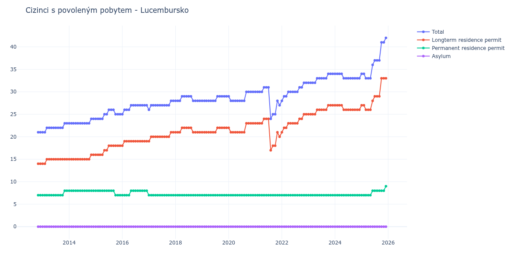

# Lucembursko

## Souhrnné statistiky (Min/Max pro rok) / Summary Statistics (Min/Max per year)

| Year   | Total Min/Max   | Longterm Residence Permit Min/Max   | Permanent Residence Permit Min/Max   | Asylum Min/Max   |
|--------|-----------------|-------------------------------------|--------------------------------------|------------------|
| 2012   | 21 / 21         | 14 / 14                             | 7 / 7                                | 0 / 0            |
| 2013   | 21 / 23         | 14 / 15                             | 7 / 8                                | 0 / 0            |
| 2014   | 23 / 24         | 15 / 16                             | 8 / 8                                | 0 / 0            |
| 2015   | 24 / 26         | 16 / 18                             | 7 / 8                                | 0 / 0            |
| 2016   | 25 / 27         | 18 / 19                             | 7 / 8                                | 0 / 0            |
| 2017   | 26 / 28         | 19 / 21                             | 7 / 7                                | 0 / 0            |
| 2018   | 28 / 29         | 21 / 22                             | 7 / 7                                | 0 / 0            |
| 2019   | 28 / 29         | 21 / 22                             | 7 / 7                                | 0 / 0            |
| 2020   | 28 / 30         | 21 / 23                             | 7 / 7                                | 0 / 0            |
| 2021   | 24 / 31         | 17 / 24                             | 7 / 7                                | 0 / 0            |
| 2022   | 28 / 32         | 21 / 25                             | 7 / 7                                | 0 / 0            |
| 2023   | 32 / 34         | 25 / 27                             | 7 / 7                                | 0 / 0            |
| 2024   | 33 / 34         | 26 / 27                             | 7 / 7                                | 0 / 0            |
| 2025   | 33 / 42         | 26 / 33                             | 7 / 9                                | 0 / 0            |

## Detailní tabulka / Detailed Data Table

| Date     | Total        | Longterm Residence Permit   | Permanent Residence Permit   | Asylum   |
|----------|--------------|-----------------------------|------------------------------|----------|
| **2012** |              |                             |                              |          |
| 11.2012  | 21           | 14                          | 7                            | 0        |
| 12.2012  | 21 (+0.00%)  | 14 (+0.00%)                 | 7 (+0.00%)                   | 0        |
| **2013** |              |                             |                              |          |
| 01.2013  | 21 (+0.00%)  | 14 (+0.00%)                 | 7 (+0.00%)                   | 0        |
| 02.2013  | 21 (+0.00%)  | 14 (+0.00%)                 | 7 (+0.00%)                   | 0        |
| 03.2013  | 22 (+4.76%)  | 15 (+7.14%)                 | 7 (+0.00%)                   | 0        |
| 04.2013  | 22 (+0.00%)  | 15 (+0.00%)                 | 7 (+0.00%)                   | 0        |
| 05.2013  | 22 (+0.00%)  | 15 (+0.00%)                 | 7 (+0.00%)                   | 0        |
| 06.2013  | 22 (+0.00%)  | 15 (+0.00%)                 | 7 (+0.00%)                   | 0        |
| 07.2013  | 22 (+0.00%)  | 15 (+0.00%)                 | 7 (+0.00%)                   | 0        |
| 08.2013  | 22 (+0.00%)  | 15 (+0.00%)                 | 7 (+0.00%)                   | 0        |
| 09.2013  | 22 (+0.00%)  | 15 (+0.00%)                 | 7 (+0.00%)                   | 0        |
| 10.2013  | 22 (+0.00%)  | 15 (+0.00%)                 | 7 (+0.00%)                   | 0        |
| 11.2013  | 23 (+4.55%)  | 15 (+0.00%)                 | 8 (+14.29%)                  | 0        |
| 12.2013  | 23 (+0.00%)  | 15 (+0.00%)                 | 8 (+0.00%)                   | 0        |
| **2014** |              |                             |                              |          |
| 01.2014  | 23 (+0.00%)  | 15 (+0.00%)                 | 8 (+0.00%)                   | 0        |
| 02.2014  | 23 (+0.00%)  | 15 (+0.00%)                 | 8 (+0.00%)                   | 0        |
| 03.2014  | 23 (+0.00%)  | 15 (+0.00%)                 | 8 (+0.00%)                   | 0        |
| 04.2014  | 23 (+0.00%)  | 15 (+0.00%)                 | 8 (+0.00%)                   | 0        |
| 05.2014  | 23 (+0.00%)  | 15 (+0.00%)                 | 8 (+0.00%)                   | 0        |
| 06.2014  | 23 (+0.00%)  | 15 (+0.00%)                 | 8 (+0.00%)                   | 0        |
| 07.2014  | 23 (+0.00%)  | 15 (+0.00%)                 | 8 (+0.00%)                   | 0        |
| 08.2014  | 23 (+0.00%)  | 15 (+0.00%)                 | 8 (+0.00%)                   | 0        |
| 09.2014  | 23 (+0.00%)  | 15 (+0.00%)                 | 8 (+0.00%)                   | 0        |
| 10.2014  | 23 (+0.00%)  | 15 (+0.00%)                 | 8 (+0.00%)                   | 0        |
| 11.2014  | 24 (+4.35%)  | 16 (+6.67%)                 | 8 (+0.00%)                   | 0        |
| 12.2014  | 24 (+0.00%)  | 16 (+0.00%)                 | 8 (+0.00%)                   | 0        |
| **2015** |              |                             |                              |          |
| 01.2015  | 24 (+0.00%)  | 16 (+0.00%)                 | 8 (+0.00%)                   | 0        |
| 02.2015  | 24 (+0.00%)  | 16 (+0.00%)                 | 8 (+0.00%)                   | 0        |
| 03.2015  | 24 (+0.00%)  | 16 (+0.00%)                 | 8 (+0.00%)                   | 0        |
| 04.2015  | 24 (+0.00%)  | 16 (+0.00%)                 | 8 (+0.00%)                   | 0        |
| 05.2015  | 25 (+4.17%)  | 17 (+6.25%)                 | 8 (+0.00%)                   | 0        |
| 06.2015  | 25 (+0.00%)  | 17 (+0.00%)                 | 8 (+0.00%)                   | 0        |
| 07.2015  | 26 (+4.00%)  | 18 (+5.88%)                 | 8 (+0.00%)                   | 0        |
| 08.2015  | 26 (+0.00%)  | 18 (+0.00%)                 | 8 (+0.00%)                   | 0        |
| 09.2015  | 26 (+0.00%)  | 18 (+0.00%)                 | 8 (+0.00%)                   | 0        |
| 10.2015  | 25 (-3.85%)  | 18 (+0.00%)                 | 7 (-12.50%)                  | 0        |
| 11.2015  | 25 (+0.00%)  | 18 (+0.00%)                 | 7 (+0.00%)                   | 0        |
| 12.2015  | 25 (+0.00%)  | 18 (+0.00%)                 | 7 (+0.00%)                   | 0        |
| **2016** |              |                             |                              |          |
| 01.2016  | 25 (+0.00%)  | 18 (+0.00%)                 | 7 (+0.00%)                   | 0        |
| 02.2016  | 26 (+4.00%)  | 19 (+5.56%)                 | 7 (+0.00%)                   | 0        |
| 03.2016  | 26 (+0.00%)  | 19 (+0.00%)                 | 7 (+0.00%)                   | 0        |
| 04.2016  | 26 (+0.00%)  | 19 (+0.00%)                 | 7 (+0.00%)                   | 0        |
| 05.2016  | 27 (+3.85%)  | 19 (+0.00%)                 | 8 (+14.29%)                  | 0        |
| 06.2016  | 27 (+0.00%)  | 19 (+0.00%)                 | 8 (+0.00%)                   | 0        |
| 07.2016  | 27 (+0.00%)  | 19 (+0.00%)                 | 8 (+0.00%)                   | 0        |
| 08.2016  | 27 (+0.00%)  | 19 (+0.00%)                 | 8 (+0.00%)                   | 0        |
| 09.2016  | 27 (+0.00%)  | 19 (+0.00%)                 | 8 (+0.00%)                   | 0        |
| 10.2016  | 27 (+0.00%)  | 19 (+0.00%)                 | 8 (+0.00%)                   | 0        |
| 11.2016  | 27 (+0.00%)  | 19 (+0.00%)                 | 8 (+0.00%)                   | 0        |
| 12.2016  | 27 (+0.00%)  | 19 (+0.00%)                 | 8 (+0.00%)                   | 0        |
| **2017** |              |                             |                              |          |
| 01.2017  | 26 (-3.70%)  | 19 (+0.00%)                 | 7 (-12.50%)                  | 0        |
| 02.2017  | 27 (+3.85%)  | 20 (+5.26%)                 | 7 (+0.00%)                   | 0        |
| 03.2017  | 27 (+0.00%)  | 20 (+0.00%)                 | 7 (+0.00%)                   | 0        |
| 04.2017  | 27 (+0.00%)  | 20 (+0.00%)                 | 7 (+0.00%)                   | 0        |
| 05.2017  | 27 (+0.00%)  | 20 (+0.00%)                 | 7 (+0.00%)                   | 0        |
| 06.2017  | 27 (+0.00%)  | 20 (+0.00%)                 | 7 (+0.00%)                   | 0        |
| 07.2017  | 27 (+0.00%)  | 20 (+0.00%)                 | 7 (+0.00%)                   | 0        |
| 08.2017  | 27 (+0.00%)  | 20 (+0.00%)                 | 7 (+0.00%)                   | 0        |
| 09.2017  | 27 (+0.00%)  | 20 (+0.00%)                 | 7 (+0.00%)                   | 0        |
| 10.2017  | 27 (+0.00%)  | 20 (+0.00%)                 | 7 (+0.00%)                   | 0        |
| 11.2017  | 28 (+3.70%)  | 21 (+5.00%)                 | 7 (+0.00%)                   | 0        |
| 12.2017  | 28 (+0.00%)  | 21 (+0.00%)                 | 7 (+0.00%)                   | 0        |
| **2018** |              |                             |                              |          |
| 01.2018  | 28 (+0.00%)  | 21 (+0.00%)                 | 7 (+0.00%)                   | 0        |
| 02.2018  | 28 (+0.00%)  | 21 (+0.00%)                 | 7 (+0.00%)                   | 0        |
| 03.2018  | 28 (+0.00%)  | 21 (+0.00%)                 | 7 (+0.00%)                   | 0        |
| 04.2018  | 29 (+3.57%)  | 22 (+4.76%)                 | 7 (+0.00%)                   | 0        |
| 05.2018  | 29 (+0.00%)  | 22 (+0.00%)                 | 7 (+0.00%)                   | 0        |
| 06.2018  | 29 (+0.00%)  | 22 (+0.00%)                 | 7 (+0.00%)                   | 0        |
| 07.2018  | 29 (+0.00%)  | 22 (+0.00%)                 | 7 (+0.00%)                   | 0        |
| 08.2018  | 29 (+0.00%)  | 22 (+0.00%)                 | 7 (+0.00%)                   | 0        |
| 09.2018  | 28 (-3.45%)  | 21 (-4.55%)                 | 7 (+0.00%)                   | 0        |
| 10.2018  | 28 (+0.00%)  | 21 (+0.00%)                 | 7 (+0.00%)                   | 0        |
| 11.2018  | 28 (+0.00%)  | 21 (+0.00%)                 | 7 (+0.00%)                   | 0        |
| 12.2018  | 28 (+0.00%)  | 21 (+0.00%)                 | 7 (+0.00%)                   | 0        |
| **2019** |              |                             |                              |          |
| 01.2019  | 28 (+0.00%)  | 21 (+0.00%)                 | 7 (+0.00%)                   | 0        |
| 02.2019  | 28 (+0.00%)  | 21 (+0.00%)                 | 7 (+0.00%)                   | 0        |
| 03.2019  | 28 (+0.00%)  | 21 (+0.00%)                 | 7 (+0.00%)                   | 0        |
| 04.2019  | 28 (+0.00%)  | 21 (+0.00%)                 | 7 (+0.00%)                   | 0        |
| 05.2019  | 28 (+0.00%)  | 21 (+0.00%)                 | 7 (+0.00%)                   | 0        |
| 06.2019  | 28 (+0.00%)  | 21 (+0.00%)                 | 7 (+0.00%)                   | 0        |
| 07.2019  | 28 (+0.00%)  | 21 (+0.00%)                 | 7 (+0.00%)                   | 0        |
| 08.2019  | 29 (+3.57%)  | 22 (+4.76%)                 | 7 (+0.00%)                   | 0        |
| 09.2019  | 29 (+0.00%)  | 22 (+0.00%)                 | 7 (+0.00%)                   | 0        |
| 10.2019  | 29 (+0.00%)  | 22 (+0.00%)                 | 7 (+0.00%)                   | 0        |
| 11.2019  | 29 (+0.00%)  | 22 (+0.00%)                 | 7 (+0.00%)                   | 0        |
| 12.2019  | 29 (+0.00%)  | 22 (+0.00%)                 | 7 (+0.00%)                   | 0        |
| **2020** |              |                             |                              |          |
| 01.2020  | 29 (+0.00%)  | 22 (+0.00%)                 | 7 (+0.00%)                   | 0        |
| 02.2020  | 28 (-3.45%)  | 21 (-4.55%)                 | 7 (+0.00%)                   | 0        |
| 03.2020  | 28 (+0.00%)  | 21 (+0.00%)                 | 7 (+0.00%)                   | 0        |
| 04.2020  | 28 (+0.00%)  | 21 (+0.00%)                 | 7 (+0.00%)                   | 0        |
| 05.2020  | 28 (+0.00%)  | 21 (+0.00%)                 | 7 (+0.00%)                   | 0        |
| 06.2020  | 28 (+0.00%)  | 21 (+0.00%)                 | 7 (+0.00%)                   | 0        |
| 07.2020  | 28 (+0.00%)  | 21 (+0.00%)                 | 7 (+0.00%)                   | 0        |
| 08.2020  | 28 (+0.00%)  | 21 (+0.00%)                 | 7 (+0.00%)                   | 0        |
| 09.2020  | 30 (+7.14%)  | 23 (+9.52%)                 | 7 (+0.00%)                   | 0        |
| 10.2020  | 30 (+0.00%)  | 23 (+0.00%)                 | 7 (+0.00%)                   | 0        |
| 11.2020  | 30 (+0.00%)  | 23 (+0.00%)                 | 7 (+0.00%)                   | 0        |
| 12.2020  | 30 (+0.00%)  | 23 (+0.00%)                 | 7 (+0.00%)                   | 0        |
| **2021** |              |                             |                              |          |
| 01.2021  | 30 (+0.00%)  | 23 (+0.00%)                 | 7 (+0.00%)                   | 0        |
| 02.2021  | 30 (+0.00%)  | 23 (+0.00%)                 | 7 (+0.00%)                   | 0        |
| 03.2021  | 30 (+0.00%)  | 23 (+0.00%)                 | 7 (+0.00%)                   | 0        |
| 04.2021  | 30 (+0.00%)  | 23 (+0.00%)                 | 7 (+0.00%)                   | 0        |
| 05.2021  | 31 (+3.33%)  | 24 (+4.35%)                 | 7 (+0.00%)                   | 0        |
| 06.2021  | 31 (+0.00%)  | 24 (+0.00%)                 | 7 (+0.00%)                   | 0        |
| 07.2021  | 31 (+0.00%)  | 24 (+0.00%)                 | 7 (+0.00%)                   | 0        |
| 08.2021  | 24 (-22.58%) | 17 (-29.17%)                | 7 (+0.00%)                   | 0        |
| 09.2021  | 25 (+4.17%)  | 18 (+5.88%)                 | 7 (+0.00%)                   | 0        |
| 10.2021  | 25 (+0.00%)  | 18 (+0.00%)                 | 7 (+0.00%)                   | 0        |
| 11.2021  | 28 (+12.00%) | 21 (+16.67%)                | 7 (+0.00%)                   | 0        |
| 12.2021  | 27 (-3.57%)  | 20 (-4.76%)                 | 7 (+0.00%)                   | 0        |
| **2022** |              |                             |                              |          |
| 01.2022  | 28 (+3.70%)  | 21 (+5.00%)                 | 7 (+0.00%)                   | 0        |
| 02.2022  | 29 (+3.57%)  | 22 (+4.76%)                 | 7 (+0.00%)                   | 0        |
| 03.2022  | 29 (+0.00%)  | 22 (+0.00%)                 | 7 (+0.00%)                   | 0        |
| 04.2022  | 30 (+3.45%)  | 23 (+4.55%)                 | 7 (+0.00%)                   | 0        |
| 05.2022  | 30 (+0.00%)  | 23 (+0.00%)                 | 7 (+0.00%)                   | 0        |
| 06.2022  | 30 (+0.00%)  | 23 (+0.00%)                 | 7 (+0.00%)                   | 0        |
| 07.2022  | 30 (+0.00%)  | 23 (+0.00%)                 | 7 (+0.00%)                   | 0        |
| 08.2022  | 30 (+0.00%)  | 23 (+0.00%)                 | 7 (+0.00%)                   | 0        |
| 09.2022  | 31 (+3.33%)  | 24 (+4.35%)                 | 7 (+0.00%)                   | 0        |
| 10.2022  | 31 (+0.00%)  | 24 (+0.00%)                 | 7 (+0.00%)                   | 0        |
| 11.2022  | 32 (+3.23%)  | 25 (+4.17%)                 | 7 (+0.00%)                   | 0        |
| 12.2022  | 32 (+0.00%)  | 25 (+0.00%)                 | 7 (+0.00%)                   | 0        |
| **2023** |              |                             |                              |          |
| 01.2023  | 32 (+0.00%)  | 25 (+0.00%)                 | 7 (+0.00%)                   | 0        |
| 02.2023  | 32 (+0.00%)  | 25 (+0.00%)                 | 7 (+0.00%)                   | 0        |
| 03.2023  | 32 (+0.00%)  | 25 (+0.00%)                 | 7 (+0.00%)                   | 0        |
| 04.2023  | 32 (+0.00%)  | 25 (+0.00%)                 | 7 (+0.00%)                   | 0        |
| 05.2023  | 33 (+3.12%)  | 26 (+4.00%)                 | 7 (+0.00%)                   | 0        |
| 06.2023  | 33 (+0.00%)  | 26 (+0.00%)                 | 7 (+0.00%)                   | 0        |
| 07.2023  | 33 (+0.00%)  | 26 (+0.00%)                 | 7 (+0.00%)                   | 0        |
| 08.2023  | 33 (+0.00%)  | 26 (+0.00%)                 | 7 (+0.00%)                   | 0        |
| 09.2023  | 33 (+0.00%)  | 26 (+0.00%)                 | 7 (+0.00%)                   | 0        |
| 10.2023  | 34 (+3.03%)  | 27 (+3.85%)                 | 7 (+0.00%)                   | 0        |
| 11.2023  | 34 (+0.00%)  | 27 (+0.00%)                 | 7 (+0.00%)                   | 0        |
| 12.2023  | 34 (+0.00%)  | 27 (+0.00%)                 | 7 (+0.00%)                   | 0        |
| **2024** |              |                             |                              |          |
| 01.2024  | 34 (+0.00%)  | 27 (+0.00%)                 | 7 (+0.00%)                   | 0        |
| 02.2024  | 34 (+0.00%)  | 27 (+0.00%)                 | 7 (+0.00%)                   | 0        |
| 03.2024  | 34 (+0.00%)  | 27 (+0.00%)                 | 7 (+0.00%)                   | 0        |
| 04.2024  | 34 (+0.00%)  | 27 (+0.00%)                 | 7 (+0.00%)                   | 0        |
| 05.2024  | 33 (-2.94%)  | 26 (-3.70%)                 | 7 (+0.00%)                   | 0        |
| 06.2024  | 33 (+0.00%)  | 26 (+0.00%)                 | 7 (+0.00%)                   | 0        |
| 07.2024  | 33 (+0.00%)  | 26 (+0.00%)                 | 7 (+0.00%)                   | 0        |
| 08.2024  | 33 (+0.00%)  | 26 (+0.00%)                 | 7 (+0.00%)                   | 0        |
| 09.2024  | 33 (+0.00%)  | 26 (+0.00%)                 | 7 (+0.00%)                   | 0        |
| 10.2024  | 33 (+0.00%)  | 26 (+0.00%)                 | 7 (+0.00%)                   | 0        |
| 11.2024  | 33 (+0.00%)  | 26 (+0.00%)                 | 7 (+0.00%)                   | 0        |
| 12.2024  | 33 (+0.00%)  | 26 (+0.00%)                 | 7 (+0.00%)                   | 0        |
| **2025** |              |                             |                              |          |
| 01.2025  | 34 (+3.03%)  | 27 (+3.85%)                 | 7 (+0.00%)                   | 0        |
| 02.2025  | 34 (+0.00%)  | 27 (+0.00%)                 | 7 (+0.00%)                   | 0        |
| 03.2025  | 33 (-2.94%)  | 26 (-3.70%)                 | 7 (+0.00%)                   | 0        |
| 04.2025  | 33 (+0.00%)  | 26 (+0.00%)                 | 7 (+0.00%)                   | 0        |
| 05.2025  | 33 (+0.00%)  | 26 (+0.00%)                 | 7 (+0.00%)                   | 0        |
| 06.2025  | 36 (+9.09%)  | 28 (+7.69%)                 | 8 (+14.29%)                  | 0        |
| 07.2025  | 37 (+2.78%)  | 29 (+3.57%)                 | 8 (+0.00%)                   | 0        |
| 08.2025  | 37 (+0.00%)  | 29 (+0.00%)                 | 8 (+0.00%)                   | 0        |
| 09.2025  | 37 (+0.00%)  | 29 (+0.00%)                 | 8 (+0.00%)                   | 0        |
| 10.2025  | 41 (+10.81%) | 33 (+13.79%)                | 8 (+0.00%)                   | 0        |
| 11.2025  | 41 (+0.00%)  | 33 (+0.00%)                 | 8 (+0.00%)                   | 0        |
| 12.2025  | 42 (+2.44%)  | 33 (+0.00%)                 | 9 (+12.50%)                  | 0        |
