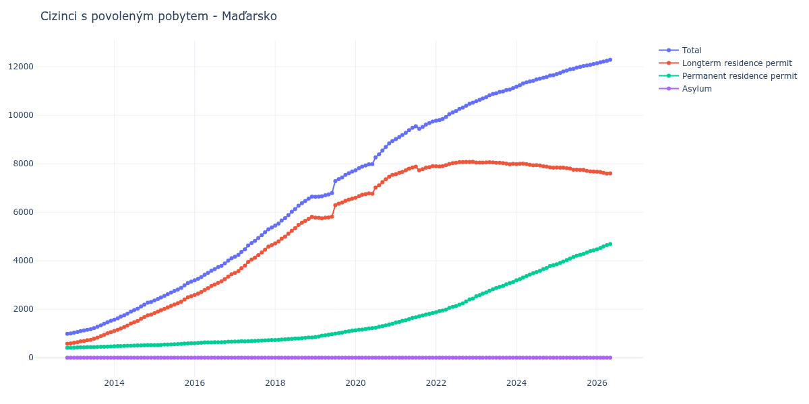

# Maďarsko

## Souhrnné statistiky (Min/Max pro rok) / Summary Statistics (Min/Max per year)

| Year   | Total           | Longterm Residence Permit   | Permanent Residence Permit   | Asylum   |
|--------|-----------------|-----------------------------|------------------------------|----------|
| 2012   | 987 / 999       | 577 / 588                   | 410 / 411                    | 0 / 0    |
| 2013   | 1 037 / 1 519   | 621 / 1 054                 | 416 / 465                    | 0 / 0    |
| 2014   | 1 570 / 2 300   | 1 101 / 1 780               | 469 / 520                    | 0 / 0    |
| 2015   | 2 359 / 3 135   | 1 839 / 2 537               | 520 / 598                    | 0 / 0    |
| 2016   | 3 191 / 4 102   | 2 591 / 3 444               | 600 / 658                    | 0 / 0    |
| 2017   | 4 163 / 5 370   | 3 496 / 4 644               | 667 / 726                    | 0 / 0    |
| 2018   | 5 448 / 6 645   | 4 717 / 5 810               | 731 / 835                    | 0 / 0    |
| 2019   | 6 634 / 7 675   | 5 749 / 6 560               | 857 / 1 115                  | 0 / 0    |
| 2020   | 7 730 / 8 938   | 6 596 / 7 538               | 1 134 / 1 400                | 0 / 0    |
| 2021   | 9 017 / 9 740   | 7 568 / 7 898               | 1 449 / 1 842                | 0 / 0    |
| 2022   | 9 772 / 10 517  | 7 884 / 8 078               | 1 876 / 2 439                | 0 / 0    |
| 2023   | 10 577 / 11 117 | 7 977 / 8 061               | 2 533 / 3 117                | 0 / 0    |
| 2024   | 11 179 / 11 650 | 7 837 / 8 002               | 3 192 / 3 813                | 0 / 0    |
| 2025   | 11 697 / 12 111 | 7 681 / 7 844               | 3 853 / 4 430                | 0 / 0    |
| 2026   | 12 139 / 12 288 | 7 597 / 7 670               | 4 469 / 4 684                | 0 / 0    |

## Detailní tabulka / Detailed Data Table

| Date     | Total           | Longterm Residence Permit   | Permanent Residence Permit   | Asylum   |
|----------|-----------------|-----------------------------|------------------------------|----------|
| **2012** |                 |                             |                              |          |
| 11.2012  | 987             | 577                         | 410                          | 0        |
| 12.2012  | 999 (+1.22%)    | 588 (+1.91%)                | 411 (+0.24%)                 | 0        |
| **2013** |                 |                             |                              |          |
| 01.2013  | 1 037 (+3.80%)  | 621 (+5.61%)                | 416 (+1.22%)                 | 0        |
| 02.2013  | 1 062 (+2.41%)  | 639 (+2.90%)                | 423 (+1.68%)                 | 0        |
| 03.2013  | 1 100 (+3.58%)  | 671 (+5.01%)                | 429 (+1.42%)                 | 0        |
| 04.2013  | 1 122 (+2.00%)  | 690 (+2.83%)                | 432 (+0.70%)                 | 0        |
| 05.2013  | 1 154 (+2.85%)  | 719 (+4.20%)                | 435 (+0.69%)                 | 0        |
| 06.2013  | 1 176 (+1.91%)  | 736 (+2.36%)                | 440 (+1.15%)                 | 0        |
| 07.2013  | 1 224 (+4.08%)  | 784 (+6.52%)                | 440 (+0.00%)                 | 0        |
| 08.2013  | 1 274 (+4.08%)  | 829 (+5.74%)                | 445 (+1.14%)                 | 0        |
| 09.2013  | 1 336 (+4.87%)  | 886 (+6.88%)                | 450 (+1.12%)                 | 0        |
| 10.2013  | 1 399 (+4.72%)  | 947 (+6.88%)                | 452 (+0.44%)                 | 0        |
| 11.2013  | 1 462 (+4.50%)  | 1 006 (+6.23%)              | 456 (+0.88%)                 | 0        |
| 12.2013  | 1 519 (+3.90%)  | 1 054 (+4.77%)              | 465 (+1.97%)                 | 0        |
| **2014** |                 |                             |                              |          |
| 01.2014  | 1 570 (+3.36%)  | 1 101 (+4.46%)              | 469 (+0.86%)                 | 0        |
| 02.2014  | 1 626 (+3.57%)  | 1 149 (+4.36%)              | 477 (+1.71%)                 | 0        |
| 03.2014  | 1 691 (+4.00%)  | 1 209 (+5.22%)              | 482 (+1.05%)                 | 0        |
| 04.2014  | 1 751 (+3.55%)  | 1 265 (+4.63%)              | 486 (+0.83%)                 | 0        |
| 05.2014  | 1 819 (+3.88%)  | 1 329 (+5.06%)              | 490 (+0.82%)                 | 0        |
| 06.2014  | 1 901 (+4.51%)  | 1 407 (+5.87%)              | 494 (+0.82%)                 | 0        |
| 07.2014  | 1 964 (+3.31%)  | 1 465 (+4.12%)              | 499 (+1.01%)                 | 0        |
| 08.2014  | 2 021 (+2.90%)  | 1 514 (+3.34%)              | 507 (+1.60%)                 | 0        |
| 09.2014  | 2 110 (+4.40%)  | 1 601 (+5.75%)              | 509 (+0.39%)                 | 0        |
| 10.2014  | 2 190 (+3.79%)  | 1 676 (+4.68%)              | 514 (+0.98%)                 | 0        |
| 11.2014  | 2 268 (+3.56%)  | 1 749 (+4.36%)              | 519 (+0.97%)                 | 0        |
| 12.2014  | 2 300 (+1.41%)  | 1 780 (+1.77%)              | 520 (+0.19%)                 | 0        |
| **2015** |                 |                             |                              |          |
| 01.2015  | 2 359 (+2.57%)  | 1 839 (+3.31%)              | 520 (+0.00%)                 | 0        |
| 02.2015  | 2 425 (+2.80%)  | 1 903 (+3.48%)              | 522 (+0.38%)                 | 0        |
| 03.2015  | 2 487 (+2.56%)  | 1 961 (+3.05%)              | 526 (+0.77%)                 | 0        |
| 04.2015  | 2 551 (+2.57%)  | 2 011 (+2.55%)              | 540 (+2.66%)                 | 0        |
| 05.2015  | 2 615 (+2.51%)  | 2 073 (+3.08%)              | 542 (+0.37%)                 | 0        |
| 06.2015  | 2 688 (+2.79%)  | 2 138 (+3.14%)              | 550 (+1.48%)                 | 0        |
| 07.2015  | 2 753 (+2.42%)  | 2 196 (+2.71%)              | 557 (+1.27%)                 | 0        |
| 08.2015  | 2 811 (+2.11%)  | 2 250 (+2.46%)              | 561 (+0.72%)                 | 0        |
| 09.2015  | 2 878 (+2.38%)  | 2 309 (+2.62%)              | 569 (+1.43%)                 | 0        |
| 10.2015  | 2 982 (+3.61%)  | 2 399 (+3.90%)              | 583 (+2.46%)                 | 0        |
| 11.2015  | 3 082 (+3.35%)  | 2 493 (+3.92%)              | 589 (+1.03%)                 | 0        |
| 12.2015  | 3 135 (+1.72%)  | 2 537 (+1.76%)              | 598 (+1.53%)                 | 0        |
| **2016** |                 |                             |                              |          |
| 01.2016  | 3 191 (+1.79%)  | 2 591 (+2.13%)              | 600 (+0.33%)                 | 0        |
| 02.2016  | 3 254 (+1.97%)  | 2 645 (+2.08%)              | 609 (+1.50%)                 | 0        |
| 03.2016  | 3 328 (+2.27%)  | 2 707 (+2.34%)              | 621 (+1.97%)                 | 0        |
| 04.2016  | 3 423 (+2.85%)  | 2 794 (+3.21%)              | 629 (+1.29%)                 | 0        |
| 05.2016  | 3 499 (+2.22%)  | 2 867 (+2.61%)              | 632 (+0.48%)                 | 0        |
| 06.2016  | 3 591 (+2.63%)  | 2 956 (+3.10%)              | 635 (+0.47%)                 | 0        |
| 07.2016  | 3 655 (+1.78%)  | 3 017 (+2.06%)              | 638 (+0.47%)                 | 0        |
| 08.2016  | 3 734 (+2.16%)  | 3 092 (+2.49%)              | 642 (+0.63%)                 | 0        |
| 09.2016  | 3 792 (+1.55%)  | 3 150 (+1.88%)              | 642 (+0.00%)                 | 0        |
| 10.2016  | 3 887 (+2.51%)  | 3 239 (+2.83%)              | 648 (+0.93%)                 | 0        |
| 11.2016  | 4 004 (+3.01%)  | 3 346 (+3.30%)              | 658 (+1.54%)                 | 0        |
| 12.2016  | 4 102 (+2.45%)  | 3 444 (+2.93%)              | 658 (+0.00%)                 | 0        |
| **2017** |                 |                             |                              |          |
| 01.2017  | 4 163 (+1.49%)  | 3 496 (+1.51%)              | 667 (+1.37%)                 | 0        |
| 02.2017  | 4 239 (+1.83%)  | 3 570 (+2.12%)              | 669 (+0.30%)                 | 0        |
| 03.2017  | 4 370 (+3.09%)  | 3 693 (+3.45%)              | 677 (+1.20%)                 | 0        |
| 04.2017  | 4 474 (+2.38%)  | 3 798 (+2.84%)              | 676 (-0.15%)                 | 0        |
| 05.2017  | 4 630 (+3.49%)  | 3 950 (+4.00%)              | 680 (+0.59%)                 | 0        |
| 06.2017  | 4 731 (+2.18%)  | 4 045 (+2.41%)              | 686 (+0.88%)                 | 0        |
| 07.2017  | 4 816 (+1.80%)  | 4 121 (+1.88%)              | 695 (+1.31%)                 | 0        |
| 08.2017  | 4 934 (+2.45%)  | 4 230 (+2.64%)              | 704 (+1.29%)                 | 0        |
| 09.2017  | 5 051 (+2.37%)  | 4 342 (+2.65%)              | 709 (+0.71%)                 | 0        |
| 10.2017  | 5 175 (+2.45%)  | 4 458 (+2.67%)              | 717 (+1.13%)                 | 0        |
| 11.2017  | 5 300 (+2.42%)  | 4 580 (+2.74%)              | 720 (+0.42%)                 | 0        |
| 12.2017  | 5 370 (+1.32%)  | 4 644 (+1.40%)              | 726 (+0.83%)                 | 0        |
| **2018** |                 |                             |                              |          |
| 01.2018  | 5 448 (+1.45%)  | 4 717 (+1.57%)              | 731 (+0.69%)                 | 0        |
| 02.2018  | 5 534 (+1.58%)  | 4 799 (+1.74%)              | 735 (+0.55%)                 | 0        |
| 03.2018  | 5 655 (+2.19%)  | 4 907 (+2.25%)              | 748 (+1.77%)                 | 0        |
| 04.2018  | 5 753 (+1.73%)  | 4 993 (+1.75%)              | 760 (+1.60%)                 | 0        |
| 05.2018  | 5 883 (+2.26%)  | 5 114 (+2.42%)              | 769 (+1.18%)                 | 0        |
| 06.2018  | 6 017 (+2.28%)  | 5 236 (+2.39%)              | 781 (+1.56%)                 | 0        |
| 07.2018  | 6 129 (+1.86%)  | 5 340 (+1.99%)              | 789 (+1.02%)                 | 0        |
| 08.2018  | 6 270 (+2.30%)  | 5 476 (+2.55%)              | 794 (+0.63%)                 | 0        |
| 09.2018  | 6 376 (+1.69%)  | 5 571 (+1.73%)              | 805 (+1.39%)                 | 0        |
| 10.2018  | 6 460 (+1.32%)  | 5 644 (+1.31%)              | 816 (+1.37%)                 | 0        |
| 11.2018  | 6 560 (+1.55%)  | 5 730 (+1.52%)              | 830 (+1.72%)                 | 0        |
| 12.2018  | 6 645 (+1.30%)  | 5 810 (+1.40%)              | 835 (+0.60%)                 | 0        |
| **2019** |                 |                             |                              |          |
| 01.2019  | 6 634 (-0.17%)  | 5 777 (-0.57%)              | 857 (+2.63%)                 | 0        |
| 02.2019  | 6 643 (+0.14%)  | 5 766 (-0.19%)              | 877 (+2.33%)                 | 0        |
| 03.2019  | 6 655 (+0.18%)  | 5 749 (-0.29%)              | 906 (+3.31%)                 | 0        |
| 04.2019  | 6 702 (+0.71%)  | 5 776 (+0.47%)              | 926 (+2.21%)                 | 0        |
| 05.2019  | 6 731 (+0.43%)  | 5 781 (+0.09%)              | 950 (+2.59%)                 | 0        |
| 06.2019  | 6 793 (+0.92%)  | 5 818 (+0.64%)              | 975 (+2.63%)                 | 0        |
| 07.2019  | 7 282 (+7.20%)  | 6 290 (+8.11%)              | 992 (+1.74%)                 | 0        |
| 08.2019  | 7 366 (+1.15%)  | 6 353 (+1.00%)              | 1 013 (+2.12%)               | 0        |
| 09.2019  | 7 436 (+0.95%)  | 6 399 (+0.72%)              | 1 037 (+2.37%)               | 0        |
| 10.2019  | 7 538 (+1.37%)  | 6 467 (+1.06%)              | 1 071 (+3.28%)               | 0        |
| 11.2019  | 7 611 (+0.97%)  | 6 520 (+0.82%)              | 1 091 (+1.87%)               | 0        |
| 12.2019  | 7 675 (+0.84%)  | 6 560 (+0.61%)              | 1 115 (+2.20%)               | 0        |
| **2020** |                 |                             |                              |          |
| 01.2020  | 7 730 (+0.72%)  | 6 596 (+0.55%)              | 1 134 (+1.70%)               | 0        |
| 02.2020  | 7 817 (+1.13%)  | 6 665 (+1.05%)              | 1 152 (+1.59%)               | 0        |
| 03.2020  | 7 879 (+0.79%)  | 6 717 (+0.78%)              | 1 162 (+0.87%)               | 0        |
| 04.2020  | 7 929 (+0.63%)  | 6 746 (+0.43%)              | 1 183 (+1.81%)               | 0        |
| 05.2020  | 7 980 (+0.64%)  | 6 774 (+0.42%)              | 1 206 (+1.94%)               | 0        |
| 06.2020  | 7 983 (+0.04%)  | 6 764 (-0.15%)              | 1 219 (+1.08%)               | 0        |
| 07.2020  | 8 259 (+3.46%)  | 7 021 (+3.80%)              | 1 238 (+1.56%)               | 0        |
| 08.2020  | 8 389 (+1.57%)  | 7 110 (+1.27%)              | 1 279 (+3.31%)               | 0        |
| 09.2020  | 8 545 (+1.86%)  | 7 241 (+1.84%)              | 1 304 (+1.95%)               | 0        |
| 10.2020  | 8 691 (+1.71%)  | 7 361 (+1.66%)              | 1 330 (+1.99%)               | 0        |
| 11.2020  | 8 837 (+1.68%)  | 7 466 (+1.43%)              | 1 371 (+3.08%)               | 0        |
| 12.2020  | 8 938 (+1.14%)  | 7 538 (+0.96%)              | 1 400 (+2.12%)               | 0        |
| **2021** |                 |                             |                              |          |
| 01.2021  | 9 017 (+0.88%)  | 7 568 (+0.40%)              | 1 449 (+3.50%)               | 0        |
| 02.2021  | 9 103 (+0.95%)  | 7 625 (+0.75%)              | 1 478 (+2.00%)               | 0        |
| 03.2021  | 9 185 (+0.90%)  | 7 665 (+0.52%)              | 1 520 (+2.84%)               | 0        |
| 04.2021  | 9 273 (+0.96%)  | 7 727 (+0.81%)              | 1 546 (+1.71%)               | 0        |
| 05.2021  | 9 386 (+1.22%)  | 7 799 (+0.93%)              | 1 587 (+2.65%)               | 0        |
| 06.2021  | 9 485 (+1.05%)  | 7 843 (+0.56%)              | 1 642 (+3.47%)               | 0        |
| 07.2021  | 9 548 (+0.66%)  | 7 879 (+0.46%)              | 1 669 (+1.64%)               | 0        |
| 08.2021  | 9 439 (-1.14%)  | 7 729 (-1.90%)              | 1 710 (+2.46%)               | 0        |
| 09.2021  | 9 517 (+0.83%)  | 7 776 (+0.61%)              | 1 741 (+1.81%)               | 0        |
| 10.2021  | 9 613 (+1.01%)  | 7 839 (+0.81%)              | 1 774 (+1.90%)               | 0        |
| 11.2021  | 9 676 (+0.66%)  | 7 862 (+0.29%)              | 1 814 (+2.25%)               | 0        |
| 12.2021  | 9 740 (+0.66%)  | 7 898 (+0.46%)              | 1 842 (+1.54%)               | 0        |
| **2022** |                 |                             |                              |          |
| 01.2022  | 9 772 (+0.33%)  | 7 896 (-0.03%)              | 1 876 (+1.85%)               | 0        |
| 02.2022  | 9 804 (+0.33%)  | 7 884 (-0.15%)              | 1 920 (+2.35%)               | 0        |
| 03.2022  | 9 846 (+0.43%)  | 7 899 (+0.19%)              | 1 947 (+1.41%)               | 0        |
| 04.2022  | 9 927 (+0.82%)  | 7 939 (+0.51%)              | 1 988 (+2.11%)               | 0        |
| 05.2022  | 10 046 (+1.20%) | 7 994 (+0.69%)              | 2 052 (+3.22%)               | 0        |
| 06.2022  | 10 118 (+0.72%) | 8 022 (+0.35%)              | 2 096 (+2.14%)               | 0        |
| 07.2022  | 10 171 (+0.52%) | 8 037 (+0.19%)              | 2 134 (+1.81%)               | 0        |
| 08.2022  | 10 259 (+0.87%) | 8 069 (+0.40%)              | 2 190 (+2.62%)               | 0        |
| 09.2022  | 10 314 (+0.54%) | 8 069 (+0.00%)              | 2 245 (+2.51%)               | 0        |
| 10.2022  | 10 393 (+0.77%) | 8 074 (+0.06%)              | 2 319 (+3.30%)               | 0        |
| 11.2022  | 10 474 (+0.78%) | 8 074 (+0.00%)              | 2 400 (+3.49%)               | 0        |
| 12.2022  | 10 517 (+0.41%) | 8 078 (+0.05%)              | 2 439 (+1.63%)               | 0        |
| **2023** |                 |                             |                              |          |
| 01.2023  | 10 577 (+0.57%) | 8 044 (-0.42%)              | 2 533 (+3.85%)               | 0        |
| 02.2023  | 10 633 (+0.53%) | 8 048 (+0.05%)              | 2 585 (+2.05%)               | 0        |
| 03.2023  | 10 688 (+0.52%) | 8 043 (-0.06%)              | 2 645 (+2.32%)               | 0        |
| 04.2023  | 10 747 (+0.55%) | 8 056 (+0.16%)              | 2 691 (+1.74%)               | 0        |
| 05.2023  | 10 824 (+0.72%) | 8 061 (+0.06%)              | 2 763 (+2.68%)               | 0        |
| 06.2023  | 10 880 (+0.52%) | 8 056 (-0.06%)              | 2 824 (+2.21%)               | 0        |
| 07.2023  | 10 908 (+0.26%) | 8 036 (-0.25%)              | 2 872 (+1.70%)               | 0        |
| 08.2023  | 10 959 (+0.47%) | 8 038 (+0.02%)              | 2 921 (+1.71%)               | 0        |
| 09.2023  | 10 983 (+0.22%) | 8 023 (-0.19%)              | 2 960 (+1.34%)               | 0        |
| 10.2023  | 11 035 (+0.47%) | 8 005 (-0.22%)              | 3 030 (+2.36%)               | 0        |
| 11.2023  | 11 061 (+0.24%) | 7 977 (-0.35%)              | 3 084 (+1.78%)               | 0        |
| 12.2023  | 11 117 (+0.51%) | 8 000 (+0.29%)              | 3 117 (+1.07%)               | 0        |
| **2024** |                 |                             |                              |          |
| 01.2024  | 11 179 (+0.56%) | 7 987 (-0.16%)              | 3 192 (+2.41%)               | 0        |
| 02.2024  | 11 241 (+0.55%) | 7 998 (+0.14%)              | 3 243 (+1.60%)               | 0        |
| 03.2024  | 11 309 (+0.60%) | 8 002 (+0.05%)              | 3 307 (+1.97%)               | 0        |
| 04.2024  | 11 355 (+0.41%) | 7 985 (-0.21%)              | 3 370 (+1.91%)               | 0        |
| 05.2024  | 11 389 (+0.30%) | 7 956 (-0.36%)              | 3 433 (+1.87%)               | 0        |
| 06.2024  | 11 420 (+0.27%) | 7 935 (-0.26%)              | 3 485 (+1.51%)               | 0        |
| 07.2024  | 11 474 (+0.47%) | 7 939 (+0.05%)              | 3 535 (+1.43%)               | 0        |
| 08.2024  | 11 512 (+0.33%) | 7 927 (-0.15%)              | 3 585 (+1.41%)               | 0        |
| 09.2024  | 11 545 (+0.29%) | 7 893 (-0.43%)              | 3 652 (+1.87%)               | 0        |
| 10.2024  | 11 583 (+0.33%) | 7 880 (-0.16%)              | 3 703 (+1.40%)               | 0        |
| 11.2024  | 11 632 (+0.42%) | 7 851 (-0.37%)              | 3 781 (+2.11%)               | 0        |
| 12.2024  | 11 650 (+0.15%) | 7 837 (-0.18%)              | 3 813 (+0.85%)               | 0        |
| **2025** |                 |                             |                              |          |
| 01.2025  | 11 697 (+0.40%) | 7 844 (+0.09%)              | 3 853 (+1.05%)               | 0        |
| 02.2025  | 11 746 (+0.42%) | 7 839 (-0.06%)              | 3 907 (+1.40%)               | 0        |
| 03.2025  | 11 802 (+0.48%) | 7 836 (-0.04%)              | 3 966 (+1.51%)               | 0        |
| 04.2025  | 11 842 (+0.34%) | 7 817 (-0.24%)              | 4 025 (+1.49%)               | 0        |
| 05.2025  | 11 894 (+0.44%) | 7 804 (-0.17%)              | 4 090 (+1.61%)               | 0        |
| 06.2025  | 11 912 (+0.15%) | 7 757 (-0.60%)              | 4 155 (+1.59%)               | 0        |
| 07.2025  | 11 960 (+0.40%) | 7 752 (-0.06%)              | 4 208 (+1.28%)               | 0        |
| 08.2025  | 11 994 (+0.28%) | 7 749 (-0.04%)              | 4 245 (+0.88%)               | 0        |
| 09.2025  | 12 031 (+0.31%) | 7 745 (-0.05%)              | 4 286 (+0.97%)               | 0        |
| 10.2025  | 12 050 (+0.16%) | 7 709 (-0.46%)              | 4 341 (+1.28%)               | 0        |
| 11.2025  | 12 080 (+0.25%) | 7 683 (-0.34%)              | 4 397 (+1.29%)               | 0        |
| 12.2025  | 12 111 (+0.26%) | 7 681 (-0.03%)              | 4 430 (+0.75%)               | 0        |
| **2026** |                 |                             |                              |          |
| 01.2026  | 12 139 (+0.23%) | 7 670 (-0.14%)              | 4 469 (+0.88%)               | 0        |
| 02.2026  | 12 185 (+0.38%) | 7 658 (-0.16%)              | 4 527 (+1.30%)               | 0        |
| 03.2026  | 12 214 (+0.24%) | 7 624 (-0.44%)              | 4 590 (+1.39%)               | 0        |
| 04.2026  | 12 243 (+0.24%) | 7 597 (-0.35%)              | 4 646 (+1.22%)               | 0        |
| 05.2026  | 12 288 (+0.37%) | 7 604 (+0.09%)              | 4 684 (+0.82%)               | 0        |
