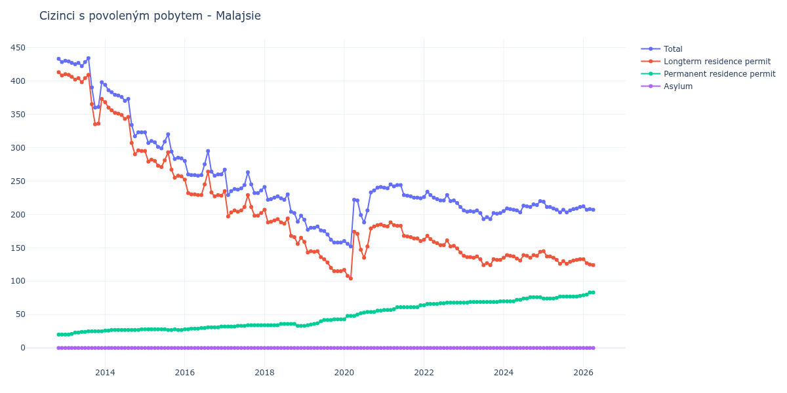

# Malajsie

## Souhrnné statistiky (Min/Max pro rok) / Summary Statistics (Min/Max per year)

| Year   | Total     | Longterm Residence Permit   | Permanent Residence Permit   | Asylum   |
|--------|-----------|-----------------------------|------------------------------|----------|
| 2012   | 428 / 433 | 408 / 413                   | 20 / 20                      | 0 / 0    |
| 2013   | 360 / 434 | 335 / 410                   | 20 / 25                      | 0 / 0    |
| 2014   | 317 / 394 | 290 / 368                   | 26 / 28                      | 0 / 0    |
| 2015   | 283 / 323 | 255 / 295                   | 27 / 28                      | 0 / 0    |
| 2016   | 258 / 295 | 227 / 264                   | 28 / 32                      | 0 / 0    |
| 2017   | 229 / 267 | 197 / 235                   | 32 / 34                      | 0 / 0    |
| 2018   | 189 / 241 | 156 / 207                   | 33 / 36                      | 0 / 0    |
| 2019   | 158 / 192 | 115 / 159                   | 33 / 43                      | 0 / 0    |
| 2020   | 152 / 241 | 104 / 185                   | 43 / 56                      | 0 / 0    |
| 2021   | 224 / 245 | 160 / 188                   | 57 / 64                      | 0 / 0    |
| 2022   | 211 / 234 | 143 / 168                   | 64 / 68                      | 0 / 0    |
| 2023   | 193 / 206 | 124 / 138                   | 68 / 70                      | 0 / 0    |
| 2024   | 203 / 220 | 131 / 144                   | 70 / 76                      | 0 / 0    |
| 2025   | 203 / 219 | 126 / 145                   | 74 / 78                      | 0 / 0    |
| 2026   | 207 / 212 | 124 / 133                   | 79 / 83                      | 0 / 0    |

## Detailní tabulka / Detailed Data Table

| Date     | Total         | Longterm Residence Permit   | Permanent Residence Permit   | Asylum   |
|----------|---------------|-----------------------------|------------------------------|----------|
| **2012** |               |                             |                              |          |
| 11.2012  | 433           | 413                         | 20                           | 0        |
| 12.2012  | 428 (-1.15%)  | 408 (-1.21%)                | 20 (+0.00%)                  | 0        |
| **2013** |               |                             |                              |          |
| 01.2013  | 430 (+0.47%)  | 410 (+0.49%)                | 20 (+0.00%)                  | 0        |
| 02.2013  | 429 (-0.23%)  | 409 (-0.24%)                | 20 (+0.00%)                  | 0        |
| 03.2013  | 427 (-0.47%)  | 406 (-0.73%)                | 21 (+5.00%)                  | 0        |
| 04.2013  | 425 (-0.47%)  | 402 (-0.99%)                | 23 (+9.52%)                  | 0        |
| 05.2013  | 427 (+0.47%)  | 404 (+0.50%)                | 23 (+0.00%)                  | 0        |
| 06.2013  | 422 (-1.17%)  | 398 (-1.49%)                | 24 (+4.35%)                  | 0        |
| 07.2013  | 428 (+1.42%)  | 404 (+1.51%)                | 24 (+0.00%)                  | 0        |
| 08.2013  | 434 (+1.40%)  | 409 (+1.24%)                | 25 (+4.17%)                  | 0        |
| 09.2013  | 390 (-10.14%) | 365 (-10.76%)               | 25 (+0.00%)                  | 0        |
| 10.2013  | 360 (-7.69%)  | 335 (-8.22%)                | 25 (+0.00%)                  | 0        |
| 11.2013  | 361 (+0.28%)  | 336 (+0.30%)                | 25 (+0.00%)                  | 0        |
| 12.2013  | 398 (+10.25%) | 373 (+11.01%)               | 25 (+0.00%)                  | 0        |
| **2014** |               |                             |                              |          |
| 01.2014  | 394 (-1.01%)  | 368 (-1.34%)                | 26 (+4.00%)                  | 0        |
| 02.2014  | 386 (-2.03%)  | 360 (-2.17%)                | 26 (+0.00%)                  | 0        |
| 03.2014  | 383 (-0.78%)  | 356 (-1.11%)                | 27 (+3.85%)                  | 0        |
| 04.2014  | 379 (-1.04%)  | 352 (-1.12%)                | 27 (+0.00%)                  | 0        |
| 05.2014  | 378 (-0.26%)  | 351 (-0.28%)                | 27 (+0.00%)                  | 0        |
| 06.2014  | 376 (-0.53%)  | 349 (-0.57%)                | 27 (+0.00%)                  | 0        |
| 07.2014  | 370 (-1.60%)  | 343 (-1.72%)                | 27 (+0.00%)                  | 0        |
| 08.2014  | 373 (+0.81%)  | 346 (+0.87%)                | 27 (+0.00%)                  | 0        |
| 09.2014  | 334 (-10.46%) | 307 (-11.27%)               | 27 (+0.00%)                  | 0        |
| 10.2014  | 317 (-5.09%)  | 290 (-5.54%)                | 27 (+0.00%)                  | 0        |
| 11.2014  | 323 (+1.89%)  | 296 (+2.07%)                | 27 (+0.00%)                  | 0        |
| 12.2014  | 323 (+0.00%)  | 295 (-0.34%)                | 28 (+3.70%)                  | 0        |
| **2015** |               |                             |                              |          |
| 01.2015  | 323 (+0.00%)  | 295 (+0.00%)                | 28 (+0.00%)                  | 0        |
| 02.2015  | 307 (-4.95%)  | 279 (-5.42%)                | 28 (+0.00%)                  | 0        |
| 03.2015  | 310 (+0.98%)  | 282 (+1.08%)                | 28 (+0.00%)                  | 0        |
| 04.2015  | 308 (-0.65%)  | 280 (-0.71%)                | 28 (+0.00%)                  | 0        |
| 05.2015  | 301 (-2.27%)  | 273 (-2.50%)                | 28 (+0.00%)                  | 0        |
| 06.2015  | 299 (-0.66%)  | 271 (-0.73%)                | 28 (+0.00%)                  | 0        |
| 07.2015  | 309 (+3.34%)  | 281 (+3.69%)                | 28 (+0.00%)                  | 0        |
| 08.2015  | 320 (+3.56%)  | 293 (+4.27%)                | 27 (-3.57%)                  | 0        |
| 09.2015  | 294 (-8.13%)  | 267 (-8.87%)                | 27 (+0.00%)                  | 0        |
| 10.2015  | 283 (-3.74%)  | 255 (-4.49%)                | 28 (+3.70%)                  | 0        |
| 11.2015  | 285 (+0.71%)  | 258 (+1.18%)                | 27 (-3.57%)                  | 0        |
| 12.2015  | 284 (-0.35%)  | 257 (-0.39%)                | 27 (+0.00%)                  | 0        |
| **2016** |               |                             |                              |          |
| 01.2016  | 280 (-1.41%)  | 252 (-1.95%)                | 28 (+3.70%)                  | 0        |
| 02.2016  | 260 (-7.14%)  | 232 (-7.94%)                | 28 (+0.00%)                  | 0        |
| 03.2016  | 259 (-0.38%)  | 230 (-0.86%)                | 29 (+3.57%)                  | 0        |
| 04.2016  | 259 (+0.00%)  | 230 (+0.00%)                | 29 (+0.00%)                  | 0        |
| 05.2016  | 258 (-0.39%)  | 229 (-0.43%)                | 29 (+0.00%)                  | 0        |
| 06.2016  | 259 (+0.39%)  | 229 (+0.00%)                | 30 (+3.45%)                  | 0        |
| 07.2016  | 275 (+6.18%)  | 245 (+6.99%)                | 30 (+0.00%)                  | 0        |
| 08.2016  | 295 (+7.27%)  | 264 (+7.76%)                | 31 (+3.33%)                  | 0        |
| 09.2016  | 264 (-10.51%) | 233 (-11.74%)               | 31 (+0.00%)                  | 0        |
| 10.2016  | 258 (-2.27%)  | 227 (-2.58%)                | 31 (+0.00%)                  | 0        |
| 11.2016  | 260 (+0.78%)  | 229 (+0.88%)                | 31 (+0.00%)                  | 0        |
| 12.2016  | 260 (+0.00%)  | 228 (-0.44%)                | 32 (+3.23%)                  | 0        |
| **2017** |               |                             |                              |          |
| 01.2017  | 267 (+2.69%)  | 235 (+3.07%)                | 32 (+0.00%)                  | 0        |
| 02.2017  | 229 (-14.23%) | 197 (-16.17%)               | 32 (+0.00%)                  | 0        |
| 03.2017  | 235 (+2.62%)  | 203 (+3.05%)                | 32 (+0.00%)                  | 0        |
| 04.2017  | 238 (+1.28%)  | 206 (+1.48%)                | 32 (+0.00%)                  | 0        |
| 05.2017  | 237 (-0.42%)  | 204 (-0.97%)                | 33 (+3.12%)                  | 0        |
| 06.2017  | 239 (+0.84%)  | 206 (+0.98%)                | 33 (+0.00%)                  | 0        |
| 07.2017  | 244 (+2.09%)  | 211 (+2.43%)                | 33 (+0.00%)                  | 0        |
| 08.2017  | 263 (+7.79%)  | 229 (+8.53%)                | 34 (+3.03%)                  | 0        |
| 09.2017  | 245 (-6.84%)  | 211 (-7.86%)                | 34 (+0.00%)                  | 0        |
| 10.2017  | 232 (-5.31%)  | 198 (-6.16%)                | 34 (+0.00%)                  | 0        |
| 11.2017  | 232 (+0.00%)  | 198 (+0.00%)                | 34 (+0.00%)                  | 0        |
| 12.2017  | 236 (+1.72%)  | 202 (+2.02%)                | 34 (+0.00%)                  | 0        |
| **2018** |               |                             |                              |          |
| 01.2018  | 241 (+2.12%)  | 207 (+2.48%)                | 34 (+0.00%)                  | 0        |
| 02.2018  | 222 (-7.88%)  | 188 (-9.18%)                | 34 (+0.00%)                  | 0        |
| 03.2018  | 223 (+0.45%)  | 189 (+0.53%)                | 34 (+0.00%)                  | 0        |
| 04.2018  | 225 (+0.90%)  | 191 (+1.06%)                | 34 (+0.00%)                  | 0        |
| 05.2018  | 227 (+0.89%)  | 193 (+1.05%)                | 34 (+0.00%)                  | 0        |
| 06.2018  | 224 (-1.32%)  | 188 (-2.59%)                | 36 (+5.88%)                  | 0        |
| 07.2018  | 222 (-0.89%)  | 186 (-1.06%)                | 36 (+0.00%)                  | 0        |
| 08.2018  | 230 (+3.60%)  | 194 (+4.30%)                | 36 (+0.00%)                  | 0        |
| 09.2018  | 204 (-11.30%) | 168 (-13.40%)               | 36 (+0.00%)                  | 0        |
| 10.2018  | 202 (-0.98%)  | 166 (-1.19%)                | 36 (+0.00%)                  | 0        |
| 11.2018  | 189 (-6.44%)  | 156 (-6.02%)                | 33 (-8.33%)                  | 0        |
| 12.2018  | 198 (+4.76%)  | 165 (+5.77%)                | 33 (+0.00%)                  | 0        |
| **2019** |               |                             |                              |          |
| 01.2019  | 192 (-3.03%)  | 159 (-3.64%)                | 33 (+0.00%)                  | 0        |
| 02.2019  | 177 (-7.81%)  | 143 (-10.06%)               | 34 (+3.03%)                  | 0        |
| 03.2019  | 180 (+1.69%)  | 145 (+1.40%)                | 35 (+2.94%)                  | 0        |
| 04.2019  | 180 (+0.00%)  | 144 (-0.69%)                | 36 (+2.86%)                  | 0        |
| 05.2019  | 182 (+1.11%)  | 145 (+0.69%)                | 37 (+2.78%)                  | 0        |
| 06.2019  | 176 (-3.30%)  | 136 (-6.21%)                | 40 (+8.11%)                  | 0        |
| 07.2019  | 175 (-0.57%)  | 133 (-2.21%)                | 42 (+5.00%)                  | 0        |
| 08.2019  | 170 (-2.86%)  | 128 (-3.76%)                | 42 (+0.00%)                  | 0        |
| 09.2019  | 162 (-4.71%)  | 120 (-6.25%)                | 42 (+0.00%)                  | 0        |
| 10.2019  | 158 (-2.47%)  | 115 (-4.17%)                | 43 (+2.38%)                  | 0        |
| 11.2019  | 158 (+0.00%)  | 115 (+0.00%)                | 43 (+0.00%)                  | 0        |
| 12.2019  | 158 (+0.00%)  | 115 (+0.00%)                | 43 (+0.00%)                  | 0        |
| **2020** |               |                             |                              |          |
| 01.2020  | 160 (+1.27%)  | 117 (+1.74%)                | 43 (+0.00%)                  | 0        |
| 02.2020  | 156 (-2.50%)  | 108 (-7.69%)                | 48 (+11.63%)                 | 0        |
| 03.2020  | 152 (-2.56%)  | 104 (-3.70%)                | 48 (+0.00%)                  | 0        |
| 04.2020  | 222 (+46.05%) | 174 (+67.31%)               | 48 (+0.00%)                  | 0        |
| 05.2020  | 221 (-0.45%)  | 171 (-1.72%)                | 50 (+4.17%)                  | 0        |
| 06.2020  | 199 (-9.95%)  | 147 (-14.04%)               | 52 (+4.00%)                  | 0        |
| 07.2020  | 188 (-5.53%)  | 135 (-8.16%)                | 53 (+1.92%)                  | 0        |
| 08.2020  | 206 (+9.57%)  | 152 (+12.59%)               | 54 (+1.89%)                  | 0        |
| 09.2020  | 233 (+13.11%) | 179 (+17.76%)               | 54 (+0.00%)                  | 0        |
| 10.2020  | 236 (+1.29%)  | 182 (+1.68%)                | 54 (+0.00%)                  | 0        |
| 11.2020  | 240 (+1.69%)  | 184 (+1.10%)                | 56 (+3.70%)                  | 0        |
| 12.2020  | 241 (+0.42%)  | 185 (+0.54%)                | 56 (+0.00%)                  | 0        |
| **2021** |               |                             |                              |          |
| 01.2021  | 240 (-0.41%)  | 183 (-1.08%)                | 57 (+1.79%)                  | 0        |
| 02.2021  | 239 (-0.42%)  | 182 (-0.55%)                | 57 (+0.00%)                  | 0        |
| 03.2021  | 245 (+2.51%)  | 188 (+3.30%)                | 57 (+0.00%)                  | 0        |
| 04.2021  | 242 (-1.22%)  | 184 (-2.13%)                | 58 (+1.75%)                  | 0        |
| 05.2021  | 244 (+0.83%)  | 183 (-0.54%)                | 61 (+5.17%)                  | 0        |
| 06.2021  | 244 (+0.00%)  | 183 (+0.00%)                | 61 (+0.00%)                  | 0        |
| 07.2021  | 229 (-6.15%)  | 168 (-8.20%)                | 61 (+0.00%)                  | 0        |
| 08.2021  | 228 (-0.44%)  | 167 (-0.60%)                | 61 (+0.00%)                  | 0        |
| 09.2021  | 227 (-0.44%)  | 166 (-0.60%)                | 61 (+0.00%)                  | 0        |
| 10.2021  | 225 (-0.88%)  | 164 (-1.20%)                | 61 (+0.00%)                  | 0        |
| 11.2021  | 225 (+0.00%)  | 164 (+0.00%)                | 61 (+0.00%)                  | 0        |
| 12.2021  | 224 (-0.44%)  | 160 (-2.44%)                | 64 (+4.92%)                  | 0        |
| **2022** |               |                             |                              |          |
| 01.2022  | 226 (+0.89%)  | 162 (+1.25%)                | 64 (+0.00%)                  | 0        |
| 02.2022  | 234 (+3.54%)  | 168 (+3.70%)                | 66 (+3.12%)                  | 0        |
| 03.2022  | 229 (-2.14%)  | 163 (-2.98%)                | 66 (+0.00%)                  | 0        |
| 04.2022  | 225 (-1.75%)  | 159 (-2.45%)                | 66 (+0.00%)                  | 0        |
| 05.2022  | 223 (-0.89%)  | 157 (-1.26%)                | 66 (+0.00%)                  | 0        |
| 06.2022  | 221 (-0.90%)  | 154 (-1.91%)                | 67 (+1.52%)                  | 0        |
| 07.2022  | 221 (+0.00%)  | 154 (+0.00%)                | 67 (+0.00%)                  | 0        |
| 08.2022  | 229 (+3.62%)  | 161 (+4.55%)                | 68 (+1.49%)                  | 0        |
| 09.2022  | 220 (-3.93%)  | 152 (-5.59%)                | 68 (+0.00%)                  | 0        |
| 10.2022  | 221 (+0.45%)  | 153 (+0.66%)                | 68 (+0.00%)                  | 0        |
| 11.2022  | 217 (-1.81%)  | 149 (-2.61%)                | 68 (+0.00%)                  | 0        |
| 12.2022  | 211 (-2.76%)  | 143 (-4.03%)                | 68 (+0.00%)                  | 0        |
| **2023** |               |                             |                              |          |
| 01.2023  | 206 (-2.37%)  | 138 (-3.50%)                | 68 (+0.00%)                  | 0        |
| 02.2023  | 204 (-0.97%)  | 136 (-1.45%)                | 68 (+0.00%)                  | 0        |
| 03.2023  | 205 (+0.49%)  | 136 (+0.00%)                | 69 (+1.47%)                  | 0        |
| 04.2023  | 204 (-0.49%)  | 135 (-0.74%)                | 69 (+0.00%)                  | 0        |
| 05.2023  | 206 (+0.98%)  | 137 (+1.48%)                | 69 (+0.00%)                  | 0        |
| 06.2023  | 202 (-1.94%)  | 133 (-2.92%)                | 69 (+0.00%)                  | 0        |
| 07.2023  | 193 (-4.46%)  | 124 (-6.77%)                | 69 (+0.00%)                  | 0        |
| 08.2023  | 196 (+1.55%)  | 127 (+2.42%)                | 69 (+0.00%)                  | 0        |
| 09.2023  | 193 (-1.53%)  | 124 (-2.36%)                | 69 (+0.00%)                  | 0        |
| 10.2023  | 202 (+4.66%)  | 133 (+7.26%)                | 69 (+0.00%)                  | 0        |
| 11.2023  | 201 (-0.50%)  | 132 (-0.75%)                | 69 (+0.00%)                  | 0        |
| 12.2023  | 202 (+0.50%)  | 132 (+0.00%)                | 70 (+1.45%)                  | 0        |
| **2024** |               |                             |                              |          |
| 01.2024  | 205 (+1.49%)  | 135 (+2.27%)                | 70 (+0.00%)                  | 0        |
| 02.2024  | 209 (+1.95%)  | 139 (+2.96%)                | 70 (+0.00%)                  | 0        |
| 03.2024  | 208 (-0.48%)  | 138 (-0.72%)                | 70 (+0.00%)                  | 0        |
| 04.2024  | 207 (-0.48%)  | 137 (-0.72%)                | 70 (+0.00%)                  | 0        |
| 05.2024  | 206 (-0.48%)  | 134 (-2.19%)                | 72 (+2.86%)                  | 0        |
| 06.2024  | 203 (-1.46%)  | 131 (-2.24%)                | 72 (+0.00%)                  | 0        |
| 07.2024  | 213 (+4.93%)  | 139 (+6.11%)                | 74 (+2.78%)                  | 0        |
| 08.2024  | 212 (-0.47%)  | 138 (-0.72%)                | 74 (+0.00%)                  | 0        |
| 09.2024  | 211 (-0.47%)  | 135 (-2.17%)                | 76 (+2.70%)                  | 0        |
| 10.2024  | 215 (+1.90%)  | 139 (+2.96%)                | 76 (+0.00%)                  | 0        |
| 11.2024  | 214 (-0.47%)  | 138 (-0.72%)                | 76 (+0.00%)                  | 0        |
| 12.2024  | 220 (+2.80%)  | 144 (+4.35%)                | 76 (+0.00%)                  | 0        |
| **2025** |               |                             |                              |          |
| 01.2025  | 219 (-0.45%)  | 145 (+0.69%)                | 74 (-2.63%)                  | 0        |
| 02.2025  | 211 (-3.65%)  | 137 (-5.52%)                | 74 (+0.00%)                  | 0        |
| 03.2025  | 211 (+0.00%)  | 137 (+0.00%)                | 74 (+0.00%)                  | 0        |
| 04.2025  | 209 (-0.95%)  | 135 (-1.46%)                | 74 (+0.00%)                  | 0        |
| 05.2025  | 207 (-0.96%)  | 132 (-2.22%)                | 75 (+1.35%)                  | 0        |
| 06.2025  | 203 (-1.93%)  | 126 (-4.55%)                | 77 (+2.67%)                  | 0        |
| 07.2025  | 207 (+1.97%)  | 130 (+3.17%)                | 77 (+0.00%)                  | 0        |
| 08.2025  | 203 (-1.93%)  | 126 (-3.08%)                | 77 (+0.00%)                  | 0        |
| 09.2025  | 206 (+1.48%)  | 129 (+2.38%)                | 77 (+0.00%)                  | 0        |
| 10.2025  | 208 (+0.97%)  | 131 (+1.55%)                | 77 (+0.00%)                  | 0        |
| 11.2025  | 209 (+0.48%)  | 132 (+0.76%)                | 77 (+0.00%)                  | 0        |
| 12.2025  | 211 (+0.96%)  | 133 (+0.76%)                | 78 (+1.30%)                  | 0        |
| **2026** |               |                             |                              |          |
| 01.2026  | 212 (+0.47%)  | 133 (+0.00%)                | 79 (+1.28%)                  | 0        |
| 02.2026  | 207 (-2.36%)  | 127 (-4.51%)                | 80 (+1.27%)                  | 0        |
| 03.2026  | 208 (+0.48%)  | 125 (-1.57%)                | 83 (+3.75%)                  | 0        |
| 04.2026  | 207 (-0.48%)  | 124 (-0.80%)                | 83 (+0.00%)                  | 0        |
