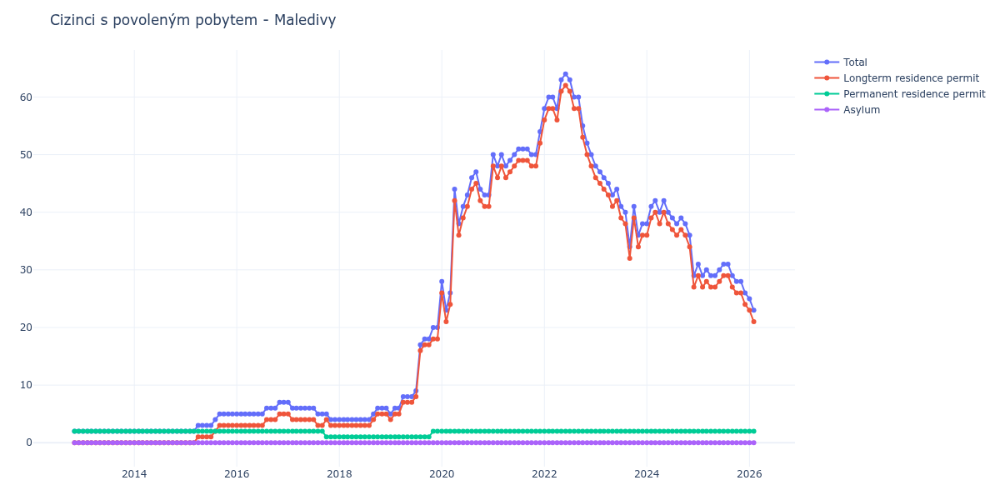

# Maledivy

## Souhrnné statistiky (Min/Max pro rok) / Summary Statistics (Min/Max per year)

| Year   | Total   | Longterm Residence Permit   | Permanent Residence Permit   | Asylum   |
|--------|---------|-----------------------------|------------------------------|----------|
| 2012   | 2 / 2   | 0 / 0                       | 2 / 2                        | 0 / 0    |
| 2013   | 2 / 2   | 0 / 0                       | 2 / 2                        | 0 / 0    |
| 2014   | 2 / 2   | 0 / 0                       | 2 / 2                        | 0 / 0    |
| 2015   | 2 / 5   | 0 / 3                       | 2 / 2                        | 0 / 0    |
| 2016   | 5 / 7   | 3 / 5                       | 2 / 2                        | 0 / 0    |
| 2017   | 4 / 7   | 3 / 5                       | 1 / 2                        | 0 / 0    |
| 2018   | 4 / 6   | 3 / 5                       | 1 / 1                        | 0 / 0    |
| 2019   | 5 / 20  | 4 / 18                      | 1 / 2                        | 0 / 0    |
| 2020   | 23 / 47 | 21 / 45                     | 2 / 2                        | 0 / 0    |
| 2021   | 48 / 54 | 46 / 52                     | 2 / 2                        | 0 / 0    |
| 2022   | 50 / 64 | 48 / 62                     | 2 / 2                        | 0 / 0    |
| 2023   | 34 / 48 | 32 / 46                     | 2 / 2                        | 0 / 0    |
| 2024   | 29 / 42 | 27 / 40                     | 2 / 2                        | 0 / 0    |
| 2025   | 26 / 31 | 24 / 29                     | 2 / 2                        | 0 / 0    |
| 2026   | 23 / 25 | 21 / 23                     | 2 / 2                        | 0 / 0    |

## Detailní tabulka / Detailed Data Table

| Date     | Total        | Longterm Residence Permit   | Permanent Residence Permit   | Asylum   |
|----------|--------------|-----------------------------|------------------------------|----------|
| **2012** |              |                             |                              |          |
| 11.2012  | 2            | 0                           | 2                            | 0        |
| 12.2012  | 2 (+0.00%)   | 0                           | 2 (+0.00%)                   | 0        |
| **2013** |              |                             |                              |          |
| 01.2013  | 2 (+0.00%)   | 0                           | 2 (+0.00%)                   | 0        |
| 02.2013  | 2 (+0.00%)   | 0                           | 2 (+0.00%)                   | 0        |
| 03.2013  | 2 (+0.00%)   | 0                           | 2 (+0.00%)                   | 0        |
| 04.2013  | 2 (+0.00%)   | 0                           | 2 (+0.00%)                   | 0        |
| 05.2013  | 2 (+0.00%)   | 0                           | 2 (+0.00%)                   | 0        |
| 06.2013  | 2 (+0.00%)   | 0                           | 2 (+0.00%)                   | 0        |
| 07.2013  | 2 (+0.00%)   | 0                           | 2 (+0.00%)                   | 0        |
| 08.2013  | 2 (+0.00%)   | 0                           | 2 (+0.00%)                   | 0        |
| 09.2013  | 2 (+0.00%)   | 0                           | 2 (+0.00%)                   | 0        |
| 10.2013  | 2 (+0.00%)   | 0                           | 2 (+0.00%)                   | 0        |
| 11.2013  | 2 (+0.00%)   | 0                           | 2 (+0.00%)                   | 0        |
| 12.2013  | 2 (+0.00%)   | 0                           | 2 (+0.00%)                   | 0        |
| **2014** |              |                             |                              |          |
| 01.2014  | 2 (+0.00%)   | 0                           | 2 (+0.00%)                   | 0        |
| 02.2014  | 2 (+0.00%)   | 0                           | 2 (+0.00%)                   | 0        |
| 03.2014  | 2 (+0.00%)   | 0                           | 2 (+0.00%)                   | 0        |
| 04.2014  | 2 (+0.00%)   | 0                           | 2 (+0.00%)                   | 0        |
| 05.2014  | 2 (+0.00%)   | 0                           | 2 (+0.00%)                   | 0        |
| 06.2014  | 2 (+0.00%)   | 0                           | 2 (+0.00%)                   | 0        |
| 07.2014  | 2 (+0.00%)   | 0                           | 2 (+0.00%)                   | 0        |
| 08.2014  | 2 (+0.00%)   | 0                           | 2 (+0.00%)                   | 0        |
| 09.2014  | 2 (+0.00%)   | 0                           | 2 (+0.00%)                   | 0        |
| 10.2014  | 2 (+0.00%)   | 0                           | 2 (+0.00%)                   | 0        |
| 11.2014  | 2 (+0.00%)   | 0                           | 2 (+0.00%)                   | 0        |
| 12.2014  | 2 (+0.00%)   | 0                           | 2 (+0.00%)                   | 0        |
| **2015** |              |                             |                              |          |
| 01.2015  | 2 (+0.00%)   | 0                           | 2 (+0.00%)                   | 0        |
| 02.2015  | 2 (+0.00%)   | 0                           | 2 (+0.00%)                   | 0        |
| 03.2015  | 2 (+0.00%)   | 0                           | 2 (+0.00%)                   | 0        |
| 04.2015  | 3 (+50.00%)  | 1                           | 2 (+0.00%)                   | 0        |
| 05.2015  | 3 (+0.00%)   | 1 (+0.00%)                  | 2 (+0.00%)                   | 0        |
| 06.2015  | 3 (+0.00%)   | 1 (+0.00%)                  | 2 (+0.00%)                   | 0        |
| 07.2015  | 3 (+0.00%)   | 1 (+0.00%)                  | 2 (+0.00%)                   | 0        |
| 08.2015  | 4 (+33.33%)  | 2 (+100.00%)                | 2 (+0.00%)                   | 0        |
| 09.2015  | 5 (+25.00%)  | 3 (+50.00%)                 | 2 (+0.00%)                   | 0        |
| 10.2015  | 5 (+0.00%)   | 3 (+0.00%)                  | 2 (+0.00%)                   | 0        |
| 11.2015  | 5 (+0.00%)   | 3 (+0.00%)                  | 2 (+0.00%)                   | 0        |
| 12.2015  | 5 (+0.00%)   | 3 (+0.00%)                  | 2 (+0.00%)                   | 0        |
| **2016** |              |                             |                              |          |
| 01.2016  | 5 (+0.00%)   | 3 (+0.00%)                  | 2 (+0.00%)                   | 0        |
| 02.2016  | 5 (+0.00%)   | 3 (+0.00%)                  | 2 (+0.00%)                   | 0        |
| 03.2016  | 5 (+0.00%)   | 3 (+0.00%)                  | 2 (+0.00%)                   | 0        |
| 04.2016  | 5 (+0.00%)   | 3 (+0.00%)                  | 2 (+0.00%)                   | 0        |
| 05.2016  | 5 (+0.00%)   | 3 (+0.00%)                  | 2 (+0.00%)                   | 0        |
| 06.2016  | 5 (+0.00%)   | 3 (+0.00%)                  | 2 (+0.00%)                   | 0        |
| 07.2016  | 5 (+0.00%)   | 3 (+0.00%)                  | 2 (+0.00%)                   | 0        |
| 08.2016  | 6 (+20.00%)  | 4 (+33.33%)                 | 2 (+0.00%)                   | 0        |
| 09.2016  | 6 (+0.00%)   | 4 (+0.00%)                  | 2 (+0.00%)                   | 0        |
| 10.2016  | 6 (+0.00%)   | 4 (+0.00%)                  | 2 (+0.00%)                   | 0        |
| 11.2016  | 7 (+16.67%)  | 5 (+25.00%)                 | 2 (+0.00%)                   | 0        |
| 12.2016  | 7 (+0.00%)   | 5 (+0.00%)                  | 2 (+0.00%)                   | 0        |
| **2017** |              |                             |                              |          |
| 01.2017  | 7 (+0.00%)   | 5 (+0.00%)                  | 2 (+0.00%)                   | 0        |
| 02.2017  | 6 (-14.29%)  | 4 (-20.00%)                 | 2 (+0.00%)                   | 0        |
| 03.2017  | 6 (+0.00%)   | 4 (+0.00%)                  | 2 (+0.00%)                   | 0        |
| 04.2017  | 6 (+0.00%)   | 4 (+0.00%)                  | 2 (+0.00%)                   | 0        |
| 05.2017  | 6 (+0.00%)   | 4 (+0.00%)                  | 2 (+0.00%)                   | 0        |
| 06.2017  | 6 (+0.00%)   | 4 (+0.00%)                  | 2 (+0.00%)                   | 0        |
| 07.2017  | 6 (+0.00%)   | 4 (+0.00%)                  | 2 (+0.00%)                   | 0        |
| 08.2017  | 5 (-16.67%)  | 3 (-25.00%)                 | 2 (+0.00%)                   | 0        |
| 09.2017  | 5 (+0.00%)   | 3 (+0.00%)                  | 2 (+0.00%)                   | 0        |
| 10.2017  | 5 (+0.00%)   | 4 (+33.33%)                 | 1 (-50.00%)                  | 0        |
| 11.2017  | 4 (-20.00%)  | 3 (-25.00%)                 | 1 (+0.00%)                   | 0        |
| 12.2017  | 4 (+0.00%)   | 3 (+0.00%)                  | 1 (+0.00%)                   | 0        |
| **2018** |              |                             |                              |          |
| 01.2018  | 4 (+0.00%)   | 3 (+0.00%)                  | 1 (+0.00%)                   | 0        |
| 02.2018  | 4 (+0.00%)   | 3 (+0.00%)                  | 1 (+0.00%)                   | 0        |
| 03.2018  | 4 (+0.00%)   | 3 (+0.00%)                  | 1 (+0.00%)                   | 0        |
| 04.2018  | 4 (+0.00%)   | 3 (+0.00%)                  | 1 (+0.00%)                   | 0        |
| 05.2018  | 4 (+0.00%)   | 3 (+0.00%)                  | 1 (+0.00%)                   | 0        |
| 06.2018  | 4 (+0.00%)   | 3 (+0.00%)                  | 1 (+0.00%)                   | 0        |
| 07.2018  | 4 (+0.00%)   | 3 (+0.00%)                  | 1 (+0.00%)                   | 0        |
| 08.2018  | 4 (+0.00%)   | 3 (+0.00%)                  | 1 (+0.00%)                   | 0        |
| 09.2018  | 5 (+25.00%)  | 4 (+33.33%)                 | 1 (+0.00%)                   | 0        |
| 10.2018  | 6 (+20.00%)  | 5 (+25.00%)                 | 1 (+0.00%)                   | 0        |
| 11.2018  | 6 (+0.00%)   | 5 (+0.00%)                  | 1 (+0.00%)                   | 0        |
| 12.2018  | 6 (+0.00%)   | 5 (+0.00%)                  | 1 (+0.00%)                   | 0        |
| **2019** |              |                             |                              |          |
| 01.2019  | 5 (-16.67%)  | 4 (-20.00%)                 | 1 (+0.00%)                   | 0        |
| 02.2019  | 6 (+20.00%)  | 5 (+25.00%)                 | 1 (+0.00%)                   | 0        |
| 03.2019  | 6 (+0.00%)   | 5 (+0.00%)                  | 1 (+0.00%)                   | 0        |
| 04.2019  | 8 (+33.33%)  | 7 (+40.00%)                 | 1 (+0.00%)                   | 0        |
| 05.2019  | 8 (+0.00%)   | 7 (+0.00%)                  | 1 (+0.00%)                   | 0        |
| 06.2019  | 8 (+0.00%)   | 7 (+0.00%)                  | 1 (+0.00%)                   | 0        |
| 07.2019  | 9 (+12.50%)  | 8 (+14.29%)                 | 1 (+0.00%)                   | 0        |
| 08.2019  | 17 (+88.89%) | 16 (+100.00%)               | 1 (+0.00%)                   | 0        |
| 09.2019  | 18 (+5.88%)  | 17 (+6.25%)                 | 1 (+0.00%)                   | 0        |
| 10.2019  | 18 (+0.00%)  | 17 (+0.00%)                 | 1 (+0.00%)                   | 0        |
| 11.2019  | 20 (+11.11%) | 18 (+5.88%)                 | 2 (+100.00%)                 | 0        |
| 12.2019  | 20 (+0.00%)  | 18 (+0.00%)                 | 2 (+0.00%)                   | 0        |
| **2020** |              |                             |                              |          |
| 01.2020  | 28 (+40.00%) | 26 (+44.44%)                | 2 (+0.00%)                   | 0        |
| 02.2020  | 23 (-17.86%) | 21 (-19.23%)                | 2 (+0.00%)                   | 0        |
| 03.2020  | 26 (+13.04%) | 24 (+14.29%)                | 2 (+0.00%)                   | 0        |
| 04.2020  | 44 (+69.23%) | 42 (+75.00%)                | 2 (+0.00%)                   | 0        |
| 05.2020  | 38 (-13.64%) | 36 (-14.29%)                | 2 (+0.00%)                   | 0        |
| 06.2020  | 41 (+7.89%)  | 39 (+8.33%)                 | 2 (+0.00%)                   | 0        |
| 07.2020  | 43 (+4.88%)  | 41 (+5.13%)                 | 2 (+0.00%)                   | 0        |
| 08.2020  | 46 (+6.98%)  | 44 (+7.32%)                 | 2 (+0.00%)                   | 0        |
| 09.2020  | 47 (+2.17%)  | 45 (+2.27%)                 | 2 (+0.00%)                   | 0        |
| 10.2020  | 44 (-6.38%)  | 42 (-6.67%)                 | 2 (+0.00%)                   | 0        |
| 11.2020  | 43 (-2.27%)  | 41 (-2.38%)                 | 2 (+0.00%)                   | 0        |
| 12.2020  | 43 (+0.00%)  | 41 (+0.00%)                 | 2 (+0.00%)                   | 0        |
| **2021** |              |                             |                              |          |
| 01.2021  | 50 (+16.28%) | 48 (+17.07%)                | 2 (+0.00%)                   | 0        |
| 02.2021  | 48 (-4.00%)  | 46 (-4.17%)                 | 2 (+0.00%)                   | 0        |
| 03.2021  | 50 (+4.17%)  | 48 (+4.35%)                 | 2 (+0.00%)                   | 0        |
| 04.2021  | 48 (-4.00%)  | 46 (-4.17%)                 | 2 (+0.00%)                   | 0        |
| 05.2021  | 49 (+2.08%)  | 47 (+2.17%)                 | 2 (+0.00%)                   | 0        |
| 06.2021  | 50 (+2.04%)  | 48 (+2.13%)                 | 2 (+0.00%)                   | 0        |
| 07.2021  | 51 (+2.00%)  | 49 (+2.08%)                 | 2 (+0.00%)                   | 0        |
| 08.2021  | 51 (+0.00%)  | 49 (+0.00%)                 | 2 (+0.00%)                   | 0        |
| 09.2021  | 51 (+0.00%)  | 49 (+0.00%)                 | 2 (+0.00%)                   | 0        |
| 10.2021  | 50 (-1.96%)  | 48 (-2.04%)                 | 2 (+0.00%)                   | 0        |
| 11.2021  | 50 (+0.00%)  | 48 (+0.00%)                 | 2 (+0.00%)                   | 0        |
| 12.2021  | 54 (+8.00%)  | 52 (+8.33%)                 | 2 (+0.00%)                   | 0        |
| **2022** |              |                             |                              |          |
| 01.2022  | 58 (+7.41%)  | 56 (+7.69%)                 | 2 (+0.00%)                   | 0        |
| 02.2022  | 60 (+3.45%)  | 58 (+3.57%)                 | 2 (+0.00%)                   | 0        |
| 03.2022  | 60 (+0.00%)  | 58 (+0.00%)                 | 2 (+0.00%)                   | 0        |
| 04.2022  | 58 (-3.33%)  | 56 (-3.45%)                 | 2 (+0.00%)                   | 0        |
| 05.2022  | 63 (+8.62%)  | 61 (+8.93%)                 | 2 (+0.00%)                   | 0        |
| 06.2022  | 64 (+1.59%)  | 62 (+1.64%)                 | 2 (+0.00%)                   | 0        |
| 07.2022  | 63 (-1.56%)  | 61 (-1.61%)                 | 2 (+0.00%)                   | 0        |
| 08.2022  | 60 (-4.76%)  | 58 (-4.92%)                 | 2 (+0.00%)                   | 0        |
| 09.2022  | 60 (+0.00%)  | 58 (+0.00%)                 | 2 (+0.00%)                   | 0        |
| 10.2022  | 55 (-8.33%)  | 53 (-8.62%)                 | 2 (+0.00%)                   | 0        |
| 11.2022  | 52 (-5.45%)  | 50 (-5.66%)                 | 2 (+0.00%)                   | 0        |
| 12.2022  | 50 (-3.85%)  | 48 (-4.00%)                 | 2 (+0.00%)                   | 0        |
| **2023** |              |                             |                              |          |
| 01.2023  | 48 (-4.00%)  | 46 (-4.17%)                 | 2 (+0.00%)                   | 0        |
| 02.2023  | 47 (-2.08%)  | 45 (-2.17%)                 | 2 (+0.00%)                   | 0        |
| 03.2023  | 46 (-2.13%)  | 44 (-2.22%)                 | 2 (+0.00%)                   | 0        |
| 04.2023  | 45 (-2.17%)  | 43 (-2.27%)                 | 2 (+0.00%)                   | 0        |
| 05.2023  | 43 (-4.44%)  | 41 (-4.65%)                 | 2 (+0.00%)                   | 0        |
| 06.2023  | 44 (+2.33%)  | 42 (+2.44%)                 | 2 (+0.00%)                   | 0        |
| 07.2023  | 41 (-6.82%)  | 39 (-7.14%)                 | 2 (+0.00%)                   | 0        |
| 08.2023  | 40 (-2.44%)  | 38 (-2.56%)                 | 2 (+0.00%)                   | 0        |
| 09.2023  | 34 (-15.00%) | 32 (-15.79%)                | 2 (+0.00%)                   | 0        |
| 10.2023  | 41 (+20.59%) | 39 (+21.88%)                | 2 (+0.00%)                   | 0        |
| 11.2023  | 36 (-12.20%) | 34 (-12.82%)                | 2 (+0.00%)                   | 0        |
| 12.2023  | 38 (+5.56%)  | 36 (+5.88%)                 | 2 (+0.00%)                   | 0        |
| **2024** |              |                             |                              |          |
| 01.2024  | 38 (+0.00%)  | 36 (+0.00%)                 | 2 (+0.00%)                   | 0        |
| 02.2024  | 41 (+7.89%)  | 39 (+8.33%)                 | 2 (+0.00%)                   | 0        |
| 03.2024  | 42 (+2.44%)  | 40 (+2.56%)                 | 2 (+0.00%)                   | 0        |
| 04.2024  | 40 (-4.76%)  | 38 (-5.00%)                 | 2 (+0.00%)                   | 0        |
| 05.2024  | 42 (+5.00%)  | 40 (+5.26%)                 | 2 (+0.00%)                   | 0        |
| 06.2024  | 40 (-4.76%)  | 38 (-5.00%)                 | 2 (+0.00%)                   | 0        |
| 07.2024  | 39 (-2.50%)  | 37 (-2.63%)                 | 2 (+0.00%)                   | 0        |
| 08.2024  | 38 (-2.56%)  | 36 (-2.70%)                 | 2 (+0.00%)                   | 0        |
| 09.2024  | 39 (+2.63%)  | 37 (+2.78%)                 | 2 (+0.00%)                   | 0        |
| 10.2024  | 38 (-2.56%)  | 36 (-2.70%)                 | 2 (+0.00%)                   | 0        |
| 11.2024  | 36 (-5.26%)  | 34 (-5.56%)                 | 2 (+0.00%)                   | 0        |
| 12.2024  | 29 (-19.44%) | 27 (-20.59%)                | 2 (+0.00%)                   | 0        |
| **2025** |              |                             |                              |          |
| 01.2025  | 31 (+6.90%)  | 29 (+7.41%)                 | 2 (+0.00%)                   | 0        |
| 02.2025  | 29 (-6.45%)  | 27 (-6.90%)                 | 2 (+0.00%)                   | 0        |
| 03.2025  | 30 (+3.45%)  | 28 (+3.70%)                 | 2 (+0.00%)                   | 0        |
| 04.2025  | 29 (-3.33%)  | 27 (-3.57%)                 | 2 (+0.00%)                   | 0        |
| 05.2025  | 29 (+0.00%)  | 27 (+0.00%)                 | 2 (+0.00%)                   | 0        |
| 06.2025  | 30 (+3.45%)  | 28 (+3.70%)                 | 2 (+0.00%)                   | 0        |
| 07.2025  | 31 (+3.33%)  | 29 (+3.57%)                 | 2 (+0.00%)                   | 0        |
| 08.2025  | 31 (+0.00%)  | 29 (+0.00%)                 | 2 (+0.00%)                   | 0        |
| 09.2025  | 29 (-6.45%)  | 27 (-6.90%)                 | 2 (+0.00%)                   | 0        |
| 10.2025  | 28 (-3.45%)  | 26 (-3.70%)                 | 2 (+0.00%)                   | 0        |
| 11.2025  | 28 (+0.00%)  | 26 (+0.00%)                 | 2 (+0.00%)                   | 0        |
| 12.2025  | 26 (-7.14%)  | 24 (-7.69%)                 | 2 (+0.00%)                   | 0        |
| **2026** |              |                             |                              |          |
| 01.2026  | 25 (-3.85%)  | 23 (-4.17%)                 | 2 (+0.00%)                   | 0        |
| 02.2026  | 23 (-8.00%)  | 21 (-8.70%)                 | 2 (+0.00%)                   | 0        |
