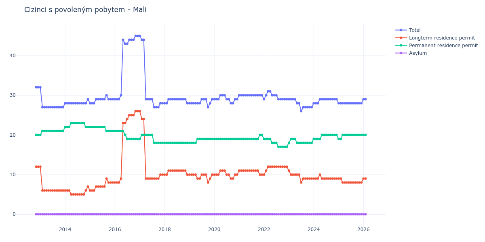

# Mali

## Souhrnné statistiky (Min/Max pro rok) / Summary Statistics (Min/Max per year)

| Year   | Total   | Longterm Residence Permit   | Permanent Residence Permit   | Asylum   |
|--------|---------|-----------------------------|------------------------------|----------|
| 2012   | 32 / 32 | 12 / 12                     | 20 / 20                      | 0 / 0    |
| 2013   | 27 / 32 | 6 / 12                      | 20 / 21                      | 0 / 0    |
| 2014   | 28 / 29 | 5 / 7                       | 22 / 23                      | 0 / 0    |
| 2015   | 28 / 30 | 6 / 9                       | 21 / 22                      | 0 / 0    |
| 2016   | 29 / 45 | 8 / 26                      | 19 / 21                      | 0 / 0    |
| 2017   | 27 / 45 | 9 / 26                      | 18 / 20                      | 0 / 0    |
| 2018   | 28 / 29 | 10 / 11                     | 18 / 18                      | 0 / 0    |
| 2019   | 27 / 29 | 8 / 10                      | 18 / 19                      | 0 / 0    |
| 2020   | 28 / 30 | 9 / 11                      | 19 / 19                      | 0 / 0    |
| 2021   | 30 / 30 | 10 / 11                     | 19 / 20                      | 0 / 0    |
| 2022   | 29 / 31 | 10 / 12                     | 17 / 19                      | 0 / 0    |
| 2023   | 26 / 29 | 8 / 11                      | 18 / 19                      | 0 / 0    |
| 2024   | 28 / 29 | 9 / 10                      | 19 / 20                      | 0 / 0    |
| 2025   | 28 / 28 | 8 / 9                       | 19 / 20                      | 0 / 0    |
| 2026   | 29 / 29 | 9 / 9                       | 20 / 20                      | 0 / 0    |

## Detailní tabulka / Detailed Data Table

| Date     | Total        | Longterm Residence Permit   | Permanent Residence Permit   | Asylum   |
|----------|--------------|-----------------------------|------------------------------|----------|
| **2012** |              |                             |                              |          |
| 11.2012  | 32           | 12                          | 20                           | 0        |
| 12.2012  | 32 (+0.00%)  | 12 (+0.00%)                 | 20 (+0.00%)                  | 0        |
| **2013** |              |                             |                              |          |
| 01.2013  | 32 (+0.00%)  | 12 (+0.00%)                 | 20 (+0.00%)                  | 0        |
| 02.2013  | 27 (-15.62%) | 6 (-50.00%)                 | 21 (+5.00%)                  | 0        |
| 03.2013  | 27 (+0.00%)  | 6 (+0.00%)                  | 21 (+0.00%)                  | 0        |
| 04.2013  | 27 (+0.00%)  | 6 (+0.00%)                  | 21 (+0.00%)                  | 0        |
| 05.2013  | 27 (+0.00%)  | 6 (+0.00%)                  | 21 (+0.00%)                  | 0        |
| 06.2013  | 27 (+0.00%)  | 6 (+0.00%)                  | 21 (+0.00%)                  | 0        |
| 07.2013  | 27 (+0.00%)  | 6 (+0.00%)                  | 21 (+0.00%)                  | 0        |
| 08.2013  | 27 (+0.00%)  | 6 (+0.00%)                  | 21 (+0.00%)                  | 0        |
| 09.2013  | 27 (+0.00%)  | 6 (+0.00%)                  | 21 (+0.00%)                  | 0        |
| 10.2013  | 27 (+0.00%)  | 6 (+0.00%)                  | 21 (+0.00%)                  | 0        |
| 11.2013  | 27 (+0.00%)  | 6 (+0.00%)                  | 21 (+0.00%)                  | 0        |
| 12.2013  | 27 (+0.00%)  | 6 (+0.00%)                  | 21 (+0.00%)                  | 0        |
| **2014** |              |                             |                              |          |
| 01.2014  | 28 (+3.70%)  | 6 (+0.00%)                  | 22 (+4.76%)                  | 0        |
| 02.2014  | 28 (+0.00%)  | 6 (+0.00%)                  | 22 (+0.00%)                  | 0        |
| 03.2014  | 28 (+0.00%)  | 6 (+0.00%)                  | 22 (+0.00%)                  | 0        |
| 04.2014  | 28 (+0.00%)  | 5 (-16.67%)                 | 23 (+4.55%)                  | 0        |
| 05.2014  | 28 (+0.00%)  | 5 (+0.00%)                  | 23 (+0.00%)                  | 0        |
| 06.2014  | 28 (+0.00%)  | 5 (+0.00%)                  | 23 (+0.00%)                  | 0        |
| 07.2014  | 28 (+0.00%)  | 5 (+0.00%)                  | 23 (+0.00%)                  | 0        |
| 08.2014  | 28 (+0.00%)  | 5 (+0.00%)                  | 23 (+0.00%)                  | 0        |
| 09.2014  | 28 (+0.00%)  | 5 (+0.00%)                  | 23 (+0.00%)                  | 0        |
| 10.2014  | 28 (+0.00%)  | 5 (+0.00%)                  | 23 (+0.00%)                  | 0        |
| 11.2014  | 28 (+0.00%)  | 6 (+20.00%)                 | 22 (-4.35%)                  | 0        |
| 12.2014  | 29 (+3.57%)  | 7 (+16.67%)                 | 22 (+0.00%)                  | 0        |
| **2015** |              |                             |                              |          |
| 01.2015  | 28 (-3.45%)  | 6 (-14.29%)                 | 22 (+0.00%)                  | 0        |
| 02.2015  | 28 (+0.00%)  | 6 (+0.00%)                  | 22 (+0.00%)                  | 0        |
| 03.2015  | 28 (+0.00%)  | 6 (+0.00%)                  | 22 (+0.00%)                  | 0        |
| 04.2015  | 29 (+3.57%)  | 7 (+16.67%)                 | 22 (+0.00%)                  | 0        |
| 05.2015  | 29 (+0.00%)  | 7 (+0.00%)                  | 22 (+0.00%)                  | 0        |
| 06.2015  | 29 (+0.00%)  | 7 (+0.00%)                  | 22 (+0.00%)                  | 0        |
| 07.2015  | 29 (+0.00%)  | 7 (+0.00%)                  | 22 (+0.00%)                  | 0        |
| 08.2015  | 29 (+0.00%)  | 7 (+0.00%)                  | 22 (+0.00%)                  | 0        |
| 09.2015  | 30 (+3.45%)  | 9 (+28.57%)                 | 21 (-4.55%)                  | 0        |
| 10.2015  | 29 (-3.33%)  | 8 (-11.11%)                 | 21 (+0.00%)                  | 0        |
| 11.2015  | 29 (+0.00%)  | 8 (+0.00%)                  | 21 (+0.00%)                  | 0        |
| 12.2015  | 29 (+0.00%)  | 8 (+0.00%)                  | 21 (+0.00%)                  | 0        |
| **2016** |              |                             |                              |          |
| 01.2016  | 29 (+0.00%)  | 8 (+0.00%)                  | 21 (+0.00%)                  | 0        |
| 02.2016  | 29 (+0.00%)  | 8 (+0.00%)                  | 21 (+0.00%)                  | 0        |
| 03.2016  | 29 (+0.00%)  | 8 (+0.00%)                  | 21 (+0.00%)                  | 0        |
| 04.2016  | 30 (+3.45%)  | 9 (+12.50%)                 | 21 (+0.00%)                  | 0        |
| 05.2016  | 44 (+46.67%) | 23 (+155.56%)               | 21 (+0.00%)                  | 0        |
| 06.2016  | 43 (-2.27%)  | 23 (+0.00%)                 | 20 (-4.76%)                  | 0        |
| 07.2016  | 43 (+0.00%)  | 24 (+4.35%)                 | 19 (-5.00%)                  | 0        |
| 08.2016  | 44 (+2.33%)  | 25 (+4.17%)                 | 19 (+0.00%)                  | 0        |
| 09.2016  | 44 (+0.00%)  | 25 (+0.00%)                 | 19 (+0.00%)                  | 0        |
| 10.2016  | 44 (+0.00%)  | 25 (+0.00%)                 | 19 (+0.00%)                  | 0        |
| 11.2016  | 45 (+2.27%)  | 26 (+4.00%)                 | 19 (+0.00%)                  | 0        |
| 12.2016  | 45 (+0.00%)  | 26 (+0.00%)                 | 19 (+0.00%)                  | 0        |
| **2017** |              |                             |                              |          |
| 01.2017  | 45 (+0.00%)  | 26 (+0.00%)                 | 19 (+0.00%)                  | 0        |
| 02.2017  | 44 (-2.22%)  | 24 (-7.69%)                 | 20 (+5.26%)                  | 0        |
| 03.2017  | 44 (+0.00%)  | 24 (+0.00%)                 | 20 (+0.00%)                  | 0        |
| 04.2017  | 29 (-34.09%) | 9 (-62.50%)                 | 20 (+0.00%)                  | 0        |
| 05.2017  | 29 (+0.00%)  | 9 (+0.00%)                  | 20 (+0.00%)                  | 0        |
| 06.2017  | 29 (+0.00%)  | 9 (+0.00%)                  | 20 (+0.00%)                  | 0        |
| 07.2017  | 29 (+0.00%)  | 9 (+0.00%)                  | 20 (+0.00%)                  | 0        |
| 08.2017  | 27 (-6.90%)  | 9 (+0.00%)                  | 18 (-10.00%)                 | 0        |
| 09.2017  | 27 (+0.00%)  | 9 (+0.00%)                  | 18 (+0.00%)                  | 0        |
| 10.2017  | 27 (+0.00%)  | 9 (+0.00%)                  | 18 (+0.00%)                  | 0        |
| 11.2017  | 28 (+3.70%)  | 10 (+11.11%)                | 18 (+0.00%)                  | 0        |
| 12.2017  | 28 (+0.00%)  | 10 (+0.00%)                 | 18 (+0.00%)                  | 0        |
| **2018** |              |                             |                              |          |
| 01.2018  | 28 (+0.00%)  | 10 (+0.00%)                 | 18 (+0.00%)                  | 0        |
| 02.2018  | 28 (+0.00%)  | 10 (+0.00%)                 | 18 (+0.00%)                  | 0        |
| 03.2018  | 29 (+3.57%)  | 11 (+10.00%)                | 18 (+0.00%)                  | 0        |
| 04.2018  | 29 (+0.00%)  | 11 (+0.00%)                 | 18 (+0.00%)                  | 0        |
| 05.2018  | 29 (+0.00%)  | 11 (+0.00%)                 | 18 (+0.00%)                  | 0        |
| 06.2018  | 29 (+0.00%)  | 11 (+0.00%)                 | 18 (+0.00%)                  | 0        |
| 07.2018  | 29 (+0.00%)  | 11 (+0.00%)                 | 18 (+0.00%)                  | 0        |
| 08.2018  | 29 (+0.00%)  | 11 (+0.00%)                 | 18 (+0.00%)                  | 0        |
| 09.2018  | 29 (+0.00%)  | 11 (+0.00%)                 | 18 (+0.00%)                  | 0        |
| 10.2018  | 29 (+0.00%)  | 11 (+0.00%)                 | 18 (+0.00%)                  | 0        |
| 11.2018  | 29 (+0.00%)  | 11 (+0.00%)                 | 18 (+0.00%)                  | 0        |
| 12.2018  | 28 (-3.45%)  | 10 (-9.09%)                 | 18 (+0.00%)                  | 0        |
| **2019** |              |                             |                              |          |
| 01.2019  | 28 (+0.00%)  | 10 (+0.00%)                 | 18 (+0.00%)                  | 0        |
| 02.2019  | 28 (+0.00%)  | 10 (+0.00%)                 | 18 (+0.00%)                  | 0        |
| 03.2019  | 28 (+0.00%)  | 10 (+0.00%)                 | 18 (+0.00%)                  | 0        |
| 04.2019  | 28 (+0.00%)  | 10 (+0.00%)                 | 18 (+0.00%)                  | 0        |
| 05.2019  | 28 (+0.00%)  | 9 (-10.00%)                 | 19 (+5.56%)                  | 0        |
| 06.2019  | 28 (+0.00%)  | 9 (+0.00%)                  | 19 (+0.00%)                  | 0        |
| 07.2019  | 29 (+3.57%)  | 10 (+11.11%)                | 19 (+0.00%)                  | 0        |
| 08.2019  | 29 (+0.00%)  | 10 (+0.00%)                 | 19 (+0.00%)                  | 0        |
| 09.2019  | 29 (+0.00%)  | 10 (+0.00%)                 | 19 (+0.00%)                  | 0        |
| 10.2019  | 27 (-6.90%)  | 8 (-20.00%)                 | 19 (+0.00%)                  | 0        |
| 11.2019  | 28 (+3.70%)  | 9 (+12.50%)                 | 19 (+0.00%)                  | 0        |
| 12.2019  | 29 (+3.57%)  | 10 (+11.11%)                | 19 (+0.00%)                  | 0        |
| **2020** |              |                             |                              |          |
| 01.2020  | 29 (+0.00%)  | 10 (+0.00%)                 | 19 (+0.00%)                  | 0        |
| 02.2020  | 29 (+0.00%)  | 10 (+0.00%)                 | 19 (+0.00%)                  | 0        |
| 03.2020  | 29 (+0.00%)  | 10 (+0.00%)                 | 19 (+0.00%)                  | 0        |
| 04.2020  | 30 (+3.45%)  | 11 (+10.00%)                | 19 (+0.00%)                  | 0        |
| 05.2020  | 30 (+0.00%)  | 11 (+0.00%)                 | 19 (+0.00%)                  | 0        |
| 06.2020  | 30 (+0.00%)  | 11 (+0.00%)                 | 19 (+0.00%)                  | 0        |
| 07.2020  | 29 (-3.33%)  | 10 (-9.09%)                 | 19 (+0.00%)                  | 0        |
| 08.2020  | 29 (+0.00%)  | 10 (+0.00%)                 | 19 (+0.00%)                  | 0        |
| 09.2020  | 28 (-3.45%)  | 9 (-10.00%)                 | 19 (+0.00%)                  | 0        |
| 10.2020  | 28 (+0.00%)  | 9 (+0.00%)                  | 19 (+0.00%)                  | 0        |
| 11.2020  | 29 (+3.57%)  | 10 (+11.11%)                | 19 (+0.00%)                  | 0        |
| 12.2020  | 29 (+0.00%)  | 10 (+0.00%)                 | 19 (+0.00%)                  | 0        |
| **2021** |              |                             |                              |          |
| 01.2021  | 30 (+3.45%)  | 11 (+10.00%)                | 19 (+0.00%)                  | 0        |
| 02.2021  | 30 (+0.00%)  | 11 (+0.00%)                 | 19 (+0.00%)                  | 0        |
| 03.2021  | 30 (+0.00%)  | 11 (+0.00%)                 | 19 (+0.00%)                  | 0        |
| 04.2021  | 30 (+0.00%)  | 11 (+0.00%)                 | 19 (+0.00%)                  | 0        |
| 05.2021  | 30 (+0.00%)  | 11 (+0.00%)                 | 19 (+0.00%)                  | 0        |
| 06.2021  | 30 (+0.00%)  | 11 (+0.00%)                 | 19 (+0.00%)                  | 0        |
| 07.2021  | 30 (+0.00%)  | 11 (+0.00%)                 | 19 (+0.00%)                  | 0        |
| 08.2021  | 30 (+0.00%)  | 11 (+0.00%)                 | 19 (+0.00%)                  | 0        |
| 09.2021  | 30 (+0.00%)  | 11 (+0.00%)                 | 19 (+0.00%)                  | 0        |
| 10.2021  | 30 (+0.00%)  | 11 (+0.00%)                 | 19 (+0.00%)                  | 0        |
| 11.2021  | 30 (+0.00%)  | 10 (-9.09%)                 | 20 (+5.26%)                  | 0        |
| 12.2021  | 30 (+0.00%)  | 10 (+0.00%)                 | 20 (+0.00%)                  | 0        |
| **2022** |              |                             |                              |          |
| 01.2022  | 29 (-3.33%)  | 10 (+0.00%)                 | 19 (-5.00%)                  | 0        |
| 02.2022  | 30 (+3.45%)  | 11 (+10.00%)                | 19 (+0.00%)                  | 0        |
| 03.2022  | 31 (+3.33%)  | 12 (+9.09%)                 | 19 (+0.00%)                  | 0        |
| 04.2022  | 31 (+0.00%)  | 12 (+0.00%)                 | 19 (+0.00%)                  | 0        |
| 05.2022  | 30 (-3.23%)  | 12 (+0.00%)                 | 18 (-5.26%)                  | 0        |
| 06.2022  | 30 (+0.00%)  | 12 (+0.00%)                 | 18 (+0.00%)                  | 0        |
| 07.2022  | 30 (+0.00%)  | 12 (+0.00%)                 | 18 (+0.00%)                  | 0        |
| 08.2022  | 29 (-3.33%)  | 12 (+0.00%)                 | 17 (-5.56%)                  | 0        |
| 09.2022  | 29 (+0.00%)  | 12 (+0.00%)                 | 17 (+0.00%)                  | 0        |
| 10.2022  | 29 (+0.00%)  | 12 (+0.00%)                 | 17 (+0.00%)                  | 0        |
| 11.2022  | 29 (+0.00%)  | 12 (+0.00%)                 | 17 (+0.00%)                  | 0        |
| 12.2022  | 29 (+0.00%)  | 12 (+0.00%)                 | 17 (+0.00%)                  | 0        |
| **2023** |              |                             |                              |          |
| 01.2023  | 29 (+0.00%)  | 11 (-8.33%)                 | 18 (+5.88%)                  | 0        |
| 02.2023  | 29 (+0.00%)  | 10 (-9.09%)                 | 19 (+5.56%)                  | 0        |
| 03.2023  | 29 (+0.00%)  | 10 (+0.00%)                 | 19 (+0.00%)                  | 0        |
| 04.2023  | 29 (+0.00%)  | 10 (+0.00%)                 | 19 (+0.00%)                  | 0        |
| 05.2023  | 28 (-3.45%)  | 10 (+0.00%)                 | 18 (-5.26%)                  | 0        |
| 06.2023  | 28 (+0.00%)  | 10 (+0.00%)                 | 18 (+0.00%)                  | 0        |
| 07.2023  | 26 (-7.14%)  | 8 (-20.00%)                 | 18 (+0.00%)                  | 0        |
| 08.2023  | 27 (+3.85%)  | 9 (+12.50%)                 | 18 (+0.00%)                  | 0        |
| 09.2023  | 27 (+0.00%)  | 9 (+0.00%)                  | 18 (+0.00%)                  | 0        |
| 10.2023  | 27 (+0.00%)  | 9 (+0.00%)                  | 18 (+0.00%)                  | 0        |
| 11.2023  | 27 (+0.00%)  | 9 (+0.00%)                  | 18 (+0.00%)                  | 0        |
| 12.2023  | 27 (+0.00%)  | 9 (+0.00%)                  | 18 (+0.00%)                  | 0        |
| **2024** |              |                             |                              |          |
| 01.2024  | 28 (+3.70%)  | 9 (+0.00%)                  | 19 (+5.56%)                  | 0        |
| 02.2024  | 28 (+0.00%)  | 9 (+0.00%)                  | 19 (+0.00%)                  | 0        |
| 03.2024  | 28 (+0.00%)  | 9 (+0.00%)                  | 19 (+0.00%)                  | 0        |
| 04.2024  | 29 (+3.57%)  | 10 (+11.11%)                | 19 (+0.00%)                  | 0        |
| 05.2024  | 29 (+0.00%)  | 9 (-10.00%)                 | 20 (+5.26%)                  | 0        |
| 06.2024  | 29 (+0.00%)  | 9 (+0.00%)                  | 20 (+0.00%)                  | 0        |
| 07.2024  | 29 (+0.00%)  | 9 (+0.00%)                  | 20 (+0.00%)                  | 0        |
| 08.2024  | 29 (+0.00%)  | 9 (+0.00%)                  | 20 (+0.00%)                  | 0        |
| 09.2024  | 29 (+0.00%)  | 9 (+0.00%)                  | 20 (+0.00%)                  | 0        |
| 10.2024  | 29 (+0.00%)  | 9 (+0.00%)                  | 20 (+0.00%)                  | 0        |
| 11.2024  | 29 (+0.00%)  | 9 (+0.00%)                  | 20 (+0.00%)                  | 0        |
| 12.2024  | 29 (+0.00%)  | 9 (+0.00%)                  | 20 (+0.00%)                  | 0        |
| **2025** |              |                             |                              |          |
| 01.2025  | 28 (-3.45%)  | 9 (+0.00%)                  | 19 (-5.00%)                  | 0        |
| 02.2025  | 28 (+0.00%)  | 9 (+0.00%)                  | 19 (+0.00%)                  | 0        |
| 03.2025  | 28 (+0.00%)  | 8 (-11.11%)                 | 20 (+5.26%)                  | 0        |
| 04.2025  | 28 (+0.00%)  | 8 (+0.00%)                  | 20 (+0.00%)                  | 0        |
| 05.2025  | 28 (+0.00%)  | 8 (+0.00%)                  | 20 (+0.00%)                  | 0        |
| 06.2025  | 28 (+0.00%)  | 8 (+0.00%)                  | 20 (+0.00%)                  | 0        |
| 07.2025  | 28 (+0.00%)  | 8 (+0.00%)                  | 20 (+0.00%)                  | 0        |
| 08.2025  | 28 (+0.00%)  | 8 (+0.00%)                  | 20 (+0.00%)                  | 0        |
| 09.2025  | 28 (+0.00%)  | 8 (+0.00%)                  | 20 (+0.00%)                  | 0        |
| 10.2025  | 28 (+0.00%)  | 8 (+0.00%)                  | 20 (+0.00%)                  | 0        |
| 11.2025  | 28 (+0.00%)  | 8 (+0.00%)                  | 20 (+0.00%)                  | 0        |
| 12.2025  | 28 (+0.00%)  | 8 (+0.00%)                  | 20 (+0.00%)                  | 0        |
| **2026** |              |                             |                              |          |
| 01.2026  | 29 (+3.57%)  | 9 (+12.50%)                 | 20 (+0.00%)                  | 0        |
| 02.2026  | 29 (+0.00%)  | 9 (+0.00%)                  | 20 (+0.00%)                  | 0        |
