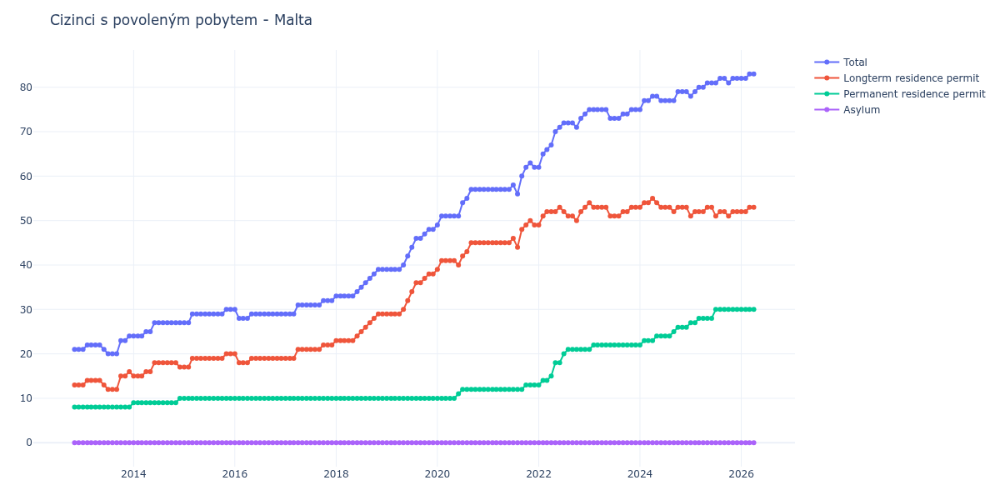

# Malta

## Souhrnné statistiky (Min/Max pro rok) / Summary Statistics (Min/Max per year)

| Year   | Total   | Longterm Residence Permit   | Permanent Residence Permit   | Asylum   |
|--------|---------|-----------------------------|------------------------------|----------|
| 2012   | 21 / 21 | 13 / 13                     | 8 / 8                        | 0 / 0    |
| 2013   | 20 / 24 | 12 / 16                     | 8 / 8                        | 0 / 0    |
| 2014   | 24 / 27 | 15 / 18                     | 9 / 10                       | 0 / 0    |
| 2015   | 27 / 30 | 17 / 20                     | 10 / 10                      | 0 / 0    |
| 2016   | 28 / 30 | 18 / 20                     | 10 / 10                      | 0 / 0    |
| 2017   | 29 / 32 | 19 / 22                     | 10 / 10                      | 0 / 0    |
| 2018   | 33 / 39 | 23 / 29                     | 10 / 10                      | 0 / 0    |
| 2019   | 39 / 48 | 29 / 38                     | 10 / 10                      | 0 / 0    |
| 2020   | 49 / 57 | 39 / 45                     | 10 / 12                      | 0 / 0    |
| 2021   | 56 / 63 | 44 / 50                     | 12 / 13                      | 0 / 0    |
| 2022   | 62 / 74 | 49 / 53                     | 13 / 21                      | 0 / 0    |
| 2023   | 73 / 75 | 51 / 54                     | 21 / 22                      | 0 / 0    |
| 2024   | 75 / 79 | 52 / 55                     | 22 / 26                      | 0 / 0    |
| 2025   | 78 / 82 | 51 / 53                     | 27 / 30                      | 0 / 0    |
| 2026   | 82 / 83 | 52 / 53                     | 30 / 30                      | 0 / 0    |

## Detailní tabulka / Detailed Data Table

| Date     | Total        | Longterm Residence Permit   | Permanent Residence Permit   | Asylum   |
|----------|--------------|-----------------------------|------------------------------|----------|
| **2012** |              |                             |                              |          |
| 11.2012  | 21           | 13                          | 8                            | 0        |
| 12.2012  | 21 (+0.00%)  | 13 (+0.00%)                 | 8 (+0.00%)                   | 0        |
| **2013** |              |                             |                              |          |
| 01.2013  | 21 (+0.00%)  | 13 (+0.00%)                 | 8 (+0.00%)                   | 0        |
| 02.2013  | 22 (+4.76%)  | 14 (+7.69%)                 | 8 (+0.00%)                   | 0        |
| 03.2013  | 22 (+0.00%)  | 14 (+0.00%)                 | 8 (+0.00%)                   | 0        |
| 04.2013  | 22 (+0.00%)  | 14 (+0.00%)                 | 8 (+0.00%)                   | 0        |
| 05.2013  | 22 (+0.00%)  | 14 (+0.00%)                 | 8 (+0.00%)                   | 0        |
| 06.2013  | 21 (-4.55%)  | 13 (-7.14%)                 | 8 (+0.00%)                   | 0        |
| 07.2013  | 20 (-4.76%)  | 12 (-7.69%)                 | 8 (+0.00%)                   | 0        |
| 08.2013  | 20 (+0.00%)  | 12 (+0.00%)                 | 8 (+0.00%)                   | 0        |
| 09.2013  | 20 (+0.00%)  | 12 (+0.00%)                 | 8 (+0.00%)                   | 0        |
| 10.2013  | 23 (+15.00%) | 15 (+25.00%)                | 8 (+0.00%)                   | 0        |
| 11.2013  | 23 (+0.00%)  | 15 (+0.00%)                 | 8 (+0.00%)                   | 0        |
| 12.2013  | 24 (+4.35%)  | 16 (+6.67%)                 | 8 (+0.00%)                   | 0        |
| **2014** |              |                             |                              |          |
| 01.2014  | 24 (+0.00%)  | 15 (-6.25%)                 | 9 (+12.50%)                  | 0        |
| 02.2014  | 24 (+0.00%)  | 15 (+0.00%)                 | 9 (+0.00%)                   | 0        |
| 03.2014  | 24 (+0.00%)  | 15 (+0.00%)                 | 9 (+0.00%)                   | 0        |
| 04.2014  | 25 (+4.17%)  | 16 (+6.67%)                 | 9 (+0.00%)                   | 0        |
| 05.2014  | 25 (+0.00%)  | 16 (+0.00%)                 | 9 (+0.00%)                   | 0        |
| 06.2014  | 27 (+8.00%)  | 18 (+12.50%)                | 9 (+0.00%)                   | 0        |
| 07.2014  | 27 (+0.00%)  | 18 (+0.00%)                 | 9 (+0.00%)                   | 0        |
| 08.2014  | 27 (+0.00%)  | 18 (+0.00%)                 | 9 (+0.00%)                   | 0        |
| 09.2014  | 27 (+0.00%)  | 18 (+0.00%)                 | 9 (+0.00%)                   | 0        |
| 10.2014  | 27 (+0.00%)  | 18 (+0.00%)                 | 9 (+0.00%)                   | 0        |
| 11.2014  | 27 (+0.00%)  | 18 (+0.00%)                 | 9 (+0.00%)                   | 0        |
| 12.2014  | 27 (+0.00%)  | 17 (-5.56%)                 | 10 (+11.11%)                 | 0        |
| **2015** |              |                             |                              |          |
| 01.2015  | 27 (+0.00%)  | 17 (+0.00%)                 | 10 (+0.00%)                  | 0        |
| 02.2015  | 27 (+0.00%)  | 17 (+0.00%)                 | 10 (+0.00%)                  | 0        |
| 03.2015  | 29 (+7.41%)  | 19 (+11.76%)                | 10 (+0.00%)                  | 0        |
| 04.2015  | 29 (+0.00%)  | 19 (+0.00%)                 | 10 (+0.00%)                  | 0        |
| 05.2015  | 29 (+0.00%)  | 19 (+0.00%)                 | 10 (+0.00%)                  | 0        |
| 06.2015  | 29 (+0.00%)  | 19 (+0.00%)                 | 10 (+0.00%)                  | 0        |
| 07.2015  | 29 (+0.00%)  | 19 (+0.00%)                 | 10 (+0.00%)                  | 0        |
| 08.2015  | 29 (+0.00%)  | 19 (+0.00%)                 | 10 (+0.00%)                  | 0        |
| 09.2015  | 29 (+0.00%)  | 19 (+0.00%)                 | 10 (+0.00%)                  | 0        |
| 10.2015  | 29 (+0.00%)  | 19 (+0.00%)                 | 10 (+0.00%)                  | 0        |
| 11.2015  | 30 (+3.45%)  | 20 (+5.26%)                 | 10 (+0.00%)                  | 0        |
| 12.2015  | 30 (+0.00%)  | 20 (+0.00%)                 | 10 (+0.00%)                  | 0        |
| **2016** |              |                             |                              |          |
| 01.2016  | 30 (+0.00%)  | 20 (+0.00%)                 | 10 (+0.00%)                  | 0        |
| 02.2016  | 28 (-6.67%)  | 18 (-10.00%)                | 10 (+0.00%)                  | 0        |
| 03.2016  | 28 (+0.00%)  | 18 (+0.00%)                 | 10 (+0.00%)                  | 0        |
| 04.2016  | 28 (+0.00%)  | 18 (+0.00%)                 | 10 (+0.00%)                  | 0        |
| 05.2016  | 29 (+3.57%)  | 19 (+5.56%)                 | 10 (+0.00%)                  | 0        |
| 06.2016  | 29 (+0.00%)  | 19 (+0.00%)                 | 10 (+0.00%)                  | 0        |
| 07.2016  | 29 (+0.00%)  | 19 (+0.00%)                 | 10 (+0.00%)                  | 0        |
| 08.2016  | 29 (+0.00%)  | 19 (+0.00%)                 | 10 (+0.00%)                  | 0        |
| 09.2016  | 29 (+0.00%)  | 19 (+0.00%)                 | 10 (+0.00%)                  | 0        |
| 10.2016  | 29 (+0.00%)  | 19 (+0.00%)                 | 10 (+0.00%)                  | 0        |
| 11.2016  | 29 (+0.00%)  | 19 (+0.00%)                 | 10 (+0.00%)                  | 0        |
| 12.2016  | 29 (+0.00%)  | 19 (+0.00%)                 | 10 (+0.00%)                  | 0        |
| **2017** |              |                             |                              |          |
| 01.2017  | 29 (+0.00%)  | 19 (+0.00%)                 | 10 (+0.00%)                  | 0        |
| 02.2017  | 29 (+0.00%)  | 19 (+0.00%)                 | 10 (+0.00%)                  | 0        |
| 03.2017  | 29 (+0.00%)  | 19 (+0.00%)                 | 10 (+0.00%)                  | 0        |
| 04.2017  | 31 (+6.90%)  | 21 (+10.53%)                | 10 (+0.00%)                  | 0        |
| 05.2017  | 31 (+0.00%)  | 21 (+0.00%)                 | 10 (+0.00%)                  | 0        |
| 06.2017  | 31 (+0.00%)  | 21 (+0.00%)                 | 10 (+0.00%)                  | 0        |
| 07.2017  | 31 (+0.00%)  | 21 (+0.00%)                 | 10 (+0.00%)                  | 0        |
| 08.2017  | 31 (+0.00%)  | 21 (+0.00%)                 | 10 (+0.00%)                  | 0        |
| 09.2017  | 31 (+0.00%)  | 21 (+0.00%)                 | 10 (+0.00%)                  | 0        |
| 10.2017  | 32 (+3.23%)  | 22 (+4.76%)                 | 10 (+0.00%)                  | 0        |
| 11.2017  | 32 (+0.00%)  | 22 (+0.00%)                 | 10 (+0.00%)                  | 0        |
| 12.2017  | 32 (+0.00%)  | 22 (+0.00%)                 | 10 (+0.00%)                  | 0        |
| **2018** |              |                             |                              |          |
| 01.2018  | 33 (+3.12%)  | 23 (+4.55%)                 | 10 (+0.00%)                  | 0        |
| 02.2018  | 33 (+0.00%)  | 23 (+0.00%)                 | 10 (+0.00%)                  | 0        |
| 03.2018  | 33 (+0.00%)  | 23 (+0.00%)                 | 10 (+0.00%)                  | 0        |
| 04.2018  | 33 (+0.00%)  | 23 (+0.00%)                 | 10 (+0.00%)                  | 0        |
| 05.2018  | 33 (+0.00%)  | 23 (+0.00%)                 | 10 (+0.00%)                  | 0        |
| 06.2018  | 34 (+3.03%)  | 24 (+4.35%)                 | 10 (+0.00%)                  | 0        |
| 07.2018  | 35 (+2.94%)  | 25 (+4.17%)                 | 10 (+0.00%)                  | 0        |
| 08.2018  | 36 (+2.86%)  | 26 (+4.00%)                 | 10 (+0.00%)                  | 0        |
| 09.2018  | 37 (+2.78%)  | 27 (+3.85%)                 | 10 (+0.00%)                  | 0        |
| 10.2018  | 38 (+2.70%)  | 28 (+3.70%)                 | 10 (+0.00%)                  | 0        |
| 11.2018  | 39 (+2.63%)  | 29 (+3.57%)                 | 10 (+0.00%)                  | 0        |
| 12.2018  | 39 (+0.00%)  | 29 (+0.00%)                 | 10 (+0.00%)                  | 0        |
| **2019** |              |                             |                              |          |
| 01.2019  | 39 (+0.00%)  | 29 (+0.00%)                 | 10 (+0.00%)                  | 0        |
| 02.2019  | 39 (+0.00%)  | 29 (+0.00%)                 | 10 (+0.00%)                  | 0        |
| 03.2019  | 39 (+0.00%)  | 29 (+0.00%)                 | 10 (+0.00%)                  | 0        |
| 04.2019  | 39 (+0.00%)  | 29 (+0.00%)                 | 10 (+0.00%)                  | 0        |
| 05.2019  | 40 (+2.56%)  | 30 (+3.45%)                 | 10 (+0.00%)                  | 0        |
| 06.2019  | 42 (+5.00%)  | 32 (+6.67%)                 | 10 (+0.00%)                  | 0        |
| 07.2019  | 44 (+4.76%)  | 34 (+6.25%)                 | 10 (+0.00%)                  | 0        |
| 08.2019  | 46 (+4.55%)  | 36 (+5.88%)                 | 10 (+0.00%)                  | 0        |
| 09.2019  | 46 (+0.00%)  | 36 (+0.00%)                 | 10 (+0.00%)                  | 0        |
| 10.2019  | 47 (+2.17%)  | 37 (+2.78%)                 | 10 (+0.00%)                  | 0        |
| 11.2019  | 48 (+2.13%)  | 38 (+2.70%)                 | 10 (+0.00%)                  | 0        |
| 12.2019  | 48 (+0.00%)  | 38 (+0.00%)                 | 10 (+0.00%)                  | 0        |
| **2020** |              |                             |                              |          |
| 01.2020  | 49 (+2.08%)  | 39 (+2.63%)                 | 10 (+0.00%)                  | 0        |
| 02.2020  | 51 (+4.08%)  | 41 (+5.13%)                 | 10 (+0.00%)                  | 0        |
| 03.2020  | 51 (+0.00%)  | 41 (+0.00%)                 | 10 (+0.00%)                  | 0        |
| 04.2020  | 51 (+0.00%)  | 41 (+0.00%)                 | 10 (+0.00%)                  | 0        |
| 05.2020  | 51 (+0.00%)  | 41 (+0.00%)                 | 10 (+0.00%)                  | 0        |
| 06.2020  | 51 (+0.00%)  | 40 (-2.44%)                 | 11 (+10.00%)                 | 0        |
| 07.2020  | 54 (+5.88%)  | 42 (+5.00%)                 | 12 (+9.09%)                  | 0        |
| 08.2020  | 55 (+1.85%)  | 43 (+2.38%)                 | 12 (+0.00%)                  | 0        |
| 09.2020  | 57 (+3.64%)  | 45 (+4.65%)                 | 12 (+0.00%)                  | 0        |
| 10.2020  | 57 (+0.00%)  | 45 (+0.00%)                 | 12 (+0.00%)                  | 0        |
| 11.2020  | 57 (+0.00%)  | 45 (+0.00%)                 | 12 (+0.00%)                  | 0        |
| 12.2020  | 57 (+0.00%)  | 45 (+0.00%)                 | 12 (+0.00%)                  | 0        |
| **2021** |              |                             |                              |          |
| 01.2021  | 57 (+0.00%)  | 45 (+0.00%)                 | 12 (+0.00%)                  | 0        |
| 02.2021  | 57 (+0.00%)  | 45 (+0.00%)                 | 12 (+0.00%)                  | 0        |
| 03.2021  | 57 (+0.00%)  | 45 (+0.00%)                 | 12 (+0.00%)                  | 0        |
| 04.2021  | 57 (+0.00%)  | 45 (+0.00%)                 | 12 (+0.00%)                  | 0        |
| 05.2021  | 57 (+0.00%)  | 45 (+0.00%)                 | 12 (+0.00%)                  | 0        |
| 06.2021  | 57 (+0.00%)  | 45 (+0.00%)                 | 12 (+0.00%)                  | 0        |
| 07.2021  | 58 (+1.75%)  | 46 (+2.22%)                 | 12 (+0.00%)                  | 0        |
| 08.2021  | 56 (-3.45%)  | 44 (-4.35%)                 | 12 (+0.00%)                  | 0        |
| 09.2021  | 60 (+7.14%)  | 48 (+9.09%)                 | 12 (+0.00%)                  | 0        |
| 10.2021  | 62 (+3.33%)  | 49 (+2.08%)                 | 13 (+8.33%)                  | 0        |
| 11.2021  | 63 (+1.61%)  | 50 (+2.04%)                 | 13 (+0.00%)                  | 0        |
| 12.2021  | 62 (-1.59%)  | 49 (-2.00%)                 | 13 (+0.00%)                  | 0        |
| **2022** |              |                             |                              |          |
| 01.2022  | 62 (+0.00%)  | 49 (+0.00%)                 | 13 (+0.00%)                  | 0        |
| 02.2022  | 65 (+4.84%)  | 51 (+4.08%)                 | 14 (+7.69%)                  | 0        |
| 03.2022  | 66 (+1.54%)  | 52 (+1.96%)                 | 14 (+0.00%)                  | 0        |
| 04.2022  | 67 (+1.52%)  | 52 (+0.00%)                 | 15 (+7.14%)                  | 0        |
| 05.2022  | 70 (+4.48%)  | 52 (+0.00%)                 | 18 (+20.00%)                 | 0        |
| 06.2022  | 71 (+1.43%)  | 53 (+1.92%)                 | 18 (+0.00%)                  | 0        |
| 07.2022  | 72 (+1.41%)  | 52 (-1.89%)                 | 20 (+11.11%)                 | 0        |
| 08.2022  | 72 (+0.00%)  | 51 (-1.92%)                 | 21 (+5.00%)                  | 0        |
| 09.2022  | 72 (+0.00%)  | 51 (+0.00%)                 | 21 (+0.00%)                  | 0        |
| 10.2022  | 71 (-1.39%)  | 50 (-1.96%)                 | 21 (+0.00%)                  | 0        |
| 11.2022  | 73 (+2.82%)  | 52 (+4.00%)                 | 21 (+0.00%)                  | 0        |
| 12.2022  | 74 (+1.37%)  | 53 (+1.92%)                 | 21 (+0.00%)                  | 0        |
| **2023** |              |                             |                              |          |
| 01.2023  | 75 (+1.35%)  | 54 (+1.89%)                 | 21 (+0.00%)                  | 0        |
| 02.2023  | 75 (+0.00%)  | 53 (-1.85%)                 | 22 (+4.76%)                  | 0        |
| 03.2023  | 75 (+0.00%)  | 53 (+0.00%)                 | 22 (+0.00%)                  | 0        |
| 04.2023  | 75 (+0.00%)  | 53 (+0.00%)                 | 22 (+0.00%)                  | 0        |
| 05.2023  | 75 (+0.00%)  | 53 (+0.00%)                 | 22 (+0.00%)                  | 0        |
| 06.2023  | 73 (-2.67%)  | 51 (-3.77%)                 | 22 (+0.00%)                  | 0        |
| 07.2023  | 73 (+0.00%)  | 51 (+0.00%)                 | 22 (+0.00%)                  | 0        |
| 08.2023  | 73 (+0.00%)  | 51 (+0.00%)                 | 22 (+0.00%)                  | 0        |
| 09.2023  | 74 (+1.37%)  | 52 (+1.96%)                 | 22 (+0.00%)                  | 0        |
| 10.2023  | 74 (+0.00%)  | 52 (+0.00%)                 | 22 (+0.00%)                  | 0        |
| 11.2023  | 75 (+1.35%)  | 53 (+1.92%)                 | 22 (+0.00%)                  | 0        |
| 12.2023  | 75 (+0.00%)  | 53 (+0.00%)                 | 22 (+0.00%)                  | 0        |
| **2024** |              |                             |                              |          |
| 01.2024  | 75 (+0.00%)  | 53 (+0.00%)                 | 22 (+0.00%)                  | 0        |
| 02.2024  | 77 (+2.67%)  | 54 (+1.89%)                 | 23 (+4.55%)                  | 0        |
| 03.2024  | 77 (+0.00%)  | 54 (+0.00%)                 | 23 (+0.00%)                  | 0        |
| 04.2024  | 78 (+1.30%)  | 55 (+1.85%)                 | 23 (+0.00%)                  | 0        |
| 05.2024  | 78 (+0.00%)  | 54 (-1.82%)                 | 24 (+4.35%)                  | 0        |
| 06.2024  | 77 (-1.28%)  | 53 (-1.85%)                 | 24 (+0.00%)                  | 0        |
| 07.2024  | 77 (+0.00%)  | 53 (+0.00%)                 | 24 (+0.00%)                  | 0        |
| 08.2024  | 77 (+0.00%)  | 53 (+0.00%)                 | 24 (+0.00%)                  | 0        |
| 09.2024  | 77 (+0.00%)  | 52 (-1.89%)                 | 25 (+4.17%)                  | 0        |
| 10.2024  | 79 (+2.60%)  | 53 (+1.92%)                 | 26 (+4.00%)                  | 0        |
| 11.2024  | 79 (+0.00%)  | 53 (+0.00%)                 | 26 (+0.00%)                  | 0        |
| 12.2024  | 79 (+0.00%)  | 53 (+0.00%)                 | 26 (+0.00%)                  | 0        |
| **2025** |              |                             |                              |          |
| 01.2025  | 78 (-1.27%)  | 51 (-3.77%)                 | 27 (+3.85%)                  | 0        |
| 02.2025  | 79 (+1.28%)  | 52 (+1.96%)                 | 27 (+0.00%)                  | 0        |
| 03.2025  | 80 (+1.27%)  | 52 (+0.00%)                 | 28 (+3.70%)                  | 0        |
| 04.2025  | 80 (+0.00%)  | 52 (+0.00%)                 | 28 (+0.00%)                  | 0        |
| 05.2025  | 81 (+1.25%)  | 53 (+1.92%)                 | 28 (+0.00%)                  | 0        |
| 06.2025  | 81 (+0.00%)  | 53 (+0.00%)                 | 28 (+0.00%)                  | 0        |
| 07.2025  | 81 (+0.00%)  | 51 (-3.77%)                 | 30 (+7.14%)                  | 0        |
| 08.2025  | 82 (+1.23%)  | 52 (+1.96%)                 | 30 (+0.00%)                  | 0        |
| 09.2025  | 82 (+0.00%)  | 52 (+0.00%)                 | 30 (+0.00%)                  | 0        |
| 10.2025  | 81 (-1.22%)  | 51 (-1.92%)                 | 30 (+0.00%)                  | 0        |
| 11.2025  | 82 (+1.23%)  | 52 (+1.96%)                 | 30 (+0.00%)                  | 0        |
| 12.2025  | 82 (+0.00%)  | 52 (+0.00%)                 | 30 (+0.00%)                  | 0        |
| **2026** |              |                             |                              |          |
| 01.2026  | 82 (+0.00%)  | 52 (+0.00%)                 | 30 (+0.00%)                  | 0        |
| 02.2026  | 82 (+0.00%)  | 52 (+0.00%)                 | 30 (+0.00%)                  | 0        |
| 03.2026  | 83 (+1.22%)  | 53 (+1.92%)                 | 30 (+0.00%)                  | 0        |
| 04.2026  | 83 (+0.00%)  | 53 (+0.00%)                 | 30 (+0.00%)                  | 0        |
