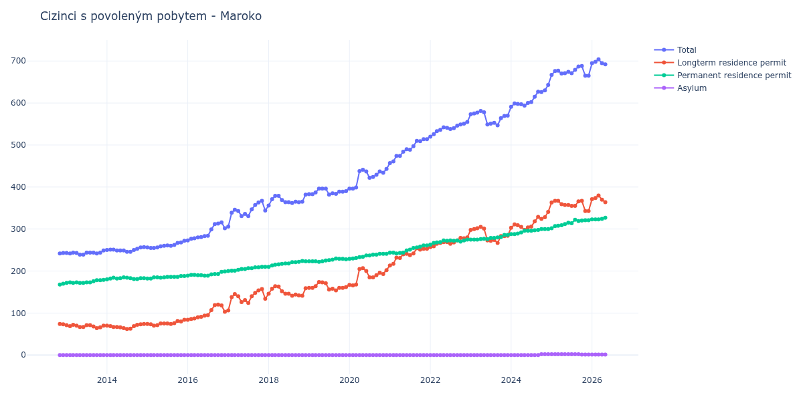

# Maroko

## Souhrnné statistiky (Min/Max pro rok) / Summary Statistics (Min/Max per year)

| Year   | Total     | Longterm Residence Permit   | Permanent Residence Permit   | Asylum   |
|--------|-----------|-----------------------------|------------------------------|----------|
| 2012   | 242 / 243 | 73 / 74                     | 168 / 170                    | 0 / 0    |
| 2013   | 239 / 249 | 64 / 72                     | 172 / 179                    | 0 / 0    |
| 2014   | 246 / 257 | 62 / 74                     | 180 / 185                    | 0 / 0    |
| 2015   | 255 / 272 | 70 / 84                     | 182 / 188                    | 0 / 0    |
| 2016   | 273 / 316 | 84 / 120                    | 189 / 199                    | 0 / 0    |
| 2017   | 306 / 367 | 106 / 157                   | 200 / 210                    | 0 / 0    |
| 2018   | 356 / 382 | 141 / 164                   | 210 / 224                    | 0 / 0    |
| 2019   | 382 / 396 | 154 / 174                   | 222 / 230                    | 0 / 0    |
| 2020   | 396 / 443 | 166 / 207                   | 229 / 241                    | 0 / 0    |
| 2021   | 457 / 514 | 213 / 254                   | 242 / 261                    | 0 / 0    |
| 2022   | 520 / 555 | 257 / 280                   | 263 / 275                    | 0 / 0    |
| 2023   | 547 / 581 | 267 / 305                   | 275 / 286                    | 0 / 0    |
| 2024   | 591 / 643 | 298 / 341                   | 288 / 300                    | 0 / 2    |
| 2025   | 665 / 688 | 343 / 367                   | 302 / 322                    | 1 / 2    |
| 2026   | 692 / 704 | 364 / 380                   | 323 / 327                    | 1 / 1    |

## Detailní tabulka / Detailed Data Table

| Date     | Total         | Longterm Residence Permit   | Permanent Residence Permit   | Asylum      |
|----------|---------------|-----------------------------|------------------------------|-------------|
| **2012** |               |                             |                              |             |
| 11.2012  | 242           | 74                          | 168                          | 0           |
| 12.2012  | 243 (+0.41%)  | 73 (-1.35%)                 | 170 (+1.19%)                 | 0           |
| **2013** |               |                             |                              |             |
| 01.2013  | 243 (+0.00%)  | 71 (-2.74%)                 | 172 (+1.18%)                 | 0           |
| 02.2013  | 242 (-0.41%)  | 69 (-2.82%)                 | 173 (+0.58%)                 | 0           |
| 03.2013  | 244 (+0.83%)  | 72 (+4.35%)                 | 172 (-0.58%)                 | 0           |
| 04.2013  | 243 (-0.41%)  | 70 (-2.78%)                 | 173 (+0.58%)                 | 0           |
| 05.2013  | 239 (-1.65%)  | 67 (-4.29%)                 | 172 (-0.58%)                 | 0           |
| 06.2013  | 239 (+0.00%)  | 67 (+0.00%)                 | 172 (+0.00%)                 | 0           |
| 07.2013  | 244 (+2.09%)  | 71 (+5.97%)                 | 173 (+0.58%)                 | 0           |
| 08.2013  | 244 (+0.00%)  | 71 (+0.00%)                 | 173 (+0.00%)                 | 0           |
| 09.2013  | 244 (+0.00%)  | 68 (-4.23%)                 | 176 (+1.73%)                 | 0           |
| 10.2013  | 242 (-0.82%)  | 64 (-5.88%)                 | 178 (+1.14%)                 | 0           |
| 11.2013  | 244 (+0.83%)  | 66 (+3.12%)                 | 178 (+0.00%)                 | 0           |
| 12.2013  | 249 (+2.05%)  | 70 (+6.06%)                 | 179 (+0.56%)                 | 0           |
| **2014** |               |                             |                              |             |
| 01.2014  | 250 (+0.40%)  | 70 (+0.00%)                 | 180 (+0.56%)                 | 0           |
| 02.2014  | 251 (+0.40%)  | 69 (-1.43%)                 | 182 (+1.11%)                 | 0           |
| 03.2014  | 251 (+0.00%)  | 67 (-2.90%)                 | 184 (+1.10%)                 | 0           |
| 04.2014  | 249 (-0.80%)  | 67 (+0.00%)                 | 182 (-1.09%)                 | 0           |
| 05.2014  | 249 (+0.00%)  | 66 (-1.49%)                 | 183 (+0.55%)                 | 0           |
| 06.2014  | 249 (+0.00%)  | 64 (-3.03%)                 | 185 (+1.09%)                 | 0           |
| 07.2014  | 246 (-1.20%)  | 62 (-3.12%)                 | 184 (-0.54%)                 | 0           |
| 08.2014  | 246 (+0.00%)  | 63 (+1.61%)                 | 183 (-0.54%)                 | 0           |
| 09.2014  | 250 (+1.63%)  | 69 (+9.52%)                 | 181 (-1.09%)                 | 0           |
| 10.2014  | 253 (+1.20%)  | 72 (+4.35%)                 | 181 (+0.00%)                 | 0           |
| 11.2014  | 256 (+1.19%)  | 73 (+1.39%)                 | 183 (+1.10%)                 | 0           |
| 12.2014  | 257 (+0.39%)  | 74 (+1.37%)                 | 183 (+0.00%)                 | 0           |
| **2015** |               |                             |                              |             |
| 01.2015  | 256 (-0.39%)  | 74 (+0.00%)                 | 182 (-0.55%)                 | 0           |
| 02.2015  | 255 (-0.39%)  | 73 (-1.35%)                 | 182 (+0.00%)                 | 0           |
| 03.2015  | 255 (+0.00%)  | 70 (-4.11%)                 | 185 (+1.65%)                 | 0           |
| 04.2015  | 256 (+0.39%)  | 71 (+1.43%)                 | 185 (+0.00%)                 | 0           |
| 05.2015  | 259 (+1.17%)  | 75 (+5.63%)                 | 184 (-0.54%)                 | 0           |
| 06.2015  | 260 (+0.39%)  | 75 (+0.00%)                 | 185 (+0.54%)                 | 0           |
| 07.2015  | 261 (+0.38%)  | 75 (+0.00%)                 | 186 (+0.54%)                 | 0           |
| 08.2015  | 260 (-0.38%)  | 74 (-1.33%)                 | 186 (+0.00%)                 | 0           |
| 09.2015  | 262 (+0.77%)  | 76 (+2.70%)                 | 186 (+0.00%)                 | 0           |
| 10.2015  | 267 (+1.91%)  | 81 (+6.58%)                 | 186 (+0.00%)                 | 0           |
| 11.2015  | 268 (+0.37%)  | 80 (-1.23%)                 | 188 (+1.08%)                 | 0           |
| 12.2015  | 272 (+1.49%)  | 84 (+5.00%)                 | 188 (+0.00%)                 | 0           |
| **2016** |               |                             |                              |             |
| 01.2016  | 273 (+0.37%)  | 84 (+0.00%)                 | 189 (+0.53%)                 | 0           |
| 02.2016  | 277 (+1.47%)  | 86 (+2.38%)                 | 191 (+1.06%)                 | 0           |
| 03.2016  | 278 (+0.36%)  | 87 (+1.16%)                 | 191 (+0.00%)                 | 0           |
| 04.2016  | 280 (+0.72%)  | 90 (+3.45%)                 | 190 (-0.52%)                 | 0           |
| 05.2016  | 281 (+0.36%)  | 91 (+1.11%)                 | 190 (+0.00%)                 | 0           |
| 06.2016  | 283 (+0.71%)  | 94 (+3.30%)                 | 189 (-0.53%)                 | 0           |
| 07.2016  | 284 (+0.35%)  | 95 (+1.06%)                 | 189 (+0.00%)                 | 0           |
| 08.2016  | 299 (+5.28%)  | 107 (+12.63%)               | 192 (+1.59%)                 | 0           |
| 09.2016  | 312 (+4.35%)  | 119 (+11.21%)               | 193 (+0.52%)                 | 0           |
| 10.2016  | 313 (+0.32%)  | 120 (+0.84%)                | 193 (+0.00%)                 | 0           |
| 11.2016  | 316 (+0.96%)  | 118 (-1.67%)                | 198 (+2.59%)                 | 0           |
| 12.2016  | 302 (-4.43%)  | 103 (-12.71%)               | 199 (+0.51%)                 | 0           |
| **2017** |               |                             |                              |             |
| 01.2017  | 306 (+1.32%)  | 106 (+2.91%)                | 200 (+0.50%)                 | 0           |
| 02.2017  | 339 (+10.78%) | 138 (+30.19%)               | 201 (+0.50%)                 | 0           |
| 03.2017  | 346 (+2.06%)  | 145 (+5.07%)                | 201 (+0.00%)                 | 0           |
| 04.2017  | 343 (-0.87%)  | 140 (-3.45%)                | 203 (+1.00%)                 | 0           |
| 05.2017  | 331 (-3.50%)  | 126 (-10.00%)               | 205 (+0.99%)                 | 0           |
| 06.2017  | 336 (+1.51%)  | 131 (+3.97%)                | 205 (+0.00%)                 | 0           |
| 07.2017  | 331 (-1.49%)  | 124 (-5.34%)                | 207 (+0.98%)                 | 0           |
| 08.2017  | 347 (+4.83%)  | 140 (+12.90%)               | 207 (+0.00%)                 | 0           |
| 09.2017  | 357 (+2.88%)  | 148 (+5.71%)                | 209 (+0.97%)                 | 0           |
| 10.2017  | 363 (+1.68%)  | 154 (+4.05%)                | 209 (+0.00%)                 | 0           |
| 11.2017  | 367 (+1.10%)  | 157 (+1.95%)                | 210 (+0.48%)                 | 0           |
| 12.2017  | 344 (-6.27%)  | 134 (-14.65%)               | 210 (+0.00%)                 | 0           |
| **2018** |               |                             |                              |             |
| 01.2018  | 356 (+3.49%)  | 146 (+8.96%)                | 210 (+0.00%)                 | 0           |
| 02.2018  | 371 (+4.21%)  | 158 (+8.22%)                | 213 (+1.43%)                 | 0           |
| 03.2018  | 379 (+2.16%)  | 164 (+3.80%)                | 215 (+0.94%)                 | 0           |
| 04.2018  | 379 (+0.00%)  | 163 (-0.61%)                | 216 (+0.47%)                 | 0           |
| 05.2018  | 369 (-2.64%)  | 152 (-6.75%)                | 217 (+0.46%)                 | 0           |
| 06.2018  | 364 (-1.36%)  | 146 (-3.95%)                | 218 (+0.46%)                 | 0           |
| 07.2018  | 364 (+0.00%)  | 146 (+0.00%)                | 218 (+0.00%)                 | 0           |
| 08.2018  | 362 (-0.55%)  | 141 (-3.42%)                | 221 (+1.38%)                 | 0           |
| 09.2018  | 365 (+0.83%)  | 144 (+2.13%)                | 221 (+0.00%)                 | 0           |
| 10.2018  | 364 (-0.27%)  | 142 (-1.39%)                | 222 (+0.45%)                 | 0           |
| 11.2018  | 365 (+0.27%)  | 141 (-0.70%)                | 224 (+0.90%)                 | 0           |
| 12.2018  | 382 (+4.66%)  | 159 (+12.77%)               | 223 (-0.45%)                 | 0           |
| **2019** |               |                             |                              |             |
| 01.2019  | 383 (+0.26%)  | 160 (+0.63%)                | 223 (+0.00%)                 | 0           |
| 02.2019  | 383 (+0.00%)  | 160 (+0.00%)                | 223 (+0.00%)                 | 0           |
| 03.2019  | 387 (+1.04%)  | 164 (+2.50%)                | 223 (+0.00%)                 | 0           |
| 04.2019  | 396 (+2.33%)  | 174 (+6.10%)                | 222 (-0.45%)                 | 0           |
| 05.2019  | 396 (+0.00%)  | 173 (-0.57%)                | 223 (+0.45%)                 | 0           |
| 06.2019  | 396 (+0.00%)  | 171 (-1.16%)                | 225 (+0.90%)                 | 0           |
| 07.2019  | 382 (-3.54%)  | 156 (-8.77%)                | 226 (+0.44%)                 | 0           |
| 08.2019  | 385 (+0.79%)  | 158 (+1.28%)                | 227 (+0.44%)                 | 0           |
| 09.2019  | 384 (-0.26%)  | 154 (-2.53%)                | 230 (+1.32%)                 | 0           |
| 10.2019  | 389 (+1.30%)  | 160 (+3.90%)                | 229 (-0.43%)                 | 0           |
| 11.2019  | 389 (+0.00%)  | 160 (+0.00%)                | 229 (+0.00%)                 | 0           |
| 12.2019  | 390 (+0.26%)  | 162 (+1.25%)                | 228 (-0.44%)                 | 0           |
| **2020** |               |                             |                              |             |
| 01.2020  | 396 (+1.54%)  | 167 (+3.09%)                | 229 (+0.44%)                 | 0           |
| 02.2020  | 396 (+0.00%)  | 166 (-0.60%)                | 230 (+0.44%)                 | 0           |
| 03.2020  | 399 (+0.76%)  | 168 (+1.20%)                | 231 (+0.43%)                 | 0           |
| 04.2020  | 438 (+9.77%)  | 205 (+22.02%)               | 233 (+0.87%)                 | 0           |
| 05.2020  | 441 (+0.68%)  | 207 (+0.98%)                | 234 (+0.43%)                 | 0           |
| 06.2020  | 437 (-0.91%)  | 200 (-3.38%)                | 237 (+1.28%)                 | 0           |
| 07.2020  | 422 (-3.43%)  | 185 (-7.50%)                | 237 (+0.00%)                 | 0           |
| 08.2020  | 424 (+0.47%)  | 185 (+0.00%)                | 239 (+0.84%)                 | 0           |
| 09.2020  | 429 (+1.18%)  | 190 (+2.70%)                | 239 (+0.00%)                 | 0           |
| 10.2020  | 437 (+1.86%)  | 196 (+3.16%)                | 241 (+0.84%)                 | 0           |
| 11.2020  | 434 (-0.69%)  | 193 (-1.53%)                | 241 (+0.00%)                 | 0           |
| 12.2020  | 443 (+2.07%)  | 202 (+4.66%)                | 241 (+0.00%)                 | 0           |
| **2021** |               |                             |                              |             |
| 01.2021  | 457 (+3.16%)  | 213 (+5.45%)                | 244 (+1.24%)                 | 0           |
| 02.2021  | 461 (+0.88%)  | 217 (+1.88%)                | 244 (+0.00%)                 | 0           |
| 03.2021  | 474 (+2.82%)  | 232 (+6.91%)                | 242 (-0.82%)                 | 0           |
| 04.2021  | 474 (+0.00%)  | 231 (-0.43%)                | 243 (+0.41%)                 | 0           |
| 05.2021  | 484 (+2.11%)  | 240 (+3.90%)                | 244 (+0.41%)                 | 0           |
| 06.2021  | 490 (+1.24%)  | 241 (+0.42%)                | 249 (+2.05%)                 | 0           |
| 07.2021  | 489 (-0.20%)  | 238 (-1.24%)                | 251 (+0.80%)                 | 0           |
| 08.2021  | 497 (+1.64%)  | 242 (+1.68%)                | 255 (+1.59%)                 | 0           |
| 09.2021  | 510 (+2.62%)  | 254 (+4.96%)                | 256 (+0.39%)                 | 0           |
| 10.2021  | 509 (-0.20%)  | 251 (-1.18%)                | 258 (+0.78%)                 | 0           |
| 11.2021  | 514 (+0.98%)  | 253 (+0.80%)                | 261 (+1.16%)                 | 0           |
| 12.2021  | 514 (+0.00%)  | 253 (+0.00%)                | 261 (+0.00%)                 | 0           |
| **2022** |               |                             |                              |             |
| 01.2022  | 520 (+1.17%)  | 257 (+1.58%)                | 263 (+0.77%)                 | 0           |
| 02.2022  | 526 (+1.15%)  | 259 (+0.78%)                | 267 (+1.52%)                 | 0           |
| 03.2022  | 533 (+1.33%)  | 265 (+2.32%)                | 268 (+0.37%)                 | 0           |
| 04.2022  | 536 (+0.56%)  | 267 (+0.75%)                | 269 (+0.37%)                 | 0           |
| 05.2022  | 542 (+1.12%)  | 269 (+0.75%)                | 273 (+1.49%)                 | 0           |
| 06.2022  | 541 (-0.18%)  | 269 (+0.00%)                | 272 (-0.37%)                 | 0           |
| 07.2022  | 538 (-0.55%)  | 265 (-1.49%)                | 273 (+0.37%)                 | 0           |
| 08.2022  | 540 (+0.37%)  | 268 (+1.13%)                | 272 (-0.37%)                 | 0           |
| 09.2022  | 546 (+1.11%)  | 273 (+1.87%)                | 273 (+0.37%)                 | 0           |
| 10.2022  | 549 (+0.55%)  | 279 (+2.20%)                | 270 (-1.10%)                 | 0           |
| 11.2022  | 551 (+0.36%)  | 278 (-0.36%)                | 273 (+1.11%)                 | 0           |
| 12.2022  | 555 (+0.73%)  | 280 (+0.72%)                | 275 (+0.73%)                 | 0           |
| **2023** |               |                             |                              |             |
| 01.2023  | 573 (+3.24%)  | 298 (+6.43%)                | 275 (+0.00%)                 | 0           |
| 02.2023  | 575 (+0.35%)  | 300 (+0.67%)                | 275 (+0.00%)                 | 0           |
| 03.2023  | 577 (+0.35%)  | 302 (+0.67%)                | 275 (+0.00%)                 | 0           |
| 04.2023  | 581 (+0.69%)  | 305 (+0.99%)                | 276 (+0.36%)                 | 0           |
| 05.2023  | 578 (-0.52%)  | 301 (-1.31%)                | 277 (+0.36%)                 | 0           |
| 06.2023  | 549 (-5.02%)  | 273 (-9.30%)                | 276 (-0.36%)                 | 0           |
| 07.2023  | 551 (+0.36%)  | 272 (-0.37%)                | 279 (+1.09%)                 | 0           |
| 08.2023  | 553 (+0.36%)  | 274 (+0.74%)                | 279 (+0.00%)                 | 0           |
| 09.2023  | 547 (-1.08%)  | 267 (-2.55%)                | 280 (+0.36%)                 | 0           |
| 10.2023  | 564 (+3.11%)  | 283 (+5.99%)                | 281 (+0.36%)                 | 0           |
| 11.2023  | 569 (+0.89%)  | 283 (+0.00%)                | 286 (+1.78%)                 | 0           |
| 12.2023  | 570 (+0.18%)  | 284 (+0.35%)                | 286 (+0.00%)                 | 0           |
| **2024** |               |                             |                              |             |
| 01.2024  | 591 (+3.68%)  | 303 (+6.69%)                | 288 (+0.70%)                 | 0           |
| 02.2024  | 599 (+1.35%)  | 311 (+2.64%)                | 288 (+0.00%)                 | 0           |
| 03.2024  | 598 (-0.17%)  | 309 (-0.64%)                | 289 (+0.35%)                 | 0           |
| 04.2024  | 597 (-0.17%)  | 305 (-1.29%)                | 292 (+1.04%)                 | 0           |
| 05.2024  | 594 (-0.50%)  | 298 (-2.30%)                | 296 (+1.37%)                 | 0           |
| 06.2024  | 600 (+1.01%)  | 304 (+2.01%)                | 296 (+0.00%)                 | 0           |
| 07.2024  | 602 (+0.33%)  | 306 (+0.66%)                | 296 (+0.00%)                 | 0           |
| 08.2024  | 615 (+2.16%)  | 318 (+3.92%)                | 297 (+0.34%)                 | 0           |
| 09.2024  | 627 (+1.95%)  | 329 (+3.46%)                | 298 (+0.34%)                 | 0           |
| 10.2024  | 626 (-0.16%)  | 324 (-1.52%)                | 300 (+0.67%)                 | 2           |
| 11.2024  | 630 (+0.64%)  | 328 (+1.23%)                | 300 (+0.00%)                 | 2 (+0.00%)  |
| 12.2024  | 643 (+2.06%)  | 341 (+3.96%)                | 300 (+0.00%)                 | 2 (+0.00%)  |
| **2025** |               |                             |                              |             |
| 01.2025  | 667 (+3.73%)  | 363 (+6.45%)                | 302 (+0.67%)                 | 2 (+0.00%)  |
| 02.2025  | 676 (+1.35%)  | 367 (+1.10%)                | 307 (+1.66%)                 | 2 (+0.00%)  |
| 03.2025  | 677 (+0.15%)  | 367 (+0.00%)                | 308 (+0.33%)                 | 2 (+0.00%)  |
| 04.2025  | 670 (-1.03%)  | 359 (-2.18%)                | 309 (+0.32%)                 | 2 (+0.00%)  |
| 05.2025  | 671 (+0.15%)  | 357 (-0.56%)                | 312 (+0.97%)                 | 2 (+0.00%)  |
| 06.2025  | 674 (+0.45%)  | 357 (+0.00%)                | 315 (+0.96%)                 | 2 (+0.00%)  |
| 07.2025  | 671 (-0.45%)  | 355 (-0.56%)                | 314 (-0.32%)                 | 2 (+0.00%)  |
| 08.2025  | 679 (+1.19%)  | 355 (+0.00%)                | 322 (+2.55%)                 | 2 (+0.00%)  |
| 09.2025  | 687 (+1.18%)  | 366 (+3.10%)                | 319 (-0.93%)                 | 2 (+0.00%)  |
| 10.2025  | 688 (+0.15%)  | 367 (+0.27%)                | 320 (+0.31%)                 | 1 (-50.00%) |
| 11.2025  | 665 (-3.34%)  | 343 (-6.54%)                | 321 (+0.31%)                 | 1 (+0.00%)  |
| 12.2025  | 665 (+0.00%)  | 343 (+0.00%)                | 321 (+0.00%)                 | 1 (+0.00%)  |
| **2026** |               |                             |                              |             |
| 01.2026  | 695 (+4.51%)  | 371 (+8.16%)                | 323 (+0.62%)                 | 1 (+0.00%)  |
| 02.2026  | 698 (+0.43%)  | 374 (+0.81%)                | 323 (+0.00%)                 | 1 (+0.00%)  |
| 03.2026  | 704 (+0.86%)  | 380 (+1.60%)                | 323 (+0.00%)                 | 1 (+0.00%)  |
| 04.2026  | 695 (-1.28%)  | 370 (-2.63%)                | 324 (+0.31%)                 | 1 (+0.00%)  |
| 05.2026  | 692 (-0.43%)  | 364 (-1.62%)                | 327 (+0.93%)                 | 1 (+0.00%)  |
