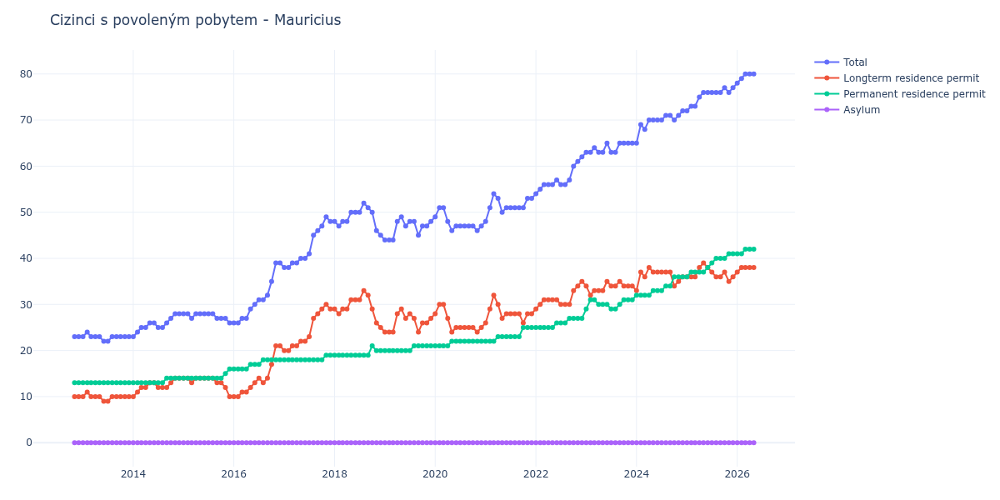

# Mauricius

## Souhrnné statistiky (Min/Max pro rok) / Summary Statistics (Min/Max per year)

| Year   | Total   | Longterm Residence Permit   | Permanent Residence Permit   | Asylum   |
|--------|---------|-----------------------------|------------------------------|----------|
| 2012   | 23 / 23 | 10 / 10                     | 13 / 13                      | 0 / 0    |
| 2013   | 22 / 24 | 9 / 11                      | 13 / 13                      | 0 / 0    |
| 2014   | 23 / 28 | 10 / 14                     | 13 / 14                      | 0 / 0    |
| 2015   | 26 / 28 | 10 / 14                     | 14 / 16                      | 0 / 0    |
| 2016   | 26 / 39 | 10 / 21                     | 16 / 18                      | 0 / 0    |
| 2017   | 38 / 49 | 20 / 30                     | 18 / 19                      | 0 / 0    |
| 2018   | 45 / 52 | 25 / 33                     | 19 / 21                      | 0 / 0    |
| 2019   | 44 / 49 | 24 / 29                     | 20 / 21                      | 0 / 0    |
| 2020   | 46 / 51 | 24 / 30                     | 21 / 22                      | 0 / 0    |
| 2021   | 48 / 54 | 26 / 32                     | 22 / 25                      | 0 / 0    |
| 2022   | 54 / 62 | 29 / 35                     | 25 / 27                      | 0 / 0    |
| 2023   | 63 / 65 | 32 / 35                     | 29 / 31                      | 0 / 0    |
| 2024   | 65 / 72 | 33 / 38                     | 32 / 36                      | 0 / 0    |
| 2025   | 72 / 77 | 35 / 39                     | 36 / 41                      | 0 / 0    |
| 2026   | 78 / 80 | 37 / 38                     | 41 / 42                      | 0 / 0    |

## Detailní tabulka / Detailed Data Table

| Date     | Total        | Longterm Residence Permit   | Permanent Residence Permit   | Asylum   |
|----------|--------------|-----------------------------|------------------------------|----------|
| **2012** |              |                             |                              |          |
| 11.2012  | 23           | 10                          | 13                           | 0        |
| 12.2012  | 23 (+0.00%)  | 10 (+0.00%)                 | 13 (+0.00%)                  | 0        |
| **2013** |              |                             |                              |          |
| 01.2013  | 23 (+0.00%)  | 10 (+0.00%)                 | 13 (+0.00%)                  | 0        |
| 02.2013  | 24 (+4.35%)  | 11 (+10.00%)                | 13 (+0.00%)                  | 0        |
| 03.2013  | 23 (-4.17%)  | 10 (-9.09%)                 | 13 (+0.00%)                  | 0        |
| 04.2013  | 23 (+0.00%)  | 10 (+0.00%)                 | 13 (+0.00%)                  | 0        |
| 05.2013  | 23 (+0.00%)  | 10 (+0.00%)                 | 13 (+0.00%)                  | 0        |
| 06.2013  | 22 (-4.35%)  | 9 (-10.00%)                 | 13 (+0.00%)                  | 0        |
| 07.2013  | 22 (+0.00%)  | 9 (+0.00%)                  | 13 (+0.00%)                  | 0        |
| 08.2013  | 23 (+4.55%)  | 10 (+11.11%)                | 13 (+0.00%)                  | 0        |
| 09.2013  | 23 (+0.00%)  | 10 (+0.00%)                 | 13 (+0.00%)                  | 0        |
| 10.2013  | 23 (+0.00%)  | 10 (+0.00%)                 | 13 (+0.00%)                  | 0        |
| 11.2013  | 23 (+0.00%)  | 10 (+0.00%)                 | 13 (+0.00%)                  | 0        |
| 12.2013  | 23 (+0.00%)  | 10 (+0.00%)                 | 13 (+0.00%)                  | 0        |
| **2014** |              |                             |                              |          |
| 01.2014  | 23 (+0.00%)  | 10 (+0.00%)                 | 13 (+0.00%)                  | 0        |
| 02.2014  | 24 (+4.35%)  | 11 (+10.00%)                | 13 (+0.00%)                  | 0        |
| 03.2014  | 25 (+4.17%)  | 12 (+9.09%)                 | 13 (+0.00%)                  | 0        |
| 04.2014  | 25 (+0.00%)  | 12 (+0.00%)                 | 13 (+0.00%)                  | 0        |
| 05.2014  | 26 (+4.00%)  | 13 (+8.33%)                 | 13 (+0.00%)                  | 0        |
| 06.2014  | 26 (+0.00%)  | 13 (+0.00%)                 | 13 (+0.00%)                  | 0        |
| 07.2014  | 25 (-3.85%)  | 12 (-7.69%)                 | 13 (+0.00%)                  | 0        |
| 08.2014  | 25 (+0.00%)  | 12 (+0.00%)                 | 13 (+0.00%)                  | 0        |
| 09.2014  | 26 (+4.00%)  | 12 (+0.00%)                 | 14 (+7.69%)                  | 0        |
| 10.2014  | 27 (+3.85%)  | 13 (+8.33%)                 | 14 (+0.00%)                  | 0        |
| 11.2014  | 28 (+3.70%)  | 14 (+7.69%)                 | 14 (+0.00%)                  | 0        |
| 12.2014  | 28 (+0.00%)  | 14 (+0.00%)                 | 14 (+0.00%)                  | 0        |
| **2015** |              |                             |                              |          |
| 01.2015  | 28 (+0.00%)  | 14 (+0.00%)                 | 14 (+0.00%)                  | 0        |
| 02.2015  | 28 (+0.00%)  | 14 (+0.00%)                 | 14 (+0.00%)                  | 0        |
| 03.2015  | 27 (-3.57%)  | 13 (-7.14%)                 | 14 (+0.00%)                  | 0        |
| 04.2015  | 28 (+3.70%)  | 14 (+7.69%)                 | 14 (+0.00%)                  | 0        |
| 05.2015  | 28 (+0.00%)  | 14 (+0.00%)                 | 14 (+0.00%)                  | 0        |
| 06.2015  | 28 (+0.00%)  | 14 (+0.00%)                 | 14 (+0.00%)                  | 0        |
| 07.2015  | 28 (+0.00%)  | 14 (+0.00%)                 | 14 (+0.00%)                  | 0        |
| 08.2015  | 28 (+0.00%)  | 14 (+0.00%)                 | 14 (+0.00%)                  | 0        |
| 09.2015  | 27 (-3.57%)  | 13 (-7.14%)                 | 14 (+0.00%)                  | 0        |
| 10.2015  | 27 (+0.00%)  | 13 (+0.00%)                 | 14 (+0.00%)                  | 0        |
| 11.2015  | 27 (+0.00%)  | 12 (-7.69%)                 | 15 (+7.14%)                  | 0        |
| 12.2015  | 26 (-3.70%)  | 10 (-16.67%)                | 16 (+6.67%)                  | 0        |
| **2016** |              |                             |                              |          |
| 01.2016  | 26 (+0.00%)  | 10 (+0.00%)                 | 16 (+0.00%)                  | 0        |
| 02.2016  | 26 (+0.00%)  | 10 (+0.00%)                 | 16 (+0.00%)                  | 0        |
| 03.2016  | 27 (+3.85%)  | 11 (+10.00%)                | 16 (+0.00%)                  | 0        |
| 04.2016  | 27 (+0.00%)  | 11 (+0.00%)                 | 16 (+0.00%)                  | 0        |
| 05.2016  | 29 (+7.41%)  | 12 (+9.09%)                 | 17 (+6.25%)                  | 0        |
| 06.2016  | 30 (+3.45%)  | 13 (+8.33%)                 | 17 (+0.00%)                  | 0        |
| 07.2016  | 31 (+3.33%)  | 14 (+7.69%)                 | 17 (+0.00%)                  | 0        |
| 08.2016  | 31 (+0.00%)  | 13 (-7.14%)                 | 18 (+5.88%)                  | 0        |
| 09.2016  | 32 (+3.23%)  | 14 (+7.69%)                 | 18 (+0.00%)                  | 0        |
| 10.2016  | 35 (+9.38%)  | 17 (+21.43%)                | 18 (+0.00%)                  | 0        |
| 11.2016  | 39 (+11.43%) | 21 (+23.53%)                | 18 (+0.00%)                  | 0        |
| 12.2016  | 39 (+0.00%)  | 21 (+0.00%)                 | 18 (+0.00%)                  | 0        |
| **2017** |              |                             |                              |          |
| 01.2017  | 38 (-2.56%)  | 20 (-4.76%)                 | 18 (+0.00%)                  | 0        |
| 02.2017  | 38 (+0.00%)  | 20 (+0.00%)                 | 18 (+0.00%)                  | 0        |
| 03.2017  | 39 (+2.63%)  | 21 (+5.00%)                 | 18 (+0.00%)                  | 0        |
| 04.2017  | 39 (+0.00%)  | 21 (+0.00%)                 | 18 (+0.00%)                  | 0        |
| 05.2017  | 40 (+2.56%)  | 22 (+4.76%)                 | 18 (+0.00%)                  | 0        |
| 06.2017  | 40 (+0.00%)  | 22 (+0.00%)                 | 18 (+0.00%)                  | 0        |
| 07.2017  | 41 (+2.50%)  | 23 (+4.55%)                 | 18 (+0.00%)                  | 0        |
| 08.2017  | 45 (+9.76%)  | 27 (+17.39%)                | 18 (+0.00%)                  | 0        |
| 09.2017  | 46 (+2.22%)  | 28 (+3.70%)                 | 18 (+0.00%)                  | 0        |
| 10.2017  | 47 (+2.17%)  | 29 (+3.57%)                 | 18 (+0.00%)                  | 0        |
| 11.2017  | 49 (+4.26%)  | 30 (+3.45%)                 | 19 (+5.56%)                  | 0        |
| 12.2017  | 48 (-2.04%)  | 29 (-3.33%)                 | 19 (+0.00%)                  | 0        |
| **2018** |              |                             |                              |          |
| 01.2018  | 48 (+0.00%)  | 29 (+0.00%)                 | 19 (+0.00%)                  | 0        |
| 02.2018  | 47 (-2.08%)  | 28 (-3.45%)                 | 19 (+0.00%)                  | 0        |
| 03.2018  | 48 (+2.13%)  | 29 (+3.57%)                 | 19 (+0.00%)                  | 0        |
| 04.2018  | 48 (+0.00%)  | 29 (+0.00%)                 | 19 (+0.00%)                  | 0        |
| 05.2018  | 50 (+4.17%)  | 31 (+6.90%)                 | 19 (+0.00%)                  | 0        |
| 06.2018  | 50 (+0.00%)  | 31 (+0.00%)                 | 19 (+0.00%)                  | 0        |
| 07.2018  | 50 (+0.00%)  | 31 (+0.00%)                 | 19 (+0.00%)                  | 0        |
| 08.2018  | 52 (+4.00%)  | 33 (+6.45%)                 | 19 (+0.00%)                  | 0        |
| 09.2018  | 51 (-1.92%)  | 32 (-3.03%)                 | 19 (+0.00%)                  | 0        |
| 10.2018  | 50 (-1.96%)  | 29 (-9.38%)                 | 21 (+10.53%)                 | 0        |
| 11.2018  | 46 (-8.00%)  | 26 (-10.34%)                | 20 (-4.76%)                  | 0        |
| 12.2018  | 45 (-2.17%)  | 25 (-3.85%)                 | 20 (+0.00%)                  | 0        |
| **2019** |              |                             |                              |          |
| 01.2019  | 44 (-2.22%)  | 24 (-4.00%)                 | 20 (+0.00%)                  | 0        |
| 02.2019  | 44 (+0.00%)  | 24 (+0.00%)                 | 20 (+0.00%)                  | 0        |
| 03.2019  | 44 (+0.00%)  | 24 (+0.00%)                 | 20 (+0.00%)                  | 0        |
| 04.2019  | 48 (+9.09%)  | 28 (+16.67%)                | 20 (+0.00%)                  | 0        |
| 05.2019  | 49 (+2.08%)  | 29 (+3.57%)                 | 20 (+0.00%)                  | 0        |
| 06.2019  | 47 (-4.08%)  | 27 (-6.90%)                 | 20 (+0.00%)                  | 0        |
| 07.2019  | 48 (+2.13%)  | 28 (+3.70%)                 | 20 (+0.00%)                  | 0        |
| 08.2019  | 48 (+0.00%)  | 27 (-3.57%)                 | 21 (+5.00%)                  | 0        |
| 09.2019  | 45 (-6.25%)  | 24 (-11.11%)                | 21 (+0.00%)                  | 0        |
| 10.2019  | 47 (+4.44%)  | 26 (+8.33%)                 | 21 (+0.00%)                  | 0        |
| 11.2019  | 47 (+0.00%)  | 26 (+0.00%)                 | 21 (+0.00%)                  | 0        |
| 12.2019  | 48 (+2.13%)  | 27 (+3.85%)                 | 21 (+0.00%)                  | 0        |
| **2020** |              |                             |                              |          |
| 01.2020  | 49 (+2.08%)  | 28 (+3.70%)                 | 21 (+0.00%)                  | 0        |
| 02.2020  | 51 (+4.08%)  | 30 (+7.14%)                 | 21 (+0.00%)                  | 0        |
| 03.2020  | 51 (+0.00%)  | 30 (+0.00%)                 | 21 (+0.00%)                  | 0        |
| 04.2020  | 48 (-5.88%)  | 27 (-10.00%)                | 21 (+0.00%)                  | 0        |
| 05.2020  | 46 (-4.17%)  | 24 (-11.11%)                | 22 (+4.76%)                  | 0        |
| 06.2020  | 47 (+2.17%)  | 25 (+4.17%)                 | 22 (+0.00%)                  | 0        |
| 07.2020  | 47 (+0.00%)  | 25 (+0.00%)                 | 22 (+0.00%)                  | 0        |
| 08.2020  | 47 (+0.00%)  | 25 (+0.00%)                 | 22 (+0.00%)                  | 0        |
| 09.2020  | 47 (+0.00%)  | 25 (+0.00%)                 | 22 (+0.00%)                  | 0        |
| 10.2020  | 47 (+0.00%)  | 25 (+0.00%)                 | 22 (+0.00%)                  | 0        |
| 11.2020  | 46 (-2.13%)  | 24 (-4.00%)                 | 22 (+0.00%)                  | 0        |
| 12.2020  | 47 (+2.17%)  | 25 (+4.17%)                 | 22 (+0.00%)                  | 0        |
| **2021** |              |                             |                              |          |
| 01.2021  | 48 (+2.13%)  | 26 (+4.00%)                 | 22 (+0.00%)                  | 0        |
| 02.2021  | 51 (+6.25%)  | 29 (+11.54%)                | 22 (+0.00%)                  | 0        |
| 03.2021  | 54 (+5.88%)  | 32 (+10.34%)                | 22 (+0.00%)                  | 0        |
| 04.2021  | 53 (-1.85%)  | 30 (-6.25%)                 | 23 (+4.55%)                  | 0        |
| 05.2021  | 50 (-5.66%)  | 27 (-10.00%)                | 23 (+0.00%)                  | 0        |
| 06.2021  | 51 (+2.00%)  | 28 (+3.70%)                 | 23 (+0.00%)                  | 0        |
| 07.2021  | 51 (+0.00%)  | 28 (+0.00%)                 | 23 (+0.00%)                  | 0        |
| 08.2021  | 51 (+0.00%)  | 28 (+0.00%)                 | 23 (+0.00%)                  | 0        |
| 09.2021  | 51 (+0.00%)  | 28 (+0.00%)                 | 23 (+0.00%)                  | 0        |
| 10.2021  | 51 (+0.00%)  | 26 (-7.14%)                 | 25 (+8.70%)                  | 0        |
| 11.2021  | 53 (+3.92%)  | 28 (+7.69%)                 | 25 (+0.00%)                  | 0        |
| 12.2021  | 53 (+0.00%)  | 28 (+0.00%)                 | 25 (+0.00%)                  | 0        |
| **2022** |              |                             |                              |          |
| 01.2022  | 54 (+1.89%)  | 29 (+3.57%)                 | 25 (+0.00%)                  | 0        |
| 02.2022  | 55 (+1.85%)  | 30 (+3.45%)                 | 25 (+0.00%)                  | 0        |
| 03.2022  | 56 (+1.82%)  | 31 (+3.33%)                 | 25 (+0.00%)                  | 0        |
| 04.2022  | 56 (+0.00%)  | 31 (+0.00%)                 | 25 (+0.00%)                  | 0        |
| 05.2022  | 56 (+0.00%)  | 31 (+0.00%)                 | 25 (+0.00%)                  | 0        |
| 06.2022  | 57 (+1.79%)  | 31 (+0.00%)                 | 26 (+4.00%)                  | 0        |
| 07.2022  | 56 (-1.75%)  | 30 (-3.23%)                 | 26 (+0.00%)                  | 0        |
| 08.2022  | 56 (+0.00%)  | 30 (+0.00%)                 | 26 (+0.00%)                  | 0        |
| 09.2022  | 57 (+1.79%)  | 30 (+0.00%)                 | 27 (+3.85%)                  | 0        |
| 10.2022  | 60 (+5.26%)  | 33 (+10.00%)                | 27 (+0.00%)                  | 0        |
| 11.2022  | 61 (+1.67%)  | 34 (+3.03%)                 | 27 (+0.00%)                  | 0        |
| 12.2022  | 62 (+1.64%)  | 35 (+2.94%)                 | 27 (+0.00%)                  | 0        |
| **2023** |              |                             |                              |          |
| 01.2023  | 63 (+1.61%)  | 34 (-2.86%)                 | 29 (+7.41%)                  | 0        |
| 02.2023  | 63 (+0.00%)  | 32 (-5.88%)                 | 31 (+6.90%)                  | 0        |
| 03.2023  | 64 (+1.59%)  | 33 (+3.12%)                 | 31 (+0.00%)                  | 0        |
| 04.2023  | 63 (-1.56%)  | 33 (+0.00%)                 | 30 (-3.23%)                  | 0        |
| 05.2023  | 63 (+0.00%)  | 33 (+0.00%)                 | 30 (+0.00%)                  | 0        |
| 06.2023  | 65 (+3.17%)  | 35 (+6.06%)                 | 30 (+0.00%)                  | 0        |
| 07.2023  | 63 (-3.08%)  | 34 (-2.86%)                 | 29 (-3.33%)                  | 0        |
| 08.2023  | 63 (+0.00%)  | 34 (+0.00%)                 | 29 (+0.00%)                  | 0        |
| 09.2023  | 65 (+3.17%)  | 35 (+2.94%)                 | 30 (+3.45%)                  | 0        |
| 10.2023  | 65 (+0.00%)  | 34 (-2.86%)                 | 31 (+3.33%)                  | 0        |
| 11.2023  | 65 (+0.00%)  | 34 (+0.00%)                 | 31 (+0.00%)                  | 0        |
| 12.2023  | 65 (+0.00%)  | 34 (+0.00%)                 | 31 (+0.00%)                  | 0        |
| **2024** |              |                             |                              |          |
| 01.2024  | 65 (+0.00%)  | 33 (-2.94%)                 | 32 (+3.23%)                  | 0        |
| 02.2024  | 69 (+6.15%)  | 37 (+12.12%)                | 32 (+0.00%)                  | 0        |
| 03.2024  | 68 (-1.45%)  | 36 (-2.70%)                 | 32 (+0.00%)                  | 0        |
| 04.2024  | 70 (+2.94%)  | 38 (+5.56%)                 | 32 (+0.00%)                  | 0        |
| 05.2024  | 70 (+0.00%)  | 37 (-2.63%)                 | 33 (+3.12%)                  | 0        |
| 06.2024  | 70 (+0.00%)  | 37 (+0.00%)                 | 33 (+0.00%)                  | 0        |
| 07.2024  | 70 (+0.00%)  | 37 (+0.00%)                 | 33 (+0.00%)                  | 0        |
| 08.2024  | 71 (+1.43%)  | 37 (+0.00%)                 | 34 (+3.03%)                  | 0        |
| 09.2024  | 71 (+0.00%)  | 37 (+0.00%)                 | 34 (+0.00%)                  | 0        |
| 10.2024  | 70 (-1.41%)  | 34 (-8.11%)                 | 36 (+5.88%)                  | 0        |
| 11.2024  | 71 (+1.43%)  | 35 (+2.94%)                 | 36 (+0.00%)                  | 0        |
| 12.2024  | 72 (+1.41%)  | 36 (+2.86%)                 | 36 (+0.00%)                  | 0        |
| **2025** |              |                             |                              |          |
| 01.2025  | 72 (+0.00%)  | 36 (+0.00%)                 | 36 (+0.00%)                  | 0        |
| 02.2025  | 73 (+1.39%)  | 36 (+0.00%)                 | 37 (+2.78%)                  | 0        |
| 03.2025  | 73 (+0.00%)  | 36 (+0.00%)                 | 37 (+0.00%)                  | 0        |
| 04.2025  | 75 (+2.74%)  | 38 (+5.56%)                 | 37 (+0.00%)                  | 0        |
| 05.2025  | 76 (+1.33%)  | 39 (+2.63%)                 | 37 (+0.00%)                  | 0        |
| 06.2025  | 76 (+0.00%)  | 38 (-2.56%)                 | 38 (+2.70%)                  | 0        |
| 07.2025  | 76 (+0.00%)  | 37 (-2.63%)                 | 39 (+2.63%)                  | 0        |
| 08.2025  | 76 (+0.00%)  | 36 (-2.70%)                 | 40 (+2.56%)                  | 0        |
| 09.2025  | 76 (+0.00%)  | 36 (+0.00%)                 | 40 (+0.00%)                  | 0        |
| 10.2025  | 77 (+1.32%)  | 37 (+2.78%)                 | 40 (+0.00%)                  | 0        |
| 11.2025  | 76 (-1.30%)  | 35 (-5.41%)                 | 41 (+2.50%)                  | 0        |
| 12.2025  | 77 (+1.32%)  | 36 (+2.86%)                 | 41 (+0.00%)                  | 0        |
| **2026** |              |                             |                              |          |
| 01.2026  | 78 (+1.30%)  | 37 (+2.78%)                 | 41 (+0.00%)                  | 0        |
| 02.2026  | 79 (+1.28%)  | 38 (+2.70%)                 | 41 (+0.00%)                  | 0        |
| 03.2026  | 80 (+1.27%)  | 38 (+0.00%)                 | 42 (+2.44%)                  | 0        |
| 04.2026  | 80 (+0.00%)  | 38 (+0.00%)                 | 42 (+0.00%)                  | 0        |
| 05.2026  | 80 (+0.00%)  | 38 (+0.00%)                 | 42 (+0.00%)                  | 0        |
