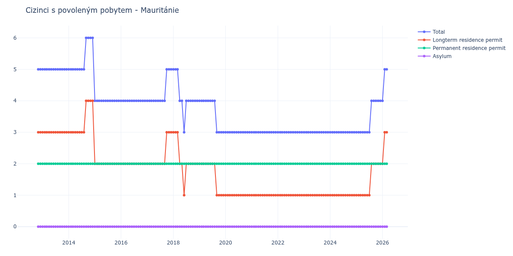

# Mauritánie

## Souhrnné statistiky (Min/Max pro rok) / Summary Statistics (Min/Max per year)

| Year   | Total   | Longterm Residence Permit   | Permanent Residence Permit   | Asylum   |
|--------|---------|-----------------------------|------------------------------|----------|
| 2012   | 5 / 5   | 3 / 3                       | 2 / 2                        | 0 / 0    |
| 2013   | 5 / 5   | 3 / 3                       | 2 / 2                        | 0 / 0    |
| 2014   | 5 / 6   | 3 / 4                       | 2 / 2                        | 0 / 0    |
| 2015   | 4 / 4   | 2 / 2                       | 2 / 2                        | 0 / 0    |
| 2016   | 4 / 4   | 2 / 2                       | 2 / 2                        | 0 / 0    |
| 2017   | 4 / 5   | 2 / 3                       | 2 / 2                        | 0 / 0    |
| 2018   | 3 / 5   | 1 / 3                       | 2 / 2                        | 0 / 0    |
| 2019   | 3 / 4   | 1 / 2                       | 2 / 2                        | 0 / 0    |
| 2020   | 3 / 3   | 1 / 1                       | 2 / 2                        | 0 / 0    |
| 2021   | 3 / 3   | 1 / 1                       | 2 / 2                        | 0 / 0    |
| 2022   | 3 / 3   | 1 / 1                       | 2 / 2                        | 0 / 0    |
| 2023   | 3 / 3   | 1 / 1                       | 2 / 2                        | 0 / 0    |
| 2024   | 3 / 3   | 1 / 1                       | 2 / 2                        | 0 / 0    |
| 2025   | 3 / 4   | 1 / 2                       | 2 / 2                        | 0 / 0    |
| 2026   | 4 / 5   | 2 / 3                       | 2 / 2                        | 0 / 0    |

## Detailní tabulka / Detailed Data Table

| Date     | Total       | Longterm Residence Permit   | Permanent Residence Permit   | Asylum   |
|----------|-------------|-----------------------------|------------------------------|----------|
| **2012** |             |                             |                              |          |
| 11.2012  | 5           | 3                           | 2                            | 0        |
| 12.2012  | 5 (+0.00%)  | 3 (+0.00%)                  | 2 (+0.00%)                   | 0        |
| **2013** |             |                             |                              |          |
| 01.2013  | 5 (+0.00%)  | 3 (+0.00%)                  | 2 (+0.00%)                   | 0        |
| 02.2013  | 5 (+0.00%)  | 3 (+0.00%)                  | 2 (+0.00%)                   | 0        |
| 03.2013  | 5 (+0.00%)  | 3 (+0.00%)                  | 2 (+0.00%)                   | 0        |
| 04.2013  | 5 (+0.00%)  | 3 (+0.00%)                  | 2 (+0.00%)                   | 0        |
| 05.2013  | 5 (+0.00%)  | 3 (+0.00%)                  | 2 (+0.00%)                   | 0        |
| 06.2013  | 5 (+0.00%)  | 3 (+0.00%)                  | 2 (+0.00%)                   | 0        |
| 07.2013  | 5 (+0.00%)  | 3 (+0.00%)                  | 2 (+0.00%)                   | 0        |
| 08.2013  | 5 (+0.00%)  | 3 (+0.00%)                  | 2 (+0.00%)                   | 0        |
| 09.2013  | 5 (+0.00%)  | 3 (+0.00%)                  | 2 (+0.00%)                   | 0        |
| 10.2013  | 5 (+0.00%)  | 3 (+0.00%)                  | 2 (+0.00%)                   | 0        |
| 11.2013  | 5 (+0.00%)  | 3 (+0.00%)                  | 2 (+0.00%)                   | 0        |
| 12.2013  | 5 (+0.00%)  | 3 (+0.00%)                  | 2 (+0.00%)                   | 0        |
| **2014** |             |                             |                              |          |
| 01.2014  | 5 (+0.00%)  | 3 (+0.00%)                  | 2 (+0.00%)                   | 0        |
| 02.2014  | 5 (+0.00%)  | 3 (+0.00%)                  | 2 (+0.00%)                   | 0        |
| 03.2014  | 5 (+0.00%)  | 3 (+0.00%)                  | 2 (+0.00%)                   | 0        |
| 04.2014  | 5 (+0.00%)  | 3 (+0.00%)                  | 2 (+0.00%)                   | 0        |
| 05.2014  | 5 (+0.00%)  | 3 (+0.00%)                  | 2 (+0.00%)                   | 0        |
| 06.2014  | 5 (+0.00%)  | 3 (+0.00%)                  | 2 (+0.00%)                   | 0        |
| 07.2014  | 5 (+0.00%)  | 3 (+0.00%)                  | 2 (+0.00%)                   | 0        |
| 08.2014  | 5 (+0.00%)  | 3 (+0.00%)                  | 2 (+0.00%)                   | 0        |
| 09.2014  | 6 (+20.00%) | 4 (+33.33%)                 | 2 (+0.00%)                   | 0        |
| 10.2014  | 6 (+0.00%)  | 4 (+0.00%)                  | 2 (+0.00%)                   | 0        |
| 11.2014  | 6 (+0.00%)  | 4 (+0.00%)                  | 2 (+0.00%)                   | 0        |
| 12.2014  | 6 (+0.00%)  | 4 (+0.00%)                  | 2 (+0.00%)                   | 0        |
| **2015** |             |                             |                              |          |
| 01.2015  | 4 (-33.33%) | 2 (-50.00%)                 | 2 (+0.00%)                   | 0        |
| 02.2015  | 4 (+0.00%)  | 2 (+0.00%)                  | 2 (+0.00%)                   | 0        |
| 03.2015  | 4 (+0.00%)  | 2 (+0.00%)                  | 2 (+0.00%)                   | 0        |
| 04.2015  | 4 (+0.00%)  | 2 (+0.00%)                  | 2 (+0.00%)                   | 0        |
| 05.2015  | 4 (+0.00%)  | 2 (+0.00%)                  | 2 (+0.00%)                   | 0        |
| 06.2015  | 4 (+0.00%)  | 2 (+0.00%)                  | 2 (+0.00%)                   | 0        |
| 07.2015  | 4 (+0.00%)  | 2 (+0.00%)                  | 2 (+0.00%)                   | 0        |
| 08.2015  | 4 (+0.00%)  | 2 (+0.00%)                  | 2 (+0.00%)                   | 0        |
| 09.2015  | 4 (+0.00%)  | 2 (+0.00%)                  | 2 (+0.00%)                   | 0        |
| 10.2015  | 4 (+0.00%)  | 2 (+0.00%)                  | 2 (+0.00%)                   | 0        |
| 11.2015  | 4 (+0.00%)  | 2 (+0.00%)                  | 2 (+0.00%)                   | 0        |
| 12.2015  | 4 (+0.00%)  | 2 (+0.00%)                  | 2 (+0.00%)                   | 0        |
| **2016** |             |                             |                              |          |
| 01.2016  | 4 (+0.00%)  | 2 (+0.00%)                  | 2 (+0.00%)                   | 0        |
| 02.2016  | 4 (+0.00%)  | 2 (+0.00%)                  | 2 (+0.00%)                   | 0        |
| 03.2016  | 4 (+0.00%)  | 2 (+0.00%)                  | 2 (+0.00%)                   | 0        |
| 04.2016  | 4 (+0.00%)  | 2 (+0.00%)                  | 2 (+0.00%)                   | 0        |
| 05.2016  | 4 (+0.00%)  | 2 (+0.00%)                  | 2 (+0.00%)                   | 0        |
| 06.2016  | 4 (+0.00%)  | 2 (+0.00%)                  | 2 (+0.00%)                   | 0        |
| 07.2016  | 4 (+0.00%)  | 2 (+0.00%)                  | 2 (+0.00%)                   | 0        |
| 08.2016  | 4 (+0.00%)  | 2 (+0.00%)                  | 2 (+0.00%)                   | 0        |
| 09.2016  | 4 (+0.00%)  | 2 (+0.00%)                  | 2 (+0.00%)                   | 0        |
| 10.2016  | 4 (+0.00%)  | 2 (+0.00%)                  | 2 (+0.00%)                   | 0        |
| 11.2016  | 4 (+0.00%)  | 2 (+0.00%)                  | 2 (+0.00%)                   | 0        |
| 12.2016  | 4 (+0.00%)  | 2 (+0.00%)                  | 2 (+0.00%)                   | 0        |
| **2017** |             |                             |                              |          |
| 01.2017  | 4 (+0.00%)  | 2 (+0.00%)                  | 2 (+0.00%)                   | 0        |
| 02.2017  | 4 (+0.00%)  | 2 (+0.00%)                  | 2 (+0.00%)                   | 0        |
| 03.2017  | 4 (+0.00%)  | 2 (+0.00%)                  | 2 (+0.00%)                   | 0        |
| 04.2017  | 4 (+0.00%)  | 2 (+0.00%)                  | 2 (+0.00%)                   | 0        |
| 05.2017  | 4 (+0.00%)  | 2 (+0.00%)                  | 2 (+0.00%)                   | 0        |
| 06.2017  | 4 (+0.00%)  | 2 (+0.00%)                  | 2 (+0.00%)                   | 0        |
| 07.2017  | 4 (+0.00%)  | 2 (+0.00%)                  | 2 (+0.00%)                   | 0        |
| 08.2017  | 4 (+0.00%)  | 2 (+0.00%)                  | 2 (+0.00%)                   | 0        |
| 09.2017  | 4 (+0.00%)  | 2 (+0.00%)                  | 2 (+0.00%)                   | 0        |
| 10.2017  | 5 (+25.00%) | 3 (+50.00%)                 | 2 (+0.00%)                   | 0        |
| 11.2017  | 5 (+0.00%)  | 3 (+0.00%)                  | 2 (+0.00%)                   | 0        |
| 12.2017  | 5 (+0.00%)  | 3 (+0.00%)                  | 2 (+0.00%)                   | 0        |
| **2018** |             |                             |                              |          |
| 01.2018  | 5 (+0.00%)  | 3 (+0.00%)                  | 2 (+0.00%)                   | 0        |
| 02.2018  | 5 (+0.00%)  | 3 (+0.00%)                  | 2 (+0.00%)                   | 0        |
| 03.2018  | 5 (+0.00%)  | 3 (+0.00%)                  | 2 (+0.00%)                   | 0        |
| 04.2018  | 4 (-20.00%) | 2 (-33.33%)                 | 2 (+0.00%)                   | 0        |
| 05.2018  | 4 (+0.00%)  | 2 (+0.00%)                  | 2 (+0.00%)                   | 0        |
| 06.2018  | 3 (-25.00%) | 1 (-50.00%)                 | 2 (+0.00%)                   | 0        |
| 07.2018  | 4 (+33.33%) | 2 (+100.00%)                | 2 (+0.00%)                   | 0        |
| 08.2018  | 4 (+0.00%)  | 2 (+0.00%)                  | 2 (+0.00%)                   | 0        |
| 09.2018  | 4 (+0.00%)  | 2 (+0.00%)                  | 2 (+0.00%)                   | 0        |
| 10.2018  | 4 (+0.00%)  | 2 (+0.00%)                  | 2 (+0.00%)                   | 0        |
| 11.2018  | 4 (+0.00%)  | 2 (+0.00%)                  | 2 (+0.00%)                   | 0        |
| 12.2018  | 4 (+0.00%)  | 2 (+0.00%)                  | 2 (+0.00%)                   | 0        |
| **2019** |             |                             |                              |          |
| 01.2019  | 4 (+0.00%)  | 2 (+0.00%)                  | 2 (+0.00%)                   | 0        |
| 02.2019  | 4 (+0.00%)  | 2 (+0.00%)                  | 2 (+0.00%)                   | 0        |
| 03.2019  | 4 (+0.00%)  | 2 (+0.00%)                  | 2 (+0.00%)                   | 0        |
| 04.2019  | 4 (+0.00%)  | 2 (+0.00%)                  | 2 (+0.00%)                   | 0        |
| 05.2019  | 4 (+0.00%)  | 2 (+0.00%)                  | 2 (+0.00%)                   | 0        |
| 06.2019  | 4 (+0.00%)  | 2 (+0.00%)                  | 2 (+0.00%)                   | 0        |
| 07.2019  | 4 (+0.00%)  | 2 (+0.00%)                  | 2 (+0.00%)                   | 0        |
| 08.2019  | 4 (+0.00%)  | 2 (+0.00%)                  | 2 (+0.00%)                   | 0        |
| 09.2019  | 3 (-25.00%) | 1 (-50.00%)                 | 2 (+0.00%)                   | 0        |
| 10.2019  | 3 (+0.00%)  | 1 (+0.00%)                  | 2 (+0.00%)                   | 0        |
| 11.2019  | 3 (+0.00%)  | 1 (+0.00%)                  | 2 (+0.00%)                   | 0        |
| 12.2019  | 3 (+0.00%)  | 1 (+0.00%)                  | 2 (+0.00%)                   | 0        |
| **2020** |             |                             |                              |          |
| 01.2020  | 3 (+0.00%)  | 1 (+0.00%)                  | 2 (+0.00%)                   | 0        |
| 02.2020  | 3 (+0.00%)  | 1 (+0.00%)                  | 2 (+0.00%)                   | 0        |
| 03.2020  | 3 (+0.00%)  | 1 (+0.00%)                  | 2 (+0.00%)                   | 0        |
| 04.2020  | 3 (+0.00%)  | 1 (+0.00%)                  | 2 (+0.00%)                   | 0        |
| 05.2020  | 3 (+0.00%)  | 1 (+0.00%)                  | 2 (+0.00%)                   | 0        |
| 06.2020  | 3 (+0.00%)  | 1 (+0.00%)                  | 2 (+0.00%)                   | 0        |
| 07.2020  | 3 (+0.00%)  | 1 (+0.00%)                  | 2 (+0.00%)                   | 0        |
| 08.2020  | 3 (+0.00%)  | 1 (+0.00%)                  | 2 (+0.00%)                   | 0        |
| 09.2020  | 3 (+0.00%)  | 1 (+0.00%)                  | 2 (+0.00%)                   | 0        |
| 10.2020  | 3 (+0.00%)  | 1 (+0.00%)                  | 2 (+0.00%)                   | 0        |
| 11.2020  | 3 (+0.00%)  | 1 (+0.00%)                  | 2 (+0.00%)                   | 0        |
| 12.2020  | 3 (+0.00%)  | 1 (+0.00%)                  | 2 (+0.00%)                   | 0        |
| **2021** |             |                             |                              |          |
| 01.2021  | 3 (+0.00%)  | 1 (+0.00%)                  | 2 (+0.00%)                   | 0        |
| 02.2021  | 3 (+0.00%)  | 1 (+0.00%)                  | 2 (+0.00%)                   | 0        |
| 03.2021  | 3 (+0.00%)  | 1 (+0.00%)                  | 2 (+0.00%)                   | 0        |
| 04.2021  | 3 (+0.00%)  | 1 (+0.00%)                  | 2 (+0.00%)                   | 0        |
| 05.2021  | 3 (+0.00%)  | 1 (+0.00%)                  | 2 (+0.00%)                   | 0        |
| 06.2021  | 3 (+0.00%)  | 1 (+0.00%)                  | 2 (+0.00%)                   | 0        |
| 07.2021  | 3 (+0.00%)  | 1 (+0.00%)                  | 2 (+0.00%)                   | 0        |
| 08.2021  | 3 (+0.00%)  | 1 (+0.00%)                  | 2 (+0.00%)                   | 0        |
| 09.2021  | 3 (+0.00%)  | 1 (+0.00%)                  | 2 (+0.00%)                   | 0        |
| 10.2021  | 3 (+0.00%)  | 1 (+0.00%)                  | 2 (+0.00%)                   | 0        |
| 11.2021  | 3 (+0.00%)  | 1 (+0.00%)                  | 2 (+0.00%)                   | 0        |
| 12.2021  | 3 (+0.00%)  | 1 (+0.00%)                  | 2 (+0.00%)                   | 0        |
| **2022** |             |                             |                              |          |
| 01.2022  | 3 (+0.00%)  | 1 (+0.00%)                  | 2 (+0.00%)                   | 0        |
| 02.2022  | 3 (+0.00%)  | 1 (+0.00%)                  | 2 (+0.00%)                   | 0        |
| 03.2022  | 3 (+0.00%)  | 1 (+0.00%)                  | 2 (+0.00%)                   | 0        |
| 04.2022  | 3 (+0.00%)  | 1 (+0.00%)                  | 2 (+0.00%)                   | 0        |
| 05.2022  | 3 (+0.00%)  | 1 (+0.00%)                  | 2 (+0.00%)                   | 0        |
| 06.2022  | 3 (+0.00%)  | 1 (+0.00%)                  | 2 (+0.00%)                   | 0        |
| 07.2022  | 3 (+0.00%)  | 1 (+0.00%)                  | 2 (+0.00%)                   | 0        |
| 08.2022  | 3 (+0.00%)  | 1 (+0.00%)                  | 2 (+0.00%)                   | 0        |
| 09.2022  | 3 (+0.00%)  | 1 (+0.00%)                  | 2 (+0.00%)                   | 0        |
| 10.2022  | 3 (+0.00%)  | 1 (+0.00%)                  | 2 (+0.00%)                   | 0        |
| 11.2022  | 3 (+0.00%)  | 1 (+0.00%)                  | 2 (+0.00%)                   | 0        |
| 12.2022  | 3 (+0.00%)  | 1 (+0.00%)                  | 2 (+0.00%)                   | 0        |
| **2023** |             |                             |                              |          |
| 01.2023  | 3 (+0.00%)  | 1 (+0.00%)                  | 2 (+0.00%)                   | 0        |
| 02.2023  | 3 (+0.00%)  | 1 (+0.00%)                  | 2 (+0.00%)                   | 0        |
| 03.2023  | 3 (+0.00%)  | 1 (+0.00%)                  | 2 (+0.00%)                   | 0        |
| 04.2023  | 3 (+0.00%)  | 1 (+0.00%)                  | 2 (+0.00%)                   | 0        |
| 05.2023  | 3 (+0.00%)  | 1 (+0.00%)                  | 2 (+0.00%)                   | 0        |
| 06.2023  | 3 (+0.00%)  | 1 (+0.00%)                  | 2 (+0.00%)                   | 0        |
| 07.2023  | 3 (+0.00%)  | 1 (+0.00%)                  | 2 (+0.00%)                   | 0        |
| 08.2023  | 3 (+0.00%)  | 1 (+0.00%)                  | 2 (+0.00%)                   | 0        |
| 09.2023  | 3 (+0.00%)  | 1 (+0.00%)                  | 2 (+0.00%)                   | 0        |
| 10.2023  | 3 (+0.00%)  | 1 (+0.00%)                  | 2 (+0.00%)                   | 0        |
| 11.2023  | 3 (+0.00%)  | 1 (+0.00%)                  | 2 (+0.00%)                   | 0        |
| 12.2023  | 3 (+0.00%)  | 1 (+0.00%)                  | 2 (+0.00%)                   | 0        |
| **2024** |             |                             |                              |          |
| 01.2024  | 3 (+0.00%)  | 1 (+0.00%)                  | 2 (+0.00%)                   | 0        |
| 02.2024  | 3 (+0.00%)  | 1 (+0.00%)                  | 2 (+0.00%)                   | 0        |
| 03.2024  | 3 (+0.00%)  | 1 (+0.00%)                  | 2 (+0.00%)                   | 0        |
| 04.2024  | 3 (+0.00%)  | 1 (+0.00%)                  | 2 (+0.00%)                   | 0        |
| 05.2024  | 3 (+0.00%)  | 1 (+0.00%)                  | 2 (+0.00%)                   | 0        |
| 06.2024  | 3 (+0.00%)  | 1 (+0.00%)                  | 2 (+0.00%)                   | 0        |
| 07.2024  | 3 (+0.00%)  | 1 (+0.00%)                  | 2 (+0.00%)                   | 0        |
| 08.2024  | 3 (+0.00%)  | 1 (+0.00%)                  | 2 (+0.00%)                   | 0        |
| 09.2024  | 3 (+0.00%)  | 1 (+0.00%)                  | 2 (+0.00%)                   | 0        |
| 10.2024  | 3 (+0.00%)  | 1 (+0.00%)                  | 2 (+0.00%)                   | 0        |
| 11.2024  | 3 (+0.00%)  | 1 (+0.00%)                  | 2 (+0.00%)                   | 0        |
| 12.2024  | 3 (+0.00%)  | 1 (+0.00%)                  | 2 (+0.00%)                   | 0        |
| **2025** |             |                             |                              |          |
| 01.2025  | 3 (+0.00%)  | 1 (+0.00%)                  | 2 (+0.00%)                   | 0        |
| 02.2025  | 3 (+0.00%)  | 1 (+0.00%)                  | 2 (+0.00%)                   | 0        |
| 03.2025  | 3 (+0.00%)  | 1 (+0.00%)                  | 2 (+0.00%)                   | 0        |
| 04.2025  | 3 (+0.00%)  | 1 (+0.00%)                  | 2 (+0.00%)                   | 0        |
| 05.2025  | 3 (+0.00%)  | 1 (+0.00%)                  | 2 (+0.00%)                   | 0        |
| 06.2025  | 3 (+0.00%)  | 1 (+0.00%)                  | 2 (+0.00%)                   | 0        |
| 07.2025  | 3 (+0.00%)  | 1 (+0.00%)                  | 2 (+0.00%)                   | 0        |
| 08.2025  | 4 (+33.33%) | 2 (+100.00%)                | 2 (+0.00%)                   | 0        |
| 09.2025  | 4 (+0.00%)  | 2 (+0.00%)                  | 2 (+0.00%)                   | 0        |
| 10.2025  | 4 (+0.00%)  | 2 (+0.00%)                  | 2 (+0.00%)                   | 0        |
| 11.2025  | 4 (+0.00%)  | 2 (+0.00%)                  | 2 (+0.00%)                   | 0        |
| 12.2025  | 4 (+0.00%)  | 2 (+0.00%)                  | 2 (+0.00%)                   | 0        |
| **2026** |             |                             |                              |          |
| 01.2026  | 4 (+0.00%)  | 2 (+0.00%)                  | 2 (+0.00%)                   | 0        |
| 02.2026  | 5 (+25.00%) | 3 (+50.00%)                 | 2 (+0.00%)                   | 0        |
| 03.2026  | 5 (+0.00%)  | 3 (+0.00%)                  | 2 (+0.00%)                   | 0        |
