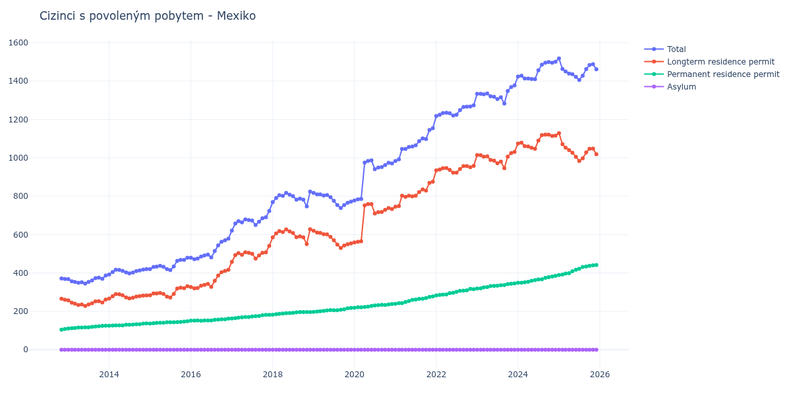

# Mexiko

## Souhrnné statistiky (Min/Max pro rok) / Summary Statistics (Min/Max per year)

| Year   | Total Min/Max   | Longterm Residence Permit Min/Max   | Permanent Residence Permit Min/Max   | Asylum Min/Max   |
|--------|-----------------|-------------------------------------|--------------------------------------|------------------|
| 2012   | 369 / 371       | 261 / 266                           | 105 / 108                            | 0 / 0            |
| 2013   | 345 / 387       | 228 / 262                           | 111 / 125                            | 0 / 0            |
| 2014   | 392 / 420       | 267 / 290                           | 125 / 137                            | 0 / 0            |
| 2015   | 415 / 479       | 272 / 331                           | 136 / 148                            | 0 / 0            |
| 2016   | 472 / 579       | 320 / 417                           | 151 / 162                            | 0 / 0            |
| 2017   | 621 / 723       | 458 / 541                           | 163 / 182                            | 0 / 0            |
| 2018   | 747 / 824       | 551 / 628                           | 183 / 196                            | 0 / 0            |
| 2019   | 738 / 817       | 530 / 620                           | 197 / 218                            | 0 / 0            |
| 2020   | 778 / 987       | 559 / 759                           | 219 / 238                            | 0 / 0            |
| 2021   | 984 / 1 154     | 745 / 876                           | 239 / 278                            | 0 / 0            |
| 2022   | 1 218 / 1 274   | 923 / 958                           | 283 / 317                            | 0 / 0            |
| 2023   | 1 283 / 1 377   | 946 / 1 031                         | 319 / 346                            | 0 / 0            |
| 2024   | 1 410 / 1 501   | 1 047 / 1 121                       | 349 / 385                            | 0 / 0            |
| 2025   | 1 406 / 1 518   | 984 / 1 129                         | 389 / 442                            | 0 / 0            |

## Detailní tabulka / Detailed Data Table

| Date     | Total          | Longterm Residence Permit   | Permanent Residence Permit   | Asylum   |
|----------|----------------|-----------------------------|------------------------------|----------|
| **2012** |                |                             |                              |          |
| 11.2012  | 371            | 266                         | 105                          | 0        |
| 12.2012  | 369 (-0.54%)   | 261 (-1.88%)                | 108 (+2.86%)                 | 0        |
| **2013** |                |                             |                              |          |
| 01.2013  | 368 (-0.27%)   | 257 (-1.53%)                | 111 (+2.78%)                 | 0        |
| 02.2013  | 357 (-2.99%)   | 245 (-4.67%)                | 112 (+0.90%)                 | 0        |
| 03.2013  | 353 (-1.12%)   | 240 (-2.04%)                | 113 (+0.89%)                 | 0        |
| 04.2013  | 349 (-1.13%)   | 233 (-2.92%)                | 116 (+2.65%)                 | 0        |
| 05.2013  | 352 (+0.86%)   | 236 (+1.29%)                | 116 (+0.00%)                 | 0        |
| 06.2013  | 345 (-1.99%)   | 228 (-3.39%)                | 117 (+0.86%)                 | 0        |
| 07.2013  | 353 (+2.32%)   | 236 (+3.51%)                | 117 (+0.00%)                 | 0        |
| 08.2013  | 361 (+2.27%)   | 242 (+2.54%)                | 119 (+1.71%)                 | 0        |
| 09.2013  | 373 (+3.32%)   | 252 (+4.13%)                | 121 (+1.68%)                 | 0        |
| 10.2013  | 376 (+0.80%)   | 253 (+0.40%)                | 123 (+1.65%)                 | 0        |
| 11.2013  | 370 (-1.60%)   | 246 (-2.77%)                | 124 (+0.81%)                 | 0        |
| 12.2013  | 387 (+4.59%)   | 262 (+6.50%)                | 125 (+0.81%)                 | 0        |
| **2014** |                |                             |                              |          |
| 01.2014  | 392 (+1.29%)   | 267 (+1.91%)                | 125 (+0.00%)                 | 0        |
| 02.2014  | 405 (+3.32%)   | 279 (+4.49%)                | 126 (+0.80%)                 | 0        |
| 03.2014  | 417 (+2.96%)   | 290 (+3.94%)                | 127 (+0.79%)                 | 0        |
| 04.2014  | 416 (-0.24%)   | 289 (-0.34%)                | 127 (+0.00%)                 | 0        |
| 05.2014  | 411 (-1.20%)   | 284 (-1.73%)                | 127 (+0.00%)                 | 0        |
| 06.2014  | 403 (-1.95%)   | 273 (-3.87%)                | 130 (+2.36%)                 | 0        |
| 07.2014  | 398 (-1.24%)   | 268 (-1.83%)                | 130 (+0.00%)                 | 0        |
| 08.2014  | 402 (+1.01%)   | 271 (+1.12%)                | 131 (+0.77%)                 | 0        |
| 09.2014  | 410 (+1.99%)   | 277 (+2.21%)                | 133 (+1.53%)                 | 0        |
| 10.2014  | 413 (+0.73%)   | 280 (+1.08%)                | 133 (+0.00%)                 | 0        |
| 11.2014  | 418 (+1.21%)   | 282 (+0.71%)                | 136 (+2.26%)                 | 0        |
| 12.2014  | 420 (+0.48%)   | 283 (+0.35%)                | 137 (+0.74%)                 | 0        |
| **2015** |                |                             |                              |          |
| 01.2015  | 420 (+0.00%)   | 284 (+0.35%)                | 136 (-0.73%)                 | 0        |
| 02.2015  | 431 (+2.62%)   | 293 (+3.17%)                | 138 (+1.47%)                 | 0        |
| 03.2015  | 433 (+0.46%)   | 293 (+0.00%)                | 140 (+1.45%)                 | 0        |
| 04.2015  | 437 (+0.92%)   | 296 (+1.02%)                | 141 (+0.71%)                 | 0        |
| 05.2015  | 432 (-1.14%)   | 291 (-1.69%)                | 141 (+0.00%)                 | 0        |
| 06.2015  | 420 (-2.78%)   | 277 (-4.81%)                | 143 (+1.42%)                 | 0        |
| 07.2015  | 415 (-1.19%)   | 272 (-1.81%)                | 143 (+0.00%)                 | 0        |
| 08.2015  | 434 (+4.58%)   | 291 (+6.99%)                | 143 (+0.00%)                 | 0        |
| 09.2015  | 463 (+6.68%)   | 319 (+9.62%)                | 144 (+0.70%)                 | 0        |
| 10.2015  | 468 (+1.08%)   | 323 (+1.25%)                | 145 (+0.69%)                 | 0        |
| 11.2015  | 468 (+0.00%)   | 321 (-0.62%)                | 147 (+1.38%)                 | 0        |
| 12.2015  | 479 (+2.35%)   | 331 (+3.12%)                | 148 (+0.68%)                 | 0        |
| **2016** |                |                             |                              |          |
| 01.2016  | 479 (+0.00%)   | 327 (-1.21%)                | 152 (+2.70%)                 | 0        |
| 02.2016  | 472 (-1.46%)   | 320 (-2.14%)                | 152 (+0.00%)                 | 0        |
| 03.2016  | 475 (+0.64%)   | 322 (+0.63%)                | 153 (+0.66%)                 | 0        |
| 04.2016  | 485 (+2.11%)   | 334 (+3.73%)                | 151 (-1.31%)                 | 0        |
| 05.2016  | 491 (+1.24%)   | 338 (+1.20%)                | 153 (+1.32%)                 | 0        |
| 06.2016  | 496 (+1.02%)   | 343 (+1.48%)                | 153 (+0.00%)                 | 0        |
| 07.2016  | 481 (-3.02%)   | 328 (-4.37%)                | 153 (+0.00%)                 | 0        |
| 08.2016  | 515 (+7.07%)   | 359 (+9.45%)                | 156 (+1.96%)                 | 0        |
| 09.2016  | 544 (+5.63%)   | 387 (+7.80%)                | 157 (+0.64%)                 | 0        |
| 10.2016  | 563 (+3.49%)   | 404 (+4.39%)                | 159 (+1.27%)                 | 0        |
| 11.2016  | 570 (+1.24%)   | 411 (+1.73%)                | 159 (+0.00%)                 | 0        |
| 12.2016  | 579 (+1.58%)   | 417 (+1.46%)                | 162 (+1.89%)                 | 0        |
| **2017** |                |                             |                              |          |
| 01.2017  | 621 (+7.25%)   | 458 (+9.83%)                | 163 (+0.62%)                 | 0        |
| 02.2017  | 658 (+5.96%)   | 493 (+7.64%)                | 165 (+1.23%)                 | 0        |
| 03.2017  | 670 (+1.82%)   | 503 (+2.03%)                | 167 (+1.21%)                 | 0        |
| 04.2017  | 664 (-0.90%)   | 495 (-1.59%)                | 169 (+1.20%)                 | 0        |
| 05.2017  | 679 (+2.26%)   | 508 (+2.63%)                | 171 (+1.18%)                 | 0        |
| 06.2017  | 676 (-0.44%)   | 505 (-0.59%)                | 171 (+0.00%)                 | 0        |
| 07.2017  | 673 (-0.44%)   | 500 (-0.99%)                | 173 (+1.17%)                 | 0        |
| 08.2017  | 650 (-3.42%)   | 475 (-5.00%)                | 175 (+1.16%)                 | 0        |
| 09.2017  | 667 (+2.62%)   | 491 (+3.37%)                | 176 (+0.57%)                 | 0        |
| 10.2017  | 685 (+2.70%)   | 505 (+2.85%)                | 180 (+2.27%)                 | 0        |
| 11.2017  | 690 (+0.73%)   | 508 (+0.59%)                | 182 (+1.11%)                 | 0        |
| 12.2017  | 723 (+4.78%)   | 541 (+6.50%)                | 182 (+0.00%)                 | 0        |
| **2018** |                |                             |                              |          |
| 01.2018  | 769 (+6.36%)   | 586 (+8.32%)                | 183 (+0.55%)                 | 0        |
| 02.2018  | 791 (+2.86%)   | 606 (+3.41%)                | 185 (+1.09%)                 | 0        |
| 03.2018  | 805 (+1.77%)   | 618 (+1.98%)                | 187 (+1.08%)                 | 0        |
| 04.2018  | 802 (-0.37%)   | 613 (-0.81%)                | 189 (+1.07%)                 | 0        |
| 05.2018  | 817 (+1.87%)   | 627 (+2.28%)                | 190 (+0.53%)                 | 0        |
| 06.2018  | 808 (-1.10%)   | 617 (-1.59%)                | 191 (+0.53%)                 | 0        |
| 07.2018  | 800 (-0.99%)   | 608 (-1.46%)                | 192 (+0.52%)                 | 0        |
| 08.2018  | 782 (-2.25%)   | 587 (-3.45%)                | 195 (+1.56%)                 | 0        |
| 09.2018  | 787 (+0.64%)   | 591 (+0.68%)                | 196 (+0.51%)                 | 0        |
| 10.2018  | 782 (-0.64%)   | 586 (-0.85%)                | 196 (+0.00%)                 | 0        |
| 11.2018  | 747 (-4.48%)   | 551 (-5.97%)                | 196 (+0.00%)                 | 0        |
| 12.2018  | 824 (+10.31%)  | 628 (+13.97%)               | 196 (+0.00%)                 | 0        |
| **2019** |                |                             |                              |          |
| 01.2019  | 817 (-0.85%)   | 620 (-1.27%)                | 197 (+0.51%)                 | 0        |
| 02.2019  | 810 (-0.86%)   | 611 (-1.45%)                | 199 (+1.02%)                 | 0        |
| 03.2019  | 810 (+0.00%)   | 609 (-0.33%)                | 201 (+1.01%)                 | 0        |
| 04.2019  | 804 (-0.74%)   | 602 (-1.15%)                | 202 (+0.50%)                 | 0        |
| 05.2019  | 806 (+0.25%)   | 601 (-0.17%)                | 205 (+1.49%)                 | 0        |
| 06.2019  | 795 (-1.36%)   | 588 (-2.16%)                | 207 (+0.98%)                 | 0        |
| 07.2019  | 776 (-2.39%)   | 570 (-3.06%)                | 206 (-0.48%)                 | 0        |
| 08.2019  | 754 (-2.84%)   | 548 (-3.86%)                | 206 (+0.00%)                 | 0        |
| 09.2019  | 738 (-2.12%)   | 530 (-3.28%)                | 208 (+0.97%)                 | 0        |
| 10.2019  | 754 (+2.17%)   | 543 (+2.45%)                | 211 (+1.44%)                 | 0        |
| 11.2019  | 766 (+1.59%)   | 550 (+1.29%)                | 216 (+2.37%)                 | 0        |
| 12.2019  | 772 (+0.78%)   | 554 (+0.73%)                | 218 (+0.93%)                 | 0        |
| **2020** |                |                             |                              |          |
| 01.2020  | 778 (+0.78%)   | 559 (+0.90%)                | 219 (+0.46%)                 | 0        |
| 02.2020  | 784 (+0.77%)   | 563 (+0.72%)                | 221 (+0.91%)                 | 0        |
| 03.2020  | 786 (+0.26%)   | 565 (+0.36%)                | 221 (+0.00%)                 | 0        |
| 04.2020  | 975 (+24.05%)  | 752 (+33.10%)               | 223 (+0.90%)                 | 0        |
| 05.2020  | 984 (+0.92%)   | 759 (+0.93%)                | 225 (+0.90%)                 | 0        |
| 06.2020  | 987 (+0.30%)   | 759 (+0.00%)                | 228 (+1.33%)                 | 0        |
| 07.2020  | 941 (-4.66%)   | 710 (-6.46%)                | 231 (+1.32%)                 | 0        |
| 08.2020  | 949 (+0.85%)   | 717 (+0.99%)                | 232 (+0.43%)                 | 0        |
| 09.2020  | 952 (+0.32%)   | 718 (+0.14%)                | 234 (+0.86%)                 | 0        |
| 10.2020  | 962 (+1.05%)   | 729 (+1.53%)                | 233 (-0.43%)                 | 0        |
| 11.2020  | 974 (+1.25%)   | 738 (+1.23%)                | 236 (+1.29%)                 | 0        |
| 12.2020  | 971 (-0.31%)   | 733 (-0.68%)                | 238 (+0.85%)                 | 0        |
| **2021** |                |                             |                              |          |
| 01.2021  | 984 (+1.34%)   | 745 (+1.64%)                | 239 (+0.42%)                 | 0        |
| 02.2021  | 992 (+0.81%)   | 749 (+0.54%)                | 243 (+1.67%)                 | 0        |
| 03.2021  | 1 046 (+5.44%) | 803 (+7.21%)                | 243 (+0.00%)                 | 0        |
| 04.2021  | 1 046 (+0.00%) | 797 (-0.75%)                | 249 (+2.47%)                 | 0        |
| 05.2021  | 1 057 (+1.05%) | 803 (+0.75%)                | 254 (+2.01%)                 | 0        |
| 06.2021  | 1 059 (+0.19%) | 799 (-0.50%)                | 260 (+2.36%)                 | 0        |
| 07.2021  | 1 065 (+0.57%) | 803 (+0.50%)                | 262 (+0.77%)                 | 0        |
| 08.2021  | 1 087 (+2.07%) | 822 (+2.37%)                | 265 (+1.15%)                 | 0        |
| 09.2021  | 1 101 (+1.29%) | 835 (+1.58%)                | 266 (+0.38%)                 | 0        |
| 10.2021  | 1 098 (-0.27%) | 829 (-0.72%)                | 269 (+1.13%)                 | 0        |
| 11.2021  | 1 145 (+4.28%) | 870 (+4.95%)                | 275 (+2.23%)                 | 0        |
| 12.2021  | 1 154 (+0.79%) | 876 (+0.69%)                | 278 (+1.09%)                 | 0        |
| **2022** |                |                             |                              |          |
| 01.2022  | 1 218 (+5.55%) | 935 (+6.74%)                | 283 (+1.80%)                 | 0        |
| 02.2022  | 1 225 (+0.57%) | 939 (+0.43%)                | 286 (+1.06%)                 | 0        |
| 03.2022  | 1 233 (+0.65%) | 946 (+0.75%)                | 287 (+0.35%)                 | 0        |
| 04.2022  | 1 235 (+0.16%) | 947 (+0.11%)                | 288 (+0.35%)                 | 0        |
| 05.2022  | 1 232 (-0.24%) | 937 (-1.06%)                | 295 (+2.43%)                 | 0        |
| 06.2022  | 1 220 (-0.97%) | 923 (-1.49%)                | 297 (+0.68%)                 | 0        |
| 07.2022  | 1 225 (+0.41%) | 923 (+0.00%)                | 302 (+1.68%)                 | 0        |
| 08.2022  | 1 249 (+1.96%) | 942 (+2.06%)                | 307 (+1.66%)                 | 0        |
| 09.2022  | 1 265 (+1.28%) | 957 (+1.59%)                | 308 (+0.33%)                 | 0        |
| 10.2022  | 1 267 (+0.16%) | 957 (+0.00%)                | 310 (+0.65%)                 | 0        |
| 11.2022  | 1 268 (+0.08%) | 951 (-0.63%)                | 317 (+2.26%)                 | 0        |
| 12.2022  | 1 274 (+0.47%) | 958 (+0.74%)                | 316 (-0.32%)                 | 0        |
| **2023** |                |                             |                              |          |
| 01.2023  | 1 334 (+4.71%) | 1 015 (+5.95%)              | 319 (+0.95%)                 | 0        |
| 02.2023  | 1 334 (+0.00%) | 1 014 (-0.10%)              | 320 (+0.31%)                 | 0        |
| 03.2023  | 1 331 (-0.22%) | 1 006 (-0.79%)              | 325 (+1.56%)                 | 0        |
| 04.2023  | 1 335 (+0.30%) | 1 008 (+0.20%)              | 327 (+0.62%)                 | 0        |
| 05.2023  | 1 321 (-1.05%) | 989 (-1.88%)                | 332 (+1.53%)                 | 0        |
| 06.2023  | 1 318 (-0.23%) | 985 (-0.40%)                | 333 (+0.30%)                 | 0        |
| 07.2023  | 1 306 (-0.91%) | 972 (-1.32%)                | 334 (+0.30%)                 | 0        |
| 08.2023  | 1 316 (+0.77%) | 980 (+0.82%)                | 336 (+0.60%)                 | 0        |
| 09.2023  | 1 283 (-2.51%) | 946 (-3.47%)                | 337 (+0.30%)                 | 0        |
| 10.2023  | 1 348 (+5.07%) | 1 006 (+6.34%)              | 342 (+1.48%)                 | 0        |
| 11.2023  | 1 369 (+1.56%) | 1 025 (+1.89%)              | 344 (+0.58%)                 | 0        |
| 12.2023  | 1 377 (+0.58%) | 1 031 (+0.59%)              | 346 (+0.58%)                 | 0        |
| **2024** |                |                             |                              |          |
| 01.2024  | 1 424 (+3.41%) | 1 075 (+4.27%)              | 349 (+0.87%)                 | 0        |
| 02.2024  | 1 428 (+0.28%) | 1 079 (+0.37%)              | 349 (+0.00%)                 | 0        |
| 03.2024  | 1 413 (-1.05%) | 1 061 (-1.67%)              | 352 (+0.86%)                 | 0        |
| 04.2024  | 1 413 (+0.00%) | 1 059 (-0.19%)              | 354 (+0.57%)                 | 0        |
| 05.2024  | 1 411 (-0.14%) | 1 052 (-0.66%)              | 359 (+1.41%)                 | 0        |
| 06.2024  | 1 410 (-0.07%) | 1 047 (-0.48%)              | 363 (+1.11%)                 | 0        |
| 07.2024  | 1 456 (+3.26%) | 1 090 (+4.11%)              | 366 (+0.83%)                 | 0        |
| 08.2024  | 1 485 (+1.99%) | 1 118 (+2.57%)              | 367 (+0.27%)                 | 0        |
| 09.2024  | 1 496 (+0.74%) | 1 121 (+0.27%)              | 375 (+2.18%)                 | 0        |
| 10.2024  | 1 499 (+0.20%) | 1 121 (+0.00%)              | 378 (+0.80%)                 | 0        |
| 11.2024  | 1 496 (-0.20%) | 1 114 (-0.62%)              | 382 (+1.06%)                 | 0        |
| 12.2024  | 1 501 (+0.33%) | 1 116 (+0.18%)              | 385 (+0.79%)                 | 0        |
| **2025** |                |                             |                              |          |
| 01.2025  | 1 518 (+1.13%) | 1 129 (+1.16%)              | 389 (+1.04%)                 | 0        |
| 02.2025  | 1 463 (-3.62%) | 1 071 (-5.14%)              | 392 (+0.77%)                 | 0        |
| 03.2025  | 1 450 (-0.89%) | 1 053 (-1.68%)              | 397 (+1.28%)                 | 0        |
| 04.2025  | 1 439 (-0.76%) | 1 040 (-1.23%)              | 399 (+0.50%)                 | 0        |
| 05.2025  | 1 436 (-0.21%) | 1 027 (-1.25%)              | 409 (+2.51%)                 | 0        |
| 06.2025  | 1 422 (-0.97%) | 1 005 (-2.14%)              | 417 (+1.96%)                 | 0        |
| 07.2025  | 1 406 (-1.13%) | 984 (-2.09%)                | 422 (+1.20%)                 | 0        |
| 08.2025  | 1 428 (+1.56%) | 997 (+1.32%)                | 431 (+2.13%)                 | 0        |
| 09.2025  | 1 462 (+2.38%) | 1 028 (+3.11%)              | 434 (+0.70%)                 | 0        |
| 10.2025  | 1 484 (+1.50%) | 1 047 (+1.85%)              | 437 (+0.69%)                 | 0        |
| 11.2025  | 1 488 (+0.27%) | 1 048 (+0.10%)              | 440 (+0.69%)                 | 0        |
| 12.2025  | 1 461 (-1.81%) | 1 019 (-2.77%)              | 442 (+0.45%)                 | 0        |
