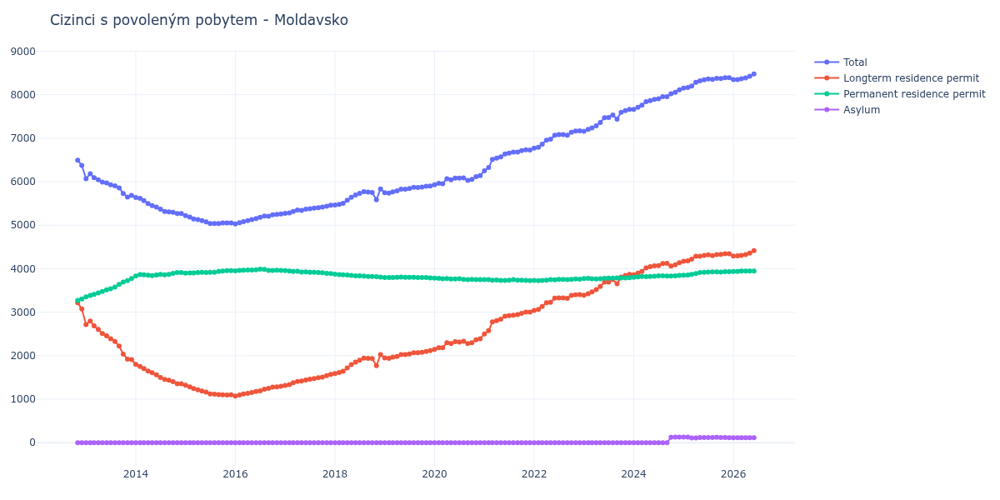

# Moldavsko

## Souhrnné statistiky (Min/Max pro rok) / Summary Statistics (Min/Max per year)

| Year   | Total         | Longterm Residence Permit   | Permanent Residence Permit   | Asylum    |
|--------|---------------|-----------------------------|------------------------------|-----------|
| 2012   | 6 376 / 6 494 | 3 073 / 3 221               | 3 273 / 3 303                | 0 / 0     |
| 2013   | 5 649 / 6 184 | 1 910 / 2 798               | 3 351 / 3 774                | 0 / 0     |
| 2014   | 5 267 / 5 637 | 1 354 / 1 803               | 3 834 / 3 913                | 0 / 0     |
| 2015   | 5 037 / 5 223 | 1 095 / 1 322               | 3 901 / 3 956                | 0 / 0     |
| 2016   | 5 028 / 5 260 | 1 075 / 1 299               | 3 953 / 3 988                | 0 / 0     |
| 2017   | 5 272 / 5 459 | 1 316 / 1 569               | 3 890 / 3 956                | 0 / 0     |
| 2018   | 5 466 / 5 833 | 1 592 / 2 025               | 3 808 / 3 874                | 0 / 0     |
| 2019   | 5 737 / 5 903 | 1 941 / 2 116               | 3 787 / 3 807                | 0 / 0     |
| 2020   | 5 930 / 6 140 | 2 144 / 2 391               | 3 749 / 3 786                | 0 / 0     |
| 2021   | 6 252 / 6 734 | 2 502 / 3 003               | 3 727 / 3 750                | 0 / 0     |
| 2022   | 6 773 / 7 169 | 3 042 / 3 407               | 3 725 / 3 764                | 0 / 0     |
| 2023   | 7 163 / 7 662 | 3 390 / 3 868               | 3 767 / 3 794                | 0 / 0     |
| 2024   | 7 662 / 8 114 | 3 859 / 4 140               | 3 803 / 3 846                | 0 / 128   |
| 2025   | 8 151 / 8 393 | 4 170 / 4 344               | 3 851 / 3 931                | 109 / 130 |
| 2026   | 8 347 / 8 478 | 4 292 / 4 415               | 3 938 / 3 948                | 113 / 116 |

## Detailní tabulka / Detailed Data Table

| Date     | Total          | Longterm Residence Permit   | Permanent Residence Permit   | Asylum        |
|----------|----------------|-----------------------------|------------------------------|---------------|
| **2012** |                |                             |                              |               |
| 11.2012  | 6 494          | 3 221                       | 3 273                        | 0             |
| 12.2012  | 6 376 (-1.82%) | 3 073 (-4.59%)              | 3 303 (+0.92%)               | 0             |
| **2013** |                |                             |                              |               |
| 01.2013  | 6 069 (-4.81%) | 2 718 (-11.55%)             | 3 351 (+1.45%)               | 0             |
| 02.2013  | 6 184 (+1.89%) | 2 798 (+2.94%)              | 3 386 (+1.04%)               | 0             |
| 03.2013  | 6 094 (-1.46%) | 2 686 (-4.00%)              | 3 408 (+0.65%)               | 0             |
| 04.2013  | 6 047 (-0.77%) | 2 604 (-3.05%)              | 3 443 (+1.03%)               | 0             |
| 05.2013  | 5 990 (-0.94%) | 2 511 (-3.57%)              | 3 479 (+1.05%)               | 0             |
| 06.2013  | 5 974 (-0.27%) | 2 459 (-2.07%)              | 3 515 (+1.03%)               | 0             |
| 07.2013  | 5 932 (-0.70%) | 2 390 (-2.81%)              | 3 542 (+0.77%)               | 0             |
| 08.2013  | 5 906 (-0.44%) | 2 326 (-2.68%)              | 3 580 (+1.07%)               | 0             |
| 09.2013  | 5 860 (-0.78%) | 2 222 (-4.47%)              | 3 638 (+1.62%)               | 0             |
| 10.2013  | 5 730 (-2.22%) | 2 036 (-8.37%)              | 3 694 (+1.54%)               | 0             |
| 11.2013  | 5 649 (-1.41%) | 1 922 (-5.60%)              | 3 727 (+0.89%)               | 0             |
| 12.2013  | 5 684 (+0.62%) | 1 910 (-0.62%)              | 3 774 (+1.26%)               | 0             |
| **2014** |                |                             |                              |               |
| 01.2014  | 5 637 (-0.83%) | 1 803 (-5.60%)              | 3 834 (+1.59%)               | 0             |
| 02.2014  | 5 620 (-0.30%) | 1 755 (-2.66%)              | 3 865 (+0.81%)               | 0             |
| 03.2014  | 5 564 (-1.00%) | 1 705 (-2.85%)              | 3 859 (-0.16%)               | 0             |
| 04.2014  | 5 498 (-1.19%) | 1 647 (-3.40%)              | 3 851 (-0.21%)               | 0             |
| 05.2014  | 5 450 (-0.87%) | 1 610 (-2.25%)              | 3 840 (-0.29%)               | 0             |
| 06.2014  | 5 415 (-0.64%) | 1 560 (-3.11%)              | 3 855 (+0.39%)               | 0             |
| 07.2014  | 5 368 (-0.87%) | 1 497 (-4.04%)              | 3 871 (+0.42%)               | 0             |
| 08.2014  | 5 317 (-0.95%) | 1 458 (-2.61%)              | 3 859 (-0.31%)               | 0             |
| 09.2014  | 5 306 (-0.21%) | 1 435 (-1.58%)              | 3 871 (+0.31%)               | 0             |
| 10.2014  | 5 298 (-0.15%) | 1 405 (-2.09%)              | 3 893 (+0.57%)               | 0             |
| 11.2014  | 5 268 (-0.57%) | 1 357 (-3.42%)              | 3 911 (+0.46%)               | 0             |
| 12.2014  | 5 267 (-0.02%) | 1 354 (-0.22%)              | 3 913 (+0.05%)               | 0             |
| **2015** |                |                             |                              |               |
| 01.2015  | 5 223 (-0.84%) | 1 322 (-2.36%)              | 3 901 (-0.31%)               | 0             |
| 02.2015  | 5 186 (-0.71%) | 1 282 (-3.03%)              | 3 904 (+0.08%)               | 0             |
| 03.2015  | 5 145 (-0.79%) | 1 243 (-3.04%)              | 3 902 (-0.05%)               | 0             |
| 04.2015  | 5 129 (-0.31%) | 1 217 (-2.09%)              | 3 912 (+0.26%)               | 0             |
| 05.2015  | 5 108 (-0.41%) | 1 189 (-2.30%)              | 3 919 (+0.18%)               | 0             |
| 06.2015  | 5 076 (-0.63%) | 1 165 (-2.02%)              | 3 911 (-0.20%)               | 0             |
| 07.2015  | 5 039 (-0.73%) | 1 122 (-3.69%)              | 3 917 (+0.15%)               | 0             |
| 08.2015  | 5 037 (-0.04%) | 1 118 (-0.36%)              | 3 919 (+0.05%)               | 0             |
| 09.2015  | 5 041 (+0.08%) | 1 105 (-1.16%)              | 3 936 (+0.43%)               | 0             |
| 10.2015  | 5 053 (+0.24%) | 1 104 (-0.09%)              | 3 949 (+0.33%)               | 0             |
| 11.2015  | 5 051 (-0.04%) | 1 095 (-0.82%)              | 3 956 (+0.18%)               | 0             |
| 12.2015  | 5 055 (+0.08%) | 1 100 (+0.46%)              | 3 955 (-0.03%)               | 0             |
| **2016** |                |                             |                              |               |
| 01.2016  | 5 028 (-0.53%) | 1 075 (-2.27%)              | 3 953 (-0.05%)               | 0             |
| 02.2016  | 5 057 (+0.58%) | 1 098 (+2.14%)              | 3 959 (+0.15%)               | 0             |
| 03.2016  | 5 084 (+0.53%) | 1 119 (+1.91%)              | 3 965 (+0.15%)               | 0             |
| 04.2016  | 5 106 (+0.43%) | 1 136 (+1.52%)              | 3 970 (+0.13%)               | 0             |
| 05.2016  | 5 129 (+0.45%) | 1 156 (+1.76%)              | 3 973 (+0.08%)               | 0             |
| 06.2016  | 5 155 (+0.51%) | 1 180 (+2.08%)              | 3 975 (+0.05%)               | 0             |
| 07.2016  | 5 182 (+0.52%) | 1 194 (+1.19%)              | 3 988 (+0.33%)               | 0             |
| 08.2016  | 5 212 (+0.58%) | 1 229 (+2.93%)              | 3 983 (-0.13%)               | 0             |
| 09.2016  | 5 208 (-0.08%) | 1 248 (+1.55%)              | 3 960 (-0.58%)               | 0             |
| 10.2016  | 5 240 (+0.61%) | 1 279 (+2.48%)              | 3 961 (+0.03%)               | 0             |
| 11.2016  | 5 250 (+0.19%) | 1 285 (+0.47%)              | 3 965 (+0.10%)               | 0             |
| 12.2016  | 5 260 (+0.19%) | 1 299 (+1.09%)              | 3 961 (-0.10%)               | 0             |
| **2017** |                |                             |                              |               |
| 01.2017  | 5 272 (+0.23%) | 1 316 (+1.31%)              | 3 956 (-0.13%)               | 0             |
| 02.2017  | 5 283 (+0.21%) | 1 338 (+1.67%)              | 3 945 (-0.28%)               | 0             |
| 03.2017  | 5 317 (+0.64%) | 1 378 (+2.99%)              | 3 939 (-0.15%)               | 0             |
| 04.2017  | 5 350 (+0.62%) | 1 408 (+2.18%)              | 3 942 (+0.08%)               | 0             |
| 05.2017  | 5 342 (-0.15%) | 1 419 (+0.78%)              | 3 923 (-0.48%)               | 0             |
| 06.2017  | 5 368 (+0.49%) | 1 440 (+1.48%)              | 3 928 (+0.13%)               | 0             |
| 07.2017  | 5 381 (+0.24%) | 1 461 (+1.46%)              | 3 920 (-0.20%)               | 0             |
| 08.2017  | 5 395 (+0.26%) | 1 475 (+0.96%)              | 3 920 (+0.00%)               | 0             |
| 09.2017  | 5 404 (+0.17%) | 1 493 (+1.22%)              | 3 911 (-0.23%)               | 0             |
| 10.2017  | 5 419 (+0.28%) | 1 511 (+1.21%)              | 3 908 (-0.08%)               | 0             |
| 11.2017  | 5 436 (+0.31%) | 1 543 (+2.12%)              | 3 893 (-0.38%)               | 0             |
| 12.2017  | 5 459 (+0.42%) | 1 569 (+1.69%)              | 3 890 (-0.08%)               | 0             |
| **2018** |                |                             |                              |               |
| 01.2018  | 5 466 (+0.13%) | 1 592 (+1.47%)              | 3 874 (-0.41%)               | 0             |
| 02.2018  | 5 478 (+0.22%) | 1 614 (+1.38%)              | 3 864 (-0.26%)               | 0             |
| 03.2018  | 5 502 (+0.44%) | 1 642 (+1.73%)              | 3 860 (-0.10%)               | 0             |
| 04.2018  | 5 576 (+1.34%) | 1 718 (+4.63%)              | 3 858 (-0.05%)               | 0             |
| 05.2018  | 5 641 (+1.17%) | 1 797 (+4.60%)              | 3 844 (-0.36%)               | 0             |
| 06.2018  | 5 695 (+0.96%) | 1 856 (+3.28%)              | 3 839 (-0.13%)               | 0             |
| 07.2018  | 5 735 (+0.70%) | 1 898 (+2.26%)              | 3 837 (-0.05%)               | 0             |
| 08.2018  | 5 774 (+0.68%) | 1 944 (+2.42%)              | 3 830 (-0.18%)               | 0             |
| 09.2018  | 5 763 (-0.19%) | 1 941 (-0.15%)              | 3 822 (-0.21%)               | 0             |
| 10.2018  | 5 754 (-0.16%) | 1 933 (-0.41%)              | 3 821 (-0.03%)               | 0             |
| 11.2018  | 5 586 (-2.92%) | 1 770 (-8.43%)              | 3 816 (-0.13%)               | 0             |
| 12.2018  | 5 833 (+4.42%) | 2 025 (+14.41%)             | 3 808 (-0.21%)               | 0             |
| **2019** |                |                             |                              |               |
| 01.2019  | 5 747 (-1.47%) | 1 948 (-3.80%)              | 3 799 (-0.24%)               | 0             |
| 02.2019  | 5 737 (-0.17%) | 1 941 (-0.36%)              | 3 796 (-0.08%)               | 0             |
| 03.2019  | 5 766 (+0.51%) | 1 970 (+1.49%)              | 3 796 (+0.00%)               | 0             |
| 04.2019  | 5 789 (+0.40%) | 1 985 (+0.76%)              | 3 804 (+0.21%)               | 0             |
| 05.2019  | 5 831 (+0.73%) | 2 024 (+1.96%)              | 3 807 (+0.08%)               | 0             |
| 06.2019  | 5 829 (-0.03%) | 2 025 (+0.05%)              | 3 804 (-0.08%)               | 0             |
| 07.2019  | 5 844 (+0.26%) | 2 042 (+0.84%)              | 3 802 (-0.05%)               | 0             |
| 08.2019  | 5 872 (+0.48%) | 2 069 (+1.32%)              | 3 803 (+0.03%)               | 0             |
| 09.2019  | 5 869 (-0.05%) | 2 069 (+0.00%)              | 3 800 (-0.08%)               | 0             |
| 10.2019  | 5 877 (+0.14%) | 2 078 (+0.43%)              | 3 799 (-0.03%)               | 0             |
| 11.2019  | 5 897 (+0.34%) | 2 098 (+0.96%)              | 3 799 (+0.00%)               | 0             |
| 12.2019  | 5 903 (+0.10%) | 2 116 (+0.86%)              | 3 787 (-0.32%)               | 0             |
| **2020** |                |                             |                              |               |
| 01.2020  | 5 930 (+0.46%) | 2 144 (+1.32%)              | 3 786 (-0.03%)               | 0             |
| 02.2020  | 5 962 (+0.54%) | 2 185 (+1.91%)              | 3 777 (-0.24%)               | 0             |
| 03.2020  | 5 953 (-0.15%) | 2 184 (-0.05%)              | 3 769 (-0.21%)               | 0             |
| 04.2020  | 6 071 (+1.98%) | 2 298 (+5.22%)              | 3 773 (+0.11%)               | 0             |
| 05.2020  | 6 047 (-0.40%) | 2 281 (-0.74%)              | 3 766 (-0.19%)               | 0             |
| 06.2020  | 6 084 (+0.61%) | 2 321 (+1.75%)              | 3 763 (-0.08%)               | 0             |
| 07.2020  | 6 082 (-0.03%) | 2 313 (-0.34%)              | 3 769 (+0.16%)               | 0             |
| 08.2020  | 6 088 (+0.10%) | 2 331 (+0.78%)              | 3 757 (-0.32%)               | 0             |
| 09.2020  | 6 031 (-0.94%) | 2 279 (-2.23%)              | 3 752 (-0.13%)               | 0             |
| 10.2020  | 6 054 (+0.38%) | 2 299 (+0.88%)              | 3 755 (+0.08%)               | 0             |
| 11.2020  | 6 118 (+1.06%) | 2 367 (+2.96%)              | 3 751 (-0.11%)               | 0             |
| 12.2020  | 6 140 (+0.36%) | 2 391 (+1.01%)              | 3 749 (-0.05%)               | 0             |
| **2021** |                |                             |                              |               |
| 01.2021  | 6 252 (+1.82%) | 2 502 (+4.64%)              | 3 750 (+0.03%)               | 0             |
| 02.2021  | 6 325 (+1.17%) | 2 576 (+2.96%)              | 3 749 (-0.03%)               | 0             |
| 03.2021  | 6 513 (+2.97%) | 2 778 (+7.84%)              | 3 735 (-0.37%)               | 0             |
| 04.2021  | 6 545 (+0.49%) | 2 805 (+0.97%)              | 3 740 (+0.13%)               | 0             |
| 05.2021  | 6 571 (+0.40%) | 2 839 (+1.21%)              | 3 732 (-0.21%)               | 0             |
| 06.2021  | 6 638 (+1.02%) | 2 906 (+2.36%)              | 3 732 (+0.00%)               | 0             |
| 07.2021  | 6 656 (+0.27%) | 2 920 (+0.48%)              | 3 736 (+0.11%)               | 0             |
| 08.2021  | 6 682 (+0.39%) | 2 932 (+0.41%)              | 3 750 (+0.37%)               | 0             |
| 09.2021  | 6 684 (+0.03%) | 2 947 (+0.51%)              | 3 737 (-0.35%)               | 0             |
| 10.2021  | 6 713 (+0.43%) | 2 975 (+0.95%)              | 3 738 (+0.03%)               | 0             |
| 11.2021  | 6 734 (+0.31%) | 3 003 (+0.94%)              | 3 731 (-0.19%)               | 0             |
| 12.2021  | 6 728 (-0.09%) | 3 001 (-0.07%)              | 3 727 (-0.11%)               | 0             |
| **2022** |                |                             |                              |               |
| 01.2022  | 6 773 (+0.67%) | 3 042 (+1.37%)              | 3 731 (+0.11%)               | 0             |
| 02.2022  | 6 792 (+0.28%) | 3 067 (+0.82%)              | 3 725 (-0.16%)               | 0             |
| 03.2022  | 6 864 (+1.06%) | 3 133 (+2.15%)              | 3 731 (+0.16%)               | 0             |
| 04.2022  | 6 954 (+1.31%) | 3 217 (+2.68%)              | 3 737 (+0.16%)               | 0             |
| 05.2022  | 6 977 (+0.33%) | 3 227 (+0.31%)              | 3 750 (+0.35%)               | 0             |
| 06.2022  | 7 070 (+1.33%) | 3 323 (+2.97%)              | 3 747 (-0.08%)               | 0             |
| 07.2022  | 7 083 (+0.18%) | 3 330 (+0.21%)              | 3 753 (+0.16%)               | 0             |
| 08.2022  | 7 083 (+0.00%) | 3 328 (-0.06%)              | 3 755 (+0.05%)               | 0             |
| 09.2022  | 7 071 (-0.17%) | 3 320 (-0.24%)              | 3 751 (-0.11%)               | 0             |
| 10.2022  | 7 139 (+0.96%) | 3 385 (+1.96%)              | 3 754 (+0.08%)               | 0             |
| 11.2022  | 7 165 (+0.36%) | 3 401 (+0.47%)              | 3 764 (+0.27%)               | 0             |
| 12.2022  | 7 169 (+0.06%) | 3 407 (+0.18%)              | 3 762 (-0.05%)               | 0             |
| **2023** |                |                             |                              |               |
| 01.2023  | 7 163 (-0.08%) | 3 390 (-0.50%)              | 3 773 (+0.29%)               | 0             |
| 02.2023  | 7 202 (+0.54%) | 3 425 (+1.03%)              | 3 777 (+0.11%)               | 0             |
| 03.2023  | 7 238 (+0.50%) | 3 467 (+1.23%)              | 3 771 (-0.16%)               | 0             |
| 04.2023  | 7 287 (+0.68%) | 3 520 (+1.53%)              | 3 767 (-0.11%)               | 0             |
| 05.2023  | 7 362 (+1.03%) | 3 592 (+2.05%)              | 3 770 (+0.08%)               | 0             |
| 06.2023  | 7 471 (+1.48%) | 3 693 (+2.81%)              | 3 778 (+0.21%)               | 0             |
| 07.2023  | 7 479 (+0.11%) | 3 695 (+0.05%)              | 3 784 (+0.16%)               | 0             |
| 08.2023  | 7 535 (+0.75%) | 3 751 (+1.52%)              | 3 784 (+0.00%)               | 0             |
| 09.2023  | 7 441 (-1.25%) | 3 654 (-2.59%)              | 3 787 (+0.08%)               | 0             |
| 10.2023  | 7 599 (+2.12%) | 3 809 (+4.24%)              | 3 790 (+0.08%)               | 0             |
| 11.2023  | 7 636 (+0.49%) | 3 847 (+1.00%)              | 3 789 (-0.03%)               | 0             |
| 12.2023  | 7 662 (+0.34%) | 3 868 (+0.55%)              | 3 794 (+0.13%)               | 0             |
| **2024** |                |                             |                              |               |
| 01.2024  | 7 662 (+0.00%) | 3 859 (-0.23%)              | 3 803 (+0.24%)               | 0             |
| 02.2024  | 7 712 (+0.65%) | 3 900 (+1.06%)              | 3 812 (+0.24%)               | 0             |
| 03.2024  | 7 759 (+0.61%) | 3 938 (+0.97%)              | 3 821 (+0.24%)               | 0             |
| 04.2024  | 7 840 (+1.04%) | 4 021 (+2.11%)              | 3 819 (-0.05%)               | 0             |
| 05.2024  | 7 867 (+0.34%) | 4 047 (+0.65%)              | 3 820 (+0.03%)               | 0             |
| 06.2024  | 7 894 (+0.34%) | 4 066 (+0.47%)              | 3 828 (+0.21%)               | 0             |
| 07.2024  | 7 910 (+0.20%) | 4 073 (+0.17%)              | 3 837 (+0.24%)               | 0             |
| 08.2024  | 7 955 (+0.57%) | 4 117 (+1.08%)              | 3 838 (+0.03%)               | 0             |
| 09.2024  | 7 955 (+0.00%) | 4 124 (+0.17%)              | 3 831 (-0.18%)               | 0             |
| 10.2024  | 8 021 (+0.83%) | 4 064 (-1.45%)              | 3 831 (+0.00%)               | 126           |
| 11.2024  | 8 058 (+0.46%) | 4 092 (+0.69%)              | 3 839 (+0.21%)               | 127 (+0.79%)  |
| 12.2024  | 8 114 (+0.69%) | 4 140 (+1.17%)              | 3 846 (+0.18%)               | 128 (+0.79%)  |
| **2025** |                |                             |                              |               |
| 01.2025  | 8 151 (+0.46%) | 4 170 (+0.72%)              | 3 851 (+0.13%)               | 130 (+1.56%)  |
| 02.2025  | 8 167 (+0.20%) | 4 182 (+0.29%)              | 3 855 (+0.10%)               | 130 (+0.00%)  |
| 03.2025  | 8 202 (+0.43%) | 4 222 (+0.96%)              | 3 871 (+0.42%)               | 109 (-16.15%) |
| 04.2025  | 8 288 (+1.05%) | 4 289 (+1.59%)              | 3 887 (+0.41%)               | 112 (+2.75%)  |
| 05.2025  | 8 320 (+0.39%) | 4 288 (-0.02%)              | 3 914 (+0.69%)               | 118 (+5.36%)  |
| 06.2025  | 8 342 (+0.26%) | 4 304 (+0.37%)              | 3 919 (+0.13%)               | 119 (+0.85%)  |
| 07.2025  | 8 361 (+0.23%) | 4 319 (+0.35%)              | 3 922 (+0.08%)               | 120 (+0.84%)  |
| 08.2025  | 8 355 (-0.07%) | 4 303 (-0.37%)              | 3 930 (+0.20%)               | 122 (+1.67%)  |
| 09.2025  | 8 378 (+0.28%) | 4 326 (+0.53%)              | 3 929 (-0.03%)               | 123 (+0.82%)  |
| 10.2025  | 8 375 (-0.04%) | 4 330 (+0.09%)              | 3 923 (-0.15%)               | 122 (-0.81%)  |
| 11.2025  | 8 393 (+0.21%) | 4 342 (+0.28%)              | 3 931 (+0.20%)               | 120 (-1.64%)  |
| 12.2025  | 8 391 (-0.02%) | 4 344 (+0.05%)              | 3 931 (+0.00%)               | 116 (-3.33%)  |
| **2026** |                |                             |                              |               |
| 01.2026  | 8 347 (-0.52%) | 4 292 (-1.20%)              | 3 939 (+0.20%)               | 116 (+0.00%)  |
| 02.2026  | 8 350 (+0.04%) | 4 296 (+0.09%)              | 3 938 (-0.03%)               | 116 (+0.00%)  |
| 03.2026  | 8 366 (+0.19%) | 4 308 (+0.28%)              | 3 945 (+0.18%)               | 113 (-2.59%)  |
| 04.2026  | 8 389 (+0.27%) | 4 327 (+0.44%)              | 3 948 (+0.08%)               | 114 (+0.88%)  |
| 05.2026  | 8 424 (+0.42%) | 4 361 (+0.79%)              | 3 947 (-0.03%)               | 116 (+1.75%)  |
| 06.2026  | 8 478 (+0.64%) | 4 415 (+1.24%)              | 3 948 (+0.03%)               | 115 (-0.86%)  |
