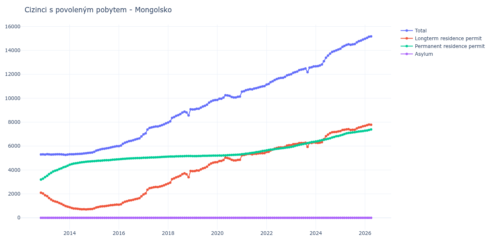

# Mongolsko

## Souhrnné statistiky (Min/Max pro rok) / Summary Statistics (Min/Max per year)

| Year   | Total           | Longterm Residence Permit   | Permanent Residence Permit   | Asylum   |
|--------|-----------------|-----------------------------|------------------------------|----------|
| 2012   | 5 299 / 5 307   | 2 034 / 2 102               | 3 197 / 3 273                | 0 / 0    |
| 2013   | 5 267 / 5 326   | 938 / 1 887                 | 3 405 / 4 351                | 0 / 0    |
| 2014   | 5 311 / 5 464   | 707 / 880                   | 4 436 / 4 728                | 0 / 0    |
| 2015   | 5 524 / 5 990   | 788 / 1 106                 | 4 736 / 4 884                | 0 / 0    |
| 2016   | 5 993 / 6 804   | 1 101 / 1 797               | 4 892 / 5 007                | 0 / 0    |
| 2017   | 6 976 / 7 900   | 1 956 / 2 794               | 5 020 / 5 106                | 0 / 0    |
| 2018   | 7 974 / 9 081   | 2 860 / 3 914               | 5 114 / 5 169                | 0 / 0    |
| 2019   | 9 062 / 9 851   | 3 898 / 4 649               | 5 163 / 5 202                | 0 / 0    |
| 2020   | 9 858 / 10 256  | 4 651 / 5 033               | 5 206 / 5 293                | 0 / 0    |
| 2021   | 10 554 / 11 016 | 5 232 / 5 413               | 5 322 / 5 603                | 0 / 0    |
| 2022   | 11 144 / 11 968 | 5 500 / 6 074               | 5 644 / 5 894                | 0 / 0    |
| 2023   | 12 005 / 12 664 | 5 934 / 6 311               | 5 928 / 6 353                | 0 / 0    |
| 2024   | 12 666 / 14 072 | 6 267 / 7 228               | 6 383 / 6 843                | 0 / 1    |
| 2025   | 14 146 / 14 908 | 7 253 / 7 653               | 6 892 / 7 254                | 1 / 1    |

## Detailní tabulka / Detailed Data Table

| Date     | Total           | Longterm Residence Permit   | Permanent Residence Permit   | Asylum     |
|----------|-----------------|-----------------------------|------------------------------|------------|
| **2012** |                 |                             |                              |            |
| 11.2012  | 5 299           | 2 102                       | 3 197                        | 0          |
| 12.2012  | 5 307 (+0.15%)  | 2 034 (-3.24%)              | 3 273 (+2.38%)               | 0          |
| **2013** |                 |                             |                              |            |
| 01.2013  | 5 292 (-0.28%)  | 1 887 (-7.23%)              | 3 405 (+4.03%)               | 0          |
| 02.2013  | 5 326 (+0.64%)  | 1 810 (-4.08%)              | 3 516 (+3.26%)               | 0          |
| 03.2013  | 5 308 (-0.34%)  | 1 657 (-8.45%)              | 3 651 (+3.84%)               | 0          |
| 04.2013  | 5 292 (-0.30%)  | 1 530 (-7.66%)              | 3 762 (+3.04%)               | 0          |
| 05.2013  | 5 299 (+0.13%)  | 1 426 (-6.80%)              | 3 873 (+2.95%)               | 0          |
| 06.2013  | 5 303 (+0.08%)  | 1 362 (-4.49%)              | 3 941 (+1.76%)               | 0          |
| 07.2013  | 5 315 (+0.23%)  | 1 317 (-3.30%)              | 3 998 (+1.45%)               | 0          |
| 08.2013  | 5 311 (-0.08%)  | 1 234 (-6.30%)              | 4 077 (+1.98%)               | 0          |
| 09.2013  | 5 308 (-0.06%)  | 1 169 (-5.27%)              | 4 139 (+1.52%)               | 0          |
| 10.2013  | 5 290 (-0.34%)  | 1 068 (-8.64%)              | 4 222 (+2.01%)               | 0          |
| 11.2013  | 5 267 (-0.43%)  | 987 (-7.58%)                | 4 280 (+1.37%)               | 0          |
| 12.2013  | 5 289 (+0.42%)  | 938 (-4.96%)                | 4 351 (+1.66%)               | 0          |
| **2014** |                 |                             |                              |            |
| 01.2014  | 5 316 (+0.51%)  | 880 (-6.18%)                | 4 436 (+1.95%)               | 0          |
| 02.2014  | 5 311 (-0.09%)  | 822 (-6.59%)                | 4 489 (+1.19%)               | 0          |
| 03.2014  | 5 315 (+0.08%)  | 783 (-4.74%)                | 4 532 (+0.96%)               | 0          |
| 04.2014  | 5 334 (+0.36%)  | 775 (-1.02%)                | 4 559 (+0.60%)               | 0          |
| 05.2014  | 5 343 (+0.17%)  | 757 (-2.32%)                | 4 586 (+0.59%)               | 0          |
| 06.2014  | 5 350 (+0.13%)  | 728 (-3.83%)                | 4 622 (+0.78%)               | 0          |
| 07.2014  | 5 360 (+0.19%)  | 712 (-2.20%)                | 4 648 (+0.56%)               | 0          |
| 08.2014  | 5 381 (+0.39%)  | 722 (+1.40%)                | 4 659 (+0.24%)               | 0          |
| 09.2014  | 5 397 (+0.30%)  | 707 (-2.08%)                | 4 690 (+0.67%)               | 0          |
| 10.2014  | 5 427 (+0.56%)  | 720 (+1.84%)                | 4 707 (+0.36%)               | 0          |
| 11.2014  | 5 445 (+0.33%)  | 729 (+1.25%)                | 4 716 (+0.19%)               | 0          |
| 12.2014  | 5 464 (+0.35%)  | 736 (+0.96%)                | 4 728 (+0.25%)               | 0          |
| **2015** |                 |                             |                              |            |
| 01.2015  | 5 524 (+1.10%)  | 788 (+7.07%)                | 4 736 (+0.17%)               | 0          |
| 02.2015  | 5 619 (+1.72%)  | 863 (+9.52%)                | 4 756 (+0.42%)               | 0          |
| 03.2015  | 5 669 (+0.89%)  | 897 (+3.94%)                | 4 772 (+0.34%)               | 0          |
| 04.2015  | 5 718 (+0.86%)  | 942 (+5.02%)                | 4 776 (+0.08%)               | 0          |
| 05.2015  | 5 759 (+0.72%)  | 964 (+2.34%)                | 4 795 (+0.40%)               | 0          |
| 06.2015  | 5 780 (+0.36%)  | 972 (+0.83%)                | 4 808 (+0.27%)               | 0          |
| 07.2015  | 5 813 (+0.57%)  | 996 (+2.47%)                | 4 817 (+0.19%)               | 0          |
| 08.2015  | 5 837 (+0.41%)  | 1 019 (+2.31%)              | 4 818 (+0.02%)               | 0          |
| 09.2015  | 5 884 (+0.81%)  | 1 052 (+3.24%)              | 4 832 (+0.29%)               | 0          |
| 10.2015  | 5 921 (+0.63%)  | 1 063 (+1.05%)              | 4 858 (+0.54%)               | 0          |
| 11.2015  | 5 960 (+0.66%)  | 1 088 (+2.35%)              | 4 872 (+0.29%)               | 0          |
| 12.2015  | 5 990 (+0.50%)  | 1 106 (+1.65%)              | 4 884 (+0.25%)               | 0          |
| **2016** |                 |                             |                              |            |
| 01.2016  | 5 993 (+0.05%)  | 1 101 (-0.45%)              | 4 892 (+0.16%)               | 0          |
| 02.2016  | 6 042 (+0.82%)  | 1 130 (+2.63%)              | 4 912 (+0.41%)               | 0          |
| 03.2016  | 6 189 (+2.43%)  | 1 259 (+11.42%)             | 4 930 (+0.37%)               | 0          |
| 04.2016  | 6 279 (+1.45%)  | 1 343 (+6.67%)              | 4 936 (+0.12%)               | 0          |
| 05.2016  | 6 344 (+1.04%)  | 1 391 (+3.57%)              | 4 953 (+0.34%)               | 0          |
| 06.2016  | 6 412 (+1.07%)  | 1 452 (+4.39%)              | 4 960 (+0.14%)               | 0          |
| 07.2016  | 6 440 (+0.44%)  | 1 470 (+1.24%)              | 4 970 (+0.20%)               | 0          |
| 08.2016  | 6 487 (+0.73%)  | 1 507 (+2.52%)              | 4 980 (+0.20%)               | 0          |
| 09.2016  | 6 548 (+0.94%)  | 1 557 (+3.32%)              | 4 991 (+0.22%)               | 0          |
| 10.2016  | 6 598 (+0.76%)  | 1 598 (+2.63%)              | 5 000 (+0.18%)               | 0          |
| 11.2016  | 6 643 (+0.68%)  | 1 642 (+2.75%)              | 5 001 (+0.02%)               | 0          |
| 12.2016  | 6 804 (+2.42%)  | 1 797 (+9.44%)              | 5 007 (+0.12%)               | 0          |
| **2017** |                 |                             |                              |            |
| 01.2017  | 6 976 (+2.53%)  | 1 956 (+8.85%)              | 5 020 (+0.26%)               | 0          |
| 02.2017  | 7 064 (+1.26%)  | 2 042 (+4.40%)              | 5 022 (+0.04%)               | 0          |
| 03.2017  | 7 384 (+4.53%)  | 2 352 (+15.18%)             | 5 032 (+0.20%)               | 0          |
| 04.2017  | 7 521 (+1.86%)  | 2 480 (+5.44%)              | 5 041 (+0.18%)               | 0          |
| 05.2017  | 7 557 (+0.48%)  | 2 512 (+1.29%)              | 5 045 (+0.08%)               | 0          |
| 06.2017  | 7 605 (+0.64%)  | 2 553 (+1.63%)              | 5 052 (+0.14%)               | 0          |
| 07.2017  | 7 636 (+0.41%)  | 2 576 (+0.90%)              | 5 060 (+0.16%)               | 0          |
| 08.2017  | 7 638 (+0.03%)  | 2 570 (-0.23%)              | 5 068 (+0.16%)               | 0          |
| 09.2017  | 7 689 (+0.67%)  | 2 612 (+1.63%)              | 5 077 (+0.18%)               | 0          |
| 10.2017  | 7 746 (+0.74%)  | 2 658 (+1.76%)              | 5 088 (+0.22%)               | 0          |
| 11.2017  | 7 814 (+0.88%)  | 2 715 (+2.14%)              | 5 099 (+0.22%)               | 0          |
| 12.2017  | 7 900 (+1.10%)  | 2 794 (+2.91%)              | 5 106 (+0.14%)               | 0          |
| **2018** |                 |                             |                              |            |
| 01.2018  | 7 974 (+0.94%)  | 2 860 (+2.36%)              | 5 114 (+0.16%)               | 0          |
| 02.2018  | 8 069 (+1.19%)  | 2 943 (+2.90%)              | 5 126 (+0.23%)               | 0          |
| 03.2018  | 8 357 (+3.57%)  | 3 233 (+9.85%)              | 5 124 (-0.04%)               | 0          |
| 04.2018  | 8 423 (+0.79%)  | 3 296 (+1.95%)              | 5 127 (+0.06%)               | 0          |
| 05.2018  | 8 532 (+1.29%)  | 3 390 (+2.85%)              | 5 142 (+0.29%)               | 0          |
| 06.2018  | 8 592 (+0.70%)  | 3 445 (+1.62%)              | 5 147 (+0.10%)               | 0          |
| 07.2018  | 8 677 (+0.99%)  | 3 522 (+2.24%)              | 5 155 (+0.16%)               | 0          |
| 08.2018  | 8 805 (+1.48%)  | 3 650 (+3.63%)              | 5 155 (+0.00%)               | 0          |
| 09.2018  | 8 880 (+0.85%)  | 3 718 (+1.86%)              | 5 162 (+0.14%)               | 0          |
| 10.2018  | 8 813 (-0.75%)  | 3 644 (-1.99%)              | 5 169 (+0.14%)               | 0          |
| 11.2018  | 8 559 (-2.88%)  | 3 393 (-6.89%)              | 5 166 (-0.06%)               | 0          |
| 12.2018  | 9 081 (+6.10%)  | 3 914 (+15.36%)             | 5 167 (+0.02%)               | 0          |
| **2019** |                 |                             |                              |            |
| 01.2019  | 9 062 (-0.21%)  | 3 898 (-0.41%)              | 5 164 (-0.06%)               | 0          |
| 02.2019  | 9 068 (+0.07%)  | 3 905 (+0.18%)              | 5 163 (-0.02%)               | 0          |
| 03.2019  | 9 120 (+0.57%)  | 3 957 (+1.33%)              | 5 163 (+0.00%)               | 0          |
| 04.2019  | 9 118 (-0.02%)  | 3 949 (-0.20%)              | 5 169 (+0.12%)               | 0          |
| 05.2019  | 9 215 (+1.06%)  | 4 042 (+2.36%)              | 5 173 (+0.08%)               | 0          |
| 06.2019  | 9 311 (+1.04%)  | 4 129 (+2.15%)              | 5 182 (+0.17%)               | 0          |
| 07.2019  | 9 369 (+0.62%)  | 4 181 (+1.26%)              | 5 188 (+0.12%)               | 0          |
| 08.2019  | 9 467 (+1.05%)  | 4 279 (+2.34%)              | 5 188 (+0.00%)               | 0          |
| 09.2019  | 9 633 (+1.75%)  | 4 440 (+3.76%)              | 5 193 (+0.10%)               | 0          |
| 10.2019  | 9 735 (+1.06%)  | 4 544 (+2.34%)              | 5 191 (-0.04%)               | 0          |
| 11.2019  | 9 811 (+0.78%)  | 4 610 (+1.45%)              | 5 201 (+0.19%)               | 0          |
| 12.2019  | 9 851 (+0.41%)  | 4 649 (+0.85%)              | 5 202 (+0.02%)               | 0          |
| **2020** |                 |                             |                              |            |
| 01.2020  | 9 858 (+0.07%)  | 4 651 (+0.04%)              | 5 207 (+0.10%)               | 0          |
| 02.2020  | 9 958 (+1.01%)  | 4 749 (+2.11%)              | 5 209 (+0.04%)               | 0          |
| 03.2020  | 9 963 (+0.05%)  | 4 757 (+0.17%)              | 5 206 (-0.06%)               | 0          |
| 04.2020  | 10 052 (+0.89%) | 4 833 (+1.60%)              | 5 219 (+0.25%)               | 0          |
| 05.2020  | 10 256 (+2.03%) | 5 033 (+4.14%)              | 5 223 (+0.08%)               | 0          |
| 06.2020  | 10 236 (-0.20%) | 4 999 (-0.68%)              | 5 237 (+0.27%)               | 0          |
| 07.2020  | 10 198 (-0.37%) | 4 949 (-1.00%)              | 5 249 (+0.23%)               | 0          |
| 08.2020  | 10 108 (-0.88%) | 4 851 (-1.98%)              | 5 257 (+0.15%)               | 0          |
| 09.2020  | 10 062 (-0.46%) | 4 799 (-1.07%)              | 5 263 (+0.11%)               | 0          |
| 10.2020  | 10 064 (+0.02%) | 4 796 (-0.06%)              | 5 268 (+0.10%)               | 0          |
| 11.2020  | 10 124 (+0.60%) | 4 843 (+0.98%)              | 5 281 (+0.25%)               | 0          |
| 12.2020  | 10 141 (+0.17%) | 4 848 (+0.10%)              | 5 293 (+0.23%)               | 0          |
| **2021** |                 |                             |                              |            |
| 01.2021  | 10 554 (+4.07%) | 5 232 (+7.92%)              | 5 322 (+0.55%)               | 0          |
| 02.2021  | 10 588 (+0.32%) | 5 257 (+0.48%)              | 5 331 (+0.17%)               | 0          |
| 03.2021  | 10 668 (+0.76%) | 5 300 (+0.82%)              | 5 368 (+0.69%)               | 0          |
| 04.2021  | 10 716 (+0.45%) | 5 344 (+0.83%)              | 5 372 (+0.07%)               | 0          |
| 05.2021  | 10 759 (+0.40%) | 5 351 (+0.13%)              | 5 408 (+0.67%)               | 0          |
| 06.2021  | 10 740 (-0.18%) | 5 309 (-0.78%)              | 5 431 (+0.43%)               | 0          |
| 07.2021  | 10 805 (+0.61%) | 5 354 (+0.85%)              | 5 451 (+0.37%)               | 0          |
| 08.2021  | 10 842 (+0.34%) | 5 350 (-0.07%)              | 5 492 (+0.75%)               | 0          |
| 09.2021  | 10 893 (+0.47%) | 5 380 (+0.56%)              | 5 513 (+0.38%)               | 0          |
| 10.2021  | 10 946 (+0.49%) | 5 404 (+0.45%)              | 5 542 (+0.53%)               | 0          |
| 11.2021  | 10 989 (+0.39%) | 5 399 (-0.09%)              | 5 590 (+0.87%)               | 0          |
| 12.2021  | 11 016 (+0.25%) | 5 413 (+0.26%)              | 5 603 (+0.23%)               | 0          |
| **2022** |                 |                             |                              |            |
| 01.2022  | 11 144 (+1.16%) | 5 500 (+1.61%)              | 5 644 (+0.73%)               | 0          |
| 02.2022  | 11 195 (+0.46%) | 5 524 (+0.44%)              | 5 671 (+0.48%)               | 0          |
| 03.2022  | 11 338 (+1.28%) | 5 635 (+2.01%)              | 5 703 (+0.56%)               | 0          |
| 04.2022  | 11 418 (+0.71%) | 5 706 (+1.26%)              | 5 712 (+0.16%)               | 0          |
| 05.2022  | 11 524 (+0.93%) | 5 783 (+1.35%)              | 5 741 (+0.51%)               | 0          |
| 06.2022  | 11 609 (+0.74%) | 5 839 (+0.97%)              | 5 770 (+0.51%)               | 0          |
| 07.2022  | 11 665 (+0.48%) | 5 879 (+0.69%)              | 5 786 (+0.28%)               | 0          |
| 08.2022  | 11 700 (+0.30%) | 5 885 (+0.10%)              | 5 815 (+0.50%)               | 0          |
| 09.2022  | 11 709 (+0.08%) | 5 883 (-0.03%)              | 5 826 (+0.19%)               | 0          |
| 10.2022  | 11 785 (+0.65%) | 5 930 (+0.80%)              | 5 855 (+0.50%)               | 0          |
| 11.2022  | 11 917 (+1.12%) | 6 041 (+1.87%)              | 5 876 (+0.36%)               | 0          |
| 12.2022  | 11 968 (+0.43%) | 6 074 (+0.55%)              | 5 894 (+0.31%)               | 0          |
| **2023** |                 |                             |                              |            |
| 01.2023  | 12 005 (+0.31%) | 6 077 (+0.05%)              | 5 928 (+0.58%)               | 0          |
| 02.2023  | 12 125 (+1.00%) | 6 156 (+1.30%)              | 5 969 (+0.69%)               | 0          |
| 03.2023  | 12 179 (+0.45%) | 6 161 (+0.08%)              | 6 018 (+0.82%)               | 0          |
| 04.2023  | 12 235 (+0.46%) | 6 177 (+0.26%)              | 6 058 (+0.66%)               | 0          |
| 05.2023  | 12 350 (+0.94%) | 6 251 (+1.20%)              | 6 099 (+0.68%)               | 0          |
| 06.2023  | 12 395 (+0.36%) | 6 261 (+0.16%)              | 6 134 (+0.57%)               | 0          |
| 07.2023  | 12 425 (+0.24%) | 6 252 (-0.14%)              | 6 173 (+0.64%)               | 0          |
| 08.2023  | 12 491 (+0.53%) | 6 281 (+0.46%)              | 6 210 (+0.60%)               | 0          |
| 09.2023  | 12 181 (-2.48%) | 5 934 (-5.52%)              | 6 247 (+0.60%)               | 0          |
| 10.2023  | 12 555 (+3.07%) | 6 271 (+5.68%)              | 6 284 (+0.59%)               | 0          |
| 11.2023  | 12 589 (+0.27%) | 6 257 (-0.22%)              | 6 332 (+0.76%)               | 0          |
| 12.2023  | 12 664 (+0.60%) | 6 311 (+0.86%)              | 6 353 (+0.33%)               | 0          |
| **2024** |                 |                             |                              |            |
| 01.2024  | 12 666 (+0.02%) | 6 283 (-0.44%)              | 6 383 (+0.47%)               | 0          |
| 02.2024  | 12 682 (+0.13%) | 6 267 (-0.25%)              | 6 415 (+0.50%)               | 0          |
| 03.2024  | 12 738 (+0.44%) | 6 286 (+0.30%)              | 6 452 (+0.58%)               | 0          |
| 04.2024  | 12 825 (+0.68%) | 6 329 (+0.68%)              | 6 496 (+0.68%)               | 0          |
| 05.2024  | 13 097 (+2.12%) | 6 572 (+3.84%)              | 6 525 (+0.45%)               | 0          |
| 06.2024  | 13 390 (+2.24%) | 6 822 (+3.80%)              | 6 568 (+0.66%)               | 0          |
| 07.2024  | 13 569 (+1.34%) | 6 957 (+1.98%)              | 6 612 (+0.67%)               | 0          |
| 08.2024  | 13 732 (+1.20%) | 7 081 (+1.78%)              | 6 651 (+0.59%)               | 0          |
| 09.2024  | 13 875 (+1.04%) | 7 154 (+1.03%)              | 6 721 (+1.05%)               | 0          |
| 10.2024  | 13 938 (+0.45%) | 7 174 (+0.28%)              | 6 763 (+0.62%)               | 1          |
| 11.2024  | 14 005 (+0.48%) | 7 182 (+0.11%)              | 6 822 (+0.87%)               | 1 (+0.00%) |
| 12.2024  | 14 072 (+0.48%) | 7 228 (+0.64%)              | 6 843 (+0.31%)               | 1 (+0.00%) |
| **2025** |                 |                             |                              |            |
| 01.2025  | 14 146 (+0.53%) | 7 253 (+0.35%)              | 6 892 (+0.72%)               | 1 (+0.00%) |
| 02.2025  | 14 296 (+1.06%) | 7 348 (+1.31%)              | 6 947 (+0.80%)               | 1 (+0.00%) |
| 03.2025  | 14 373 (+0.54%) | 7 367 (+0.26%)              | 7 005 (+0.83%)               | 1 (+0.00%) |
| 04.2025  | 14 464 (+0.63%) | 7 401 (+0.46%)              | 7 062 (+0.81%)               | 1 (+0.00%) |
| 05.2025  | 14 513 (+0.34%) | 7 416 (+0.20%)              | 7 096 (+0.48%)               | 1 (+0.00%) |
| 06.2025  | 14 465 (-0.33%) | 7 349 (-0.90%)              | 7 115 (+0.27%)               | 1 (+0.00%) |
| 07.2025  | 14 502 (+0.26%) | 7 360 (+0.15%)              | 7 141 (+0.37%)               | 1 (+0.00%) |
| 08.2025  | 14 525 (+0.16%) | 7 367 (+0.10%)              | 7 157 (+0.22%)               | 1 (+0.00%) |
| 09.2025  | 14 667 (+0.98%) | 7 473 (+1.44%)              | 7 193 (+0.50%)               | 1 (+0.00%) |
| 10.2025  | 14 771 (+0.71%) | 7 551 (+1.04%)              | 7 219 (+0.36%)               | 1 (+0.00%) |
| 11.2025  | 14 824 (+0.36%) | 7 588 (+0.49%)              | 7 235 (+0.22%)               | 1 (+0.00%) |
| 12.2025  | 14 908 (+0.57%) | 7 653 (+0.86%)              | 7 254 (+0.26%)               | 1 (+0.00%) |
