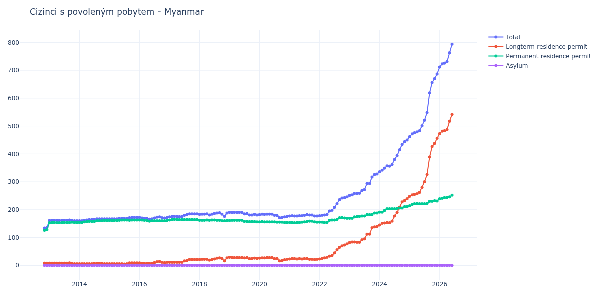

# Myanmar

## Souhrnné statistiky (Min/Max pro rok) / Summary Statistics (Min/Max per year)

| Year   | Total     | Longterm Residence Permit   | Permanent Residence Permit   | Asylum   |
|--------|-----------|-----------------------------|------------------------------|----------|
| 2012   | 134 / 136 | 8 / 8                       | 126 / 128                    | 0 / 0    |
| 2013   | 160 / 163 | 6 / 9                       | 153 / 155                    | 0 / 0    |
| 2014   | 160 / 167 | 6 / 7                       | 154 / 161                    | 0 / 0    |
| 2015   | 167 / 172 | 5 / 9                       | 161 / 163                    | 0 / 0    |
| 2016   | 166 / 174 | 7 / 14                      | 159 / 163                    | 0 / 0    |
| 2017   | 174 / 185 | 11 / 21                     | 163 / 165                    | 0 / 0    |
| 2018   | 176 / 189 | 16 / 27                     | 160 / 163                    | 0 / 0    |
| 2019   | 181 / 190 | 24 / 29                     | 156 / 162                    | 0 / 0    |
| 2020   | 171 / 184 | 16 / 28                     | 154 / 157                    | 0 / 0    |
| 2021   | 177 / 182 | 21 / 24                     | 153 / 159                    | 0 / 0    |
| 2022   | 178 / 246 | 23 / 77                     | 154 / 172                    | 0 / 0    |
| 2023   | 251 / 328 | 82 / 140                    | 169 / 188                    | 0 / 0    |
| 2024   | 336 / 450 | 145 / 239                   | 191 / 211                    | 0 / 0    |
| 2025   | 462 / 687 | 248 / 456                   | 214 / 232                    | 0 / 0    |
| 2026   | 712 / 794 | 473 / 542                   | 239 / 252                    | 0 / 0    |

## Detailní tabulka / Detailed Data Table

| Date     | Total         | Longterm Residence Permit   | Permanent Residence Permit   | Asylum   |
|----------|---------------|-----------------------------|------------------------------|----------|
| **2012** |               |                             |                              |          |
| 11.2012  | 134           | 8                           | 126                          | 0        |
| 12.2012  | 136 (+1.49%)  | 8 (+0.00%)                  | 128 (+1.59%)                 | 0        |
| **2013** |               |                             |                              |          |
| 01.2013  | 161 (+18.38%) | 8 (+0.00%)                  | 153 (+19.53%)                | 0        |
| 02.2013  | 162 (+0.62%)  | 8 (+0.00%)                  | 154 (+0.65%)                 | 0        |
| 03.2013  | 162 (+0.00%)  | 8 (+0.00%)                  | 154 (+0.00%)                 | 0        |
| 04.2013  | 161 (-0.62%)  | 8 (+0.00%)                  | 153 (-0.65%)                 | 0        |
| 05.2013  | 161 (+0.00%)  | 8 (+0.00%)                  | 153 (+0.00%)                 | 0        |
| 06.2013  | 162 (+0.62%)  | 8 (+0.00%)                  | 154 (+0.65%)                 | 0        |
| 07.2013  | 162 (+0.00%)  | 8 (+0.00%)                  | 154 (+0.00%)                 | 0        |
| 08.2013  | 162 (+0.00%)  | 8 (+0.00%)                  | 154 (+0.00%)                 | 0        |
| 09.2013  | 163 (+0.62%)  | 9 (+12.50%)                 | 154 (+0.00%)                 | 0        |
| 10.2013  | 162 (-0.61%)  | 7 (-22.22%)                 | 155 (+0.65%)                 | 0        |
| 11.2013  | 160 (-1.23%)  | 6 (-14.29%)                 | 154 (-0.65%)                 | 0        |
| 12.2013  | 160 (+0.00%)  | 6 (+0.00%)                  | 154 (+0.00%)                 | 0        |
| **2014** |               |                             |                              |          |
| 01.2014  | 160 (+0.00%)  | 6 (+0.00%)                  | 154 (+0.00%)                 | 0        |
| 02.2014  | 160 (+0.00%)  | 6 (+0.00%)                  | 154 (+0.00%)                 | 0        |
| 03.2014  | 162 (+1.25%)  | 6 (+0.00%)                  | 156 (+1.30%)                 | 0        |
| 04.2014  | 163 (+0.62%)  | 6 (+0.00%)                  | 157 (+0.64%)                 | 0        |
| 05.2014  | 164 (+0.61%)  | 6 (+0.00%)                  | 158 (+0.64%)                 | 0        |
| 06.2014  | 164 (+0.00%)  | 6 (+0.00%)                  | 158 (+0.00%)                 | 0        |
| 07.2014  | 165 (+0.61%)  | 7 (+16.67%)                 | 158 (+0.00%)                 | 0        |
| 08.2014  | 167 (+1.21%)  | 7 (+0.00%)                  | 160 (+1.27%)                 | 0        |
| 09.2014  | 167 (+0.00%)  | 7 (+0.00%)                  | 160 (+0.00%)                 | 0        |
| 10.2014  | 167 (+0.00%)  | 7 (+0.00%)                  | 160 (+0.00%)                 | 0        |
| 11.2014  | 167 (+0.00%)  | 6 (-14.29%)                 | 161 (+0.63%)                 | 0        |
| 12.2014  | 167 (+0.00%)  | 6 (+0.00%)                  | 161 (+0.00%)                 | 0        |
| **2015** |               |                             |                              |          |
| 01.2015  | 167 (+0.00%)  | 6 (+0.00%)                  | 161 (+0.00%)                 | 0        |
| 02.2015  | 167 (+0.00%)  | 6 (+0.00%)                  | 161 (+0.00%)                 | 0        |
| 03.2015  | 167 (+0.00%)  | 6 (+0.00%)                  | 161 (+0.00%)                 | 0        |
| 04.2015  | 167 (+0.00%)  | 6 (+0.00%)                  | 161 (+0.00%)                 | 0        |
| 05.2015  | 168 (+0.60%)  | 6 (+0.00%)                  | 162 (+0.62%)                 | 0        |
| 06.2015  | 169 (+0.60%)  | 6 (+0.00%)                  | 163 (+0.62%)                 | 0        |
| 07.2015  | 168 (-0.59%)  | 5 (-16.67%)                 | 163 (+0.00%)                 | 0        |
| 08.2015  | 169 (+0.60%)  | 6 (+20.00%)                 | 163 (+0.00%)                 | 0        |
| 09.2015  | 171 (+1.18%)  | 9 (+50.00%)                 | 162 (-0.61%)                 | 0        |
| 10.2015  | 172 (+0.58%)  | 9 (+0.00%)                  | 163 (+0.62%)                 | 0        |
| 11.2015  | 172 (+0.00%)  | 9 (+0.00%)                  | 163 (+0.00%)                 | 0        |
| 12.2015  | 172 (+0.00%)  | 9 (+0.00%)                  | 163 (+0.00%)                 | 0        |
| **2016** |               |                             |                              |          |
| 01.2016  | 172 (+0.00%)  | 9 (+0.00%)                  | 163 (+0.00%)                 | 0        |
| 02.2016  | 170 (-1.16%)  | 7 (-22.22%)                 | 163 (+0.00%)                 | 0        |
| 03.2016  | 169 (-0.59%)  | 7 (+0.00%)                  | 162 (-0.61%)                 | 0        |
| 04.2016  | 168 (-0.59%)  | 7 (+0.00%)                  | 161 (-0.62%)                 | 0        |
| 05.2016  | 166 (-1.19%)  | 7 (+0.00%)                  | 159 (-1.24%)                 | 0        |
| 06.2016  | 167 (+0.60%)  | 7 (+0.00%)                  | 160 (+0.63%)                 | 0        |
| 07.2016  | 170 (+1.80%)  | 10 (+42.86%)                | 160 (+0.00%)                 | 0        |
| 08.2016  | 173 (+1.76%)  | 13 (+30.00%)                | 160 (+0.00%)                 | 0        |
| 09.2016  | 174 (+0.58%)  | 14 (+7.69%)                 | 160 (+0.00%)                 | 0        |
| 10.2016  | 171 (-1.72%)  | 11 (-21.43%)                | 160 (+0.00%)                 | 0        |
| 11.2016  | 170 (-0.58%)  | 10 (-9.09%)                 | 160 (+0.00%)                 | 0        |
| 12.2016  | 172 (+1.18%)  | 11 (+10.00%)                | 161 (+0.63%)                 | 0        |
| **2017** |               |                             |                              |          |
| 01.2017  | 174 (+1.16%)  | 11 (+0.00%)                 | 163 (+1.24%)                 | 0        |
| 02.2017  | 176 (+1.15%)  | 11 (+0.00%)                 | 165 (+1.23%)                 | 0        |
| 03.2017  | 176 (+0.00%)  | 11 (+0.00%)                 | 165 (+0.00%)                 | 0        |
| 04.2017  | 175 (-0.57%)  | 11 (+0.00%)                 | 164 (-0.61%)                 | 0        |
| 05.2017  | 175 (+0.00%)  | 11 (+0.00%)                 | 164 (+0.00%)                 | 0        |
| 06.2017  | 175 (+0.00%)  | 11 (+0.00%)                 | 164 (+0.00%)                 | 0        |
| 07.2017  | 180 (+2.86%)  | 16 (+45.45%)                | 164 (+0.00%)                 | 0        |
| 08.2017  | 182 (+1.11%)  | 18 (+12.50%)                | 164 (+0.00%)                 | 0        |
| 09.2017  | 185 (+1.65%)  | 21 (+16.67%)                | 164 (+0.00%)                 | 0        |
| 10.2017  | 185 (+0.00%)  | 21 (+0.00%)                 | 164 (+0.00%)                 | 0        |
| 11.2017  | 185 (+0.00%)  | 21 (+0.00%)                 | 164 (+0.00%)                 | 0        |
| 12.2017  | 185 (+0.00%)  | 21 (+0.00%)                 | 164 (+0.00%)                 | 0        |
| **2018** |               |                             |                              |          |
| 01.2018  | 183 (-1.08%)  | 21 (+0.00%)                 | 162 (-1.22%)                 | 0        |
| 02.2018  | 184 (+0.55%)  | 22 (+4.76%)                 | 162 (+0.00%)                 | 0        |
| 03.2018  | 184 (+0.00%)  | 22 (+0.00%)                 | 162 (+0.00%)                 | 0        |
| 04.2018  | 185 (+0.54%)  | 22 (+0.00%)                 | 163 (+0.62%)                 | 0        |
| 05.2018  | 181 (-2.16%)  | 19 (-13.64%)                | 162 (-0.61%)                 | 0        |
| 06.2018  | 184 (+1.66%)  | 21 (+10.53%)                | 163 (+0.62%)                 | 0        |
| 07.2018  | 186 (+1.09%)  | 23 (+9.52%)                 | 163 (+0.00%)                 | 0        |
| 08.2018  | 188 (+1.08%)  | 26 (+13.04%)                | 162 (-0.61%)                 | 0        |
| 09.2018  | 189 (+0.53%)  | 27 (+3.85%)                 | 162 (+0.00%)                 | 0        |
| 10.2018  | 184 (-2.65%)  | 24 (-11.11%)                | 160 (-1.23%)                 | 0        |
| 11.2018  | 176 (-4.35%)  | 16 (-33.33%)                | 160 (+0.00%)                 | 0        |
| 12.2018  | 188 (+6.82%)  | 27 (+68.75%)                | 161 (+0.63%)                 | 0        |
| **2019** |               |                             |                              |          |
| 01.2019  | 190 (+1.06%)  | 29 (+7.41%)                 | 161 (+0.00%)                 | 0        |
| 02.2019  | 190 (+0.00%)  | 28 (-3.45%)                 | 162 (+0.62%)                 | 0        |
| 03.2019  | 190 (+0.00%)  | 28 (+0.00%)                 | 162 (+0.00%)                 | 0        |
| 04.2019  | 190 (+0.00%)  | 28 (+0.00%)                 | 162 (+0.00%)                 | 0        |
| 05.2019  | 190 (+0.00%)  | 28 (+0.00%)                 | 162 (+0.00%)                 | 0        |
| 06.2019  | 190 (+0.00%)  | 28 (+0.00%)                 | 162 (+0.00%)                 | 0        |
| 07.2019  | 185 (-2.63%)  | 27 (-3.57%)                 | 158 (-2.47%)                 | 0        |
| 08.2019  | 186 (+0.54%)  | 28 (+3.70%)                 | 158 (+0.00%)                 | 0        |
| 09.2019  | 181 (-2.69%)  | 24 (-14.29%)                | 157 (-0.63%)                 | 0        |
| 10.2019  | 181 (+0.00%)  | 24 (+0.00%)                 | 157 (+0.00%)                 | 0        |
| 11.2019  | 183 (+1.10%)  | 26 (+8.33%)                 | 157 (+0.00%)                 | 0        |
| 12.2019  | 181 (-1.09%)  | 25 (-3.85%)                 | 156 (-0.64%)                 | 0        |
| **2020** |               |                             |                              |          |
| 01.2020  | 182 (+0.55%)  | 26 (+4.00%)                 | 156 (+0.00%)                 | 0        |
| 02.2020  | 184 (+1.10%)  | 27 (+3.85%)                 | 157 (+0.64%)                 | 0        |
| 03.2020  | 183 (-0.54%)  | 27 (+0.00%)                 | 156 (-0.64%)                 | 0        |
| 04.2020  | 184 (+0.55%)  | 28 (+3.70%)                 | 156 (+0.00%)                 | 0        |
| 05.2020  | 184 (+0.00%)  | 28 (+0.00%)                 | 156 (+0.00%)                 | 0        |
| 06.2020  | 184 (+0.00%)  | 28 (+0.00%)                 | 156 (+0.00%)                 | 0        |
| 07.2020  | 180 (-2.17%)  | 24 (-14.29%)                | 156 (+0.00%)                 | 0        |
| 08.2020  | 179 (-0.56%)  | 24 (+0.00%)                 | 155 (-0.64%)                 | 0        |
| 09.2020  | 171 (-4.47%)  | 16 (-33.33%)                | 155 (+0.00%)                 | 0        |
| 10.2020  | 172 (+0.58%)  | 17 (+6.25%)                 | 155 (+0.00%)                 | 0        |
| 11.2020  | 174 (+1.16%)  | 20 (+17.65%)                | 154 (-0.65%)                 | 0        |
| 12.2020  | 176 (+1.15%)  | 22 (+10.00%)                | 154 (+0.00%)                 | 0        |
| **2021** |               |                             |                              |          |
| 01.2021  | 177 (+0.57%)  | 23 (+4.55%)                 | 154 (+0.00%)                 | 0        |
| 02.2021  | 178 (+0.56%)  | 24 (+4.35%)                 | 154 (+0.00%)                 | 0        |
| 03.2021  | 177 (-0.56%)  | 24 (+0.00%)                 | 153 (-0.65%)                 | 0        |
| 04.2021  | 177 (+0.00%)  | 23 (-4.17%)                 | 154 (+0.65%)                 | 0        |
| 05.2021  | 178 (+0.56%)  | 24 (+4.35%)                 | 154 (+0.00%)                 | 0        |
| 06.2021  | 178 (+0.00%)  | 23 (-4.17%)                 | 155 (+0.65%)                 | 0        |
| 07.2021  | 180 (+1.12%)  | 24 (+4.35%)                 | 156 (+0.65%)                 | 0        |
| 08.2021  | 182 (+1.11%)  | 24 (+0.00%)                 | 158 (+1.28%)                 | 0        |
| 09.2021  | 181 (-0.55%)  | 22 (-8.33%)                 | 159 (+0.63%)                 | 0        |
| 10.2021  | 181 (+0.00%)  | 22 (+0.00%)                 | 159 (+0.00%)                 | 0        |
| 11.2021  | 177 (-2.21%)  | 21 (-4.55%)                 | 156 (-1.89%)                 | 0        |
| 12.2021  | 177 (+0.00%)  | 22 (+4.76%)                 | 155 (-0.64%)                 | 0        |
| **2022** |               |                             |                              |          |
| 01.2022  | 178 (+0.56%)  | 23 (+4.55%)                 | 155 (+0.00%)                 | 0        |
| 02.2022  | 180 (+1.12%)  | 25 (+8.70%)                 | 155 (+0.00%)                 | 0        |
| 03.2022  | 181 (+0.56%)  | 27 (+8.00%)                 | 154 (-0.65%)                 | 0        |
| 04.2022  | 183 (+1.10%)  | 29 (+7.41%)                 | 154 (+0.00%)                 | 0        |
| 05.2022  | 195 (+6.56%)  | 33 (+13.79%)                | 162 (+5.19%)                 | 0        |
| 06.2022  | 198 (+1.54%)  | 35 (+6.06%)                 | 163 (+0.62%)                 | 0        |
| 07.2022  | 208 (+5.05%)  | 45 (+28.57%)                | 163 (+0.00%)                 | 0        |
| 08.2022  | 221 (+6.25%)  | 56 (+24.44%)                | 165 (+1.23%)                 | 0        |
| 09.2022  | 236 (+6.79%)  | 65 (+16.07%)                | 171 (+3.64%)                 | 0        |
| 10.2022  | 242 (+2.54%)  | 70 (+7.69%)                 | 172 (+0.58%)                 | 0        |
| 11.2022  | 243 (+0.41%)  | 73 (+4.29%)                 | 170 (-1.16%)                 | 0        |
| 12.2022  | 246 (+1.23%)  | 77 (+5.48%)                 | 169 (-0.59%)                 | 0        |
| **2023** |               |                             |                              |          |
| 01.2023  | 251 (+2.03%)  | 82 (+6.49%)                 | 169 (+0.00%)                 | 0        |
| 02.2023  | 253 (+0.80%)  | 84 (+2.44%)                 | 169 (+0.00%)                 | 0        |
| 03.2023  | 258 (+1.98%)  | 84 (+0.00%)                 | 174 (+2.96%)                 | 0        |
| 04.2023  | 258 (+0.00%)  | 83 (-1.19%)                 | 175 (+0.57%)                 | 0        |
| 05.2023  | 259 (+0.39%)  | 83 (+0.00%)                 | 176 (+0.57%)                 | 0        |
| 06.2023  | 269 (+3.86%)  | 92 (+10.84%)                | 177 (+0.57%)                 | 0        |
| 07.2023  | 272 (+1.12%)  | 95 (+3.26%)                 | 177 (+0.00%)                 | 0        |
| 08.2023  | 294 (+8.09%)  | 112 (+17.89%)               | 182 (+2.82%)                 | 0        |
| 09.2023  | 294 (+0.00%)  | 112 (+0.00%)                | 182 (+0.00%)                 | 0        |
| 10.2023  | 317 (+7.82%)  | 135 (+20.54%)               | 182 (+0.00%)                 | 0        |
| 11.2023  | 326 (+2.84%)  | 138 (+2.22%)                | 188 (+3.30%)                 | 0        |
| 12.2023  | 328 (+0.61%)  | 140 (+1.45%)                | 188 (+0.00%)                 | 0        |
| **2024** |               |                             |                              |          |
| 01.2024  | 336 (+2.44%)  | 145 (+3.57%)                | 191 (+1.60%)                 | 0        |
| 02.2024  | 342 (+1.79%)  | 151 (+4.14%)                | 191 (+0.00%)                 | 0        |
| 03.2024  | 349 (+2.05%)  | 152 (+0.66%)                | 197 (+3.14%)                 | 0        |
| 04.2024  | 357 (+2.29%)  | 154 (+1.32%)                | 203 (+3.05%)                 | 0        |
| 05.2024  | 356 (-0.28%)  | 153 (-0.65%)                | 203 (+0.00%)                 | 0        |
| 06.2024  | 362 (+1.69%)  | 159 (+3.92%)                | 203 (+0.00%)                 | 0        |
| 07.2024  | 380 (+4.97%)  | 177 (+11.32%)               | 203 (+0.00%)                 | 0        |
| 08.2024  | 394 (+3.68%)  | 190 (+7.34%)                | 204 (+0.49%)                 | 0        |
| 09.2024  | 415 (+5.33%)  | 209 (+10.00%)               | 206 (+0.98%)                 | 0        |
| 10.2024  | 434 (+4.58%)  | 228 (+9.09%)                | 206 (+0.00%)                 | 0        |
| 11.2024  | 444 (+2.30%)  | 233 (+2.19%)                | 211 (+2.43%)                 | 0        |
| 12.2024  | 450 (+1.35%)  | 239 (+2.58%)                | 211 (+0.00%)                 | 0        |
| **2025** |               |                             |                              |          |
| 01.2025  | 462 (+2.67%)  | 248 (+3.77%)                | 214 (+1.42%)                 | 0        |
| 02.2025  | 472 (+2.16%)  | 253 (+2.02%)                | 219 (+2.34%)                 | 0        |
| 03.2025  | 476 (+0.85%)  | 255 (+0.79%)                | 221 (+0.91%)                 | 0        |
| 04.2025  | 479 (+0.63%)  | 257 (+0.78%)                | 222 (+0.45%)                 | 0        |
| 05.2025  | 483 (+0.84%)  | 262 (+1.95%)                | 221 (-0.45%)                 | 0        |
| 06.2025  | 501 (+3.73%)  | 280 (+6.87%)                | 221 (+0.00%)                 | 0        |
| 07.2025  | 521 (+3.99%)  | 300 (+7.14%)                | 221 (+0.00%)                 | 0        |
| 08.2025  | 548 (+5.18%)  | 326 (+8.67%)                | 222 (+0.45%)                 | 0        |
| 09.2025  | 619 (+12.96%) | 389 (+19.33%)               | 230 (+3.60%)                 | 0        |
| 10.2025  | 656 (+5.98%)  | 426 (+9.51%)                | 230 (+0.00%)                 | 0        |
| 11.2025  | 670 (+2.13%)  | 438 (+2.82%)                | 232 (+0.87%)                 | 0        |
| 12.2025  | 687 (+2.54%)  | 456 (+4.11%)                | 231 (-0.43%)                 | 0        |
| **2026** |               |                             |                              |          |
| 01.2026  | 712 (+3.64%)  | 473 (+3.73%)                | 239 (+3.46%)                 | 0        |
| 02.2026  | 723 (+1.54%)  | 482 (+1.90%)                | 241 (+0.84%)                 | 0        |
| 03.2026  | 726 (+0.41%)  | 483 (+0.21%)                | 243 (+0.83%)                 | 0        |
| 04.2026  | 731 (+0.69%)  | 487 (+0.83%)                | 244 (+0.41%)                 | 0        |
| 05.2026  | 763 (+4.38%)  | 517 (+6.16%)                | 246 (+0.82%)                 | 0        |
| 06.2026  | 794 (+4.06%)  | 542 (+4.84%)                | 252 (+2.44%)                 | 0        |
