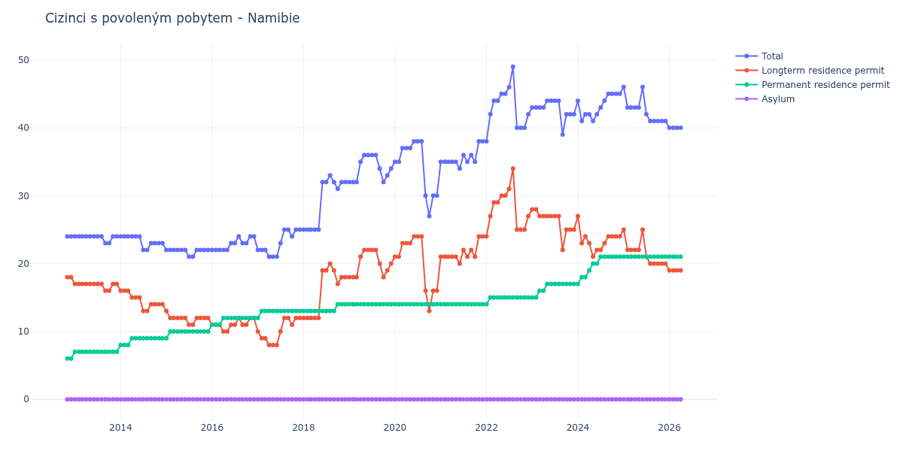

# Namibie

## Souhrnné statistiky (Min/Max pro rok) / Summary Statistics (Min/Max per year)

| Year   | Total   | Longterm Residence Permit   | Permanent Residence Permit   | Asylum   |
|--------|---------|-----------------------------|------------------------------|----------|
| 2012   | 24 / 24 | 18 / 18                     | 6 / 6                        | 0 / 0    |
| 2013   | 23 / 24 | 16 / 17                     | 7 / 7                        | 0 / 0    |
| 2014   | 22 / 24 | 13 / 16                     | 8 / 9                        | 0 / 0    |
| 2015   | 21 / 22 | 11 / 13                     | 9 / 10                       | 0 / 0    |
| 2016   | 22 / 24 | 10 / 12                     | 11 / 12                      | 0 / 0    |
| 2017   | 21 / 25 | 8 / 12                      | 12 / 13                      | 0 / 0    |
| 2018   | 25 / 33 | 12 / 20                     | 13 / 14                      | 0 / 0    |
| 2019   | 32 / 36 | 18 / 22                     | 14 / 14                      | 0 / 0    |
| 2020   | 27 / 38 | 13 / 24                     | 14 / 14                      | 0 / 0    |
| 2021   | 34 / 38 | 20 / 24                     | 14 / 14                      | 0 / 0    |
| 2022   | 38 / 49 | 24 / 34                     | 14 / 15                      | 0 / 0    |
| 2023   | 39 / 44 | 22 / 28                     | 15 / 17                      | 0 / 0    |
| 2024   | 41 / 45 | 21 / 27                     | 17 / 21                      | 0 / 0    |
| 2025   | 41 / 46 | 20 / 25                     | 21 / 21                      | 0 / 0    |
| 2026   | 40 / 40 | 19 / 19                     | 21 / 21                      | 0 / 0    |

## Detailní tabulka / Detailed Data Table

| Date     | Total        | Longterm Residence Permit   | Permanent Residence Permit   | Asylum   |
|----------|--------------|-----------------------------|------------------------------|----------|
| **2012** |              |                             |                              |          |
| 11.2012  | 24           | 18                          | 6                            | 0        |
| 12.2012  | 24 (+0.00%)  | 18 (+0.00%)                 | 6 (+0.00%)                   | 0        |
| **2013** |              |                             |                              |          |
| 01.2013  | 24 (+0.00%)  | 17 (-5.56%)                 | 7 (+16.67%)                  | 0        |
| 02.2013  | 24 (+0.00%)  | 17 (+0.00%)                 | 7 (+0.00%)                   | 0        |
| 03.2013  | 24 (+0.00%)  | 17 (+0.00%)                 | 7 (+0.00%)                   | 0        |
| 04.2013  | 24 (+0.00%)  | 17 (+0.00%)                 | 7 (+0.00%)                   | 0        |
| 05.2013  | 24 (+0.00%)  | 17 (+0.00%)                 | 7 (+0.00%)                   | 0        |
| 06.2013  | 24 (+0.00%)  | 17 (+0.00%)                 | 7 (+0.00%)                   | 0        |
| 07.2013  | 24 (+0.00%)  | 17 (+0.00%)                 | 7 (+0.00%)                   | 0        |
| 08.2013  | 24 (+0.00%)  | 17 (+0.00%)                 | 7 (+0.00%)                   | 0        |
| 09.2013  | 23 (-4.17%)  | 16 (-5.88%)                 | 7 (+0.00%)                   | 0        |
| 10.2013  | 23 (+0.00%)  | 16 (+0.00%)                 | 7 (+0.00%)                   | 0        |
| 11.2013  | 24 (+4.35%)  | 17 (+6.25%)                 | 7 (+0.00%)                   | 0        |
| 12.2013  | 24 (+0.00%)  | 17 (+0.00%)                 | 7 (+0.00%)                   | 0        |
| **2014** |              |                             |                              |          |
| 01.2014  | 24 (+0.00%)  | 16 (-5.88%)                 | 8 (+14.29%)                  | 0        |
| 02.2014  | 24 (+0.00%)  | 16 (+0.00%)                 | 8 (+0.00%)                   | 0        |
| 03.2014  | 24 (+0.00%)  | 16 (+0.00%)                 | 8 (+0.00%)                   | 0        |
| 04.2014  | 24 (+0.00%)  | 15 (-6.25%)                 | 9 (+12.50%)                  | 0        |
| 05.2014  | 24 (+0.00%)  | 15 (+0.00%)                 | 9 (+0.00%)                   | 0        |
| 06.2014  | 24 (+0.00%)  | 15 (+0.00%)                 | 9 (+0.00%)                   | 0        |
| 07.2014  | 22 (-8.33%)  | 13 (-13.33%)                | 9 (+0.00%)                   | 0        |
| 08.2014  | 22 (+0.00%)  | 13 (+0.00%)                 | 9 (+0.00%)                   | 0        |
| 09.2014  | 23 (+4.55%)  | 14 (+7.69%)                 | 9 (+0.00%)                   | 0        |
| 10.2014  | 23 (+0.00%)  | 14 (+0.00%)                 | 9 (+0.00%)                   | 0        |
| 11.2014  | 23 (+0.00%)  | 14 (+0.00%)                 | 9 (+0.00%)                   | 0        |
| 12.2014  | 23 (+0.00%)  | 14 (+0.00%)                 | 9 (+0.00%)                   | 0        |
| **2015** |              |                             |                              |          |
| 01.2015  | 22 (-4.35%)  | 13 (-7.14%)                 | 9 (+0.00%)                   | 0        |
| 02.2015  | 22 (+0.00%)  | 12 (-7.69%)                 | 10 (+11.11%)                 | 0        |
| 03.2015  | 22 (+0.00%)  | 12 (+0.00%)                 | 10 (+0.00%)                  | 0        |
| 04.2015  | 22 (+0.00%)  | 12 (+0.00%)                 | 10 (+0.00%)                  | 0        |
| 05.2015  | 22 (+0.00%)  | 12 (+0.00%)                 | 10 (+0.00%)                  | 0        |
| 06.2015  | 22 (+0.00%)  | 12 (+0.00%)                 | 10 (+0.00%)                  | 0        |
| 07.2015  | 21 (-4.55%)  | 11 (-8.33%)                 | 10 (+0.00%)                  | 0        |
| 08.2015  | 21 (+0.00%)  | 11 (+0.00%)                 | 10 (+0.00%)                  | 0        |
| 09.2015  | 22 (+4.76%)  | 12 (+9.09%)                 | 10 (+0.00%)                  | 0        |
| 10.2015  | 22 (+0.00%)  | 12 (+0.00%)                 | 10 (+0.00%)                  | 0        |
| 11.2015  | 22 (+0.00%)  | 12 (+0.00%)                 | 10 (+0.00%)                  | 0        |
| 12.2015  | 22 (+0.00%)  | 12 (+0.00%)                 | 10 (+0.00%)                  | 0        |
| **2016** |              |                             |                              |          |
| 01.2016  | 22 (+0.00%)  | 11 (-8.33%)                 | 11 (+10.00%)                 | 0        |
| 02.2016  | 22 (+0.00%)  | 11 (+0.00%)                 | 11 (+0.00%)                  | 0        |
| 03.2016  | 22 (+0.00%)  | 11 (+0.00%)                 | 11 (+0.00%)                  | 0        |
| 04.2016  | 22 (+0.00%)  | 10 (-9.09%)                 | 12 (+9.09%)                  | 0        |
| 05.2016  | 22 (+0.00%)  | 10 (+0.00%)                 | 12 (+0.00%)                  | 0        |
| 06.2016  | 23 (+4.55%)  | 11 (+10.00%)                | 12 (+0.00%)                  | 0        |
| 07.2016  | 23 (+0.00%)  | 11 (+0.00%)                 | 12 (+0.00%)                  | 0        |
| 08.2016  | 24 (+4.35%)  | 12 (+9.09%)                 | 12 (+0.00%)                  | 0        |
| 09.2016  | 23 (-4.17%)  | 11 (-8.33%)                 | 12 (+0.00%)                  | 0        |
| 10.2016  | 23 (+0.00%)  | 11 (+0.00%)                 | 12 (+0.00%)                  | 0        |
| 11.2016  | 24 (+4.35%)  | 12 (+9.09%)                 | 12 (+0.00%)                  | 0        |
| 12.2016  | 24 (+0.00%)  | 12 (+0.00%)                 | 12 (+0.00%)                  | 0        |
| **2017** |              |                             |                              |          |
| 01.2017  | 22 (-8.33%)  | 10 (-16.67%)                | 12 (+0.00%)                  | 0        |
| 02.2017  | 22 (+0.00%)  | 9 (-10.00%)                 | 13 (+8.33%)                  | 0        |
| 03.2017  | 22 (+0.00%)  | 9 (+0.00%)                  | 13 (+0.00%)                  | 0        |
| 04.2017  | 21 (-4.55%)  | 8 (-11.11%)                 | 13 (+0.00%)                  | 0        |
| 05.2017  | 21 (+0.00%)  | 8 (+0.00%)                  | 13 (+0.00%)                  | 0        |
| 06.2017  | 21 (+0.00%)  | 8 (+0.00%)                  | 13 (+0.00%)                  | 0        |
| 07.2017  | 23 (+9.52%)  | 10 (+25.00%)                | 13 (+0.00%)                  | 0        |
| 08.2017  | 25 (+8.70%)  | 12 (+20.00%)                | 13 (+0.00%)                  | 0        |
| 09.2017  | 25 (+0.00%)  | 12 (+0.00%)                 | 13 (+0.00%)                  | 0        |
| 10.2017  | 24 (-4.00%)  | 11 (-8.33%)                 | 13 (+0.00%)                  | 0        |
| 11.2017  | 25 (+4.17%)  | 12 (+9.09%)                 | 13 (+0.00%)                  | 0        |
| 12.2017  | 25 (+0.00%)  | 12 (+0.00%)                 | 13 (+0.00%)                  | 0        |
| **2018** |              |                             |                              |          |
| 01.2018  | 25 (+0.00%)  | 12 (+0.00%)                 | 13 (+0.00%)                  | 0        |
| 02.2018  | 25 (+0.00%)  | 12 (+0.00%)                 | 13 (+0.00%)                  | 0        |
| 03.2018  | 25 (+0.00%)  | 12 (+0.00%)                 | 13 (+0.00%)                  | 0        |
| 04.2018  | 25 (+0.00%)  | 12 (+0.00%)                 | 13 (+0.00%)                  | 0        |
| 05.2018  | 25 (+0.00%)  | 12 (+0.00%)                 | 13 (+0.00%)                  | 0        |
| 06.2018  | 32 (+28.00%) | 19 (+58.33%)                | 13 (+0.00%)                  | 0        |
| 07.2018  | 32 (+0.00%)  | 19 (+0.00%)                 | 13 (+0.00%)                  | 0        |
| 08.2018  | 33 (+3.12%)  | 20 (+5.26%)                 | 13 (+0.00%)                  | 0        |
| 09.2018  | 32 (-3.03%)  | 19 (-5.00%)                 | 13 (+0.00%)                  | 0        |
| 10.2018  | 31 (-3.12%)  | 17 (-10.53%)                | 14 (+7.69%)                  | 0        |
| 11.2018  | 32 (+3.23%)  | 18 (+5.88%)                 | 14 (+0.00%)                  | 0        |
| 12.2018  | 32 (+0.00%)  | 18 (+0.00%)                 | 14 (+0.00%)                  | 0        |
| **2019** |              |                             |                              |          |
| 01.2019  | 32 (+0.00%)  | 18 (+0.00%)                 | 14 (+0.00%)                  | 0        |
| 02.2019  | 32 (+0.00%)  | 18 (+0.00%)                 | 14 (+0.00%)                  | 0        |
| 03.2019  | 32 (+0.00%)  | 18 (+0.00%)                 | 14 (+0.00%)                  | 0        |
| 04.2019  | 35 (+9.38%)  | 21 (+16.67%)                | 14 (+0.00%)                  | 0        |
| 05.2019  | 36 (+2.86%)  | 22 (+4.76%)                 | 14 (+0.00%)                  | 0        |
| 06.2019  | 36 (+0.00%)  | 22 (+0.00%)                 | 14 (+0.00%)                  | 0        |
| 07.2019  | 36 (+0.00%)  | 22 (+0.00%)                 | 14 (+0.00%)                  | 0        |
| 08.2019  | 36 (+0.00%)  | 22 (+0.00%)                 | 14 (+0.00%)                  | 0        |
| 09.2019  | 34 (-5.56%)  | 20 (-9.09%)                 | 14 (+0.00%)                  | 0        |
| 10.2019  | 32 (-5.88%)  | 18 (-10.00%)                | 14 (+0.00%)                  | 0        |
| 11.2019  | 33 (+3.12%)  | 19 (+5.56%)                 | 14 (+0.00%)                  | 0        |
| 12.2019  | 34 (+3.03%)  | 20 (+5.26%)                 | 14 (+0.00%)                  | 0        |
| **2020** |              |                             |                              |          |
| 01.2020  | 35 (+2.94%)  | 21 (+5.00%)                 | 14 (+0.00%)                  | 0        |
| 02.2020  | 35 (+0.00%)  | 21 (+0.00%)                 | 14 (+0.00%)                  | 0        |
| 03.2020  | 37 (+5.71%)  | 23 (+9.52%)                 | 14 (+0.00%)                  | 0        |
| 04.2020  | 37 (+0.00%)  | 23 (+0.00%)                 | 14 (+0.00%)                  | 0        |
| 05.2020  | 37 (+0.00%)  | 23 (+0.00%)                 | 14 (+0.00%)                  | 0        |
| 06.2020  | 38 (+2.70%)  | 24 (+4.35%)                 | 14 (+0.00%)                  | 0        |
| 07.2020  | 38 (+0.00%)  | 24 (+0.00%)                 | 14 (+0.00%)                  | 0        |
| 08.2020  | 38 (+0.00%)  | 24 (+0.00%)                 | 14 (+0.00%)                  | 0        |
| 09.2020  | 30 (-21.05%) | 16 (-33.33%)                | 14 (+0.00%)                  | 0        |
| 10.2020  | 27 (-10.00%) | 13 (-18.75%)                | 14 (+0.00%)                  | 0        |
| 11.2020  | 30 (+11.11%) | 16 (+23.08%)                | 14 (+0.00%)                  | 0        |
| 12.2020  | 30 (+0.00%)  | 16 (+0.00%)                 | 14 (+0.00%)                  | 0        |
| **2021** |              |                             |                              |          |
| 01.2021  | 35 (+16.67%) | 21 (+31.25%)                | 14 (+0.00%)                  | 0        |
| 02.2021  | 35 (+0.00%)  | 21 (+0.00%)                 | 14 (+0.00%)                  | 0        |
| 03.2021  | 35 (+0.00%)  | 21 (+0.00%)                 | 14 (+0.00%)                  | 0        |
| 04.2021  | 35 (+0.00%)  | 21 (+0.00%)                 | 14 (+0.00%)                  | 0        |
| 05.2021  | 35 (+0.00%)  | 21 (+0.00%)                 | 14 (+0.00%)                  | 0        |
| 06.2021  | 34 (-2.86%)  | 20 (-4.76%)                 | 14 (+0.00%)                  | 0        |
| 07.2021  | 36 (+5.88%)  | 22 (+10.00%)                | 14 (+0.00%)                  | 0        |
| 08.2021  | 35 (-2.78%)  | 21 (-4.55%)                 | 14 (+0.00%)                  | 0        |
| 09.2021  | 36 (+2.86%)  | 22 (+4.76%)                 | 14 (+0.00%)                  | 0        |
| 10.2021  | 35 (-2.78%)  | 21 (-4.55%)                 | 14 (+0.00%)                  | 0        |
| 11.2021  | 38 (+8.57%)  | 24 (+14.29%)                | 14 (+0.00%)                  | 0        |
| 12.2021  | 38 (+0.00%)  | 24 (+0.00%)                 | 14 (+0.00%)                  | 0        |
| **2022** |              |                             |                              |          |
| 01.2022  | 38 (+0.00%)  | 24 (+0.00%)                 | 14 (+0.00%)                  | 0        |
| 02.2022  | 42 (+10.53%) | 27 (+12.50%)                | 15 (+7.14%)                  | 0        |
| 03.2022  | 44 (+4.76%)  | 29 (+7.41%)                 | 15 (+0.00%)                  | 0        |
| 04.2022  | 44 (+0.00%)  | 29 (+0.00%)                 | 15 (+0.00%)                  | 0        |
| 05.2022  | 45 (+2.27%)  | 30 (+3.45%)                 | 15 (+0.00%)                  | 0        |
| 06.2022  | 45 (+0.00%)  | 30 (+0.00%)                 | 15 (+0.00%)                  | 0        |
| 07.2022  | 46 (+2.22%)  | 31 (+3.33%)                 | 15 (+0.00%)                  | 0        |
| 08.2022  | 49 (+6.52%)  | 34 (+9.68%)                 | 15 (+0.00%)                  | 0        |
| 09.2022  | 40 (-18.37%) | 25 (-26.47%)                | 15 (+0.00%)                  | 0        |
| 10.2022  | 40 (+0.00%)  | 25 (+0.00%)                 | 15 (+0.00%)                  | 0        |
| 11.2022  | 40 (+0.00%)  | 25 (+0.00%)                 | 15 (+0.00%)                  | 0        |
| 12.2022  | 42 (+5.00%)  | 27 (+8.00%)                 | 15 (+0.00%)                  | 0        |
| **2023** |              |                             |                              |          |
| 01.2023  | 43 (+2.38%)  | 28 (+3.70%)                 | 15 (+0.00%)                  | 0        |
| 02.2023  | 43 (+0.00%)  | 28 (+0.00%)                 | 15 (+0.00%)                  | 0        |
| 03.2023  | 43 (+0.00%)  | 27 (-3.57%)                 | 16 (+6.67%)                  | 0        |
| 04.2023  | 43 (+0.00%)  | 27 (+0.00%)                 | 16 (+0.00%)                  | 0        |
| 05.2023  | 44 (+2.33%)  | 27 (+0.00%)                 | 17 (+6.25%)                  | 0        |
| 06.2023  | 44 (+0.00%)  | 27 (+0.00%)                 | 17 (+0.00%)                  | 0        |
| 07.2023  | 44 (+0.00%)  | 27 (+0.00%)                 | 17 (+0.00%)                  | 0        |
| 08.2023  | 44 (+0.00%)  | 27 (+0.00%)                 | 17 (+0.00%)                  | 0        |
| 09.2023  | 39 (-11.36%) | 22 (-18.52%)                | 17 (+0.00%)                  | 0        |
| 10.2023  | 42 (+7.69%)  | 25 (+13.64%)                | 17 (+0.00%)                  | 0        |
| 11.2023  | 42 (+0.00%)  | 25 (+0.00%)                 | 17 (+0.00%)                  | 0        |
| 12.2023  | 42 (+0.00%)  | 25 (+0.00%)                 | 17 (+0.00%)                  | 0        |
| **2024** |              |                             |                              |          |
| 01.2024  | 44 (+4.76%)  | 27 (+8.00%)                 | 17 (+0.00%)                  | 0        |
| 02.2024  | 41 (-6.82%)  | 23 (-14.81%)                | 18 (+5.88%)                  | 0        |
| 03.2024  | 42 (+2.44%)  | 24 (+4.35%)                 | 18 (+0.00%)                  | 0        |
| 04.2024  | 42 (+0.00%)  | 23 (-4.17%)                 | 19 (+5.56%)                  | 0        |
| 05.2024  | 41 (-2.38%)  | 21 (-8.70%)                 | 20 (+5.26%)                  | 0        |
| 06.2024  | 42 (+2.44%)  | 22 (+4.76%)                 | 20 (+0.00%)                  | 0        |
| 07.2024  | 43 (+2.38%)  | 22 (+0.00%)                 | 21 (+5.00%)                  | 0        |
| 08.2024  | 44 (+2.33%)  | 23 (+4.55%)                 | 21 (+0.00%)                  | 0        |
| 09.2024  | 45 (+2.27%)  | 24 (+4.35%)                 | 21 (+0.00%)                  | 0        |
| 10.2024  | 45 (+0.00%)  | 24 (+0.00%)                 | 21 (+0.00%)                  | 0        |
| 11.2024  | 45 (+0.00%)  | 24 (+0.00%)                 | 21 (+0.00%)                  | 0        |
| 12.2024  | 45 (+0.00%)  | 24 (+0.00%)                 | 21 (+0.00%)                  | 0        |
| **2025** |              |                             |                              |          |
| 01.2025  | 46 (+2.22%)  | 25 (+4.17%)                 | 21 (+0.00%)                  | 0        |
| 02.2025  | 43 (-6.52%)  | 22 (-12.00%)                | 21 (+0.00%)                  | 0        |
| 03.2025  | 43 (+0.00%)  | 22 (+0.00%)                 | 21 (+0.00%)                  | 0        |
| 04.2025  | 43 (+0.00%)  | 22 (+0.00%)                 | 21 (+0.00%)                  | 0        |
| 05.2025  | 43 (+0.00%)  | 22 (+0.00%)                 | 21 (+0.00%)                  | 0        |
| 06.2025  | 46 (+6.98%)  | 25 (+13.64%)                | 21 (+0.00%)                  | 0        |
| 07.2025  | 42 (-8.70%)  | 21 (-16.00%)                | 21 (+0.00%)                  | 0        |
| 08.2025  | 41 (-2.38%)  | 20 (-4.76%)                 | 21 (+0.00%)                  | 0        |
| 09.2025  | 41 (+0.00%)  | 20 (+0.00%)                 | 21 (+0.00%)                  | 0        |
| 10.2025  | 41 (+0.00%)  | 20 (+0.00%)                 | 21 (+0.00%)                  | 0        |
| 11.2025  | 41 (+0.00%)  | 20 (+0.00%)                 | 21 (+0.00%)                  | 0        |
| 12.2025  | 41 (+0.00%)  | 20 (+0.00%)                 | 21 (+0.00%)                  | 0        |
| **2026** |              |                             |                              |          |
| 01.2026  | 40 (-2.44%)  | 19 (-5.00%)                 | 21 (+0.00%)                  | 0        |
| 02.2026  | 40 (+0.00%)  | 19 (+0.00%)                 | 21 (+0.00%)                  | 0        |
| 03.2026  | 40 (+0.00%)  | 19 (+0.00%)                 | 21 (+0.00%)                  | 0        |
| 04.2026  | 40 (+0.00%)  | 19 (+0.00%)                 | 21 (+0.00%)                  | 0        |
