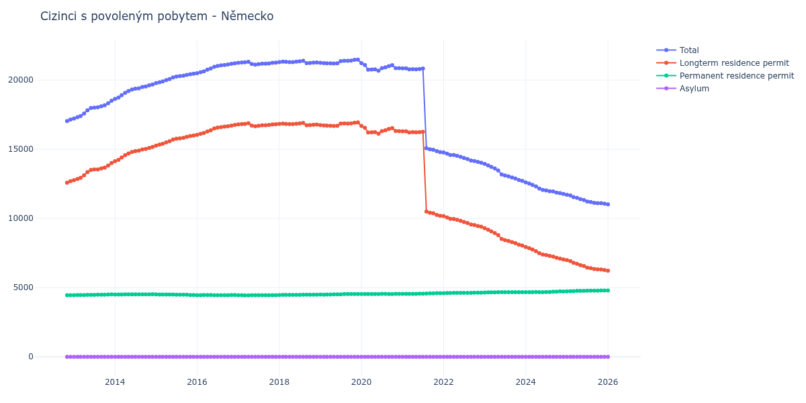

# Německo

## Souhrnné statistiky (Min/Max pro rok) / Summary Statistics (Min/Max per year)

| Year   | Total           | Longterm Residence Permit   | Permanent Residence Permit   | Asylum   |
|--------|-----------------|-----------------------------|------------------------------|----------|
| 2012   | 17 039 / 17 149 | 12 580 / 12 691             | 4 458 / 4 459                | 0 / 0    |
| 2013   | 17 222 / 18 507 | 12 763 / 13 998             | 4 459 / 4 509                | 0 / 0    |
| 2014   | 18 640 / 19 687 | 14 137 / 15 163             | 4 503 / 4 524                | 0 / 0    |
| 2015   | 19 780 / 20 464 | 15 268 / 15 999             | 4 465 / 4 512                | 0 / 0    |
| 2016   | 20 498 / 21 216 | 16 043 / 16 756             | 4 455 / 4 467                | 0 / 0    |
| 2017   | 21 116 / 21 322 | 16 663 / 16 881             | 4 441 / 4 459                | 0 / 0    |
| 2018   | 21 225 / 21 391 | 16 736 / 16 904             | 4 468 / 4 491                | 0 / 0    |
| 2019   | 21 199 / 21 478 | 16 689 / 16 937             | 4 494 / 4 544                | 0 / 0    |
| 2020   | 20 673 / 21 218 | 16 129 / 16 680             | 4 536 / 4 555                | 0 / 0    |
| 2021   | 14 792 / 20 849 | 10 191 / 16 299             | 4 547 / 4 604                | 0 / 0    |
| 2022   | 14 032 / 14 767 | 9 399 / 10 163              | 4 604 / 4 634                | 0 / 0    |
| 2023   | 12 719 / 13 946 | 8 047 / 9 301               | 4 645 / 4 674                | 0 / 0    |
| 2024   | 11 768 / 12 609 | 7 044 / 7 939               | 4 667 / 4 729                | 0 / 0    |
| 2025   | 11 061 / 11 714 | 6 271 / 6 984               | 4 730 / 4 790                | 0 / 0    |
| 2026   | 11 020 / 11 020 | 6 229 / 6 229               | 4 791 / 4 791                | 0 / 0    |

## Detailní tabulka / Detailed Data Table

| Date     | Total            | Longterm Residence Permit   | Permanent Residence Permit   | Asylum   |
|----------|------------------|-----------------------------|------------------------------|----------|
| **2012** |                  |                             |                              |          |
| 11.2012  | 17 039           | 12 580                      | 4 459                        | 0        |
| 12.2012  | 17 149 (+0.65%)  | 12 691 (+0.88%)             | 4 458 (-0.02%)               | 0        |
| **2013** |                  |                             |                              |          |
| 01.2013  | 17 222 (+0.43%)  | 12 763 (+0.57%)             | 4 459 (+0.02%)               | 0        |
| 02.2013  | 17 311 (+0.52%)  | 12 850 (+0.68%)             | 4 461 (+0.04%)               | 0        |
| 03.2013  | 17 404 (+0.54%)  | 12 938 (+0.68%)             | 4 466 (+0.11%)               | 0        |
| 04.2013  | 17 580 (+1.01%)  | 13 114 (+1.36%)             | 4 466 (+0.00%)               | 0        |
| 05.2013  | 17 815 (+1.34%)  | 13 343 (+1.75%)             | 4 472 (+0.13%)               | 0        |
| 06.2013  | 17 979 (+0.92%)  | 13 503 (+1.20%)             | 4 476 (+0.09%)               | 0        |
| 07.2013  | 18 011 (+0.18%)  | 13 536 (+0.24%)             | 4 475 (-0.02%)               | 0        |
| 08.2013  | 18 031 (+0.11%)  | 13 547 (+0.08%)             | 4 484 (+0.20%)               | 0        |
| 09.2013  | 18 099 (+0.38%)  | 13 612 (+0.48%)             | 4 487 (+0.07%)               | 0        |
| 10.2013  | 18 172 (+0.40%)  | 13 680 (+0.50%)             | 4 492 (+0.11%)               | 0        |
| 11.2013  | 18 322 (+0.83%)  | 13 825 (+1.06%)             | 4 497 (+0.11%)               | 0        |
| 12.2013  | 18 507 (+1.01%)  | 13 998 (+1.25%)             | 4 509 (+0.27%)               | 0        |
| **2014** |                  |                             |                              |          |
| 01.2014  | 18 640 (+0.72%)  | 14 137 (+0.99%)             | 4 503 (-0.13%)               | 0        |
| 02.2014  | 18 735 (+0.51%)  | 14 232 (+0.67%)             | 4 503 (+0.00%)               | 0        |
| 03.2014  | 18 907 (+0.92%)  | 14 402 (+1.19%)             | 4 505 (+0.04%)               | 0        |
| 04.2014  | 19 078 (+0.90%)  | 14 568 (+1.15%)             | 4 510 (+0.11%)               | 0        |
| 05.2014  | 19 208 (+0.68%)  | 14 693 (+0.86%)             | 4 515 (+0.11%)               | 0        |
| 06.2014  | 19 316 (+0.56%)  | 14 804 (+0.76%)             | 4 512 (-0.07%)               | 0        |
| 07.2014  | 19 384 (+0.35%)  | 14 868 (+0.43%)             | 4 516 (+0.09%)               | 0        |
| 08.2014  | 19 409 (+0.13%)  | 14 897 (+0.20%)             | 4 512 (-0.09%)               | 0        |
| 09.2014  | 19 500 (+0.47%)  | 14 984 (+0.58%)             | 4 516 (+0.09%)               | 0        |
| 10.2014  | 19 535 (+0.18%)  | 15 019 (+0.23%)             | 4 516 (+0.00%)               | 0        |
| 11.2014  | 19 618 (+0.42%)  | 15 098 (+0.53%)             | 4 520 (+0.09%)               | 0        |
| 12.2014  | 19 687 (+0.35%)  | 15 163 (+0.43%)             | 4 524 (+0.09%)               | 0        |
| **2015** |                  |                             |                              |          |
| 01.2015  | 19 780 (+0.47%)  | 15 268 (+0.69%)             | 4 512 (-0.27%)               | 0        |
| 02.2015  | 19 841 (+0.31%)  | 15 335 (+0.44%)             | 4 506 (-0.13%)               | 0        |
| 03.2015  | 19 896 (+0.28%)  | 15 398 (+0.41%)             | 4 498 (-0.18%)               | 0        |
| 04.2015  | 19 998 (+0.51%)  | 15 499 (+0.66%)             | 4 499 (+0.02%)               | 0        |
| 05.2015  | 20 076 (+0.39%)  | 15 577 (+0.50%)             | 4 499 (+0.00%)               | 0        |
| 06.2015  | 20 197 (+0.60%)  | 15 701 (+0.80%)             | 4 496 (-0.07%)               | 0        |
| 07.2015  | 20 253 (+0.28%)  | 15 760 (+0.38%)             | 4 493 (-0.07%)               | 0        |
| 08.2015  | 20 285 (+0.16%)  | 15 792 (+0.20%)             | 4 493 (+0.00%)               | 0        |
| 09.2015  | 20 315 (+0.15%)  | 15 823 (+0.20%)             | 4 492 (-0.02%)               | 0        |
| 10.2015  | 20 376 (+0.30%)  | 15 892 (+0.44%)             | 4 484 (-0.18%)               | 0        |
| 11.2015  | 20 426 (+0.25%)  | 15 956 (+0.40%)             | 4 470 (-0.31%)               | 0        |
| 12.2015  | 20 464 (+0.19%)  | 15 999 (+0.27%)             | 4 465 (-0.11%)               | 0        |
| **2016** |                  |                             |                              |          |
| 01.2016  | 20 498 (+0.17%)  | 16 043 (+0.28%)             | 4 455 (-0.22%)               | 0        |
| 02.2016  | 20 571 (+0.36%)  | 16 113 (+0.44%)             | 4 458 (+0.07%)               | 0        |
| 03.2016  | 20 632 (+0.30%)  | 16 170 (+0.35%)             | 4 462 (+0.09%)               | 0        |
| 04.2016  | 20 750 (+0.57%)  | 16 283 (+0.70%)             | 4 467 (+0.11%)               | 0        |
| 05.2016  | 20 832 (+0.40%)  | 16 366 (+0.51%)             | 4 466 (-0.02%)               | 0        |
| 06.2016  | 20 957 (+0.60%)  | 16 498 (+0.81%)             | 4 459 (-0.16%)               | 0        |
| 07.2016  | 21 016 (+0.28%)  | 16 559 (+0.37%)             | 4 457 (-0.04%)               | 0        |
| 08.2016  | 21 060 (+0.21%)  | 16 602 (+0.26%)             | 4 458 (+0.02%)               | 0        |
| 09.2016  | 21 095 (+0.17%)  | 16 640 (+0.23%)             | 4 455 (-0.07%)               | 0        |
| 10.2016  | 21 121 (+0.12%)  | 16 662 (+0.13%)             | 4 459 (+0.09%)               | 0        |
| 11.2016  | 21 176 (+0.26%)  | 16 715 (+0.32%)             | 4 461 (+0.04%)               | 0        |
| 12.2016  | 21 216 (+0.19%)  | 16 756 (+0.25%)             | 4 460 (-0.02%)               | 0        |
| **2017** |                  |                             |                              |          |
| 01.2017  | 21 251 (+0.16%)  | 16 792 (+0.21%)             | 4 459 (-0.02%)               | 0        |
| 02.2017  | 21 266 (+0.07%)  | 16 816 (+0.14%)             | 4 450 (-0.20%)               | 0        |
| 03.2017  | 21 281 (+0.07%)  | 16 835 (+0.11%)             | 4 446 (-0.09%)               | 0        |
| 04.2017  | 21 322 (+0.19%)  | 16 881 (+0.27%)             | 4 441 (-0.11%)               | 0        |
| 05.2017  | 21 158 (-0.77%)  | 16 707 (-1.03%)             | 4 451 (+0.23%)               | 0        |
| 06.2017  | 21 116 (-0.20%)  | 16 663 (-0.26%)             | 4 453 (+0.04%)               | 0        |
| 07.2017  | 21 148 (+0.15%)  | 16 693 (+0.18%)             | 4 455 (+0.04%)               | 0        |
| 08.2017  | 21 187 (+0.18%)  | 16 728 (+0.21%)             | 4 459 (+0.09%)               | 0        |
| 09.2017  | 21 190 (+0.01%)  | 16 736 (+0.05%)             | 4 454 (-0.11%)               | 0        |
| 10.2017  | 21 203 (+0.06%)  | 16 754 (+0.11%)             | 4 449 (-0.11%)               | 0        |
| 11.2017  | 21 249 (+0.22%)  | 16 798 (+0.26%)             | 4 451 (+0.04%)               | 0        |
| 12.2017  | 21 261 (+0.06%)  | 16 802 (+0.02%)             | 4 459 (+0.18%)               | 0        |
| **2018** |                  |                             |                              |          |
| 01.2018  | 21 297 (+0.17%)  | 16 829 (+0.16%)             | 4 468 (+0.20%)               | 0        |
| 02.2018  | 21 334 (+0.17%)  | 16 858 (+0.17%)             | 4 476 (+0.18%)               | 0        |
| 03.2018  | 21 315 (-0.09%)  | 16 836 (-0.13%)             | 4 479 (+0.07%)               | 0        |
| 04.2018  | 21 301 (-0.07%)  | 16 821 (-0.09%)             | 4 480 (+0.02%)               | 0        |
| 05.2018  | 21 294 (-0.03%)  | 16 815 (-0.04%)             | 4 479 (-0.02%)               | 0        |
| 06.2018  | 21 330 (+0.17%)  | 16 848 (+0.20%)             | 4 482 (+0.07%)               | 0        |
| 07.2018  | 21 354 (+0.11%)  | 16 871 (+0.14%)             | 4 483 (+0.02%)               | 0        |
| 08.2018  | 21 391 (+0.17%)  | 16 904 (+0.20%)             | 4 487 (+0.09%)               | 0        |
| 09.2018  | 21 225 (-0.78%)  | 16 736 (-0.99%)             | 4 489 (+0.04%)               | 0        |
| 10.2018  | 21 238 (+0.06%)  | 16 747 (+0.07%)             | 4 491 (+0.04%)               | 0        |
| 11.2018  | 21 255 (+0.08%)  | 16 766 (+0.11%)             | 4 489 (-0.04%)               | 0        |
| 12.2018  | 21 267 (+0.06%)  | 16 781 (+0.09%)             | 4 486 (-0.07%)               | 0        |
| **2019** |                  |                             |                              |          |
| 01.2019  | 21 245 (-0.10%)  | 16 749 (-0.19%)             | 4 496 (+0.22%)               | 0        |
| 02.2019  | 21 219 (-0.12%)  | 16 725 (-0.14%)             | 4 494 (-0.04%)               | 0        |
| 03.2019  | 21 215 (-0.02%)  | 16 713 (-0.07%)             | 4 502 (+0.18%)               | 0        |
| 04.2019  | 21 210 (-0.02%)  | 16 703 (-0.06%)             | 4 507 (+0.11%)               | 0        |
| 05.2019  | 21 199 (-0.05%)  | 16 689 (-0.08%)             | 4 510 (+0.07%)               | 0        |
| 06.2019  | 21 209 (+0.05%)  | 16 698 (+0.05%)             | 4 511 (+0.02%)               | 0        |
| 07.2019  | 21 372 (+0.77%)  | 16 857 (+0.95%)             | 4 515 (+0.09%)               | 0        |
| 08.2019  | 21 399 (+0.13%)  | 16 865 (+0.05%)             | 4 534 (+0.42%)               | 0        |
| 09.2019  | 21 396 (-0.01%)  | 16 858 (-0.04%)             | 4 538 (+0.09%)               | 0        |
| 10.2019  | 21 410 (+0.07%)  | 16 869 (+0.07%)             | 4 541 (+0.07%)               | 0        |
| 11.2019  | 21 460 (+0.23%)  | 16 916 (+0.28%)             | 4 544 (+0.07%)               | 0        |
| 12.2019  | 21 478 (+0.08%)  | 16 937 (+0.12%)             | 4 541 (-0.07%)               | 0        |
| **2020** |                  |                             |                              |          |
| 01.2020  | 21 218 (-1.21%)  | 16 680 (-1.52%)             | 4 538 (-0.07%)               | 0        |
| 02.2020  | 21 091 (-0.60%)  | 16 555 (-0.75%)             | 4 536 (-0.04%)               | 0        |
| 03.2020  | 20 747 (-1.63%)  | 16 211 (-2.08%)             | 4 536 (+0.00%)               | 0        |
| 04.2020  | 20 762 (+0.07%)  | 16 223 (+0.07%)             | 4 539 (+0.07%)               | 0        |
| 05.2020  | 20 775 (+0.06%)  | 16 234 (+0.07%)             | 4 541 (+0.04%)               | 0        |
| 06.2020  | 20 673 (-0.49%)  | 16 129 (-0.65%)             | 4 544 (+0.07%)               | 0        |
| 07.2020  | 20 862 (+0.91%)  | 16 312 (+1.13%)             | 4 550 (+0.13%)               | 0        |
| 08.2020  | 20 921 (+0.28%)  | 16 373 (+0.37%)             | 4 548 (-0.04%)               | 0        |
| 09.2020  | 21 004 (+0.40%)  | 16 464 (+0.56%)             | 4 540 (-0.18%)               | 0        |
| 10.2020  | 21 075 (+0.34%)  | 16 533 (+0.42%)             | 4 542 (+0.04%)               | 0        |
| 11.2020  | 20 863 (-1.01%)  | 16 315 (-1.32%)             | 4 548 (+0.13%)               | 0        |
| 12.2020  | 20 861 (-0.01%)  | 16 306 (-0.06%)             | 4 555 (+0.15%)               | 0        |
| **2021** |                  |                             |                              |          |
| 01.2021  | 20 849 (-0.06%)  | 16 299 (-0.04%)             | 4 550 (-0.11%)               | 0        |
| 02.2021  | 20 845 (-0.02%)  | 16 291 (-0.05%)             | 4 554 (+0.09%)               | 0        |
| 03.2021  | 20 769 (-0.36%)  | 16 215 (-0.47%)             | 4 554 (+0.00%)               | 0        |
| 04.2021  | 20 787 (+0.09%)  | 16 240 (+0.15%)             | 4 547 (-0.15%)               | 0        |
| 05.2021  | 20 778 (-0.04%)  | 16 227 (-0.08%)             | 4 551 (+0.09%)               | 0        |
| 06.2021  | 20 799 (+0.10%)  | 16 241 (+0.09%)             | 4 558 (+0.15%)               | 0        |
| 07.2021  | 20 829 (+0.14%)  | 16 266 (+0.15%)             | 4 563 (+0.11%)               | 0        |
| 08.2021  | 15 071 (-27.64%) | 10 496 (-35.47%)            | 4 575 (+0.26%)               | 0        |
| 09.2021  | 14 997 (-0.49%)  | 10 414 (-0.78%)             | 4 583 (+0.17%)               | 0        |
| 10.2021  | 14 965 (-0.21%)  | 10 374 (-0.38%)             | 4 591 (+0.17%)               | 0        |
| 11.2021  | 14 862 (-0.69%)  | 10 258 (-1.12%)             | 4 604 (+0.28%)               | 0        |
| 12.2021  | 14 792 (-0.47%)  | 10 191 (-0.65%)             | 4 601 (-0.07%)               | 0        |
| **2022** |                  |                             |                              |          |
| 01.2022  | 14 767 (-0.17%)  | 10 163 (-0.27%)             | 4 604 (+0.07%)               | 0        |
| 02.2022  | 14 688 (-0.53%)  | 10 074 (-0.88%)             | 4 614 (+0.22%)               | 0        |
| 03.2022  | 14 586 (-0.69%)  | 9 972 (-1.01%)              | 4 614 (+0.00%)               | 0        |
| 04.2022  | 14 581 (-0.03%)  | 9 959 (-0.13%)              | 4 622 (+0.17%)               | 0        |
| 05.2022  | 14 526 (-0.38%)  | 9 904 (-0.55%)              | 4 622 (+0.00%)               | 0        |
| 06.2022  | 14 453 (-0.50%)  | 9 829 (-0.76%)              | 4 624 (+0.04%)               | 0        |
| 07.2022  | 14 369 (-0.58%)  | 9 745 (-0.85%)              | 4 624 (+0.00%)               | 0        |
| 08.2022  | 14 292 (-0.54%)  | 9 668 (-0.79%)              | 4 624 (+0.00%)               | 0        |
| 09.2022  | 14 183 (-0.76%)  | 9 559 (-1.13%)              | 4 624 (+0.00%)               | 0        |
| 10.2022  | 14 153 (-0.21%)  | 9 520 (-0.41%)              | 4 633 (+0.19%)               | 0        |
| 11.2022  | 14 090 (-0.45%)  | 9 456 (-0.67%)              | 4 634 (+0.02%)               | 0        |
| 12.2022  | 14 032 (-0.41%)  | 9 399 (-0.60%)              | 4 633 (-0.02%)               | 0        |
| **2023** |                  |                             |                              |          |
| 01.2023  | 13 946 (-0.61%)  | 9 301 (-1.04%)              | 4 645 (+0.26%)               | 0        |
| 02.2023  | 13 836 (-0.79%)  | 9 181 (-1.29%)              | 4 655 (+0.22%)               | 0        |
| 03.2023  | 13 724 (-0.81%)  | 9 064 (-1.27%)              | 4 660 (+0.11%)               | 0        |
| 04.2023  | 13 611 (-0.82%)  | 8 949 (-1.27%)              | 4 662 (+0.04%)               | 0        |
| 05.2023  | 13 467 (-1.06%)  | 8 801 (-1.65%)              | 4 666 (+0.09%)               | 0        |
| 06.2023  | 13 183 (-2.11%)  | 8 513 (-3.27%)              | 4 670 (+0.09%)               | 0        |
| 07.2023  | 13 106 (-0.58%)  | 8 439 (-0.87%)              | 4 667 (-0.06%)               | 0        |
| 08.2023  | 13 041 (-0.50%)  | 8 374 (-0.77%)              | 4 667 (+0.00%)               | 0        |
| 09.2023  | 12 961 (-0.61%)  | 8 292 (-0.98%)              | 4 669 (+0.04%)               | 0        |
| 10.2023  | 12 882 (-0.61%)  | 8 211 (-0.98%)              | 4 671 (+0.04%)               | 0        |
| 11.2023  | 12 783 (-0.77%)  | 8 109 (-1.24%)              | 4 674 (+0.06%)               | 0        |
| 12.2023  | 12 719 (-0.50%)  | 8 047 (-0.76%)              | 4 672 (-0.04%)               | 0        |
| **2024** |                  |                             |                              |          |
| 01.2024  | 12 609 (-0.86%)  | 7 939 (-1.34%)              | 4 670 (-0.04%)               | 0        |
| 02.2024  | 12 526 (-0.66%)  | 7 850 (-1.12%)              | 4 676 (+0.13%)               | 0        |
| 03.2024  | 12 429 (-0.77%)  | 7 753 (-1.24%)              | 4 676 (+0.00%)               | 0        |
| 04.2024  | 12 320 (-0.88%)  | 7 634 (-1.53%)              | 4 686 (+0.21%)               | 0        |
| 05.2024  | 12 159 (-1.31%)  | 7 491 (-1.87%)              | 4 668 (-0.38%)               | 0        |
| 06.2024  | 12 057 (-0.84%)  | 7 390 (-1.35%)              | 4 667 (-0.02%)               | 0        |
| 07.2024  | 12 029 (-0.23%)  | 7 350 (-0.54%)              | 4 679 (+0.26%)               | 0        |
| 08.2024  | 11 968 (-0.51%)  | 7 287 (-0.86%)              | 4 681 (+0.04%)               | 0        |
| 09.2024  | 11 950 (-0.15%)  | 7 245 (-0.58%)              | 4 705 (+0.51%)               | 0        |
| 10.2024  | 11 870 (-0.67%)  | 7 156 (-1.23%)              | 4 714 (+0.19%)               | 0        |
| 11.2024  | 11 831 (-0.33%)  | 7 102 (-0.75%)              | 4 729 (+0.32%)               | 0        |
| 12.2024  | 11 768 (-0.53%)  | 7 044 (-0.82%)              | 4 724 (-0.11%)               | 0        |
| **2025** |                  |                             |                              |          |
| 01.2025  | 11 714 (-0.46%)  | 6 984 (-0.85%)              | 4 730 (+0.13%)               | 0        |
| 02.2025  | 11 665 (-0.42%)  | 6 919 (-0.93%)              | 4 746 (+0.34%)               | 0        |
| 03.2025  | 11 545 (-1.03%)  | 6 795 (-1.79%)              | 4 750 (+0.08%)               | 0        |
| 04.2025  | 11 487 (-0.50%)  | 6 723 (-1.06%)              | 4 764 (+0.29%)               | 0        |
| 05.2025  | 11 397 (-0.78%)  | 6 628 (-1.41%)              | 4 769 (+0.10%)               | 0        |
| 06.2025  | 11 331 (-0.58%)  | 6 567 (-0.92%)              | 4 764 (-0.10%)               | 0        |
| 07.2025  | 11 227 (-0.92%)  | 6 449 (-1.80%)              | 4 778 (+0.29%)               | 0        |
| 08.2025  | 11 192 (-0.31%)  | 6 410 (-0.60%)              | 4 782 (+0.08%)               | 0        |
| 09.2025  | 11 131 (-0.55%)  | 6 349 (-0.95%)              | 4 782 (+0.00%)               | 0        |
| 10.2025  | 11 104 (-0.24%)  | 6 318 (-0.49%)              | 4 786 (+0.08%)               | 0        |
| 11.2025  | 11 103 (-0.01%)  | 6 315 (-0.05%)              | 4 788 (+0.04%)               | 0        |
| 12.2025  | 11 061 (-0.38%)  | 6 271 (-0.70%)              | 4 790 (+0.04%)               | 0        |
| **2026** |                  |                             |                              |          |
| 01.2026  | 11 020 (-0.37%)  | 6 229 (-0.67%)              | 4 791 (+0.02%)               | 0        |
