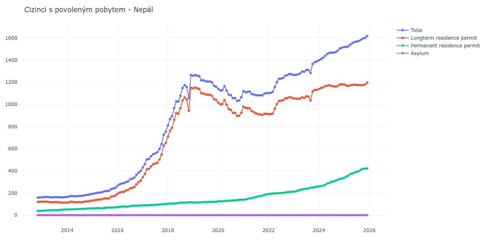

# Nepál

## Souhrnné statistiky (Min/Max pro rok) / Summary Statistics (Min/Max per year)

| Year   | Total Min/Max   | Longterm Residence Permit Min/Max   | Permanent Residence Permit Min/Max   | Asylum Min/Max   |
|--------|-----------------|-------------------------------------|--------------------------------------|------------------|
| 2012   | 159 / 159       | 121 / 121                           | 38 / 38                              | 0 / 0            |
| 2013   | 160 / 165       | 112 / 122                           | 40 / 50                              | 0 / 0            |
| 2014   | 164 / 189       | 112 / 129                           | 52 / 60                              | 0 / 0            |
| 2015   | 192 / 247       | 131 / 177                           | 61 / 70                              | 0 / 0            |
| 2016   | 265 / 399       | 193 / 311                           | 72 / 88                              | 0 / 0            |
| 2017   | 431 / 754       | 342 / 653                           | 88 / 101                             | 0 / 0            |
| 2018   | 810 / 1 266     | 708 / 1 150                         | 102 / 116                            | 0 / 0            |
| 2019   | 1 160 / 1 265   | 1 039 / 1 152                       | 113 / 121                            | 0 / 0            |
| 2020   | 1 031 / 1 165   | 896 / 1 038                         | 125 / 140                            | 0 / 0            |
| 2021   | 1 081 / 1 120   | 904 / 980                           | 140 / 187                            | 0 / 0            |
| 2022   | 1 102 / 1 275   | 912 / 1 066                         | 190 / 212                            | 0 / 0            |
| 2023   | 1 265 / 1 389   | 1 036 / 1 132                       | 211 / 257                            | 0 / 0            |
| 2024   | 1 398 / 1 512   | 1 138 / 1 180                       | 260 / 332                            | 0 / 0            |
| 2025   | 1 518 / 1 618   | 1 168 / 1 197                       | 337 / 421                            | 0 / 0            |

## Detailní tabulka / Detailed Data Table

| Date     | Total           | Longterm Residence Permit   | Permanent Residence Permit   | Asylum   |
|----------|-----------------|-----------------------------|------------------------------|----------|
| **2012** |                 |                             |                              |          |
| 11.2012  | 159             | 121                         | 38                           | 0        |
| 12.2012  | 159 (+0.00%)    | 121 (+0.00%)                | 38 (+0.00%)                  | 0        |
| **2013** |                 |                             |                              |          |
| 01.2013  | 162 (+1.89%)    | 122 (+0.83%)                | 40 (+5.26%)                  | 0        |
| 02.2013  | 162 (+0.00%)    | 122 (+0.00%)                | 40 (+0.00%)                  | 0        |
| 03.2013  | 165 (+1.85%)    | 122 (+0.00%)                | 43 (+7.50%)                  | 0        |
| 04.2013  | 163 (-1.21%)    | 120 (-1.64%)                | 43 (+0.00%)                  | 0        |
| 05.2013  | 162 (-0.61%)    | 117 (-2.50%)                | 45 (+4.65%)                  | 0        |
| 06.2013  | 160 (-1.23%)    | 115 (-1.71%)                | 45 (+0.00%)                  | 0        |
| 07.2013  | 163 (+1.88%)    | 118 (+2.61%)                | 45 (+0.00%)                  | 0        |
| 08.2013  | 163 (+0.00%)    | 118 (+0.00%)                | 45 (+0.00%)                  | 0        |
| 09.2013  | 162 (-0.61%)    | 116 (-1.69%)                | 46 (+2.22%)                  | 0        |
| 10.2013  | 161 (-0.62%)    | 113 (-2.59%)                | 48 (+4.35%)                  | 0        |
| 11.2013  | 160 (-0.62%)    | 112 (-0.88%)                | 48 (+0.00%)                  | 0        |
| 12.2013  | 164 (+2.50%)    | 114 (+1.79%)                | 50 (+4.17%)                  | 0        |
| **2014** |                 |                             |                              |          |
| 01.2014  | 164 (+0.00%)    | 112 (-1.75%)                | 52 (+4.00%)                  | 0        |
| 02.2014  | 169 (+3.05%)    | 117 (+4.46%)                | 52 (+0.00%)                  | 0        |
| 03.2014  | 174 (+2.96%)    | 122 (+4.27%)                | 52 (+0.00%)                  | 0        |
| 04.2014  | 172 (-1.15%)    | 119 (-2.46%)                | 53 (+1.92%)                  | 0        |
| 05.2014  | 170 (-1.16%)    | 116 (-2.52%)                | 54 (+1.89%)                  | 0        |
| 06.2014  | 173 (+1.76%)    | 118 (+1.72%)                | 55 (+1.85%)                  | 0        |
| 07.2014  | 174 (+0.58%)    | 118 (+0.00%)                | 56 (+1.82%)                  | 0        |
| 08.2014  | 174 (+0.00%)    | 117 (-0.85%)                | 57 (+1.79%)                  | 0        |
| 09.2014  | 178 (+2.30%)    | 121 (+3.42%)                | 57 (+0.00%)                  | 0        |
| 10.2014  | 182 (+2.25%)    | 124 (+2.48%)                | 58 (+1.75%)                  | 0        |
| 11.2014  | 183 (+0.55%)    | 123 (-0.81%)                | 60 (+3.45%)                  | 0        |
| 12.2014  | 189 (+3.28%)    | 129 (+4.88%)                | 60 (+0.00%)                  | 0        |
| **2015** |                 |                             |                              |          |
| 01.2015  | 192 (+1.59%)    | 131 (+1.55%)                | 61 (+1.67%)                  | 0        |
| 02.2015  | 196 (+2.08%)    | 135 (+3.05%)                | 61 (+0.00%)                  | 0        |
| 03.2015  | 201 (+2.55%)    | 138 (+2.22%)                | 63 (+3.28%)                  | 0        |
| 04.2015  | 204 (+1.49%)    | 141 (+2.17%)                | 63 (+0.00%)                  | 0        |
| 05.2015  | 204 (+0.00%)    | 141 (+0.00%)                | 63 (+0.00%)                  | 0        |
| 06.2015  | 210 (+2.94%)    | 147 (+4.26%)                | 63 (+0.00%)                  | 0        |
| 07.2015  | 216 (+2.86%)    | 151 (+2.72%)                | 65 (+3.17%)                  | 0        |
| 08.2015  | 218 (+0.93%)    | 150 (-0.66%)                | 68 (+4.62%)                  | 0        |
| 09.2015  | 220 (+0.92%)    | 151 (+0.67%)                | 69 (+1.47%)                  | 0        |
| 10.2015  | 236 (+7.27%)    | 167 (+10.60%)               | 69 (+0.00%)                  | 0        |
| 11.2015  | 241 (+2.12%)    | 172 (+2.99%)                | 69 (+0.00%)                  | 0        |
| 12.2015  | 247 (+2.49%)    | 177 (+2.91%)                | 70 (+1.45%)                  | 0        |
| **2016** |                 |                             |                              |          |
| 01.2016  | 265 (+7.29%)    | 193 (+9.04%)                | 72 (+2.86%)                  | 0        |
| 02.2016  | 278 (+4.91%)    | 204 (+5.70%)                | 74 (+2.78%)                  | 0        |
| 03.2016  | 286 (+2.88%)    | 209 (+2.45%)                | 77 (+4.05%)                  | 0        |
| 04.2016  | 288 (+0.70%)    | 210 (+0.48%)                | 78 (+1.30%)                  | 0        |
| 05.2016  | 298 (+3.47%)    | 221 (+5.24%)                | 77 (-1.28%)                  | 0        |
| 06.2016  | 304 (+2.01%)    | 227 (+2.71%)                | 77 (+0.00%)                  | 0        |
| 07.2016  | 324 (+6.58%)    | 242 (+6.61%)                | 82 (+6.49%)                  | 0        |
| 08.2016  | 329 (+1.54%)    | 245 (+1.24%)                | 84 (+2.44%)                  | 0        |
| 09.2016  | 339 (+3.04%)    | 254 (+3.67%)                | 85 (+1.19%)                  | 0        |
| 10.2016  | 363 (+7.08%)    | 278 (+9.45%)                | 85 (+0.00%)                  | 0        |
| 11.2016  | 384 (+5.79%)    | 298 (+7.19%)                | 86 (+1.18%)                  | 0        |
| 12.2016  | 399 (+3.91%)    | 311 (+4.36%)                | 88 (+2.33%)                  | 0        |
| **2017** |                 |                             |                              |          |
| 01.2017  | 431 (+8.02%)    | 342 (+9.97%)                | 89 (+1.14%)                  | 0        |
| 02.2017  | 461 (+6.96%)    | 373 (+9.06%)                | 88 (-1.12%)                  | 0        |
| 03.2017  | 504 (+9.33%)    | 415 (+11.26%)               | 89 (+1.14%)                  | 0        |
| 04.2017  | 507 (+0.60%)    | 418 (+0.72%)                | 89 (+0.00%)                  | 0        |
| 05.2017  | 532 (+4.93%)    | 441 (+5.50%)                | 91 (+2.25%)                  | 0        |
| 06.2017  | 550 (+3.38%)    | 459 (+4.08%)                | 91 (+0.00%)                  | 0        |
| 07.2017  | 557 (+1.27%)    | 466 (+1.53%)                | 91 (+0.00%)                  | 0        |
| 08.2017  | 569 (+2.15%)    | 473 (+1.50%)                | 96 (+5.49%)                  | 0        |
| 09.2017  | 598 (+5.10%)    | 503 (+6.34%)                | 95 (-1.04%)                  | 0        |
| 10.2017  | 644 (+7.69%)    | 547 (+8.75%)                | 97 (+2.11%)                  | 0        |
| 11.2017  | 727 (+12.89%)   | 627 (+14.63%)               | 100 (+3.09%)                 | 0        |
| 12.2017  | 754 (+3.71%)    | 653 (+4.15%)                | 101 (+1.00%)                 | 0        |
| **2018** |                 |                             |                              |          |
| 01.2018  | 810 (+7.43%)    | 708 (+8.42%)                | 102 (+0.99%)                 | 0        |
| 02.2018  | 868 (+7.16%)    | 763 (+7.77%)                | 105 (+2.94%)                 | 0        |
| 03.2018  | 893 (+2.88%)    | 788 (+3.28%)                | 105 (+0.00%)                 | 0        |
| 04.2018  | 966 (+8.17%)    | 861 (+9.26%)                | 105 (+0.00%)                 | 0        |
| 05.2018  | 1 027 (+6.31%)  | 921 (+6.97%)                | 106 (+0.95%)                 | 0        |
| 06.2018  | 1 026 (-0.10%)  | 916 (-0.54%)                | 110 (+3.77%)                 | 0        |
| 07.2018  | 1 077 (+4.97%)  | 965 (+5.35%)                | 112 (+1.82%)                 | 0        |
| 08.2018  | 1 148 (+6.59%)  | 1 036 (+7.36%)              | 112 (+0.00%)                 | 0        |
| 09.2018  | 1 175 (+2.35%)  | 1 062 (+2.51%)              | 113 (+0.89%)                 | 0        |
| 10.2018  | 1 158 (-1.45%)  | 1 044 (-1.69%)              | 114 (+0.88%)                 | 0        |
| 11.2018  | 1 058 (-8.64%)  | 943 (-9.67%)                | 115 (+0.88%)                 | 0        |
| 12.2018  | 1 266 (+19.66%) | 1 150 (+21.95%)             | 116 (+0.87%)                 | 0        |
| **2019** |                 |                             |                              |          |
| 01.2019  | 1 258 (-0.63%)  | 1 145 (-0.43%)              | 113 (-2.59%)                 | 0        |
| 02.2019  | 1 265 (+0.56%)  | 1 152 (+0.61%)              | 113 (+0.00%)                 | 0        |
| 03.2019  | 1 259 (-0.47%)  | 1 145 (-0.61%)              | 114 (+0.88%)                 | 0        |
| 04.2019  | 1 255 (-0.32%)  | 1 140 (-0.44%)              | 115 (+0.88%)                 | 0        |
| 05.2019  | 1 217 (-3.03%)  | 1 101 (-3.42%)              | 116 (+0.87%)                 | 0        |
| 06.2019  | 1 218 (+0.08%)  | 1 099 (-0.18%)              | 119 (+2.59%)                 | 0        |
| 07.2019  | 1 210 (-0.66%)  | 1 091 (-0.73%)              | 119 (+0.00%)                 | 0        |
| 08.2019  | 1 206 (-0.33%)  | 1 087 (-0.37%)              | 119 (+0.00%)                 | 0        |
| 09.2019  | 1 207 (+0.08%)  | 1 087 (+0.00%)              | 120 (+0.84%)                 | 0        |
| 10.2019  | 1 198 (-0.75%)  | 1 078 (-0.83%)              | 120 (+0.00%)                 | 0        |
| 11.2019  | 1 168 (-2.50%)  | 1 048 (-2.78%)              | 120 (+0.00%)                 | 0        |
| 12.2019  | 1 160 (-0.68%)  | 1 039 (-0.86%)              | 121 (+0.83%)                 | 0        |
| **2020** |                 |                             |                              |          |
| 01.2020  | 1 141 (-1.64%)  | 1 016 (-2.21%)              | 125 (+3.31%)                 | 0        |
| 02.2020  | 1 126 (-1.31%)  | 1 001 (-1.48%)              | 125 (+0.00%)                 | 0        |
| 03.2020  | 1 129 (+0.27%)  | 1 004 (+0.30%)              | 125 (+0.00%)                 | 0        |
| 04.2020  | 1 165 (+3.19%)  | 1 038 (+3.39%)              | 127 (+1.60%)                 | 0        |
| 05.2020  | 1 126 (-3.35%)  | 997 (-3.95%)                | 129 (+1.57%)                 | 0        |
| 06.2020  | 1 088 (-3.37%)  | 958 (-3.91%)                | 130 (+0.78%)                 | 0        |
| 07.2020  | 1 084 (-0.37%)  | 952 (-0.63%)                | 132 (+1.54%)                 | 0        |
| 08.2020  | 1 056 (-2.58%)  | 923 (-3.05%)                | 133 (+0.76%)                 | 0        |
| 09.2020  | 1 058 (+0.19%)  | 924 (+0.11%)                | 134 (+0.75%)                 | 0        |
| 10.2020  | 1 031 (-2.55%)  | 896 (-3.03%)                | 135 (+0.75%)                 | 0        |
| 11.2020  | 1 036 (+0.48%)  | 897 (+0.11%)                | 139 (+2.96%)                 | 0        |
| 12.2020  | 1 064 (+2.70%)  | 924 (+3.01%)                | 140 (+0.72%)                 | 0        |
| **2021** |                 |                             |                              |          |
| 01.2021  | 1 120 (+5.26%)  | 980 (+6.06%)                | 140 (+0.00%)                 | 0        |
| 02.2021  | 1 111 (-0.80%)  | 969 (-1.12%)                | 142 (+1.43%)                 | 0        |
| 03.2021  | 1 112 (+0.09%)  | 967 (-0.21%)                | 145 (+2.11%)                 | 0        |
| 04.2021  | 1 116 (+0.36%)  | 964 (-0.31%)                | 152 (+4.83%)                 | 0        |
| 05.2021  | 1 094 (-1.97%)  | 940 (-2.49%)                | 154 (+1.32%)                 | 0        |
| 06.2021  | 1 090 (-0.37%)  | 930 (-1.06%)                | 160 (+3.90%)                 | 0        |
| 07.2021  | 1 083 (-0.64%)  | 920 (-1.08%)                | 163 (+1.88%)                 | 0        |
| 08.2021  | 1 082 (-0.09%)  | 912 (-0.87%)                | 170 (+4.29%)                 | 0        |
| 09.2021  | 1 082 (+0.00%)  | 910 (-0.22%)                | 172 (+1.18%)                 | 0        |
| 10.2021  | 1 081 (-0.09%)  | 904 (-0.66%)                | 177 (+2.91%)                 | 0        |
| 11.2021  | 1 097 (+1.48%)  | 915 (+1.22%)                | 182 (+2.82%)                 | 0        |
| 12.2021  | 1 102 (+0.46%)  | 915 (+0.00%)                | 187 (+2.75%)                 | 0        |
| **2022** |                 |                             |                              |          |
| 01.2022  | 1 102 (+0.00%)  | 912 (-0.33%)                | 190 (+1.60%)                 | 0        |
| 02.2022  | 1 104 (+0.18%)  | 912 (+0.00%)                | 192 (+1.05%)                 | 0        |
| 03.2022  | 1 113 (+0.82%)  | 917 (+0.55%)                | 196 (+2.08%)                 | 0        |
| 04.2022  | 1 158 (+4.04%)  | 963 (+5.02%)                | 195 (-0.51%)                 | 0        |
| 05.2022  | 1 201 (+3.71%)  | 1 004 (+4.26%)              | 197 (+1.03%)                 | 0        |
| 06.2022  | 1 231 (+2.50%)  | 1 032 (+2.79%)              | 199 (+1.02%)                 | 0        |
| 07.2022  | 1 233 (+0.16%)  | 1 034 (+0.19%)              | 199 (+0.00%)                 | 0        |
| 08.2022  | 1 239 (+0.49%)  | 1 038 (+0.39%)              | 201 (+1.01%)                 | 0        |
| 09.2022  | 1 260 (+1.69%)  | 1 056 (+1.73%)              | 204 (+1.49%)                 | 0        |
| 10.2022  | 1 265 (+0.40%)  | 1 057 (+0.09%)              | 208 (+1.96%)                 | 0        |
| 11.2022  | 1 275 (+0.79%)  | 1 066 (+0.85%)              | 209 (+0.48%)                 | 0        |
| 12.2022  | 1 272 (-0.24%)  | 1 060 (-0.56%)              | 212 (+1.44%)                 | 0        |
| **2023** |                 |                             |                              |          |
| 01.2023  | 1 265 (-0.55%)  | 1 054 (-0.57%)              | 211 (-0.47%)                 | 0        |
| 02.2023  | 1 267 (+0.16%)  | 1 052 (-0.19%)              | 215 (+1.90%)                 | 0        |
| 03.2023  | 1 271 (+0.32%)  | 1 050 (-0.19%)              | 221 (+2.79%)                 | 0        |
| 04.2023  | 1 279 (+0.63%)  | 1 051 (+0.10%)              | 228 (+3.17%)                 | 0        |
| 05.2023  | 1 295 (+1.25%)  | 1 063 (+1.14%)              | 232 (+1.75%)                 | 0        |
| 06.2023  | 1 295 (+0.00%)  | 1 059 (-0.38%)              | 236 (+1.72%)                 | 0        |
| 07.2023  | 1 310 (+1.16%)  | 1 073 (+1.32%)              | 237 (+0.42%)                 | 0        |
| 08.2023  | 1 312 (+0.15%)  | 1 071 (-0.19%)              | 241 (+1.69%)                 | 0        |
| 09.2023  | 1 284 (-2.13%)  | 1 036 (-3.27%)              | 248 (+2.90%)                 | 0        |
| 10.2023  | 1 366 (+6.39%)  | 1 117 (+7.82%)              | 249 (+0.40%)                 | 0        |
| 11.2023  | 1 382 (+1.17%)  | 1 130 (+1.16%)              | 252 (+1.20%)                 | 0        |
| 12.2023  | 1 389 (+0.51%)  | 1 132 (+0.18%)              | 257 (+1.98%)                 | 0        |
| **2024** |                 |                             |                              |          |
| 01.2024  | 1 398 (+0.65%)  | 1 138 (+0.53%)              | 260 (+1.17%)                 | 0        |
| 02.2024  | 1 410 (+0.86%)  | 1 148 (+0.88%)              | 262 (+0.77%)                 | 0        |
| 03.2024  | 1 421 (+0.78%)  | 1 154 (+0.52%)              | 267 (+1.91%)                 | 0        |
| 04.2024  | 1 439 (+1.27%)  | 1 165 (+0.95%)              | 274 (+2.62%)                 | 0        |
| 05.2024  | 1 455 (+1.11%)  | 1 169 (+0.34%)              | 286 (+4.38%)                 | 0        |
| 06.2024  | 1 464 (+0.62%)  | 1 173 (+0.34%)              | 291 (+1.75%)                 | 0        |
| 07.2024  | 1 468 (+0.27%)  | 1 167 (-0.51%)              | 301 (+3.44%)                 | 0        |
| 08.2024  | 1 467 (-0.07%)  | 1 163 (-0.34%)              | 304 (+1.00%)                 | 0        |
| 09.2024  | 1 474 (+0.48%)  | 1 162 (-0.09%)              | 312 (+2.63%)                 | 0        |
| 10.2024  | 1 486 (+0.81%)  | 1 166 (+0.34%)              | 320 (+2.56%)                 | 0        |
| 11.2024  | 1 506 (+1.35%)  | 1 180 (+1.20%)              | 326 (+1.88%)                 | 0        |
| 12.2024  | 1 512 (+0.40%)  | 1 180 (+0.00%)              | 332 (+1.84%)                 | 0        |
| **2025** |                 |                             |                              |          |
| 01.2025  | 1 518 (+0.40%)  | 1 181 (+0.08%)              | 337 (+1.51%)                 | 0        |
| 02.2025  | 1 519 (+0.07%)  | 1 170 (-0.93%)              | 349 (+3.56%)                 | 0        |
| 03.2025  | 1 524 (+0.33%)  | 1 168 (-0.17%)              | 356 (+2.01%)                 | 0        |
| 04.2025  | 1 541 (+1.12%)  | 1 171 (+0.26%)              | 370 (+3.93%)                 | 0        |
| 05.2025  | 1 553 (+0.78%)  | 1 176 (+0.43%)              | 377 (+1.89%)                 | 0        |
| 06.2025  | 1 563 (+0.64%)  | 1 178 (+0.17%)              | 385 (+2.12%)                 | 0        |
| 07.2025  | 1 568 (+0.32%)  | 1 176 (-0.17%)              | 392 (+1.82%)                 | 0        |
| 08.2025  | 1 572 (+0.26%)  | 1 175 (-0.09%)              | 397 (+1.28%)                 | 0        |
| 09.2025  | 1 583 (+0.70%)  | 1 173 (-0.17%)              | 410 (+3.27%)                 | 0        |
| 10.2025  | 1 594 (+0.69%)  | 1 175 (+0.17%)              | 419 (+2.20%)                 | 0        |
| 11.2025  | 1 601 (+0.44%)  | 1 181 (+0.51%)              | 420 (+0.24%)                 | 0        |
| 12.2025  | 1 618 (+1.06%)  | 1 197 (+1.35%)              | 421 (+0.24%)                 | 0        |
