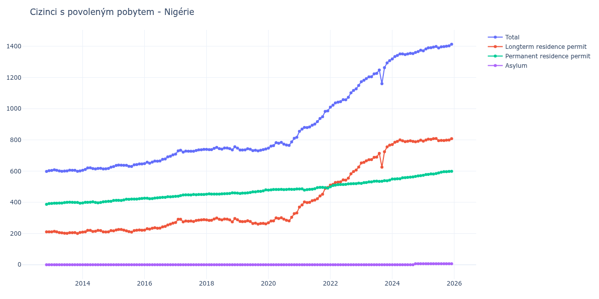

# Nigérie

## Souhrnné statistiky (Min/Max pro rok) / Summary Statistics (Min/Max per year)

| Year   | Total Min/Max   | Longterm Residence Permit Min/Max   | Permanent Residence Permit Min/Max   | Asylum Min/Max   |
|--------|-----------------|-------------------------------------|--------------------------------------|------------------|
| 2012   | 598 / 603       | 211 / 211                           | 387 / 392                            | 0 / 0            |
| 2013   | 599 / 608       | 200 / 214                           | 393 / 401                            | 0 / 0            |
| 2014   | 605 / 625       | 209 / 220                           | 396 / 406                            | 0 / 0            |
| 2015   | 629 / 646       | 209 / 226                           | 412 / 425                            | 0 / 0            |
| 2016   | 648 / 704       | 222 / 267                           | 423 / 437                            | 0 / 0            |
| 2017   | 709 / 739       | 271 / 291                           | 438 / 450                            | 0 / 0            |
| 2018   | 736 / 756       | 275 / 299                           | 452 / 461                            | 0 / 0            |
| 2019   | 730 / 747       | 260 / 288                           | 457 / 480                            | 0 / 0            |
| 2020   | 747 / 817       | 269 / 332                           | 478 / 485                            | 0 / 0            |
| 2021   | 855 / 986       | 370 / 495                           | 478 / 496                            | 0 / 0            |
| 2022   | 1 010 / 1 149   | 510 / 626                           | 500 / 523                            | 0 / 0            |
| 2023   | 1 160 / 1 308   | 625 / 766                           | 521 / 542                            | 0 / 0            |
| 2024   | 1 319 / 1 375   | 770 / 800                           | 549 / 571                            | 0 / 6            |
| 2025   | 1 371 / 1 413   | 792 / 809                           | 573 / 599                            | 6 / 6            |

## Detailní tabulka / Detailed Data Table

| Date     | Total          | Longterm Residence Permit   | Permanent Residence Permit   | Asylum     |
|----------|----------------|-----------------------------|------------------------------|------------|
| **2012** |                |                             |                              |            |
| 11.2012  | 598            | 211                         | 387                          | 0          |
| 12.2012  | 603 (+0.84%)   | 211 (+0.00%)                | 392 (+1.29%)                 | 0          |
| **2013** |                |                             |                              |            |
| 01.2013  | 604 (+0.17%)   | 211 (+0.00%)                | 393 (+0.26%)                 | 0          |
| 02.2013  | 608 (+0.66%)   | 214 (+1.42%)                | 394 (+0.25%)                 | 0          |
| 03.2013  | 605 (-0.49%)   | 211 (-1.40%)                | 394 (+0.00%)                 | 0          |
| 04.2013  | 601 (-0.66%)   | 206 (-2.37%)                | 395 (+0.25%)                 | 0          |
| 05.2013  | 599 (-0.33%)   | 204 (-0.97%)                | 395 (+0.00%)                 | 0          |
| 06.2013  | 600 (+0.17%)   | 202 (-0.98%)                | 398 (+0.76%)                 | 0          |
| 07.2013  | 601 (+0.17%)   | 201 (-0.50%)                | 400 (+0.50%)                 | 0          |
| 08.2013  | 606 (+0.83%)   | 205 (+1.99%)                | 401 (+0.25%)                 | 0          |
| 09.2013  | 605 (-0.17%)   | 205 (+0.00%)                | 400 (-0.25%)                 | 0          |
| 10.2013  | 605 (+0.00%)   | 206 (+0.49%)                | 399 (-0.25%)                 | 0          |
| 11.2013  | 599 (-0.99%)   | 200 (-2.91%)                | 399 (+0.00%)                 | 0          |
| 12.2013  | 601 (+0.33%)   | 207 (+3.50%)                | 394 (-1.25%)                 | 0          |
| **2014** |                |                             |                              |            |
| 01.2014  | 605 (+0.67%)   | 209 (+0.97%)                | 396 (+0.51%)                 | 0          |
| 02.2014  | 611 (+0.99%)   | 211 (+0.96%)                | 400 (+1.01%)                 | 0          |
| 03.2014  | 620 (+1.47%)   | 220 (+4.27%)                | 400 (+0.00%)                 | 0          |
| 04.2014  | 621 (+0.16%)   | 220 (+0.00%)                | 401 (+0.25%)                 | 0          |
| 05.2014  | 616 (-0.81%)   | 213 (-3.18%)                | 403 (+0.50%)                 | 0          |
| 06.2014  | 614 (-0.32%)   | 215 (+0.94%)                | 399 (-0.99%)                 | 0          |
| 07.2014  | 617 (+0.49%)   | 220 (+2.33%)                | 397 (-0.50%)                 | 0          |
| 08.2014  | 618 (+0.16%)   | 219 (-0.45%)                | 399 (+0.50%)                 | 0          |
| 09.2014  | 614 (-0.65%)   | 211 (-3.65%)                | 403 (+1.00%)                 | 0          |
| 10.2014  | 615 (+0.16%)   | 210 (-0.47%)                | 405 (+0.50%)                 | 0          |
| 11.2014  | 617 (+0.33%)   | 211 (+0.48%)                | 406 (+0.25%)                 | 0          |
| 12.2014  | 625 (+1.30%)   | 219 (+3.79%)                | 406 (+0.00%)                 | 0          |
| **2015** |                |                             |                              |            |
| 01.2015  | 629 (+0.64%)   | 217 (-0.91%)                | 412 (+1.48%)                 | 0          |
| 02.2015  | 636 (+1.11%)   | 223 (+2.76%)                | 413 (+0.24%)                 | 0          |
| 03.2015  | 639 (+0.47%)   | 226 (+1.35%)                | 413 (+0.00%)                 | 0          |
| 04.2015  | 638 (-0.16%)   | 226 (+0.00%)                | 412 (-0.24%)                 | 0          |
| 05.2015  | 637 (-0.16%)   | 222 (-1.77%)                | 415 (+0.73%)                 | 0          |
| 06.2015  | 637 (+0.00%)   | 217 (-2.25%)                | 420 (+1.20%)                 | 0          |
| 07.2015  | 631 (-0.94%)   | 212 (-2.30%)                | 419 (-0.24%)                 | 0          |
| 08.2015  | 630 (-0.16%)   | 209 (-1.42%)                | 421 (+0.48%)                 | 0          |
| 09.2015  | 640 (+1.59%)   | 219 (+4.78%)                | 421 (+0.00%)                 | 0          |
| 10.2015  | 642 (+0.31%)   | 221 (+0.91%)                | 421 (+0.00%)                 | 0          |
| 11.2015  | 646 (+0.62%)   | 223 (+0.90%)                | 423 (+0.48%)                 | 0          |
| 12.2015  | 646 (+0.00%)   | 221 (-0.90%)                | 425 (+0.47%)                 | 0          |
| **2016** |                |                             |                              |            |
| 01.2016  | 648 (+0.31%)   | 222 (+0.45%)                | 426 (+0.24%)                 | 0          |
| 02.2016  | 657 (+1.39%)   | 231 (+4.05%)                | 426 (+0.00%)                 | 0          |
| 03.2016  | 651 (-0.91%)   | 228 (-1.30%)                | 423 (-0.70%)                 | 0          |
| 04.2016  | 658 (+1.08%)   | 234 (+2.63%)                | 424 (+0.24%)                 | 0          |
| 05.2016  | 664 (+0.91%)   | 237 (+1.28%)                | 427 (+0.71%)                 | 0          |
| 06.2016  | 663 (-0.15%)   | 234 (-1.27%)                | 429 (+0.47%)                 | 0          |
| 07.2016  | 665 (+0.30%)   | 235 (+0.43%)                | 430 (+0.23%)                 | 0          |
| 08.2016  | 675 (+1.50%)   | 243 (+3.40%)                | 432 (+0.47%)                 | 0          |
| 09.2016  | 678 (+0.44%)   | 246 (+1.23%)                | 432 (+0.00%)                 | 0          |
| 10.2016  | 691 (+1.92%)   | 255 (+3.66%)                | 436 (+0.93%)                 | 0          |
| 11.2016  | 695 (+0.58%)   | 260 (+1.96%)                | 435 (-0.23%)                 | 0          |
| 12.2016  | 704 (+1.29%)   | 267 (+2.69%)                | 437 (+0.46%)                 | 0          |
| **2017** |                |                             |                              |            |
| 01.2017  | 709 (+0.71%)   | 271 (+1.50%)                | 438 (+0.23%)                 | 0          |
| 02.2017  | 730 (+2.96%)   | 291 (+7.38%)                | 439 (+0.23%)                 | 0          |
| 03.2017  | 734 (+0.55%)   | 291 (+0.00%)                | 443 (+0.91%)                 | 0          |
| 04.2017  | 722 (-1.63%)   | 275 (-5.50%)                | 447 (+0.90%)                 | 0          |
| 05.2017  | 728 (+0.83%)   | 280 (+1.82%)                | 448 (+0.22%)                 | 0          |
| 06.2017  | 727 (-0.14%)   | 279 (-0.36%)                | 448 (+0.00%)                 | 0          |
| 07.2017  | 727 (+0.00%)   | 280 (+0.36%)                | 447 (-0.22%)                 | 0          |
| 08.2017  | 727 (+0.00%)   | 277 (-1.07%)                | 450 (+0.67%)                 | 0          |
| 09.2017  | 732 (+0.69%)   | 283 (+2.17%)                | 449 (-0.22%)                 | 0          |
| 10.2017  | 736 (+0.55%)   | 286 (+1.06%)                | 450 (+0.22%)                 | 0          |
| 11.2017  | 737 (+0.14%)   | 287 (+0.35%)                | 450 (+0.00%)                 | 0          |
| 12.2017  | 739 (+0.27%)   | 289 (+0.70%)                | 450 (+0.00%)                 | 0          |
| **2018** |                |                             |                              |            |
| 01.2018  | 739 (+0.00%)   | 287 (-0.69%)                | 452 (+0.44%)                 | 0          |
| 02.2018  | 738 (-0.14%)   | 284 (-1.05%)                | 454 (+0.44%)                 | 0          |
| 03.2018  | 738 (+0.00%)   | 285 (+0.35%)                | 453 (-0.22%)                 | 0          |
| 04.2018  | 746 (+1.08%)   | 293 (+2.81%)                | 453 (+0.00%)                 | 0          |
| 05.2018  | 752 (+0.80%)   | 299 (+2.05%)                | 453 (+0.00%)                 | 0          |
| 06.2018  | 744 (-1.06%)   | 291 (-2.68%)                | 453 (+0.00%)                 | 0          |
| 07.2018  | 741 (-0.40%)   | 287 (-1.37%)                | 454 (+0.22%)                 | 0          |
| 08.2018  | 748 (+0.94%)   | 293 (+2.09%)                | 455 (+0.22%)                 | 0          |
| 09.2018  | 748 (+0.00%)   | 292 (-0.34%)                | 456 (+0.22%)                 | 0          |
| 10.2018  | 744 (-0.53%)   | 287 (-1.71%)                | 457 (+0.22%)                 | 0          |
| 11.2018  | 736 (-1.08%)   | 275 (-4.18%)                | 461 (+0.88%)                 | 0          |
| 12.2018  | 756 (+2.72%)   | 296 (+7.64%)                | 460 (-0.22%)                 | 0          |
| **2019** |                |                             |                              |            |
| 01.2019  | 747 (-1.19%)   | 288 (-2.70%)                | 459 (-0.22%)                 | 0          |
| 02.2019  | 735 (-1.61%)   | 278 (-3.47%)                | 457 (-0.44%)                 | 0          |
| 03.2019  | 735 (+0.00%)   | 276 (-0.72%)                | 459 (+0.44%)                 | 0          |
| 04.2019  | 736 (+0.14%)   | 277 (+0.36%)                | 459 (+0.00%)                 | 0          |
| 05.2019  | 743 (+0.95%)   | 282 (+1.81%)                | 461 (+0.44%)                 | 0          |
| 06.2019  | 740 (-0.40%)   | 277 (-1.77%)                | 463 (+0.43%)                 | 0          |
| 07.2019  | 731 (-1.22%)   | 264 (-4.69%)                | 467 (+0.86%)                 | 0          |
| 08.2019  | 734 (+0.41%)   | 267 (+1.14%)                | 467 (+0.00%)                 | 0          |
| 09.2019  | 730 (-0.54%)   | 260 (-2.62%)                | 470 (+0.64%)                 | 0          |
| 10.2019  | 734 (+0.55%)   | 264 (+1.54%)                | 470 (+0.00%)                 | 0          |
| 11.2019  | 738 (+0.54%)   | 265 (+0.38%)                | 473 (+0.64%)                 | 0          |
| 12.2019  | 742 (+0.54%)   | 262 (-1.13%)                | 480 (+1.48%)                 | 0          |
| **2020** |                |                             |                              |            |
| 01.2020  | 747 (+0.67%)   | 269 (+2.67%)                | 478 (-0.42%)                 | 0          |
| 02.2020  | 760 (+1.74%)   | 280 (+4.09%)                | 480 (+0.42%)                 | 0          |
| 03.2020  | 763 (+0.39%)   | 281 (+0.36%)                | 482 (+0.42%)                 | 0          |
| 04.2020  | 782 (+2.49%)   | 300 (+6.76%)                | 482 (+0.00%)                 | 0          |
| 05.2020  | 778 (-0.51%)   | 296 (-1.33%)                | 482 (+0.00%)                 | 0          |
| 06.2020  | 784 (+0.77%)   | 301 (+1.69%)                | 483 (+0.21%)                 | 0          |
| 07.2020  | 773 (-1.40%)   | 292 (-2.99%)                | 481 (-0.41%)                 | 0          |
| 08.2020  | 767 (-0.78%)   | 285 (-2.40%)                | 482 (+0.21%)                 | 0          |
| 09.2020  | 765 (-0.26%)   | 281 (-1.40%)                | 484 (+0.41%)                 | 0          |
| 10.2020  | 787 (+2.88%)   | 304 (+8.19%)                | 483 (-0.21%)                 | 0          |
| 11.2020  | 810 (+2.92%)   | 327 (+7.57%)                | 483 (+0.00%)                 | 0          |
| 12.2020  | 817 (+0.86%)   | 332 (+1.53%)                | 485 (+0.41%)                 | 0          |
| **2021** |                |                             |                              |            |
| 01.2021  | 855 (+4.65%)   | 370 (+11.45%)               | 485 (+0.00%)                 | 0          |
| 02.2021  | 869 (+1.64%)   | 383 (+3.51%)                | 486 (+0.21%)                 | 0          |
| 03.2021  | 880 (+1.27%)   | 402 (+4.96%)                | 478 (-1.65%)                 | 0          |
| 04.2021  | 879 (-0.11%)   | 398 (-1.00%)                | 481 (+0.63%)                 | 0          |
| 05.2021  | 883 (+0.46%)   | 400 (+0.50%)                | 483 (+0.42%)                 | 0          |
| 06.2021  | 894 (+1.25%)   | 410 (+2.50%)                | 484 (+0.21%)                 | 0          |
| 07.2021  | 901 (+0.78%)   | 414 (+0.98%)                | 487 (+0.62%)                 | 0          |
| 08.2021  | 917 (+1.78%)   | 423 (+2.17%)                | 494 (+1.44%)                 | 0          |
| 09.2021  | 937 (+2.18%)   | 441 (+4.26%)                | 496 (+0.40%)                 | 0          |
| 10.2021  | 948 (+1.17%)   | 452 (+2.49%)                | 496 (+0.00%)                 | 0          |
| 11.2021  | 983 (+3.69%)   | 489 (+8.19%)                | 494 (-0.40%)                 | 0          |
| 12.2021  | 986 (+0.31%)   | 495 (+1.23%)                | 491 (-0.61%)                 | 0          |
| **2022** |                |                             |                              |            |
| 01.2022  | 1 010 (+2.43%) | 510 (+3.03%)                | 500 (+1.83%)                 | 0          |
| 02.2022  | 1 023 (+1.29%) | 515 (+0.98%)                | 508 (+1.60%)                 | 0          |
| 03.2022  | 1 037 (+1.37%) | 527 (+2.33%)                | 510 (+0.39%)                 | 0          |
| 04.2022  | 1 042 (+0.48%) | 529 (+0.38%)                | 513 (+0.59%)                 | 0          |
| 05.2022  | 1 045 (+0.29%) | 531 (+0.38%)                | 514 (+0.19%)                 | 0          |
| 06.2022  | 1 058 (+1.24%) | 544 (+2.45%)                | 514 (+0.00%)                 | 0          |
| 07.2022  | 1 057 (-0.09%) | 542 (-0.37%)                | 515 (+0.19%)                 | 0          |
| 08.2022  | 1 073 (+1.51%) | 555 (+2.40%)                | 518 (+0.58%)                 | 0          |
| 09.2022  | 1 102 (+2.70%) | 583 (+5.05%)                | 519 (+0.19%)                 | 0          |
| 10.2022  | 1 117 (+1.36%) | 597 (+2.40%)                | 520 (+0.19%)                 | 0          |
| 11.2022  | 1 127 (+0.90%) | 607 (+1.68%)                | 520 (+0.00%)                 | 0          |
| 12.2022  | 1 149 (+1.95%) | 626 (+3.13%)                | 523 (+0.58%)                 | 0          |
| **2023** |                |                             |                              |            |
| 01.2023  | 1 173 (+2.09%) | 652 (+4.15%)                | 521 (-0.38%)                 | 0          |
| 02.2023  | 1 182 (+0.77%) | 656 (+0.61%)                | 526 (+0.96%)                 | 0          |
| 03.2023  | 1 193 (+0.93%) | 666 (+1.52%)                | 527 (+0.19%)                 | 0          |
| 04.2023  | 1 204 (+0.92%) | 673 (+1.05%)                | 531 (+0.76%)                 | 0          |
| 05.2023  | 1 205 (+0.08%) | 674 (+0.15%)                | 531 (+0.00%)                 | 0          |
| 06.2023  | 1 223 (+1.49%) | 688 (+2.08%)                | 535 (+0.75%)                 | 0          |
| 07.2023  | 1 226 (+0.25%) | 690 (+0.29%)                | 536 (+0.19%)                 | 0          |
| 08.2023  | 1 248 (+1.79%) | 714 (+3.48%)                | 534 (-0.37%)                 | 0          |
| 09.2023  | 1 160 (-7.05%) | 625 (-12.46%)               | 535 (+0.19%)                 | 0          |
| 10.2023  | 1 263 (+8.88%) | 724 (+15.84%)               | 539 (+0.75%)                 | 0          |
| 11.2023  | 1 293 (+2.38%) | 755 (+4.28%)                | 538 (-0.19%)                 | 0          |
| 12.2023  | 1 308 (+1.16%) | 766 (+1.46%)                | 542 (+0.74%)                 | 0          |
| **2024** |                |                             |                              |            |
| 01.2024  | 1 319 (+0.84%) | 770 (+0.52%)                | 549 (+1.29%)                 | 0          |
| 02.2024  | 1 334 (+1.14%) | 785 (+1.95%)                | 549 (+0.00%)                 | 0          |
| 03.2024  | 1 341 (+0.52%) | 790 (+0.64%)                | 551 (+0.36%)                 | 0          |
| 04.2024  | 1 351 (+0.75%) | 800 (+1.27%)                | 551 (+0.00%)                 | 0          |
| 05.2024  | 1 351 (+0.00%) | 794 (-0.75%)                | 557 (+1.09%)                 | 0          |
| 06.2024  | 1 347 (-0.30%) | 789 (-0.63%)                | 558 (+0.18%)                 | 0          |
| 07.2024  | 1 351 (+0.30%) | 791 (+0.25%)                | 560 (+0.36%)                 | 0          |
| 08.2024  | 1 355 (+0.30%) | 794 (+0.38%)                | 561 (+0.18%)                 | 0          |
| 09.2024  | 1 353 (-0.15%) | 790 (-0.50%)                | 563 (+0.36%)                 | 0          |
| 10.2024  | 1 360 (+0.52%) | 788 (-0.25%)                | 566 (+0.53%)                 | 6          |
| 11.2024  | 1 366 (+0.44%) | 791 (+0.38%)                | 569 (+0.53%)                 | 6 (+0.00%) |
| 12.2024  | 1 375 (+0.66%) | 798 (+0.88%)                | 571 (+0.35%)                 | 6 (+0.00%) |
| **2025** |                |                             |                              |            |
| 01.2025  | 1 371 (-0.29%) | 792 (-0.75%)                | 573 (+0.35%)                 | 6 (+0.00%) |
| 02.2025  | 1 383 (+0.88%) | 799 (+0.88%)                | 578 (+0.87%)                 | 6 (+0.00%) |
| 03.2025  | 1 390 (+0.51%) | 805 (+0.75%)                | 579 (+0.17%)                 | 6 (+0.00%) |
| 04.2025  | 1 391 (+0.07%) | 803 (-0.25%)                | 582 (+0.52%)                 | 6 (+0.00%) |
| 05.2025  | 1 395 (+0.29%) | 808 (+0.62%)                | 581 (-0.17%)                 | 6 (+0.00%) |
| 06.2025  | 1 399 (+0.29%) | 809 (+0.12%)                | 584 (+0.52%)                 | 6 (+0.00%) |
| 07.2025  | 1 389 (-0.71%) | 795 (-1.73%)                | 588 (+0.68%)                 | 6 (+0.00%) |
| 08.2025  | 1 396 (+0.50%) | 797 (+0.25%)                | 593 (+0.85%)                 | 6 (+0.00%) |
| 09.2025  | 1 398 (+0.14%) | 796 (-0.13%)                | 596 (+0.51%)                 | 6 (+0.00%) |
| 10.2025  | 1 400 (+0.14%) | 798 (+0.25%)                | 596 (+0.00%)                 | 6 (+0.00%) |
| 11.2025  | 1 403 (+0.21%) | 799 (+0.13%)                | 598 (+0.34%)                 | 6 (+0.00%) |
| 12.2025  | 1 413 (+0.71%) | 808 (+1.13%)                | 599 (+0.17%)                 | 6 (+0.00%) |
