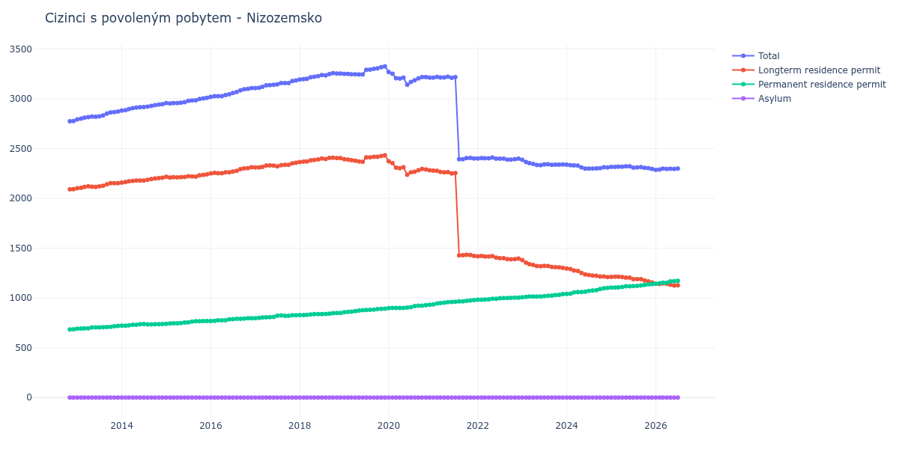

# Nizozemsko

## Souhrnné statistiky (Min/Max pro rok) / Summary Statistics (Min/Max per year)

| Year   | Total         | Longterm Residence Permit   | Permanent Residence Permit   | Asylum   |
|--------|---------------|-----------------------------|------------------------------|----------|
| 2012   | 2 774 / 2 777 | 2 091 / 2 092               | 683 / 685                    | 0 / 0    |
| 2013   | 2 793 / 2 872 | 2 102 / 2 152               | 691 / 720                    | 0 / 0    |
| 2014   | 2 881 / 2 946 | 2 159 / 2 208               | 722 / 738                    | 0 / 0    |
| 2015   | 2 953 / 3 010 | 2 210 / 2 241               | 741 / 769                    | 0 / 0    |
| 2016   | 3 019 / 3 108 | 2 250 / 2 312               | 769 / 796                    | 0 / 0    |
| 2017   | 3 107 / 3 185 | 2 310 / 2 358               | 796 / 827                    | 0 / 0    |
| 2018   | 3 193 / 3 257 | 2 365 / 2 409               | 828 / 849                    | 0 / 0    |
| 2019   | 3 244 / 3 325 | 2 367 / 2 432               | 856 / 893                    | 0 / 0    |
| 2020   | 3 141 / 3 269 | 2 238 / 2 372               | 897 / 931                    | 0 / 0    |
| 2021   | 2 393 / 3 221 | 1 422 / 2 278               | 935 / 978                    | 0 / 0    |
| 2022   | 2 389 / 2 411 | 1 388 / 1 422               | 982 / 1 004                  | 0 / 0    |
| 2023   | 2 333 / 2 387 | 1 302 / 1 380               | 1 007 / 1 038                | 0 / 0    |
| 2024   | 2 299 / 2 338 | 1 210 / 1 297               | 1 041 / 1 100                | 0 / 0    |
| 2025   | 2 295 / 2 322 | 1 156 / 1 213               | 1 104 / 1 139                | 0 / 0    |
| 2026   | 2 287 / 2 299 | 1 126 / 1 146               | 1 144 / 1 172                | 0 / 0    |

## Detailní tabulka / Detailed Data Table

| Date     | Total           | Longterm Residence Permit   | Permanent Residence Permit   | Asylum   |
|----------|-----------------|-----------------------------|------------------------------|----------|
| **2012** |                 |                             |                              |          |
| 11.2012  | 2 774           | 2 091                       | 683                          | 0        |
| 12.2012  | 2 777 (+0.11%)  | 2 092 (+0.05%)              | 685 (+0.29%)                 | 0        |
| **2013** |                 |                             |                              |          |
| 01.2013  | 2 793 (+0.58%)  | 2 102 (+0.48%)              | 691 (+0.88%)                 | 0        |
| 02.2013  | 2 800 (+0.25%)  | 2 106 (+0.19%)              | 694 (+0.43%)                 | 0        |
| 03.2013  | 2 811 (+0.39%)  | 2 116 (+0.47%)              | 695 (+0.14%)                 | 0        |
| 04.2013  | 2 815 (+0.14%)  | 2 120 (+0.19%)              | 695 (+0.00%)                 | 0        |
| 05.2013  | 2 821 (+0.21%)  | 2 117 (-0.14%)              | 704 (+1.29%)                 | 0        |
| 06.2013  | 2 819 (-0.07%)  | 2 115 (-0.09%)              | 704 (+0.00%)                 | 0        |
| 07.2013  | 2 824 (+0.18%)  | 2 120 (+0.24%)              | 704 (+0.00%)                 | 0        |
| 08.2013  | 2 833 (+0.32%)  | 2 126 (+0.28%)              | 707 (+0.43%)                 | 0        |
| 09.2013  | 2 851 (+0.64%)  | 2 142 (+0.75%)              | 709 (+0.28%)                 | 0        |
| 10.2013  | 2 863 (+0.42%)  | 2 152 (+0.47%)              | 711 (+0.28%)                 | 0        |
| 11.2013  | 2 867 (+0.14%)  | 2 152 (+0.00%)              | 715 (+0.56%)                 | 0        |
| 12.2013  | 2 872 (+0.17%)  | 2 152 (+0.00%)              | 720 (+0.70%)                 | 0        |
| **2014** |                 |                             |                              |          |
| 01.2014  | 2 881 (+0.31%)  | 2 159 (+0.33%)              | 722 (+0.28%)                 | 0        |
| 02.2014  | 2 886 (+0.17%)  | 2 164 (+0.23%)              | 722 (+0.00%)                 | 0        |
| 03.2014  | 2 897 (+0.38%)  | 2 171 (+0.32%)              | 726 (+0.55%)                 | 0        |
| 04.2014  | 2 906 (+0.31%)  | 2 175 (+0.18%)              | 731 (+0.69%)                 | 0        |
| 05.2014  | 2 911 (+0.17%)  | 2 180 (+0.23%)              | 731 (+0.00%)                 | 0        |
| 06.2014  | 2 915 (+0.14%)  | 2 179 (-0.05%)              | 736 (+0.68%)                 | 0        |
| 07.2014  | 2 918 (+0.10%)  | 2 180 (+0.05%)              | 738 (+0.27%)                 | 0        |
| 08.2014  | 2 921 (+0.10%)  | 2 186 (+0.28%)              | 735 (-0.41%)                 | 0        |
| 09.2014  | 2 928 (+0.24%)  | 2 194 (+0.37%)              | 734 (-0.14%)                 | 0        |
| 10.2014  | 2 936 (+0.27%)  | 2 200 (+0.27%)              | 736 (+0.27%)                 | 0        |
| 11.2014  | 2 941 (+0.17%)  | 2 204 (+0.18%)              | 737 (+0.14%)                 | 0        |
| 12.2014  | 2 946 (+0.17%)  | 2 208 (+0.18%)              | 738 (+0.14%)                 | 0        |
| **2015** |                 |                             |                              |          |
| 01.2015  | 2 957 (+0.37%)  | 2 216 (+0.36%)              | 741 (+0.41%)                 | 0        |
| 02.2015  | 2 953 (-0.14%)  | 2 210 (-0.27%)              | 743 (+0.27%)                 | 0        |
| 03.2015  | 2 957 (+0.14%)  | 2 212 (+0.09%)              | 745 (+0.27%)                 | 0        |
| 04.2015  | 2 956 (-0.03%)  | 2 211 (-0.05%)              | 745 (+0.00%)                 | 0        |
| 05.2015  | 2 960 (+0.14%)  | 2 212 (+0.05%)              | 748 (+0.40%)                 | 0        |
| 06.2015  | 2 967 (+0.24%)  | 2 214 (+0.09%)              | 753 (+0.67%)                 | 0        |
| 07.2015  | 2 979 (+0.40%)  | 2 223 (+0.41%)              | 756 (+0.40%)                 | 0        |
| 08.2015  | 2 983 (+0.13%)  | 2 220 (-0.13%)              | 763 (+0.93%)                 | 0        |
| 09.2015  | 2 985 (+0.07%)  | 2 219 (-0.05%)              | 766 (+0.39%)                 | 0        |
| 10.2015  | 2 998 (+0.44%)  | 2 232 (+0.59%)              | 766 (+0.00%)                 | 0        |
| 11.2015  | 3 004 (+0.20%)  | 2 236 (+0.18%)              | 768 (+0.26%)                 | 0        |
| 12.2015  | 3 010 (+0.20%)  | 2 241 (+0.22%)              | 769 (+0.13%)                 | 0        |
| **2016** |                 |                             |                              |          |
| 01.2016  | 3 019 (+0.30%)  | 2 250 (+0.40%)              | 769 (+0.00%)                 | 0        |
| 02.2016  | 3 027 (+0.26%)  | 2 256 (+0.27%)              | 771 (+0.26%)                 | 0        |
| 03.2016  | 3 027 (+0.00%)  | 2 252 (-0.18%)              | 775 (+0.52%)                 | 0        |
| 04.2016  | 3 027 (+0.00%)  | 2 252 (+0.00%)              | 775 (+0.00%)                 | 0        |
| 05.2016  | 3 038 (+0.36%)  | 2 262 (+0.44%)              | 776 (+0.13%)                 | 0        |
| 06.2016  | 3 046 (+0.26%)  | 2 261 (-0.04%)              | 785 (+1.16%)                 | 0        |
| 07.2016  | 3 058 (+0.39%)  | 2 270 (+0.40%)              | 788 (+0.38%)                 | 0        |
| 08.2016  | 3 067 (+0.29%)  | 2 277 (+0.31%)              | 790 (+0.25%)                 | 0        |
| 09.2016  | 3 084 (+0.55%)  | 2 294 (+0.75%)              | 790 (+0.00%)                 | 0        |
| 10.2016  | 3 095 (+0.36%)  | 2 302 (+0.35%)              | 793 (+0.38%)                 | 0        |
| 11.2016  | 3 099 (+0.13%)  | 2 303 (+0.04%)              | 796 (+0.38%)                 | 0        |
| 12.2016  | 3 108 (+0.29%)  | 2 312 (+0.39%)              | 796 (+0.00%)                 | 0        |
| **2017** |                 |                             |                              |          |
| 01.2017  | 3 107 (-0.03%)  | 2 311 (-0.04%)              | 796 (+0.00%)                 | 0        |
| 02.2017  | 3 111 (+0.13%)  | 2 310 (-0.04%)              | 801 (+0.63%)                 | 0        |
| 03.2017  | 3 120 (+0.29%)  | 2 316 (+0.26%)              | 804 (+0.37%)                 | 0        |
| 04.2017  | 3 135 (+0.48%)  | 2 329 (+0.56%)              | 806 (+0.25%)                 | 0        |
| 05.2017  | 3 138 (+0.10%)  | 2 331 (+0.09%)              | 807 (+0.12%)                 | 0        |
| 06.2017  | 3 140 (+0.06%)  | 2 330 (-0.04%)              | 810 (+0.37%)                 | 0        |
| 07.2017  | 3 144 (+0.13%)  | 2 322 (-0.34%)              | 822 (+1.48%)                 | 0        |
| 08.2017  | 3 158 (+0.45%)  | 2 334 (+0.52%)              | 824 (+0.24%)                 | 0        |
| 09.2017  | 3 157 (-0.03%)  | 2 336 (+0.09%)              | 821 (-0.36%)                 | 0        |
| 10.2017  | 3 158 (+0.03%)  | 2 337 (+0.04%)              | 821 (+0.00%)                 | 0        |
| 11.2017  | 3 178 (+0.63%)  | 2 351 (+0.60%)              | 827 (+0.73%)                 | 0        |
| 12.2017  | 3 185 (+0.22%)  | 2 358 (+0.30%)              | 827 (+0.00%)                 | 0        |
| **2018** |                 |                             |                              |          |
| 01.2018  | 3 193 (+0.25%)  | 2 365 (+0.30%)              | 828 (+0.12%)                 | 0        |
| 02.2018  | 3 198 (+0.16%)  | 2 369 (+0.17%)              | 829 (+0.12%)                 | 0        |
| 03.2018  | 3 201 (+0.09%)  | 2 370 (+0.04%)              | 831 (+0.24%)                 | 0        |
| 04.2018  | 3 216 (+0.47%)  | 2 382 (+0.51%)              | 834 (+0.36%)                 | 0        |
| 05.2018  | 3 222 (+0.19%)  | 2 385 (+0.13%)              | 837 (+0.36%)                 | 0        |
| 06.2018  | 3 228 (+0.19%)  | 2 391 (+0.25%)              | 837 (+0.00%)                 | 0        |
| 07.2018  | 3 239 (+0.34%)  | 2 401 (+0.42%)              | 838 (+0.12%)                 | 0        |
| 08.2018  | 3 235 (-0.12%)  | 2 396 (-0.21%)              | 839 (+0.12%)                 | 0        |
| 09.2018  | 3 248 (+0.40%)  | 2 407 (+0.46%)              | 841 (+0.24%)                 | 0        |
| 10.2018  | 3 257 (+0.28%)  | 2 409 (+0.08%)              | 848 (+0.83%)                 | 0        |
| 11.2018  | 3 254 (-0.09%)  | 2 405 (-0.17%)              | 849 (+0.12%)                 | 0        |
| 12.2018  | 3 254 (+0.00%)  | 2 405 (+0.00%)              | 849 (+0.00%)                 | 0        |
| **2019** |                 |                             |                              |          |
| 01.2019  | 3 250 (-0.12%)  | 2 394 (-0.46%)              | 856 (+0.82%)                 | 0        |
| 02.2019  | 3 249 (-0.03%)  | 2 389 (-0.21%)              | 860 (+0.47%)                 | 0        |
| 03.2019  | 3 246 (-0.09%)  | 2 384 (-0.21%)              | 862 (+0.23%)                 | 0        |
| 04.2019  | 3 246 (+0.00%)  | 2 378 (-0.25%)              | 868 (+0.70%)                 | 0        |
| 05.2019  | 3 245 (-0.03%)  | 2 371 (-0.29%)              | 874 (+0.69%)                 | 0        |
| 06.2019  | 3 244 (-0.03%)  | 2 367 (-0.17%)              | 877 (+0.34%)                 | 0        |
| 07.2019  | 3 291 (+1.45%)  | 2 412 (+1.90%)              | 879 (+0.23%)                 | 0        |
| 08.2019  | 3 293 (+0.06%)  | 2 412 (+0.00%)              | 881 (+0.23%)                 | 0        |
| 09.2019  | 3 300 (+0.21%)  | 2 417 (+0.21%)              | 883 (+0.23%)                 | 0        |
| 10.2019  | 3 307 (+0.21%)  | 2 418 (+0.04%)              | 889 (+0.68%)                 | 0        |
| 11.2019  | 3 317 (+0.30%)  | 2 426 (+0.33%)              | 891 (+0.22%)                 | 0        |
| 12.2019  | 3 325 (+0.24%)  | 2 432 (+0.25%)              | 893 (+0.22%)                 | 0        |
| **2020** |                 |                             |                              |          |
| 01.2020  | 3 269 (-1.68%)  | 2 372 (-2.47%)              | 897 (+0.45%)                 | 0        |
| 02.2020  | 3 252 (-0.52%)  | 2 353 (-0.80%)              | 899 (+0.22%)                 | 0        |
| 03.2020  | 3 207 (-1.38%)  | 2 308 (-1.91%)              | 899 (+0.00%)                 | 0        |
| 04.2020  | 3 203 (-0.12%)  | 2 304 (-0.17%)              | 899 (+0.00%)                 | 0        |
| 05.2020  | 3 212 (+0.28%)  | 2 312 (+0.35%)              | 900 (+0.11%)                 | 0        |
| 06.2020  | 3 141 (-2.21%)  | 2 238 (-3.20%)              | 903 (+0.33%)                 | 0        |
| 07.2020  | 3 169 (+0.89%)  | 2 262 (+1.07%)              | 907 (+0.44%)                 | 0        |
| 08.2020  | 3 186 (+0.54%)  | 2 267 (+0.22%)              | 919 (+1.32%)                 | 0        |
| 09.2020  | 3 204 (+0.56%)  | 2 282 (+0.66%)              | 922 (+0.33%)                 | 0        |
| 10.2020  | 3 218 (+0.44%)  | 2 295 (+0.57%)              | 923 (+0.11%)                 | 0        |
| 11.2020  | 3 217 (-0.03%)  | 2 289 (-0.26%)              | 928 (+0.54%)                 | 0        |
| 12.2020  | 3 213 (-0.12%)  | 2 282 (-0.31%)              | 931 (+0.32%)                 | 0        |
| **2021** |                 |                             |                              |          |
| 01.2021  | 3 213 (+0.00%)  | 2 278 (-0.18%)              | 935 (+0.43%)                 | 0        |
| 02.2021  | 3 220 (+0.22%)  | 2 276 (-0.09%)              | 944 (+0.96%)                 | 0        |
| 03.2021  | 3 214 (-0.19%)  | 2 265 (-0.48%)              | 949 (+0.53%)                 | 0        |
| 04.2021  | 3 214 (+0.00%)  | 2 261 (-0.18%)              | 953 (+0.42%)                 | 0        |
| 05.2021  | 3 221 (+0.22%)  | 2 263 (+0.09%)              | 958 (+0.52%)                 | 0        |
| 06.2021  | 3 210 (-0.34%)  | 2 250 (-0.57%)              | 960 (+0.21%)                 | 0        |
| 07.2021  | 3 217 (+0.22%)  | 2 255 (+0.22%)              | 962 (+0.21%)                 | 0        |
| 08.2021  | 2 393 (-25.61%) | 1 428 (-36.67%)             | 965 (+0.31%)                 | 0        |
| 09.2021  | 2 394 (+0.04%)  | 1 429 (+0.07%)              | 965 (+0.00%)                 | 0        |
| 10.2021  | 2 404 (+0.42%)  | 1 433 (+0.28%)              | 971 (+0.62%)                 | 0        |
| 11.2021  | 2 406 (+0.08%)  | 1 431 (-0.14%)              | 975 (+0.41%)                 | 0        |
| 12.2021  | 2 400 (-0.25%)  | 1 422 (-0.63%)              | 978 (+0.31%)                 | 0        |
| **2022** |                 |                             |                              |          |
| 01.2022  | 2 400 (+0.00%)  | 1 418 (-0.28%)              | 982 (+0.41%)                 | 0        |
| 02.2022  | 2 405 (+0.21%)  | 1 422 (+0.28%)              | 983 (+0.10%)                 | 0        |
| 03.2022  | 2 402 (-0.12%)  | 1 417 (-0.35%)              | 985 (+0.20%)                 | 0        |
| 04.2022  | 2 403 (+0.04%)  | 1 416 (-0.07%)              | 987 (+0.20%)                 | 0        |
| 05.2022  | 2 411 (+0.33%)  | 1 420 (+0.28%)              | 991 (+0.41%)                 | 0        |
| 06.2022  | 2 398 (-0.54%)  | 1 406 (-0.99%)              | 992 (+0.10%)                 | 0        |
| 07.2022  | 2 398 (+0.00%)  | 1 400 (-0.43%)              | 998 (+0.60%)                 | 0        |
| 08.2022  | 2 399 (+0.04%)  | 1 400 (+0.00%)              | 999 (+0.10%)                 | 0        |
| 09.2022  | 2 389 (-0.42%)  | 1 390 (-0.71%)              | 999 (+0.00%)                 | 0        |
| 10.2022  | 2 389 (+0.00%)  | 1 388 (-0.14%)              | 1 001 (+0.20%)               | 0        |
| 11.2022  | 2 394 (+0.21%)  | 1 390 (+0.14%)              | 1 004 (+0.30%)               | 0        |
| 12.2022  | 2 398 (+0.17%)  | 1 395 (+0.36%)              | 1 003 (-0.10%)               | 0        |
| **2023** |                 |                             |                              |          |
| 01.2023  | 2 387 (-0.46%)  | 1 380 (-1.08%)              | 1 007 (+0.40%)               | 0        |
| 02.2023  | 2 365 (-0.92%)  | 1 355 (-1.81%)              | 1 010 (+0.30%)               | 0        |
| 03.2023  | 2 354 (-0.47%)  | 1 340 (-1.11%)              | 1 014 (+0.40%)               | 0        |
| 04.2023  | 2 346 (-0.34%)  | 1 332 (-0.60%)              | 1 014 (+0.00%)               | 0        |
| 05.2023  | 2 335 (-0.47%)  | 1 321 (-0.83%)              | 1 014 (+0.00%)               | 0        |
| 06.2023  | 2 333 (-0.09%)  | 1 318 (-0.23%)              | 1 015 (+0.10%)               | 0        |
| 07.2023  | 2 341 (+0.34%)  | 1 323 (+0.38%)              | 1 018 (+0.30%)               | 0        |
| 08.2023  | 2 342 (+0.04%)  | 1 320 (-0.23%)              | 1 022 (+0.39%)               | 0        |
| 09.2023  | 2 336 (-0.26%)  | 1 312 (-0.61%)              | 1 024 (+0.20%)               | 0        |
| 10.2023  | 2 339 (+0.13%)  | 1 310 (-0.15%)              | 1 029 (+0.49%)               | 0        |
| 11.2023  | 2 339 (+0.00%)  | 1 308 (-0.15%)              | 1 031 (+0.19%)               | 0        |
| 12.2023  | 2 340 (+0.04%)  | 1 302 (-0.46%)              | 1 038 (+0.68%)               | 0        |
| **2024** |                 |                             |                              |          |
| 01.2024  | 2 338 (-0.09%)  | 1 297 (-0.38%)              | 1 041 (+0.29%)               | 0        |
| 02.2024  | 2 334 (-0.17%)  | 1 291 (-0.46%)              | 1 043 (+0.19%)               | 0        |
| 03.2024  | 2 331 (-0.13%)  | 1 276 (-1.16%)              | 1 055 (+1.15%)               | 0        |
| 04.2024  | 2 330 (-0.04%)  | 1 271 (-0.39%)              | 1 059 (+0.38%)               | 0        |
| 05.2024  | 2 311 (-0.82%)  | 1 251 (-1.57%)              | 1 060 (+0.09%)               | 0        |
| 06.2024  | 2 299 (-0.52%)  | 1 236 (-1.20%)              | 1 063 (+0.28%)               | 0        |
| 07.2024  | 2 300 (+0.04%)  | 1 230 (-0.49%)              | 1 070 (+0.66%)               | 0        |
| 08.2024  | 2 299 (-0.04%)  | 1 225 (-0.41%)              | 1 074 (+0.37%)               | 0        |
| 09.2024  | 2 301 (+0.09%)  | 1 222 (-0.24%)              | 1 079 (+0.47%)               | 0        |
| 10.2024  | 2 304 (+0.13%)  | 1 215 (-0.57%)              | 1 089 (+0.93%)               | 0        |
| 11.2024  | 2 312 (+0.35%)  | 1 215 (+0.00%)              | 1 097 (+0.73%)               | 0        |
| 12.2024  | 2 310 (-0.09%)  | 1 210 (-0.41%)              | 1 100 (+0.27%)               | 0        |
| **2025** |                 |                             |                              |          |
| 01.2025  | 2 316 (+0.26%)  | 1 212 (+0.17%)              | 1 104 (+0.36%)               | 0        |
| 02.2025  | 2 317 (+0.04%)  | 1 213 (+0.08%)              | 1 104 (+0.00%)               | 0        |
| 03.2025  | 2 319 (+0.09%)  | 1 213 (+0.00%)              | 1 106 (+0.18%)               | 0        |
| 04.2025  | 2 319 (+0.00%)  | 1 209 (-0.33%)              | 1 110 (+0.36%)               | 0        |
| 05.2025  | 2 321 (+0.09%)  | 1 204 (-0.41%)              | 1 117 (+0.63%)               | 0        |
| 06.2025  | 2 322 (+0.04%)  | 1 205 (+0.08%)              | 1 117 (+0.00%)               | 0        |
| 07.2025  | 2 309 (-0.56%)  | 1 190 (-1.24%)              | 1 119 (+0.18%)               | 0        |
| 08.2025  | 2 311 (+0.09%)  | 1 189 (-0.08%)              | 1 122 (+0.27%)               | 0        |
| 09.2025  | 2 315 (+0.17%)  | 1 189 (+0.00%)              | 1 126 (+0.36%)               | 0        |
| 10.2025  | 2 306 (-0.39%)  | 1 176 (-1.09%)              | 1 130 (+0.36%)               | 0        |
| 11.2025  | 2 303 (-0.13%)  | 1 166 (-0.85%)              | 1 137 (+0.62%)               | 0        |
| 12.2025  | 2 295 (-0.35%)  | 1 156 (-0.86%)              | 1 139 (+0.18%)               | 0        |
| **2026** |                 |                             |                              |          |
| 01.2026  | 2 287 (-0.35%)  | 1 143 (-1.12%)              | 1 144 (+0.44%)               | 0        |
| 02.2026  | 2 289 (+0.09%)  | 1 141 (-0.17%)              | 1 148 (+0.35%)               | 0        |
| 03.2026  | 2 299 (+0.44%)  | 1 146 (+0.44%)              | 1 153 (+0.44%)               | 0        |
| 04.2026  | 2 296 (-0.13%)  | 1 142 (-0.35%)              | 1 154 (+0.09%)               | 0        |
| 05.2026  | 2 298 (+0.09%)  | 1 132 (-0.88%)              | 1 166 (+1.04%)               | 0        |
| 06.2026  | 2 295 (-0.13%)  | 1 126 (-0.53%)              | 1 169 (+0.26%)               | 0        |
| 07.2026  | 2 299 (+0.17%)  | 1 127 (+0.09%)              | 1 172 (+0.26%)               | 0        |
