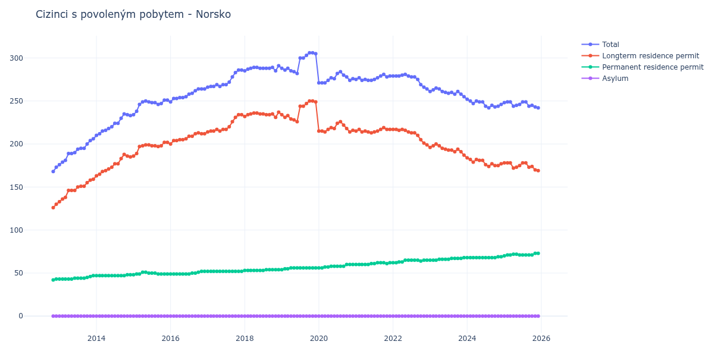

# Norsko

## Souhrnné statistiky (Min/Max pro rok) / Summary Statistics (Min/Max per year)

| Year   | Total Min/Max   | Longterm Residence Permit Min/Max   | Permanent Residence Permit Min/Max   | Asylum Min/Max   |
|--------|-----------------|-------------------------------------|--------------------------------------|------------------|
| 2012   | 168 / 173       | 126 / 130                           | 42 / 43                              | 0 / 0            |
| 2013   | 176 / 206       | 133 / 159                           | 43 / 47                              | 0 / 0            |
| 2014   | 210 / 235       | 163 / 188                           | 47 / 48                              | 0 / 0            |
| 2015   | 234 / 251       | 186 / 202                           | 48 / 51                              | 0 / 0            |
| 2016   | 249 / 264       | 200 / 213                           | 49 / 52                              | 0 / 0            |
| 2017   | 266 / 286       | 214 / 234                           | 52 / 52                              | 0 / 0            |
| 2018   | 285 / 291       | 231 / 237                           | 53 / 54                              | 0 / 0            |
| 2019   | 282 / 306       | 226 / 250                           | 54 / 56                              | 0 / 0            |
| 2020   | 271 / 284       | 214 / 226                           | 56 / 60                              | 0 / 0            |
| 2021   | 274 / 281       | 213 / 219                           | 60 / 62                              | 0 / 0            |
| 2022   | 264 / 281       | 199 / 217                           | 62 / 65                              | 0 / 0            |
| 2023   | 255 / 265       | 187 / 200                           | 65 / 68                              | 0 / 0            |
| 2024   | 242 / 252       | 174 / 184                           | 68 / 69                              | 0 / 0            |
| 2025   | 242 / 249       | 169 / 178                           | 70 / 73                              | 0 / 0            |

## Detailní tabulka / Detailed Data Table

| Date     | Total         | Longterm Residence Permit   | Permanent Residence Permit   | Asylum   |
|----------|---------------|-----------------------------|------------------------------|----------|
| **2012** |               |                             |                              |          |
| 11.2012  | 168           | 126                         | 42                           | 0        |
| 12.2012  | 173 (+2.98%)  | 130 (+3.17%)                | 43 (+2.38%)                  | 0        |
| **2013** |               |                             |                              |          |
| 01.2013  | 176 (+1.73%)  | 133 (+2.31%)                | 43 (+0.00%)                  | 0        |
| 02.2013  | 179 (+1.70%)  | 136 (+2.26%)                | 43 (+0.00%)                  | 0        |
| 03.2013  | 181 (+1.12%)  | 138 (+1.47%)                | 43 (+0.00%)                  | 0        |
| 04.2013  | 189 (+4.42%)  | 146 (+5.80%)                | 43 (+0.00%)                  | 0        |
| 05.2013  | 189 (+0.00%)  | 146 (+0.00%)                | 43 (+0.00%)                  | 0        |
| 06.2013  | 190 (+0.53%)  | 146 (+0.00%)                | 44 (+2.33%)                  | 0        |
| 07.2013  | 194 (+2.11%)  | 150 (+2.74%)                | 44 (+0.00%)                  | 0        |
| 08.2013  | 195 (+0.52%)  | 151 (+0.67%)                | 44 (+0.00%)                  | 0        |
| 09.2013  | 195 (+0.00%)  | 151 (+0.00%)                | 44 (+0.00%)                  | 0        |
| 10.2013  | 200 (+2.56%)  | 155 (+2.65%)                | 45 (+2.27%)                  | 0        |
| 11.2013  | 204 (+2.00%)  | 158 (+1.94%)                | 46 (+2.22%)                  | 0        |
| 12.2013  | 206 (+0.98%)  | 159 (+0.63%)                | 47 (+2.17%)                  | 0        |
| **2014** |               |                             |                              |          |
| 01.2014  | 210 (+1.94%)  | 163 (+2.52%)                | 47 (+0.00%)                  | 0        |
| 02.2014  | 212 (+0.95%)  | 165 (+1.23%)                | 47 (+0.00%)                  | 0        |
| 03.2014  | 215 (+1.42%)  | 168 (+1.82%)                | 47 (+0.00%)                  | 0        |
| 04.2014  | 216 (+0.47%)  | 169 (+0.60%)                | 47 (+0.00%)                  | 0        |
| 05.2014  | 218 (+0.93%)  | 171 (+1.18%)                | 47 (+0.00%)                  | 0        |
| 06.2014  | 220 (+0.92%)  | 173 (+1.17%)                | 47 (+0.00%)                  | 0        |
| 07.2014  | 224 (+1.82%)  | 177 (+2.31%)                | 47 (+0.00%)                  | 0        |
| 08.2014  | 224 (+0.00%)  | 177 (+0.00%)                | 47 (+0.00%)                  | 0        |
| 09.2014  | 230 (+2.68%)  | 183 (+3.39%)                | 47 (+0.00%)                  | 0        |
| 10.2014  | 235 (+2.17%)  | 188 (+2.73%)                | 47 (+0.00%)                  | 0        |
| 11.2014  | 234 (-0.43%)  | 186 (-1.06%)                | 48 (+2.13%)                  | 0        |
| 12.2014  | 233 (-0.43%)  | 185 (-0.54%)                | 48 (+0.00%)                  | 0        |
| **2015** |               |                             |                              |          |
| 01.2015  | 234 (+0.43%)  | 186 (+0.54%)                | 48 (+0.00%)                  | 0        |
| 02.2015  | 238 (+1.71%)  | 189 (+1.61%)                | 49 (+2.08%)                  | 0        |
| 03.2015  | 246 (+3.36%)  | 197 (+4.23%)                | 49 (+0.00%)                  | 0        |
| 04.2015  | 249 (+1.22%)  | 198 (+0.51%)                | 51 (+4.08%)                  | 0        |
| 05.2015  | 250 (+0.40%)  | 199 (+0.51%)                | 51 (+0.00%)                  | 0        |
| 06.2015  | 249 (-0.40%)  | 199 (+0.00%)                | 50 (-1.96%)                  | 0        |
| 07.2015  | 248 (-0.40%)  | 198 (-0.50%)                | 50 (+0.00%)                  | 0        |
| 08.2015  | 248 (+0.00%)  | 198 (+0.00%)                | 50 (+0.00%)                  | 0        |
| 09.2015  | 246 (-0.81%)  | 197 (-0.51%)                | 49 (-2.00%)                  | 0        |
| 10.2015  | 247 (+0.41%)  | 198 (+0.51%)                | 49 (+0.00%)                  | 0        |
| 11.2015  | 251 (+1.62%)  | 202 (+2.02%)                | 49 (+0.00%)                  | 0        |
| 12.2015  | 251 (+0.00%)  | 202 (+0.00%)                | 49 (+0.00%)                  | 0        |
| **2016** |               |                             |                              |          |
| 01.2016  | 249 (-0.80%)  | 200 (-0.99%)                | 49 (+0.00%)                  | 0        |
| 02.2016  | 253 (+1.61%)  | 204 (+2.00%)                | 49 (+0.00%)                  | 0        |
| 03.2016  | 253 (+0.00%)  | 204 (+0.00%)                | 49 (+0.00%)                  | 0        |
| 04.2016  | 254 (+0.40%)  | 205 (+0.49%)                | 49 (+0.00%)                  | 0        |
| 05.2016  | 254 (+0.00%)  | 205 (+0.00%)                | 49 (+0.00%)                  | 0        |
| 06.2016  | 255 (+0.39%)  | 206 (+0.49%)                | 49 (+0.00%)                  | 0        |
| 07.2016  | 258 (+1.18%)  | 209 (+1.46%)                | 49 (+0.00%)                  | 0        |
| 08.2016  | 259 (+0.39%)  | 209 (+0.00%)                | 50 (+2.04%)                  | 0        |
| 09.2016  | 262 (+1.16%)  | 212 (+1.44%)                | 50 (+0.00%)                  | 0        |
| 10.2016  | 264 (+0.76%)  | 213 (+0.47%)                | 51 (+2.00%)                  | 0        |
| 11.2016  | 264 (+0.00%)  | 212 (-0.47%)                | 52 (+1.96%)                  | 0        |
| 12.2016  | 264 (+0.00%)  | 212 (+0.00%)                | 52 (+0.00%)                  | 0        |
| **2017** |               |                             |                              |          |
| 01.2017  | 266 (+0.76%)  | 214 (+0.94%)                | 52 (+0.00%)                  | 0        |
| 02.2017  | 267 (+0.38%)  | 215 (+0.47%)                | 52 (+0.00%)                  | 0        |
| 03.2017  | 267 (+0.00%)  | 215 (+0.00%)                | 52 (+0.00%)                  | 0        |
| 04.2017  | 269 (+0.75%)  | 217 (+0.93%)                | 52 (+0.00%)                  | 0        |
| 05.2017  | 267 (-0.74%)  | 215 (-0.92%)                | 52 (+0.00%)                  | 0        |
| 06.2017  | 269 (+0.75%)  | 217 (+0.93%)                | 52 (+0.00%)                  | 0        |
| 07.2017  | 269 (+0.00%)  | 217 (+0.00%)                | 52 (+0.00%)                  | 0        |
| 08.2017  | 272 (+1.12%)  | 220 (+1.38%)                | 52 (+0.00%)                  | 0        |
| 09.2017  | 278 (+2.21%)  | 226 (+2.73%)                | 52 (+0.00%)                  | 0        |
| 10.2017  | 283 (+1.80%)  | 231 (+2.21%)                | 52 (+0.00%)                  | 0        |
| 11.2017  | 286 (+1.06%)  | 234 (+1.30%)                | 52 (+0.00%)                  | 0        |
| 12.2017  | 286 (+0.00%)  | 234 (+0.00%)                | 52 (+0.00%)                  | 0        |
| **2018** |               |                             |                              |          |
| 01.2018  | 285 (-0.35%)  | 232 (-0.85%)                | 53 (+1.92%)                  | 0        |
| 02.2018  | 287 (+0.70%)  | 234 (+0.86%)                | 53 (+0.00%)                  | 0        |
| 03.2018  | 288 (+0.35%)  | 235 (+0.43%)                | 53 (+0.00%)                  | 0        |
| 04.2018  | 289 (+0.35%)  | 236 (+0.43%)                | 53 (+0.00%)                  | 0        |
| 05.2018  | 289 (+0.00%)  | 236 (+0.00%)                | 53 (+0.00%)                  | 0        |
| 06.2018  | 288 (-0.35%)  | 235 (-0.42%)                | 53 (+0.00%)                  | 0        |
| 07.2018  | 288 (+0.00%)  | 235 (+0.00%)                | 53 (+0.00%)                  | 0        |
| 08.2018  | 288 (+0.00%)  | 234 (-0.43%)                | 54 (+1.89%)                  | 0        |
| 09.2018  | 288 (+0.00%)  | 234 (+0.00%)                | 54 (+0.00%)                  | 0        |
| 10.2018  | 289 (+0.35%)  | 235 (+0.43%)                | 54 (+0.00%)                  | 0        |
| 11.2018  | 285 (-1.38%)  | 231 (-1.70%)                | 54 (+0.00%)                  | 0        |
| 12.2018  | 291 (+2.11%)  | 237 (+2.60%)                | 54 (+0.00%)                  | 0        |
| **2019** |               |                             |                              |          |
| 01.2019  | 288 (-1.03%)  | 234 (-1.27%)                | 54 (+0.00%)                  | 0        |
| 02.2019  | 286 (-0.69%)  | 231 (-1.28%)                | 55 (+1.85%)                  | 0        |
| 03.2019  | 288 (+0.70%)  | 233 (+0.87%)                | 55 (+0.00%)                  | 0        |
| 04.2019  | 285 (-1.04%)  | 229 (-1.72%)                | 56 (+1.82%)                  | 0        |
| 05.2019  | 284 (-0.35%)  | 228 (-0.44%)                | 56 (+0.00%)                  | 0        |
| 06.2019  | 282 (-0.70%)  | 226 (-0.88%)                | 56 (+0.00%)                  | 0        |
| 07.2019  | 300 (+6.38%)  | 244 (+7.96%)                | 56 (+0.00%)                  | 0        |
| 08.2019  | 300 (+0.00%)  | 244 (+0.00%)                | 56 (+0.00%)                  | 0        |
| 09.2019  | 303 (+1.00%)  | 247 (+1.23%)                | 56 (+0.00%)                  | 0        |
| 10.2019  | 306 (+0.99%)  | 250 (+1.21%)                | 56 (+0.00%)                  | 0        |
| 11.2019  | 306 (+0.00%)  | 250 (+0.00%)                | 56 (+0.00%)                  | 0        |
| 12.2019  | 305 (-0.33%)  | 249 (-0.40%)                | 56 (+0.00%)                  | 0        |
| **2020** |               |                             |                              |          |
| 01.2020  | 271 (-11.15%) | 215 (-13.65%)               | 56 (+0.00%)                  | 0        |
| 02.2020  | 271 (+0.00%)  | 215 (+0.00%)                | 56 (+0.00%)                  | 0        |
| 03.2020  | 271 (+0.00%)  | 214 (-0.47%)                | 57 (+1.79%)                  | 0        |
| 04.2020  | 274 (+1.11%)  | 217 (+1.40%)                | 57 (+0.00%)                  | 0        |
| 05.2020  | 277 (+1.09%)  | 219 (+0.92%)                | 58 (+1.75%)                  | 0        |
| 06.2020  | 276 (-0.36%)  | 218 (-0.46%)                | 58 (+0.00%)                  | 0        |
| 07.2020  | 282 (+2.17%)  | 224 (+2.75%)                | 58 (+0.00%)                  | 0        |
| 08.2020  | 284 (+0.71%)  | 226 (+0.89%)                | 58 (+0.00%)                  | 0        |
| 09.2020  | 280 (-1.41%)  | 222 (-1.77%)                | 58 (+0.00%)                  | 0        |
| 10.2020  | 278 (-0.71%)  | 218 (-1.80%)                | 60 (+3.45%)                  | 0        |
| 11.2020  | 274 (-1.44%)  | 214 (-1.83%)                | 60 (+0.00%)                  | 0        |
| 12.2020  | 276 (+0.73%)  | 216 (+0.93%)                | 60 (+0.00%)                  | 0        |
| **2021** |               |                             |                              |          |
| 01.2021  | 275 (-0.36%)  | 215 (-0.46%)                | 60 (+0.00%)                  | 0        |
| 02.2021  | 277 (+0.73%)  | 217 (+0.93%)                | 60 (+0.00%)                  | 0        |
| 03.2021  | 274 (-1.08%)  | 214 (-1.38%)                | 60 (+0.00%)                  | 0        |
| 04.2021  | 275 (+0.36%)  | 215 (+0.47%)                | 60 (+0.00%)                  | 0        |
| 05.2021  | 274 (-0.36%)  | 214 (-0.47%)                | 60 (+0.00%)                  | 0        |
| 06.2021  | 274 (+0.00%)  | 213 (-0.47%)                | 61 (+1.67%)                  | 0        |
| 07.2021  | 275 (+0.36%)  | 214 (+0.47%)                | 61 (+0.00%)                  | 0        |
| 08.2021  | 277 (+0.73%)  | 215 (+0.47%)                | 62 (+1.64%)                  | 0        |
| 09.2021  | 279 (+0.72%)  | 217 (+0.93%)                | 62 (+0.00%)                  | 0        |
| 10.2021  | 281 (+0.72%)  | 219 (+0.92%)                | 62 (+0.00%)                  | 0        |
| 11.2021  | 278 (-1.07%)  | 217 (-0.91%)                | 61 (-1.61%)                  | 0        |
| 12.2021  | 279 (+0.36%)  | 217 (+0.00%)                | 62 (+1.64%)                  | 0        |
| **2022** |               |                             |                              |          |
| 01.2022  | 279 (+0.00%)  | 217 (+0.00%)                | 62 (+0.00%)                  | 0        |
| 02.2022  | 279 (+0.00%)  | 217 (+0.00%)                | 62 (+0.00%)                  | 0        |
| 03.2022  | 279 (+0.00%)  | 216 (-0.46%)                | 63 (+1.61%)                  | 0        |
| 04.2022  | 280 (+0.36%)  | 217 (+0.46%)                | 63 (+0.00%)                  | 0        |
| 05.2022  | 281 (+0.36%)  | 216 (-0.46%)                | 65 (+3.17%)                  | 0        |
| 06.2022  | 279 (-0.71%)  | 214 (-0.93%)                | 65 (+0.00%)                  | 0        |
| 07.2022  | 278 (-0.36%)  | 213 (-0.47%)                | 65 (+0.00%)                  | 0        |
| 08.2022  | 278 (+0.00%)  | 213 (+0.00%)                | 65 (+0.00%)                  | 0        |
| 09.2022  | 275 (-1.08%)  | 210 (-1.41%)                | 65 (+0.00%)                  | 0        |
| 10.2022  | 269 (-2.18%)  | 205 (-2.38%)                | 64 (-1.54%)                  | 0        |
| 11.2022  | 266 (-1.12%)  | 201 (-1.95%)                | 65 (+1.56%)                  | 0        |
| 12.2022  | 264 (-0.75%)  | 199 (-1.00%)                | 65 (+0.00%)                  | 0        |
| **2023** |               |                             |                              |          |
| 01.2023  | 261 (-1.14%)  | 196 (-1.51%)                | 65 (+0.00%)                  | 0        |
| 02.2023  | 263 (+0.77%)  | 198 (+1.02%)                | 65 (+0.00%)                  | 0        |
| 03.2023  | 265 (+0.76%)  | 200 (+1.01%)                | 65 (+0.00%)                  | 0        |
| 04.2023  | 264 (-0.38%)  | 198 (-1.00%)                | 66 (+1.54%)                  | 0        |
| 05.2023  | 261 (-1.14%)  | 195 (-1.52%)                | 66 (+0.00%)                  | 0        |
| 06.2023  | 260 (-0.38%)  | 194 (-0.51%)                | 66 (+0.00%)                  | 0        |
| 07.2023  | 259 (-0.38%)  | 193 (-0.52%)                | 66 (+0.00%)                  | 0        |
| 08.2023  | 260 (+0.39%)  | 193 (+0.00%)                | 67 (+1.52%)                  | 0        |
| 09.2023  | 258 (-0.77%)  | 191 (-1.04%)                | 67 (+0.00%)                  | 0        |
| 10.2023  | 261 (+1.16%)  | 194 (+1.57%)                | 67 (+0.00%)                  | 0        |
| 11.2023  | 258 (-1.15%)  | 191 (-1.55%)                | 67 (+0.00%)                  | 0        |
| 12.2023  | 255 (-1.16%)  | 187 (-2.09%)                | 68 (+1.49%)                  | 0        |
| **2024** |               |                             |                              |          |
| 01.2024  | 252 (-1.18%)  | 184 (-1.60%)                | 68 (+0.00%)                  | 0        |
| 02.2024  | 250 (-0.79%)  | 182 (-1.09%)                | 68 (+0.00%)                  | 0        |
| 03.2024  | 247 (-1.20%)  | 179 (-1.65%)                | 68 (+0.00%)                  | 0        |
| 04.2024  | 250 (+1.21%)  | 182 (+1.68%)                | 68 (+0.00%)                  | 0        |
| 05.2024  | 249 (-0.40%)  | 181 (-0.55%)                | 68 (+0.00%)                  | 0        |
| 06.2024  | 249 (+0.00%)  | 181 (+0.00%)                | 68 (+0.00%)                  | 0        |
| 07.2024  | 244 (-2.01%)  | 176 (-2.76%)                | 68 (+0.00%)                  | 0        |
| 08.2024  | 242 (-0.82%)  | 174 (-1.14%)                | 68 (+0.00%)                  | 0        |
| 09.2024  | 245 (+1.24%)  | 177 (+1.72%)                | 68 (+0.00%)                  | 0        |
| 10.2024  | 243 (-0.82%)  | 175 (-1.13%)                | 68 (+0.00%)                  | 0        |
| 11.2024  | 244 (+0.41%)  | 175 (+0.00%)                | 69 (+1.47%)                  | 0        |
| 12.2024  | 246 (+0.82%)  | 177 (+1.14%)                | 69 (+0.00%)                  | 0        |
| **2025** |               |                             |                              |          |
| 01.2025  | 248 (+0.81%)  | 178 (+0.56%)                | 70 (+1.45%)                  | 0        |
| 02.2025  | 249 (+0.40%)  | 178 (+0.00%)                | 71 (+1.43%)                  | 0        |
| 03.2025  | 249 (+0.00%)  | 178 (+0.00%)                | 71 (+0.00%)                  | 0        |
| 04.2025  | 244 (-2.01%)  | 172 (-3.37%)                | 72 (+1.41%)                  | 0        |
| 05.2025  | 245 (+0.41%)  | 173 (+0.58%)                | 72 (+0.00%)                  | 0        |
| 06.2025  | 246 (+0.41%)  | 175 (+1.16%)                | 71 (-1.39%)                  | 0        |
| 07.2025  | 249 (+1.22%)  | 178 (+1.71%)                | 71 (+0.00%)                  | 0        |
| 08.2025  | 249 (+0.00%)  | 178 (+0.00%)                | 71 (+0.00%)                  | 0        |
| 09.2025  | 244 (-2.01%)  | 173 (-2.81%)                | 71 (+0.00%)                  | 0        |
| 10.2025  | 245 (+0.41%)  | 174 (+0.58%)                | 71 (+0.00%)                  | 0        |
| 11.2025  | 243 (-0.82%)  | 170 (-2.30%)                | 73 (+2.82%)                  | 0        |
| 12.2025  | 242 (-0.41%)  | 169 (-0.59%)                | 73 (+0.00%)                  | 0        |
