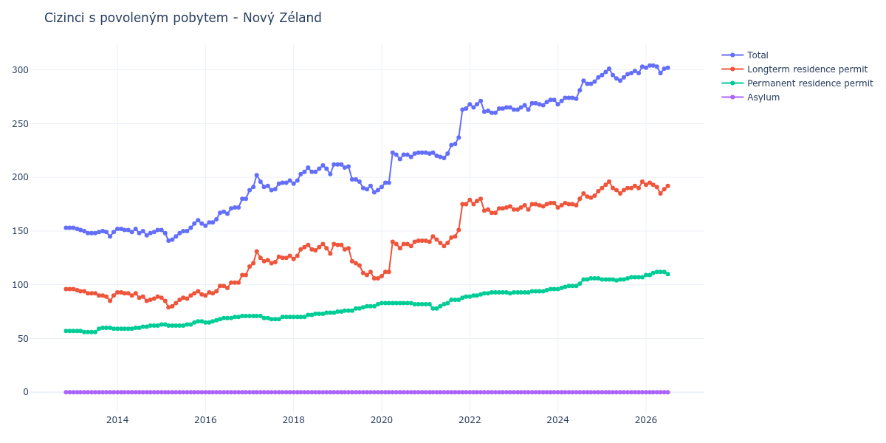

# Nový Zéland

## Souhrnné statistiky (Min/Max pro rok) / Summary Statistics (Min/Max per year)

| Year   | Total     | Longterm Residence Permit   | Permanent Residence Permit   | Asylum   |
|--------|-----------|-----------------------------|------------------------------|----------|
| 2012   | 153 / 153 | 96 / 96                     | 57 / 57                      | 0 / 0    |
| 2013   | 145 / 153 | 85 / 96                     | 56 / 60                      | 0 / 0    |
| 2014   | 146 / 152 | 85 / 93                     | 59 / 62                      | 0 / 0    |
| 2015   | 141 / 160 | 79 / 94                     | 62 / 66                      | 0 / 0    |
| 2016   | 155 / 180 | 90 / 109                    | 65 / 71                      | 0 / 0    |
| 2017   | 188 / 202 | 117 / 131                   | 68 / 71                      | 0 / 0    |
| 2018   | 194 / 212 | 124 / 138                   | 70 / 74                      | 0 / 0    |
| 2019   | 186 / 212 | 106 / 137                   | 75 / 82                      | 0 / 0    |
| 2020   | 191 / 223 | 108 / 141                   | 82 / 83                      | 0 / 0    |
| 2021   | 218 / 264 | 136 / 175                   | 78 / 89                      | 0 / 0    |
| 2022   | 260 / 271 | 167 / 180                   | 89 / 93                      | 0 / 0    |
| 2023   | 263 / 272 | 170 / 176                   | 93 / 96                      | 0 / 0    |
| 2024   | 268 / 293 | 172 / 187                   | 96 / 106                     | 0 / 0    |
| 2025   | 290 / 303 | 185 / 196                   | 104 / 107                    | 0 / 0    |
| 2026   | 297 / 304 | 185 / 195                   | 109 / 112                    | 0 / 0    |

## Detailní tabulka / Detailed Data Table

| Date     | Total         | Longterm Residence Permit   | Permanent Residence Permit   | Asylum   |
|----------|---------------|-----------------------------|------------------------------|----------|
| **2012** |               |                             |                              |          |
| 11.2012  | 153           | 96                          | 57                           | 0        |
| 12.2012  | 153 (+0.00%)  | 96 (+0.00%)                 | 57 (+0.00%)                  | 0        |
| **2013** |               |                             |                              |          |
| 01.2013  | 153 (+0.00%)  | 96 (+0.00%)                 | 57 (+0.00%)                  | 0        |
| 02.2013  | 152 (-0.65%)  | 95 (-1.04%)                 | 57 (+0.00%)                  | 0        |
| 03.2013  | 151 (-0.66%)  | 94 (-1.05%)                 | 57 (+0.00%)                  | 0        |
| 04.2013  | 150 (-0.66%)  | 94 (+0.00%)                 | 56 (-1.75%)                  | 0        |
| 05.2013  | 148 (-1.33%)  | 92 (-2.13%)                 | 56 (+0.00%)                  | 0        |
| 06.2013  | 148 (+0.00%)  | 92 (+0.00%)                 | 56 (+0.00%)                  | 0        |
| 07.2013  | 148 (+0.00%)  | 92 (+0.00%)                 | 56 (+0.00%)                  | 0        |
| 08.2013  | 149 (+0.68%)  | 90 (-2.17%)                 | 59 (+5.36%)                  | 0        |
| 09.2013  | 150 (+0.67%)  | 90 (+0.00%)                 | 60 (+1.69%)                  | 0        |
| 10.2013  | 149 (-0.67%)  | 89 (-1.11%)                 | 60 (+0.00%)                  | 0        |
| 11.2013  | 145 (-2.68%)  | 85 (-4.49%)                 | 60 (+0.00%)                  | 0        |
| 12.2013  | 149 (+2.76%)  | 90 (+5.88%)                 | 59 (-1.67%)                  | 0        |
| **2014** |               |                             |                              |          |
| 01.2014  | 152 (+2.01%)  | 93 (+3.33%)                 | 59 (+0.00%)                  | 0        |
| 02.2014  | 152 (+0.00%)  | 93 (+0.00%)                 | 59 (+0.00%)                  | 0        |
| 03.2014  | 151 (-0.66%)  | 92 (-1.08%)                 | 59 (+0.00%)                  | 0        |
| 04.2014  | 151 (+0.00%)  | 92 (+0.00%)                 | 59 (+0.00%)                  | 0        |
| 05.2014  | 149 (-1.32%)  | 90 (-2.17%)                 | 59 (+0.00%)                  | 0        |
| 06.2014  | 152 (+2.01%)  | 92 (+2.22%)                 | 60 (+1.69%)                  | 0        |
| 07.2014  | 148 (-2.63%)  | 88 (-4.35%)                 | 60 (+0.00%)                  | 0        |
| 08.2014  | 150 (+1.35%)  | 89 (+1.14%)                 | 61 (+1.67%)                  | 0        |
| 09.2014  | 146 (-2.67%)  | 85 (-4.49%)                 | 61 (+0.00%)                  | 0        |
| 10.2014  | 148 (+1.37%)  | 86 (+1.18%)                 | 62 (+1.64%)                  | 0        |
| 11.2014  | 149 (+0.68%)  | 87 (+1.16%)                 | 62 (+0.00%)                  | 0        |
| 12.2014  | 151 (+1.34%)  | 89 (+2.30%)                 | 62 (+0.00%)                  | 0        |
| **2015** |               |                             |                              |          |
| 01.2015  | 151 (+0.00%)  | 88 (-1.12%)                 | 63 (+1.61%)                  | 0        |
| 02.2015  | 148 (-1.99%)  | 85 (-3.41%)                 | 63 (+0.00%)                  | 0        |
| 03.2015  | 141 (-4.73%)  | 79 (-7.06%)                 | 62 (-1.59%)                  | 0        |
| 04.2015  | 142 (+0.71%)  | 80 (+1.27%)                 | 62 (+0.00%)                  | 0        |
| 05.2015  | 145 (+2.11%)  | 83 (+3.75%)                 | 62 (+0.00%)                  | 0        |
| 06.2015  | 148 (+2.07%)  | 86 (+3.61%)                 | 62 (+0.00%)                  | 0        |
| 07.2015  | 150 (+1.35%)  | 88 (+2.33%)                 | 62 (+0.00%)                  | 0        |
| 08.2015  | 150 (+0.00%)  | 87 (-1.14%)                 | 63 (+1.61%)                  | 0        |
| 09.2015  | 153 (+2.00%)  | 90 (+3.45%)                 | 63 (+0.00%)                  | 0        |
| 10.2015  | 157 (+2.61%)  | 92 (+2.22%)                 | 65 (+3.17%)                  | 0        |
| 11.2015  | 160 (+1.91%)  | 94 (+2.17%)                 | 66 (+1.54%)                  | 0        |
| 12.2015  | 157 (-1.88%)  | 91 (-3.19%)                 | 66 (+0.00%)                  | 0        |
| **2016** |               |                             |                              |          |
| 01.2016  | 155 (-1.27%)  | 90 (-1.10%)                 | 65 (-1.52%)                  | 0        |
| 02.2016  | 158 (+1.94%)  | 93 (+3.33%)                 | 65 (+0.00%)                  | 0        |
| 03.2016  | 158 (+0.00%)  | 92 (-1.08%)                 | 66 (+1.54%)                  | 0        |
| 04.2016  | 161 (+1.90%)  | 94 (+2.17%)                 | 67 (+1.52%)                  | 0        |
| 05.2016  | 167 (+3.73%)  | 99 (+5.32%)                 | 68 (+1.49%)                  | 0        |
| 06.2016  | 168 (+0.60%)  | 99 (+0.00%)                 | 69 (+1.47%)                  | 0        |
| 07.2016  | 166 (-1.19%)  | 97 (-2.02%)                 | 69 (+0.00%)                  | 0        |
| 08.2016  | 171 (+3.01%)  | 102 (+5.15%)                | 69 (+0.00%)                  | 0        |
| 09.2016  | 172 (+0.58%)  | 102 (+0.00%)                | 70 (+1.45%)                  | 0        |
| 10.2016  | 172 (+0.00%)  | 102 (+0.00%)                | 70 (+0.00%)                  | 0        |
| 11.2016  | 180 (+4.65%)  | 109 (+6.86%)                | 71 (+1.43%)                  | 0        |
| 12.2016  | 180 (+0.00%)  | 109 (+0.00%)                | 71 (+0.00%)                  | 0        |
| **2017** |               |                             |                              |          |
| 01.2017  | 188 (+4.44%)  | 117 (+7.34%)                | 71 (+0.00%)                  | 0        |
| 02.2017  | 191 (+1.60%)  | 120 (+2.56%)                | 71 (+0.00%)                  | 0        |
| 03.2017  | 202 (+5.76%)  | 131 (+9.17%)                | 71 (+0.00%)                  | 0        |
| 04.2017  | 196 (-2.97%)  | 125 (-4.58%)                | 71 (+0.00%)                  | 0        |
| 05.2017  | 191 (-2.55%)  | 122 (-2.40%)                | 69 (-2.82%)                  | 0        |
| 06.2017  | 192 (+0.52%)  | 123 (+0.82%)                | 69 (+0.00%)                  | 0        |
| 07.2017  | 188 (-2.08%)  | 120 (-2.44%)                | 68 (-1.45%)                  | 0        |
| 08.2017  | 189 (+0.53%)  | 121 (+0.83%)                | 68 (+0.00%)                  | 0        |
| 09.2017  | 194 (+2.65%)  | 126 (+4.13%)                | 68 (+0.00%)                  | 0        |
| 10.2017  | 195 (+0.52%)  | 125 (-0.79%)                | 70 (+2.94%)                  | 0        |
| 11.2017  | 195 (+0.00%)  | 125 (+0.00%)                | 70 (+0.00%)                  | 0        |
| 12.2017  | 197 (+1.03%)  | 127 (+1.60%)                | 70 (+0.00%)                  | 0        |
| **2018** |               |                             |                              |          |
| 01.2018  | 194 (-1.52%)  | 124 (-2.36%)                | 70 (+0.00%)                  | 0        |
| 02.2018  | 197 (+1.55%)  | 127 (+2.42%)                | 70 (+0.00%)                  | 0        |
| 03.2018  | 203 (+3.05%)  | 133 (+4.72%)                | 70 (+0.00%)                  | 0        |
| 04.2018  | 205 (+0.99%)  | 135 (+1.50%)                | 70 (+0.00%)                  | 0        |
| 05.2018  | 209 (+1.95%)  | 137 (+1.48%)                | 72 (+2.86%)                  | 0        |
| 06.2018  | 205 (-1.91%)  | 133 (-2.92%)                | 72 (+0.00%)                  | 0        |
| 07.2018  | 205 (+0.00%)  | 132 (-0.75%)                | 73 (+1.39%)                  | 0        |
| 08.2018  | 208 (+1.46%)  | 135 (+2.27%)                | 73 (+0.00%)                  | 0        |
| 09.2018  | 211 (+1.44%)  | 138 (+2.22%)                | 73 (+0.00%)                  | 0        |
| 10.2018  | 208 (-1.42%)  | 134 (-2.90%)                | 74 (+1.37%)                  | 0        |
| 11.2018  | 203 (-2.40%)  | 129 (-3.73%)                | 74 (+0.00%)                  | 0        |
| 12.2018  | 212 (+4.43%)  | 138 (+6.98%)                | 74 (+0.00%)                  | 0        |
| **2019** |               |                             |                              |          |
| 01.2019  | 212 (+0.00%)  | 137 (-0.72%)                | 75 (+1.35%)                  | 0        |
| 02.2019  | 212 (+0.00%)  | 137 (+0.00%)                | 75 (+0.00%)                  | 0        |
| 03.2019  | 209 (-1.42%)  | 133 (-2.92%)                | 76 (+1.33%)                  | 0        |
| 04.2019  | 210 (+0.48%)  | 134 (+0.75%)                | 76 (+0.00%)                  | 0        |
| 05.2019  | 198 (-5.71%)  | 122 (-8.96%)                | 76 (+0.00%)                  | 0        |
| 06.2019  | 198 (+0.00%)  | 120 (-1.64%)                | 78 (+2.63%)                  | 0        |
| 07.2019  | 196 (-1.01%)  | 118 (-1.67%)                | 78 (+0.00%)                  | 0        |
| 08.2019  | 190 (-3.06%)  | 111 (-5.93%)                | 79 (+1.28%)                  | 0        |
| 09.2019  | 189 (-0.53%)  | 109 (-1.80%)                | 80 (+1.27%)                  | 0        |
| 10.2019  | 192 (+1.59%)  | 112 (+2.75%)                | 80 (+0.00%)                  | 0        |
| 11.2019  | 186 (-3.12%)  | 106 (-5.36%)                | 80 (+0.00%)                  | 0        |
| 12.2019  | 188 (+1.08%)  | 106 (+0.00%)                | 82 (+2.50%)                  | 0        |
| **2020** |               |                             |                              |          |
| 01.2020  | 191 (+1.60%)  | 108 (+1.89%)                | 83 (+1.22%)                  | 0        |
| 02.2020  | 195 (+2.09%)  | 112 (+3.70%)                | 83 (+0.00%)                  | 0        |
| 03.2020  | 195 (+0.00%)  | 112 (+0.00%)                | 83 (+0.00%)                  | 0        |
| 04.2020  | 223 (+14.36%) | 140 (+25.00%)               | 83 (+0.00%)                  | 0        |
| 05.2020  | 221 (-0.90%)  | 138 (-1.43%)                | 83 (+0.00%)                  | 0        |
| 06.2020  | 217 (-1.81%)  | 134 (-2.90%)                | 83 (+0.00%)                  | 0        |
| 07.2020  | 221 (+1.84%)  | 138 (+2.99%)                | 83 (+0.00%)                  | 0        |
| 08.2020  | 221 (+0.00%)  | 138 (+0.00%)                | 83 (+0.00%)                  | 0        |
| 09.2020  | 219 (-0.90%)  | 136 (-1.45%)                | 83 (+0.00%)                  | 0        |
| 10.2020  | 222 (+1.37%)  | 140 (+2.94%)                | 82 (-1.20%)                  | 0        |
| 11.2020  | 223 (+0.45%)  | 141 (+0.71%)                | 82 (+0.00%)                  | 0        |
| 12.2020  | 223 (+0.00%)  | 141 (+0.00%)                | 82 (+0.00%)                  | 0        |
| **2021** |               |                             |                              |          |
| 01.2021  | 223 (+0.00%)  | 141 (+0.00%)                | 82 (+0.00%)                  | 0        |
| 02.2021  | 222 (-0.45%)  | 140 (-0.71%)                | 82 (+0.00%)                  | 0        |
| 03.2021  | 223 (+0.45%)  | 145 (+3.57%)                | 78 (-4.88%)                  | 0        |
| 04.2021  | 220 (-1.35%)  | 142 (-2.07%)                | 78 (+0.00%)                  | 0        |
| 05.2021  | 219 (-0.45%)  | 139 (-2.11%)                | 80 (+2.56%)                  | 0        |
| 06.2021  | 218 (-0.46%)  | 136 (-2.16%)                | 82 (+2.50%)                  | 0        |
| 07.2021  | 222 (+1.83%)  | 139 (+2.21%)                | 83 (+1.22%)                  | 0        |
| 08.2021  | 230 (+3.60%)  | 144 (+3.60%)                | 86 (+3.61%)                  | 0        |
| 09.2021  | 231 (+0.43%)  | 145 (+0.69%)                | 86 (+0.00%)                  | 0        |
| 10.2021  | 237 (+2.60%)  | 151 (+4.14%)                | 86 (+0.00%)                  | 0        |
| 11.2021  | 263 (+10.97%) | 175 (+15.89%)               | 88 (+2.33%)                  | 0        |
| 12.2021  | 264 (+0.38%)  | 175 (+0.00%)                | 89 (+1.14%)                  | 0        |
| **2022** |               |                             |                              |          |
| 01.2022  | 268 (+1.52%)  | 179 (+2.29%)                | 89 (+0.00%)                  | 0        |
| 02.2022  | 265 (-1.12%)  | 175 (-2.23%)                | 90 (+1.12%)                  | 0        |
| 03.2022  | 268 (+1.13%)  | 178 (+1.71%)                | 90 (+0.00%)                  | 0        |
| 04.2022  | 271 (+1.12%)  | 180 (+1.12%)                | 91 (+1.11%)                  | 0        |
| 05.2022  | 261 (-3.69%)  | 169 (-6.11%)                | 92 (+1.10%)                  | 0        |
| 06.2022  | 262 (+0.38%)  | 170 (+0.59%)                | 92 (+0.00%)                  | 0        |
| 07.2022  | 260 (-0.76%)  | 167 (-1.76%)                | 93 (+1.09%)                  | 0        |
| 08.2022  | 260 (+0.00%)  | 167 (+0.00%)                | 93 (+0.00%)                  | 0        |
| 09.2022  | 264 (+1.54%)  | 171 (+2.40%)                | 93 (+0.00%)                  | 0        |
| 10.2022  | 264 (+0.00%)  | 171 (+0.00%)                | 93 (+0.00%)                  | 0        |
| 11.2022  | 265 (+0.38%)  | 172 (+0.58%)                | 93 (+0.00%)                  | 0        |
| 12.2022  | 265 (+0.00%)  | 173 (+0.58%)                | 92 (-1.08%)                  | 0        |
| **2023** |               |                             |                              |          |
| 01.2023  | 263 (-0.75%)  | 170 (-1.73%)                | 93 (+1.09%)                  | 0        |
| 02.2023  | 263 (+0.00%)  | 170 (+0.00%)                | 93 (+0.00%)                  | 0        |
| 03.2023  | 265 (+0.76%)  | 172 (+1.18%)                | 93 (+0.00%)                  | 0        |
| 04.2023  | 267 (+0.75%)  | 174 (+1.16%)                | 93 (+0.00%)                  | 0        |
| 05.2023  | 263 (-1.50%)  | 170 (-2.30%)                | 93 (+0.00%)                  | 0        |
| 06.2023  | 269 (+2.28%)  | 175 (+2.94%)                | 94 (+1.08%)                  | 0        |
| 07.2023  | 269 (+0.00%)  | 175 (+0.00%)                | 94 (+0.00%)                  | 0        |
| 08.2023  | 268 (-0.37%)  | 174 (-0.57%)                | 94 (+0.00%)                  | 0        |
| 09.2023  | 267 (-0.37%)  | 173 (-0.57%)                | 94 (+0.00%)                  | 0        |
| 10.2023  | 270 (+1.12%)  | 175 (+1.16%)                | 95 (+1.06%)                  | 0        |
| 11.2023  | 272 (+0.74%)  | 176 (+0.57%)                | 96 (+1.05%)                  | 0        |
| 12.2023  | 272 (+0.00%)  | 176 (+0.00%)                | 96 (+0.00%)                  | 0        |
| **2024** |               |                             |                              |          |
| 01.2024  | 268 (-1.47%)  | 172 (-2.27%)                | 96 (+0.00%)                  | 0        |
| 02.2024  | 271 (+1.12%)  | 174 (+1.16%)                | 97 (+1.04%)                  | 0        |
| 03.2024  | 274 (+1.11%)  | 176 (+1.15%)                | 98 (+1.03%)                  | 0        |
| 04.2024  | 274 (+0.00%)  | 175 (-0.57%)                | 99 (+1.02%)                  | 0        |
| 05.2024  | 274 (+0.00%)  | 175 (+0.00%)                | 99 (+0.00%)                  | 0        |
| 06.2024  | 273 (-0.36%)  | 174 (-0.57%)                | 99 (+0.00%)                  | 0        |
| 07.2024  | 281 (+2.93%)  | 180 (+3.45%)                | 101 (+2.02%)                 | 0        |
| 08.2024  | 290 (+3.20%)  | 185 (+2.78%)                | 105 (+3.96%)                 | 0        |
| 09.2024  | 287 (-1.03%)  | 182 (-1.62%)                | 105 (+0.00%)                 | 0        |
| 10.2024  | 287 (+0.00%)  | 181 (-0.55%)                | 106 (+0.95%)                 | 0        |
| 11.2024  | 289 (+0.70%)  | 183 (+1.10%)                | 106 (+0.00%)                 | 0        |
| 12.2024  | 293 (+1.38%)  | 187 (+2.19%)                | 106 (+0.00%)                 | 0        |
| **2025** |               |                             |                              |          |
| 01.2025  | 295 (+0.68%)  | 190 (+1.60%)                | 105 (-0.94%)                 | 0        |
| 02.2025  | 298 (+1.02%)  | 193 (+1.58%)                | 105 (+0.00%)                 | 0        |
| 03.2025  | 301 (+1.01%)  | 196 (+1.55%)                | 105 (+0.00%)                 | 0        |
| 04.2025  | 295 (-1.99%)  | 190 (-3.06%)                | 105 (+0.00%)                 | 0        |
| 05.2025  | 292 (-1.02%)  | 188 (-1.05%)                | 104 (-0.95%)                 | 0        |
| 06.2025  | 290 (-0.68%)  | 185 (-1.60%)                | 105 (+0.96%)                 | 0        |
| 07.2025  | 293 (+1.03%)  | 188 (+1.62%)                | 105 (+0.00%)                 | 0        |
| 08.2025  | 296 (+1.02%)  | 190 (+1.06%)                | 106 (+0.95%)                 | 0        |
| 09.2025  | 297 (+0.34%)  | 190 (+0.00%)                | 107 (+0.94%)                 | 0        |
| 10.2025  | 299 (+0.67%)  | 192 (+1.05%)                | 107 (+0.00%)                 | 0        |
| 11.2025  | 297 (-0.67%)  | 190 (-1.04%)                | 107 (+0.00%)                 | 0        |
| 12.2025  | 303 (+2.02%)  | 196 (+3.16%)                | 107 (+0.00%)                 | 0        |
| **2026** |               |                             |                              |          |
| 01.2026  | 302 (-0.33%)  | 193 (-1.53%)                | 109 (+1.87%)                 | 0        |
| 02.2026  | 304 (+0.66%)  | 195 (+1.04%)                | 109 (+0.00%)                 | 0        |
| 03.2026  | 304 (+0.00%)  | 193 (-1.03%)                | 111 (+1.83%)                 | 0        |
| 04.2026  | 303 (-0.33%)  | 191 (-1.04%)                | 112 (+0.90%)                 | 0        |
| 05.2026  | 297 (-1.98%)  | 185 (-3.14%)                | 112 (+0.00%)                 | 0        |
| 06.2026  | 301 (+1.35%)  | 189 (+2.16%)                | 112 (+0.00%)                 | 0        |
| 07.2026  | 302 (+0.33%)  | 192 (+1.59%)                | 110 (-1.79%)                 | 0        |
