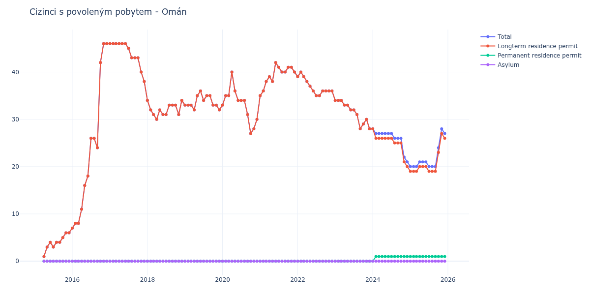

# Omán

## Souhrnné statistiky (Min/Max pro rok) / Summary Statistics (Min/Max per year)

| Year   | Total Min/Max   | Longterm Residence Permit Min/Max   | Permanent Residence Permit Min/Max   | Asylum Min/Max   |
|--------|-----------------|-------------------------------------|--------------------------------------|------------------|
| 2015   | 1 / 6           | 1 / 6                               | 0 / 0                                | 0 / 0            |
| 2016   | 7 / 46          | 7 / 46                              | 0 / 0                                | 0 / 0            |
| 2017   | 38 / 46         | 38 / 46                             | 0 / 0                                | 0 / 0            |
| 2018   | 30 / 34         | 30 / 34                             | 0 / 0                                | 0 / 0            |
| 2019   | 32 / 36         | 32 / 36                             | 0 / 0                                | 0 / 0            |
| 2020   | 27 / 40         | 27 / 40                             | 0 / 0                                | 0 / 0            |
| 2021   | 35 / 42         | 35 / 42                             | 0 / 0                                | 0 / 0            |
| 2022   | 35 / 40         | 35 / 40                             | 0 / 0                                | 0 / 0            |
| 2023   | 28 / 34         | 28 / 34                             | 0 / 0                                | 0 / 0            |
| 2024   | 21 / 28         | 20 / 28                             | 0 / 1                                | 0 / 0            |
| 2025   | 20 / 28         | 19 / 27                             | 1 / 1                                | 0 / 0            |

## Detailní tabulka / Detailed Data Table

| Date     | Total        | Longterm Residence Permit   | Permanent Residence Permit   | Asylum   |
|----------|--------------|-----------------------------|------------------------------|----------|
| **2015** |              |                             |                              |          |
| 04.2015  | 1            | 1                           | 0                            | 0        |
| 05.2015  | 3 (+200.00%) | 3 (+200.00%)                | 0                            | 0        |
| 06.2015  | 4 (+33.33%)  | 4 (+33.33%)                 | 0                            | 0        |
| 07.2015  | 3 (-25.00%)  | 3 (-25.00%)                 | 0                            | 0        |
| 08.2015  | 4 (+33.33%)  | 4 (+33.33%)                 | 0                            | 0        |
| 09.2015  | 4 (+0.00%)   | 4 (+0.00%)                  | 0                            | 0        |
| 10.2015  | 5 (+25.00%)  | 5 (+25.00%)                 | 0                            | 0        |
| 11.2015  | 6 (+20.00%)  | 6 (+20.00%)                 | 0                            | 0        |
| 12.2015  | 6 (+0.00%)   | 6 (+0.00%)                  | 0                            | 0        |
| **2016** |              |                             |                              |          |
| 01.2016  | 7 (+16.67%)  | 7 (+16.67%)                 | 0                            | 0        |
| 02.2016  | 8 (+14.29%)  | 8 (+14.29%)                 | 0                            | 0        |
| 03.2016  | 8 (+0.00%)   | 8 (+0.00%)                  | 0                            | 0        |
| 04.2016  | 11 (+37.50%) | 11 (+37.50%)                | 0                            | 0        |
| 05.2016  | 16 (+45.45%) | 16 (+45.45%)                | 0                            | 0        |
| 06.2016  | 18 (+12.50%) | 18 (+12.50%)                | 0                            | 0        |
| 07.2016  | 26 (+44.44%) | 26 (+44.44%)                | 0                            | 0        |
| 08.2016  | 26 (+0.00%)  | 26 (+0.00%)                 | 0                            | 0        |
| 09.2016  | 24 (-7.69%)  | 24 (-7.69%)                 | 0                            | 0        |
| 10.2016  | 42 (+75.00%) | 42 (+75.00%)                | 0                            | 0        |
| 11.2016  | 46 (+9.52%)  | 46 (+9.52%)                 | 0                            | 0        |
| 12.2016  | 46 (+0.00%)  | 46 (+0.00%)                 | 0                            | 0        |
| **2017** |              |                             |                              |          |
| 01.2017  | 46 (+0.00%)  | 46 (+0.00%)                 | 0                            | 0        |
| 02.2017  | 46 (+0.00%)  | 46 (+0.00%)                 | 0                            | 0        |
| 03.2017  | 46 (+0.00%)  | 46 (+0.00%)                 | 0                            | 0        |
| 04.2017  | 46 (+0.00%)  | 46 (+0.00%)                 | 0                            | 0        |
| 05.2017  | 46 (+0.00%)  | 46 (+0.00%)                 | 0                            | 0        |
| 06.2017  | 46 (+0.00%)  | 46 (+0.00%)                 | 0                            | 0        |
| 07.2017  | 45 (-2.17%)  | 45 (-2.17%)                 | 0                            | 0        |
| 08.2017  | 43 (-4.44%)  | 43 (-4.44%)                 | 0                            | 0        |
| 09.2017  | 43 (+0.00%)  | 43 (+0.00%)                 | 0                            | 0        |
| 10.2017  | 43 (+0.00%)  | 43 (+0.00%)                 | 0                            | 0        |
| 11.2017  | 40 (-6.98%)  | 40 (-6.98%)                 | 0                            | 0        |
| 12.2017  | 38 (-5.00%)  | 38 (-5.00%)                 | 0                            | 0        |
| **2018** |              |                             |                              |          |
| 01.2018  | 34 (-10.53%) | 34 (-10.53%)                | 0                            | 0        |
| 02.2018  | 32 (-5.88%)  | 32 (-5.88%)                 | 0                            | 0        |
| 03.2018  | 31 (-3.12%)  | 31 (-3.12%)                 | 0                            | 0        |
| 04.2018  | 30 (-3.23%)  | 30 (-3.23%)                 | 0                            | 0        |
| 05.2018  | 32 (+6.67%)  | 32 (+6.67%)                 | 0                            | 0        |
| 06.2018  | 31 (-3.12%)  | 31 (-3.12%)                 | 0                            | 0        |
| 07.2018  | 31 (+0.00%)  | 31 (+0.00%)                 | 0                            | 0        |
| 08.2018  | 33 (+6.45%)  | 33 (+6.45%)                 | 0                            | 0        |
| 09.2018  | 33 (+0.00%)  | 33 (+0.00%)                 | 0                            | 0        |
| 10.2018  | 33 (+0.00%)  | 33 (+0.00%)                 | 0                            | 0        |
| 11.2018  | 31 (-6.06%)  | 31 (-6.06%)                 | 0                            | 0        |
| 12.2018  | 34 (+9.68%)  | 34 (+9.68%)                 | 0                            | 0        |
| **2019** |              |                             |                              |          |
| 01.2019  | 33 (-2.94%)  | 33 (-2.94%)                 | 0                            | 0        |
| 02.2019  | 33 (+0.00%)  | 33 (+0.00%)                 | 0                            | 0        |
| 03.2019  | 33 (+0.00%)  | 33 (+0.00%)                 | 0                            | 0        |
| 04.2019  | 32 (-3.03%)  | 32 (-3.03%)                 | 0                            | 0        |
| 05.2019  | 35 (+9.38%)  | 35 (+9.38%)                 | 0                            | 0        |
| 06.2019  | 36 (+2.86%)  | 36 (+2.86%)                 | 0                            | 0        |
| 07.2019  | 34 (-5.56%)  | 34 (-5.56%)                 | 0                            | 0        |
| 08.2019  | 35 (+2.94%)  | 35 (+2.94%)                 | 0                            | 0        |
| 09.2019  | 35 (+0.00%)  | 35 (+0.00%)                 | 0                            | 0        |
| 10.2019  | 33 (-5.71%)  | 33 (-5.71%)                 | 0                            | 0        |
| 11.2019  | 33 (+0.00%)  | 33 (+0.00%)                 | 0                            | 0        |
| 12.2019  | 32 (-3.03%)  | 32 (-3.03%)                 | 0                            | 0        |
| **2020** |              |                             |                              |          |
| 01.2020  | 33 (+3.12%)  | 33 (+3.12%)                 | 0                            | 0        |
| 02.2020  | 35 (+6.06%)  | 35 (+6.06%)                 | 0                            | 0        |
| 03.2020  | 35 (+0.00%)  | 35 (+0.00%)                 | 0                            | 0        |
| 04.2020  | 40 (+14.29%) | 40 (+14.29%)                | 0                            | 0        |
| 05.2020  | 36 (-10.00%) | 36 (-10.00%)                | 0                            | 0        |
| 06.2020  | 34 (-5.56%)  | 34 (-5.56%)                 | 0                            | 0        |
| 07.2020  | 34 (+0.00%)  | 34 (+0.00%)                 | 0                            | 0        |
| 08.2020  | 34 (+0.00%)  | 34 (+0.00%)                 | 0                            | 0        |
| 09.2020  | 31 (-8.82%)  | 31 (-8.82%)                 | 0                            | 0        |
| 10.2020  | 27 (-12.90%) | 27 (-12.90%)                | 0                            | 0        |
| 11.2020  | 28 (+3.70%)  | 28 (+3.70%)                 | 0                            | 0        |
| 12.2020  | 30 (+7.14%)  | 30 (+7.14%)                 | 0                            | 0        |
| **2021** |              |                             |                              |          |
| 01.2021  | 35 (+16.67%) | 35 (+16.67%)                | 0                            | 0        |
| 02.2021  | 36 (+2.86%)  | 36 (+2.86%)                 | 0                            | 0        |
| 03.2021  | 38 (+5.56%)  | 38 (+5.56%)                 | 0                            | 0        |
| 04.2021  | 39 (+2.63%)  | 39 (+2.63%)                 | 0                            | 0        |
| 05.2021  | 38 (-2.56%)  | 38 (-2.56%)                 | 0                            | 0        |
| 06.2021  | 42 (+10.53%) | 42 (+10.53%)                | 0                            | 0        |
| 07.2021  | 41 (-2.38%)  | 41 (-2.38%)                 | 0                            | 0        |
| 08.2021  | 40 (-2.44%)  | 40 (-2.44%)                 | 0                            | 0        |
| 09.2021  | 40 (+0.00%)  | 40 (+0.00%)                 | 0                            | 0        |
| 10.2021  | 41 (+2.50%)  | 41 (+2.50%)                 | 0                            | 0        |
| 11.2021  | 41 (+0.00%)  | 41 (+0.00%)                 | 0                            | 0        |
| 12.2021  | 40 (-2.44%)  | 40 (-2.44%)                 | 0                            | 0        |
| **2022** |              |                             |                              |          |
| 01.2022  | 39 (-2.50%)  | 39 (-2.50%)                 | 0                            | 0        |
| 02.2022  | 40 (+2.56%)  | 40 (+2.56%)                 | 0                            | 0        |
| 03.2022  | 39 (-2.50%)  | 39 (-2.50%)                 | 0                            | 0        |
| 04.2022  | 38 (-2.56%)  | 38 (-2.56%)                 | 0                            | 0        |
| 05.2022  | 37 (-2.63%)  | 37 (-2.63%)                 | 0                            | 0        |
| 06.2022  | 36 (-2.70%)  | 36 (-2.70%)                 | 0                            | 0        |
| 07.2022  | 35 (-2.78%)  | 35 (-2.78%)                 | 0                            | 0        |
| 08.2022  | 35 (+0.00%)  | 35 (+0.00%)                 | 0                            | 0        |
| 09.2022  | 36 (+2.86%)  | 36 (+2.86%)                 | 0                            | 0        |
| 10.2022  | 36 (+0.00%)  | 36 (+0.00%)                 | 0                            | 0        |
| 11.2022  | 36 (+0.00%)  | 36 (+0.00%)                 | 0                            | 0        |
| 12.2022  | 36 (+0.00%)  | 36 (+0.00%)                 | 0                            | 0        |
| **2023** |              |                             |                              |          |
| 01.2023  | 34 (-5.56%)  | 34 (-5.56%)                 | 0                            | 0        |
| 02.2023  | 34 (+0.00%)  | 34 (+0.00%)                 | 0                            | 0        |
| 03.2023  | 34 (+0.00%)  | 34 (+0.00%)                 | 0                            | 0        |
| 04.2023  | 33 (-2.94%)  | 33 (-2.94%)                 | 0                            | 0        |
| 05.2023  | 33 (+0.00%)  | 33 (+0.00%)                 | 0                            | 0        |
| 06.2023  | 32 (-3.03%)  | 32 (-3.03%)                 | 0                            | 0        |
| 07.2023  | 32 (+0.00%)  | 32 (+0.00%)                 | 0                            | 0        |
| 08.2023  | 31 (-3.12%)  | 31 (-3.12%)                 | 0                            | 0        |
| 09.2023  | 28 (-9.68%)  | 28 (-9.68%)                 | 0                            | 0        |
| 10.2023  | 29 (+3.57%)  | 29 (+3.57%)                 | 0                            | 0        |
| 11.2023  | 30 (+3.45%)  | 30 (+3.45%)                 | 0                            | 0        |
| 12.2023  | 28 (-6.67%)  | 28 (-6.67%)                 | 0                            | 0        |
| **2024** |              |                             |                              |          |
| 01.2024  | 28 (+0.00%)  | 28 (+0.00%)                 | 0                            | 0        |
| 02.2024  | 27 (-3.57%)  | 26 (-7.14%)                 | 1                            | 0        |
| 03.2024  | 27 (+0.00%)  | 26 (+0.00%)                 | 1 (+0.00%)                   | 0        |
| 04.2024  | 27 (+0.00%)  | 26 (+0.00%)                 | 1 (+0.00%)                   | 0        |
| 05.2024  | 27 (+0.00%)  | 26 (+0.00%)                 | 1 (+0.00%)                   | 0        |
| 06.2024  | 27 (+0.00%)  | 26 (+0.00%)                 | 1 (+0.00%)                   | 0        |
| 07.2024  | 27 (+0.00%)  | 26 (+0.00%)                 | 1 (+0.00%)                   | 0        |
| 08.2024  | 26 (-3.70%)  | 25 (-3.85%)                 | 1 (+0.00%)                   | 0        |
| 09.2024  | 26 (+0.00%)  | 25 (+0.00%)                 | 1 (+0.00%)                   | 0        |
| 10.2024  | 26 (+0.00%)  | 25 (+0.00%)                 | 1 (+0.00%)                   | 0        |
| 11.2024  | 22 (-15.38%) | 21 (-16.00%)                | 1 (+0.00%)                   | 0        |
| 12.2024  | 21 (-4.55%)  | 20 (-4.76%)                 | 1 (+0.00%)                   | 0        |
| **2025** |              |                             |                              |          |
| 01.2025  | 20 (-4.76%)  | 19 (-5.00%)                 | 1 (+0.00%)                   | 0        |
| 02.2025  | 20 (+0.00%)  | 19 (+0.00%)                 | 1 (+0.00%)                   | 0        |
| 03.2025  | 20 (+0.00%)  | 19 (+0.00%)                 | 1 (+0.00%)                   | 0        |
| 04.2025  | 21 (+5.00%)  | 20 (+5.26%)                 | 1 (+0.00%)                   | 0        |
| 05.2025  | 21 (+0.00%)  | 20 (+0.00%)                 | 1 (+0.00%)                   | 0        |
| 06.2025  | 21 (+0.00%)  | 20 (+0.00%)                 | 1 (+0.00%)                   | 0        |
| 07.2025  | 20 (-4.76%)  | 19 (-5.00%)                 | 1 (+0.00%)                   | 0        |
| 08.2025  | 20 (+0.00%)  | 19 (+0.00%)                 | 1 (+0.00%)                   | 0        |
| 09.2025  | 20 (+0.00%)  | 19 (+0.00%)                 | 1 (+0.00%)                   | 0        |
| 10.2025  | 24 (+20.00%) | 23 (+21.05%)                | 1 (+0.00%)                   | 0        |
| 11.2025  | 28 (+16.67%) | 27 (+17.39%)                | 1 (+0.00%)                   | 0        |
| 12.2025  | 27 (-3.57%)  | 26 (-3.70%)                 | 1 (+0.00%)                   | 0        |
