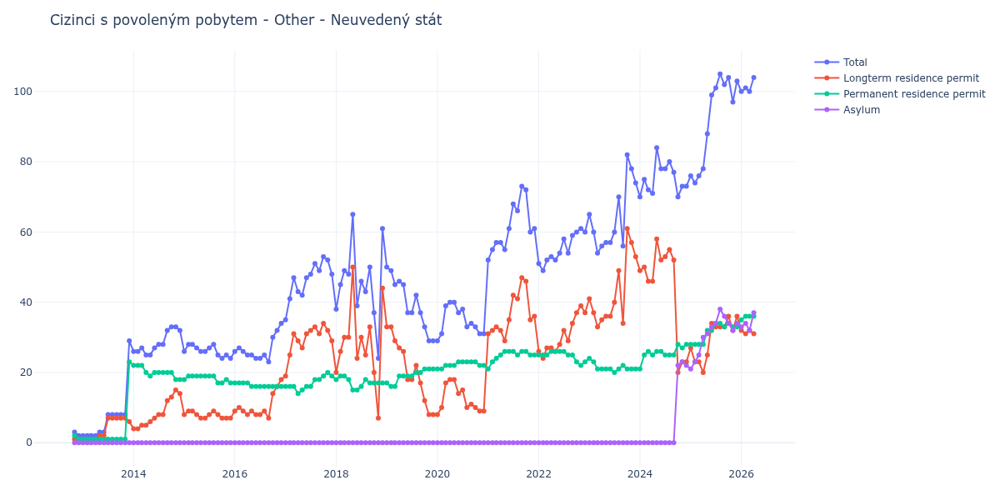

# Other - Neuvedený stát

## Souhrnné statistiky (Min/Max pro rok) / Summary Statistics (Min/Max per year)

| Year   | Total     | Longterm Residence Permit   | Permanent Residence Permit   | Asylum   |
|--------|-----------|-----------------------------|------------------------------|----------|
| 2012   | 2 / 3     | 1 / 1                       | 1 / 2                        | 0 / 0    |
| 2013   | 2 / 29    | 1 / 7                       | 1 / 23                       | 0 / 0    |
| 2014   | 25 / 33   | 4 / 15                      | 18 / 22                      | 0 / 0    |
| 2015   | 24 / 28   | 7 / 9                       | 17 / 19                      | 0 / 0    |
| 2016   | 23 / 34   | 7 / 18                      | 16 / 17                      | 0 / 0    |
| 2017   | 35 / 53   | 19 / 34                     | 14 / 20                      | 0 / 0    |
| 2018   | 24 / 65   | 7 / 50                      | 15 / 19                      | 0 / 0    |
| 2019   | 29 / 50   | 8 / 33                      | 16 / 21                      | 0 / 0    |
| 2020   | 29 / 40   | 8 / 18                      | 21 / 23                      | 0 / 0    |
| 2021   | 52 / 73   | 29 / 47                     | 21 / 26                      | 0 / 0    |
| 2022   | 49 / 61   | 24 / 39                     | 22 / 26                      | 0 / 0    |
| 2023   | 54 / 82   | 33 / 61                     | 20 / 24                      | 0 / 0    |
| 2024   | 70 / 84   | 20 / 58                     | 21 / 28                      | 0 / 23   |
| 2025   | 74 / 105  | 20 / 36                     | 28 / 34                      | 21 / 38  |
| 2026   | 100 / 104 | 31 / 32                     | 35 / 36                      | 32 / 37  |

## Detailní tabulka / Detailed Data Table

| Date     | Total         | Longterm Residence Permit   | Permanent Residence Permit   | Asylum       |
|----------|---------------|-----------------------------|------------------------------|--------------|
| **2012** |               |                             |                              |              |
| 11.2012  | 3             | 1                           | 2                            | 0            |
| 12.2012  | 2 (-33.33%)   | 1 (+0.00%)                  | 1 (-50.00%)                  | 0            |
| **2013** |               |                             |                              |              |
| 01.2013  | 2 (+0.00%)    | 1 (+0.00%)                  | 1 (+0.00%)                   | 0            |
| 02.2013  | 2 (+0.00%)    | 1 (+0.00%)                  | 1 (+0.00%)                   | 0            |
| 03.2013  | 2 (+0.00%)    | 1 (+0.00%)                  | 1 (+0.00%)                   | 0            |
| 04.2013  | 2 (+0.00%)    | 1 (+0.00%)                  | 1 (+0.00%)                   | 0            |
| 05.2013  | 3 (+50.00%)   | 2 (+100.00%)                | 1 (+0.00%)                   | 0            |
| 06.2013  | 3 (+0.00%)    | 2 (+0.00%)                  | 1 (+0.00%)                   | 0            |
| 07.2013  | 8 (+166.67%)  | 7 (+250.00%)                | 1 (+0.00%)                   | 0            |
| 08.2013  | 8 (+0.00%)    | 7 (+0.00%)                  | 1 (+0.00%)                   | 0            |
| 09.2013  | 8 (+0.00%)    | 7 (+0.00%)                  | 1 (+0.00%)                   | 0            |
| 10.2013  | 8 (+0.00%)    | 7 (+0.00%)                  | 1 (+0.00%)                   | 0            |
| 11.2013  | 8 (+0.00%)    | 7 (+0.00%)                  | 1 (+0.00%)                   | 0            |
| 12.2013  | 29 (+262.50%) | 6 (-14.29%)                 | 23 (+2200.00%)               | 0            |
| **2014** |               |                             |                              |              |
| 01.2014  | 26 (-10.34%)  | 4 (-33.33%)                 | 22 (-4.35%)                  | 0            |
| 02.2014  | 26 (+0.00%)   | 4 (+0.00%)                  | 22 (+0.00%)                  | 0            |
| 03.2014  | 27 (+3.85%)   | 5 (+25.00%)                 | 22 (+0.00%)                  | 0            |
| 04.2014  | 25 (-7.41%)   | 5 (+0.00%)                  | 20 (-9.09%)                  | 0            |
| 05.2014  | 25 (+0.00%)   | 6 (+20.00%)                 | 19 (-5.00%)                  | 0            |
| 06.2014  | 27 (+8.00%)   | 7 (+16.67%)                 | 20 (+5.26%)                  | 0            |
| 07.2014  | 28 (+3.70%)   | 8 (+14.29%)                 | 20 (+0.00%)                  | 0            |
| 08.2014  | 28 (+0.00%)   | 8 (+0.00%)                  | 20 (+0.00%)                  | 0            |
| 09.2014  | 32 (+14.29%)  | 12 (+50.00%)                | 20 (+0.00%)                  | 0            |
| 10.2014  | 33 (+3.12%)   | 13 (+8.33%)                 | 20 (+0.00%)                  | 0            |
| 11.2014  | 33 (+0.00%)   | 15 (+15.38%)                | 18 (-10.00%)                 | 0            |
| 12.2014  | 32 (-3.03%)   | 14 (-6.67%)                 | 18 (+0.00%)                  | 0            |
| **2015** |               |                             |                              |              |
| 01.2015  | 26 (-18.75%)  | 8 (-42.86%)                 | 18 (+0.00%)                  | 0            |
| 02.2015  | 28 (+7.69%)   | 9 (+12.50%)                 | 19 (+5.56%)                  | 0            |
| 03.2015  | 28 (+0.00%)   | 9 (+0.00%)                  | 19 (+0.00%)                  | 0            |
| 04.2015  | 27 (-3.57%)   | 8 (-11.11%)                 | 19 (+0.00%)                  | 0            |
| 05.2015  | 26 (-3.70%)   | 7 (-12.50%)                 | 19 (+0.00%)                  | 0            |
| 06.2015  | 26 (+0.00%)   | 7 (+0.00%)                  | 19 (+0.00%)                  | 0            |
| 07.2015  | 27 (+3.85%)   | 8 (+14.29%)                 | 19 (+0.00%)                  | 0            |
| 08.2015  | 28 (+3.70%)   | 9 (+12.50%)                 | 19 (+0.00%)                  | 0            |
| 09.2015  | 25 (-10.71%)  | 8 (-11.11%)                 | 17 (-10.53%)                 | 0            |
| 10.2015  | 24 (-4.00%)   | 7 (-12.50%)                 | 17 (+0.00%)                  | 0            |
| 11.2015  | 25 (+4.17%)   | 7 (+0.00%)                  | 18 (+5.88%)                  | 0            |
| 12.2015  | 24 (-4.00%)   | 7 (+0.00%)                  | 17 (-5.56%)                  | 0            |
| **2016** |               |                             |                              |              |
| 01.2016  | 26 (+8.33%)   | 9 (+28.57%)                 | 17 (+0.00%)                  | 0            |
| 02.2016  | 27 (+3.85%)   | 10 (+11.11%)                | 17 (+0.00%)                  | 0            |
| 03.2016  | 26 (-3.70%)   | 9 (-10.00%)                 | 17 (+0.00%)                  | 0            |
| 04.2016  | 25 (-3.85%)   | 8 (-11.11%)                 | 17 (+0.00%)                  | 0            |
| 05.2016  | 25 (+0.00%)   | 9 (+12.50%)                 | 16 (-5.88%)                  | 0            |
| 06.2016  | 24 (-4.00%)   | 8 (-11.11%)                 | 16 (+0.00%)                  | 0            |
| 07.2016  | 24 (+0.00%)   | 8 (+0.00%)                  | 16 (+0.00%)                  | 0            |
| 08.2016  | 25 (+4.17%)   | 9 (+12.50%)                 | 16 (+0.00%)                  | 0            |
| 09.2016  | 23 (-8.00%)   | 7 (-22.22%)                 | 16 (+0.00%)                  | 0            |
| 10.2016  | 30 (+30.43%)  | 14 (+100.00%)               | 16 (+0.00%)                  | 0            |
| 11.2016  | 32 (+6.67%)   | 16 (+14.29%)                | 16 (+0.00%)                  | 0            |
| 12.2016  | 34 (+6.25%)   | 18 (+12.50%)                | 16 (+0.00%)                  | 0            |
| **2017** |               |                             |                              |              |
| 01.2017  | 35 (+2.94%)   | 19 (+5.56%)                 | 16 (+0.00%)                  | 0            |
| 02.2017  | 41 (+17.14%)  | 25 (+31.58%)                | 16 (+0.00%)                  | 0            |
| 03.2017  | 47 (+14.63%)  | 31 (+24.00%)                | 16 (+0.00%)                  | 0            |
| 04.2017  | 43 (-8.51%)   | 29 (-6.45%)                 | 14 (-12.50%)                 | 0            |
| 05.2017  | 42 (-2.33%)   | 27 (-6.90%)                 | 15 (+7.14%)                  | 0            |
| 06.2017  | 47 (+11.90%)  | 31 (+14.81%)                | 16 (+6.67%)                  | 0            |
| 07.2017  | 48 (+2.13%)   | 32 (+3.23%)                 | 16 (+0.00%)                  | 0            |
| 08.2017  | 51 (+6.25%)   | 33 (+3.12%)                 | 18 (+12.50%)                 | 0            |
| 09.2017  | 49 (-3.92%)   | 31 (-6.06%)                 | 18 (+0.00%)                  | 0            |
| 10.2017  | 53 (+8.16%)   | 34 (+9.68%)                 | 19 (+5.56%)                  | 0            |
| 11.2017  | 52 (-1.89%)   | 32 (-5.88%)                 | 20 (+5.26%)                  | 0            |
| 12.2017  | 48 (-7.69%)   | 29 (-9.38%)                 | 19 (-5.00%)                  | 0            |
| **2018** |               |                             |                              |              |
| 01.2018  | 38 (-20.83%)  | 20 (-31.03%)                | 18 (-5.26%)                  | 0            |
| 02.2018  | 45 (+18.42%)  | 26 (+30.00%)                | 19 (+5.56%)                  | 0            |
| 03.2018  | 49 (+8.89%)   | 30 (+15.38%)                | 19 (+0.00%)                  | 0            |
| 04.2018  | 48 (-2.04%)   | 30 (+0.00%)                 | 18 (-5.26%)                  | 0            |
| 05.2018  | 65 (+35.42%)  | 50 (+66.67%)                | 15 (-16.67%)                 | 0            |
| 06.2018  | 39 (-40.00%)  | 24 (-52.00%)                | 15 (+0.00%)                  | 0            |
| 07.2018  | 46 (+17.95%)  | 30 (+25.00%)                | 16 (+6.67%)                  | 0            |
| 08.2018  | 43 (-6.52%)   | 25 (-16.67%)                | 18 (+12.50%)                 | 0            |
| 09.2018  | 50 (+16.28%)  | 33 (+32.00%)                | 17 (-5.56%)                  | 0            |
| 10.2018  | 37 (-26.00%)  | 20 (-39.39%)                | 17 (+0.00%)                  | 0            |
| 11.2018  | 24 (-35.14%)  | 7 (-65.00%)                 | 17 (+0.00%)                  | 0            |
| 12.2018  | 61 (+154.17%) | 44 (+528.57%)               | 17 (+0.00%)                  | 0            |
| **2019** |               |                             |                              |              |
| 01.2019  | 50 (-18.03%)  | 33 (-25.00%)                | 17 (+0.00%)                  | 0            |
| 02.2019  | 49 (-2.00%)   | 33 (+0.00%)                 | 16 (-5.88%)                  | 0            |
| 03.2019  | 45 (-8.16%)   | 29 (-12.12%)                | 16 (+0.00%)                  | 0            |
| 04.2019  | 46 (+2.22%)   | 27 (-6.90%)                 | 19 (+18.75%)                 | 0            |
| 05.2019  | 45 (-2.17%)   | 26 (-3.70%)                 | 19 (+0.00%)                  | 0            |
| 06.2019  | 37 (-17.78%)  | 18 (-30.77%)                | 19 (+0.00%)                  | 0            |
| 07.2019  | 37 (+0.00%)   | 18 (+0.00%)                 | 19 (+0.00%)                  | 0            |
| 08.2019  | 42 (+13.51%)  | 22 (+22.22%)                | 20 (+5.26%)                  | 0            |
| 09.2019  | 37 (-11.90%)  | 17 (-22.73%)                | 20 (+0.00%)                  | 0            |
| 10.2019  | 33 (-10.81%)  | 12 (-29.41%)                | 21 (+5.00%)                  | 0            |
| 11.2019  | 29 (-12.12%)  | 8 (-33.33%)                 | 21 (+0.00%)                  | 0            |
| 12.2019  | 29 (+0.00%)   | 8 (+0.00%)                  | 21 (+0.00%)                  | 0            |
| **2020** |               |                             |                              |              |
| 01.2020  | 29 (+0.00%)   | 8 (+0.00%)                  | 21 (+0.00%)                  | 0            |
| 02.2020  | 31 (+6.90%)   | 10 (+25.00%)                | 21 (+0.00%)                  | 0            |
| 03.2020  | 39 (+25.81%)  | 17 (+70.00%)                | 22 (+4.76%)                  | 0            |
| 04.2020  | 40 (+2.56%)   | 18 (+5.88%)                 | 22 (+0.00%)                  | 0            |
| 05.2020  | 40 (+0.00%)   | 18 (+0.00%)                 | 22 (+0.00%)                  | 0            |
| 06.2020  | 37 (-7.50%)   | 14 (-22.22%)                | 23 (+4.55%)                  | 0            |
| 07.2020  | 38 (+2.70%)   | 15 (+7.14%)                 | 23 (+0.00%)                  | 0            |
| 08.2020  | 33 (-13.16%)  | 10 (-33.33%)                | 23 (+0.00%)                  | 0            |
| 09.2020  | 34 (+3.03%)   | 11 (+10.00%)                | 23 (+0.00%)                  | 0            |
| 10.2020  | 33 (-2.94%)   | 10 (-9.09%)                 | 23 (+0.00%)                  | 0            |
| 11.2020  | 31 (-6.06%)   | 9 (-10.00%)                 | 22 (-4.35%)                  | 0            |
| 12.2020  | 31 (+0.00%)   | 9 (+0.00%)                  | 22 (+0.00%)                  | 0            |
| **2021** |               |                             |                              |              |
| 01.2021  | 52 (+67.74%)  | 31 (+244.44%)               | 21 (-4.55%)                  | 0            |
| 02.2021  | 55 (+5.77%)   | 32 (+3.23%)                 | 23 (+9.52%)                  | 0            |
| 03.2021  | 57 (+3.64%)   | 33 (+3.12%)                 | 24 (+4.35%)                  | 0            |
| 04.2021  | 57 (+0.00%)   | 32 (-3.03%)                 | 25 (+4.17%)                  | 0            |
| 05.2021  | 55 (-3.51%)   | 29 (-9.38%)                 | 26 (+4.00%)                  | 0            |
| 06.2021  | 61 (+10.91%)  | 35 (+20.69%)                | 26 (+0.00%)                  | 0            |
| 07.2021  | 68 (+11.48%)  | 42 (+20.00%)                | 26 (+0.00%)                  | 0            |
| 08.2021  | 66 (-2.94%)   | 41 (-2.38%)                 | 25 (-3.85%)                  | 0            |
| 09.2021  | 73 (+10.61%)  | 47 (+14.63%)                | 26 (+4.00%)                  | 0            |
| 10.2021  | 72 (-1.37%)   | 46 (-2.13%)                 | 26 (+0.00%)                  | 0            |
| 11.2021  | 60 (-16.67%)  | 35 (-23.91%)                | 25 (-3.85%)                  | 0            |
| 12.2021  | 61 (+1.67%)   | 36 (+2.86%)                 | 25 (+0.00%)                  | 0            |
| **2022** |               |                             |                              |              |
| 01.2022  | 51 (-16.39%)  | 26 (-27.78%)                | 25 (+0.00%)                  | 0            |
| 02.2022  | 49 (-3.92%)   | 24 (-7.69%)                 | 25 (+0.00%)                  | 0            |
| 03.2022  | 52 (+6.12%)   | 27 (+12.50%)                | 25 (+0.00%)                  | 0            |
| 04.2022  | 53 (+1.92%)   | 27 (+0.00%)                 | 26 (+4.00%)                  | 0            |
| 05.2022  | 52 (-1.89%)   | 26 (-3.70%)                 | 26 (+0.00%)                  | 0            |
| 06.2022  | 54 (+3.85%)   | 28 (+7.69%)                 | 26 (+0.00%)                  | 0            |
| 07.2022  | 58 (+7.41%)   | 32 (+14.29%)                | 26 (+0.00%)                  | 0            |
| 08.2022  | 54 (-6.90%)   | 29 (-9.38%)                 | 25 (-3.85%)                  | 0            |
| 09.2022  | 59 (+9.26%)   | 34 (+17.24%)                | 25 (+0.00%)                  | 0            |
| 10.2022  | 60 (+1.69%)   | 37 (+8.82%)                 | 23 (-8.00%)                  | 0            |
| 11.2022  | 61 (+1.67%)   | 39 (+5.41%)                 | 22 (-4.35%)                  | 0            |
| 12.2022  | 60 (-1.64%)   | 37 (-5.13%)                 | 23 (+4.55%)                  | 0            |
| **2023** |               |                             |                              |              |
| 01.2023  | 65 (+8.33%)   | 41 (+10.81%)                | 24 (+4.35%)                  | 0            |
| 02.2023  | 60 (-7.69%)   | 37 (-9.76%)                 | 23 (-4.17%)                  | 0            |
| 03.2023  | 54 (-10.00%)  | 33 (-10.81%)                | 21 (-8.70%)                  | 0            |
| 04.2023  | 56 (+3.70%)   | 35 (+6.06%)                 | 21 (+0.00%)                  | 0            |
| 05.2023  | 57 (+1.79%)   | 36 (+2.86%)                 | 21 (+0.00%)                  | 0            |
| 06.2023  | 57 (+0.00%)   | 36 (+0.00%)                 | 21 (+0.00%)                  | 0            |
| 07.2023  | 60 (+5.26%)   | 40 (+11.11%)                | 20 (-4.76%)                  | 0            |
| 08.2023  | 70 (+16.67%)  | 49 (+22.50%)                | 21 (+5.00%)                  | 0            |
| 09.2023  | 56 (-20.00%)  | 34 (-30.61%)                | 22 (+4.76%)                  | 0            |
| 10.2023  | 82 (+46.43%)  | 61 (+79.41%)                | 21 (-4.55%)                  | 0            |
| 11.2023  | 78 (-4.88%)   | 57 (-6.56%)                 | 21 (+0.00%)                  | 0            |
| 12.2023  | 74 (-5.13%)   | 53 (-7.02%)                 | 21 (+0.00%)                  | 0            |
| **2024** |               |                             |                              |              |
| 01.2024  | 70 (-5.41%)   | 49 (-7.55%)                 | 21 (+0.00%)                  | 0            |
| 02.2024  | 75 (+7.14%)   | 50 (+2.04%)                 | 25 (+19.05%)                 | 0            |
| 03.2024  | 72 (-4.00%)   | 46 (-8.00%)                 | 26 (+4.00%)                  | 0            |
| 04.2024  | 71 (-1.39%)   | 46 (+0.00%)                 | 25 (-3.85%)                  | 0            |
| 05.2024  | 84 (+18.31%)  | 58 (+26.09%)                | 26 (+4.00%)                  | 0            |
| 06.2024  | 78 (-7.14%)   | 52 (-10.34%)                | 26 (+0.00%)                  | 0            |
| 07.2024  | 78 (+0.00%)   | 53 (+1.92%)                 | 25 (-3.85%)                  | 0            |
| 08.2024  | 80 (+2.56%)   | 55 (+3.77%)                 | 25 (+0.00%)                  | 0            |
| 09.2024  | 77 (-3.75%)   | 52 (-5.45%)                 | 25 (+0.00%)                  | 0            |
| 10.2024  | 70 (-9.09%)   | 20 (-61.54%)                | 28 (+12.00%)                 | 22           |
| 11.2024  | 73 (+4.29%)   | 23 (+15.00%)                | 27 (-3.57%)                  | 23 (+4.55%)  |
| 12.2024  | 73 (+0.00%)   | 23 (+0.00%)                 | 28 (+3.70%)                  | 22 (-4.35%)  |
| **2025** |               |                             |                              |              |
| 01.2025  | 76 (+4.11%)   | 27 (+17.39%)                | 28 (+0.00%)                  | 21 (-4.55%)  |
| 02.2025  | 74 (-2.63%)   | 23 (-14.81%)                | 28 (+0.00%)                  | 23 (+9.52%)  |
| 03.2025  | 76 (+2.70%)   | 23 (+0.00%)                 | 28 (+0.00%)                  | 25 (+8.70%)  |
| 04.2025  | 78 (+2.63%)   | 20 (-13.04%)                | 28 (+0.00%)                  | 30 (+20.00%) |
| 05.2025  | 88 (+12.82%)  | 25 (+25.00%)                | 32 (+14.29%)                 | 31 (+3.33%)  |
| 06.2025  | 99 (+12.50%)  | 34 (+36.00%)                | 32 (+0.00%)                  | 33 (+6.45%)  |
| 07.2025  | 101 (+2.02%)  | 33 (-2.94%)                 | 34 (+6.25%)                  | 34 (+3.03%)  |
| 08.2025  | 105 (+3.96%)  | 33 (+0.00%)                 | 34 (+0.00%)                  | 38 (+11.76%) |
| 09.2025  | 102 (-2.86%)  | 33 (+0.00%)                 | 33 (-2.94%)                  | 36 (-5.26%)  |
| 10.2025  | 104 (+1.96%)  | 36 (+9.09%)                 | 34 (+3.03%)                  | 34 (-5.56%)  |
| 11.2025  | 97 (-6.73%)   | 32 (-11.11%)                | 33 (-2.94%)                  | 32 (-5.88%)  |
| 12.2025  | 103 (+6.19%)  | 36 (+12.50%)                | 33 (+0.00%)                  | 34 (+6.25%)  |
| **2026** |               |                             |                              |              |
| 01.2026  | 100 (-2.91%)  | 32 (-11.11%)                | 35 (+6.06%)                  | 33 (-2.94%)  |
| 02.2026  | 101 (+1.00%)  | 31 (-3.12%)                 | 36 (+2.86%)                  | 34 (+3.03%)  |
| 03.2026  | 100 (-0.99%)  | 32 (+3.23%)                 | 36 (+0.00%)                  | 32 (-5.88%)  |
| 04.2026  | 104 (+4.00%)  | 31 (-3.12%)                 | 36 (+0.00%)                  | 37 (+15.62%) |
