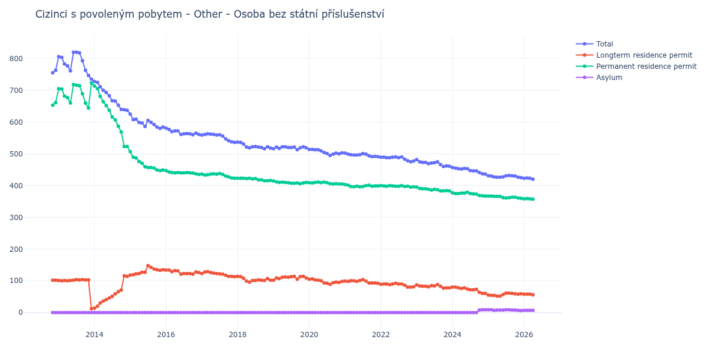

# Other - Osoba bez státní příslušenství

## Souhrnné statistiky (Min/Max pro rok) / Summary Statistics (Min/Max per year)

| Year   | Total     | Longterm Residence Permit   | Permanent Residence Permit   | Asylum   |
|--------|-----------|-----------------------------|------------------------------|----------|
| 2012   | 755 / 763 | 102 / 102                   | 653 / 661                    | 0 / 0    |
| 2013   | 735 / 820 | 12 / 104                    | 644 / 723                    | 0 / 0    |
| 2014   | 637 / 728 | 14 / 116                    | 523 / 714                    | 0 / 0    |
| 2015   | 580 / 625 | 118 / 148                   | 447 / 507                    | 0 / 0    |
| 2016   | 560 / 581 | 121 / 134                   | 435 / 447                    | 0 / 0    |
| 2017   | 536 / 563 | 113 / 129                   | 423 / 438                    | 0 / 0    |
| 2018   | 516 / 537 | 96 / 114                    | 415 / 423                    | 0 / 0    |
| 2019   | 513 / 522 | 102 / 114                   | 406 / 414                    | 0 / 0    |
| 2020   | 495 / 514 | 89 / 106                    | 405 / 411                    | 0 / 0    |
| 2021   | 491 / 502 | 92 / 104                    | 396 / 403                    | 0 / 0    |
| 2022   | 475 / 490 | 80 / 92                     | 395 / 400                    | 0 / 0    |
| 2023   | 460 / 482 | 77 / 88                     | 383 / 395                    | 0 / 0    |
| 2024   | 436 / 457 | 60 / 80                     | 367 / 379                    | 0 / 9    |
| 2025   | 425 / 432 | 52 / 61                     | 360 / 367                    | 6 / 9    |
| 2026   | 420 / 424 | 56 / 58                     | 357 / 359                    | 7 / 7    |

## Detailní tabulka / Detailed Data Table

| Date     | Total        | Longterm Residence Permit   | Permanent Residence Permit   | Asylum      |
|----------|--------------|-----------------------------|------------------------------|-------------|
| **2012** |              |                             |                              |             |
| 11.2012  | 755          | 102                         | 653                          | 0           |
| 12.2012  | 763 (+1.06%) | 102 (+0.00%)                | 661 (+1.23%)                 | 0           |
| **2013** |              |                             |                              |             |
| 01.2013  | 806 (+5.64%) | 101 (-0.98%)                | 705 (+6.66%)                 | 0           |
| 02.2013  | 804 (-0.25%) | 100 (-0.99%)                | 704 (-0.14%)                 | 0           |
| 03.2013  | 783 (-2.61%) | 101 (+1.00%)                | 682 (-3.12%)                 | 0           |
| 04.2013  | 777 (-0.77%) | 100 (-0.99%)                | 677 (-0.73%)                 | 0           |
| 05.2013  | 761 (-2.06%) | 101 (+1.00%)                | 660 (-2.51%)                 | 0           |
| 06.2013  | 820 (+7.75%) | 102 (+0.99%)                | 718 (+8.79%)                 | 0           |
| 07.2013  | 820 (+0.00%) | 104 (+1.96%)                | 716 (-0.28%)                 | 0           |
| 08.2013  | 818 (-0.24%) | 103 (-0.96%)                | 715 (-0.14%)                 | 0           |
| 09.2013  | 793 (-3.06%) | 104 (+0.97%)                | 689 (-3.64%)                 | 0           |
| 10.2013  | 763 (-3.78%) | 103 (-0.96%)                | 660 (-4.21%)                 | 0           |
| 11.2013  | 747 (-2.10%) | 103 (+0.00%)                | 644 (-2.42%)                 | 0           |
| 12.2013  | 735 (-1.61%) | 12 (-88.35%)                | 723 (+12.27%)                | 0           |
| **2014** |              |                             |                              |             |
| 01.2014  | 728 (-0.95%) | 14 (+16.67%)                | 714 (-1.24%)                 | 0           |
| 02.2014  | 725 (-0.41%) | 20 (+42.86%)                | 705 (-1.26%)                 | 0           |
| 03.2014  | 711 (-1.93%) | 30 (+50.00%)                | 681 (-3.40%)                 | 0           |
| 04.2014  | 700 (-1.55%) | 36 (+20.00%)                | 664 (-2.50%)                 | 0           |
| 05.2014  | 693 (-1.00%) | 41 (+13.89%)                | 652 (-1.81%)                 | 0           |
| 06.2014  | 683 (-1.44%) | 46 (+12.20%)                | 637 (-2.30%)                 | 0           |
| 07.2014  | 667 (-2.34%) | 51 (+10.87%)                | 616 (-3.30%)                 | 0           |
| 08.2014  | 666 (-0.15%) | 59 (+15.69%)                | 607 (-1.46%)                 | 0           |
| 09.2014  | 653 (-1.95%) | 66 (+11.86%)                | 587 (-3.29%)                 | 0           |
| 10.2014  | 640 (-1.99%) | 71 (+7.58%)                 | 569 (-3.07%)                 | 0           |
| 11.2014  | 639 (-0.16%) | 116 (+63.38%)               | 523 (-8.08%)                 | 0           |
| 12.2014  | 637 (-0.31%) | 114 (-1.72%)                | 523 (+0.00%)                 | 0           |
| **2015** |              |                             |                              |             |
| 01.2015  | 625 (-1.88%) | 118 (+3.51%)                | 507 (-3.06%)                 | 0           |
| 02.2015  | 608 (-2.72%) | 119 (+0.85%)                | 489 (-3.55%)                 | 0           |
| 03.2015  | 609 (+0.16%) | 122 (+2.52%)                | 487 (-0.41%)                 | 0           |
| 04.2015  | 599 (-1.64%) | 123 (+0.82%)                | 476 (-2.26%)                 | 0           |
| 05.2015  | 597 (-0.33%) | 127 (+3.25%)                | 470 (-1.26%)                 | 0           |
| 06.2015  | 586 (-1.84%) | 127 (+0.00%)                | 459 (-2.34%)                 | 0           |
| 07.2015  | 605 (+3.24%) | 148 (+16.54%)               | 457 (-0.44%)                 | 0           |
| 08.2015  | 599 (-0.99%) | 142 (-4.05%)                | 457 (+0.00%)                 | 0           |
| 09.2015  | 592 (-1.17%) | 137 (-3.52%)                | 455 (-0.44%)                 | 0           |
| 10.2015  | 584 (-1.35%) | 135 (-1.46%)                | 449 (-1.32%)                 | 0           |
| 11.2015  | 580 (-0.68%) | 133 (-1.48%)                | 447 (-0.45%)                 | 0           |
| 12.2015  | 584 (+0.69%) | 135 (+1.50%)                | 449 (+0.45%)                 | 0           |
| **2016** |              |                             |                              |             |
| 01.2016  | 581 (-0.51%) | 134 (-0.74%)                | 447 (-0.45%)                 | 0           |
| 02.2016  | 577 (-0.69%) | 134 (+0.00%)                | 443 (-0.89%)                 | 0           |
| 03.2016  | 570 (-1.21%) | 129 (-3.73%)                | 441 (-0.45%)                 | 0           |
| 04.2016  | 572 (+0.35%) | 132 (+2.33%)                | 440 (-0.23%)                 | 0           |
| 05.2016  | 572 (+0.00%) | 131 (-0.76%)                | 441 (+0.23%)                 | 0           |
| 06.2016  | 561 (-1.92%) | 121 (-7.63%)                | 440 (-0.23%)                 | 0           |
| 07.2016  | 563 (+0.36%) | 123 (+1.65%)                | 440 (+0.00%)                 | 0           |
| 08.2016  | 564 (+0.18%) | 123 (+0.00%)                | 441 (+0.23%)                 | 0           |
| 09.2016  | 563 (-0.18%) | 123 (+0.00%)                | 440 (-0.23%)                 | 0           |
| 10.2016  | 560 (-0.53%) | 121 (-1.63%)                | 439 (-0.23%)                 | 0           |
| 11.2016  | 565 (+0.89%) | 128 (+5.79%)                | 437 (-0.46%)                 | 0           |
| 12.2016  | 561 (-0.71%) | 126 (-1.56%)                | 435 (-0.46%)                 | 0           |
| **2017** |              |                             |                              |             |
| 01.2017  | 559 (-0.36%) | 123 (-2.38%)                | 436 (+0.23%)                 | 0           |
| 02.2017  | 561 (+0.36%) | 128 (+4.07%)                | 433 (-0.69%)                 | 0           |
| 03.2017  | 563 (+0.36%) | 129 (+0.78%)                | 434 (+0.23%)                 | 0           |
| 04.2017  | 562 (-0.18%) | 126 (-2.33%)                | 436 (+0.46%)                 | 0           |
| 05.2017  | 561 (-0.18%) | 124 (-1.59%)                | 437 (+0.23%)                 | 0           |
| 06.2017  | 559 (-0.36%) | 123 (-0.81%)                | 436 (-0.23%)                 | 0           |
| 07.2017  | 560 (+0.18%) | 122 (-0.81%)                | 438 (+0.46%)                 | 0           |
| 08.2017  | 556 (-0.71%) | 121 (-0.82%)                | 435 (-0.68%)                 | 0           |
| 09.2017  | 547 (-1.62%) | 117 (-3.31%)                | 430 (-1.15%)                 | 0           |
| 10.2017  | 541 (-1.10%) | 114 (-2.56%)                | 427 (-0.70%)                 | 0           |
| 11.2017  | 538 (-0.55%) | 114 (+0.00%)                | 424 (-0.70%)                 | 0           |
| 12.2017  | 536 (-0.37%) | 113 (-0.88%)                | 423 (-0.24%)                 | 0           |
| **2018** |              |                             |                              |             |
| 01.2018  | 537 (+0.19%) | 114 (+0.88%)                | 423 (+0.00%)                 | 0           |
| 02.2018  | 536 (-0.19%) | 113 (-0.88%)                | 423 (+0.00%)                 | 0           |
| 03.2018  | 531 (-0.93%) | 108 (-4.42%)                | 423 (+0.00%)                 | 0           |
| 04.2018  | 521 (-1.88%) | 99 (-8.33%)                 | 422 (-0.24%)                 | 0           |
| 05.2018  | 519 (-0.38%) | 96 (-3.03%)                 | 423 (+0.24%)                 | 0           |
| 06.2018  | 522 (+0.58%) | 101 (+5.21%)                | 421 (-0.47%)                 | 0           |
| 07.2018  | 523 (+0.19%) | 101 (+0.00%)                | 422 (+0.24%)                 | 0           |
| 08.2018  | 521 (-0.38%) | 103 (+1.98%)                | 418 (-0.95%)                 | 0           |
| 09.2018  | 520 (-0.19%) | 102 (-0.97%)                | 418 (+0.00%)                 | 0           |
| 10.2018  | 516 (-0.77%) | 101 (-0.98%)                | 415 (-0.72%)                 | 0           |
| 11.2018  | 522 (+1.16%) | 107 (+5.94%)                | 415 (+0.00%)                 | 0           |
| 12.2018  | 518 (-0.77%) | 102 (-4.67%)                | 416 (+0.24%)                 | 0           |
| **2019** |              |                             |                              |             |
| 01.2019  | 516 (-0.39%) | 102 (+0.00%)                | 414 (-0.48%)                 | 0           |
| 02.2019  | 521 (+0.97%) | 109 (+6.86%)                | 412 (-0.48%)                 | 0           |
| 03.2019  | 517 (-0.77%) | 107 (-1.83%)                | 410 (-0.49%)                 | 0           |
| 04.2019  | 522 (+0.97%) | 111 (+3.74%)                | 411 (+0.24%)                 | 0           |
| 05.2019  | 522 (+0.00%) | 112 (+0.90%)                | 410 (-0.24%)                 | 0           |
| 06.2019  | 520 (-0.38%) | 111 (-0.89%)                | 409 (-0.24%)                 | 0           |
| 07.2019  | 520 (+0.00%) | 113 (+1.80%)                | 407 (-0.49%)                 | 0           |
| 08.2019  | 521 (+0.19%) | 114 (+0.88%)                | 407 (+0.00%)                 | 0           |
| 09.2019  | 513 (-1.54%) | 105 (-7.89%)                | 408 (+0.25%)                 | 0           |
| 10.2019  | 519 (+1.17%) | 113 (+7.62%)                | 406 (-0.49%)                 | 0           |
| 11.2019  | 522 (+0.58%) | 114 (+0.88%)                | 408 (+0.49%)                 | 0           |
| 12.2019  | 519 (-0.57%) | 109 (-4.39%)                | 410 (+0.49%)                 | 0           |
| **2020** |              |                             |                              |             |
| 01.2020  | 514 (-0.96%) | 105 (-3.67%)                | 409 (-0.24%)                 | 0           |
| 02.2020  | 514 (+0.00%) | 106 (+0.95%)                | 408 (-0.24%)                 | 0           |
| 03.2020  | 513 (-0.19%) | 103 (-2.83%)                | 410 (+0.49%)                 | 0           |
| 04.2020  | 513 (+0.00%) | 102 (-0.97%)                | 411 (+0.24%)                 | 0           |
| 05.2020  | 509 (-0.78%) | 100 (-1.96%)                | 409 (-0.49%)                 | 0           |
| 06.2020  | 504 (-0.98%) | 93 (-7.00%)                 | 411 (+0.49%)                 | 0           |
| 07.2020  | 501 (-0.60%) | 92 (-1.08%)                 | 409 (-0.49%)                 | 0           |
| 08.2020  | 495 (-1.20%) | 89 (-3.26%)                 | 406 (-0.73%)                 | 0           |
| 09.2020  | 499 (+0.81%) | 94 (+5.62%)                 | 405 (-0.25%)                 | 0           |
| 10.2020  | 502 (+0.60%) | 96 (+2.13%)                 | 406 (+0.25%)                 | 0           |
| 11.2020  | 500 (-0.40%) | 95 (-1.04%)                 | 405 (-0.25%)                 | 0           |
| 12.2020  | 503 (+0.60%) | 98 (+3.16%)                 | 405 (+0.00%)                 | 0           |
| **2021** |              |                             |                              |             |
| 01.2021  | 502 (-0.20%) | 99 (+1.02%)                 | 403 (-0.49%)                 | 0           |
| 02.2021  | 499 (-0.60%) | 98 (-1.01%)                 | 401 (-0.50%)                 | 0           |
| 03.2021  | 497 (-0.40%) | 100 (+2.04%)                | 397 (-1.00%)                 | 0           |
| 04.2021  | 496 (-0.20%) | 100 (+0.00%)                | 396 (-0.25%)                 | 0           |
| 05.2021  | 496 (+0.00%) | 98 (-2.00%)                 | 398 (+0.51%)                 | 0           |
| 06.2021  | 497 (+0.20%) | 101 (+3.06%)                | 396 (-0.50%)                 | 0           |
| 07.2021  | 501 (+0.80%) | 104 (+2.97%)                | 397 (+0.25%)                 | 0           |
| 08.2021  | 499 (-0.40%) | 99 (-4.81%)                 | 400 (+0.76%)                 | 0           |
| 09.2021  | 494 (-1.00%) | 93 (-6.06%)                 | 401 (+0.25%)                 | 0           |
| 10.2021  | 491 (-0.61%) | 93 (+0.00%)                 | 398 (-0.75%)                 | 0           |
| 11.2021  | 492 (+0.20%) | 93 (+0.00%)                 | 399 (+0.25%)                 | 0           |
| 12.2021  | 491 (-0.20%) | 92 (-1.08%)                 | 399 (+0.00%)                 | 0           |
| **2022** |              |                             |                              |             |
| 01.2022  | 489 (-0.41%) | 89 (-3.26%)                 | 400 (+0.25%)                 | 0           |
| 02.2022  | 489 (+0.00%) | 90 (+1.12%)                 | 399 (-0.25%)                 | 0           |
| 03.2022  | 488 (-0.20%) | 90 (+0.00%)                 | 398 (-0.25%)                 | 0           |
| 04.2022  | 488 (+0.00%) | 88 (-2.22%)                 | 400 (+0.50%)                 | 0           |
| 05.2022  | 489 (+0.20%) | 90 (+2.27%)                 | 399 (-0.25%)                 | 0           |
| 06.2022  | 490 (+0.20%) | 92 (+2.22%)                 | 398 (-0.25%)                 | 0           |
| 07.2022  | 488 (-0.41%) | 90 (-2.17%)                 | 398 (+0.00%)                 | 0           |
| 08.2022  | 490 (+0.41%) | 90 (+0.00%)                 | 400 (+0.50%)                 | 0           |
| 09.2022  | 483 (-1.43%) | 86 (-4.44%)                 | 397 (-0.75%)                 | 0           |
| 10.2022  | 478 (-1.04%) | 80 (-6.98%)                 | 398 (+0.25%)                 | 0           |
| 11.2022  | 475 (-0.63%) | 80 (+0.00%)                 | 395 (-0.75%)                 | 0           |
| 12.2022  | 477 (+0.42%) | 81 (+1.25%)                 | 396 (+0.25%)                 | 0           |
| **2023** |              |                             |                              |             |
| 01.2023  | 482 (+1.05%) | 87 (+7.41%)                 | 395 (-0.25%)                 | 0           |
| 02.2023  | 475 (-1.45%) | 84 (-3.45%)                 | 391 (-1.01%)                 | 0           |
| 03.2023  | 473 (-0.42%) | 83 (-1.19%)                 | 390 (-0.26%)                 | 0           |
| 04.2023  | 473 (+0.00%) | 83 (+0.00%)                 | 390 (+0.00%)                 | 0           |
| 05.2023  | 469 (-0.85%) | 81 (-2.41%)                 | 388 (-0.51%)                 | 0           |
| 06.2023  | 471 (+0.43%) | 85 (+4.94%)                 | 386 (-0.52%)                 | 0           |
| 07.2023  | 472 (+0.21%) | 84 (-1.18%)                 | 388 (+0.52%)                 | 0           |
| 08.2023  | 475 (+0.64%) | 88 (+4.76%)                 | 387 (-0.26%)                 | 0           |
| 09.2023  | 466 (-1.89%) | 83 (-5.68%)                 | 383 (-1.03%)                 | 0           |
| 10.2023  | 460 (-1.29%) | 77 (-7.23%)                 | 383 (+0.00%)                 | 0           |
| 11.2023  | 462 (+0.43%) | 78 (+1.30%)                 | 384 (+0.26%)                 | 0           |
| 12.2023  | 461 (-0.22%) | 78 (+0.00%)                 | 383 (-0.26%)                 | 0           |
| **2024** |              |                             |                              |             |
| 01.2024  | 457 (-0.87%) | 80 (+2.56%)                 | 377 (-1.57%)                 | 0           |
| 02.2024  | 455 (-0.44%) | 80 (+0.00%)                 | 375 (-0.53%)                 | 0           |
| 03.2024  | 453 (-0.44%) | 78 (-2.50%)                 | 375 (+0.00%)                 | 0           |
| 04.2024  | 452 (-0.22%) | 76 (-2.56%)                 | 376 (+0.27%)                 | 0           |
| 05.2024  | 454 (+0.44%) | 78 (+2.63%)                 | 376 (+0.00%)                 | 0           |
| 06.2024  | 453 (-0.22%) | 74 (-5.13%)                 | 379 (+0.80%)                 | 0           |
| 07.2024  | 447 (-1.32%) | 72 (-2.70%)                 | 375 (-1.06%)                 | 0           |
| 08.2024  | 446 (-0.22%) | 72 (+0.00%)                 | 374 (-0.27%)                 | 0           |
| 09.2024  | 446 (+0.00%) | 73 (+1.39%)                 | 373 (-0.27%)                 | 0           |
| 10.2024  | 441 (-1.12%) | 64 (-12.33%)                | 369 (-1.07%)                 | 8           |
| 11.2024  | 437 (-0.91%) | 60 (-6.25%)                 | 368 (-0.27%)                 | 9 (+12.50%) |
| 12.2024  | 436 (-0.23%) | 60 (+0.00%)                 | 367 (-0.27%)                 | 9 (+0.00%)  |
| **2025** |              |                             |                              |             |
| 01.2025  | 431 (-1.15%) | 55 (-8.33%)                 | 367 (+0.00%)                 | 9 (+0.00%)  |
| 02.2025  | 430 (-0.23%) | 54 (-1.82%)                 | 367 (+0.00%)                 | 9 (+0.00%)  |
| 03.2025  | 427 (-0.70%) | 54 (+0.00%)                 | 366 (-0.27%)                 | 7 (-22.22%) |
| 04.2025  | 426 (-0.23%) | 52 (-3.70%)                 | 366 (+0.00%)                 | 8 (+14.29%) |
| 05.2025  | 426 (+0.00%) | 52 (+0.00%)                 | 366 (+0.00%)                 | 8 (+0.00%)  |
| 06.2025  | 427 (+0.23%) | 57 (+9.62%)                 | 362 (-1.09%)                 | 8 (+0.00%)  |
| 07.2025  | 431 (+0.94%) | 61 (+7.02%)                 | 361 (-0.28%)                 | 9 (+12.50%) |
| 08.2025  | 432 (+0.23%) | 61 (+0.00%)                 | 362 (+0.28%)                 | 9 (+0.00%)  |
| 09.2025  | 431 (-0.23%) | 60 (-1.64%)                 | 363 (+0.28%)                 | 8 (-11.11%) |
| 10.2025  | 430 (-0.23%) | 59 (-1.67%)                 | 363 (+0.00%)                 | 8 (+0.00%)  |
| 11.2025  | 426 (-0.93%) | 58 (-1.69%)                 | 361 (-0.55%)                 | 7 (-12.50%) |
| 12.2025  | 425 (-0.23%) | 59 (+1.72%)                 | 360 (-0.28%)                 | 6 (-14.29%) |
| **2026** |              |                             |                              |             |
| 01.2026  | 423 (-0.47%) | 58 (-1.69%)                 | 358 (-0.56%)                 | 7 (+16.67%) |
| 02.2026  | 424 (+0.24%) | 58 (+0.00%)                 | 359 (+0.28%)                 | 7 (+0.00%)  |
| 03.2026  | 423 (-0.24%) | 58 (+0.00%)                 | 358 (-0.28%)                 | 7 (+0.00%)  |
| 04.2026  | 420 (-0.71%) | 56 (-3.45%)                 | 357 (-0.28%)                 | 7 (+0.00%)  |
