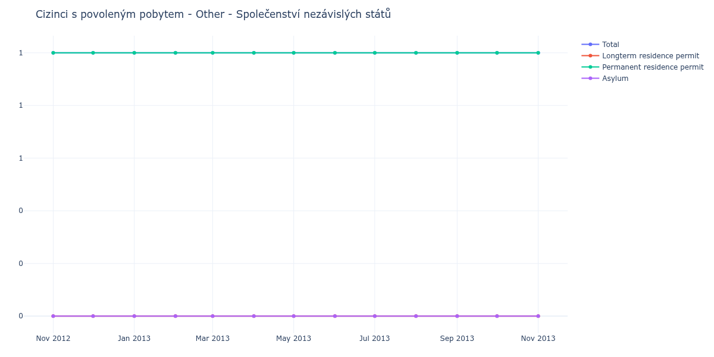

# Other - Společenství nezávislých států

## Souhrnné statistiky (Min/Max pro rok) / Summary Statistics (Min/Max per year)

| Year   | Total Min/Max   | Longterm Residence Permit Min/Max   | Permanent Residence Permit Min/Max   | Asylum Min/Max   |
|--------|-----------------|-------------------------------------|--------------------------------------|------------------|
| 2012   | 1 / 1           | 0 / 0                               | 1 / 1                                | 0 / 0            |
| 2013   | 1 / 1           | 0 / 0                               | 1 / 1                                | 0 / 0            |

## Detailní tabulka / Detailed Data Table

| Date     | Total      | Longterm Residence Permit   | Permanent Residence Permit   | Asylum   |
|----------|------------|-----------------------------|------------------------------|----------|
| **2012** |            |                             |                              |          |
| 11.2012  | 1          | 0                           | 1                            | 0        |
| 12.2012  | 1 (+0.00%) | 0                           | 1 (+0.00%)                   | 0        |
| **2013** |            |                             |                              |          |
| 01.2013  | 1 (+0.00%) | 0                           | 1 (+0.00%)                   | 0        |
| 02.2013  | 1 (+0.00%) | 0                           | 1 (+0.00%)                   | 0        |
| 03.2013  | 1 (+0.00%) | 0                           | 1 (+0.00%)                   | 0        |
| 04.2013  | 1 (+0.00%) | 0                           | 1 (+0.00%)                   | 0        |
| 05.2013  | 1 (+0.00%) | 0                           | 1 (+0.00%)                   | 0        |
| 06.2013  | 1 (+0.00%) | 0                           | 1 (+0.00%)                   | 0        |
| 07.2013  | 1 (+0.00%) | 0                           | 1 (+0.00%)                   | 0        |
| 08.2013  | 1 (+0.00%) | 0                           | 1 (+0.00%)                   | 0        |
| 09.2013  | 1 (+0.00%) | 0                           | 1 (+0.00%)                   | 0        |
| 10.2013  | 1 (+0.00%) | 0                           | 1 (+0.00%)                   | 0        |
| 11.2013  | 1 (+0.00%) | 0                           | 1 (+0.00%)                   | 0        |
